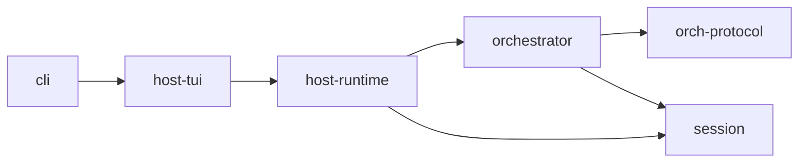

# AGENTS.md — piko project context

## Project overview

piko is a coding agent harness with a **Host + Orchestrator** architecture. It reimplements [pi](https://github.com/earendil-works/pi-mono) by splitting the monolithic runtime into layers: a stateful **Host** (sessions, TUI, settings, auth, skills, prompts, compaction) and an actor-first **Orchestrator** (agent runtime, tool routing, task delegation, event-sourced state).

The guiding principle: **replicate pi's functionality, keep the host+orchestrator split clean.**

## Architecture



- `orch-protocol/` — Pure types, zero deps beyond pi-ai types. `Orchestrator`, `HostEvent`, `AgentSpec`, `ToolSet`, `ApprovalGateway`, `OrchState`.
- `orchestrator/` — Actor-first runtime: Orchestrator facade, ActorSystem kernel, task-scoped AgentActor, ToolRegistryImpl, InMemoryEventStore, ModelStepExecutor.
- `session/` — Session storage layer: JSONL repo, message types, session metadata.
- `host-runtime/` — Host core: `PikoHost`, `SettingsManager`, `ModelRegistry`, `AuthStorage`, compaction, skills, prompt templates, context files, resource loader.
- `host-tui/` — OpenTUI + SolidJS TUI: surfaces, commands, keymap, focus, timeline, notifications, themes.
- `cli/` — `piko` binary: argument parsing, model resolution, TUI launch.

## Key files

| File | Purpose |
|---|---|
| `packages/host-runtime/src/host/index.ts` | PikoHost: system prompt, skills, compaction, session ops, orchestration |
| `packages/orchestrator/src/orchestrator/task.ts` | Task creation, routing, cancellation, and join coordination |
| `packages/orchestrator/src/actors/agent/` | AgentActor: agent run loop handler, engine loop, tool execution |
| `packages/orchestrator/src/tools/tool-registry.ts` | Tool discovery, policy, approval, and execution service |
| `packages/orchestrator/src/orchestrator.ts` | Orchestrator facade: public API for Host |
| `packages/host-runtime/src/session/session-manager.ts` | Full session lifecycle |
| `packages/host-runtime/src/settings/manager.ts` | Layered settings (global → project → CLI) |
| `packages/host-runtime/src/models/registry.ts` | Model discovery + auth integration |
| `packages/host-runtime/src/auth/storage.ts` | API key / OAuth credential storage |
| `packages/host-runtime/src/prompts/system-prompt.ts` | System prompt builder (skills, context, tools, templates) |
| `packages/host-tui/src/state/reducers/` | TUI state reducers (stream, timeline, tools, session, etc.) |
| `packages/host-tui/src/surfaces/surface-manager.ts` | Surface placement, occlusion, z-order |
| `packages/cli/src/cli.ts` | CLI entrypoint: wires SettingsManager, ModelRegistry, AuthStorage |

## Coding conventions

- **TypeScript strict mode** across all packages
- **Project references** (`tsconfig.json` `references`) for build ordering
- **ESM modules** with `.js` extension imports (Node.js ESM convention)
- **No circular dependencies** between packages
- **Tests** use `bun test`; run at root with `bun run test` or `bun test`
- **Exports** in each package's `index.ts` are the public API

## When adding features

1. If it involves LLM interaction or tool execution → orchestrator or orch-protocol
2. If it involves session, settings, auth, models, prompts, skills, compaction → host-runtime
3. If it involves UI, overlays, rendering, themes, surfaces → host-tui
4. If it involves CLI arguments, print/json/rpc modes, piped stdin → cli
5. Types shared across Host and Orchestrator → orch-protocol

## Session storage

Sessions are stored as JSONL under `~/.piko/sessions/<encoded-cwd>/<session-id>.jsonl`. The format is pi-compatible.

## Configuration

- `~/.piko/settings.json` — global settings (default model, theme, thinking level, compaction)
- `~/.piko/auth.json` — API keys per provider
- `.piko/settings.json` — project settings (overrides global)
- `.piko/skills/*.md` — project skills
- `.piko/prompts/*.md` — project prompt templates
- `.piko/themes/*.json` — project themes

## Before committing

Always run formatting and lint before committing:

```bash
bun run fmt    # biome check --fix
bun run check  # biome check && tsc -b
```

## Testing

```bash
# Full suite
bun run test  # includes the required Bun preload test setup

# Per package
bun test packages/host-runtime/
bun test packages/host-tui/
bun test packages/orchestrator/

# Orchestrator tests use FauxProvider (mock LLM)
# Host tests use FauxProvider + in-memory sessions
```

## Pi reference

When implementing features from pi-mono, the reference files are at:
- `/Users/biu/Projects/pi-mono/packages/agent/src/agent-loop.ts`
- `/Users/biu/Projects/pi-mono/packages/agent/src/harness/agent-harness.ts`
- `/Users/biu/Projects/pi-mono/packages/coding-agent/src/`

Not all pi features are implemented — see `docs/feature-parity.md` for parity status and gaps.
