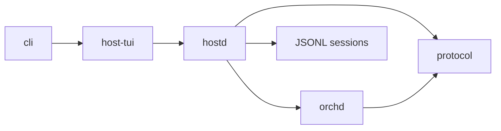

# AGENTS.md — piko project context

## Project overview

piko is a coding agent harness with a **hostd + orchd** architecture. It reimplements [pi](https://github.com/earendil-works/pi-mono) by splitting the monolithic runtime into layers: a stateful Rust **Host daemon** (sessions, TUI protocol, settings, auth, skills, prompts, compaction) and an actor-first Rust **Orchestrator** (agent runtime, tool routing, task delegation, runtime state).

The guiding principle: **replicate pi's functionality, keep the host+orchestrator split clean, and keep `hostd` authoritative for user-visible state.**

## Architecture



- `protocol/` — Pure serializable DTOs for the TUI/hostd boundary: commands, events, snapshots, messages, sessions, model config.
- `hostd/` — Rust Host daemon: JSON-lines server, session storage, settings, auth/model resolution, prompt resources, compaction, queues, orchd turn adapter.
- `orchd/` — Rust orchestrator runtime: agent loop, task orchestration, tool registry, model steps, host-facing runtime notifications.
- `host-tui/` — OpenTUI + SolidJS TUI: surfaces, commands, keymap, focus, timeline, notifications, themes.
- `cli/` — `piko` binary: argument parsing, model resolution, TUI launch.
- `sandbox/` — command/file sandbox support.

## Key files

| File | Purpose |
|---|---|
| `docs/architecture/hostd-global-plan.md` | Current hostd plan, risks, and implementation order |
| `packages/protocol/src/command.rs` | TUI → hostd command protocol and command acknowledgements |
| `packages/protocol/src/event.rs` | hostd → TUI event protocol and snapshots |
| `packages/hostd/src/server/mod.rs` | host protocol server, command routing, shared helpers |
| `packages/hostd/src/server/transport.rs` | JSON-lines stdio transport and command acknowledgements |
| `packages/hostd/src/state.rs` | Host-owned session, turn, queue, and snapshot state |
| `packages/hostd/src/turn/runner.rs` | TurnRunner abstraction and orchd adapter |
| `packages/hostd/src/session/` | JSONL session repository and pi-compatible entries |
| `packages/hostd/src/settings/` | Layered settings (global → project → CLI) |
| `packages/hostd/src/models/` | Model discovery + auth integration |
| `packages/hostd/src/prompts/` | System prompt builder (skills, context, tools, templates) |
| `packages/orchd/src/orchestrator/core.rs` | Orchestrator runtime facade used by hostd |
| `packages/orchd/src/actors/agent/` | Agent loop, model step runner, tool execution |
| `packages/orchd/src/tools/registry.rs` | Tool discovery, policy, approval, and execution service |
| `packages/host-tui/src/state/reducers/` | TUI state reducers (stream, timeline, tools, session, etc.) |
| `packages/host-tui/src/surfaces/surface-manager.ts` | Surface placement, occlusion, z-order |
| `packages/cli/src/cli.ts` | CLI entrypoint and TUI launch |

## Coding conventions

- **TypeScript strict mode** across all packages
- **Project references** (`tsconfig.json` `references`) for build ordering
- **ESM modules** with `.js` extension imports (Node.js ESM convention)
- **No circular dependencies** between packages
- **Tests** use `bun test`; run at root with `bun run test` or `bun test`
- **Exports** in each package's `index.ts` are the public API

## When adding features

1. If it involves TUI/hostd wire types → `packages/protocol` and the TS mirror in `host-tui`
2. If it involves session, settings, auth, models, prompts, skills, compaction, queue, approval state, or command routing → `hostd`
3. If it involves LLM interaction, agent loops, task orchestration, or tool execution → `orchd`
4. If it involves UI, overlays, rendering, themes, surfaces → host-tui
5. If it involves CLI arguments, print/json/rpc modes, piped stdin → cli
6. Types shared across Host and Orchestrator → `protocol`, unless they are runtime-only internals

## Session storage

Sessions are stored as JSONL under `~/.piko/sessions/<encoded-cwd>/<session-id>.jsonl`. The format is pi-compatible.

## Configuration

- `~/.piko/settings.json` — global settings (default model, theme, thinking level, compaction)
- `~/.piko/auth.json` — API keys per provider
- `.piko/settings.json` — project settings (overrides global)
- `.piko/skills/*.md` — project skills
- `.piko/prompts/*.md` — project prompt templates
- `.piko/themes/*.json` — project themes

## Before committing

Always run formatting and lint before committing:

```bash
bun run fmt    # biome check --fix
bun run check  # biome check && tsc -b
```

## Testing

```bash
# Full suite
bun run test  # includes the required Bun preload test setup

# Per package
bun test packages/host-tui/
cargo test -p hostd
cargo test -p orchd

# Rust hostd/orchd tests use mock/faux providers where possible
```

## Pi reference

When implementing features from pi-mono, the reference files are at:
- `/Users/biu/Projects/pi-mono/packages/agent/src/agent-loop.ts`
- `/Users/biu/Projects/pi-mono/packages/agent/src/harness/agent-harness.ts`
- `/Users/biu/Projects/pi-mono/packages/coding-agent/src/`

For current hostd priorities and known gaps, see `docs/status.md` and
`docs/architecture/hostd-global-plan.md`.
