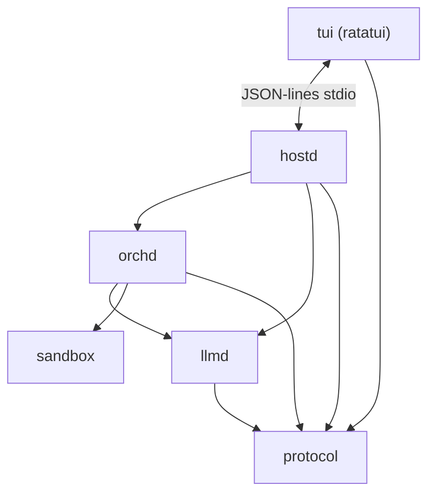

# piko

A coding agent harness with a **hostd + orchd** architecture. piko reimplements [pi](https://github.com/earendil-works/pi-mono) by splitting the monolithic runtime into a clean layered design: a stateful Rust **Host daemon** above a stream-driven Rust **Orchestrator**, with a **ratatui-based TUI** connected over JSON-lines.

> **Status:** Active development. Core hostd/orchd flows are wired; TUI surfaces, multi-agent support, and protocol semantics are being hardened.

## Architecture



```
tui ──────────────→ protocol
hostd ──→ orchd ──→ protocol
hostd ──→ llmd ───→ protocol
         orchd ──→ llmd
         orchd ──→ sandbox
sandbox (leaf)
```

| Crate | Type | Description |
|---|---|---|
| `tui` | binary | Ratatui terminal UI (CLI entrypoint, surfaces, commands, keymap, timeline, session management) |
| `hostd` | lib + bin | Host daemon (JSON-lines server, sessions, settings, auth, prompts, skills, compaction, approvals) |
| `orchd` | lib | Orchestrator runtime (Stream\<Event\>-driven agent loop, tasks, model steps, tool registry) |
| `llmd` | lib | LLM gateway (provider abstraction, OAuth, token/cost middleware, multi-provider catalog) |
| `protocol` | lib | Shared DTOs (commands, events, snapshots, messages, config, agent state, tool definitions) |
| `sandbox` | lib | Filesystem/process sandbox (ACL enforcement, command validation) |

- **tui** connects to hostd via JSON-lines stdio; hostd auto-discovered or configured via `--hostd`.
- **hostd** owns all user-visible state; orchd receives only agent specs, tool sets, and model config per turn.
- **protocol** is the single shared leaf — all inter-crate types live here.

## Quick Start

```bash
# Prerequisites: Rust toolchain
curl --proto '=https' --tlsv1.2 -sSf https://sh.rustup.rs | sh

# Clone & build
git clone <repo-url> piko
cd piko
cargo build --release

# Set API key
export ANTHROPIC_API_KEY=sk-ant-...

# Start
cargo run -p tui                          # new session
cargo run -p tui -- -c                    # continue most recent session
cargo run -p tui -- -m claude-sonnet-4-5-20250929  # specific model
cargo run -p tui -- --thinking-level high           # thinking level
cargo run -p tui -- --name "my session"             # session name
```

### CLI Reference

```
piko-tui [options]

  -m, --model <id>           Model ID
  -p, --provider <name>      Provider (e.g. anthropic, openai)
  -k, --api-key <key>        API key (forwarded to hostd)
  --thinking-level <level>   off | low | medium | high
  --session <id>             Open a specific session
  -c, --continue             Continue most recent session
  --name <name>              Session name (new sessions)
  --no-tools                 Disable all tools
  --hostd <path>             Override hostd executable path
  --hostd-arg <arg>          Extra hostd argument (repeatable)
  -h, --help                 Show help
```

Hostd auto-discovery order: `PIKO_HOSTD_PATH` env → sibling of `piko-tui` binary → `target/debug/hostd` → `target/release/hostd` → `hostd` on PATH.

## Development

### Prerequisites

- [Rust](https://rustup.rs) stable toolchain

### Project structure

```
packages/
  tui/          # Ratatui TUI (binary: piko-tui)
  hostd/        # Host daemon (lib + binary: hostd)
  orchd/        # Orchestrator runtime (lib)
  llmd/         # LLM gateway (lib)
  protocol/     # Shared DTOs (lib)
  sandbox/      # Sandbox supervisor (lib)
```

### Build, check, test

```bash
cargo build --workspace              # Build all
cargo build --release                # Optimized build
cargo check --workspace              # Fast check (no codegen)
cargo clippy --workspace --all-targets -- -D warnings  # Lint
cargo fmt --all                      # Format
cargo test --workspace               # Run all tests
```

### Per-crate testing

```bash
cargo test -p hostd
cargo test -p orchd
cargo test -p tui
cargo test -p llmd
cargo test -p protocol
cargo test -p sandbox
```

## Architecture Decisions

- **Stream-driven runtime**: orchd uses `Stream<Item = OrchEvent>` as its execution substrate — a single stream chain from LLM to hostd. No actors, no spawn.
- **Ports & Adapters**: orchd defines `ports/` (traits like `ModelGateway`, `ToolProvider`, `ApprovalGateway`). llmd, sandbox, and hostd provide implementations so orchd stays testable with mocks.
- **Host owns state**: Sessions, settings, auth, model registry, skills, and prompts all live in hostd. orchd only holds per-turn runtime state.
- **Explicit approval**: Tool approval goes through a hostd-provided `ApprovalGateway`. Each tool has a `ToolPolicy` (sensitivity + approval requirement).
- **Agent capability boundaries**: Each agent has explicit `toolSetIds`. Tool discovery respects tool set membership, active restrictions, and approval policies.
- **Domain-driven structure**: `domain/` for business logic, `ports/` for traits, `adapters/` for implementations. Hostd adds `infra/` (storage, MCP) and `protocol/` (transport, command dispatch).
- **JSON-lines protocol**: TUI ↔ hostd communication uses newline-delimited JSON over stdio. `protocol` crate defines the DTO contract shared by both sides.

## License

MIT
