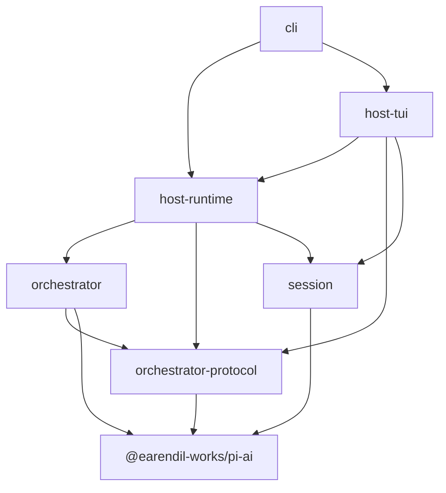

# piko

<!-- intentionally blank line after title -->

A coding agent harness with an **actor-first orchestration** architecture. piko reimplements [pi](https://github.com/earendil-works/pi-mono) by replacing pi's monolithic runtime with a clean layered design: a stateful **Host** (UI, sessions, settings, auth, skills, prompts, compaction) sits above a **stateless orchestrator** (actor-based agent runtime with tool routing, task delegation, and event-sourced state).

> **Status:** Core feature-complete. Host + Orchestrator boundary is stable. TUI is on OpenTUI + SolidJS. See [docs/implementation-gaps.md](docs/implementation-gaps.md) for remaining delta and [docs/missing-features.md](docs/missing-features.md) for full parity analysis.

## Architecture

```text
+--------------------------------------------------------------------------------------------------+
| Entry / Presentation                                                                             |
+-----------------------------------------------+--------------------------------------------------+
| cli                                           | host-tui                                         |
| args, model resolution, launch                | OpenTUI, SolidJS, commands, surfaces, timeline   |
+--------------------------------------------------------------------------------------------------+
| Host Runtime                                                                                     |
+--------------------------------------------------------------------------------------------------+
| PikoHost                                                                                         |
| turn queue, lifecycle events, skills/prompts, compaction                                         |
+------------------+------------------+------------------+----------------------+------------------+
| SettingsManager  | AuthStorage      | ModelRegistry    | SessionManager       | WorkspaceProvider|
|                  |                  |                  | PikoSessionRuntime   | OrchestratorProv.|
+--------------------------------------------------------------------------------------------------+
| Orchestrator API                                                                                 |
+-------------------------------+--------------------------------+---------------------------------+
| Orchestrator facade           | ToolRegistry                   | ModelStepExecutor               |
| run, dispatch, subscribe,     | providers, toolSets,           | streaming model call            |
| snapshot                      | approvalGateway                |                                 |
+--------------------------------------------------------------------------------------------------+
| Actor Runtime                                                                                    |
+--------------------------------------------------------------------------------------------------+
| Business Actors                                                                                  |
+---------------------+------------------------+---------------------+-----------------------------+
| MainActor           | AgentActor xN          | ToolActor xN        | StateActor                  |
| task routing        | run loop, delegation   | tool execution      | event log, snapshot         |
+--------------------------------------------------------------------------------------------------+
| Actor Kernel                                                                                     |
+-----------------------------------------------+--------------------------------------------------+
| ActorSystem                                   | Mailbox / Envelope                               |
| spawn, send, ask, stop                        | queue, correlation                               |
+--------------------------------------------------------------------------------------------------+
| Shared Foundation                                                                                |
+-----------------------------------------------+----------------------+---------------------------+
| orchestrator-protocol                         | session              | @earendil-works/pi-ai     |
| HostEvent, AgentSpec, ToolSet, OrchState      | pi-compatible JSONL  | models, messages, stream  |
+--------------------------------------------------------------------------------------------------+
```

- **Host** owns sessions, transcripts, TUI, settings, auth, skills, prompts, and compaction
- **Orchestrator** is an actor-first runtime with a two-layer structure:
  - **Actor kernel** (`Mailbox` + `Envelope` + `spawn/send/ask/stop`) — the execution substrate. Each actor gets its own mailbox; messages are processed one at a time per actor; `ask()` provides request-response with correlation IDs.
  - **Business actors** built on the kernel — `MainActor` (task routing), `AgentActor` (run loop), `ToolActor` (per-step discovery/execution), `StateActor` (event-sourced state).
- **ToolRegistry** is a DI container (not an actor) — holds singleton references to providers, tool sets, and approval gateway; injects them into each fresh ToolActor at spawn time.
- **ModelStepExecutor** is a stateless internal subsystem — one LLM call per step, provider/tool-call translation. Called by AgentActor; holds no session state.

## Quick Start

```bash
# Prerequisites: bun ≥ 1.3
curl -fsSL https://bun.sh/install | bash

# Install & build
git clone <repo-url> piko
cd piko
bun install
bun run build

# Set API key
export ANTHROPIC_API_KEY=sk-ant-...
# or use /login in TUI

# Start
bun run piko                       # new interactive session
bun run piko -c                    # continue most recent session
bun run piko -m claude-sonnet-4-5-20250929  # specify model
bun run piko --thinking high       # set thinking level
bun run piko --name "my session"  # name the session
bun run piko --no-context-files    # skip AGENTS.md loading
```

## Packages

| Package | Description |
|---|---|
| `orchestrator-protocol` | Pure types: `Orchestrator`, `HostEvent`, `AgentSpec`, `ToolSet`, `ApprovalGateway`, `OrchState` |
| `orchestrator` | Actor-first runtime: ActorSystem kernel, MainActor, AgentActor, ToolActor, StateActor, ModelStepExecutor |
| `session` | Session storage layer: JSONL repo, message types, session metadata |
| `host-runtime` | Host core: `PikoHost`, settings, auth, models, skills, prompts, compaction, session runtime |
| `host-tui` | Terminal UI: OpenTUI + SolidJS renderer, surfaces, commands, keymap, focus, timeline, notifications |
| `cli` | CLI entrypoint: argument parsing, model resolution, TUI launch |

### Dependency Graph



Arrows point from each package to the packages it imports.

## Features

### Coding Tools

Built-in tool set available to agents:

| Tool | Description | Approval |
|---|---|---|
| `read` | Read file contents with offset/limit | — |
| `bash` | Execute shell commands with optional timeout | ✅ requires |
| `edit` | Precise text replacements with `oldText`/`newText` | ✅ requires |
| `write` | Create or overwrite files | ✅ requires |
| `grep` | Search file contents for patterns | — |
| `find` | Find files by glob pattern | — |
| `ls` | List directory contents | — |
| `view_image` | Read and display image files | — |

Tools have explicit sensitivity policies (`safe`, `sensitive`, `dangerous`) and approval requirements (`never`, `always`, `on_sensitive`). Destructive tools require user approval by default.

### Multi-Agent Support

The orchestrator supports agent-based task decomposition:

- `get_orchestrator_state` — inspect current agent state
- `update_plan` — update an agent's task plan
- `delegate_to_agent` — spawn subagent tasks
- `join_subtask` — await subagent results

### Session Management

Full session tree with branching, forking, and cloning:

```text
/resume          # resume a session (with search)
/tree            # navigate session tree
/fork <entry>    # fork from a message
/clone           # clone current branch
/name <title>    # name the session
```

Sessions are stored as JSONL under `~/.piko/sessions/<encoded-cwd>/`.

### Configuration

Layered configuration (defaults → global → project → CLI flags):

```text
~/.piko/
  settings.json    # Global settings
  auth.json        # API keys
  skills/          # Global skills (*.md)
  prompts/         # Global prompt templates (*.md)
  themes/          # Global themes (*.json)
  AGENTS.md        # Global context instructions

.piko/
  settings.json    # Project settings (overrides global)
  skills/          # Project skills
  prompts/         # Project prompt templates
  themes/          # Project themes
  AGENTS.md        # Project context instructions
```

### System Prompt

The system prompt aggregates:

- **Context files**: `AGENTS.md` / `CLAUDE.md` from project, ancestors, and global `~/.piko/`
- **Skills**: `.piko/skills/*.md` with YAML frontmatter (name, description, model, thinking, tools)
- **Prompt templates**: `.piko/prompts/*.md` available as slash commands (with `$1`, `$@` argument substitution)
- **Tools**: Each agent has explicit `toolSetIds` — the agent's capability boundary

### Skills

Skills are markdown files with YAML frontmatter metadata:

```markdown
---
name: my-skill
description: Does something useful
model: anthropic/claude-sonnet-4-5-20250929
thinking: high
tools: read,edit,write
---
# Skill instructions...
```

When invoked via `/skill my-skill`, the Host temporarily applies model, thinking, and tools overrides for the turn.

### Compaction

Automatic context window management:

- Token-aware cut point detection
- LLM-based branch summarization on tree navigation
- Configurable thresholds via settings (`reserveTokens`, `keepRecentTokens`)

### Themes

Built-in dark theme. Load external themes from `.piko/themes/*.json`. Switch with `/theme <name>`.

### @file Syntax

Type `@path/to/file` in the editor to include file contents in your prompt. Supports relative and absolute paths.

## CLI Reference

```text
piko [options]

Options:
  -m, --model <id>               Model ID (e.g. "claude-sonnet-4-5-20250929")
  --provider <name>              Provider name (e.g. "anthropic")
  -c, --continue                 Continue most recent session
  --session <id>                 Resume a specific session
  --thinking <level>             off | minimal | low | medium | high | xhigh
  --api-key <key>                API key for the provider
  --system-prompt <text>         Custom system prompt (replaces default)
  --append-system-prompt <text>  Append to default system prompt
  --name <name>                  Set session name
  --no-context-files             Skip AGENTS.md / CLAUDE.md loading
  --no-tools                     Disable tool calling
  --session-dir <path>           Custom session storage directory
  --prompt-template <name>       Invoke a prompt template on startup
  --skill <name>                 Invoke a skill on startup
  --list-models                  List available models
  -h, --help                     Show help
```

## Development

### Prerequisites

- [bun](https://bun.sh) ≥ 1.3

### Setup

```bash
bun install
bun run build
```

### Project Structure

```text
piko/
  packages/
    orchestrator-protocol/  # Pure types (zero runtime deps beyond pi-ai types)
    orchestrator/           # Actor-first runtime + model step executor
    session/                # Session storage layer (JSONL, types)
    host-runtime/           # PikoHost, scheduler, settings, auth, skills, prompts, compaction
    host-tui/               # OpenTUI + SolidJS TUI, surfaces, commands, keymap, timeline
    cli/                    # CLI entrypoint
  docs/
    missing-features.md     # Feature parity checklist
    implementation-gaps.md  # Action roadmap
  tsconfig.base.json
```

### Build, Check, Test

```bash
bun run build          # TypeScript project references build
bun run check          # biome check + tsc -b
bun run clean          # Remove dist directories
bun run fmt            # biome check --fix
bun test               # Run all tests (237 tests across 22 files)
bun run check:all      # check + test
```

### Package-level testing

```bash
bun test packages/host-runtime/
bun test packages/host-tui/
bun test packages/orchestrator/
```

## Architecture Decisions

- **Actor-first runtime**: The orchestrator uses an actor kernel (`Mailbox` + `Envelope` + `spawn/send/ask/stop`) as its execution substrate. Each actor has a private mailbox and processes one message at a time. Different actors run concurrently through async scheduling. Cross-actor coordination goes through `ask()` (request-response with correlation IDs).
- **Business actors**: `MainActor` (registry, routing), `AgentActor` (transcript, run loop), `ToolActor` (per-step discovery/execution), `StateActor` (event-sourced state). `ToolRegistry` is a DI container, not an actor.
- **Stateless model executor**: The `ModelStepExecutor` (internal subsystem) receives a full messages snapshot per step. It holds no session state. This makes model calls testable, composable, and remotable.
- **Host owns state**: Sessions, settings, auth, model registry, skills, and prompts all live in the Host layer. The orchestrator only sees agent specs, tool sets, and model config.
- **Explicit approval**: Tool approval uses a Host-provided `ApprovalGateway`. The ToolActor awaits approval via an async promise; no in-memory coroutine suspension. Each tool has a `ToolPolicy` with sensitivity and approval requirement.
- **Event-sourced state**: Runtime facts are emitted as events and reduced by `StateActor`. Snapshots are available for TUI rendering and debugging.
- **Agent capability boundaries**: Each agent has explicit `toolSetIds`. Tool discovery respects tool set membership, active tool restrictions, and approval policies.

## Upstream Dependencies

- `@earendil-works/pi-ai` (^0.78.0) — LLM provider abstraction, streaming, model catalog
- `@opentui/core` + `@opentui/solid` (^0.3.1) — Terminal UI primitives for the TUI renderer
- `solid-js` (^1.9) — Reactive UI library for the TUI
- `yaml` (^2.9) — YAML frontmatter parsing for skills

## License

MIT
