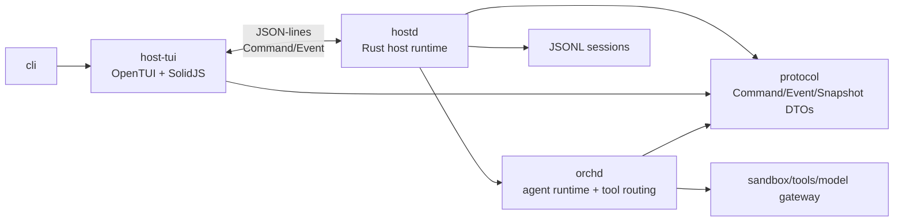
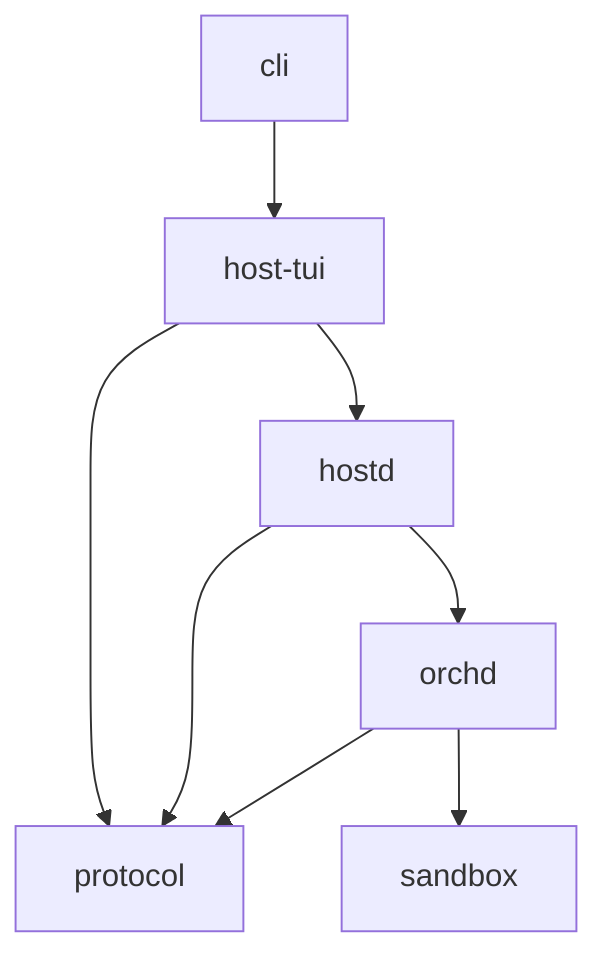

# piko

<!-- intentionally blank line after title -->

A coding agent harness with a **hostd + orchd** architecture. Originally conceived to split [pi](https://github.com/earendil-works/pi-mono)'s monolithic runtime into a clean layered design, piko is now converging on a Rust Host daemon (`hostd`) above a Rust orchestrator runtime (`orchd`), with `host-tui` connected over JSON-lines.

> **Status:** hostd is the active runtime direction. Some broad feature paths are wired, but runtime concurrency, protocol semantics, and hostd/orchd state ownership are still being hardened. See [docs/status.md](docs/status.md) and [docs/architecture/hostd-global-plan.md](docs/architecture/hostd-global-plan.md).

## Architecture



- **hostd** owns user-visible runtime state: sessions, transcripts, settings, auth, skills, prompts, compaction, queues, approvals, snapshots, and the TUI protocol.
- **orchd** owns agent execution: task orchestration, model steps, tool routing, and runtime notifications consumed by hostd.
- **protocol** is the serializable DTO contract shared by hostd, orchd, and the TypeScript TUI mirror.
- **host-tui** owns presentation state only.

## Quick Start

```bash
# Prerequisites: bun ≥ 1.3
curl -fsSL https://bun.sh/install | bash

# Install & build
git clone <repo-url> piko
cd piko
bun install
bun run build

# Set API key
export ANTHROPIC_API_KEY=sk-ant-...
# or use /login in TUI

# Start
bun run piko                       # new interactive session
bun run piko -c                    # continue most recent session
bun run piko -m claude-sonnet-4-5-20250929  # specify model
bun run piko --thinking high       # set thinking level
bun run piko --name "my session"  # name the session
bun run piko --no-context-files    # skip AGENTS.md loading
```

## Packages

| Package | Description |
|---|---|
| `protocol` | Serializable command/event/snapshot/message/session/model DTOs |
| `hostd` | Rust Host daemon: JSON-lines server, session storage, settings, auth/model, prompts/skills, queues, compaction, orchd adapter |
| `orchd` | Rust orchestrator runtime: agent loop, tasks, model steps, tool registry, approvals |
| `host-tui` | Terminal UI: OpenTUI + SolidJS renderer, surfaces, commands, keymap, focus, timeline, notifications |
| `cli` | CLI entrypoint: argument parsing, model resolution, TUI launch |
| `sandbox` | Rust-based fail-closed supervisor: filesystem ACLs, command sandboxing (optional) |

### Dependency Graph



Arrows point from each package to the packages it imports.

## Features

### Coding Tools

Built-in tool set available to agents:

| Tool | Description | Approval |
|---|---|---|
| `read` | Read file contents with offset/limit | — |
| `bash` | Execute shell commands with optional timeout | ✅ requires |
| `edit` | Precise text replacements with `oldText`/`newText` | ✅ requires |
| `write` | Create or overwrite files | ✅ requires |
| `grep` | Search file contents for patterns | — |
| `find` | Find files by glob pattern | — |
| `ls` | List directory contents | — |
| `view_image` | Read and display image files | — |

Tools have explicit sensitivity policies (`safe`, `sensitive`, `dangerous`) and approval requirements (`never`, `always`, `on_sensitive`). Destructive tools require user approval by default.

### Multi-Agent Support

The orchestrator supports agent-based task decomposition:

- `get_orchestrator_state` — inspect current agent state
- `update_plan` — update an agent's task plan
- `delegate_to_agent` — spawn subagent tasks
- `join_subtask` — await subagent results

### Session Management

Full session tree with branching, forking, and cloning:

```text
/resume          # resume a session (with search)
/tree            # navigate session tree
/fork <entry>    # fork from a message
/clone           # clone current branch
/name <title>    # name the session
```

Sessions are stored as JSONL under `~/.piko/sessions/<encoded-cwd>/`.

### Configuration

Layered configuration (defaults → global → project → CLI flags):

```text
~/.piko/
  settings.json    # Global settings
  auth.json        # API keys
  skills/          # Global skills (*.md)
  prompts/         # Global prompt templates (*.md)
  themes/          # Global themes (*.json)
  AGENTS.md        # Global context instructions

.piko/
  settings.json    # Project settings (overrides global)
  skills/          # Project skills
  prompts/         # Project prompt templates
  themes/          # Project themes
  AGENTS.md        # Project context instructions
```

### System Prompt

The system prompt aggregates:

- **Context files**: `AGENTS.md` / `CLAUDE.md` from project, ancestors, and global `~/.piko/`
- **Skills**: `.piko/skills/*.md` with YAML frontmatter (name, description, model, thinking, tools)
- **Prompt templates**: `.piko/prompts/*.md` available as slash commands (with `$1`, `$@` argument substitution)
- **Tools**: Each agent has explicit `toolSetIds` — the agent's capability boundary

### Skills

Skills are markdown files with YAML frontmatter metadata:

```markdown
---
name: my-skill
description: Does something useful
model: anthropic/claude-sonnet-4-5-20250929
thinking: high
tools: read,edit,write
---
# Skill instructions...
```

When invoked via `/skill my-skill`, the Host temporarily applies model, thinking, and tools overrides for the turn.

### Compaction

Automatic context window management:

- Token-aware cut point detection
- LLM-based branch summarization on tree navigation
- Configurable thresholds via settings (`reserveTokens`, `keepRecentTokens`)

### Themes

Built-in dark theme. Load external themes from `.piko/themes/*.json`. Switch with `/theme <name>`.

### Sandbox (optional)

A Rust-based fail-closed supervisor provides filesystem ACL enforcement and command sandboxing:

- Restricts file access to project boundaries
- Parses and validates shell commands before execution
- Opt-in via settings (`executionEnv: "sandbox"`)

See [packages/sandbox/README.md](packages/sandbox/README.md) for the current package entry point.

### @file Syntax

Type `@path/to/file` in the editor to include file contents in your prompt. Supports relative and absolute paths.

## CLI Reference

```text
piko [options]

Options:
  -m, --model <id>               Model ID (e.g. "claude-sonnet-4-5-20250929")
  --provider <name>              Provider name (e.g. "anthropic")
  -c, --continue                 Continue most recent session
  --session <id>                 Resume a specific session
  --thinking <level>             off | minimal | low | medium | high | xhigh
  --api-key <key>                API key for the provider
  --system-prompt <text>         Custom system prompt (replaces default)
  --append-system-prompt <text>  Append to default system prompt
  --name <name>                  Set session name
  --no-context-files             Skip AGENTS.md / CLAUDE.md loading
  --no-tools                     Disable tool calling
  --session-dir <path>           Custom session storage directory
  --prompt-template <name>       Invoke a prompt template on startup
  --skill <name>                 Invoke a skill on startup
  --list-models                  List available models
  -h, --help                     Show help
```

## Development

### Prerequisites

- [bun](https://bun.sh) ≥ 1.3

### Setup

```bash
bun install
bun run build
```

### Project Structure

```text
piko/
  packages/
    protocol/               # Command/Event/Snapshot DTOs
    hostd/                  # Rust Host daemon
    orchd/                  # Rust orchestrator runtime
    host-tui/               # OpenTUI + SolidJS TUI, surfaces, commands, keymap, timeline
    cli/                    # CLI entrypoint
    sandbox/                # Rust sandbox: fail-closed supervisor (Cargo project)
  docs/
    status.md               # Current status and source-of-truth pointers
    architecture/hostd-global-plan.md
  tsconfig.base.json
```

### Build, Check, Test

```bash
bun run build          # TypeScript project references build
bun run check          # biome check + tsc -b
bun run clean          # Remove dist directories
bun run fmt            # biome check --fix
bun test               # Run all tests (599 tests across 58 files)
bun run check:all      # check + test
```

### Package-level testing

```bash
bun test packages/host-tui/
cargo test -p hostd
cargo test -p orchd
```

## Architecture Decisions

- **Actor-first runtime**: The orchestrator uses an actor kernel (`Mailbox` + `Envelope` + `spawn/send/ask/stop`) as its execution substrate. Each actor has a private mailbox and processes one message at a time. Different actors run concurrently through async scheduling. Cross-actor coordination goes through `ask()` (request-response with correlation IDs).
- **Task-scoped AgentActor**: A single `AgentActor` is spawned per dispatched task. It owns the engine loop (model step → tool execution → repeat), transcript state, abort signal, and lifecycle. The actor stops itself after emitting its terminal event. No persistent per-agent actors — actors live only for the duration of a task.
- **Services, not actors**: `ToolRegistryImpl` is a stateless DI container for tool discovery, execution, and approval — not an actor. `InMemoryEventStore` is a synchronous event log with pure reducer projections and subscriber notifications — also not an actor.
- **Stateless model executor**: The `ModelStepExecutor` (internal subsystem) receives a full messages snapshot per step. It holds no session state. This makes model calls testable, composable, and remotable.
- **Host owns state**: Sessions, settings, auth, model registry, skills, and prompts all live in the Host layer. The orchestrator only sees agent specs, tool sets, and model config.
- **Explicit approval**: Tool approval uses a Host-provided `ApprovalGateway`. `ToolRegistryImpl` awaits approval via an async promise; no in-memory coroutine suspension. Each tool has a `ToolPolicy` with sensitivity and approval requirement.
- **Event-sourced state**: Runtime facts are emitted as `OrchestratorEvent`s and synchronously reduced by `InMemoryEventStore`. Snapshots are available for TUI rendering and debugging.
- **Agent capability boundaries**: Each agent has explicit `toolSetIds`. Tool discovery respects tool set membership, active tool restrictions, and approval policies.

## Upstream Dependencies

- `@earendil-works/pi-ai` (^0.78.0) — LLM provider abstraction, streaming, model catalog
- `@opentui/core` + `@opentui/solid` (^0.3.1) — Terminal UI primitives for the TUI renderer
- `solid-js` (^1.9) — Reactive UI library for the TUI
- `yaml` (^2.9) — YAML frontmatter parsing for skills

## License

MIT
