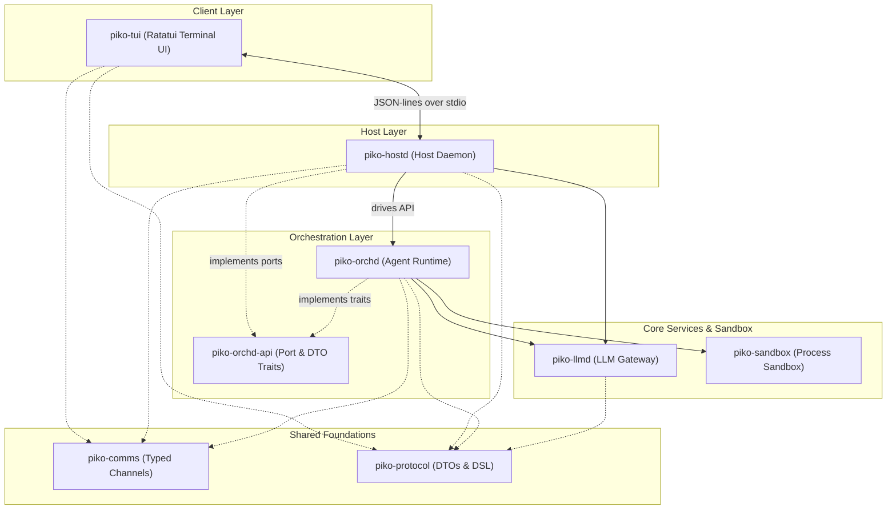

# piko

piko is a Rust-based coding agent harness with a decoupled **hostd + orchd** architecture. It separates state management (sessions, settings, auth, prompts, skills, compaction, queues, and turn orchestration) in the Host daemon from transient agent execution in the stream-driven Orchestrator. The terminal client connects to hostd over JSON-lines stdio.

Agent-runtime capabilities are being reimplemented from the codex-rs core, distilled PRD-first into piko architecture (see [Documentation & Feature Workflow](#documentation--feature-workflow)).

---

## Architecture


```mermaid
graph TD
    subgraph Client Layer
        TUI["piko-tui (Ratatui Terminal UI)"]
    end

    subgraph Host Layer
        Hostd["piko-hostd (Host Daemon)"]
    end

    subgraph Orchestration Layer
        OrchdApi["piko-orchd-api (Port & DTO Traits)"]
        Orchd["piko-orchd (Agent Runtime)"]
    end

    subgraph Core Services & Sandbox
        LLMd["piko-llmd (LLM Gateway)"]
        Sandbox["piko-sandbox (Process Sandbox)"]
    end

    subgraph Shared Foundations
        Comms["piko-comms (Typed Channels)"]
        Protocol["piko-protocol (DTOs & DSL)"]
    end

    %% Flow of control
    TUI <-->|JSON-lines over stdio| Hostd
    Hostd -.->|implements ports| OrchdApi
    Orchd -.->|implements traits| OrchdApi
    Hostd -->|drives API| Orchd
    Orchd --> LLMd
    Hostd --> LLMd
    Orchd --> Sandbox

    %% Core dependencies
    TUI -.-> Comms
    Hostd -.-> Comms
    Orchd -.-> Comms

    TUI -.-> Protocol
    Hostd -.-> Protocol
    Orchd -.-> Protocol
    LLMd -.-> Protocol
```

### Crates & Project Layout

| Crate | Directory | Type | Description |
|---|---|---|---|
| `piko-hostd` | `packages/hostd` | bin + lib (`piko-hostd`) | State authority: sessions, settings, auth, prompts, skills, compaction, queues, turn orchestration, MCP |
| `piko-orchd` | `packages/orchd` | library | Transient agent execution runtime (AgentActor & ExecutionActor scheduling) |
| `piko-orchd-api` | `packages/orchd-api` | library | Public traits, interfaces, and ports defining the Orchestrator contract |
| `piko-llmd` | `packages/llmd` | library | LLM provider registry, token/cost middleware, and OAuth provider gateway |
| `piko-sandbox` | `packages/sandbox` | library | Fail-closed process and filesystem sandbox for sandboxed CLI execution |
| `piko-protocol` | `packages/protocol` | library | Shared ubiquitous DTOs, wire formats, commands, and events |
| `piko-comms` | `packages/comms` | bin + lib | Bounded, contract-enforced async channel topology ensuring design-compliant backpressure |
| `piko-tui` | `packages/tui` | binary (`piko-tui`) | Terminal UI built with Ratatui (Timeline, Session view, Command dispatch, Keymap) |

---

## Core Design Principles

- **Host-Authoritative State:** `hostd` owns all user-visible state (sessions, prompts, settings, compaction). `orchd` is transient: it receives input, runs agent loops, and writes executions back to hostd via durability ports.
- **Clean Interface Boundary (Ports & Adapters):** `hostd` and `orchd` communicate strictly through `orchd-api`. `orchd` defines interfaces (ports) for storage, LLM, and tool approvals, allowing developers to mock components cleanly.
- **Contract-Enforced Channels:** `piko-comms` replaces ad-hoc Tokio channels. All asynchronous channels conform to predefined contracts (e.g. Mailbox, Reply, LatestState, Broadcast, ThreadBridge).
- **Stream-Driven Execution:** Step mutations, tool outputs, and LLM completions are compiled into a unified reactive stream (`Stream<Item = OrchEvent>`), avoiding raw spawns and lock contention.
- **PRD-First Development:** every behavior starts as a Feature PRD in `docs/features/` before design or implementation; the codex-rs core is evidence for differential validation, not a specification to translate.

---

## Documentation & Feature Workflow

piko follows a PRD-first documentation workflow (see [docs/README.md](docs/README.md)):

1. Every feature starts as a technology-independent PRD in `docs/features/` (numbered `F-NN`).
2. A targeted implementation design follows in `docs/design/` (`D-NN`).
3. Cross-feature decisions are recorded as ADRs in `docs/decisions/` (`ADR-NNN`).
4. Acceptance and differential validation evidence lives in `docs/verification/`.

Agent-runtime capabilities are distilled from the codex-rs core. codex-rs is
**evidence, not specification**: a behavior enters piko only when a Feature
PRD intentionally keeps it.

The global view of the codex-rs agent core and the sequencing plan live in
[docs/codex-agent-core-digest.md](docs/codex-agent-core-digest.md) and
[docs/agent-runtime-roadmap.md](docs/agent-runtime-roadmap.md).

---

## Quick Start

### Install

Ensure you have a stable [Rust toolchain](https://rustup.rs) installed:

```bash
# Clone, build, and install
git clone <repo-url> piko
cd piko
./scripts/install.sh

# Restart the shell, then run
piko
```

The installer places executables in `~/.piko/bin` and initializes editable
settings, agents, model catalogs, themes, keybindings, prompts, and skills
under `~/.piko`. Reinstalling refreshes binaries but preserves every existing
configuration file. Set `PIKO_HOME` to use a different installation root.
The installer configures zsh, bash, or fish automatically; pass
`--no-modify-path` to leave shell startup files untouched.

### Run

Set your LLM provider API key and start the terminal user interface. Run the
installer once before using source-tree development commands so the runtime
catalogs exist.

**Preferred (keeps hostd in sync):** the TUI talks to a separate
`piko-hostd` process. `cargo run -p piko-tui` rebuilds the UI only and can
silently use a stale hostd (old tools / orchd). Use the dev scripts so both
binaries are rebuilt together:

```bash
export ANTHROPIC_API_KEY=sk-ant-...

# Build hostd + tui, then run (pass-through args after the script name)
./scripts/dev-tui.sh
./scripts/dev-tui.sh -c
./scripts/dev-tui.sh -m claude-3-5-sonnet-20241022 --thinking-level medium

# Release profile
PIKO_DEV_PROFILE=release ./scripts/dev-tui.sh
```

Direct cargo (UI only; ensure hostd was built recently):

```bash
cargo build -p piko-hostd -p piko-tui
cargo run -p piko-tui
cargo run -p piko-tui -- -c
```

---

## CLI Reference

```text
piko-tui [options]

  -c, --continue             Continue the most recent session
  --session <id>             Open a specific session
  --name <name>              Set session name (only for new sessions)
  -m, --model <id>           Override the Model ID
  -p, --provider <name>      Override the Provider (e.g., anthropic, openai)
  -k, --api-key <key>        Provide API key (forwarded directly to hostd)
  --thinking-level <level>   Specify thinking level (off | low | medium | high)
  --no-tools                 Disable all tools for this session
  --hostd <path>             Override the hostd executable path
  --hostd-arg <arg>          Extra hostd argument (can be repeated)
  --log-file <path>          Path to hostd log file
  --log-level <level>        Hostd log level filter
  --debug                    Enable debug logging
  --no-log                   Disable hostd logging
  -h, --help                 Show help message
```

---

## Development

### Workspace Commands

Run check, formatting, and lint rules:

```bash
cargo fmt --all
cargo clippy --workspace --all-targets -- -D warnings
```

### Testing

Run the entire test suite or run tests for a specific crate:

```bash
# Test the entire workspace
cargo test --workspace

# Per-crate testing
cargo test -p piko-hostd
cargo test -p piko-orchd
cargo test -p piko-orchd-api
cargo test -p piko-tui
cargo test -p piko-llmd
cargo test -p piko-comms
cargo test -p piko-protocol
cargo test -p piko-sandbox
```

### Communication Topology

The communication channels are checked for drift as part of `cargo test` using the checked-in topology definition at `docs/generated/communication-topology.md`. To update or manually check the topology:

```bash
# Check for topology definition drift
cargo run -p piko-comms --bin piko-comms-topology -- --check docs/generated/communication-topology.md docs/generated/communication-topology.json

# Regenerate topology definitions
cargo run -p piko-comms --bin piko-comms-topology -- docs/generated/communication-topology.md docs/generated/communication-topology.json
```

---

## License

This project is licensed under the **Apache License, Version 2.0**. See the [LICENSE](LICENSE) file for details.
