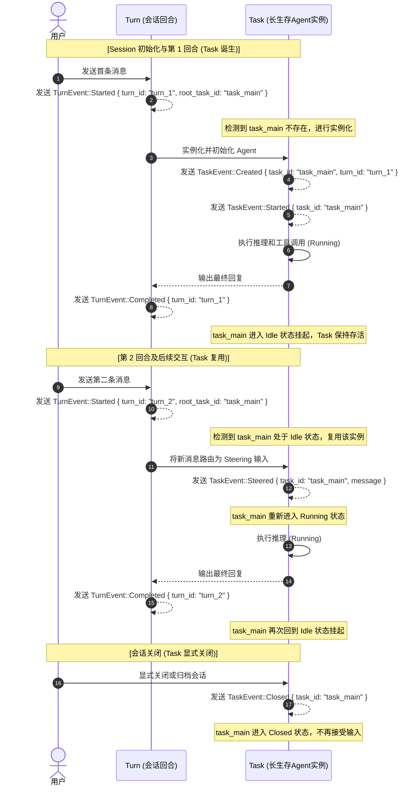

# Agent Architecture

本文档是 piko agent 系统的架构规范，覆盖 agent template 配置、加载、运行时实例、多 agent 编排、持久化、恢复和 TUI 展示。字段身份定义以 `docs/agent-identity.md` 为准。

---

## 1. Scope

Agent 系统包含三个核心概念，明确其关联与映射关系：

- **Agent template (静态模板)**：静态能力定义，主键为 `agent_id`。定义了 Persona、可用模型、可用工具等配置，由 hostd 加载并传给 orchd。
- **Agent task instance (运行时实例)**：主键为 `task_id`。**一个 Task 是一个 Agent 的运行时实例**。Task 是长期存活（long-lived）的执行实体，除非被显式 `Closed`，否则 Task 保持可交互。一次 Turn 或委派工作完成不等于 Task 关闭。
- **Turn (交互回合)**：主键为 `turn_id`。表示一次输入到输出的完整交互循环（例如：用户发送消息 -> 助手回复，或者工具调用 -> 返回结果）。

### 关联与映射关系 (Agent -> Task -> Turn)

1. **Agent (1) -> Task (N)**:
   - 一个 Agent 模板可以实例化为多个运行时的 Task 实例。例如，主会话实例化为一个 `main` 任务，工具调用也可以独立 spawn 出多个 `coder` 任务。
2. **Task (1) -> Turn (N)**:
   - 一个 Task 在其生命周期内可以跨越并处理多个后续的 Turn（交互回合）。
   - 主 Agent 实例（`main`）在 Session 初始化时被实例化为唯一的根 Task（Root Task）。后续的所有聊天对话（每个 turn）都作为输入（Steer）关联并发送给这同一个长生存的主 Task，而**不会**在每个 Turn 提交时创建新的 Root Task。
   - 子 Agent 实例（如被 spawn 的 `coder`）也是长生存的，主 Agent 与其后续的多次交互回合都直接关联在已创建的子 Task 上，以维持其执行状态和局部记忆的连续性。

`agent_id` 不能作为运行时节点主键；`task_id` 才是 task DAG、agent panel、steering、resume restore 的节点 identity。

---

## 2. Template Configuration

hostd owns the agent template registry.

Built-in templates are TOML resources:

```text
packages/hostd/resources/agents/
  main.toml
  general.toml
  scout.toml
  coder.toml
```

Workspace templates are TOML files:

```text
.piko/agents/*.toml
```

The file stem is the `agent_id`. For example:

```text
.piko/agents/reviewer.toml -> agent_id = "reviewer"
```

`main` is the fixed root-turn template id. `general` is the default delegated-task template id for spawn calls that omit `agent_id`.

### TOML Schema

```toml
name = "Scout"
role = "researcher"
description = "Expert at searching the web and summarizing documentation."
system_prompt = "You are Scout, a specialized web researcher..."
tool_set_ids = ["builtin", "web"]
model = { provider = "anthropic", modelId = "claude-3-5-sonnet-20241022" }
thinking_level = "medium"
active_tool_names = ["read", "web_search"]
```

Fields:

| Field | Required | Meaning |
|---|---|---|
| `name` | yes | Display name. Not identity. |
| `role` | yes | Short role label for UI and tool schema descriptions. |
| `description` | no | Capability description used for discovery. |
| `system_prompt` | yes | Template system prompt. |
| `tool_set_ids` | no | Tool sets enabled for this template. Defaults to hostd agent loader defaults. |
| `model` | no | Template-level model override. Missing means inherit session/global model config. |
| `thinking_level` | no | Template-level thinking override. Missing means inherit session/global thinking config. |
| `active_tool_names` | no | Template-level allow-list within enabled tool sets. |

### Loading Rules

1. hostd loads built-in TOML resources first.
2. hostd loads global user templates from `~/.piko/agents/*.toml`.
3. hostd loads workspace templates from `.piko/agents/*.toml`.
4. Later sources override earlier sources with the same `agent_id`.
5. The merged registry must contain `main` and `general`.
6. The merged `HashMap<agent_id, AgentSpec>` is passed into `OrchdConfig`.

Malformed templates are skipped with diagnostics. A malformed workspace template must not corrupt the built-in registry.

---

## 3. Discovery and Selection

`AgentSpecList` returns the merged template registry. It is a template list, not a runtime task list.

The spawn tools expose available templates through their `agent_id` schema description. Omitted spawn `agent_id` means `general`.

Selection rules:

- Root turns always select `main`.
- Explicit spawn `agent_id` selects that template.
- Missing/empty spawn `agent_id` resolves to `general`.
- Runtime must not synthesize `subagent`, `generic`, or an empty id.
- `name` is never accepted as a routing key.

---

## 4. Runtime Model

### 任务生命周期与创建

- **根任务（Root Task）的创建**：在 Session 初始化时创建唯一的根任务。
  - `task_id` = 生成的根任务 ID（如整个会话复用同一个或在首轮创建）
  - `agent_id` = `"main"`
  - `parent_task_id` = `None`
  - `source_agent_id` = `None`
  
  后续的每一次聊天 Turn 都作为输入推送给该根任务，不重新创建新的根任务。

- **子任务（Spawned Task）的创建**：当 Agent 显式调用 `spawn` 或 `spawn_detached` 工具时创建子任务实例。
  - `task_id` = 生成的子任务 ID
  - `agent_id` = 选择的模板 ID，缺省为 `"general"`
  - `parent_task_id` = 父任务 `task_id`
  - `source_agent_id` = 父任务的 `agent_id`

- **长期生存与显式关闭**：
  - 一个 Task 实例一旦创建就是长期生存的（Long-lived），能够维持连续的上下文状态。
  - 一次工作完成只产生结果报告，并使 Task 回到 `Idle`。Task 只有收到显式关闭指令时才进入 `Closed`。
  - 未被显式关闭的任务在多次 Turn 或人工介入中始终保持可交互。

### Agent, Task, Turn 生命周期与事件设计

为了支持任务的长生命周期（Long-lived）并支持多回合交互，我们将生命周期和事件进行了如下解耦和映射设计：

#### 0. 生命周期与流程图示

##### Task 状态机状态转移 (State Diagram)

```mermaid
stateDiagram-v2
    [*] --> Created : TaskEvent::Created
    Created --> Running : TaskEvent::Started
    Running --> Idle : Work completed / TurnEvent::Completed
    Idle --> Running : TaskEvent::Steered (新Turn消息驱动)
    Running --> Idle : Work failed/cancelled (可继续修正)
    Running --> Closed : TaskEvent::Closed (显式关闭)
    Idle --> Closed : TaskEvent::Closed (显式关闭)
    Closed --> Idle : TaskEvent::Reopened (显式恢复)
```

##### 主会话多回合交互时序 (Sequence Diagram)



#### 1. 概念生命周期模型

- **Agent (静态能力)**：
  - 生命周期从配置文件载入/更新开始，直到 hostd 服务终止。在运行时无状态，不参与事件流。
- **Task (运行时实例)**：
  - 状态：`Created` (已创建) -> `Running` (执行中) -> `Idle` (空闲/挂起，等待新输入) -> `Closed` (显式关闭，不再接受输入)。
  - **Task 是长生存的**：进入 `Idle` 状态时，Task 并不销毁或标记为结束。它在 `Idle` 状态下等待新的指令（Turn）或外部输入。
- **Turn (交互回合)**：
  - 状态：`Started` -> `Executing` -> `Finished` (Completed/Failed/Cancelled)。
  - Turn 表示一次具体的输入输出交互。它是临时的，一轮问答完毕即告终结。

#### 2. 生命周期事件流程与映射

- **第一阶段：逻辑初始化与首个交互回合 (Task 诞生)**
  1. 用户在 Session 启动时发送首条消息，触发根回合启动事件：`TurnEvent::Started { turn_id, root_task_id }`。
  2. 系统检测到对应 `root_task_id` 的 Root Task 不存在，实例化主 Agent，触发 Task 创建与启动事件：
     - `TaskEvent::Created { task_id, agent_id: "main", parent_task_id: None, turn_id }`
     - `TaskEvent::Started { task_id, agent_id: "main" }`
  3. Root Task 处理当前回合的推理与工具调用。
  4. 回合执行结束，输出最终回复：
     - 发送 `TurnEvent::Completed { turn_id }` 表示当前回合交互结束。
     - Root Task 不触发 `TaskEvent::Closed`，而是进入 `Idle` 状态挂起。

- **第二阶段：后续回合的交互 (Task 复用)**
  1. 用户再次发送新消息，触发新回合启动事件：`TurnEvent::Started { turn_id, root_task_id }`（此时 `root_task_id` 与上一轮完全相同）。
  2. 系统检测到 `root_task_id` 的 Task 处于 `Idle` 状态，将新消息作为 Steering 引导输入发送给该任务，触发：
     - `TaskEvent::Steered { task_id, message, source_task_id }`
     - Task 重新进入 `Running` 状态执行。
  3. 新一轮推理结束，发送：
     - `TurnEvent::Completed { turn_id }`（当前 Turn 结束，Task 继续回到 `Idle` 状态挂起）。

- **第三阶段：任务的显式关闭**
  - 对于**子任务 (Spawned Task)**：子任务完成被指派的职责后返回报告并进入 `Idle`，仍可被用户或父任务 `Steered`。
  - 对于**根任务 (Root Task)**：每轮用户交互完成后也进入 `Idle`。
  - 任何 Task 只有在用户、父任务或系统明确关闭时，才会发送 `TaskEvent::Closed` 并停止接受 `Steered`。
  - 如果需要继续操作已关闭的 Task，必须先发送显式 `TaskEvent::Reopened`，使其回到 `Idle`。

#### 3. 状态与映射设计 (Status Mapping)

为了在协议、存储和 TUI 中一致地表述生命周期，我们设计了三个层面的状态枚举：

- **TurnStatus (会话回合状态)**：
  定义在协议层，表示单回合对话在客户端/会话维度的运行状态。
  - `Idle`: 闲置中，等待输入。
  - `Running`: 正在生成回复或执行工具。
  - `WaitingForApproval`: 等待用户审批工具调用。
  - `Cancelling`: 正在取消中。
  - `Completed` / `Failed` / `Cancelled`: 终结状态。

- **WorkResultStatus (工作单元结果状态)**：
  定义一次 Turn 或 delegated work 的结果，不定义 Task 是否可继续交互。
  - `Completed`: 当前工作完成并产生报告。
  - `Failed`: 当前工作失败，Task 可保持 `Idle` 等待用户修正或继续 steer。
  - `Cancelled`: 当前工作被取消，Task 可保持 `Idle`，除非同时收到显式关闭。

- **AgentTaskStatus (任务/DAG 状态)**：
  定义在持久化存储和 Orchd 执行层，表示 Task 实例底层的生命周期。
  - `Queued`: 任务排队中。
  - `Running`: 正在执行推理或运行工具。
  - `Idle`: 挂起空闲中（在长生存模型下，`Idle` 是独立状态，表示任务已完成上一回合，正处于挂起等待新 Turn 的 Steer 输入阶段）。
  - `Closed`: 显式关闭后不再接受输入。关闭不是工作完成；工作完成由 Turn/work result 表达。

- **AgentStatus (TUI 面板展示状态)**：
  定义在 TUI 展示层，是 `AgentInfo` 的关键属性，用于在 AgentPanel/AgentList 中渲染状态指示器（如 ●、✓、✗、⠋）。
  - `Idle`: 闲置/空闲状态（在 TUI 上渲染为灰色/暗色静止圆点 ●）。
  - `Running`: 运行中（TUI 渲染为彩色转动菊花 ⠋ 或黄色圆点）。
  - `Closed`: 已显式关闭（TUI 渲染为静止关闭状态）。最近一次工作成功、失败或取消是该 Task 的结果元数据，不是可交互生命周期状态。

#### 4. Task 状态机转移校验规则 (Validation Rules)

为了确保长生存任务与 Turn 之间的生命周期不会产生不一致（例如，关闭态任务被非法重新激活，或越过 Created 直接运行），`orchd` 的领域逻辑层（`domain::tasks::lifecycle`）对 Task 状态转移进行强状态机管控：

- **状态转移规则矩阵**：

| 起始状态 (From) | 目标状态 (To) | 合法性 | 说明 |
|---|---|---|---|
| `Queued` | `Running` | **合法 (Ok)** | 任务通过 `TaskEvent::Started` 正常启动执行 |
| `Queued` | `Closed` | **合法 (Ok)** | 任务在启动前被显式关闭 |
| `Running` | `Idle` | **合法 (Ok)** | 当前 Turn 或工作单元完成、失败或取消，Task 挂起等待新输入 |
| `Running` | `Closed` | **合法 (Ok)** | 任务在运行中被显式关闭 |
| `Idle` | `Running` | **合法 (Ok)** | 通过 `TaskEvent::Steered` 传入新指令，任务再次激活 |
| `Idle` | `Closed` | **合法 (Ok)** | 处于空闲状态的任务被用户或父任务显式关闭 |
| `Closed` | `Idle` | **合法 (Ok)** | 通过显式 reopen 恢复为可交互任务 |
| `Closed` | `Running` | **非法 (Err)** | 已关闭任务必须先 reopen，再接受 steer 运行 |
| 任何状态 | 自身状态 | **合法 (Ok)** | 允许自环（等幂转移） |

任何破坏上述转移矩阵的非授权状态转移操作都将在领域方法层（`task_started`, `task_idle`, `task_closed` 等）抛出 `Err` 异常并阻断执行，防止任务在多次 Turn 交互中发生生命周期失控。

The task DAG is authoritative for runtime relationships. Parent/child hierarchy is never inferred from `agent_id`, `name`, JSONL shard name, or event order.

---

## 5. Orchd Execution

orchd receives the merged `AgentSpec` registry from hostd. Each agent task instance runs through `agent_loop`.

For a task instance, orchd uses:

- `task_id` for runtime identity.
- `agent_id` to fetch `AgentSpec`.
- `AgentSpec.system_prompt` as the agent persona.
- `AgentSpec.model` / inherited model config for model selection.
- `AgentSpec.tool_set_ids` and `active_tool_names` for tool availability.
- `parent_task_id` and `source_agent_id` for task lifecycle metadata.

Spawn tools create child task instances:

| Tool | Parent behavior | Child behavior | Return |
|---|---|---|---|
| `spawn_detached` | Create child and continue | Child runs independently; work completion returns it to `Idle` | `{ task_id, status: "detached" }` |
| `spawn` | Create child and wait for current work report | Child remains available after reporting unless explicitly closed | Child report as tool result |
| `poll_task` | Query latest work report | No child behavior change | Report or not-ready |
| `steer_task` | Send steering to `task_id` | Child consumes steering next step | Delivery status |

---

## 6. Event Contract

Events tied to agent runtime must carry both:

```text
task_id
agent_id
```

`task_id` routes to the runtime instance. `agent_id` groups by template and allows hostd/TUI to resolve display labels.

Task creation event:

```rust
TaskEvent::Created {
    session_id,
    task_id,
    agent_id,
    parent_task_id,
    source_agent_id,
    prompt,
    turn_id,
    timestamp,
}
```

Task lifecycle events describe whether a runtime task can accept more input. They do not report whether the latest work succeeded:

```rust
TaskEvent::Created { ... }
TaskEvent::Started { ... }
TaskEvent::Steered { ... }
TaskEvent::Idle { summary, total_steps, ... }
TaskEvent::Closed { ... }
TaskEvent::Reopened { ... }
```

Turn or delegated-work completion is reported by `TaskEvent::Idle`:

```rust
TaskEvent::Idle {
    task_id,
    agent_id,
    summary,
    total_steps,
    ...
}
```

`spawn`, `spawn_detached`, and `poll_task` consume the latest `Idle` report. `steer_task` consumes task lifecycle state and is valid for `Idle` or `Running` tasks, but not for `Closed` tasks unless they are explicitly reopened first.

Persist events commit transcript facts:

```rust
PersistEvent::Finalized { session_id, message_id, task_id, agent_id, message }
PersistEvent::ToolCallCommitted { session_id, message_id, task_id, agent_id, parent_message_id, message }
PersistEvent::ToolResultCommitted { session_id, message_id, task_id, agent_id, message }
PersistEvent::TaskEventCommitted(task_event)
```

Display events are live rendering inputs. They must also include `task_id` and `agent_id`, but they are not the transcript/resume source of truth.

---

## 7. Hostd Runtime State

hostd is authoritative for user-visible agent state:

- template registry loaded from TOML resources/files.
- task DAG from `TaskEvent`.
- runtime agent projection for TUI.
- per-task live view store.
- session storage and snapshots.

Hostd projections:

| Projection | Key | Source |
|---|---|---|
| Agent template registry | `agent_id` | TOML resources/files |
| Task DAG | `task_id` | `TaskEvent` |
| Agent panel rows | `task_id` | task DAG + `AgentSpec` display fields |
| Per-task view store | `task_id` | display/lifecycle/interaction events |
| Foreground subscribed view | `task_id` | one concrete runtime task view |

`AgentConnected` / `AgentDisconnected` are projections of task lifecycle. They are not independent sources of truth.

---

## 8. Persistence

Session storage is a directory:

```text
~/.piko/sessions/<encoded-cwd>/<session-id>/
  main.jsonl
  <agent-id>.jsonl
  tasks.json
```

### JSONL Transcript Shards

`main.jsonl` stores session header, user/root transcript, and session metadata.

`<agent-id>.jsonl` stores committed transcript entries produced by task instances that reference that template id. The file name is only a shard key.

Message/tool entries written by an agent task must include:

```text
agent_id
task_id
```

This is required because the same `agent_id` may be spawned multiple times in the same session.

### `tasks.json`

`tasks.json` is the durable task DAG sidecar. It is keyed by `task_id`.

Each task record stores:

```text
task_id
agent_id
parent_task_id
source_agent_id
prompt
status
latest_result_status
summary/error
updated_at
```

`tasks.json` is the persistence source for runtime hierarchy. JSONL shard names are not used to infer parent/child relationships.

---

## 9. Resume

Resume reconstructs the session from committed storage, not from live display deltas.

Restore order:

1. Read `main.jsonl` header for `session_id`, `cwd`, creation metadata.
2. Read `main.jsonl` and all `<agent-id>.jsonl` shards.
3. Merge entries by timestamp / stable sequence.
4. Read `tasks.json`.
5. Rebuild task DAG keyed by `task_id`.
6. Rebuild runtime agent projection (`AgentInfo`) from task DAG and template registry.
7. Rebuild per-task materialized views from committed transcript entries and task metadata.
8. Return `SessionSnapshot` to TUI.

Restored state must satisfy:

- `AgentList` after resume equals the task DAG projection.
- Closed task instances remain visible unless explicitly pruned.
- Completed/failed/cancelled work results remain visible as the latest result metadata for their task.
- `AgentSubscribe { task_id }` after resume returns that task's restored view.
- Display deltas are not required for resume correctness.

---

## 10. TUI Behavior

TUI views are projections of hostd state.

Agent panel:

- row key: `task_id`
- row label: `AgentSpec.name` / `AgentInfo.name`, with `agent_id` available as a stable template label
- indentation: `parent_task_id`
- status: task status

Duplicate labels are valid. For example, spawning `scout` twice creates two rows with different `task_id` values and the same `agent_id`.

Agent-related commands:

| Command | Meaning |
|---|---|
| `AgentSpecList` | List templates keyed by `agent_id` |
| `AgentList` | List runtime task instances keyed by `task_id` |
| `AgentSubscribe { task_id }` | Foreground one concrete runtime task view |
| `QueueSteer { task_id, message }` | Address a specific runtime task instance |

TUI must not infer hierarchy from display labels, template ids, or JSONL shard names.

---

## 11. Non-Negotiable Invariants

- `agent_id` is template identity.
- `name` is display text only.
- `task_id` is runtime identity.
- `parent_task_id` is the only runtime tree edge.
- `source_agent_id` is metadata, not hierarchy.
- `main` is the fixed root-turn template id.
- `general` is the default delegated-task template id for omitted spawn `agent_id`.
- `subagent`, `generic`, and empty string are not implicit default agent ids.
- Persistent transcript entries for agent output include both `agent_id` and `task_id`.
- Resume reconstructs runtime relationships from `tasks.json`.
