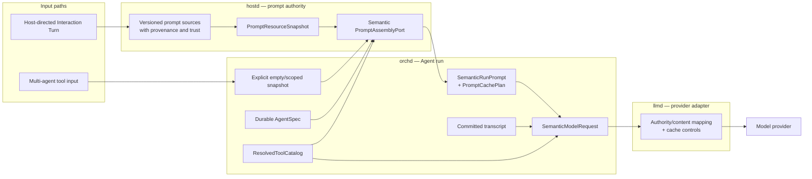
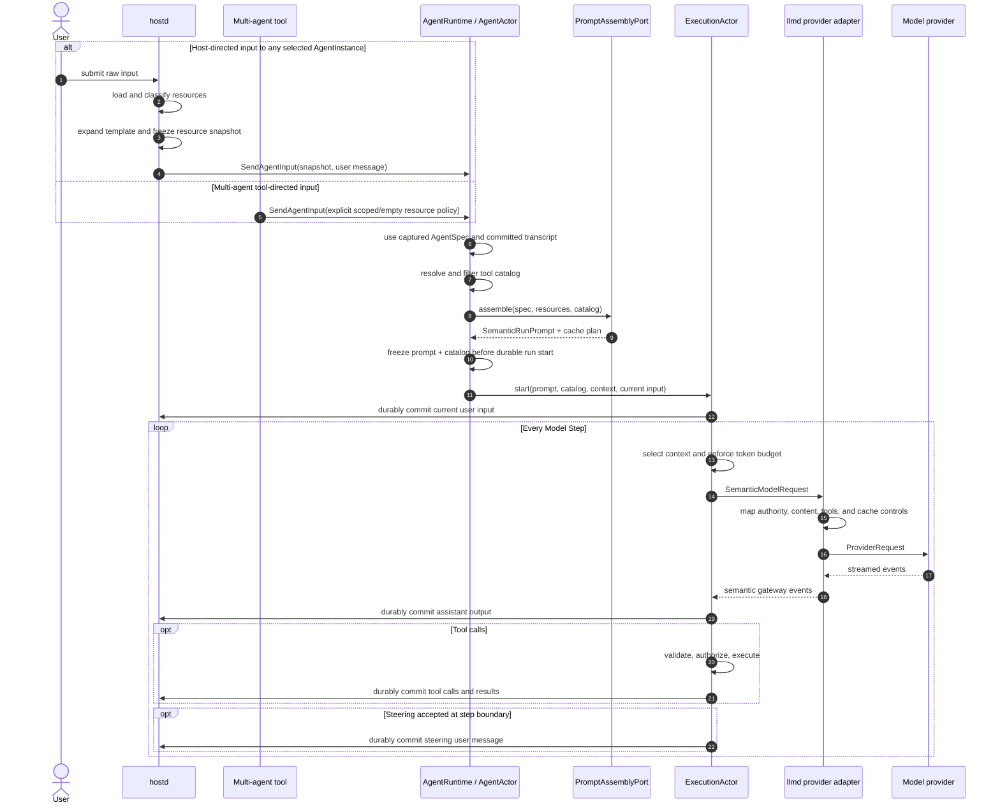

# Agent Prompt Assembly Design

> Status: normative source of truth; implementation migration is tracked in
> Section 15
> Design version: 2
> Runtime model: [Multi-Agent Runtime Model](multi-agent-execution-model.md)
> Turn boundary: [Turn–Agent Run Boundary Design](turn-agent-run-boundary-design.md)
> Tool capabilities: [Tool Sets Design](tool-sets-design.md)

## 1. Status, scope, and normative language

This document is the source of truth for how piko constructs every normal
Agent model request. It defines the target behavior even when current code has
not completed the migration. Section 15 is the only implementation-status
section and is non-normative.

If a related runtime or tool-set document conflicts with this document on
prompt authority, assembly, caching, provider mapping, or prompt lifetime, this
document governs that concern.

The terms **MUST**, **MUST NOT**, **SHOULD**, **SHOULD NOT**, and **MAY** are
normative requirements.

This design covers:

- instruction authority and content trust;
- prompt sources, ordering, provenance, and deterministic assembly;
- AgentSpec, Agent run, transcript, Model Step, and provider-request lifetimes;
- host-directed and multi-agent tool-directed inputs;
- structured tools and provider adaptation;
- prompt caching, context budgeting, compaction, retries, and recovery;
- observability, privacy, validation, and replay diagnostics.

A normal provider request is not one prompt string. It contains instruction
messages, conversation messages, structured tools, and request configuration.
Compaction is a separate LLM workload defined in Section 11.

## 2. Goals and core decisions

### 2.1 Goals

Prompt assembly MUST provide:

1. explicit instruction authority and content-trust boundaries;
2. deterministic output for identical canonical inputs;
3. one immutable semantic prompt and tool catalog per Agent run;
4. provider-neutral semantics with explicit provider-specific mapping;
5. least-privilege resource and tool visibility;
6. safe context budgeting and compaction at every Model Step;
7. stable prompt prefixes suitable for provider prompt caching;
8. diagnostics and evals without logging secrets by default.

Prompt caching is a first-class design goal. It is an optimization only: cache
enablement, cache misses, or provider cache behavior MUST NOT change prompt
semantics.

### 2.2 Core lifetime model

```text
durable AgentSpec
    +
host-owned PromptResourceSnapshot
    +
orchd-owned ResolvedToolCatalog
    ↓
SemanticRunPrompt + PromptCachePlan          immutable for one Agent run
    +
committed AgentInstance transcript           grows between Model Steps
    ↓
SemanticModelRequest                         immutable for one Model Step
    ↓ provider adapter
ProviderRequest                              one provider attempt
```

The Agent run, not the Interaction Turn or root identity, owns the frozen
prompt. A host-directed Interaction Turn may target any AgentInstance. Child
Agents may run without an Interaction Turn.

### 2.3 Ownership

| Concern | Owner | Rule |
|---|---|---|
| Agent definitions and durable AgentSpec snapshots | hostd | Captured at AgentInstance creation; not silently replaced on resume |
| Context files, skills, templates, cwd, date, operator prompt settings | hostd | Loaded into a value snapshot at the accepted run boundary |
| Prompt assembly policy | hostd | Produces semantic blocks, provenance, digest, and cache plan |
| Tool discovery, filtering, and routing | orchd | Produces one resolved catalog per Agent run |
| Prompt/catalog freeze and transcript mutation | orchd | Only committed messages advance context |
| Provider role/content/tool adaptation | llmd | Preserves semantic authority, order, content, and cache boundaries |
| TUI | none | Submits input and renders state; never assembles prompts |

hostd MUST remain authoritative for workspace and user prompt resources. orchd
MUST NOT load `AGENTS.md`, settings, skills, prompt templates, or agent TOMLs
directly. llmd MUST remain stateless with respect to Sessions and Agents.

## 3. Semantic prompt model

### 3.1 Instruction authority

Textual order is not an authority model. Every semantic prompt block MUST carry
an authority independent of where it is rendered. Data-only blocks use `None`:

```rust
enum InstructionAuthority {
    Platform,
    Operator,
    Agent,
    Project,
    User,
    None,
}
```

Authority is ordered from strongest to weakest as listed above. A lower level
MUST NOT override a higher level. Runtime authorization, sandboxing, tool
filtering, approvals, and secret access MUST be enforced outside the model;
prompt text is not a security boundary.

| Authority | Typical content | Override policy |
|---|---|---|
| Platform | immutable product safety, capability framing, trust rules | never replaceable by settings, projects, Agents, users, or tools |
| Operator | trusted global deployment policy and administrative additions | replaceable only by operator-owned configuration |
| Agent | captured AgentSpec role and task behavior | replaceable only through explicit AgentSpec version/update semantics |
| Project | workspace instructions such as `AGENTS.md` | may guide work but cannot grant tools, bypass policy, or override higher levels |
| User | current input, follow-ups, and steering | may override Project only when Project or higher policy explicitly delegates; never overrides higher levels |
| None | tool results, quoted file contents, retrieved content, summaries, metadata facts | data only; instructions inside have no authority |

Conflicts at the same authority MUST use a declared source policy rather than
accidental concatenation order:

- Platform policy is one versioned set;
- Operator layers use explicit global/deployment override rules;
- an AgentInstance uses one captured AgentSpec version;
- Project files are general-to-specific, with the more specific applicable
  block taking precedence;
- User messages are chronological, with later explicit instructions taking
  precedence when still applicable;
- `None` blocks never participate in instruction conflict resolution.

### 3.2 Content trust

Authority and trust are separate dimensions:

```rust
enum ContentTrust {
    Trusted,
    WorkspaceControlled,
    Untrusted,
}
```

- Compiled platform policy and operator-owned global configuration are
  `Trusted`.
- Workspace agent definitions, context files, skills, and templates are
  `WorkspaceControlled`. A cloned repository MUST NOT gain Platform or Operator
  authority merely because its files are rendered into a prompt.
- Tool results, retrieved content, quoted file bodies, external MCP content,
  compaction summaries, and model output are `Untrusted` unless a deterministic
  trusted component explicitly transforms them.

Delimiters such as XML make source boundaries visible but do not create a
security boundary. Provider adapters MUST use native roles or untrusted-content
facilities where available and MUST preserve explicit provenance labels when a
provider cannot represent the full hierarchy.

### 3.3 Canonical block type

The normative prompt representation is structured, not one rendered string:

```rust
enum PromptBlockKind {
    Instruction,
    Context,
    Catalog,
    Environment,
}

struct PromptBlock {
    id: String,
    kind: PromptBlockKind,
    authority: InstructionAuthority,
    trust: ContentTrust,
    source: PromptSource,
    content: String,
    content_digest: String,
    cache_scope: CacheScope,
}

struct SemanticRunPrompt {
    blocks: Vec<PromptBlock>,
    assembly_version: u32,
    source_digest: String,
    cache_plan: PromptCachePlan,
}
```

`PromptSource` MUST identify the source kind and stable locator, such as a
compiled resource id, settings layer, AgentSpec id/version, canonical file
path, skill name/path, template command/path, or environment fact name. It MUST
NOT contain file bodies or secrets.

`content_digest` identifies canonical block content. `source_digest` covers the
ordered blocks, their authority/trust/source metadata, the resolved tool
catalog digest, and the assembly algorithm version. Digests are diagnostic and
cache inputs, never Agent identity or authorization.

### 3.4 Immutable and configurable layers

Custom prompt policy MUST NOT replace Platform blocks. Configuration MAY:

- append or replace Operator blocks when controlled by the operator;
- select or version an Agent block through explicit AgentSpec lifecycle;
- append Project blocks through workspace files;
- add User input through normal transcript semantics.

There is no unrestricted `replace_system_prompt` or `custom_prompt` operation.
An operator-policy API MUST be authority-scoped and state exactly which
Operator block ids it replaces.

## 4. Final request composition

```text
SemanticModelRequest
├── Request configuration                         not prompt content
│   ├── provider + model
│   ├── run_id + step_id
│   ├── thinking/reasoning settings
│   └── output limits and retry identity
│
├── SemanticRunPrompt                             frozen for the Agent run
│   ├── ordered PromptBlock[]
│   │   ├── kind + authority + trust + source
│   │   ├── canonical content
│   │   └── content digest + cache scope
│   ├── assembly version + source digest
│   └── PromptCachePlan
│
├── ConversationContext                          selected for this Model Step
│   ├── committed prior messages
│   ├── current user input
│   └── committed assistant/tool/steering messages from earlier steps
│
└── ResolvedToolCatalog                          frozen for the Agent run
    └── ToolDef[]
        ├── public name + description
        ├── strict JSON input schema
        ├── provenance + version/digest
        └── execution metadata enforced outside the model

ProviderRequest                                  derived by llmd
├── native instruction roles/content
├── ordered conversation messages
├── structured tools
└── provider-specific cache controls
```

`SemanticRunPrompt` is the canonical value. A provider-specific rendered
system/developer message is a derived artifact and MUST NOT become durable
Agent configuration.

## 5. Prompt sources, order, and caching class

The canonical block order is strongest authority first, then stable content
before dynamic content within an authority level:

| Order | Block | Authority / trust | Source | Default cache scope |
|---:|---|---|---|---|
| 1 | Platform policy | Platform / Trusted | compiled, versioned host resource | GlobalStable |
| 2 | Operator instructions | Operator / Trusted | global settings or deployment policy | OperatorStable |
| 3 | Agent instructions | Agent / Trusted or WorkspaceControlled by provenance | durable AgentSpec snapshot | AgentStable |
| 4 | Resolved tool guidance, only when provider/model needs textual guidance | Agent / Trusted | generated from the exact resolved catalog | CatalogStable |
| 5 | Project instructions | Project / WorkspaceControlled | context files in deterministic general-to-specific order | ResourceSnapshot |
| 6 | Skill catalog metadata | None / WorkspaceControlled | visible skill descriptors and locations | ResourceSnapshot |
| 7 | Prompt-template catalog metadata | None / WorkspaceControlled | visible command descriptors | ResourceSnapshot |
| 8 | Environment facts | None / Trusted | captured date, cwd, and explicitly supported facts | RunDynamic |

Empty optional blocks are omitted. Remaining blocks keep canonical order.
Collections MUST be sorted deterministically before rendering or hashing.

Structured tool definitions are not PromptBlocks. Textual tool guidance
SHOULD be omitted when the provider's structured tool channel is sufficient.
If guidance is necessary, it MUST be generated from the same resolved catalog;
hard-coded available-tool lists are forbidden.

### 5.1 Platform and operator policy

Platform policy defines immutable harness behavior, instruction hierarchy,
untrusted-data handling, and capability framing. It MUST contain no credentials
or secrets and MUST NOT claim that prompt text alone enforces authorization.

Operator policy is loaded only from an operator-owned trusted configuration
boundary. Project settings MUST NOT be promoted to Operator authority.

### 5.2 Agent instructions

Agent instructions come from the captured `AgentSpec`. The AgentSpec MUST
record its definition provenance and version. Built-in and global operator
AgentSpecs may be Trusted; workspace AgentSpecs are WorkspaceControlled even
when they have Agent authority.

Resuming a Session MUST restore the durable AgentSpec snapshot. A changed live
registry definition MUST NOT silently mutate an existing AgentInstance.

### 5.3 Project context files

Context files are discovered from the workspace root down to the session cwd.
At each directory, at most one supported file is loaded using this precedence:

```text
AGENTS.md → AGENTS.MD → CLAUDE.md → CLAUDE.MD
```

Files are ordered general-to-specific. Each block MUST retain the canonical
source path and WorkspaceControlled trust. Project instructions MAY guide work
but MUST NOT modify the runtime tool catalog, sandbox, approvals, provider
credentials, or higher-authority policy.

### 5.4 Skills

Skill discovery may scan `.piko/skills/` and `.agents/skills/` from cwd toward
the home boundary. Closer same-named skills win. The final catalog MUST be
sorted by stable name and source path.

The run prompt contains only visible skill metadata: name, description, and
location. This catalog is data with no instruction authority. A higher-authority
Platform or Agent instruction defines when the model may load and apply a skill.

Skill bodies are loaded on demand through an authorized file tool. The loader,
not skill-controlled frontmatter, assigns body authority from installation
provenance and trusted policy. A workspace skill defaults to Project authority
and WorkspaceControlled trust; it cannot promote itself to Agent, Operator, or
Platform authority.

The catalog MUST be omitted when no authorized tool can load a skill. This
capability check MUST use an explicit capability, not a hard-coded public tool
name such as `read`.

### 5.5 Prompt templates and user input

Template metadata may appear as a no-authority catalog. Template bodies never
become system instructions merely because they came from disk.

When raw host-directed input matches a template command, hostd expands the
template body and arguments into the current User-authority message before
durable input commit. Template expansion and template-catalog snapshotting MUST
occur atomically at the same accepted-run boundary.

The prompt catalog MUST describe commands as host-expanded; it MUST NOT tell the
model that the model owns slash-command expansion.

### 5.6 Environment facts

Date and cwd are facts with `InstructionAuthority::None`. They are captured
values, not live reads during rendering. They SHOULD remain in a dynamic suffix
so they do not invalidate more stable cache prefixes.

## 6. Assembly architecture and sequence

### 6.1 Architecture



### 6.2 Run and Model Step sequence



## 7. Run input policies

### 7.1 Host-directed Interaction Turns

A host-directed Turn MAY target root or any selected non-root AgentInstance. It
receives a host-created resource snapshot according to the target AgentSpec and
operator policy. Root identity does not grant prompt-resource visibility.

Queued input MUST use one explicit snapshot policy. The normative policy is
**Interaction-Turn acceptance capture**: template expansion and prompt-resource
capture occur atomically when hostd accepts the user input, before it returns a
queued or started disposition. The durable queue retains the expanded User
message, command identity, and immutable resource snapshot. Later queue delay
MUST NOT silently change the meaning of already accepted work. A product that
wants execution-time freshness must expose that as a different explicit policy,
not reinterpret an existing queued item.

### 7.2 Multi-agent tool-directed runs

Public multi-agent tools MUST NOT supply arbitrary PromptResourceSnapshot or
system-prompt overrides. They provide a user-authority prompt/message plus an
explicit resource policy selected from trusted Session capabilities.

The default policy is `BaseOnly`:

- use the target Agent's durable AgentSpec;
- expose the target's resolved least-privilege tool catalog;
- do not inherit the caller's rendered prompt or transcript;
- do not expose project resources unless a trusted policy explicitly grants a
  scoped snapshot.

Future policies MAY expose a scoped Project block set, but MUST define an
inheritance matrix per block source and MUST NOT copy a parent's rendered
provider prompt.

### 7.3 Steering and follow-ups

Steering becomes a durable User-authority message at a safe Model Step boundary
and does not rebuild the run prompt or catalog.

A follow-up that starts a new Agent run receives a new prompt and catalog under
the input path's resource policy. Host-directed queued follow-ups use
start-boundary capture. Tool-directed follow-ups default to `BaseOnly`.

## 8. Transcript and structured tools

### 8.1 Transcript

The transcript is the durable ordered private history of one AgentInstance. It
contains user messages, assistant messages, tool calls, tool results, steering,
and explicit context-summary messages selected by the context policy.

Only committed messages enter a later Model Step. System/developer instruction
messages derived from SemanticRunPrompt are not transcript messages. Rebuilding
a run prompt never rewrites history.

Tool results, model output, retrieved content, and compaction summaries have no
instruction authority by default. Provider adapters MUST preserve supported
text, image, reasoning-signature, and tool content deliberately; silently
dropping a supported content kind is forbidden.

### 8.2 Structured tools

```text
AgentSpec.tool_set_ids
    ∩ registered ToolSets/providers
    ∩ stable AgentSpec allow-list
    ∩ run-scoped allow-list
    ↓
ResolvedToolCatalog
    ├── provider ToolDef[]
    ├── execution routes
    ├── catalog digest/version
    └── optional generated textual guidance
```

ToolDef is the canonical model-facing description. Each definition MUST have a
stable public name, precise description, strict supported JSON Schema, source
provenance, and version/digest. Arguments MUST be validated before execution.

Side-effect classification, approval policy, sandbox policy, credentials, and
authorization MUST be enforced by runtime code. Model-visible annotations MAY
help tool selection but MUST NOT be the enforcement mechanism.

The exact catalog used for prompt assembly, cache planning, provider tools, and
execution routes MUST be frozen together. Disabling tool calls MUST produce a
request and prompt plan derived from an empty effective catalog; it MUST NOT
leave prose claiming unavailable tools.

## 9. Provider adaptation

llmd maps SemanticModelRequest to provider-native roles and content. It MUST:

1. preserve authority order and avoid elevating lower-authority blocks when the
   provider supports a lower role;
2. keep untrusted data visibly delimited and labeled with provenance;
3. preserve conversation and tool-call/result ordering;
4. preserve supported multimodal and reasoning-signature content;
5. map the exact resolved ToolDef catalog;
6. apply provider-specific cache controls from PromptCachePlan;
7. report bounded errors for unsupported required semantics.

When a provider cannot represent the full authority hierarchy, its adapter MUST
use a documented deterministic fallback. At minimum it renders strongest
instructions first, wraps every lower-authority block with authority/trust/source
metadata, and includes immutable Platform precedence instructions. Runtime
security MUST remain independent of model compliance.

Each adapter has a version. The adapter version participates in provider-request
diagnostics and cache keys. Golden request fixtures MUST cover every supported
provider and content kind.

## 10. Prompt caching

### 10.1 Objective

Prompt caching SHOULD reduce repeated input processing, latency, and cost across
Model Steps and compatible Agent runs. It MUST preserve identical semantic
input and MUST be safe to disable globally or per provider.

Caching has five logical layers:

```text
Global stable prefix
└── Platform + Operator blocks
    Agent stable prefix
    └── Agent block + stable catalog-dependent guidance
        Resource snapshot prefix
        └── Project + skill + template blocks
            Run-dynamic suffix
            └── environment facts
                Step-dynamic suffix
                └── selected conversation messages
```

Provider ordering may place structured tool definitions before or alongside
instruction messages. PromptCachePlan describes semantic boundaries; llmd maps
them to provider-specific cache breakpoints or automatic-prefix hints.

### 10.2 Cache plan

```rust
enum CacheScope {
    GlobalStable,
    OperatorStable,
    AgentStable,
    CatalogStable,
    ResourceSnapshot,
    RunDynamic,
    NoCache,
}

struct PromptCachePlan {
    policy: PromptCachePolicy,
    prefix_segments: Vec<CacheSegment>,
    semantic_prefix_digest: String,
}

enum PromptCachePolicy {
    Disabled,
    ProviderDefault,
    Ephemeral,
    Extended,
}
```

Each CacheSegment references ordered block digests and, when relevant, the
catalog digest. `semantic_prefix_digest` remains provider-neutral. llmd derives
a provider cache key from that digest and the provider mapping. Derived provider
cache keys MUST include:

- semantic assembly version;
- provider adapter version;
- provider and model family when required by provider semantics;
- ordered block authority/trust/content digests;
- effective structured-tool catalog digest;
- content/role mapping options that change provider input.

User messages, tool results, secrets, and other untrusted dynamic content MUST
NOT be placed in a reusable cross-run segment by default.

### 10.3 Stable-prefix rules

- Stable blocks MUST precede dynamic blocks within compatible authority and
  provider constraints.
- Maps, skills, templates, context paths, and tools MUST use canonical order.
- Date, volatile environment state, run ids, and step ids MUST NOT appear in a
  stable prompt prefix.
- Request diagnostics such as run_id and step_id remain request metadata unless
  a provider strictly requires them in prompt content.
- A change to any segment invalidates that segment and all following segments,
  never preceding compatible prefixes.
- Cache hits and misses MUST NOT alter transcript selection, tools, reasoning,
  or output limits.

### 10.4 Privacy and observability

Provider caching may retain derived provider state. Cache policy MUST therefore
respect operator data-retention settings, provider capabilities, regional
requirements, and zero-data-retention modes. Extended caching requires explicit
operator enablement.

Usage accounting MUST record cache-read and cache-write tokens where available.
Metrics MAY expose cache policy, segment ids, digests, hit/miss status, token
savings, and latency. They MUST NOT expose block content by default.

## 11. Context budgeting and compaction

Before every Model Step, orchd MUST calculate:

```text
input budget
  = provider/model context limit
  - reserved output budget
  - reserved reasoning budget
  - provider safety margin

conversation budget
  = input budget
  - provider-mapped instruction tokens
  - structured tool-definition tokens
  - provider framing and multimodal tokens
```

Token counting MUST use the best available provider/model tokenizer or a
documented conservative estimator. It MUST include tool schemas, images,
reasoning signatures, and provider-added tool framing when applicable.

Fixed prompt/tool overhead MUST NOT be silently dropped. If it exceeds budget,
the step fails before the provider call with section-level token diagnostics.

Transcript selection MUST preserve:

- current user input;
- selected branch/head and message order;
- assistant tool calls with all corresponding results;
- valid multimodal message structure;
- a durable compaction summary plus configured recent messages when compacted.

Compaction is a separate LLM workload with its own immutable task prompt and no
Agent tool catalog. Its summary is Untrusted conversation data, not AgentSpec or
system-prompt content. Summary creation MUST record source range, summary prompt
version, model/provider, digest, and first retained message. The next Agent run
MUST actually select the summary plus retained messages rather than replaying
the summarized prefix.

Budgeting repeats after each tool loop because the transcript grows. If no safe
compaction/context path fits, the run fails explicitly.

## 12. Retry, recovery, persistence, and replay

### 12.1 Retry

A provider retry of the same Model Step MUST reuse the same semantic request,
provider mapping, cache plan, transcript selection, tools, model settings, and
step identity according to retry policy. It MUST NOT reread files or rebuild a
prompt.

### 12.2 Recovery

The baseline process-loss policy MAY interrupt incomplete runs. Exact mid-step
replay requires persisting, before the first attempt:

- SemanticRunPrompt or a recoverable encrypted/content-addressed equivalent;
- effective catalog and model settings;
- provider adapter version;
- selected transcript head/range and step request digest;
- cache policy, without depending on a cache hit.

Rebuilding from current files is not exact replay.

### 12.3 Persistence and privacy

The baseline policy is:

- persist AgentSpec snapshots and provenance;
- persist transcript messages in Agent JSONL shards;
- persist run prompt version/digest/cache-plan metadata;
- persist step request digests and transcript selection metadata;
- do not append instruction prompts to the user-visible transcript;
- do not log or project full prompt content by default;
- never place credentials or authorization secrets in prompt blocks.

Full prompt inspection or replay capture requires explicit operator/user action,
access control, redaction policy, and retention policy. A system prompt MUST NOT
be assumed secret.

## 13. Failure and diagnostics

Required assembly inputs fail closed. Tool-catalog ambiguity, duplicate public
tool names, invalid required prompt resources, unsupported authority mapping,
or fixed-overhead overflow MUST reject the run or step with a bounded error.
They MUST NOT silently degrade to an empty catalog or incomplete prompt.

Optional-resource failures MAY omit a resource only when policy marks it
optional. Diagnostics MUST include source locator, category, omission reason,
and digest/length where safe, but not full content.

Normal diagnostics expose:

- assembly and adapter versions;
- run prompt, catalog, and step request digests;
- block ids, authority, trust, sources, lengths, and token estimates;
- cache plan and cache usage;
- selected transcript range/head and compaction provenance.

## 14. Target protocol and ports

```rust
struct AgentSpec {
    id: AgentSpecId,
    version: String,
    provenance: PromptSource,
    name: String,
    role: String,
    base_instructions: String,
    model: Option<String>,
    thinking_level: Option<ThinkingLevel>,
    tool_set_ids: Vec<String>,
    active_tool_names: Option<Vec<String>>,
}

struct PromptAssemblyRequest {
    session_id: SessionId,
    agent_instance_id: AgentInstanceId,
    agent_spec: AgentSpec,
    resources: PromptResourceSnapshot,
    tool_catalog: ResolvedToolCatalog,
}

struct SemanticRunPrompt {
    blocks: Vec<PromptBlock>,
    assembly_version: u32,
    source_digest: String,
    cache_plan: PromptCachePlan,
}

struct StartExecutionRequest {
    agent_spec: AgentSpec,
    run_prompt: SemanticRunPrompt,
    context: ConversationContext,
    input: MessageContent,
    tool_catalog: ResolvedToolCatalog,
    // identities and model configuration omitted
}

struct SemanticModelRequest {
    run_prompt: SemanticRunPrompt,
    transcript: Vec<Message>,
    tools: ResolvedToolCatalog,
    model: ResolvedModelSettings,
    run_id: RunId,
    step_id: StepId,
}
```

`ConversationContext` has no system-prompt channel. PromptAssemblyPort is a
trusted Session capability. Public tools cannot call it or construct trusted
PromptResourceSnapshot values.

## 15. Current implementation status and migration

This section describes current code and is non-normative.

### 15.1 Implemented target path

- protocol v2 defines authority, trust, source, block, cache-plan,
  `SemanticRunPrompt`, and `ResolvedToolCatalog` DTOs;
- `AgentSpec` records a durable version and provenance; workspace definitions
  remain `WorkspaceControlled` when rendered;
- hostd snapshots deterministic semantic blocks and assembles block, source,
  catalog, segment, and stable-prefix digests;
- the platform block contains no hard-coded available-tool names, skill
  visibility checks `WorkspaceRead`, and template metadata describes host-side
  expansion;
- orchd resolves the effective catalog before assembly, freezes the semantic
  prompt for the run, routes resolved thinking settings, and fails catalog
  conflicts explicitly;
- llmd derives provider messages from authority instead of accepting a rendered
  system string: Platform/Operator/Agent map to system, while Project and
  data-only blocks map to labeled context messages;
- llmd preserves user/assistant images, reasoning content, and reasoning
  signatures, and maps the cache plan to message breakpoints, provider cache
  keys, and request cache controls;
- cache keys include provider, model, assembly version, provider-mapping
  version, stable semantic prefix, and effective catalog input;
- compaction now selects summary plus retained messages instead of replaying the
  summarized prefix, and hostd performs a pre-turn check using the resolved
  model context window;
- compaction summaries use a data-only `Message::Context` value with
  `InstructionAuthority::None` semantics and `Untrusted` trust, even when a
  provider adapter must encode that context through a user-role message;
- orchd performs a final fixed-overhead and total-context budget gate before
  provider dispatch, reserving output, reasoning, provider safety margin, tool
  framing, and conservative multimodal cost;
- every ToolDef carries required definition version and provenance; the
  resolved catalog additionally records canonical contributing sources;
- malformed skill omissions emit bounded source-path diagnostics without
  logging skill bodies;
- diagnostics log identities, counts, versions, and digests without logging
  prompt bodies.

The stateless `LlmGateway::llm_call(system_prompt, ...)` path is reserved for
the host-owned compaction summarizer. It is converted immediately into a local
Platform block and is not used by normal Agent executions.

### 15.2 Recommended follow-up hardening

These items improve operations and adapter coverage; they do not change the
semantic request contract implemented above.

| Priority | Remaining behavior | Normative completion |
|---:|---|---|
| P1 | Cache policy is currently `ProviderDefault`, and cache usage is available only through aggregate usage fields | Add operator policy/retention configuration and per-request cache diagnostics |
| P1 | Provider mapping has unit coverage but not serialized golden requests for every provider adapter | Add OpenAI, Anthropic, Gemini, and compatible-provider golden fixtures |

## 16. Validation and eval requirements

### 16.1 Deterministic runtime tests

1. identical canonical inputs produce identical blocks, order, digests, and
   cache segments;
2. two Model Steps in one run reuse the identical SemanticRunPrompt/catalog;
3. only committed messages enter later transcript snapshots;
4. changing a resource affects the next run, never an in-flight run;
5. resume reuses AgentSpec and assembles a fresh run prompt;
6. queued input preserves the expansion and resource snapshot captured at
   Interaction-Turn acceptance;
7. child runs do not inherit parent prompt/transcript;
8. tool prose, ToolDef[], and execution routes use one effective catalog;
9. retries reuse the exact semantic and provider request;
10. cache enable/disable and hit/miss do not change semantics;
11. fixed-overhead overflow fails before provider invocation;
12. compaction selection preserves summary/current input/tool groups;
13. logs and Session projections do not expose prompt bodies by default.

### 16.2 Security and provider evals

The eval suite MUST include:

- malicious project instructions, skill metadata/body, template bodies, tool
  results, retrieved content, MCP output, and compaction summaries;
- attempts by lower authority to override Platform/Operator/Agent policy;
- tool escalation, approval bypass, secret exfiltration, and prompt leakage;
- provider golden requests for roles, tools, multimodal blocks, reasoning
  signatures, and cache boundaries;
- tool-selection accuracy with filtered catalogs and strict schemas;
- context-budget edge cases and lost-in-the-middle regressions;
- compaction fidelity and source-provenance preservation;
- prompt cache hit rate, cache token usage, latency, and invalidation tests;
- pinned model-version regression runs before changing production model aliases.

## 17. Invariants

1. Platform policy is immutable from project, Agent, user, model, and tool input.
2. Every prompt block has explicit authority, trust, provenance, and digest.
3. AgentSpec is immutable for the AgentInstance unless an explicit versioned
   update/replacement protocol runs.
4. Every accepted Agent run freezes exactly one SemanticRunPrompt and effective
   tool catalog.
5. Every Model Step uses that frozen pair and a newly selected committed
   transcript snapshot.
6. Prompt caching never changes semantic input or correctness.
7. Tool definitions, guidance, routes, and execution policy share one resolved
   catalog snapshot.
8. Runtime authorization and safety never depend solely on model obedience.
9. Dynamic resources never mutate an in-flight run.
10. Child runs never implicitly inherit a parent's rendered prompt/transcript.
11. Compaction output is untrusted transcript data, not system instruction.
12. llmd loads no Session/project prompt resources.
13. Full prompt content is neither logged nor projected by default.

## 18. Non-goals

- treating prompt text as an authorization or sandbox boundary;
- exposing arbitrary trusted system-prompt mutation to the model;
- storing provider-rendered instruction messages as ordinary transcript data;
- requiring prompt caching for correctness;
- exact replay without explicit protected replay capture;
- hot-swapping prompt blocks or tools during an Agent run;
- silently updating durable AgentSpecs from changed TOML;
- defining provider pricing or cache economics.

## 19. Code map

| Responsibility | Current primary code |
|---|---|
| Host-directed snapshot and template expansion | `packages/hostd/src/application/turns/submit.rs` |
| Context/template loading | `packages/hostd/src/adapters/prompts/loader.rs` |
| Skill loading | `packages/hostd/src/adapters/prompts/skill_loader.rs` |
| Agent definition loading | `packages/hostd/src/adapters/prompts/agent_loader.rs` |
| Semantic resource snapshot and assembly | `packages/hostd/src/domain/prompts/build.rs` |
| Skill catalog rendering | `packages/hostd/src/domain/prompts/skills.rs` |
| Template argument expansion | `packages/hostd/src/domain/prompts/template.rs` |
| Shared prompt DTOs | `packages/protocol/src/prompt.rs` |
| Tool discovery/filtering | `packages/orchd/src/adapters/tools/registry.rs` |
| Run prompt/catalog freeze | `packages/orchd/src/runtime/execution/mod.rs` |
| Transcript and GatewayRequest | `packages/orchd/src/runtime/execution/actor.rs` |
| Final context-budget gate | `packages/orchd/src/runtime/execution/budget.rs` |
| Provider adaptation and caching | `packages/llmd/src/executor.rs`, `packages/llmd/src/executor/prompt_mapping.rs` |
| Compaction prompt | `packages/hostd/src/domain/compaction/summarizer.rs` |

## 20. Industry references

The normative security, tool, provider, and caching requirements are informed
by these primary references:

- [OpenAI Model Spec — chain of command and untrusted data](https://model-spec.openai.com/2025-10-27)
- [OWASP GenAI LLM01 — Prompt Injection](https://genai.owasp.org/llmrisk/llm01-prompt-injection/)
- [OWASP GenAI LLM07 — System Prompt Leakage](https://genai.owasp.org/llmrisk/llm072025-system-prompt-leakage/)
- [OpenAI Function Calling](https://developers.openai.com/api/docs/guides/function-calling)
- [OpenAI Prompt Caching](https://developers.openai.com/api/docs/guides/prompt-caching)
- [Anthropic Prompt Caching](https://platform.claude.com/docs/en/build-with-claude/prompt-caching)
- [Anthropic Tool Use](https://platform.claude.com/docs/en/agents-and-tools/tool-use/overview)
