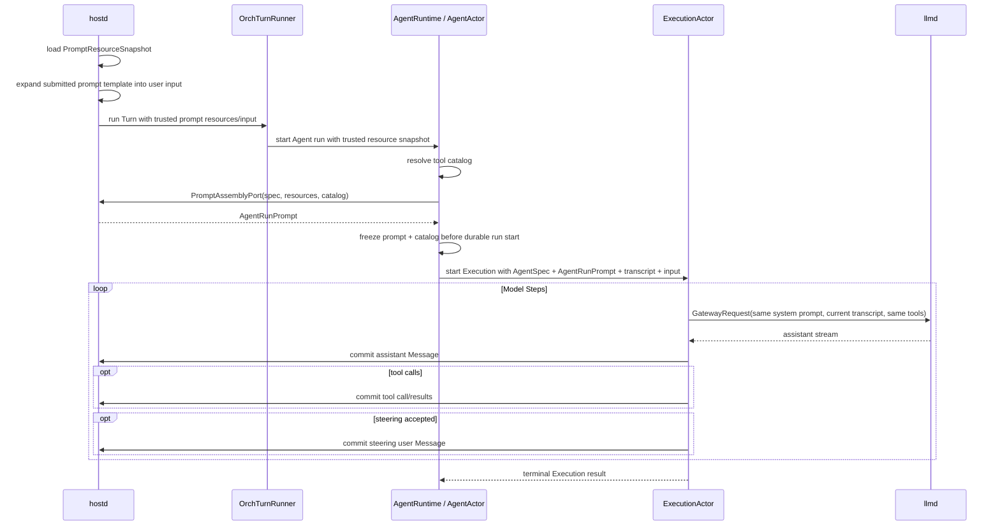

# Agent Prompt Assembly Design

> Status: normative core implemented; context budgeting and expanded replay diagnostics remain follow-up work
> Runtime model: [Multi-Agent Runtime Model](multi-agent-execution-model.md)
> Turn boundary: [Turn–Agent Run Boundary Design](turn-agent-run-boundary-design.md)
> Tool capabilities: [Tool Sets Design](tool-sets-design.md)

## 1. Purpose

Prompt assembly is a core Agent runtime boundary. It determines which
instructions, conversation facts, tools, and current environment reach each
model request.

This document defines:

- which prompt data belongs to AgentSpec, Agent run, Execution, and Model Step;
- when dynamic prompt resources are loaded and frozen;
- how system prompt, transcript, current input, tool traffic, and steering are
  ordered;
- how resume, recovery, compaction, multi-agent runs, and retries affect prompt
  construction;
- which layer owns each decision across hostd, orchd, llmd, and protocol.

The immediate defect motivating this design was that hostd rendered a new
system prompt for a resumed Turn, overwrote the root AgentSpec with it, and then
replayed Agent creation. Dynamic prompt changes therefore appeared to storage
as an AgentSpec idempotency conflict.

## 2. Core Decision

Agent configuration and run prompt are different values with different
lifetimes:

```text
AgentSpec                 durable AgentInstance configuration
    +
current prompt resources host-owned snapshot for this run
    +
resolved tool catalog    orchd capability snapshot for this run
    ↓
AgentRunPrompt            immutable system prompt for one Agent run
    +
live transcript snapshot changes between Model Steps
    ↓
GatewayRequest            one provider request
```

The system prompt is assembled once per Agent run and reused by every Model
Step in that run. The transcript is rebuilt from committed run state before
each Model Step.

There is no RootTurn or RootTurnContext concept. An Interaction Turn starts one
root Agent run; child Agents can also run without a hostd Turn. Prompt semantics
therefore attach to Agent run, not to root identity or Turn identity.

## 3. Concepts and Lifetimes

### 3.1 AgentSpec

AgentSpec is immutable configuration captured when an AgentInstance is created:

- stable identity metadata such as role and description;
- `base_system_prompt`, authored in the registered agent definition;
- model and thinking defaults;
- declared tool-set ids;
- a stable capability allow-list, when configured.

AgentSpec does not contain rendered project context, the current date, current
working directory, discovered skills, prompt-template catalogs, or any other
resource that can change between runs.

The current protocol field `AgentSpec.system_prompt` becomes
`AgentSpec.base_system_prompt`. This is a semantic rename, not merely cosmetic:
storage compares it only as part of immutable AgentInstance creation.

### 3.2 PromptResourceSnapshot

PromptResourceSnapshot is the host-owned input used to assemble a prompt for
one run. For the root Agent it may include:

- current working directory;
- current local date and other explicitly supported environment facts;
- context files such as `AGENTS.md`;
- visible skill metadata;
- visible prompt-template metadata;
- configured system-prompt override or append text;
- prompt guidelines;
- trusted product instructions.

The snapshot contains loaded values, not live file handles. Files changing
after the run starts do not alter an in-flight run.

Prompt-template expansion of the submitted command is separate: expansion
produces the current user input. Template catalog metadata may also appear in
the system prompt so the model knows which templates exist.

### 3.3 AgentRunPrompt

AgentRunPrompt is the immutable prompt result for one Agent run:

```rust
struct AgentRunPrompt {
    system_prompt: String,
    assembly_version: u32,
    source_digest: String,
}
```

`source_digest` identifies the canonical assembly inputs and algorithm version.
It supports diagnostics and tests; it is not Agent identity or an idempotency
key.

AgentRunPrompt contains only prompt material. Resolved model settings and tool
definitions belong to the wider run/execution configuration, not inside this
type.

### 3.4 Conversation transcript

The transcript is the durable ordered message history owned by one
AgentInstance. It contains:

- user inputs;
- assistant outputs, including supported reasoning blocks;
- tool calls;
- tool results;
- steering inputs once accepted at a step boundary;
- explicit compaction/context messages defined by the transcript model.

System prompt text is not a transcript Message. Rebuilding a prompt never
rewrites historical Messages.

### 3.5 Model Step request

One Model Step sends a GatewayRequest containing:

```text
AgentRunPrompt.system_prompt
current committed Execution transcript
resolved tool definitions
resolved model/thinking settings
run_id + step_id diagnostics
```

Every Model Step in the same Agent run uses the same AgentRunPrompt. The
transcript grows after committed assistant messages, tool calls/results, and
steering input, so later steps see those new Messages.

## 4. Ownership

| Concern | Owner | Rule |
|---|---|---|
| AgentSpec definitions and durable snapshots | hostd | Captured on AgentInstance creation |
| Context files, skills, templates, cwd, date | hostd | Loaded into PromptResourceSnapshot |
| Prompt assembly policy and ordering | hostd `PromptAssemblyPort` | Pure deterministic assembly from snapshots and a resolved catalog |
| Agent run preparation and prompt freeze | AgentRuntime / AgentActor | Resolves catalog; freezes one prompt/catalog pair per accepted run |
| Transcript mutation and step loop | ExecutionActor | Only committed Messages advance context |
| Tool discovery and routing | orchd | Derived from captured capability plus run filtering |
| Provider message adaptation | llmd | Preserves the semantic prompt/message ordering |
| TUI | none | Submits input and displays results; never assembles prompts |

hostd remains authoritative for project/user prompt resources. orchd must not
read AGENTS.md, settings, skills, or prompt templates directly from disk.

AgentRuntime resolves the run's tool catalog, then calls a host-provided
`PromptAssemblyPort` with the captured AgentSpec, trusted
PromptResourceSnapshot, and resolved catalog. The returned AgentRunPrompt and
that exact catalog are frozen together before durable run start. The port is a
prompt capability, not an Agent/Execution control API.

## 5. Assembly Inputs and Ordering

The canonical rendered system prompt is assembled in this order:

1. product-level harness instructions;
2. `AgentSpec.base_system_prompt`;
3. resolved tool guidance generated from the actual visible tool catalog;
4. configured prompt guidelines and trusted append/override policy;
5. project context files in deterministic path order;
6. visible skill catalog in deterministic name/source order;
7. prompt-template catalog in deterministic command order;
8. current environment facts such as date and cwd.

Each section has an explicit delimiter. Project-controlled content is identified
by source path and never concatenated as if it were a product instruction.

Custom prompt policy must be explicit:

- `replace_base` replaces product/base prose but not required safety/capability
  framing;
- `append` adds text at its defined precedence point;
- absence uses the standard product plus AgentSpec base prompt.

Assembly is deterministic for identical inputs. Maps and discovered resources
must be sorted before rendering. The current wall clock is first captured as a
snapshot value and then rendered; the renderer does not read the clock itself.

## 6. Tool/Prompt Consistency

The textual tool section and the structured `GatewayRequest.tools` must derive
from the same resolved tool catalog snapshot.

```text
AgentSpec.tool_set_ids
    ∩ registered ToolSets/providers
    ∩ AgentSpec stable allow-list
    ∩ optional run-scoped allow-list
    ↓
ResolvedToolCatalog
    ├── prompt tool guidance
    └── GatewayRequest.tools
```

Hard-coded prompt tool lists must not claim tools that orchd did not expose.
Conversely, a structured tool that is intentionally hidden from prompt prose
must be marked by explicit policy rather than accidental drift.

The catalog is frozen for the Agent run. Tool execution routing remains live
only within the same registered capabilities. Configuration changes apply to a
new run unless explicit hot-reload semantics are later designed.

## 7. Run and Step Sequence



The initial user input must be durably committed before the first Model Step.
Assistant messages and tool traffic must be durably committed before they can
appear in the transcript of a later Model Step.

AgentRuntime must pass the same catalog value to PromptAssemblyPort and the
Execution. This prevents prompt prose and structured tools from being assembled
from different capability snapshots.

## 8. Root and Child Agent Runs

### 8.1 Root run

An Interaction Turn causes hostd to load current project resources and provide
them through a trusted internal boundary. The resulting AgentRunPrompt applies
only to the root Agent run bound to that Turn.

`turn_id` correlates the run with hostd lifecycle but does not participate in
prompt assembly beyond diagnostics.

### 8.2 Child run

A child Agent run has no Interaction Turn. It starts from the child
AgentInstance's captured AgentSpec and an explicit prompt-resource policy.

Initial policy:

- do not inherit or copy the parent's rendered system prompt;
- use the child AgentSpec base prompt;
- expose project resources only through a trusted host-provided Session prompt
  service, if the child spec/policy enables them;
- treat the parent's tool prompt as user input, never as a system instruction.

This preserves Agent isolation and avoids silently granting child capabilities
or instructions inherited from a parent.

## 9. Resume, Reuse, and Configuration Changes

Resuming a Session restores:

- stable root and child AgentInstance identities;
- captured AgentSpec snapshots;
- durable private transcripts and heads;
- inbox, reports, queue, and lifecycle state.

It does not regenerate AgentSpec and does not replay `Create` with a newly
rendered prompt.

When a new input starts after resume:

1. hostd loads current prompt resources;
2. AgentRuntime resolves tools and obtains a new AgentRunPrompt from the
   host-provided PromptAssemblyPort;
3. the existing AgentInstance starts a new run using its captured AgentSpec and
   existing transcript.

Therefore changes to date, AGENTS.md, skills, templates, or run-scoped tool
filtering affect the next run without changing Agent identity or AgentSpec.

A changed registered AgentSpec does not silently mutate an existing
AgentInstance. Supporting that requires a separate versioned AgentSpec update
or AgentInstance replacement design.

## 10. Steering, Follow-ups, and Queues

Steering belongs to the currently active Agent run:

- it becomes a durable user Message at a Model Step boundary;
- it does not rebuild AgentRunPrompt;
- it does not change the visible tool catalog;
- the next Model Step sees the same system prompt plus the new steering Message.

A follow-up that is accepted as a new Agent run gets a new AgentRunPrompt.

For queued root Turns, prompt resources are loaded when the queued Turn is
actually started, not when raw text first enters the queue. This ensures the
new run sees current project resources. The expanded user input and resource
snapshot must be taken at one documented acceptance boundary so template
content cannot come from a different revision than its catalog unexpectedly.

## 11. Compaction

Compaction is a separate model workload with its own task-specific system
prompt. It must not reuse or mutate AgentRunPrompt.

The result of compaction can affect a later Agent run only through the durable
conversation context selected for that run. A compaction summary is therefore
transcript/context data, not an AgentSpec field and not a system-prompt append.

The context builder must preserve valid tool-call/tool-result grouping and the
selected branch/head. Prompt assembly consumes the already selected compacted
context; it does not decide compaction policy.

### 11.1 Context-window budgeting

Before every Model Step, orchd computes a context budget from the resolved
model limit:

```text
input budget
  = model context limit
  - reserved output/reasoning budget

message budget
  = input budget
  - AgentRunPrompt tokens
  - structured tool-definition tokens
  - provider framing allowance
```

AgentRunPrompt and the resolved tool catalog remain frozen; the runtime must not
silently drop instructions or tools to make a request fit. If fixed prompt/tool
overhead alone exceeds the input budget, the run fails before calling the
provider with a bounded diagnostic.

Transcript selection may use an already durable compaction summary and retained
recent Messages. It must preserve message order, selected branch/head, assistant
tool calls with their tool results, and the current input. Arbitrary prefix
truncation inside a tool exchange is forbidden.

The transcript grows during a tool loop, so budgeting is repeated at each step.
If it no longer fits, the runtime requests the defined compaction/context
reduction path at a safe step boundary or fails explicitly when no such path is
available. It never rebuilds AgentRunPrompt as an overflow workaround.

## 12. Failure, Retry, and Recovery

### 12.1 Assembly failure

If required prompt resources or tool resolution fail before durable run start,
the Agent run is rejected and hostd terminates the bound Turn as failed. No
partial AgentSpec update is allowed.

Non-fatal resource diagnostics may omit an invalid optional resource, but the
omission and source must be observable.

### 12.2 Provider retry

A retry of the same Model Step uses the same:

- AgentRunPrompt;
- transcript snapshot;
- resolved tool catalog;
- model settings;
- run and step identities according to retry policy.

Re-reading files or rebuilding the prompt during a provider retry is forbidden.

### 12.3 Process recovery

Current piko policy interrupts incomplete runs after process loss rather than
resuming their Model Step. Therefore the full AgentRunPrompt need not initially
be a transcript artifact.

Durable run metadata should record the prompt assembly version and
`source_digest` for diagnostics. If exact mid-run recovery or replay is later
required, the complete AgentRunPrompt and resolved tool/model snapshot must be
persisted before the first Model Step; rebuilding from current files is not
equivalent.

## 13. Persistence and Privacy

Normative initial policy:

- persist AgentSpec snapshots with AgentInstance metadata;
- persist transcript Messages in Agent JSONL shards;
- persist Agent run prompt digest/version in internal run metadata;
- do not append system prompts to the user-visible transcript;
- do not persist the full rendered AgentRunPrompt solely for convenience.

Diagnostics must not log full prompts by default because context files and
skills may contain secrets. Debug tooling may expose section names, source
paths, lengths, versions, and digests. Full prompt inspection requires an
explicit user action and appropriate redaction policy.

## 14. Target Protocol Shape

The target contracts separate durable Agent configuration, run prompt, and
conversation context:

```rust
struct AgentSpec {
    id: AgentSpecId,
    name: String,
    role: String,
    description: Option<String>,
    base_system_prompt: String,
    model: Option<String>,
    thinking_level: Option<ThinkingLevel>,
    tool_set_ids: Vec<String>,
    active_tool_names: Option<Vec<String>>,
}

struct ConversationContext {
    messages: Vec<Message>,
    head_message_id: Option<MessageId>,
}

struct StartExecutionRequest {
    // identities and input omitted
    agent_spec: AgentSpec,
    run_prompt: AgentRunPrompt,
    context: ConversationContext,
}
```

`ConversationContext.system_prompt` is removed. There must be exactly one
system-prompt source at Execution start: `run_prompt.system_prompt`.

The root Turn adapter needs a trusted PromptResourceSnapshot field in its
internal input. Public multi-agent tools cannot provide arbitrary resource
snapshots or system-prompt overrides.

The AgentRuntime boundary additionally needs a host-provided prompt capability:

```rust
struct PromptAssemblyRequest {
    session_id: SessionId,
    agent_instance_id: AgentInstanceId,
    agent_spec: AgentSpec,
    resources: PromptResourceSnapshot,
    tool_catalog: Vec<ToolDef>,
}

trait PromptAssemblyPort {
    async fn assemble(request: PromptAssemblyRequest)
        -> Result<AgentRunPrompt, PromptAssemblyError>;
}
```

This port is installed as a trusted Session capability. Public multi-agent tools
cannot call it or supply arbitrary PromptResourceSnapshot values.

## 15. Implementation Boundaries

### Implemented baseline

The runtime now keeps durable `AgentSpec.base_system_prompt` separate from
per-run resources, restores the durable spec during attach, resolves tools
before host-owned assembly, and freezes one prompt/catalog pair for the run.
`ConversationContext` no longer carries a second system-prompt channel. Run
metadata records the assembly version and prompt digest without persisting the
full rendered prompt.

The remaining work in this design is advanced context budgeting and broader
provider retry/replay diagnostics; it does not alter the ownership or lifetime
model defined here.

### hostd

- split base AgentSpec loading from run prompt resource loading;
- make prompt assembly pure over explicit snapshot values;
- load resources once for each started root run;
- pass a trusted PromptResourceSnapshot without rewriting AgentSpec;
- restore stored AgentSpec on Session resume.

### protocol / orchd-api

- rename AgentSpec system prompt to base system prompt;
- add AgentRunPrompt at the Agent run/Execution boundary;
- remove system prompt from ConversationContext;
- add the internal PromptAssemblyPort needed to bind prompt prose and structured
  tools to one catalog snapshot;
- keep run prompt input inaccessible to untrusted LLM tools.

### orchd

- resolve one tool catalog per Agent run;
- invoke PromptAssemblyPort and freeze its AgentRunPrompt with that catalog;
- pass them unchanged to its internal Execution;
- reuse the prompt for all Model Steps;
- recover AgentActors from durable AgentSpec snapshots rather than the live
  registry;
- keep child prompt policy explicit.

### llmd

- remain stateless;
- accept the already resolved system prompt, transcript, and tool definitions;
- preserve ordering and provider-specific system-role adaptation;
- never load project prompt resources.

### Delivered order

1. Added the target prompt DTOs and pure assembly tests without changing runtime
   behavior.
2. Added PromptAssemblyPort to the Session Agent capabilities.
3. Resolved/froze tool catalog and AgentRunPrompt together at Agent run start.
4. Routed root Turn resources through the trusted snapshot input.
5. Restored captured AgentSpec during attach/recovery and removed the dynamic
   registry override.
6. Removed `ConversationContext.system_prompt` and the legacy fallback path.
7. Added resume/resource-change regressions while retaining only the serialized
   `systemPrompt` field alias needed to read existing schema-v3 sessions.

## 16. Validation

Required tests:

1. two Model Steps in one run use the identical system prompt;
2. tool results and steering appear only in subsequent transcript snapshots;
3. changing AGENTS.md between runs changes the next AgentRunPrompt;
4. changing AGENTS.md during a run does not change later steps in that run;
5. resume plus new input reuses AgentSpec and assembles a fresh run prompt;
6. crossing a date boundary does not produce an AgentSpec conflict;
7. `Create` remains idempotent and still rejects genuinely different immutable
   AgentSpecs for the same identity;
8. prompt tool prose and structured tools come from one catalog snapshot;
9. child runs do not inherit the parent's rendered system prompt;
10. provider retry reuses the same prompt/transcript/tool snapshot;
11. prompt rendering is deterministic for identical inputs;
12. context budgeting preserves tool-call/result groups and current input;
13. fixed prompt/tool overhead overflow fails before a provider call;
14. logs and normal session projection do not expose full rendered prompts.

The resume regression test must open a schema-v3 Session created with one
resource/date snapshot, attach it in a new runtime, submit another Turn with a
different snapshot, and verify successful completion with the same root
AgentInstance identity.

## 17. Non-Goals

- exposing arbitrary system-prompt mutation to the model;
- storing system prompts as ordinary transcript Messages;
- making llmd aware of Sessions, Turns, AgentInstances, skills, or AGENTS.md;
- defining prompt caching economics at provider level;
- exact replay of historical completed runs in the initial implementation;
- hot-swapping prompt or tools in the middle of an Agent run;
- silently updating existing AgentSpec snapshots from changed TOML.

## 18. Invariants

1. AgentSpec is immutable for the lifetime of an AgentInstance.
2. AgentSpec contains a base prompt, never a rendered per-run prompt.
3. Every accepted Agent run has exactly one immutable AgentRunPrompt.
4. Every Model Step in a run uses that same AgentRunPrompt.
5. Only committed Messages enter a later Model Step transcript.
6. Prompt tool guidance and structured tools share one resolved catalog.
7. Resume never performs semantic Agent creation for an existing identity.
8. Dynamic resource changes affect a new run, never an in-flight run.
9. Child runs never implicitly inherit a parent's system prompt.
10. Compaction prompt and Agent run prompt are separate workloads.
11. llmd receives resolved prompt data and performs no business resolution.
12. Full prompt contents are not logged or projected by default.
