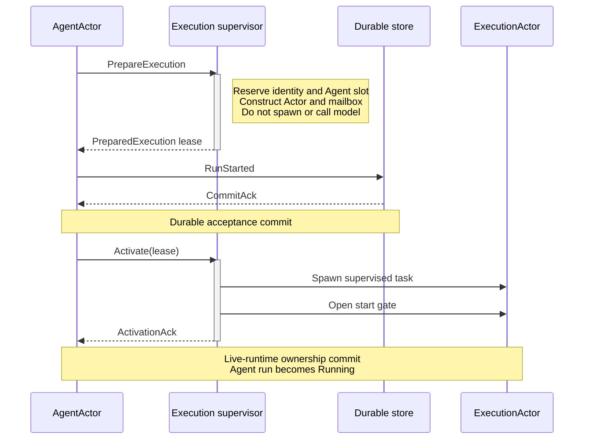
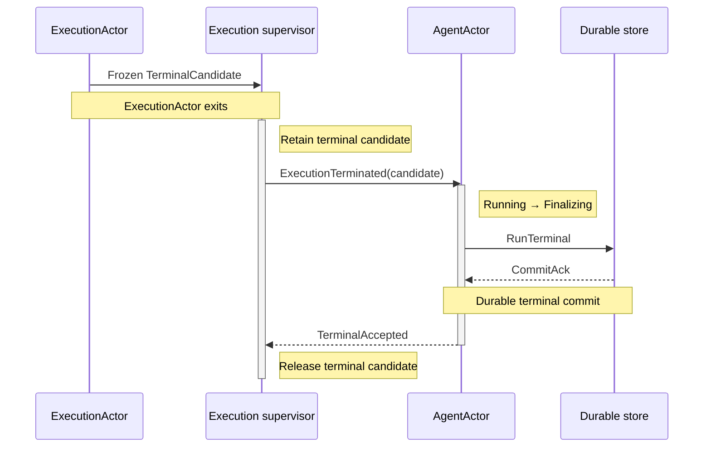

# Agent Run Atomicity Design

> Status: implemented runtime contract
> Runtime base: [Agent Runtime Actor Design](single-agent-actor-runtime-design.md)
> Business model: [Multi-Agent Runtime Model](multi-agent-execution-model.md)
> Resource control: [Actor Protocol Scopes Design](actor-protocol-scopes-design.md)

## 1. Purpose

Define reliable startup and completion semantics for one Agent run without
exposing Execution as a public control concept.

This contract closes four failure windows in the earlier implementation:

1. a durable start could be written before the internal runtime accepted
   the Execution;
2. a queued follow-up may be acknowledged and then silently fail to start;
3. terminal report persistence failure may still publish an in-memory report;
4. detached completion and attached waiters must observe the same durable
   terminal result.

## 2. Boundary

The public model remains Agent-only:

```text
run_agent(agent_instance_id, input)       → durable Agent report
send_agent_input(...)                     → acceptance receipt
send_agent_input_detached(..., recipient) → acceptance receipt + later inbox
cancel_agent_run(agent_instance_id)       → cancellation acceptance
```

Execution identity is allocated and used only inside AgentRuntime for Actor
supervision, transcript commits, recovery, and diagnostics.

## 3. Consistency Boundary

AgentActor is the single serialization boundary for:

- accepting or rejecting input;
- selecting the next input;
- preparing and activating an internal Execution;
- current-run ownership;
- terminal report persistence;
- waiter completion;
- detached inbox delivery registration;
- follow-up advancement.

AgentExecutionRuntime manages ExecutionActor resources but cannot independently
declare an Agent run accepted or completed.

hostd remains the durable writer through `AgentCommitPort` and
`ExecutionCommitPort`.

### 3.1 Two Atomicity Layers

Atomicity is enforced at two distinct consistency boundaries:

| Boundary | Owner | Atomic decisions |
|---|---|---|
| Agent run | AgentActor | input acceptance, active run, durable queue, terminal report, waiter/inbox publication |
| internal Execution | ExecutionActor | Model Step context, message commit, steering visibility, cancellation, terminal candidate |

The Execution supervisor sits between them. It owns prepared reservations,
Tokio task lifecycle, panic conversion, and reliable terminal handoff. It is not
another business-state writer.

No database transaction spans the two Actors. Atomicity comes from ordered,
idempotent messages with one explicit commit point per boundary.

## 4. Agent Run State

Agent lifecycle and run state remain separate.

```rust
enum AgentRunState {
    Idle,
    Starting(PendingRun),
    Running(ActiveRun),
    Finalizing(PendingTerminal),
}
```

```rust
struct PendingRun {
    run_id: AgentRunId,
    internal_execution_id: ExecutionId,
    input: PendingAgentInput,
    completion: CompletionTargets,
}

struct ActiveRun {
    run_id: AgentRunId,
    internal_execution_id: ExecutionId,
    completion: CompletionTargets,
}

struct PendingTerminal {
    active: ActiveRun,
    report: AgentExecutionReport,
    transcript: Vec<Message>,
    attempts: u32,
}
```

`AgentRunId` is an internal durable correlation key. It is not exposed to users
or LLM tools. It may initially equal the internal Execution ID, but the types
must not be aliases in APIs.

State transitions:

```text
Idle
  → Starting
  → Running
  → Finalizing
  → Idle
```

Failure transitions:

```text
Starting + prepare failure       → Idle + rejected input
Starting + start commit failure  → rollback prepared Execution → Idle
Running + terminal              → Finalizing
Finalizing + commit retry        → Finalizing
Finalizing + commit success      → publish completion → Idle
```

## 5. Startup Protocol

Startup uses `prepare → commit → activate`.

### 5.1 Prepare

AgentActor asks the internal execution runtime to prepare an Execution:

```rust
let prepared = execution.prepare_execution(request).await?;
```

Prepare may:

- validate Session and Agent identity;
- resolve immutable execution services;
- allocate bounded mailbox and cancellation token;
- reserve the AgentInstance in SessionExecutionScope;
- construct the ExecutionActor and handle.

Prepare must not:

- spawn the Actor task;
- call llmd;
- execute tools;
- emit realtime deltas;
- publish an accepted receipt;
- write transcript or terminal state.

It returns an affine internal value:

```rust
struct PreparedExecution {
    identity: ExecutionIdentity,
    actor: Option<ExecutionActor>,
    reservation: ExecutionReservation,
}

impl PreparedExecution {
    async fn activate(self) -> ActivationAck;
    async fn rollback(self);
}
```

Dropping or explicitly rolling back a prepared value releases its generation-
checked reservation.

### 5.2 Durable Start

After prepare succeeds, AgentActor commits one start record:

```rust
AgentDurableCommand::RunStarted {
    agent_instance_id,
    run_id,
    internal_execution_id,
    request_id,
    source_turn_id,
    started_at,
}
```

The command is idempotent by `run_id` and validates that the Agent has no other
nonterminal run.

No accepted/queued-to-start acknowledgement is returned before this commit.

### 5.3 Activate

After the durable acknowledgement, AgentActor activates the prepared Execution.
Activation consumes the input-committed typestate, transfers the lease to the
supervisor, spawns the task, opens its start gate, and returns `ActivationAck`.
There is no fallible branch after the valid typestate is constructed; panic or
abnormal task exit is converted by supervision. AgentActor changes to `Running`
only after the ownership transfer.

`tokio::spawn` itself does not provide a fallible business acknowledgement.
Any immediate panic or abnormal exit is handled as an ordinary terminal failure
by supervision.

### 5.4 Cross-Actor Startup Handshake



There are two distinct commit points:

- `RunStarted` is the durable acceptance commit;
- `ActivationAck` is the live-runtime ownership commit.

Once the durable start exists, abnormal task startup or panic converges through
a terminal failure candidate. AgentActor never deletes or compensates away the
durable start record.

### 5.5 Crash Semantics

| Crash point | Durable truth | Recovery |
|---|---|---|
| before prepare | no run | input not accepted |
| after prepare, before commit | no run | reservation disappears with process |
| after commit, before activate | started run | recover as interrupted |
| after activate | started run | recover terminal if present, otherwise interrupted |

A committed-but-not-activated run is not a ghost: it is a durably accepted run
whose process was interrupted.

## 6. Acceptance Semantics

### 6.1 `run_agent`

The call does not return an acceptance receipt. Its waiter is registered in
AgentActor before startup. It returns only after durable terminal publication.

Startup rejection returns an error directly. Once durable start succeeds, the
call eventually returns a durable report or a persistence/runtime error; it
never returns an uncommitted report as success.

### 6.2 Immediate input

`send_agent_input` with an Idle target returns `Accepted` only after:

1. internal prepare succeeds;
2. `RunStarted` commits;
3. `ActivationAck` confirms live ownership.

### 6.3 Follow-up input

A Running Agent may accept `FollowUp`. A `Queued` acknowledgement means the
input is durably present in the Agent queue, not merely in a VecDeque.

```rust
AgentDurableCommand::InputQueued {
    agent_instance_id,
    queued_input: DurableAgentInput,
}
```

When the active run commits terminal, AgentActor atomically advances the oldest
queued item into a run:

```rust
AgentDurableCommand::QueuedInputStarted {
    agent_instance_id,
    queued_input_id,
    run_id,
    internal_execution_id,
    started_at,
}
```

This command removes the queue item and creates the run record in one storage
transaction. If prepare fails before that command, the item remains queued. If
the command fails, the prepared Execution is rolled back and the item remains
queued.

The queue is FIFO per AgentInstance. Recovery restores it.

## 7. Completion Protocol

ExecutionActor produces an in-memory terminal candidate:

```rust
struct ExecutionTerminalCandidate {
    outcome: ExecutionOutcome,
    transcript: Vec<Message>,
}
```

It does not complete Agent-level waiters or detached delivery.

AgentActor changes `Running → Finalizing`, builds the bounded Agent report, and
commits:

```rust
AgentDurableCommand::RunTerminal {
    run_id,
    report,
    finished_at,
}
```

The durable writer validates:

- the run exists and belongs to the Agent;
- it is not already terminal with a conflicting report;
- the terminal transition is idempotent;
- Agent latest-report projection is updated in the same commit.

Only after commit acknowledgement may AgentActor:

1. update its reusable transcript;
2. insert the report into completed history;
3. clear the active run;
4. publish the Agent snapshot;
5. resolve attached waiters;
6. start detached inbox delivery;
7. advance the next durable follow-up.

### 7.1 Cross-Actor Terminal Handoff

ExecutionActor must not synchronously wait for AgentActor persistence before it
can exit. The supervisor temporarily owns the terminal candidate:



The supervisor converts panic, cancellation, and abnormal exit into exactly one
candidate and retains it until AgentActor acknowledges receipt. AgentActor owns
durable terminal retry after accepting the candidate.

This avoids a direct AgentActor ↔ ExecutionActor await cycle during persistence
or shutdown.

### 7.2 ExecutionActor Local Atomicity

ExecutionActor has its own local state machine:

```rust
enum ExecutionState {
    Prepared,
    Running {
        model_step_index: u32,
        transcript_head: Option<MessageId>,
    },
    Cancelling,
    ProducingTerminal,
    Terminal,
}
```

Allowed transitions:

```text
Prepared → Running
Running → Running
Running → Cancelling
Running/Cancelling → ProducingTerminal
ProducingTerminal → Terminal
```

The entire Execution is not one transaction: model and tool calls are long,
external operations and cannot be rolled back. Atomicity applies to each
durable transition:

```text
model response
→ build assistant message
→ durable message commit
→ advance transcript head
→ next Model Step may observe it
```

```text
tool result / steering input
→ durable message commit
→ update reusable context
→ next Model Step may observe it
```

Rules:

1. uncommitted messages never enter reusable model context;
2. a Model Step starts from one frozen transcript head;
3. steering becomes visible only after its durable commit;
4. tool-result commits preserve deterministic tool-call order;
5. cancellation, normal completion, model error, tool error, and panic compete
   through one `choose_terminal_once` transition;
6. ExecutionActor emits at most one terminal candidate;
7. the candidate is emitted only after all required message commits settle.

Late terminal causes observe the already selected outcome and cannot overwrite
it.

The current independent `finalize_execution` outcome commit must not remain a
second terminal authority. Its durable data is folded into `RunTerminal` (or
written as subordinate diagnostic data in the same host transaction). There
must be one durable terminal commit whose outcome drives both internal
Execution recovery and the Agent report.

## 8. Terminal Commit Failure

Terminal persistence failure must not be converted into a successful Agent
report.

AgentActor remains in `Finalizing` and retains `PendingTerminal`. While
Finalizing:

- new StartWhenIdle input is rejected as busy;
- steering is rejected because model execution has ended;
- cancellation is acknowledged as already terminal/in finalization;
- waiters remain pending;
- detached delivery does not occur;
- follow-ups remain queued.

AgentActor retries with bounded exponential backoff and jitter. Retry scheduling
uses a self-message/timer and does not block mailbox processing.

Errors should distinguish retryable unavailability from permanent identity or
idempotency conflict. A permanent conflict marks the Agent unavailable and
completes waiters with `PersistenceFailed`; it still never publishes the
uncommitted report as success.

On process loss, recovery sees a started nonterminal run and marks it
interrupted. Durable transcript messages remain available for diagnosis, but
the run is not reported as successfully completed without a terminal record.

## 9. Detached Delivery

Detached completion registration is part of the accepted input state and is
associated with `run_id`, not exposed Execution identity.

After `RunTerminal` commits, AgentActor commits the recipient inbox item. Inbox
commit is independently idempotent by deterministic `report_id`.

If inbox commit temporarily fails:

- the source run remains terminal;
- detached delivery remains pending and is retried;
- attached waiters may already receive the durable source report;
- the failure does not rerun the Agent.

Pending detached delivery must be recoverable from durable run completion plus
delivery metadata. Live `InboxReport` is sent only after inbox commit.

Tests enforce `RunStarted(registration) → RunTerminal → CommitReport`, recovery
without a source model call, and idempotent recipient inbox insertion.

## 10. Cancellation

Cancellation targets the AgentInstance.

AgentHandle exposes a process-local cancellation control separate from the
mailbox. AgentActor installs its generation-scoped token before publishing the
Starting snapshot, so cancellation can be signalled while the Actor awaits
prepare or durable startup I/O. The mailbox command still serializes the final
business acknowledgement.

| State | Result |
|---|---|
| Idle | reject: no active run |
| Starting before durable start | rollback prepare, reject/finish input |
| Starting after durable start | cancel on activation or produce Cancelled terminal |
| Running | signal internal ExecutionActor |
| Finalizing | no new signal; wait for terminal commit |

Cancellation acceptance is not terminal acknowledgement. `run_agent` completes
only after the Cancelled report is durable.

## 11. Idempotency

Required keys:

- `request_id`: same Agent input request and payload;
- `queued_input_id`: one durable follow-up;
- `run_id`: one Agent run;
- `internal_execution_id`: one internal Execution incarnation;
- `report_id`: one detached inbox item.

Same key + same payload returns the existing durable result. Same key +
different payload returns `IdempotencyConflict`.

In-memory idempotency maps are caches only. Durable state is authoritative
after recovery.

## 12. Durable Model Changes

The earlier coarse commands:

```text
ExecutionStarted
RecordExecutionReport
```

are replaced by Agent-run commands:

```text
RunStarted
RunTerminal
InputQueued
QueuedInputStarted
CommitReport
```

The manifest stores per-run state and the durable follow-up queue. Internal
Execution fields remain storage metadata and are not re-exported as control
DTOs.

## 13. Internal Runtime API Changes

Replace internal `start_execution` with:

```rust
prepare_execution(request) -> PreparedExecution
PreparedExecution::activate() -> ActivationAck // infallible ownership transfer
PreparedExecution::rollback()
```

AgentActor replaces `active_execution_id: Option<_>` with `AgentRunState` and
moves waiter/detached targets into the Pending/Active run records.

Execution supervision owns the prepared lease, task, and terminal candidate
handoff. It sends exactly one candidate to AgentActor and retains it until
`TerminalAccepted`; it does not independently mutate Agent completion state.

## 14. Failure Matrix

| Failure | Public result | Durable result | Agent state |
|---|---|---|---|
| prepare rejected | error | unchanged | Idle/previous Running |
| start commit failed | error or queue retained | no run | Idle/Running |
| panic after start | failed report after commit | terminal failed | Idle |
| cancellation | cancelled report after commit | terminal cancelled | Idle |
| terminal commit transient failure | pending | started nonterminal | Finalizing |
| terminal commit permanent conflict | persistence error | conflict retained | Unavailable |
| detached inbox commit failure | source report may succeed | delivery pending | Idle |
| follow-up prepare failure | no silent loss | queue retained | Idle + queued |

Detached delivery registration is stored on `RunStarted` or
`QueuedInputStarted`; it is not a second commit that can race fast completion.

## 15. Implemented Structure

1. `AgentRunState` serializes Idle, Starting, Running, and Finalizing.
2. `PreparedExecution` implements prepare/activate/rollback and owns the
   generation-checked reservation until activation.
3. `RunStarted`, `RunTerminal`, `InputQueued`, and `QueuedInputStarted` are the
   durable run and queue transitions.
4. The supervisor converts panics to terminal failure and retains the terminal
   handoff until AgentActor acknowledgement.
5. AgentActor retries transient terminal commit failures and publishes waiters,
   transcript state, and detached delivery only after commit acknowledgement.
6. Recovery restores transcript heads, durable follow-ups, and pending detached
   deliveries.
7. Execution message commits precede reusable-context advancement.

## 16. Verification

Tests must cover:

- prepare failure writes no run record;
- start commit failure rolls back reservation;
- no model call begins before RunStarted acknowledgement;
- no Accepted receipt is returned before ActivationAck;
- abnormal task startup or panic after durable start produces a terminal failure;
- crash-equivalent recovery after start commit produces interrupted outcome;
- duplicate start and terminal commits are idempotent;
- terminal commit failure resolves no waiter and delivers no inbox report;
- terminal retry publishes exactly once;
- queued follow-up survives prepare and commit failures;
- queued follow-up survives Session reopen;
- detached registration cannot race fast completion;
- detached inbox retry does not rerun the source Agent;
- cancellation in Starting, Running, and Finalizing states converges;
- competing normal/error/cancel/panic exits produce one terminal candidate;
- message commit failure never advances reusable Execution context;
- supervisor retains terminal handoff until AgentActor acknowledgement;
- one AgentActor never owns two active internal Executions.

### 16.1 Verification Evidence

The implementation test suite enforces these groups directly:

- startup rejection, reservation rollback, Drop/task-abort cleanup, stale
  generation fencing, and retry after prepare failure;
- cancellation during durable startup, active execution, and Finalizing;
- RunStarted/RunTerminal idempotency and interrupted recovery;
- terminal retry, permanent conflict, panic conversion, first-wins terminal
  selection, and durable-before-waiter publication;
- durable follow-up queue recovery and retry after `QueuedInputStarted` commit
  failure with one eventual Execution;
- message-commit-before-context advancement;
- acknowledged terminal handoff and failure on an unacknowledged dropped lease;
- detached fast-completion ordering, transient retry, crash recovery without a
  model call, and idempotent inbox insertion.

## 17. Invariants

1. No model/tool work begins before durable run start.
2. No accepted run lacks either a terminal record or interrupted recovery.
3. No Agent report is published as success before terminal commit acknowledgement.
4. A queued acknowledgement means durable queue membership.
5. Follow-up startup failure never silently loses input.
6. Detached completion registration is atomic with accepted input.
7. Inbox publication occurs only after durable inbox commit.
8. Every run has at most one terminal report.
9. AgentActor is the sole Agent run state writer.
10. Execution remains an AgentRuntime-internal implementation detail.
11. ExecutionActor is the sole writer of Model Step state; the Execution
    supervisor owns the first-wins terminal selector.
12. Supervisor handoff never creates a second terminal candidate or Agent report.
