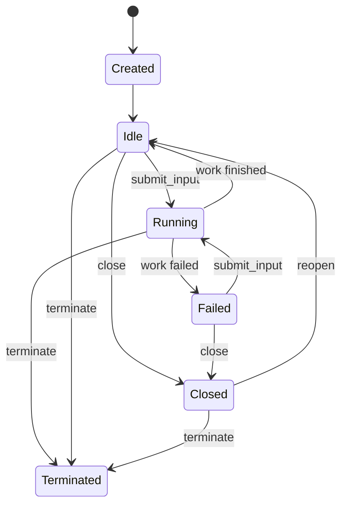
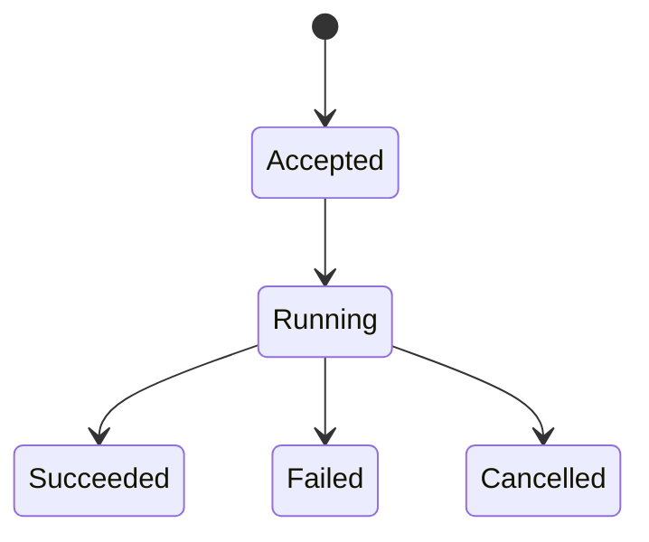

# Agent Runtime API and orchd Layout Design

本文档定义 piko 统一的 agent runtime API、消息提交与持久化语义、恢复模型，以及 `packages/orchd` 的目标目录结构。

本文档是目标设计，不表示所有类型和目录已经实现。现有身份和架构规范仍分别见：

- `docs/agent-identity.md`
- `docs/multi-agent-mental-model.md`
- `docs/stream-architecture.md`
- `docs/agent-architecture.md`
- `docs/message-types.md`

---

## 1. Background

piko 使用 hostd + orchd 架构：

- hostd 是 session storage、用户可见状态和恢复投影的权威层。
- orchd 是 task runtime、transcript mutation、LLM step、工具执行和多 agent supervision 的权威层。
- `agent_id` 标识静态 AgentSpec；`task_id` 标识长生存的 runtime instance。
- main 和所有 child task 共用同一套 orchd 执行链。

当前 user message 路径不对称：

| | main | child task |
|---|---|---|
| 输入来源 | TUI `TurnSubmit` | spawn prompt / `steer_task` |
| 内存 transcript | orchd 写入 | orchd 写入 |
| JSONL | hostd 在 `TurnSubmit` 中特权写入 | 没有统一写入 |
| 恢复 | main 可见 user entry | child 缺少 prompt 和 steer |

根因不是两套 runtime，而是 user transcript mutation 没有统一成为 durable committed fact。

现有 orchd 目录也放大了这一问题：task 创建、输入、transcript、persist 和 lifecycle 横跨 `application`、`runtime/orchestrator`、`runtime/dispatch` 与多个 consumer，缺少一条可追踪的 Agent API 路径。

---

## 2. Goals

本设计目标：

1. main 和所有 child task 使用同一套 Agent API。
2. initial prompt 和后续 steer 使用同一个 task input API。
3. 每次 user transcript mutation 都产生且只产生一个 durable message fact。
4. hostd 不再为 main 维护特殊写盘路径。
5. JSONL message entry 足以按 task 恢复完整 transcript。
6. lifecycle、display、persist 和 command acknowledgement 语义严格分离。
7. task runtime 的输入、状态机、step、tool 和事件输出具有清晰目录边界。
8. 本地测试 sink 与生产 session output hub 共享同一套业务逻辑，不存在 `senders=None` 分支。
9. API 支持幂等、顺序校验、持久化失败和 runtime 恢复。
10. 允许渐进迁移，不要求一次完成存储 schema 大迁移。

非目标：

- 不改变 TUI 的基本交互模型。
- 不改变 spawn、spawn detached、poll 和 steer 的用户语义。
- 不要求立即移除 task metadata 中冗余的 `prompt` 字段。
- 不保留旧 `{agent-id}.jsonl` 存储布局；实现时直接切换到 per-task shard。
- 不把 orchd 变成 durable state authority。

---

## 3. Core Model

统一对象模型：

```text
AgentSpec
  static capability template, keyed by agent_id

AgentTask
  long-lived runtime instance, keyed by task_id

Work
  one input-driven execution cycle, keyed by work_id

Message
  durable transcript fact, keyed by message_id
```

### 3.1 Identity

| Identity | Meaning | Lifetime |
|---|---|---|
| `session_id` | hostd session | 整个会话 |
| `agent_id` | AgentSpec 模板 | 静态配置生命周期 |
| `task_id` | agent runtime instance | 跨多个 work |
| `work_id` | 一次输入驱动的执行周期 | input accepted 到 idle/failed |
| `message_id` | transcript message | 永久稳定 |
| `request_id` | API 调用幂等键 | 至少覆盖重试窗口 |

现有 `turn_id` 在兼容阶段可以保留，但其稳定语义应收敛为 root task 的 `work_id`，不能作为 task identity。

所有 runtime 定位必须使用 `task_id`。禁止使用 `agent_id` 执行 steer、cancel、resume 或 view routing。

### 3.2 Ownership

| State | Owner |
|---|---|
| AgentSpec registry | hostd 配置权威；orchd 持有运行副本 |
| Active task handles | orchd supervisor |
| In-memory task transcript | task runtime |
| Durable transcript | hostd JSONL |
| Task DAG durable projection | hostd |
| Task DAG live registry | orchd supervisor |
| Session tree selection | hostd |
| TUI timeline/view | hostd projection + TUI local state |

关键边界：

- orchd 决定什么进入 transcript。
- hostd 决定 committed fact 是否已经 durable。
- supervisor 不拥有 transcript。
- lifecycle metadata 不能替代 transcript message。

---

## 4. Unified Agent API

完整 Agent API 由四个平面组成：

```text
Command API       create_task / submit_input / control_task
Snapshot API      session_snapshot / task_snapshot
Observation API   subscribe_session
Integration Port  PersistSink request/ack
```

前三者是调用方使用的 public Agent API；`PersistSink` 是 hostd 实现、orchd 调用的 integration contract。Observation 不是外围 UI plumbing，而是 Agent API 的正式 output contract。

建议公开 trait：

```rust
#[async_trait]
pub trait AgentRuntime: Send + Sync {
    async fn create_task(
        &self,
        request: CreateTaskRequest,
    ) -> Result<TaskHandle, AgentApiError>;

    async fn submit_input(
        &self,
        request: SubmitTaskInput,
    ) -> Result<InputReceipt, AgentApiError>;

    async fn control_task(
        &self,
        request: TaskControlRequest,
    ) -> Result<TaskSnapshot, AgentApiError>;

    async fn task_snapshot(
        &self,
        task_id: TaskId,
    ) -> Result<TaskSnapshot, AgentApiError>;

    async fn session_snapshot(
        &self,
        session_id: SessionId,
    ) -> Result<SessionRuntimeSnapshot, AgentApiError>;

    async fn subscribe_session(
        &self,
        request: SubscribeRequest,
    ) -> Result<SessionSubscription, AgentApiError>;
}
```

跨 crate 的 serializable DTO 定义在 `piko-protocol`；trait、runtime context 和 side-effect ports 定义在 orchd。

### 4.1 Create Task

```rust
pub struct CreateTaskRequest {
    pub request_id: RequestId,
    pub session_id: SessionId,
    pub task_id: Option<TaskId>,
    pub agent_id: AgentId,
    pub parent_task_id: Option<TaskId>,
    pub source: InputSource,
    pub mode: TaskMode,
    pub host_context: HostTaskContext,
}
```

`CreateTaskRequest` 不携带 prompt。task 创建与第一条 input 是两个独立操作：

```text
create_task(child)
submit_input(child, initial prompt)
```

可以提供 `create_task_with_input` 便利方法，但它只能组合上述两个 API，不能形成第二条 transcript 路径。

```rust
pub struct TaskHandle {
    pub session_id: SessionId,
    pub task_id: TaskId,
    pub agent_id: AgentId,
    pub status: TaskStatus,
}
```

### 4.2 Submit Input

`submit_input` 是所有 user-role transcript input 的唯一入口：

```rust
pub struct SubmitTaskInput {
    pub request_id: RequestId,
    pub session_id: SessionId,
    pub task_id: TaskId,
    pub message_id: MessageId,
    pub work_id: WorkId,
    pub source: InputSource,
    pub content: MessageContent,
    pub delivery: InputDelivery,
    pub submitted_at: i64,
}
```

```rust
pub enum InputSource {
    User,
    Task {
        task_id: TaskId,
        agent_id: AgentId,
    },
    System {
        component: String,
    },
}
```

来源是 provenance，不改变目标 task 中的 message role。父 task 给 child 的 initial prompt 和 steer 对 child transcript 来说都是 `Message::User`。

```rust
pub enum InputDelivery {
    Immediate,
    AfterCurrentStep,
}
```

如果第一阶段只实现安全点注入，可以只接受 `AfterCurrentStep`，但不能让运行中 steer 的插入时机保持隐式。

```rust
pub struct InputReceipt {
    pub request_id: RequestId,
    pub task_id: TaskId,
    pub work_id: WorkId,
    pub message_id: MessageId,
    pub disposition: InputDisposition,
}

pub enum InputDisposition {
    Accepted,
    Queued,
    Duplicate,
}
```

### 4.3 Control Task

```rust
pub enum TaskControlRequest {
    Close {
        request_id: RequestId,
        task_id: TaskId,
    },
    Reopen {
        request_id: RequestId,
        task_id: TaskId,
    },
    CancelWork {
        request_id: RequestId,
        task_id: TaskId,
        work_id: WorkId,
    },
    Terminate {
        request_id: RequestId,
        task_id: TaskId,
    },
}
```

- `CancelWork` 中止当前 work，task 仍可继续接收 input。
- `Close` 拒绝新 input，但允许 reopen。
- `Terminate` 结束 runtime handle，不再作为活动 task 使用。

### 4.4 Snapshot

stream 不能替代 snapshot：subscription 可能断开，realtime delta 允许丢失，可靠事件也只有有限 retention。

```rust
pub struct SessionRuntimeSnapshot {
    pub session_id: SessionId,
    pub root_task_id: Option<TaskId>,
    pub active_task_id: Option<TaskId>,
    pub tasks: Vec<TaskSnapshot>,
    pub cursor: SessionCursor,
}
```

`TaskSnapshot` 按 `task_id` 查询；`SessionRuntimeSnapshot` 提供整个 session 的 task DAG/live status 投影。durable transcript 内容仍由 hostd repository/task shards 提供，orchd snapshot 不取代 durable recovery。

### 4.5 Observation Subscription

observation 以 session 为订阅作用域，因为 child task 会动态创建；事件本身始终携带 `task_id`。调用方可以可选过滤单个 task，但不能通过 `agent_id` 唯一定位 runtime。

```rust
use futures_core::Stream;
use std::pin::Pin;

pub type SessionOutputStream = Pin<
    Box<
        dyn Stream<
                Item = Result<SessionOutputEnvelope, SessionStreamError>,
            > + Send
            + 'static,
    >,
>;

pub struct SubscribeRequest {
    pub session_id: SessionId,
    pub task_id: Option<TaskId>,
    pub after: Option<SessionCursor>,
}

pub struct SessionCursor {
    pub epoch: String,
    pub seq: u64,
}

pub struct SessionSubscription {
    pub session_id: SessionId,
    pub cursor: SessionCursor,
    pub output: SessionOutputStream,
}
```

推荐同步流程：

```text
session_snapshot
  → record snapshot.cursor
  → subscribe_session(after = snapshot.cursor)
  → apply reliable SessionEvent
  → render RealtimeDelta opportunistically
```

如果 cursor epoch 不匹配或 retention 已不足，返回 `SnapshotRequired`，调用方重新获取 snapshot。subscription 断开不得终止 task；task idle/closed 不得关闭整个 session subscription；新 spawn task 自动出现在已有 session subscription 中。

`create_task` 和 `submit_input` 不返回 task/work 专属 stream：

```text
create_task      → TaskHandle
submit_input     → InputReceipt
subscribe_session → long-lived SessionOutputStream
```

否则 hostd 必须为每个动态 child 管理 receiver，并重新定义 idle、steer、reconnect 时 stream 的生命周期。只观察单个 task 时使用 `SubscribeRequest.task_id` 过滤，不创建第二套输出拓扑。

### 4.6 Observation Envelopes and Guarantees

```rust
pub struct SessionOutputEnvelope {
    pub session_id: SessionId,
    pub emitted_at: i64,
    pub output: SessionOutput,
}

pub enum SessionOutput {
    Event(SessionEventEnvelope),
    Delta(RealtimeDeltaEnvelope),
}

pub struct SessionEventEnvelope {
    pub task_id: TaskId,
    pub agent_id: AgentId,
    pub task_seq: u64,
    pub cursor: SessionCursor,
    pub event: SessionEvent,
}

pub struct RealtimeDeltaEnvelope {
    pub task_id: TaskId,
    pub agent_id: AgentId,
    pub work_id: WorkId,
    pub message_id: Option<MessageId>,
    pub delta_seq: u64,
    pub delta: RealtimeDelta,
}
```

可靠事件保证：

- committed notification 只在 durable commit 成功后发布；
- 每个 task 的可靠事件遵循 `task_seq`；
- session hub 为 notification 分配 runtime-scoped cursor；
- retention 内支持 cursor 续订；超出 retention 返回 `SnapshotRequired`；
- 慢订阅者不能阻塞 durable commit 或 LLM execution。

实时增量保证：

- 不持久化、不用于恢复、不保证重放；
- subscriber lag 时允许丢弃；
- 必须携带 task/work/message identity；
- `delta_seq` 只保证同一个 message 内的增量顺序；
- 最终由 committed message 或 snapshot 校正。

public API 暴露统一 `SessionOutputStream`，内部使用 reliable event lane 和 realtime delta lane，并在 subscription 边界合并。

不保证两个 lane 之间的全局顺序。`MessageEnded` 与 `MessageCommitted` 可能因调度以任一顺序被观察；client 必须把 committed event 当作最终状态，用它覆盖或修正临时 delta。`task_seq` 只排序 durable/recoverable events，`delta_seq` 只排序同一 message 的 deltas。

### 4.7 Stream Errors

```rust
pub enum SessionStreamError {
    SnapshotRequired {
        reason: SnapshotRequiredReason,
    },
    SessionClosed,
    RuntimeUnavailable,
    Internal {
        message: String,
    },
}

pub enum SnapshotRequiredReason {
    EpochChanged,
    CursorExpired,
    CursorUnknown,
}
```

当 cursor 无法续订时，stream yield `SnapshotRequired` 后结束。client 获取新 snapshot，并使用 snapshot cursor 重新订阅。`SessionStreamError` 表示持续观察失败；command failure 仍使用 `AgentApiError`，二者不能混用。

---

## 5. API Mapping

### 5.1 Root TurnSubmit

```text
TUI TurnSubmit
  → hostd expands templates/prompts
  → resolve root task by session_id
  → create_task(main), if absent
  → allocate request_id/work_id/message_id
  → submit_input(root task)
```

hostd 不再直接向 `main.jsonl` append user message。

### 5.2 Spawn

```text
parent spawn tool call
  → create_task(child spec, parent_task_id)
  → submit_input(child, initial prompt)
  → optionally await child work report
```

`spawn` 和 `spawn_detached` 的区别只在父 task 是否等待 work result，不在 child 初始化方式。

### 5.3 Steer

```text
steer_task(task_id, text)
  → allocate request_id/work_id/message_id
  → submit_input(task_id, text)
```

steer 不再直接发送只包含字符串的特殊控制消息。

### 5.4 Queue and Follow-up

hostd queue 只决定何时调用 `submit_input`，不决定如何修改 transcript 或落盘。

---

## 6. Task Mailbox and Input Commit

现有 `TaskSteerMessage` 应收敛为通用 mailbox：

```rust
pub(crate) enum TaskMailboxMessage {
    Input(SubmitTaskInput),
    Control(TaskControlRequest),
}
```

mailbox 负责接收、排队、delivery policy 和 receipt response，不直接修改 transcript。

Task runtime 内只有一个 user commit 方法：

```rust
async fn commit_input(
    &mut self,
    input: SubmitTaskInput,
) -> Result<InputReceipt, TaskRunError>;
```

逻辑顺序：

```text
validate identity and state
  → deduplicate request_id/message_id
  → build Message::User
  → allocate next task_seq
  → request durable commit
  → await persist acknowledgement
  → append to in-memory transcript
  → create/start work
  → return InputReceipt
  → run LLM step
```

持久化失败时：

- 不得 append transcript；
- 不得启动 LLM step；
- 返回 `PersistenceFailed`；
- 重试必须使用相同 request/message identity。

initial prompt、root follow-up 和 child steer 都走该方法。

---

## 7. Event Model

系统有三个事件平面和一个 command response 平面。

### 7.1 Durable Facts

用于 JSONL、恢复和审计：

```text
MessageCommitted
TaskLifecycleCommitted
WorkLifecycleCommitted
```

### 7.2 Session Observation Output

session observation 的最终消费者目前主要是 hostd/TUI，但不能把所有输出都建模成纯渲染细节。对外统一暴露一个 `SessionOutputStream`，语义上区分可靠的结构化通知与临时实时增量：

```rust
pub enum SessionOutput {
    Event(SessionEventEnvelope),
    Delta(RealtimeDeltaEnvelope),
}
```

可靠事件：

```rust
pub enum SessionEvent {
    TaskChanged {
        snapshot: TaskSnapshot,
    },
    WorkChanged {
        snapshot: WorkSnapshot,
    },
    MessageCommitted {
        message_id: MessageId,
        work_id: WorkId,
        role: MessageRole,
    },
    ToolCommitted {
        message_id: MessageId,
        work_id: WorkId,
        tool_call_id: ToolCallId,
    },
    InteractionRequested {
        request: InteractionRequest,
    },
    InteractionResolved {
        resolution: InteractionResolution,
    },
}
```

实时增量：

```rust
pub enum RealtimeDelta {
    MessageStarted {
        role: MessageRole,
    },
    Text {
        content_index: u32,
        delta: String,
    },
    Thinking {
        content_index: u32,
        delta: String,
    },
    ToolCall {
        content_index: u32,
        tool_call_id: ToolCallId,
        delta: String,
    },
    MessageEnded {
        stop_reason: Option<String>,
        error_message: Option<String>,
    },
}
```

二者都会经 hostd 转发给 TUI 或其他 client，但 delivery semantics 不同：

| Lane | Semantics |
|---|---|
| reliable event | 低频、结构化、可靠通知；断线后可由 snapshot/task log 修正 |
| realtime delta | 高频、临时、允许 subscriber lag 时丢失；不用于恢复 |

public API 可以合并为一个 `SessionOutputStream`；内部必须保留两个不同 QoS lane，避免大量 token delta 阻塞可靠事件。

这些输出都只是 observation：

- hostd durable state 在 `PersistSink` commit 时更新，不依赖 `SessionEvent` 构建。
- supervisor runtime state 通过 task runtime/internal observer 更新，不依赖 session output 回流。
- `SessionEvent` 是状态变化发生后的 notification，不是状态机输入。
- `RealtimeDelta` 只驱动实时渲染，不承担恢复语义。

### 7.3 Runtime Lifecycle

用于 live status 和 supervision：

```text
TaskCreated
TaskStarted
TaskIdle
TaskClosed
TaskReopened
TaskTerminated
WorkStarted
WorkSucceeded
WorkFailed
WorkCancelled
```

task/work lifecycle 首先作为 durable fact 经 `PersistSink` commit，并通过内部 lifecycle observer 更新 supervisor。commit 完成后可以投影为 `SessionEvent::TaskChanged` 或 `SessionEvent::WorkChanged`。不再建立 public lifecycle stream，也不让 hostd 从 lifecycle notification 反向构建权威状态。

### 7.4 Command Acknowledgement

用于告诉调用者命令是否被接受：

```text
TaskCreated receipt
InputReceipt
ControlApplied
ControlRejected
```

command acknowledgement 不进入 transcript。

### 7.5 Message Persist Event

最终目标是统一 committed message：

```rust
pub enum PersistEvent {
    MessageCommitted {
        session_id: SessionId,
        task_id: TaskId,
        agent_id: AgentId,
        work_id: WorkId,
        task_seq: u64,
        message_id: MessageId,
        parent_message_id: Option<MessageId>,
        message: Message,
        committed_at: i64,
    },
    TaskEventCommitted(TaskEvent),
    WorkEventCommitted(WorkEvent),
}
```

迁移第一阶段可以保留现有 variants，并新增：

```rust
UserCommitted {
    session_id,
    message_id,
    task_id,
    agent_id,
    message,
}
```

然后通过统一 helper 将 `UserCommitted`、`Finalized`、`ToolCallCommitted` 和 `ToolResultCommitted` 归一化成 committed message view。

### 7.6 Lifecycle Does Not Own Transcript

`TaskEvent::Created.prompt` 和 `TaskEvent::Steered.message` 可以暂时作为兼容或审计字段保留，但不得作为恢复来源。

禁止：

```text
TaskEvent::Created → resume prompt
TaskEvent::Steered → resume user message
```

正确关系：

```text
submit_input
  ├─ MessageCommitted(Message::User)
  └─ lifecycle/audit event referencing message_id
```

---

## 8. Persistence Barrier

将 persist event 放进 channel 不等于数据已经写入 JSONL。若要求 user message 在 LLM step 前 durable，需要 acknowledgement barrier。

orchd-owned port：

```rust
#[async_trait]
pub trait PersistSink: Send + Sync {
    async fn commit_message(
        &self,
        event: MessageCommit,
    ) -> Result<PersistAck, PersistError>;

    async fn commit_task_event(
        &self,
        event: TaskEvent,
    ) -> Result<PersistAck, PersistError>;
}
```

```rust
pub struct PersistAck {
    pub session_id: SessionId,
    pub task_id: TaskId,
    pub message_id: Option<MessageId>,
    pub task_seq: u64,
}
```

hostd 提供实现或 channel-backed bridge：

```text
orchd requests commit
  → hostd validates identity/order
  → hostd appends JSONL
  → hostd updates HostState projection
  → hostd returns PersistAck
  → orchd appends in-memory transcript
  → committed event becomes observable
  → orchd starts LLM step
```

`PersistSink` trait 不放 `piko-protocol`，因为 protocol crate 只承载 serializable DTO，不承载 runtime trait。

如果第一阶段不实现 ack，只能保证事件顺序：

```text
UserCommitted emitted before assistant/tool events
```

此时不能宣称“user durable before LLM”。文档和测试必须区分 emitted guarantee 与 durable guarantee。

---

## 9. Idempotency and Ordering

### 9.1 Idempotency

- `request_id` 是 API operation 幂等键。
- `message_id` 是 transcript message 幂等键。
- 相同 `request_id + task_id` 重试返回原 receipt。
- 相同 `message_id` 不重复 append。
- 同一 request ID 携带不同 payload 返回 `IdempotencyConflict`。

### 9.2 Per-task Sequence

每个 task durable fact 携带单调递增的 `task_seq`：

```text
TaskCreated                 seq 1
initial UserCommitted       seq 2
WorkStarted                 seq 3
AssistantCommitted          seq 4
ToolCallCommitted           seq 5
ToolResultCommitted         seq 6
WorkSucceeded/TaskIdle      seq 7
next UserCommitted          seq 8
```

`task_seq` 用于：

- 检测丢失与乱序；
- per-task replay；
- 幂等提交；
- agent view 增量订阅；
- 不依赖多个 channel 的到达顺序。

hostd 可以继续维护 session-global view sequence；它与 `task_seq` 是两个不同概念。

---

## 10. Storage and Recovery

### 10.1 Message Entry Requirements

所有新写入的 transcript entry 必须包含：

```rust
pub struct MessageEntry {
    pub id: MessageId,
    pub parent_id: Option<MessageId>,
    pub task_id: TaskId,
    pub agent_id: AgentId,
    pub work_id: WorkId,
    pub task_seq: u64,
    pub timestamp: i64,
    pub message: Message,
}
```

存储 schema 直接切换，不提供旧 message entry 的兼容读取。所有 entry 必须包含完整的 `task_id + agent_id`；缺少 runtime identity 的 entry 视为无效数据并 fail closed。

### 10.2 Per-task Head

session tree selection 与 task transcript head 必须分离：

```text
session current_leaf_id
  用户在 session tree 中选中的节点

task_heads[task_id]
  该 task 最后一条 committed transcript message
```

每次 message commit：

```text
parent_message_id = task_heads[task_id]
append message
task_heads[task_id] = message_id
```

禁止继续使用 session-global `current_leaf_id` 作为所有 task message 的 parent，否则并发 task 会形成跨 task、跨 shard 链。

### 10.3 Per-task Shard Layout

存储粒度与 runtime identity 完全一致：一个 task 对应一个 JSONL shard，文件路由只使用 `task_id`，不得使用 `agent_id`。

目标布局：

```text
session/
├── session.json
└── tasks/
    ├── {task-id-1}.jsonl
    ├── {task-id-2}.jsonl
    └── {task-id-3}.jsonl
```

具体规则：

1. root task 也写入 `tasks/{root-task-id}.jsonl`，不再使用 `main.jsonl` 作为 transcript shard。
2. child task 写入 `tasks/{child-task-id}.jsonl`。
3. `agent_id` 保存在 task metadata 和每条 message entry 中，只表示该 task 使用的 AgentSpec。
4. 同一 `agent_id` 的多个 task 必须写入不同文件。
5. 一个 task 的 user、assistant、tool call 和 tool result 全部写入同一个 shard。
6. `parent_message_id` 只能引用当前 shard 内同一 task 的 message。
7. repository API 只接受 `task_id` 路由 transcript，不接受 `agent_id` 作为文件定位参数。
8. task shard 保存该 task 的 message 与 lifecycle durable facts，是 task 恢复的权威来源。
9. `session.json` 是 session manifest：保存 session metadata、root/active task pointer，以及可从 task shards 重建的 task DAG/status 索引。
10. shard 路径由 `task_id` 确定，无需在 manifest 中保存 locator。prompt 仅可作为冗余审计元数据。
11. task lifecycle event 与 transcript message 写入同一个 task shard，不在 `session.json` 中复制完整事件。
12. `session.json` 不保存 transcript message，也不是 task lifecycle 历史的权威来源。

不提供以下兼容行为：

- 不读取或合并旧 `{agent-id}.jsonl` / `main.jsonl` transcript shard。
- 不读取旧 `session.jsonl` 或独立 `tasks.json`。
- 不进行 dual-write。
- 不根据缺失的 `task_id` 推断 main 或 child identity。
- 不在启动时自动迁移旧 session。

如果现有 session 数据仍需保留，应由独立的一次性离线迁移工具处理；runtime repository 本身只实现新 schema。

### 10.4 Session Manifest

`session.json` 合并原本分散的 session metadata 和 task index：

```json
{
  "schemaVersion": 2,
  "sessionId": "sess_1",
  "cwd": "/project/piko",
  "name": "Agent persistence",
  "createdAt": 1720000000,
  "updatedAt": 1720000100,
  "rootTaskId": "task_root_xxx",
  "activeTaskId": "task_coder_1",
  "defaults": {
    "provider": "openai",
    "modelId": "gpt-5",
    "thinkingLevel": "medium",
    "activeToolNames": []
  },
  "tasks": {
    "task_root_xxx": {
      "agentId": "main",
      "parentTaskId": null,
      "status": "idle",
      "createdAt": 1720000000,
      "updatedAt": 1720000090
    },
    "task_coder_1": {
      "agentId": "coder",
      "parentTaskId": "task_root_xxx",
      "status": "running",
      "createdAt": 1720000050,
      "updatedAt": 1720000100
    }
  }
}
```

权威关系：

```text
session metadata
  → session.json authoritative

task messages and lifecycle history
  → tasks/{task_id}.jsonl authoritative

session.json.tasks
  → rebuildable projection of task shards
```

`session.json` 使用 snapshot 原子替换，而不是 append：

```text
serialize new manifest
  → write session.json.tmp in the same directory
  → flush/fsync
  → atomic rename to session.json
```

### 10.5 Shard Creation and Atomicity

task shard 在 `TaskCreated` durable commit 时创建，初始 user message 随后的 durable commit 写入同一文件：

```text
commit TaskCreated
  → atomically create tasks/{task_id}.jsonl with task header
  → append TaskCreated durable fact
  → update rebuildable session.json task projection
commit initial Message::User
  → append to tasks/{task_id}.jsonl
  → update in-memory projection
```

task header 至少记录：

```rust
pub struct TaskShardHeader {
    pub schema_version: u32,
    pub session_id: SessionId,
    pub task_id: TaskId,
    pub agent_id: AgentId,
    pub parent_task_id: Option<TaskId>,
    pub created_at: i64,
}
```

repository 打开 shard 时必须校验 header 中的 `session_id/task_id` 与调用参数一致。

shard 创建使用同目录临时文件、flush/fsync 和 atomic rename，防止暴露半个 header。task shard 中的 committed facts 是 task 数据的权威来源；`session.json.tasks` 只是索引，不参与 transcript correctness。

提交顺序和失败语义：

1. 先按 `task_id + task_seq` 或 `message_id` 检查幂等。
2. 将 durable fact append 到 task shard，并完成要求的 flush/fsync。
3. 更新内存投影与 `session.json` manifest。
4. 只有 durable fact 和本次所需投影均可观察后才返回 `PersistAck`。
5. 如果 durable append 成功而投影更新失败，调用不能把该操作当作未发生；重试时 repository 必须识别已经存在的 fact，跳过重复 append，重做投影后返回原 ack。
6. hostd 启动时扫描 `tasks/*.jsonl`，校验 header 和 sequence，并用 shard facts 重建或校正 `session.json.tasks`。孤立但有效的 task shard 不能被静默丢弃。

因此跨文件操作不声称具有文件系统级原子性；一致性来自 authoritative task log、幂等提交和可重建 projection。

### 10.6 Recovery Model

repository 应返回 task-oriented recovery model：

```rust
pub struct RecoveredTask {
    pub metadata: TaskMetadata,
    pub transcript: Vec<CommittedMessage>,
    pub head_message_id: Option<MessageId>,
    pub last_task_seq: u64,
    pub status: TaskStatus,
}
```

```rust
pub trait TaskRepository {
    fn load_task(
        &self,
        session_id: &str,
        task_id: &str,
    ) -> Result<RecoveredTask, StorageError>;

    fn list_tasks(
        &self,
        session_id: &str,
    ) -> Result<Vec<TaskMetadata>, StorageError>;
}
```

恢复流程：

```text
load session.json
  → enumerate task_id
  → open exactly tasks/{task_id}.jsonl
  → validate task shard header
  → load committed message entries
  → validate and order by task_seq
  → reconstruct Message transcript
  → rebuild task head
  → rebuild supervisor handles where required
  → independently project agent view/display history
```

重要原则：

- transcript recovery 消费 `MessageEntry`。
- UI replay 是 `MessageEntry` 的投影。
- transcript recovery 不消费 `DisplayEvent`。
- manifest task metadata 中的 `prompt` 是冗余字段，不是 transcript 唯一来源。

现有 `replay_messages_from_entry` 应在设计上拆成：

```text
recover_transcript_from_entry
project_agent_view_from_entry
```

---

## 11. Task and Work State Machines

### 11.1 Task State



### 11.2 Work State



Task lifecycle 描述长生存 runtime；Work lifecycle 描述一次 input 到结果。长期应将当前混合在 `TaskEvent`/`TurnEvent` 中的 work 状态逐步收敛为 `WorkEvent`。

---

## 12. Error Model

```rust
pub enum AgentApiError {
    TaskNotFound,
    SessionMismatch,
    TaskClosed,
    TaskTerminated,
    InvalidState,
    DuplicateRequest,
    IdempotencyConflict,
    InputRejected,
    PersistenceUnavailable,
    PersistenceFailed,
    RuntimeUnavailable,
    SnapshotRequired,
    Cancelled,
}
```

关键行为：

- task busy 时 input 的排队或拒绝由 `InputDelivery` 决定。
- durable commit 成功但 API response 丢失时，重试返回原 receipt。
- persistence 失败不会产生 transcript mutation 或 LLM call。
- session/task 不匹配必须 fail closed。

---

## 13. orchd Directory Design

### 13.1 Principles

顶层采用稳定分层，runtime 内按执行阶段聚合：

```text
api          orchd 对调用方的统一入口
application  create/submit/control/observe 用例编排
domain       纯业务对象和状态规则
runtime      单个 task 的实际执行链
ports        orchd 依赖的外部能力接口
adapters     ports 的具体适配
```

依赖约束：

```text
api → application
application → domain + runtime + ports
runtime → domain + ports
adapters → ports + external crates
domain must not depend on application/runtime/adapters
```

protocol DTO 保持在 `piko-protocol`。orchd 不在 protocol crate 中放 runtime trait、execution context 或 side effects。

### 13.2 Target Tree

```text
packages/orchd/src/
├── lib.rs
├── api/
│   ├── mod.rs
│   ├── runtime.rs
│   ├── request.rs
│   ├── response.rs
│   ├── error.rs
│   └── stream.rs
├── application/
│   ├── mod.rs
│   ├── service.rs
│   ├── commands/
│   │   ├── mod.rs
│   │   ├── create_task.rs
│   │   ├── submit_input.rs
│   │   └── control_task.rs
│   ├── queries/
│   │   ├── mod.rs
│   │   ├── task_snapshot.rs
│   │   ├── list_tasks.rs
│   │   └── poll_work.rs
│   └── supervision/
│       ├── mod.rs
│       ├── supervisor.rs
│       ├── registry.rs
│       ├── handle.rs
│       ├── launcher.rs
│       └── driver.rs
├── domain/
│   ├── mod.rs
│   ├── agents/
│   │   ├── mod.rs
│   │   └── spec.rs
│   ├── tasks/
│   │   ├── mod.rs
│   │   ├── identity.rs
│   │   ├── task.rs
│   │   ├── state.rs
│   │   ├── lifecycle.rs
│   │   ├── input.rs
│   │   └── control.rs
│   ├── work/
│   │   ├── mod.rs
│   │   ├── work.rs
│   │   ├── state.rs
│   │   └── result.rs
│   ├── transcript/
│   │   ├── mod.rs
│   │   ├── transcript.rs
│   │   └── committed_message.rs
│   ├── model/
│   │   ├── mod.rs
│   │   ├── config.rs
│   │   ├── step.rs
│   │   └── usage.rs
│   └── tools/
│       ├── mod.rs
│       ├── definition.rs
│       ├── call.rs
│       ├── result.rs
│       ├── policy.rs
│       └── approval.rs
├── runtime/
│   ├── mod.rs
│   ├── task/
│   │   ├── mod.rs
│   │   ├── orchestrator.rs
│   │   ├── context.rs
│   │   ├── state.rs
│   │   ├── mailbox.rs
│   │   ├── input.rs
│   │   ├── flow.rs
│   │   └── recovery.rs
│   ├── step/
│   │   ├── mod.rs
│   │   ├── runner.rs
│   │   ├── source.rs
│   │   ├── assembly.rs
│   │   ├── stream.rs
│   │   └── output.rs
│   ├── tools/
│   │   ├── mod.rs
│   │   ├── executor.rs
│   │   ├── parallel.rs
│   │   └── sequential.rs
│   └── events/
│       ├── mod.rs
│       ├── emitter.rs
│       ├── hub.rs
│       ├── output.rs
│       ├── event_lane.rs
│       ├── delta_lane.rs
│       ├── collector.rs
│       └── internal_lifecycle.rs
├── ports/
│   ├── mod.rs
│   ├── model_gateway.rs
│   ├── persist_sink.rs
│   ├── task_control.rs
│   ├── tool_provider.rs
│   ├── approval_gateway.rs
│   ├── clock.rs
│   └── id_generator.rs
└── adapters/
    ├── mod.rs
    ├── model/
    │   └── mod.rs
    └── tools/
        ├── mod.rs
        ├── registry.rs
        ├── task_control.rs
        ├── workspace.rs
        ├── todo.rs
        └── user_interaction.rs
```

---

## 14. Directory Responsibilities

### 14.1 `api/`

`api` 是 orchd 唯一公开面，只描述如何调用 orchd：

- `runtime.rs`: `AgentRuntime` trait/facade。
- `request.rs`: create/input/control request re-exports 或 orchd-local wrappers。
- `response.rs`: handle、receipt、snapshot。
- `error.rs`: stable API error。
- `stream.rs`: subscription/event stream public types。

`lib.rs` 应最终收紧为：

```rust
mod adapters;
mod application;
mod domain;
mod ports;
mod runtime;

pub mod api;

pub use api::{AgentApiError, AgentRuntime, AgentRuntimeService};
```

hostd 不应直接访问 `TaskRunState`、`TaskRegistry`、`StepDispatch` 或 tool consumer。

### 14.2 `application/`

application 负责编排用例，不执行 transcript mutation。

`service.rs` 实现 Agent API facade；`commands` 处理写操作；`queries` 处理只读操作；`supervision` 管理 runtime handle。

`submit_input` command 的职责：

```text
validate API request
  → locate task handle
  → send TaskMailboxMessage::Input
  → await InputReceipt
```

它不得直接 push transcript、emit `UserCommitted`、调用 LLM 或写 JSONL。

### 14.3 `application/supervision/`

- `supervisor.rs`: 分配 task、协调 launcher、处理全局 task operation。
- `registry.rs`: `task_id → TaskHandle/metadata`。
- `handle.rs`: mailbox sender、cancel token、join handle 等。
- `launcher.rs`: 构造并启动一个 task runtime。
- `driver.rs`: 驱动 runtime stream、记录退出结果和清理 handle。

Supervisor 不拥有 transcript，不解释 input 内容，不承担 durable storage。

### 14.4 `domain/`

domain 只包含纯对象和状态规则：

- AgentSpec 静态能力定义；
- task identity/state/lifecycle；
- work state/result；
- transcript append 不变量；
- model step value objects；
- tool call/result/policy。

当前 `domain/model/transcript.rs` 应移动到 `domain/transcript`。`AgentTask` 不应继续同时表示创建请求、initial prompt、runtime state 与 recovery payload。

建议拆成：

```text
AgentTask             task identity and metadata
SubmitTaskInput       input command
TaskRunState          live runtime state
RecoveredTask         recovery payload
```

### 14.5 `runtime/task/`

这里执行一个具体 task。现有 `runtime/orchestrator` 应重命名为 `runtime/task`，避免与全局 orchd/supervisor 混淆。

```rust
pub(crate) struct TaskRuntime {
    context: TaskContext,
    state: TaskRunState,
    mailbox: TaskMailbox,
    step_runner: StepRunner,
    emitter: TaskEventEmitter,
}
```

主循环应表现为状态机：

```rust
loop {
    match self.next_action().await? {
        TaskAction::CommitInput(input) => self.commit_input(input).await?,
        TaskAction::RunStep => self.run_step().await?,
        TaskAction::ExecuteTools(calls) => self.execute_tools(calls).await?,
        TaskAction::EnterIdle => self.enter_idle().await?,
        TaskAction::ApplyControl(control) => self.apply_control(control).await?,
        TaskAction::Stop => break,
    }
}
```

`state.rs` 只保存业务状态，不保存 channel sender、storage path 或 global registry。channel 与 collector 属于 emitter/sink。

### 14.6 `runtime/step/`

只负责一次 model step：

```text
transcript snapshot
  → model gateway
  → consume GatewayEvent
  → assemble assistant/tool calls/usage
  → return StepOutput
```

```rust
pub struct StepOutput {
    pub assistant: AssistantCandidate,
    pub tool_calls: Vec<ToolCallCandidate>,
    pub display_events: Vec<DisplayEvent>,
    pub usage: Option<Usage>,
    pub stop_reason: Option<String>,
}
```

step runner 不直接写 JSONL，也不修改 supervisor registry。

### 14.7 `runtime/events/`

现有 `runtime/dispatch` 同时承担 gateway consumer、channel bus、persist、display、lifecycle、collector 和 tool routing，含义过载。目标拆为 `step`、`events` 和 `tools`。

统一 emitter：

```rust
pub(crate) struct TaskEventEmitter {
    durable: Arc<dyn PersistSink>,
    output: Arc<SessionOutputHub>,
    lifecycle: Arc<dyn InternalLifecycleObserver>,
}
```

业务逻辑只调用：

```text
commit_message
commit_task_event
publish_event
publish_delta
notify_internal_lifecycle
```

`SessionOutputHub` 是 session-scoped，不是 turn-scoped。root 和所有 child task 根据 `session_id` 使用同一个 hub，不通过 spawn/steer 传递 `DispatchSenders`：

```rust
pub(crate) struct SessionOutputHub {
    reliable_events: Arc<dyn EventSink<SessionEventEnvelope>>,
    realtime_deltas: Arc<dyn EventSink<RealtimeDeltaEnvelope>>,
}
```

对外订阅：

```rust
pub struct SessionSubscription {
    pub output: SessionOutputStream,
}
```

生产 channel 与本地 collector 是 lane/sink implementation，不是两套 consumer：

```rust
pub trait EventSink<T> {
    async fn send(&self, event: T) -> Result<(), SendError>;
}
```

可提供：

```text
ChannelEventSink
CollectingEventSink
FanoutEventSink
```

这样不再存在 `senders=None`，也不需要在 assistant、tool 和 lifecycle consumer 中分别实现 fallback。

原有 `SessionChannels` 如果保留名字，只能作为 subscription transport；更准确的名字是 `SessionSubscription`。它不得再包含 persist stream、lifecycle input、dispatch launcher 或可向 task 传播的 sender bundle。

### 14.8 `ports/`

ports 是 orchd 对外部能力的依赖：

- `model_gateway`: LLM provider gateway。
- `persist_sink`: durable host persistence barrier。
- `task_control`: 提供给 task-control tool 的受限 capability。
- `tool_provider`: tool catalog/provider。
- `approval_gateway`: interaction/approval。
- `clock`: deterministic timestamp。
- `id_generator`: deterministic request/task/work/message IDs。

当前 `AgentSpawner` 同时包含 spawn、steer、poll 等大量 AgentRuntime 能力，应逐步替换为 public `AgentRuntime` 和 capability-limited `TaskControlPort`。

### 14.9 `adapters/`

adapters 实现 ports，不包含 task state machine。

task control tool adapter 只能持有受限 `TaskControlPort`，不能直接访问 SupervisorState 或 TaskRegistry。

---

## 15. Current-to-Target File Mapping

| Current | Target |
|---|---|
| `application/supervisor.rs` | `application/service.rs` + `application/supervision/supervisor.rs` |
| `application/task_registry.rs` | `application/supervision/registry.rs` |
| `application/task_launcher.rs` | `application/supervision/launcher.rs` |
| `application/task_driver.rs` | `application/supervision/driver.rs` |
| `application/run.rs` | `commands/create_task.rs`、`commands/submit_input.rs` 和临时 forwarding facade |
| `application/agent_spawner.rs` | command handlers；最终删除 |
| `ports/agent_spawner.rs` | public `AgentRuntime` + restricted `TaskControlPort` |
| `runtime/agent_loop.rs` | `runtime/task/orchestrator.rs` entry |
| `runtime/orchestrator/*` | `runtime/task/*` |
| `runtime/types.rs` | `domain/tasks/input.rs`、`control.rs`、`runtime/task/mailbox.rs` |
| `runtime/dispatch/step/*` | `runtime/step/*` |
| `runtime/dispatch/consumer/display.rs` | `runtime/events/delta_lane.rs` + committed output projection |
| `runtime/dispatch/consumer/persist.rs` | `ports/persist_sink.rs` + task commit pipeline |
| `runtime/dispatch/consumer/lifecycle.rs` | durable lifecycle commit + `runtime/events/internal_lifecycle.rs` |
| `runtime/dispatch/bus.rs` | `runtime/events/hub.rs` + `runtime/events/output.rs` |
| `runtime/tool_executor/*` | `runtime/tools/*` |
| `domain/model/transcript.rs` | `domain/transcript/transcript.rs` |
| `domain/events/event.rs` | remove shallow re-export; use protocol type at boundary |
| `protocol/mod.rs` | `api/stream.rs` or `runtime/events/wire.rs` if conversion remains necessary |

---

## 16. Main Execution Paths

### 16.1 Submit Input

```text
api::AgentRuntime::submit_input
  → application::commands::submit_input
  → application::supervision::registry
  → runtime::task::mailbox
  → runtime::task::input::commit_input
  → ports::PersistSink
  → domain::Transcript::append
  → runtime::task::orchestrator
  → runtime::step::runner
```

### 16.2 Spawn Child

```text
task-control tool adapter
  → ports::TaskControlPort::create_child
  → application::commands::create_task
  → supervision::launcher
  → child TaskRuntime
  → application::commands::submit_input
  → child commit_input
```

### 16.3 Observe and Persist

```text
TaskRuntime
  → TaskEventEmitter
      ├─ PersistSink → hostd task JSONL + session manifest + HostState
      ├─ InternalLifecycleObserver → supervisor runtime projection
      └─ SessionOutputHub
          ├─ reliable event lane → hostd/TUI notification
          └─ realtime delta lane → hostd/TUI live rendering
```

---

## 17. Public Visibility

当前 orchd 不应长期公开所有内部 module。目标 public surface：

```rust
pub mod api;

pub use api::{
    AgentApiError,
    AgentRuntime,
    AgentRuntimeService,
    SessionOutputStream,
    SessionSubscription,
};
```

需要 hostd 实现的 integration ports 可以单独公开：

```rust
pub mod integration {
    pub use crate::ports::persist_sink::{
        PersistAck,
        PersistError,
        PersistSink,
    };
}
```

禁止其他 crate 依赖 orchd internal runtime types 形成旁路 API。

---

## 18. Testing Strategy

建议集成测试按行为域组织：

```text
packages/orchd/tests/
├── agent_api/
│   ├── create_task.rs
│   ├── submit_input.rs
│   ├── input_idempotency.rs
│   └── control_task.rs
├── persistence/
│   ├── initial_input.rs
│   ├── steer_input.rs
│   ├── persist_barrier.rs
│   └── local_collector.rs
├── recovery/
│   ├── transcript.rs
│   └── multiple_task_instances.rs
└── multi_agent/
    ├── spawn.rs
    ├── detached.rs
    ├── steer.rs
    └── shared_agent_spec.rs
```

必须覆盖：

1. root initial input 只写一次。
2. child initial prompt 进入 child task transcript 和 JSONL。
3. child steer 进入同一 transcript 和 JSONL。
4. collecting persist/output sinks 能观察 initial input 和 steer，与生产路径事件语义一致。
5. `UserCommitted`/`MessageCommitted` 早于该 work 的 assistant/tool commit。
6. durable barrier 失败时不调用 model gateway。
7. 重复 request/message ID 不重复写盘。
8. 同一 `agent_id` 的两个 task 可分别恢复。
9. 多 task 交错事件不会污染 parent chain。
10. 重开 session 后 per-task transcript 包含 user/assistant/tool 全量消息。
11. recovery 不读取 manifest task metadata 的 `prompt` 补 transcript。
12. hostd 不存在 main-specific append path。

---

## 19. Migration Plan

### Phase 1: Per-task Storage and User Message Symmetry

- protocol 新增 `PersistEvent::UserCommitted`。
- hostd persist consumer 支持 user message。
- orchd initial prompt 与 steer 使用同一 internal commit-user helper。
- local collector 收集 user persist event。
- 删除 `TurnSubmit` 直接 append user message。
- 删除 `{agent-id}.jsonl` / `main.jsonl` transcript 路由。
- 删除旧 `session.jsonl` 和独立 `tasks.json` 布局。
- root 和 child 全部直接写入 `tasks/{task-id}.jsonl`。
- session metadata 与 task index 合并写入 `session.json`。
- repository 只接受 `task_id` 路由 transcript。
- loader 只支持新的 per-task shard schema，不 dual-read、不 dual-write。
- resume 从 JSONL `Message::User` 恢复 transcript。
- 所有 entry 强制携带 `task_id + agent_id`。

### Phase 2: Unified Input API

- 新增 `SubmitTaskInput`、`InputReceipt`、`InputSource`。
- 将 `TaskSteerMessage` 替换为 mailbox `Input`。
- task creation 与 initial input 分离。
- hostd root、spawn tool、steer tool 和 queue 全部调用统一 API。
- 加入 request/message ID 幂等。

### Phase 3: Durable Barrier and Ordering

- 引入 `PersistSink` 与 `PersistAck`。
- user input 等待 durable ack。
- 加入 `task_seq`。
- 引入 per-task head，移除 transcript 对 session-global leaf 的依赖。

### Phase 4: orchd Structural Refactor

- 建立 `api/` facade，先代理现有 Supervisor。
- 将 `SessionSubscription/SessionOutputStream` 提升为正式 Agent API output contract。
- 以 session-scoped `SessionOutputHub` 替换 turn-scoped `SessionChannels/DispatchSenders`。
- public output 合并为 `SessionOutput::{Event, Delta}`，内部保留 reliable event 与 realtime delta 两个 QoS lane。
- 删除 public persist/lifecycle stream；persist 使用 request/ack，supervisor 使用 internal lifecycle observer。
- 建立 `runtime/task/input.rs`，收拢 input commit。
- 建立统一 TaskEventEmitter/sinks。
- 将 `runtime/orchestrator` 移为 `runtime/task`。
- 将 `dispatch` 拆为 `step/events/tools`。
- 将 Supervisor 拆为 service 与 supervision。
- 收紧 `lib.rs` public surface。

### Phase 5: Recovery Projection Cleanup

- transcript recovery 与 display replay 分离。
- repository 返回 task-oriented recovery model。
- agent view 从 committed task messages 独立投影。
- manifest task metadata 中的 `prompt` 明确降级为冗余审计元数据。

### Phase 6: Work Model

- 将 `turn_id` 语义收敛为 `work_id`。
- 引入 Work lifecycle。
- task 长生命周期状态与单次 work result 解耦。

目录移动和持久化语义变更应拆成不同提交，避免同时进行大规模机械移动与行为修改。

---

## 20. Required Invariants

实现完成后必须满足：

1. 每个 transcript mutation 对应一个 durable committed message。
2. 每个 committed message 包含 `session_id/task_id/agent_id/message_id/work_id`。
3. 同一 message ID 最多 durable 一次。
4. task 的 LLM step 只读取已经 committed 的 user transcript。
5. initial prompt 和后续 steer 使用同一 input API。
6. main 和 child 使用同一 persistence path。
7. task transcript parent 只指向同一 task 的 message。
8. session tree leaf 不等于 task transcript head。
9. transcript recovery 不依赖 lifecycle prompt 或 display event。
10. supervisor 只管理 runtime handle，不拥有 transcript。
11. hostd 是 durable state authority，orchd 是 transcript mutation authority。
12. `agent_id` 永远不能替代 `task_id` 定位 runtime。
13. production output hub 与 collecting test sinks 不改变业务事件语义。
14. persistence failure 不会产生 LLM side effect。
15. 同一 AgentSpec 的多个 task 可以独立运行、持久化和恢复。
16. 每个 task 恰好对应一个 `tasks/{task-id}.jsonl` transcript shard。
17. `agent_id` 不参与 transcript 文件路由。
18. command 以 `task_id` 为目标，observation 以 `session_id` 为订阅作用域。
19. reliable event 只在对应 durable commit 成功后发布。
20. realtime delta 不参与 persistence 或 recovery，丢失后可由 committed message/snapshot 修正。
21. subscription 的创建、断开或 lag 不得控制或阻塞 task runtime。

---

## 21. Design Decision Summary

本设计的核心决定是：

```text
“steer”不是一种特殊 transcript API；
它只是向既有 task 调用 submit_input 的场景。
```

```text
“initial prompt”不是 TaskCreated 的隐式字段；
它是 task 的第一条 committed user message。
```

```text
“persist event sent”不等于“durable”；
严格 write-before-LLM 需要 PersistAck barrier。
```

```text
不存在 agent-level transcript shard；
runtime、恢复、排序和物理文件布局都以 task_id 为主键。
```

```text
orchd 的主要阅读路径必须是：
Agent API → application command → task mailbox → commit_input
→ PersistSink → Transcript → step runtime。
```

```text
Agent API 的输出路径必须是：
TaskRuntime → SessionOutputHub → SessionOutputStream
→ hostd → TUI/client；其中 Event 可靠、Delta 临时。
```

这条路径是后续实现和代码评审的主架构约束。
