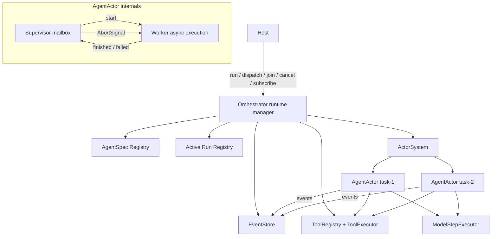
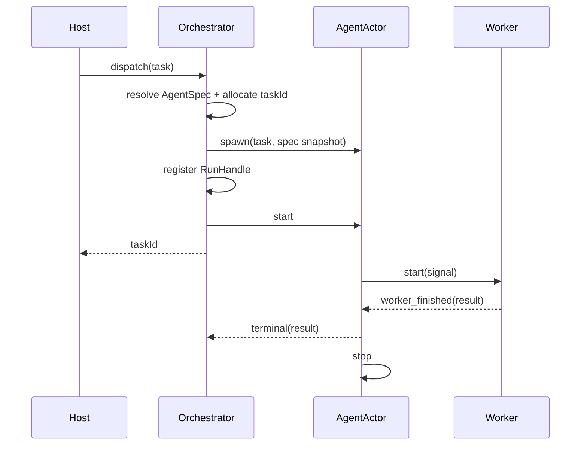
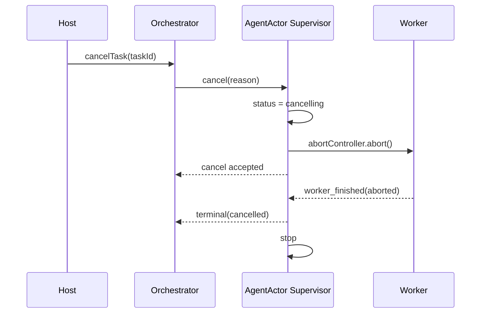

# Orchestrator 架构重整方案

> 状态：设计草案  
> 适用范围：`packages/orchestrator`、`packages/orch-protocol` 以及 Host 与 Orchestrator 的集成边界  
> 文档定位：本方案以当前代码和本轮架构讨论为基础。迁移完成前，`packages/orchestrator/README.md` 与 `packages/orchestrator/docs/` 中描述 MainActor、长期 AgentActor、TaskRunnerActor 和 StateActor 的内容均视为历史设计，不能作为实现事实。

## 1. 背景

当前 Orchestrator 处于两套设计混合的状态：

- 旧设计强调完整的 actor-first runtime，包括 MainActor、AgentActor、TaskRunnerActor、ToolActor 和 StateActor。
- 新实现已经将工具注册、模型调用、任务跟踪和事件写入的一部分改成普通 service 或 facade 内部逻辑。
- 文档描述的 MainActor 和 TaskRunnerActor 实际不存在。
- AgentActor 在 Agent 注册时创建并被多个 task 长期复用，但 runner 又在 mailbox 外直接修改同一份运行状态。
- StateActor 存在，但事件通常通过 `ingestStateEvent()` 直接写入共享 `stateCache`。
- ToolActor 按调用临时创建，但工具并发实际由 Promise 驱动，取消消息也无法中断正在等待的 provider。

问题不是“actor 或 service 哪个更先进”，而是当前缺少一致的身份模型、状态所有权和取消协议。此次重整的目标是保留 Actor 在任务隔离上的价值，删除没有形成有效隔离边界的 Actor 层。

## 2. 核心决策

### 2.1 AgentActor 与 task 一一对应

每次提交 `AgentTask` 都创建一个全新的 AgentActor：

```text
AgentSpec  = 可复用的 Agent 定义和能力模板
AgentTask  = 一次工作请求
AgentActor = AgentSpec + AgentTask 的一次运行实例
```

AgentActor 是一次性的，完成、失败或取消后停止，不处理第二个 task。

推荐 Actor ID：

```text
agent:<agentSpecId>:task:<taskId>
```

### 2.2 AgentActor 由 Supervisor 和 Worker 组成

这里的 Supervisor 和 Worker 是 AgentActor 内部的两个职责面，不要求实现成两个 Actor：

```text
AgentActor
├── Supervisor：mailbox、控制状态、取消、终态提交
└── Worker：task-local 异步执行、模型循环、工具调用
```

Supervisor 是可寻址 Actor；Worker 是其内部的一条异步执行任务。Worker 没有公开地址，外部不能绕过 Supervisor 操作它。

不单独创建 WorkerActor 的原因是：如果 WorkerActor 的 handler 直接等待整个模型循环，它的 mailbox 同样无法及时处理取消；如果它仍需启动后台异步任务，则第二层 Actor 只增加协议和生命周期成本。未来只有在 Worker 需要跨线程、跨进程、独立监督或独立资源所有权时，才重新评估 WorkerActor。

### 2.3 不引入 MainActor

Orchestrator 本身作为非 Actor 的 runtime manager，直接管理：

- AgentSpec 注册表
- task 到 AgentActor 的索引
- foreground、detached 和 join 的结果 handle
- ActorSystem 和各项 service 的依赖组装
- Host-facing public API

当前没有必要增加：

```text
Host -> Orchestrator -> MainActor -> AgentActor
```

MainActor 只会成为消息转发层，并迫使 `join`、延迟回复和取消维护额外的 pending-envelope 协议。若未来出现全局异步 admission state machine、跨进程调度、根级监督恢复或严格的全局消息排序，再单独评估 MainActor。

### 2.4 Actor-first 不等于 everything-is-an-actor

新的 actor-first 定义是：

> Agent task 是核心并发、身份和生命周期边界，因此由 AgentActor 表达；无独立身份和异步控制面的组件使用普通 service 或值对象。

因此：

- AgentActor：Actor
- Orchestrator：runtime manager
- ToolRegistry：service
- ToolExecutor：service
- ModelStepExecutor：service
- EventStore：同步 service
- AgentSpec、AgentTask、AgentRunResult：值对象

## 3. 目标架构



## 4. 组件职责

### 4.1 Orchestrator

Orchestrator 是唯一公开入口和运行时组装器。

建议内部状态：

```ts
interface RunHandle {
  taskId: string;
  agentId: string;
  actorId: string;
  status: "starting" | "running" | "cancelling" | "completed";
  retainForJoin: boolean;
  result: Promise<AgentRunResult>;
}

class Orchestrator {
  private readonly agentSpecs = new Map<string, AgentSpec>();
  private readonly runs = new Map<string, RunHandle>();
}
```

职责：

- 注册、更新和注销 AgentSpec。
- 为 task 生成稳定 ID。
- 为每个 task 创建 AgentActor。
- 建立 `taskId -> RunHandle` 索引。
- 将取消请求路由到对应 AgentActor。
- 为 `run`、`dispatchDetached` 和 `joinTask` 提供统一结果语义。
- 在 task 到达终态后执行索引清理策略。

非职责：

- 不持有 transcript、stepCount 或 engineState。
- 不直接操作 Worker。
- 不生成 Agent task 的终态事件。
- 不成为第二个 Agent Supervisor。

所有 registry 更新必须在出现第一个 `await` 之前完成，避免出现检查和登记之间的异步竞争。

### 4.2 AgentSpec Registry

`registerAgent(spec)` 只注册 Agent 定义，不创建 Actor：

```text
registerAgent(spec)
  -> agentSpecs.set(spec.id, spec)
```

task dispatch 时从 registry 获取 AgentSpec 快照，再创建 AgentActor。运行中的 AgentActor 不受后续 AgentSpec 更新影响。

### 4.3 AgentActor Supervisor

Supervisor 持有控制面状态：

```ts
interface AgentSupervisorState {
  taskId: string;
  agentSpec: AgentSpec;
  status:
    | "created"
    | "running"
    | "cancelling"
    | "completed"
    | "failed"
    | "cancelled";
  abortController: AbortController;
  terminalCommitted: boolean;
  worker?: Promise<AgentRunResult>;
}
```

Supervisor 负责：

- 启动 Worker，但不在 mailbox handler 内等待 Worker 完成。
- 在运行期间继续处理 cancel 和 inspect 等控制消息。
- 通过 `AbortController` 取消 Worker。
- 接收内部 `worker_finished` / `worker_failed` 消息。
- 保证终态和 terminal event 最多提交一次。
- 将最终结果回复给 Orchestrator，并停止自身。

状态转换：

```text
created -> running -> completed
                  -> failed
                  -> cancelling -> cancelled
```

进入 `cancelling` 后不能提前报告 cancelled，也不能被复用；必须等待 Worker 确认退出，或经过明确的强制终止策略后，才能提交终态。

### 4.4 Agent Worker

Worker 持有执行面状态：

```ts
interface AgentWorkerState {
  transcript: Message[];
  stepCount: number;
  engineState?: unknown;
}
```

Worker 负责：

- 运行模型 step loop。
- 发现并执行工具。
- 更新 task-local transcript 和 engine state。
- 检查 AbortSignal。
- 返回完整的 `AgentRunResult`。

Supervisor 和 Worker 不能并发修改同一份 WorkerState。Supervisor 只能发出取消信号；最终 transcript 和计数由 Worker 作为结果返回。

Worker 启动模式：

```ts
case "start": {
  state.status = "running";
  state.worker = runWorker(input, state.abortController.signal);
  state.worker.then(
    (result) => ctx.send(ctx.self.id, { type: "worker_finished", result }),
    (error) => ctx.send(ctx.self.id, { type: "worker_failed", error }),
  );
  return;
}
```

### 4.5 EventStore

EventStore 取代目前 StateActor 与 `stateCache` 并存的双路径：

```ts
interface EventStore {
  append(event: OrchestratorEvent): OrchestratorEventEnvelope;
  subscribe(listener: HostEventListener): () => void;
  snapshot(): OrchState;
  graph(): OrchGraph;
}
```

EventStore 唯一拥有：

- event sequence
- event log
- reducer state
- subscribers
- snapshot 和 graph projection

`append()` 是同步临界区。在当前单进程 JavaScript runtime 中，同步 append/reduce 可以提供明确顺序，不需要 StateActor mailbox。任何组件都不能获得 reducer state 的可变引用。

如果未来 EventStore 需要异步持久化，内存状态仍应先同步提交，再将持久化作为独立、有背压策略的输出流程处理。

### 4.6 ToolRegistry

ToolRegistry 保持 service，负责：

- ToolProvider 注册
- ToolSet 注册
- capability discovery
- alias 和 policy 投影
- public tool name 到 provider route 的解析

它不负责单次工具调用的运行状态。

### 4.7 ToolExecutor

ToolExecutor 取代一次性 ToolActor，负责单次调用：

```ts
interface ToolExecutor {
  execute(
    call: ToolCall,
    context: ToolExecutionContext,
    signal: AbortSignal,
  ): Promise<ToolExecResult>;
}
```

执行顺序：

```text
emit tool_started
  -> approval policy
  -> provider.execute(call, context, signal)
  -> emit tool_finished
  -> return result
```

工具并发或串行策略属于 Worker 的一个模型 step。取消必须贯穿 ApprovalGateway、ToolExecutor 和 ToolProvider；仅删除 active-call 记录不算取消。

如果未来工具调用需要独立地址、进度订阅、独立监督或远程执行，再恢复 task-scoped ToolActor。

### 4.8 ModelStepExecutor

ModelStepExecutor 保持无状态、单 step service：

```ts
executeStep(input: ModelStepInput, signal: AbortSignal): EventStream<...>
```

Agent Worker 负责循环和 transcript，ModelStepExecutor 只负责一次 provider 调用及标准化 streaming event。

## 5. 状态所有权

| 状态 | 唯一所有者 |
| --- | --- |
| AgentSpec registry | Orchestrator |
| taskId 到 actor/result 的索引 | Orchestrator |
| task 控制状态和 AbortController | AgentActor Supervisor |
| transcript、stepCount、engineState | Agent Worker |
| event log、reducer state、subscriptions | EventStore |
| providers、toolsets、tool routes | ToolRegistry |
| 单次工具执行流程 | ToolExecutor 调用实例 |

约束：

1. 可变状态只能有一个所有者。
2. 对外返回 snapshot，不返回可变引用。
3. Worker 的 task-local state 不得在 task 之间复用。
4. Orchestrator 只能通过 Actor 消息控制 AgentActor。
5. AgentActor 通过 service 接口调用 ModelStepExecutor、ToolRegistry、ToolExecutor 和 EventStore。

## 6. Public API 语义

建议保留当前公开 API，重整内部语义：

```ts
interface Orchestrator {
  registerAgent(spec: AgentSpec): void;
  unregisterAgent(agentId: string): void;

  dispatch(task: AgentTask): Promise<AgentTaskId>;
  dispatchDetached(task: AgentTask): Promise<AgentTaskId>;
  joinTask(taskId: AgentTaskId): Promise<AgentRunResult>;
  run(prompt: string, options?: OrchRunOptions): Promise<OrchRunResult>;
  cancelTask(taskId: AgentTaskId, reason?: string): Promise<void>;

  subscribe(listener: HostEventListener): () => void;
  snapshot(): OrchState;
}
```

需要统一的地方：

- foreground 和 detached 必须走同一条 `createRun()` 路径。
- `dispatch` 的语义应明确为“任务已被接受并返回 taskId”，不等待任务完成。
- `run` 可以实现为 `dispatch + join` 的便利方法。
- `joinTask` 返回原始成功或失败，不得把 rejection 静默转换成 `{ error: string }`。
- detached task 允许多次 join，其终态 RunHandle 在 Orchestrator 生命周期内保留；普通终态 RunHandle 可以按上限淘汰。
- `cancelTask` 表示取消请求已接受；最终 cancelled 由 join result 或事件确认。

## 7. 关键流程

### 7.1 Dispatch



### 7.2 Cancel



### 7.3 Subagent delegation

Subagent delegation不需要 MainActor：

```text
Agent Worker
  -> orch delegation tool
  -> Orchestrator.dispatch(subtask)
  -> spawn another task-scoped AgentActor
  -> optional joinTask(subtaskId)
```

父任务与子任务之间通过 task ID 建立关系，并由 EventStore 投影 graph。是否级联取消必须由 task metadata 明确定义，不能依赖 Actor 父子层级的隐式行为。

## 8. 并发与生命周期规则

### 8.1 同一 AgentSpec 的并发

由于 AgentSpec 是模板，每个 task 都有独立 AgentActor，默认可以并发运行。若产品需要限制同一 AgentSpec 的并发，应在 Orchestrator admission policy 中显式配置：

```ts
type AgentConcurrencyPolicy =
  | { mode: "parallel"; limit?: number }
  | { mode: "reject" }
  | { mode: "queue"; limit?: number };
```

不要通过复用一个长期 AgentActor 偶然实现单并发。

### 8.2 Terminal once

AgentActor Supervisor 必须维护 `terminalCommitted`，所有完成、失败、取消和超时路径汇聚到同一个 finalize 函数：

```ts
finalize(outcome: AgentRunOutcome): void
```

该函数负责：

- 原子检查并设置 terminalCommitted。
- append terminal event。
- resolve/reject Orchestrator result。
- 释放 task-scoped 资源。
- 停止 Actor。

### 8.3 Stop 不等于 cancel

ActorSystem 的 `stop()` 只负责 Actor 容器生命周期；业务取消必须先通过 `AbortSignal` 停止 Worker。正常顺序是：

```text
cancel -> abort Worker -> Worker settles -> finalize -> stop Actor
```

强制 stop 只能作为超时后的兜底，并且必须记录为不同的失败类型。

## 9. ActorSystem 的定位

重整后 ActorSystem 只为 AgentActor 提供：

- actor identity
- mailbox serialization
- send/ask/reply
- lifecycle registration
- bounded mailbox

需要修正或明确的语义：

- send 到 stopped actor 不应静默丢弃。
- stop 是否等待当前 handler，需要与实现一致。
- pending ask 必须在 stop 时可靠 reject。
- deadline timer 在 ask 完成后应释放。
- handler error 应通过可注入的 runtime error sink 报告，不能直接 `console.error`。

如果 AgentActor 最终成为 ActorSystem 的唯一使用者，应在完成迁移后重新评估自研 kernel 相比一个更小的 task-actor runtime 是否仍有维护价值；该评估不阻塞本次状态所有权重整。

## 10. 迁移计划

### Phase 0：行为基线

在改结构前补齐 characterization tests：

- cancel 运行中的模型 stream。
- cancel 运行中的工具。
- cancel 后旧 Worker 不再产生消息或修改 transcript。
- 同一 AgentSpec 并发运行两个 task，状态完全隔离。
- detached task 成功、失败和 join。
- 多次 join 的既定语义。
- unregister AgentSpec 不影响已运行 task 的 spec 快照。
- terminal event exactly once。
- 父任务委派、join 和取消子任务。

### Phase 1：统一 EventStore

1. 从 `actors/state` 提取 EventStore。
2. 复用现有 reducer、projection 和 host-event mapping。
3. 将 emit、snapshot、subscribe 和 graph 全部切到 EventStore。
4. 删除 `stateRef`、公开 `stateCache` 和 StateActor。

该阶段保持 public API 和 Agent 执行方式不变。

### Phase 2：隔离 WorkerState

1. 将 transcript、stepCount 和 engineState 从长期 AgentRuntimeState 中提取。
2. Worker 每次 task 创建独立状态。
3. Supervisor 不再直接修改 WorkerState。
4. 贯通 model loop 的 AbortSignal。
5. 增加统一 finalize 路径。

该阶段优先解决当前 cancel 后旧 runner 污染新任务的问题。

### Phase 3：AgentActor task-scoped 化

1. `registerAgent()` 改为只保存 AgentSpec。
2. dispatch 时 spawn `agent:<agentId>:task:<taskId>`。
3. 每个 AgentActor 只启动一个 Worker。
4. terminal 后停止 AgentActor。
5. 删除 AgentActor 的下一任务复用、busy 和 runToken 逻辑。

### Phase 4：Orchestrator 统一运行管理

1. 引入 RunHandle 和统一 `createRun()`。
2. foreground、detached、delegate 全部复用该路径。
3. 统一 join、failure 和 cleanup 语义。
4. 删除 MainActor 相关残留概念和文档。

### Phase 5：ToolExecutor service 化

1. 将 ToolActor 的 approval、provider execute 和 event emit 移入 ToolExecutor。
2. ToolRegistry 删除 ActorSystem 依赖。
3. ToolProvider 执行接口贯通 AbortSignal。
4. 删除一次性 ToolActor 和 spawn/stop 流程。

### Phase 6：清理和文档切换

1. 删除无引用的 Actor 类型、消息和测试。
2. 将旧架构文档移动到 archive 或明确标记 obsolete。
3. 更新 `packages/orchestrator/README.md`。
4. 更新 protocol 注释和 Host 集成文档。
5. 检查实现中不存在 MainActor、StateActor、长期 AgentActor 等旧术语残留。

每个阶段必须通过：

```bash
bun run fmt
bun run check
bun run test
```

## 11. 非目标

本次重整不包含：

- 跨进程或分布式 Actor。
- Actor 持久化和自动恢复。
- Worker thread 执行模型或工具。
- 改变 Host 对 session、settings、auth、compaction 的所有权。
- 改变 pi-compatible session JSONL 格式。
- 为了保留旧文档而实现当前产品不需要的 MainActor 或 WorkerActor。

## 12. 待确认事项

以下问题不改变总体架构，但必须在对应迁移阶段确认：

1. `dispatch()` 是立即返回 taskId，还是保持等待任务完成的现有行为。
2. detached RunHandle 当前随 Orchestrator 生命周期保留；若长驻进程需要有界内存，应新增显式 release/TTL，而不能静默破坏 join。
3. 同一 AgentSpec 默认采用 parallel、reject 还是 queue。
4. 父任务取消是否默认级联取消子任务。
5. approval 等待是否支持 AbortSignal，以及取消时向 Host UI 发出什么事件。
6. ToolProvider 接口变更是否一次完成，还是通过兼容 adapter 迁移。
7. EventStore 的内存 event log 是否需要大小上限。

## 13. 验收标准

架构迁移完成需要满足：

- 每个 task 有且仅有一个 task-scoped AgentActor。
- AgentActor 明确由 Supervisor 控制面和 Worker 执行面组成。
- AgentActor 永不处理第二个 task。
- 取消能够中断模型、审批等待和支持取消的工具。
- 旧 Worker 无法影响任何其他 task。
- Orchestrator 不依赖 MainActor。
- 不存在 StateActor 与共享 stateCache 双写路径。
- ToolRegistry 不依赖 ActorSystem。
- task 的成功、失败、取消都只提交一次终态。
- Host-facing public API 在迁移期间保持兼容，或通过明确版本变更调整。
- 新文档与实际代码结构一致。
