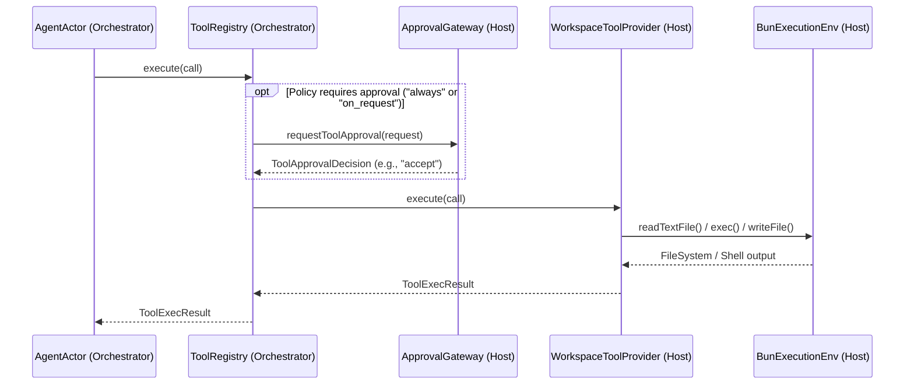
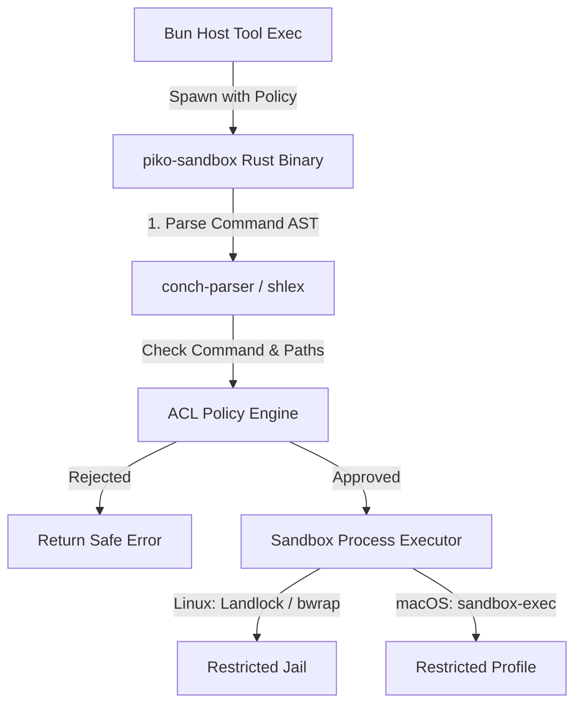
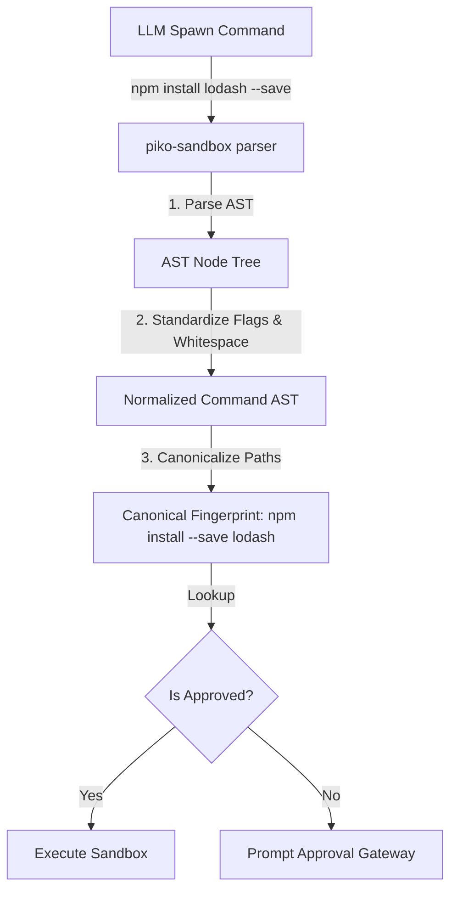

# Sandbox Execution, Filesystem ACL & Bash Parser Design

This document details the current state of the `piko` tool execution and approval system, proposes the integration of filesystem Access Control Lists (ACLs) and a bash parser, and lays out a system architecture using a Rust sandbox layer.

---

## 1. Current Approval & Execution Flow in `piko`

Currently, `piko`'s tool approval and execution are split across the **Orchestrator** and **Host Runtime**:



### Current Vulnerabilities
1. **Coarse-grained Approval**: Once the user approves a tool execution (like `bash` or `write`), the system executes it with the full privileges of the host process. There are no restrictions on what command arguments are passed, or what file paths are manipulated.
2. **Implicit Host Access**: Filesystem operations (`read`, `write`, `edit`) resolve paths using `resolvePath(this.cwd, path)` but do not prevent directory traversal or access to sensitive global paths (e.g. `~/.ssh`, `~/.aws`, or `/etc/passwd`).
3. **No Shell Introspection**: For the `bash` tool, the agent passes a raw string `command`. Piko has no visibility into what files the shell command will modify, what network requests it might trigger, or if it will run malicious sub-commands (e.g., `rm -rf /`).

---

## 2. Feature Proposal

We propose adding two layers of defense: **Filesystem ACLs** and a **Command Parser/Validator**, enforced by a platform-native **Rust Sandbox**.

### A. Filesystem ACL (File Read/Write Tools)
Implement path-based rules inside a security policy context:
- **Read Whitelist**: Allowed read paths (e.g., `["<workspace_root>/**", "<tmp>/**"]`).
- **Write Whitelist**: Allowed write paths (e.g., `["<workspace_root>/**"]`).
- **Denylist**: Blacklisted patterns override any whitelists (e.g., `["**/node_modules/**", "**/.git/**", "~/.ssh/**", "~/.aws/**"]`).

### B. Bash Parser (Command-Level Validation)
To prevent the agent from bypassing the filesystem ACL or running dangerous tools via the `bash` tool:
1. **Command Tokenization**: Split and parse the bash command into an Abstract Syntax Tree (AST).
2. **Command Whitelisting**: Check the main binary (e.g., allow `git`, `bun`, `npm`, `cargo`, `tsc`, `cat`; block `curl`, `wget`, `rm`, `sudo`).
3. **Arguments Extraction**: Detect paths passed to commands (e.g., `cat /etc/passwd` or `npm run build > /tmp/output`) and cross-verify them against the Filesystem ACL.
4. **Flow Control Checks**: Safely handle subshells, pipes (`|`), redirections (`>`), and compound operators (`&&`, `||`, `;`) to ensure the agent is not executing hidden payloads.

---

## 3. Sandboxing & Parsing via Rust Layer

Because tools are spawned as new subprocesses, performing sandboxing at the runtime layer (TypeScript/Bun) is prone to bypasses (e.g. shell escapes, symbolic links). Instead, we can build a lightweight **Rust Sandbox & Supervisor (`piko-sandbox`)** to enforce these limits.

### A. Existing Open Source Projects & References

| Project | Approach | Pros | Cons |
| :--- | :--- | :--- | :--- |
| **`ai-jail`** | Rust wrapper using Bubblewrap (`bwrap`) on Linux, `sandbox-exec` on macOS. | Battle-tested for AI coding agents; maps read-only/read-write directories directly. | Linux/macOS specific; requires external sandboxing binaries. |
| **`landlock` (Crate)** | Direct safe bindings to Linux Landlock LSM. | Zero runtime overhead; unprivileged self-sandboxing; path-level granularity. | Linux only (kernels 5.13+). |
| **`sandbox_run`** | Platform-native commands isolation crate. | Unified interface for Landlock (Linux) and Seatbelt/Sandbox (macOS). | Limited complexity; requires custom policy mappings. |
| **`brush_parser` / `conch-parser`** | Full POSIX/Bash parsing in Rust. | Excellent AST representation; allows robust static analysis of compound commands. | Parsing bash commands fully can be complex for dynamic variables or expansions. |

### B. Suggested Rust Sandbox Architecture

We can compile a helper binary `piko-sandbox` that handles two duties: **Command parsing/check** and **Isolated Subprocess Execution**.



#### Step 1: Rust Command Parser & ACL Check
Using `shlex` (simple token splitting) or `conch-parser` (for complex shell scripts) in Rust:
```rust
// Conceptual Rust check
fn validate_command(cmd: &str, workspace: &Path, policy: &AclPolicy) -> Result<(), SecurityError> {
    let tokens = shlex::split(cmd).ok_or(SecurityError::ParseError)?;
    let binary = &tokens[0];
    
    // 1. Check binary whitelist
    if !policy.allowed_binaries.contains(binary) {
        return Err(SecurityError::DisallowedBinary(binary.clone()));
    }
    
    // 2. Scan arguments for path references and check against ACL rules
    for arg in &tokens[1..] {
        if is_looks_like_path(arg) {
            let canonical = workspace.join(arg).canonicalize()?;
            if !policy.is_path_allowed(&canonical) {
                return Err(SecurityError::AccessDenied(canonical));
            }
        }
    }
    Ok(())
}
```

#### Step 2: OS-Level Restricted Spawning
The `piko-sandbox` executor applies the constraints before executing the final command:

* **On Linux (using Landlock LSM)**:
  Restrict file descriptor access at the kernel level for the current thread and any child processes it spawns.
  ```rust
  use landlock::{Access, AccessFd, Ruleset, ABI};
  
  let mut ruleset = Ruleset::default()
      .handle_status(AccessFd::new(dir, Access::FS_READ_FILE | Access::FS_WRITE_FILE))?;
  // Populate ruleset and restrict self
  ruleset.restrict_self()?;
  // Spawn command safely
  std::process::Command::new(binary).args(args).spawn()?;
  ```

* **On macOS (using Seatbelt / `sandbox-exec`)**:
  Generate a temporary sandbox profile (`.sb` file) dynamically and spawn the command using `sandbox-exec -f profile.sb <command>`.
  ```scheme
  ;; Sample seatbelt profile
  (version 1)
  (deny default)
  (allow file-read* (subpath "/path/to/workspace"))
  (allow file-write* (subpath "/path/to/workspace"))
  (allow process-fork)
  (allow process-exec)
  ```

---

## 4. Standalone CLI & Bun Integration Architecture

To ensure the sandbox system is a decoupled, self-contained system that the Bun (TypeScript) host can easily integrate with, `piko-sandbox` is designed as a standalone CLI tool that handles both **process isolation** and **file manipulation** under ACL policies.

### A. Sandbox CLI Specification

The Rust binary provides a unified CLI with subcommands:

```bash
# General Syntax
piko-sandbox --policy <policy-file-or-json> <subcommand> [args]

# 1. Execute a command in sandbox
piko-sandbox --policy policy.json exec --cwd /workspace -- "npm run build"

# 2. Read a file with ACL protection
piko-sandbox --policy policy.json read --path src/main.ts --offset 1 --limit 100

# 3. Write/Modify a file with ACL protection
piko-sandbox --policy policy.json write --path src/main.ts --content "new content"
piko-sandbox --policy policy.json edit --path src/main.ts --edits-json '[{"oldText": "...", "newText": "..."}]'
```

### B. Decoupled Integration Flow

By delegating both shell commands and filesystem actions to `piko-sandbox`, the Bun runtime becomes thin and client-like. It does not need to implement complex ACL matching or platform-specific syscall restrictions in JavaScript:

```mermaid
graph LR
    subgraph Bun Host Runtime (TS)
        Env[BunExecutionEnv]
    end

    subgraph Independent Sandbox System (Rust)
        Sandbox[piko-sandbox CLI]
        ACL[ACL Guard & Bash Parser]
        OS[OS Sandbox Jail]
    end

    Env -->|Spawn `piko-sandbox exec`| Sandbox
    Env -->|Spawn `piko-sandbox read`| Sandbox
    Env -->|Spawn `piko-sandbox write`| Sandbox
    
    Sandbox --> ACL
    ACL -->|Approved Exec| OS -->|Restrict via Landlock/Seatbelt| Exec[Subprocess]
    ACL -->|Approved FS| FS[Native Safe Disk Access]
```

### C. Bun Integration (`BunExecutionEnv` Refactor)

Integrating the sandboxing binary into the existing Bun codebase requires simple changes in [bun-execution-env.ts](file:///Users/biu/Projects/piko/packages/host-runtime/src/session/bun-execution-env.ts). 

For example, filesystem and execution wrappers simply delegate to `piko-sandbox` if security sandboxing is enabled:

```typescript
export class BunExecutionEnv implements ExecutionEnv {
  private useSandbox: boolean;
  private policyPath: string;

  constructor(options: { cwd: string; useSandbox?: boolean; policyPath?: string }) {
    this.cwd = options.cwd;
    this.useSandbox = !!options.useSandbox;
    this.policyPath = options.policyPath ?? ".piko/policy.json";
  }

  // Refactored Shell.exec
  async exec(command: string, options?: ExecutionEnvExecOptions) {
    if (this.useSandbox) {
      // Wrap command inside piko-sandbox exec command
      const sandboxArgs = [
        "--policy", this.policyPath,
        "exec",
        "--cwd", options?.cwd ?? this.cwd,
        "--",
        command
      ];
      
      return this.runSandboxProcess("piko-sandbox", sandboxArgs, options);
    }
    
    // Fallback to native unsandboxed spawn...
    return this.runNativeProcess(command, options);
  }

  // Refactored FileSystem.readTextFile
  async readTextFile(path: string): Promise<Result<string, FileError>> {
    if (this.useSandbox) {
      const result = await this.runSandboxOutput(["read", "--path", path]);
      if (!result.ok) return err(toFileError(result.error));
      return ok(result.stdout);
    }
    return this.readNativeFile(path);
  }

  // Refactored FileSystem.writeFile
  async writeFile(path: string, content: string): Promise<Result<void, FileError>> {
    if (this.useSandbox) {
      const result = await this.runSandboxOutput(["write", "--path", path, "--content", content]);
      if (!result.ok) return err(toFileError(result.error));
      return ok(undefined);
    }
    return this.writeNativeFile(path, content);
  }
}
```

### D. Why This Design is Optimal
1. **Clean Decoupling**: The TypeScript runtime doesn't need to know *how* sandboxing or path canonicalization works. It treats `piko-sandbox` as a security proxy.
2. **Hard Security Boundaries**: Because the TypeScript runtime runs `piko-sandbox` which spawns the final processes with restricted permissions (e.g. Landlock), even if there is a vulnerability in Bun's process manager, the sandboxed process physically cannot bypass kernel-level Landlock/Seatbelt boundaries.
3. **Consistent Policy Enforcement**: Both direct file manipulation (from tools like `read`, `write`, `edit`) and shell-based file manipulation (from `bash` commands like `echo "foo" > main.ts`) run through the same parser and validation rules.


## 5. Approval Fatigue & Command Fingerprinting via Shell Parser

A key challenge in Agent Tool approval systems is **Approval Fatigue**:
* **Exact String Matching (`bash:${command}`)**: Too strict. If the LLM adds an extra space or slightly adjusts optional flags (e.g., `npm install lodash -y` vs `npm  install  lodash --yes`), it triggers a new approval popup.
* **Program/Subcommand Level Matching (`bash:git`)**: Too loose. Approving a harmless `git status` automatically grants permission for a dangerous `git push` or destructive `git checkout .`.

### A. The Shell Parser Solution: Canonical Command Fingerprinting

By utilizing the Rust-based shell parser inside `piko-sandbox`, we can implement **Canonical Command Fingerprinting**. The parser analyzes the command AST to normalize and canonicalize it before comparing it to the approval database.

#### Normalization Pipeline:
1. **Whitespace & Quotes Normalization**: Remove redundant spaces and standardize quotes (`npm install "lodash"` -> `npm install lodash`).
2. **Option Flag Sorting**: Sort boolean flags alphabetically (e.g. `cargo build --release -v` -> `cargo build -v --release`).
3. **Path Canonicalization**: Identify arguments that represent paths, resolve them against the workspace, and canonicalize them (e.g., `git add ./src/../src/main.ts` -> `git add src/main.ts`).
4. **Environment Variables Resolution**: Strip or resolve inline shell variable assignments if they do not change the command identity.



### B. Template Pattern Matching for Approvals

Instead of binary-level or full-string-level matching, we can store **command pattern templates** in the approval database:

| User Action | Stored Fingerprint Template | Matches | Rejects |
| :--- | :--- | :--- | :--- |
| Approved `git diff src/main.ts` | `git diff <allow_write>` | `git diff src/utils.ts` | `git diff /etc/passwd` |
| Approved `npm install lodash` | `npm install <any>` | `npm install react` | `npm run build` |
| Approved `cargo build` | `cargo build [flags]` | `cargo build --release -v` | `cargo run` |

#### How Rust sandboxing supports this:
`piko-sandbox` can expose a validation helper subcommand:
```bash
# Returns 0 if command matches the pattern template list, 126 otherwise
piko-sandbox --policy policy.json check --pattern-file approvals.json --cwd /workspace -- "npm install express"
```

This ensures that:
1. **Safety**: Re-runs are strictly validated structurally (an LLM cannot sneak in command chaining like `; rm -rf /` since the AST parser detects multiple command segments and blocks execution).
2. **User Experience**: The user only approves a "class" of actions once (e.g., "Allow package installations"), and subsequent variant commands are auto-approved without prompting.
