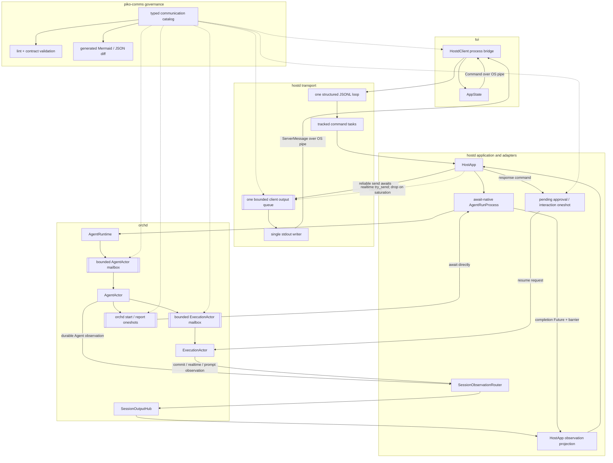

# Communication Contract and Async Flow Consolidation Design

> Status: implemented (phases 0–3); TUI bridge intentionally retained
>
> Behavioral contract: no user-visible feature change
>
> Related runtime contracts:
> [Host Turn Model and Agent Run API](hostd-turn-model.md),
> [Turn–Agent Run Boundary](turn-agent-run-boundary-design.md),
> [Agent Runtime Actor Design](single-agent-actor-runtime-design.md),
> [Agent Run Atomicity](agent-run-atomicity-design.md), and
> [Multi-Agent End-to-End Data Flow](multi-agent-end-to-end-data-flow.md).

The implementation is authoritative together with this design and the
[generated communication topology](generated/communication-topology.md).
Topology drift is checked by `piko-comms-topology --check`.

Implemented outcomes:

- all production construction uses typed `piko-comms` factories;
- Clippy and an architecture test reject new raw channel construction;
- Agent and Execution mailboxes retain bounded actor semantics;
- the unused Execution snapshot watch and host run relay channels are gone;
- host run transformation uses await-native `AgentRunProcess`;
- JSONL reads input directly and uses one bounded connection output sink;
- Agent, prompt, commit, and realtime paths share one
  `SessionObservationRouter` registry and `SessionOutputHub` subscription;
- `UiEventRouter` and the per-operation UI event queue are removed;
- the sync TUI bridge remains the sole justified unbounded edge because it
  crosses the blocking stdout-reader thread into the synchronous TUI loop.

## 1. Purpose

piko currently uses channels for several different jobs:

- actor ownership and command serialization;
- one-request/one-response rendezvous;
- run start and completion delivery;
- reliable and realtime observation;
- host command output multiplexing;
- sync-thread to async-task bridging.

Those jobs do not have the same semantics. Treating every asynchronous
boundary as another sender/receiver pair has produced forwarding tasks,
duplicated run signals, and stacked unbounded queues. Conversely, removing
channels indiscriminately would weaken AgentActor ownership, overload handling,
or completion ordering.

This design establishes one selection rule:

```text
one caller + one result + shared lifetime
    → return a Future and await it

independent owner + serialized commands
    → bounded mailbox, with a oneshot reply only when required

ordered multi-item output
    → typed Stream or bounded queue

latest state only
    → watch

fan-out observation
    → broadcast only when multiple live subscribers are required

recovery or business authority
    → durable store, never an in-memory channel
```

The goal is not zero channels. The goal is that every remaining long-lived
channel corresponds to one explicit ownership, serialization, backpressure,
fan-out, or sync/async boundary.

## 2. Behavioral Contract

This refactor must preserve all current product behavior:

1. TUI commands and `ServerMessage` values retain their existing externally
   visible ordering and correlation IDs.
2. hostd remains authoritative for Session, Turn, approval, interaction,
   transcript projection, and terminal lifecycle state.
3. orchd remains authoritative for AgentActor scheduling, the AgentInstance
   tree, ExecutionActor control, and durable `AgentRunReport` production.
4. root and child Agent submissions use the same target-neutral path.
5. one AgentInstance has at most one active run.
6. reliable observation and best-effort realtime remain different lanes.
7. `AgentRunReport`, not observation, determines the Agent run result.
8. hostd does not publish a terminal Turn lifecycle event until it has consumed
   or rebuilt reliable observation through the completion barrier.
9. approval and interaction prompts remain recoverable through host-owned
   pending snapshots.
10. no Tokio lock is held across model, tool, approval, persistence, output
    backpressure, or other unbounded awaits.
11. schema-v3 Session storage and transcript layout do not change.

There is no new TUI panel, keybinding, setting, persisted field, or user-facing
command in this design.

## 3. Problems in the Current Topology

### 3.1 Spawn-and-forward run signals

orchd returns `AgentRunAcceptance` with two oneshot receivers:

```text
started
completion: AgentRunReport
```

`OrchAgentRunRunner` then spawns a relay task and creates a second pair:

```text
started: SessionSubscription
completion: AgentRunCompletion + observation barrier
```

The host pair carries useful host-specific values, but a second task and two
additional channels are not required to transform those values. A host-owned
Future can await the orchd receivers directly.

### 3.2 Stacked unbounded transport queues

The longest current user-visible output path is:

```text
per-operation UI event queue
→ per-command ServerMessage queue
→ server-wide OutboundLine queue
→ stdout
→ TUI HostLine queue
```

Four queues on this path are unbounded. The middle two are both async-to-async
forwarding layers inside hostd. They provide no independent business ownership
and allow a slow client to turn transient output into unbounded memory growth.

### 3.3 Parallel observation paths

Committed events and realtime deltas use `SessionOutputHub`, while
`AgentChanged`, approval, and interaction requests use `UiEventRouter` and a
per-operation MPSC channel. `HostApp::drive_operation_observation` must select
over both paths even though all of them are user-visible observation.

The side path also constructs `ServerMessage` inside the orch runner adapter,
before the central host projection boundary.

### 3.4 Published state without a reader

Every internal Execution owns an `ExecutionSnapshot` watch channel. Production
code publishes updates, but no production path reads that receiver. The
channel therefore has cost and implied contract without current behavior.

## 4. Decision 0: Communication Contract Kernel

The long-term safeguard is a small `piko-comms` workspace crate. It is not a
global EventBus and does not route domain messages by topic. It makes every
in-process communication edge declare its semantics before code can construct
the underlying primitive.

### 4.1 Crate boundary

`piko-comms` is a generic leaf crate:

```text
piko-comms
  ├─ depends on Tokio and tracing
  ├─ does not depend on protocol, hostd, orchd, llmd, sandbox, or tui
  └─ contains no Session, Turn, Agent, Execution, or TUI business logic

hostd / orchd / llmd / sandbox / tui
  └─ may depend on piko-comms
```

`piko-protocol` remains the serializable DTO leaf. `piko-comms` owns only
runtime communication contracts, wrappers, policy validation, and
instrumentation.

### 4.2 Contract model

Every asynchronous edge has a stable ID and a reviewable contract:

```rust
pub struct CommunicationSpec {
    pub id: &'static str,
    pub kind: CommunicationKind,
    pub owner: &'static str,
    pub producers: &'static [&'static str],
    pub consumer: &'static str,
    pub scope: CommunicationScope,
    pub delivery: DeliveryGuarantee,
    pub capacity: CapacityPolicy,
    pub overflow: OverflowPolicy,
    pub closure: ClosureMeaning,
    pub cancellation: CancellationMeaning,
}

pub enum CommunicationKind {
    DirectCall,
    Mailbox,
    Reply,
    LatestState,
    Observation,
    ClientOutput,
    ThreadBridge,
}

pub enum CommunicationScope {
    Process,
    Connection,
    Session,
    Agent,
    Execution,
    Operation,
    Request,
}
```

The catalog must answer questions that raw `Sender<T>` types cannot answer:

- who owns the receiver;
- whether producers may outlive the caller;
- whether the payload is a command, reply, state, event, or diagnostic;
- whether lag means backpressure, overload, loss, or snapshot recovery;
- what channel closure means to the business protocol;
- which identity scopes routing and prevents cross-Session delivery;
- whether cancellation drops interest or changes durable state.

### 4.3 Typed contract markers

Contracts are zero-sized marker types, not string topics:

```rust
pub struct AgentCommands;

impl MailboxContract for AgentCommands {
    const SPEC: CommunicationSpec = CommunicationSpec {
        id: "orchd.agent.commands",
        kind: CommunicationKind::Mailbox,
        owner: "AgentActor",
        producers: &["AgentRuntime", "Execution terminal waiter"],
        consumer: "AgentActor",
        scope: CommunicationScope::Agent,
        delivery: DeliveryGuarantee::InMemory,
        capacity: CapacityPolicy::Bounded(32),
        overflow: OverflowPolicy::RejectOverload,
        closure: ClosureMeaning::RuntimeUnavailable,
        cancellation: CancellationMeaning::ExplicitCommand,
    };
}

let (commands, mailbox) =
    piko_comms::mailbox::<AgentCommands, AgentCommand>();
```

The generic payload remains owned by the calling crate. The marker chooses the
allowed primitive and policy. A mailbox contract cannot construct a broadcast
channel, and an observation contract cannot be used as a command mailbox.

### 4.4 Framework primitives

The initial framework surface is intentionally small:

| Contract | Backing primitive | Required semantics |
|---|---|---|
| `mailbox<C, T>()` | bounded Tokio MPSC | one owner, explicit capacity and overload behavior |
| `reply<C, T>()` | Tokio oneshot | one requester, one result, closure meaning required |
| `latest<C, T>()` | Tokio watch | latest state only, no implied history |
| `observation<C, T>()` | bounded broadcast or project Hub adapter | event facts, declared lag/recovery behavior |
| `client_output<C, T>()` | bounded Tokio MPSC | reliable await plus explicitly lossy realtime enqueue |
| `thread_bridge<C, T>()` | approved sync/async bridge | explicit justification when unbounded |

Direct async calls do not need a runtime wrapper. They still have catalog
entries when they cross an architectural boundary, so generated topology shows
both awaited calls and channel-backed edges.

Raw Tokio senders and receivers stay private inside wrappers. Domain APIs
expose capabilities such as `AgentCommandSink`, `ClientEventSink`, or
`SessionEventPublisher`, not `mpsc::Sender<T>`.

### 4.5 Compile-time and CI enforcement

The workspace adds `clippy.toml` entries for `disallowed-methods` and
`disallowed-types`. Outside `piko-comms`, code may not directly use:

```text
tokio::sync::mpsc::channel
tokio::sync::mpsc::unbounded_channel
tokio::sync::oneshot::channel
tokio::sync::broadcast::channel
tokio::sync::watch::channel
std::sync::mpsc::channel
std::sync::mpsc::sync_channel

tokio::* raw Sender / Receiver types in public boundaries
std::sync::mpsc raw Sender / Receiver types in public boundaries
```

Workspace Clippy enables the matching restriction lints as errors. The
framework implementation has the only approved local allow. A separate
architecture check rejects new `allow(clippy::disallowed_methods)` or
`allow(clippy::disallowed_types)` attributes outside that crate, so application
code cannot silently bypass the policy.

Test fixtures use framework test contracts or a dedicated test-support module;
tests are not a blanket exemption because production helpers are often first
introduced through tests.

### 4.6 Catalog validation

`piko-comms` exposes all declared specs to an architecture test and topology
generator. The first validation rules are:

1. communication IDs are unique and stable;
2. every channel-backed edge names exactly one receiver owner;
3. every async-to-async queue is bounded;
4. an unbounded contract is legal only for `ThreadBridge` and requires a
   non-empty justification plus a follow-up backpressure decision;
5. mailbox overflow is explicit and cannot silently drop;
6. reliable delivery cannot use `try_send` or a drop policy;
7. realtime delivery cannot advance a reliable cursor or determine completion;
8. product observation cannot have global scope;
9. a reply contract has request scope and cardinality one;
10. closure and cancellation meanings are never left unspecified;
11. a communication edge crossing hostd/orchd uses serializable protocol DTOs
    or a typed port, never `serde_json::Value` as an untyped envelope;
12. direct synchronous await cycles between Actor owners are rejected by the
    declared dependency graph.

Some rules are enforced by Rust types, some by const/catalog tests, and some by
the architecture checker. A rule must identify its enforcement mechanism; a
prose-only rule is not considered implemented.

### 4.7 Generated reasoning artifacts

The catalog generator emits:

- a Mermaid graph grouped by crate and scope;
- an inventory table containing kind, owner, capacity, overflow, closure, and
  cancellation semantics;
- a machine-readable JSON snapshot for CI diffs;
- a list of global, unbounded, lossy, or multi-subscriber edges requiring
  explicit review.

CI regenerates the snapshot and fails on drift. A pull request that introduces
a communication edge therefore shows an architecture diff such as:

```text
+ orchd.agent.commands
  kind: mailbox
  scope: agent
  capacity: 32
  overflow: reject_overload
  owner: AgentActor
```

This generated view replaces hand-maintained channel inventories. Narrative
docs explain why an edge exists; the catalog proves what edges currently
exist.

### 4.8 Instrumentation

Framework wrappers automatically attach the contract ID to tracing and expose:

- current and maximum queue depth where available;
- send wait duration;
- overload count;
- lossy drop count;
- receiver lag and replay recovery count;
- sender/receiver closure;
- request/reply latency;
- task and Session/Agent correlation supplied by the caller.

Instrumentation observes communication but never changes delivery semantics.
Telemetry subscribers may be global; product communication may not use the
telemetry path as a control or observation bus.

### 4.9 Review workflow

Adding communication requires this sequence:

1. prefer a direct async call when caller and callee share one lifetime;
2. select one framework semantic only when independent ownership requires it;
3. add or amend a catalog contract;
4. generate and review the topology diff;
5. add overload, closure, cancellation, and recovery tests;
6. only then construct the typed primitive.

This makes channel creation an architectural decision rather than a local
implementation convenience.

## 5. Target Architecture



This target removes forwarding channels but preserves channels that express
real concurrency boundaries.

## 6. Decision 1: Await-Native Agent Run Process

### 6.1 Host port shape

Replace the host-side `started` and `completion` receiver fields with an owned
process capability:

```rust
pub struct AgentRunHandle {
    pub address: AgentOperationAddress,
    pub receipt: AgentInputReceipt,
    process: Box<dyn AgentRunProcess>,
}

#[async_trait]
pub trait AgentRunProcess: Send {
    async fn wait_started(
        &mut self,
    ) -> Result<SessionSubscription, AgentRunFailure>;

    async fn wait_completion(
        self: Box<Self>,
    ) -> AgentRunCompletion;
}
```

`OrchAgentRunProcess` owns:

- the orchd `AgentRunAcceptance`;
- the target `SessionOutputHub`;
- the acceptance cursor;
- the `AgentOperationAddress`.

It does not spawn a relay task.

### 6.2 Start behavior

`wait_started()`:

1. awaits `AgentRunAcceptance::wait_started()` directly;
2. selects the acceptance cursor for an accepted input or the current cursor
   for a previously queued input;
3. subscribes to `SessionOutputHub`;
4. returns the host `SessionSubscription`.

The completion receiver remains owned by the same process object while a
subscription is replaced or recovered.

### 6.3 Completion behavior

After start, `wait_completion()`:

1. awaits the orchd report receiver directly;
2. converts runtime errors into `AgentRunFailure`;
3. captures the Hub cursor after the durable report is available;
4. returns `AgentRunCompletion { result, observation_barrier }`.

`HostApp::drive_operation_observation` pins that Future and selects it against
the Session output stream. Completion remains independent from observation;
only the forwarding mechanism changes.

### 6.4 Fast completion and queued input

The orchd completion oneshot may resolve before hostd finishes constructing the
subscription. This is safe because its value remains stored until awaited.

A queued input still returns its receipt immediately. `wait_started()` blocks
until AgentActor advances that concrete input. No `TurnEvent::Started` is
emitted before the start signal and subscription are both available.

### 6.5 Start failure

If the orchd start sender closes or Hub subscription fails, `wait_started()`
returns an `AgentRunFailure`. hostd fails the Turn idempotently and invokes the
same generation-checked cleanup used by other pre-observation failures.

Start failure must not be inferred as a successful completion and must not
consume an unrelated queued run's report.

## 7. Decision 2: Structured JSONL Transport

### 7.1 Input

`run_jsonl_server` owns the reader and directly polls `read_line()` in its
`tokio::select!` loop. Parsing happens in that branch. This removes:

- the `read_commands` task;
- the unbounded `InboundLine` channel;
- channel closure as a second representation of EOF.

OS stdin remains the transport backpressure boundary.

### 7.2 Command task ownership

The JSONL loop owns a `JoinSet` of command tasks. Each task calls HostServer or
HostApp directly with a clone of one connection-scoped output sink.

The loop enforces `MAX_IN_FLIGHT_COMMANDS`. When the limit is reached it emits
an overload `CommandResponse` for the rejected command instead of spawning an
unbounded number of tasks.

EOF stops accepting commands. The server then drains accepted command tasks and
queued reliable output before closing stdout. Explicit shutdown may impose a
deadline and abort remaining tasks only after hostd has persisted any already
accepted durable state.

The connection also owns one stdout writer task. Keeping the writer in a
separate task is intentional: command admission and overload handling may await
bounded output capacity, so the task that sends into the queue must not also be
the only task capable of draining it.

### 7.3 One connection output queue

Replace per-command output receivers and the server-wide forwarding queue with
one bounded MPSC owned by the connection:

```rust
#[async_trait]
pub trait ClientEventSink: Send + Sync {
    async fn send_reliable(
        &self,
        message: ServerMessage,
    ) -> Result<(), ClientDisconnected>;

    fn try_send_realtime(
        &self,
        message: ServerMessage,
    ) -> RealtimeSendDisposition;
}
```

Both methods use the same bounded queue:

- reliable/control messages await capacity and are never silently dropped;
- realtime messages use `try_send` and are dropped when the queue is full;
- queue closure means the client disconnected, not business completion.

The initial capacity is a named constant, not a user setting. It must be chosen
and adjusted with slow-client tests and telemetry rather than treated as a
semantic limit.

Before `send_reliable().await`, callers must release HostState, repository, and
router locks. The output sink is a delivery capability, never authoritative
state.

### 7.4 Ordering

One queue preserves enqueue order. Reliable messages from one command retain
program order. Concurrent commands remain multiplexed and are correlated by
`command_id`, as they are today.

Dropped realtime messages do not advance a reliable cursor and cannot satisfy
an observation barrier. A bounded backlog of already-enqueued realtime may
delay a later reliable message, but cannot grow without limit.

## 8. Decision 3: One Typed Session Observation Path

### 8.1 Route registry, Hub, and projection remain distinct

Do not merge routing logic into `SessionOutputHub`.

- `SessionObservationRouter` resolves `session_id + agent_instance_id` to the
  current exact or fallback Hub.
- `SessionOutputHub` sequences, retains, and publishes observation.
- HostApp projects protocol events into authoritative state and
  `ServerMessage` values.

One route registry replaces the duplicated route maps currently owned by
`ExecutionCommitRouter`, `RealtimeDeltaRouter`, and `UiEventRouter`. Narrow
adapters may still implement different orchd ports, but they share this
registry.

### 8.2 Reliable event contract

Extend `SessionEvent` with typed product observation:

```rust
pub enum SessionEvent {
    MessageCommitted {
        transcript_seq: u64,
        message_id: MessageId,
        source_turn_id: String,
        role: MessageRole,
    },
    ToolCommitted {
        transcript_seq: u64,
        message_id: MessageId,
        source_turn_id: String,
        tool_call_id: String,
    },
    AgentChanged {
        agent: AgentInfo,
    },
    ApprovalRequested {
        approval: ApprovalSnapshot,
    },
    ApprovalResolved {
        approval_id: ApprovalId,
        status: ApprovalStatus,
    },
    InteractionRequested {
        interaction: UserInteractionSnapshot,
    },
    InteractionResolved {
        interaction_id: InteractionId,
        status: UserInteractionStatus,
    },
}
```

`transcript_seq` moves from `SessionEventEnvelope` into transcript-related
variants because Agent and prompt events do not have a transcript revision.
All variants retain the common Session cursor assigned by the Hub.

The exact payload types must remain serializable DTOs in `piko-protocol`.
Runtime traits, publishers, and route registries remain outside protocol.

### 8.3 Publication order

Publication follows authority:

```text
Agent durable command ack
→ AgentChanged SessionEvent

message durable commit ack
→ MessageCommitted SessionEvent

pending prompt registered in hostd
→ ApprovalRequested / InteractionRequested SessionEvent

prompt response accepted by hostd
→ resolved SessionEvent
→ waiting oneshot resolved
```

Registering pending prompt state before publication ensures Session hydration
can reconstruct the prompt if the live subscriber disconnects immediately.

### 8.4 Barrier behavior

All reliable Session events increment the Hub cursor. A completion barrier
therefore orders final transcript and Agent projection before the Turn terminal.
Approval and interaction events normally occur before completion; if a resolved
event is published during finalization, it is also included in the captured
barrier.

Realtime deltas never increment the reliable cursor.

### 8.5 Replay and snapshot recovery

Hub retention provides short reconnect replay. When the cursor expires, hostd
rebuilds from authoritative sources:

- Agent shards and AgentRuntime snapshots for Agent projection;
- transcript JSONL for committed messages;
- host-owned pending approval and interaction registries for prompts;
- Turn state for lifecycle.

Replaying a requested prompt is idempotent by approval or interaction ID.
Resolved prompts cannot be resurrected by an older replay item after a newer
snapshot has been applied.

### 8.6 Removed components

After this phase, remove:

- `UiEventRouter`;
- `AgentRunInput::ui_event_tx`;
- the per-operation `ui_event_rx` branch;
- `forward_operation_ui_event` and UI-event draining;
- adapter-level construction of final TUI `ServerMessage` values.

## 9. Decision 4: Actor Channels

### 9.1 Retain bounded mailboxes

Keep one bounded MPSC mailbox per AgentActor and ExecutionActor. These channels
are the mutable-state ownership boundaries. Full mailboxes continue to return
overload rather than wait while holding unrelated application resources.

### 9.2 Retain command reply oneshots

Keep a oneshot reply embedded in commands that need a receipt or result. This
is not an event bus; it closes one request obligation after the owning Actor has
serialized the operation.

Commands that are truly fire-and-forget must not carry a reply sender. They
still need an explicit policy for mailbox-full and receiver-closed errors.

### 9.3 Retain Agent snapshot watch

AgentRuntime reads the latest `AgentSnapshot` without entering AgentActor's
mutable state. `watch` matches those latest-state semantics and remains.

### 9.4 Remove Execution snapshot watch

Remove `ExecutionHandle::snapshot_rx`, `ExecutionActor::snapshot_tx`, and
snapshot publication while there is no production consumer. If a diagnostic
API later requires Execution state, it must first define whether it needs:

- a latest-state snapshot;
- ordered diagnostic events; or
- a synchronous actor query.

The channel primitive follows that contract instead of being installed in
advance.

### 9.5 Defer terminal handoff redesign

The Execution terminal oneshot, completed-result cache, and explicit handoff
acknowledgement participate in fast-completion and Agent run atomicity. They are
not removed in this refactor. A later design may compare them with an owned
`JoinHandle<ExecutionTerminal>`, but only with the failure matrix from
`agent-run-atomicity-design.md` reproduced in tests.

## 10. TUI Process Bridge

The initial implementation retains the TUI's blocking stdout reader thread and
`std::sync::mpsc` bridge. It crosses a real sync/async boundary and changing it
would require restructuring the TUI event loop around an async child process.

This remaining unbounded queue requires a separate decision:

1. move hostd process I/O into an async TUI runtime and select it with terminal
   input; or
2. use a bounded sync bridge and allow the reader thread plus OS pipe to apply
   backpressure.

Neither option is required to remove the redundant hostd queues. It must not be
bundled into the first migration merely to reach a zero-unbounded-channel goal.

## 11. Cancellation and Task Ownership

Every spawned task must have one visible owner:

| Task | Owner | Shutdown rule |
|---|---|---|
| concurrent host command | JSONL connection `JoinSet` | drain on EOF; deadline then abort on forced shutdown |
| stdout writer | JSONL connection | drain after the last output sender closes; propagate write failure as client disconnect |
| AgentActor | `SessionAgentScope` | cancel active run, drain Executions, send Actor shutdown |
| ExecutionActor | `SessionExecutionScope` | cancellation token, terminal outcome, generation-safe removal |
| observation driver | active host Agent operation | finish only after completion barrier or explicit unrecoverable failure |

Dropping a Future expresses caller cancellation only where the API documents
that behavior. It never implies a successful Agent or Turn terminal result.

No detached forwarding task may exist solely to turn one receiver into another
receiver. Background tasks are justified only by independent progress,
supervision, or ownership.

## 12. Migration Plan

### Phase 0: Install the communication contract kernel

1. Add the generic `piko-comms` leaf crate and contract catalog.
2. Declare every existing production communication edge before changing its
   behavior.
3. Add typed wrappers and migrate raw sender/receiver fields mechanically.
4. Generate the first checked-in Mermaid and JSON topology snapshots.
5. Add contract validation and queue instrumentation.
6. Configure Clippy restrictions and the no-local-bypass architecture check.
7. Enable the restrictions as CI errors only after all production construction
   sites use framework factories.

During this bootstrap, a checked-in legacy manifest lists every existing raw
constructor by crate, module, intended contract ID, and removal phase. CI allows
only those exact known sites and rejects additions. The manifest must shrink to
empty before the Clippy restrictions become mandatory; it is not a permanent
exception mechanism.

### Phase 1: Remove unused and forwarding channels

1. Remove the unused Execution snapshot watch channel.
2. Introduce `AgentRunProcess` behind the existing host `AgentRunRunner` port.
3. Replace host started/completion relay oneshots with direct async methods.
4. Preserve current `SessionOutputHub` and `UiEventRouter` behavior.

This phase changes no protocol DTO.

### Phase 2: Structure the JSONL connection

1. Add the connection-scoped bounded `ClientEventSink`.
2. Convert HostApp reliable sends to async sends outside locks.
3. Make realtime output use non-blocking, lossy enqueue.
4. Replace per-command streams with tracked command tasks.
5. Poll input directly and remove the inbound reader channel.
6. Add in-flight command limiting and slow-writer tests.

The hostd-to-TUI JSONL schema does not change.

### Phase 3: Consolidate Session observation

1. Amend `SessionEvent` and `SessionEventEnvelope` in `piko-protocol`.
2. Introduce the shared `SessionObservationRouter` route registry.
3. Publish Agent and prompt events through the reliable Hub lane.
4. Project all typed events in `HostApp::project_operation_output`.
5. Remove `UiEventRouter` and its per-operation channel.
6. Update recovery, barrier, and idempotency tests.

This phase changes the internal hostd/orchd DTO contract and requires workspace
validation.

### Phase 4: Re-evaluate the TUI bridge

Measure queue depth, output latency, and terminal input integration before
choosing an async child-process loop or bounded sync bridge.

## 13. Validation

### 13.1 Communication contract kernel

- every production channel construction resolves to one catalog contract;
- duplicate or missing contract IDs fail tests;
- a new raw Tokio or std channel constructor fails CI;
- a local lint bypass outside `piko-comms` fails the architecture check;
- invalid combinations such as unbounded async mailbox, reliable drop policy,
  or global product observation fail catalog validation;
- generated Mermaid and JSON snapshots are deterministic and drift-checked;
- wrapper instrumentation reports the stable contract ID;
- the legacy raw-constructor manifest only decreases and reaches empty before
  enforcement is marked implemented.

### 13.2 Await-native run process

- accepted run starts and completes normally;
- queued run emits Queued before Started;
- immediate completion cannot outrun subscription construction;
- start sender closure fails the correct Turn;
- observation reconnect does not lose completion;
- completion is retained until the reliable cursor reaches the barrier;
- dropping the host observation Future never manufactures success.

### 13.3 Transport

- concurrent commands remain correlated by `command_id`;
- one slow writer cannot cause unbounded memory growth;
- realtime output drops under saturation without dropping reliable output;
- reliable output preserves per-command program order;
- command admission rejects overload deterministically;
- EOF drains accepted commands and output;
- disconnect closes delivery without changing durable business outcomes.

### 13.4 Observation consolidation

- exact Agent route wins over Session fallback;
- committed event publishes only after durable ack;
- `AgentChanged` is projected before terminal Turn lifecycle when inside the
  completion barrier;
- approval and interaction requests replay idempotently;
- resolved prompts do not reappear after snapshot recovery;
- realtime loss does not affect completion;
- retention exhaustion rebuilds from host-owned durable/snapshot state.

### 13.5 Actor regression

- mailbox overload remains explicit;
- no cross-Actor synchronous await cycle is introduced;
- fast Execution completion still reaches the registered Agent waiter;
- terminal persistence failure publishes no successful report;
- detached report delivery and follow-up advancement preserve atomicity.

Run after each phase:

```bash
cargo fmt --all
cargo test --workspace
cargo clippy --workspace --all-targets -- -D warnings
```

## 14. Acceptance Criteria

The design is complete when:

1. every production communication edge has a typed catalog contract;
2. raw channel construction outside `piko-comms` fails CI;
3. the generated topology is deterministic and reviewed as an architecture
   diff;
4. no async-to-async internal transport queue is unbounded;
5. hostd has one connection output queue, not per-command forwarding queues;
6. hostd does not relay orchd start/completion through a second channel pair;
7. Agent, prompt, committed-message, and realtime observation share one route
   registry and one Session output subscription;
8. AgentActor and ExecutionActor bounded mailbox semantics remain unchanged;
9. completion remains separate from observation and ordered by the barrier;
10. all failure, recovery, overload, and slow-consumer tests pass.

## 15. Non-Goals

- replacing the AgentActor or ExecutionActor model;
- moving completion into `SessionOutputHub`;
- making realtime deltas reliable;
- changing Session persistence or transcript ownership;
- exposing Execution identity to TUI control APIs;
- rewriting the TUI runtime in the first implementation phase;
- removing every oneshot merely to reduce a channel count;
- redesigning Execution terminal atomicity without a separate failure analysis.

## 16. Open Questions

1. What bounded output capacity keeps reliable control latency acceptable under
   sustained model streaming?
2. Does `SessionOutputHub` have more than one live subscriber in any supported
   topology, or can its live delivery primitive eventually become SPSC while
   retaining explicit replay storage?
3. Should resolved approval and interaction events be included in the reliable
   cursor, or is authoritative pending-state reconciliation sufficient?
4. Should `AgentInfo` be carried directly in `SessionEvent::AgentChanged`, or
   should the event contain a smaller runtime projection that HostApp enriches?
5. On forced JSONL shutdown, what deadline applies before outstanding command
   tasks are aborted?
6. Should the TUI bridge become async, or should a bounded sync queue make OS
   pipe backpressure explicit?
