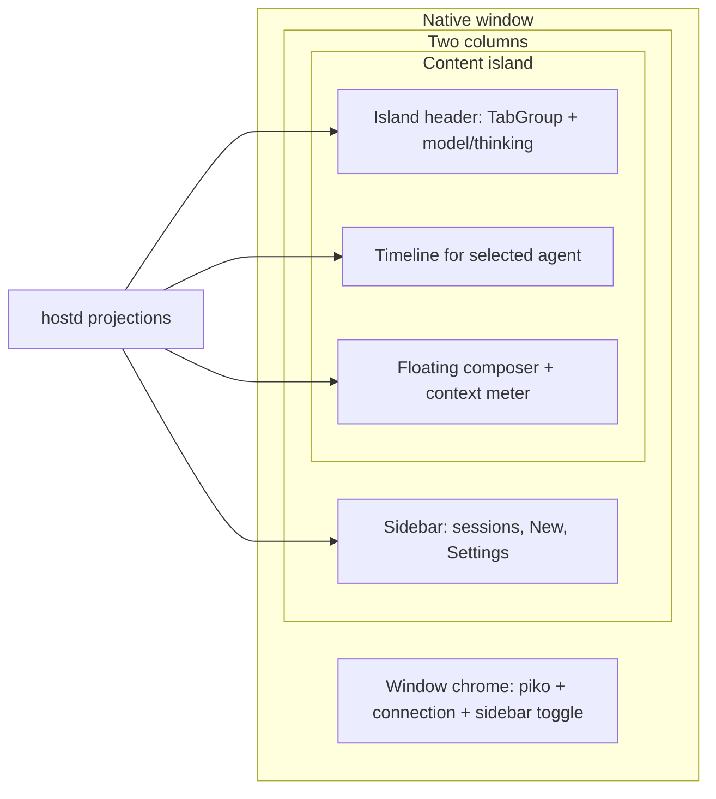

# D-60: Desktop agent workspace (tabbed content island)

> Status: draft
> Implements: [F-43](../features/F-43-desktop-agent-workspace.md)
> Decisions: [ADR-022](../decisions/ADR-022-desktop-client-reintroduction.md)
> Amends: [F-42](../features/F-42-desktop-gui-shell.md), [D-59](D-59-desktop-gui-shell.md), [V-59](../verification/V-59-desktop-gui-shell.md) (patched in the first piko behavior PR)

The product contract lives in F-43. This design is the implementation of that contract. Unlisted F-42 rules stand (two columns, Composer-in-Timeline, no third column, host authority).

---

# Overview

The macOS desktop window still treats the right column as a single anonymous conversation while agents live in the left sidebar. That splits one product fact — the host-selected `AgentInstance` — across two surfaces, stuffs model/thinking/context into muted composer chips, and duplicates connection copy in the window title bar (`live` next to `Live`, plus a session count that is not a navigation control).

This design makes the **content island a tab group of the current session’s agents**. Each tab is one `LiveSession.agents` entry. Selecting a tab is the same action as today’s `ClientIntent::SelectAgent`. The tab body is that agent’s Timeline plus a Composer that targets it. Window chrome becomes identity and transport only. Per-agent actions and status move onto the island toolbar and the tabs. The Composer stays floating inside the Timeline column (F-42) but stops looking like a disabled tag bar.

No hostd or protocol change is required. Tabs bind existing projection fields and intents.

---

# Background & Motivation

## Current state (post D-59 Slices 1–6, screenshot 2026-08-22 21:22)

| Surface | What it does today | Pain |
|---|---|---|
| Window chrome (`Shell::render_chrome` in `packages/desktop/src/shell/view.rs`) | Principal `piko`; trailing `status` + `{n} sessions` + `DesktopConnection::label()` + optional “Needs attention” + sidebar toggle | Connection is duplicated (`status == "live"` and label `"Live"`). Session count is not a control. Attention is window-global. |
| Sidebar (`packages/desktop/src/shell/sidebar.rs`) | Sessions, **Agents**, Application (New Session, Settings) | Agent selection competes with the conversation it controls. |
| Content island | `IslandPanel` with no header; empty “No messages yet”; `↓ Latest` even when empty | Follow-state bug; no document toolbar; no agent identity on the conversation surface. |
| Composer (`packages/desktop/src/shell/composer.rs`) | Tall well + muted chips `model` / `thinking` / `Context —` + Send | Model and thinking look disabled. Context is a dead chip, not a meter. Actions that belong on a toolbar sit inside the input. |

Agents are already a first-class host projection: `LiveSession.agents: Vec<AgentInfo>`, `selected_agent: Option<AgentInstanceId>`, per-agent `timelines`, `active_turns`, pending approvals/interactions, and `AgentForeground` (F-22 / D-34). The TUI already has an Agents surface. The desktop merely put that list in the wrong column.

## Why now

F-42 locked the two-column shell, floating sidebar, and Composer-in-Timeline rule. Those constraints stay. The missing product decision is **where agent identity lives**. After the layout-fill fix, the empty right column makes the mismatch obvious: the user selects Main on the left and stares at an untitled conversation on the right.

---

# Goals & Non-Goals

## Goals

- Make the right column a **host-backed agent TabGroup** for the live session.
- Make tab selection identical to `ClientIntent::SelectAgent` (host-authoritative; Timeline keyed by `agent_instance_id`).
- Demote the sidebar to **session discovery + New Session + Settings**.
- Separate **window chrome** (identity, quiet connection, sidebar toggle) from **document/agent toolbar** (tabs, model, thinking, per-agent attention).
- Redesign Composer: readable input, explicit submit/cancel, context as a meter, no disabled-looking model/thinking chips.
- Show `↓ Latest` only when the user has scrolled away from a **non-empty** Timeline tail.
- Keep drafts, follow-state, and composer errors **per `session_id:agent_instance_id`**.
- Put reusable tab-strip machinery in **island-rs**; piko only binds `agent_instance_id`.

## Non-goals

- Permanent inspector / third column (rejected by F-42).
- Tab close, tab reorder, tab pin, or “dismiss agent” (no `ClientIntent` exists; agents are host-lifecycle).
- Nested/tree tabs in v1.
- Per-agent model or thinking persistence (session-level `SetModel` / `SetThinkingLevel` remain).
- hostd, orchd, protocol, or `piko-client-core` reducer changes (unless a real projection gap appears; none identified).
- Settings information architecture (still a discoverable overlay).
- Per-message/tool/diff rendering (F-22 presentation).
- Exact pixels, materials, or animation curves as a product contract.
- Windows/Linux desktop (macOS/GPUI v1, D-59).

---

# Product contract (F-43)

Technology-agnostic behavior. Crate names appear only as evidence, not as requirements.

## Summary

The desktop primary window keeps two columns. The left column discovers and opens sessions. The right column is the **agent workspace** for the open session: a tab for each agent instance, the selected agent’s conversation, and a composer that always targets that tab. Window identity chrome does not compete with the workspace toolbar. Connection, running work, unread activity, and pending human action are visible without duplicating the same words in two places.

## Problem

Users work with one or more agents inside a session. Putting agent selection in the session list and the conversation in a nameless pane forces a split mental model. Mixing transport status, session inventory, and model controls into the window title and the input well hides the conversation and makes live/idle hard to trust.

## User journeys

1. The user opens a live session that has a single root agent. The content island shows **one tab** (stable chrome), that agent’s Timeline (empty or populated), and a composer ready to send to it. The sidebar lists sessions, not a duplicate agent list.
2. A parent spawns child agents. New tabs appear in host order. The user clicks **Researcher**. The Researcher tab highlights immediately, the body is Loading, Send/Cancel are disabled, and the composer shows Researcher’s draft (empty on first visit). After the host selects Researcher, Send is enabled. Main’s draft is restored when Main is selected again.
3. The user is reading older Researcher output while Main is running. Researcher’s tab stays on the scrolled position; Main’s tab shows a running mark. Switching to Main follows the tail if that tab was following.
4. The window is narrowed. The sidebar collapses to a temporary layer. The tab strip remains on the content island. The composer never sits under the sidebar.
5. The user changes model or thinking from the **workspace toolbar**, not from a muted chip in the input. Context fill is a meter on the composer card’s bottom-left.
6. There is no open session. The content island is an empty state with a path to open or create a session. **No fake tabs.**
7. Transport drops. The window chrome shows a single disconnected indicator. Drafts remain. Host-required actions disable. Tabs stay visible but clicks do not select and are not queued. Reconnect hydrates from the host before anything is labeled current.

## In scope

- Right-column tab group whose members are the current session’s agent instances.
- Tab selection as the product action that changes the viewed/submitted agent.
- Sidebar without a primary Agents section.
- Window chrome vs workspace toolbar split.
- Connection, per-agent work, unread, and pending-action presentation.
- Composer visual redesign and context meter, still floating in the Timeline column.
- Return-to-latest rules for empty vs non-empty Timelines.
- Per-tab presentation state (draft, follow, composer error).
- Keyboard and pointer access to tabs, toolbar, timeline, composer, sidebar.
- Loading, empty, error, disconnected, streaming, and restored states for this workspace.

## Out of scope

- Closing or destroying agents from the tab strip.
- A third column, inspector, or terminal/editor workspace.
- Nested tab trees, tab drag-reorder, split-pane per agent.
- Changing host selection semantics, subscription, or Timeline reduction.
- Durable draft persistence across app restart (F-42 resolved question 3 still holds).
- User-resizable sidebar (F-42 resolved question 1 still holds).

## Relationship to F-42

F-43 **supersedes** the F-42 bullets in the table below. They must not remain normative once F-43 lands: the first piko behavior PR (or a docs PR that lands in the same train) patches F-42 journeys/acceptance, D-59 sidebar/composer placement, and V-59 so the repo cannot ship a desktop that still claims “sidebar selects agents.” Unlisted F-42 rules stand (two columns, Composer-in-Timeline, no third column, host authority, narrow-window overlay).

| F-42 statement | F-43 replacement (supersedes) |
|---|---|
| Sidebar provides session discovery **and the selected session’s agent hierarchy** | Sidebar provides session discovery, New Session, and Settings. Agent switching is the content-island tab strip. |
| Journey 1: sidebar presents session **and agent** navigation | Journey 1: sidebar presents sessions; the island presents agent tabs. |
| Journey 2: user selects another session **or agent in the sidebar** | Session selection remains in the sidebar. Agent selection is a tab action. |
| Acceptance: sidebar can select sessions **and agents** | Sidebar selects sessions (keyboard + pointer). Tabs select agents (keyboard + pointer). Both update the host projection. |
| Composer chrome may expose target agent, model, thinking, context | Target agent is the active tab. Model and thinking live on the workspace toolbar. Context is a composer-adjacent meter. |
| Window controls, navigation, and Timeline actions occupy header zones without two competing title bars | Window chrome is identity + transport + sidebar toggle. Timeline/agent actions occupy the **content island header**, not a second native title bar. |

## Behavior and states

### Spatial model

At a comfortable width:

```
┌ Sidebar (sessions) ┐ ┌ Content island ─────────────────────────────────┐
│ session list       │ │ [ Main | Researcher | Reviewer | ⋯ ]  toolbar…  │
│ New Session        │ │ Timeline for selected agent                     │
│ Settings           │ │                                                 │
│                    │ │              [ Composer for this agent ]        │
└────────────────────┘ └─────────────────────────────────────────────────┘
```

- Two columns only. Timeline (tab body) still receives remaining width.
- Tab strip is the **principal of the content island**, not the native window title bar. One window title bar; one document toolbar. They must not look like two competing title bars (F-42).
- Composer floats inside the active tab body, bounded width, never under the sidebar.

### Agent tabs

- Tab membership **is** the current session’s agent list from the host projection. The client does not invent, hide, or synthesize agents.
- **Order (v1):** the host vector order (`LiveSession.agents`). That list is already the session’s agent instances; F-10 `list_agents` is depth-sorted (parents before children). Desktop does not re-sort.
- **Label:** agent `name` if non-empty, else `agent_id`. Tooltip always includes `{label} · {agent_instance_id}` (full id). If two visible tabs would share a label, the visible title becomes `{label} · {last 8 characters of agent_instance_id}`; uniqueness is not required of the host name itself.
- **Single agent:** still show one tab so the workspace chrome is stable.
- **When tabs exist:** if and only if `LiveSession.agents` is non-empty. That includes `Disconnected` / `DecodeError` while the last projection is still in memory. Empty `agents`, no `LiveSession`, or no session selected → **no tabs** (empty island, not a placeholder “Main” tab). Do not key the strip on `DesktopConnection::Live` or `SessionPhase::Live`.
- **Selection:** the highlighted tab is the **view target** — in-flight `SelectAgent` id if any, otherwise host `selected_agent`. A click or keyboard activate **no-ops iff `id == view_key`**. Any other tab, including the current host agent while another id is pending, issues `SelectAgent` and replaces `pending_agent`. While a select is in flight, the body is Loading and **Send/Cancel are disabled** so they cannot hit the previous host agent (see In-flight selection below).
- **Disconnected:** last projected tabs stay visible but are **non-activating**. Clicks and keyboard activate no-op; nothing is queued for reconnect.
- **Close:** not offered. Agents appear and disappear when the host list changes.
- **Overflow:** when tabs do not fit, a contiguous visible range that includes the selected tab remains on the strip; the rest go to a **More** menu. Overflow is a layout concern, not a second agent list. Algorithm is in Implementation §1.
- **Hierarchy:** not indented in v1. Child-ness is available as a tooltip (`role`, parent name) rather than a nested tab tree.

### Tab status marks

Each tab may show compact marks derived from host projection for **that** `agent_instance_id` only. Foreground comes from `piko_client_core::agent_foreground` (F-22 / D-34 sole table). One mark per tab (priority below). Running and unread stay visually distinct (dot vs count).

| Priority | Condition | Visible mark |
|---|---|---|
| 1 | Foreground `RequiresAction` | Attention (highest) |
| 2 | Foreground `Running`, `Queued`, or `Cancelling` | Busy **dot** |
| 3 | `unread_report_count > 0` **and** tab is not the view target | Unread **count** |
| — | Lifecycle `Closed` / `Terminated` / `Unavailable` | Quiet muted label; still selectable if the host still lists the agent |

Idle + no unread = no badge.

Session-level “Needs attention · N” in the window title bar is **removed**. Discovery of other agents’ pending work is the tab mark.

### Window chrome

- Principal: product identity (`piko`).
- Trailing: **one** connection indicator + sidebar show/hide.
- Connection values remain `connecting` / `hydrating` / `live` / `disconnected` / `decode-error`, shown once (dot or single short label + tooltip with the detailed status string). Never `live` beside `Live`.
- Session count is **not** window chrome. The sidebar list is the inventory.
- Model, thinking, context, and per-agent attention are **not** window chrome.

### Workspace toolbar (content island header)

Associated with the active tab, in the island header trailing / actions zone:

- Model — labeled chrome action (`t.fg`, not muted-ghost). Tooltip: **“Session model (next turn)”** plus the model id. Opens an **anchored menu** (F-44 / D-61); commits `SetModel`.
- Thinking — same treatment. Tooltip: **“Session thinking level (next turn)”**. Opens an **anchored menu**; commits `SetThinkingLevel`.
- If the **view-target** agent `RequiresAction`, a Needs attention control opens the existing attention **dialog** (approvals/interactions). Other agents’ attention is tab-only.

These controls use **foreground** chrome type, not `GhostTextButton`’s current muted default (that token is the same as today’s composer chips). They remain session-scoped intents. The toolbar sits on the agent workspace because that is where the next turn is composed, **not** because model is per-agent. Do not label them “Main’s model.”

When there is no live session, the island header is omitted or inert; the empty state explains how to open a session.

### Timeline (tab body)

Unchanged F-42/D-59 rules, now clearly **inside the selected tab**:

- Canonical selected-agent projection; stable item identity.
- Session or agent change enters loading/empty **before** new items; previous target’s rows are never labeled current.
- Follow-tail vs reading is **per tab**.
- `↓ Latest` appears only when **all** of: Timeline state is Ready with at least one row; the user is not at the tail; connection is presenting that conversation. Never on Empty, Loading, Error, or NoSession.

### Composer

Anatomy (structure, not pixels):

```text
┌ Composer card (elevated, Timeline column, bounded width) ─────────────┐
│ Send failed: …                                          (error only)  │
│ ┌ Input well ───────────────────────────────────────────────────────┐ │
│ │ Message {view-target label}…                                      │ │
│ └───────────────────────────────────────────────────────────────────┘ │
│ [meter] 12k/128k                          [Cancel if running] [Send]  │
└───────────────────────────────────────────────────────────────────────┘
```

- Still floats in the active tab’s Timeline column with bottom/side separation (F-42).
- **View target** is `pending SelectAgent id`, else host `selected_agent`. Placeholder names that agent (“Message Main…”). Draft, follow, error, and attention toolbar use the same key.
- Draft keyed by `session_id` + view-target `agent_instance_id`. Switching tabs (including an in-flight select) swaps drafts without losing them. In-memory only across process restart.
- **Send and Cancel are disabled while a `SelectAgent` is in flight** (`pending_agent` is Some). They also no-op if `DesktopConnection` is not Live. This is required because `SubmitTurn` / `CancelTurn` have no agent id and client-core binds them to host `selected_agent`. Highlighting Researcher must never send to Main.
- Submit: no-op if empty or disabled; `SubmitTurn` when live **and** host `selected_agent` equals the view target; failed submit keeps draft and shows an error **on that tab**; accepted submit clears only the submitted draft if it was not edited further (D-59 / existing `should_clear_accepted_draft`).
- Cancel: `CancelTurn` for the host-selected agent’s active turn, only when that agent is the view target (same disable rule).
- Model/thinking **removed** from the composer row.
- Context fill is the **bottom-left of the same card**: island `LinearProgress` (compact) plus `used/window` text when both known; hide the numbers (meter omitted) when unknown — no “Context —” chip. Not a third column and not under the card outside it.
- Send is a bordered action using **foreground** label color when enabled, muted only when disabled. Cancel is shown only when the view-target agent is running.
- Disconnected or non-live: host actions disabled; draft recoverable.

### Sidebar

- Sections: session list; Application (New Session, Settings). **No Agents section.**
- Selecting a session still opens/hydrates it. The host-selected agent becomes the selected tab after hydrate.
- Narrow-window collapse to a temporary layer is unchanged (F-42).
- Keyboard list navigation no longer includes agent rows.

### Focus and keyboard

Primary surfaces: Sidebar, Agent tabs (workspace header), Timeline, Composer.

- Tab / shift-tab (existing cycle) must **actually focus** the tab strip (GPUI focus, not only a shell enum).
- When the tab strip holds GPUI focus: Left/Right/Home/End move among tabs and **activate on move** (same as clicking; matches today’s sidebar agent rows).
- Pointer click on a tab is the same action. Pointer down on Timeline, Composer, or sidebar **blurs** the tab strip (see Implementation §8) so arrows do not keep switching agents.
- Optional accelerators (`Cmd+Shift+[` / `]`) are polish, not required for v1 acceptance; arrow keys on the focused strip are sufficient.
- While a temporary overlay is open, tab-strip arrows do nothing (same as today’s sidebar when `layers.active()`).
- While not Live, the strip is inert (see Disconnected).
- Escape: dismiss top overlay or narrow sidebar; never discard draft; never close a tab.

### Loading, empty, error, disconnected

| Situation | Tabs | Body | Composer | Window chrome |
|---|---|---|---|---|
| Connecting / hydrating, no live session yet | None | Loading or no-session empty | Disabled | Single connecting/hydrating indicator |
| No session selected | None | “No session selected” + path to sidebar/New Session | Hidden or disabled empty | Live or current transport |
| Opening/hydrating a session | None until `LiveSession.agents` exists | Loading | Disabled | Hydrating if bootstrap, else live |
| Live, agents present, Timeline empty | Tabs shown; one selected | Conversation empty; composer ready | Enabled if live | Quiet live |
| Switching agent (`SelectAgent` in flight) | Highlight in-flight target | Loading for that target; no stale rows | Draft/follow/placeholder swap to the **new** view key immediately; **Send/Cancel disabled** until host `selected_agent` matches | Unchanged |
| `SelectAgent` failed | Highlight remains last host-selected | Error for the failed switch, then recoverable | View key rolls back; drafts intact (including the in-flight tab’s stored draft) | Unchanged |
| Agent Timeline ready | Selected tab matches host | Rows | Enabled | Quiet live |
| Streaming, following | Busy mark on that tab | Tail pinned | Cancel if running | Quiet live |
| Streaming, reading | Busy mark | Position held; `↓ Latest` if non-empty | As live | Quiet live |
| Other agent needs approval | Attention mark on **that** tab | Unchanged | Unchanged | No global attention chip |
| Disconnected / decode-error | Last projected tabs visible, **non-activating** (clicks no-op; no queued `SelectAgent`) | Last content or error; not labeled live | Host actions disabled; draft kept | Single disconnected / decode-error indicator |
| Restart | Restored only after host reconcile | Same | In-memory drafts lost (F-42) | Prefs restore window/sidebar only |

## Acceptance criteria

- [ ] At a comfortable width the window shows a session sidebar and a content island whose header is an agent tab strip, with no permanent third column and no Agents section in the sidebar.
- [ ] Tabs are exactly the live session’s host agent instances; a session with one agent shows one tab; no session shows zero tabs.
- [ ] Activating a tab issues the host select-agent action; the Timeline never presents the previous agent’s rows as the new agent; loading/failure states are distinct.
- [ ] Composer drafts, follow-versus-reading, return-to-latest visibility, and composer errors are independent per agent in the session. *(Draft swap + Send/Cancel guards: PR 2. Follow/scroll/error maps: PR 5; F-43 is partial until then.)*
- [ ] `↓ Latest` never appears on empty, loading, error, or no-session bodies.
- [ ] Window chrome shows product identity, one connection state, and sidebar toggle — not session count, not duplicated Live, not model/thinking.
- [ ] Model and thinking are workspace-toolbar actions; context fill is a composer-adjacent meter when known.
- [ ] Composer remains inside the Timeline column and never under the sidebar; Submit/Cancel are explicit; empty submit is a no-op; failed submit keeps the draft on that tab.
- [ ] Tab overflow keeps the selected tab visible and lists hidden agents in More.
- [ ] Narrow-window sidebar overlay still works; tab strip stays on the island.
- [ ] Disconnect/decode-error cannot look live; drafts survive; reconnect reconciles from the host.
- [ ] Keyboard can move among sidebar, tabs, timeline, and composer without a pointer.

## Product decisions

| Question | Decision | Rationale |
|---|---|---|
| Where do agents live? | Content-island tabs | Conversation and target belong together; sidebar stays session inventory |
| Hide tab strip for a single agent? | No; always one tab | Stable workspace chrome; avoids a jump when a child spawns |
| Fake tabs with no session? | No | Would fabricate product state |
| Child agents | Flat tabs in host order; overflow to More | Host list is already parent-before-child; nested tabs add chrome without new actions |
| Tab close | Out of scope | No dismiss-agent client intent; agents are host-lifecycle |
| Model/thinking placement | Workspace toolbar | Session-level intents, but they belong with the turn being composed, not in the input well |
| Context placement | Composer-adjacent meter | Fill is about the next prompt, not window identity |
| Connection presentation | One quiet indicator | F-42 already requires observable transport; duplication is a bug |
| Session count in chrome | Removed | Sidebar is the inventory |
| Attention in window chrome | Removed; tab + active-toolbar | Per-agent fact must sit on the agent |
| Inspector column | Still rejected | F-42 |
| Authority | Host projections only | ADR-022 / D-34 |

## Resolved implementation questions (v1 defaults)

1. **Tab order:** host `agents` vector order; do not client-sort by name.
2. **Overflow:** contiguous visible range that includes the selected index; collapse trailing tabs first, then leading; selected always visible (truncated if wider than the budget). See `partition_tab_overflow`.
3. **In-flight selection (single rule):** `view_key = pending_agent.unwrap_or(selected_agent)`. Tab highlight, drafts, follow, placeholder, and attention toolbar use `view_key`. Timeline body stays Loading while `pending_agent` is Some. **Send/Cancel disabled** until `pending_agent` is None. `select_agent` no-ops **iff `id == view_key`**, not iff `id == host selected_agent`. Clicking the host agent while another tab is pending replaces `pending_agent` and dispatches a new `SelectAgent`. Loading lasts until the **latest** request is settled (see §3).
4. **Model/thinking scope:** session-level. Toolbar tooltip copy is “Session model (next turn)” / “Session thinking level (next turn)”. Visible label is the model id / thinking level, truncated, never “{agent}’s model”.
5. **Tab keyboard activate:** moving the tab highlight with arrows also selects (same as clicking). Required in the same PR that removes sidebar agent rows.
6. **Concurrent submits:** one in-flight `ChatSubmit` **per tab** only after that tab was host-selected at click time (client-core already captures `target_agent_instance_id` then). A send **during** in-flight `SelectAgent` is a no-op. Switching away does not cancel a submit that already left the wire; the originating tab shows sending/error.
7. **Disconnected tab clicks:** no-op; do not queue `SelectAgent` for reconnect.
8. **Duplicate tab titles:** last 8 characters of `agent_instance_id` on the visible label; full id always in the tooltip.

---

# Implementation design (D-60)

## Goal

Deliver F-43 on top of the landed F-42/D-59 shell: island `TabGroup`, piko composition of agent tabs + quiet chrome + workspace toolbar, composer/status polish, and per-tab local state — without forking `piko-client-core` or adding host vocabulary.

## Constraints and non-goals

- hostd remains authoritative (ADR-003, ADR-022).
- `piko-client-core` remains the sole Timeline reducer (D-34 Slice 3b). Shell never copies `timelines`. One additive reducer guard is allowed: ignore `selected_agent` updates from a superseded `AgentSubscribed` (see §3). No new wire types.
- Product-independent GPUI widgets belong in `island-rs` (AGENTS.md boundary 9). A second GPUI app must be able to reuse `TabGroup`.
- File size: prefer ~300–400 lines; hard ceiling 500. `view.rs` (~438) **and** `mod.rs` (~437) are both near the ceiling. Header work splits `tabs.rs` + `workspace.rs` out of `view.rs`. PR 2 may edit `current_draft_key` / `close_layer` in `mod.rs` (small). `AgentViewLocal` maps must **not** accumulate there — PR 5 extracts `agent_view.rs` / `submit.rs`. `select_agent` lives in `keyboard.rs`.
- No `[gui]` hostd settings. Prefs stay client-local (`desktop-prefs.json`).
- Non-goals: tab close, nested tabs, protocol changes, third column.

## Ownership

```text
hostd ──JSON-lines──▶ piko-comms ──▶ client-core update::host
                                         │
                                         ▼
                         ClientState.live_session.agents
                         selected_agent, timelines, foreground
                                         │
                                         ▼
                    Desktop Shell (composition + local maps)
          ┌──────────────────┬──────────────────┬─────────────────┐
          ▼                  ▼                  ▼                 ▼
   sidebar (sessions)  island TabGroup   Timeline body      Composer
                       (ids bound here)  (existing)         (redesign)
```

| Layer | Owns |
|---|---|
| island-rs | `TabGroup`, tab overflow/More, badges as generic marks, `LinearProgress` already present, `ChromeZones` / `IslandPanel` header, window chrome |
| piko-desktop | Bind `AgentInstanceId`, map `AgentInfo` → tab items, `SelectAgent`, quiet chrome copy, model/thinking toolbar intents, per-tab draft/follow/error maps, composer policy |
| piko-client-core | Existing `LiveSession`, `ClientIntent::SelectAgent`, Timeline, `agent_foreground`. One additive reducer guard: ignore `selected_agent` writes from a superseded `AgentSubscribed` while another `SelectAgent` is queued (§3). |
| hostd / protocol | Unchanged |

## Proposed design

### 1. Island `TabGroup` (new primitive)

`SegmentedControl` (`crates/island/src/components/form/segmented.rs`) wraps `gpui_base::{Tab, Tabs}` as a **compact mutually exclusive pill well**. It is the wrong control for a document tab strip: equal-ish segments, no overflow, no badges, no variable labels.

`ChromeOverflowBar` is an **icon action cluster**, not a tab strip (`IslandIcon` + declared `width_hint`). Reuse its **pure partition + `container_query` budget + More context menu** pattern, not the widget.

Add a product-free document tab strip. This is an **island feature**, not a piko sketch: PR 1 includes `docs/features/tab-group.md`, `docs/design/tab-group.md`, a gallery scene, and partition unit tests (same process as form-controls / panel-header / responsive-chrome-actions).

```text
island-rs/
  docs/features/tab-group.md
  docs/design/tab-group.md
  crates/island/src/components/tabs/
    mod.rs
    item.rs          # TabItem, TabBadge
    group.rs         # TabGroup: gpui_base Tabs + focus
    overflow.rs      # partition_tab_overflow
    group_tests.rs
  crates/island/examples/gallery/   # overflow, badges, empty, selected pin
```

Export from `crates/island/src/components/mod.rs`. Keep `SegmentedControl` unchanged.

#### Measurement and overflow

Labels have variable width. Partition **cannot** copy `partition_chrome_overflow` (icon-sized hints, pinned vs collapsible) without a tab-specific function.

`TabItem::new(id, label)` (island) sets `width_hint` from island `metrics()` **without a layout pass**:

```text
width_hint = 2 * TAB_X_PAD
           + TAB_BADGE_SLOT   // 0 if badge is None, else a exported constant
           + (label.chars().count() as f32) * f32::from(metrics().meta_size)
```

Piko never computes pixels; it only passes id, label, badge, muted, tooltip. Tests of `partition_tab_overflow` pass explicit hints. Render may still truncate the label inside the allocated tab. `TAB_X_PAD`, `TAB_BADGE_SLOT`, and More-button width are exported constants. Optional `width_hint(self, Pixels)` override exists for tests only.

`TabGroup` is **responsive**: it does **not** assume `ChromeZones` principal will pass a budget (`principal` is `flex_1` + `overflow_hidden` today and would clip). The group owns an inner `container_query` exactly like `ChromeOverflowBar::responsive` (`overflow.rs` around the `container_query` callback). The query’s width is `budget`.

Pure function (tested, no GPUI):

```rust
pub fn partition_tab_overflow(
    widths: &[Pixels],
    gap: Pixels,
    more_width: Pixels,
    budget: Pixels,
    selected: Option<usize>,
) -> TabOverflowPartition // { visible: Vec<usize>, spilled: Vec<usize> }
```

Cost of a candidate visible set: `sum(widths[i]) + gap * (n_visible - 1)`, plus `gap + more_width` if spilled is non-empty.

Rules:

1. Empty `widths` → empty visible, empty spilled.
2. If every tab fits **without** More, `visible = 0..n`, `spilled = []`.
3. Otherwise More is reserved. Visible is a **contiguous** index range `[start, end]` that **includes** `selected` when `selected` is `Some`.
4. Shrink by **collapsing from the right first** (`end -= 1` while `end > selected`), then from the left (`start += 1` while `start < selected`), until the set fits or only `selected` remains.
5. **Selected is always visible.** If `widths[selected] + more_width` exceeds `budget`, `visible = [selected]` (label truncates in render) and every other index is spilled.
6. No selected id: collapse from the right only (`start = 0`).
7. Spilled indices stay in original left-to-right order in the More menu.

Consequences:

| Case | Visible |
|---|---|
| Selected first, overflow | Prefix `[0..=k]`, trailing in More |
| Selected last, overflow | Suffix `[k..=n-1]` ending at selected |
| Selected middle | Window containing selected after trailing then leading collapse |
| Selected wider than budget | Only selected; More has the rest |
| Single item | Always visible |
| Empty | No tabs, no More |

More uses `show_context_menu` / `ContextMenuItem` (same path as `ChromeOverflowBar`). Choosing a spilled tab calls `on_select`.

#### Keyboard / focus (island owns arrows)

`TabGroup` is a **focusable** island control, not a presentational row that piko drives with a parallel arrow handler.

- Holds a GPUI `FocusHandle`. Document `TabGroup::focus_handle()` (or equivalent) so a parent can `window.focus(&handle)`.
- When that handle is focused, island consumes Left/Right/Home/End and calls `on_select` with the neighbor/first/last id (activate-on-move).
- `disabled` / inert: no clicks, no arrows, no `on_select`. Piko sets this when not Live or when `layers.active()` is Some.
- Piko **must not** also dispatch those arrows from `handle_shell_key` (today arrows return unless `FocusOwner::Sidebar`). `FocusOwner::AgentTabs` only tracks the shell cycle; Tab-cycle **calls** `window.focus(tab_focus_handle)`.
- Render tabs with `gpui_base::{Tab, Tabs}` (`set_position`, selected/disabled) for the same a11y stack as `SegmentedControl`. Visual style is a document strip (selected plate / underline), not the segmented well.

No `on_close` in v1.

Id bounds: `Clone + Eq + Hash + 'static`. Element ids: parent supplies the group `ElementId`; children use `format!("{group}-{index}")` so `Id` need not implement `Into<ElementId>`.

Sketch:

```rust
pub enum TabBadge {
    None,
    Dot,           // busy only
    Count(u32),    // unread only
    Attention,     // requires action
}

pub struct TabItem<Id> {
    pub id: Id,
    pub label: SharedString,
    pub badge: TabBadge,
    pub muted: bool,
    pub tooltip: Option<SharedString>,
    pub width_hint: Pixels, // set by TabItem::new from metrics(); tests may override
}

pub struct TabGroup<Id: Clone + Eq + Hash + 'static> { /* ... */ }

impl<Id: Clone + Eq + Hash + 'static> TabGroup<Id> {
    pub fn new(id: impl Into<ElementId>, items: Vec<TabItem<Id>>) -> Self;
    pub fn selected(self, id: Option<Id>) -> Self;
    pub fn disabled(self, disabled: bool) -> Self;
    pub fn focus_handle(self, handle: FocusHandle) -> Self;
    pub fn on_select(self, f: impl Fn(Id, &mut Window, &mut App) + 'static) -> Self;
}

impl GhostTextButton {
    pub fn emphasis(self, emphasis: ChromeTextEmphasis) -> Self; // Quiet = muted_fg; Foreground = t.fg
    pub fn tooltip(self, tooltip: impl Into<SharedString>) -> Self; // same path as GhostIconButton
}
```

Piko must not reimplement a tab strip even “temporarily”. Desktop depends on a sibling `island-rs` checkout (`packages/desktop/Cargo.toml` path dep `../../../island-rs/crates/island`), not crates.io.

### 2. Content island composition

Today `render_timeline_region` builds an `IslandPanel` **without a header** (`packages/desktop/src/shell/view.rs`). D-59 already documents `IslandHeader::Chrome(ChromeZones)` as the product-free header.

**v1 composition:**

- `IslandPanel` header = `IslandHeader::chrome(ChromeZones)`:
  - **principal:** `TabGroup` of agents. The group’s inner `container_query` owns overflow; do not rely on `ChromeZones` clipping.
  - **trailing:** model + thinking as **emphasized** text chrome actions (`GhostTextButton` with a new `emphasis: Foreground` that paints `t.fg`, not the current always-`muted_fg`). Tooltip copy as in the product contract. Long labels: `max_w` truncate + tooltip; they do **not** go through `ChromeOverflowBar` (that widget requires `IslandIcon` and cannot host `deepseek-…`). If the trailing zone is too narrow, truncate further; do not invent a text overflow-item type in v1.
  - Attention control only if the **view-target** agent `RequiresAction` (icon or emphasized text). Other agents: tab badge only.
- Panel body: existing Timeline states + floating Composer + return-to-latest.
- No session: keep `IslandPanel::empty` **without** a tab header.

Window frame stays `WindowChromeFrame` + optional sidebar. Do **not** put the tab strip in `WorkspaceChrome` of the native title bar.

### 3. Mapping tabs → `SelectAgent` / `pending_agent` / Timeline loading

This reuses D-59’s `pending_agent` + Loading guard. The **no-op test changes**: today’s sidebar compares to host `selected_agent` (`keyboard.rs` 42–50). Tabs must compare to **`view_key`**.

**Authoritative selection:** `ClientState.live_session.selected_agent`.

**In-flight target:** existing `Shell.pending_agent: Option<String>` (`packages/desktop/src/shell/mod.rs`), always the **latest** requested id.

```rust
fn select_agent(&mut self, agent_instance_id: String, cx: &mut Context<Self>) {
    if self.state.connection != DesktopConnection::Live { return; }
    if Some(agent_instance_id.as_str()) == view_key(...) { return; } // not host selected_agent
    self.pending_agent = Some(agent_instance_id.clone());
    self.subscribed_agent = Some(agent_instance_id.clone());
    self.selection_error = None;
    self.dispatch_intents(cx, vec![ClientIntent::SelectAgent { agent_instance_id }]);
}
```

Example: host selected is Main, user clicks Researcher (`pending_agent = Researcher`, Send disabled), then clicks Main. `view_key` is Researcher, so Main is **not** a no-op: `pending_agent` becomes Main and a second `SelectAgent` is sent. If that were a host-selected no-op, Researcher would still complete and yank the user.

**Settling / superseded results:** client-core today applies every matching `AgentSubscribed` to `session.selected_agent` (`update/host.rs`). Two in-flight selects mean last **applied** wins, not last **requested**.

v1 rules:

1. Shell `pending_agent` is always the latest click/keyboard id.
2. `reconcile_agent_selection` keeps Loading while **any** `PendingOp::SelectAgent` remains. It clears `pending_agent` only when none remain **and** `selected_agent == pending_agent`. If none remain and they disagree, **re-dispatch** `SelectAgent` for `pending_agent` (stale subscribe won the race).
3. Additive client-core guard (no new wire type): when applying `AgentSubscribed`, **do not write `selected_agent`** if `pending_commands` still contains another `PendingOp::SelectAgent`. Timeline upsert for that instance may still apply. Combined with (2), last requested id wins; a leftover late event triggers a single re-subscribe.

`view.rs` treats `pending_agent.is_some()` as `TimelineState::Loading`.

Sidebar `NavId::Agent` is deleted. `maintain_subscription` stays: once `session_phase == Live` and `selected_agent` is set, it sends `SelectAgent` if `subscribed_agent` differs. Tab click sets `subscribed_agent` up front so `maintain_subscription` does not double-fire for the same id.

**Single view-key rule** (fixes SubmitTurn targeting):

```text
view_key = pending_agent.as_deref().or(selected_agent.as_deref())
```

| Field | Source |
|---|---|
| Tab highlight | `view_key` |
| Draft / follow / composer error / placeholder / attention toolbar | `session_id:view_key` |
| Timeline body | Forced `Loading` while `pending_agent.is_some()`; else `timeline_state(core)` which reads host `selected_agent` |
| Composer Send / Cancel | Enabled only when Live, `pending_agent.is_none()`, and `session.selected_agent == view_key` |

`SubmitTurn` / `CancelTurn` have no agent id (`packages/client-core/src/update/mod.rs` binds `ChatSubmit.target_agent_instance_id` to host `selected_agent`). Highlighting Researcher while Send still talks to Main is a product bug; the disable rule is the v1 fix. Do not add a new intent.

`timeline_state` already keys items by `session.selected_agent` (`packages/desktop/src/shell/timeline.rs`). Stale rows cannot appear as the new target while `pending_agent` forces Loading.

Failure: `reconcile_agent_selection` already sets `selection_error` and rolls `subscribed_agent` back to host selected. Clear `pending_agent`; `view_key` follows host; drafts for the failed target remain in the map.

**Agent list updates:** if the host drops an agent that was selected, `resolve_selected_agent` in client-core already falls back to root then first. Tabs re-render from the new `Vec<AgentInfo>`. **New work (not current code):** if `pending_agent` is no longer in `LiveSession.agents`, clear it and fall back to host `selected_agent`. Cover with a unit test.

**Disconnected:** `TabGroup.disabled(true)`; `select_agent` returns immediately when `connection != Live`. Do not queue.

**New child:** new `AgentInfo` appears as a new tab. Do not auto-select unless `selected_agent` changes.

### 4. Per-tab local state (drafts, follow, error, submit)

**PR split:** PR 2 changes `current_draft_key` in place (`mod.rs`) to the view key and makes `submit_composer` / composer `enabled` no-op while `pending_agent.is_some()`. PR 5 extracts `agent_view.rs` / `submit.rs` and adds follow/scroll/error/pending-submit maps. Until PR 5, follow is still the single shell `following` bool; F-43 stays **partial**.

Today `current_draft_key` uses **host** `selected_agent` only (`packages/desktop/src/shell/mod.rs`). PR 2 changes it to the view key:

```rust
fn current_draft_key(&self) -> String {
    let session = match self.state.core.live_session.as_ref() {
        Some(session) => session,
        None => return "no-session".to_string(),
    };
    let agent = self
        .pending_agent
        .as_deref()
        .or(session.selected_agent.as_deref())
        .unwrap_or("session");
    format!("{}:{}", session.session_id, agent)
}
```

`reconcile_draft_target` already swaps `TextareaState` on key change and **clears `composer_error`**. Stop clearing: persist errors on the map. Call this on every frame as today so an in-flight `pending_agent` **immediately** swaps the composer to the new tab’s draft (loading table + sequence agree).

Maps live in **`shell/agent_view.rs`**, not `mod.rs`:

```rust
pub struct AgentViewLocal {
    pub following: bool,
    pub last_scroll_y: f32,
    pub composer_error: Option<String>,
    pub pending_submission: Option<composer::PendingSubmission>,
}
```

`Shell` holds `drafts: HashMap<String, String>` (existing) and `views: HashMap<String, AgentViewLocal>`. Default `following = true` on first visit.

**Follow / scroll:** one live `ScrollHandle` for the visible Timeline. On view-key change:

1. Write `scroll.offset().y` and `following` into the outgoing key.
2. Install the incoming key’s `following` (default `true`).
3. If incoming `following`, `scroll_to_bottom`; else restore `last_scroll_y` once `max_offset > 0` (one-shot). Never set `following = true` as a side effect of switching.

**Return-to-latest:** `show_return` only if `TimelineState::Ready(rows)` and `!rows.is_empty()` and `!following`. Delete `Empty` from the current match in `view.rs`. This predicate change is independent of TabGroup and lands in **PR 2**.

**Composer error:** stored on the tab key; switching away keeps it.

**Pending submit:** `PendingSubmission` on the tab key. `submit_composer` (in `shell/submit.rs`) no-ops if `pending_agent.is_some()`, if not Live, or if **this** tab already has a pending submit. `reconcile_submission` matches `command_id` to the tab that owns it. Accept clears **that** key’s draft; if the user is on another tab, do not wipe the visible editor.

Because `ChatSubmit` captures `target_agent_instance_id` at dispatch, a submit that already left the wire is safe if the user then changes tabs. A submit **during** `SelectAgent` is not; that is why Send is disabled.

**Placeholder:** `Message {label}…` from the view-target tab’s display name.

### 5. Sidebar demotion

`nav_model` in `packages/desktop/src/shell/sidebar.rs`:

- Remove the Agents `SourceSection`.
- Remove `NavId::Agent`.
- Selected highlight is only `NavId::Session(index)` / New Session / Settings.
- Keyboard routing automatically shrinks with the model.

Tests that assumed agent rows must move to `tabs.rs`.

### 6. Window chrome vs status

`DesktopState.status` remains a **detail string** for tooltips (`connecting to hostd`, `hostd closed the connection`, `decode error: …`).

`render_chrome` trailing:

- Connection: one colored mark (`connection_color` already maps states to `RoleAccent`) + optional short label **or** tooltip-only when `Live` (quiet). Never also paint `self.state.status` when it equals `"live"`.
- Sidebar toggle (`GhostTextButton` or existing chip).
- Drop `{session_count} sessions`.
- Drop window-level attention chip.

`DesktopConnection::label()` stays for accessibility/tooltip.

### 7. Composer visual + context meter

`ComposerView` drops `model`, `thinking`, `on_model`, `on_thinking`.

Keep: input, error, Send, Cancel, enabled/running/pending.

Add:

```rust
enum ComposerContext {
    Unknown, // render no meter and no "Context —" chip
    Fill { used: u64, window: u64 },
}
```

Bottom row of the **same floating card** (left → right): `LinearProgress` at `LINEAR_PROGRESS_HEIGHT_COMPACT` + `used/window` text when `Fill`; flex spacer; Cancel (only if `running`); Send.

Source (unchanged math in `view.rs`): `last_context_tokens.zip(model.active_context_window())`. Session/model fill, not F-30 per-agent usage.

Token recipe (no new product pixels):

| Part | Treatment |
|---|---|
| Card | existing Elevated fill + hairline |
| Input well | `SurfaceRole::Content` fill, **`t.fg` text**, `t.muted_fg` placeholder |
| Send enabled | bordered control, **`t.fg` label**, not `muted_fg` |
| Send disabled | `t.muted_fg` + no click |
| Cancel | bordered, `t.fg`, only when running |
| Meter | island `LinearProgress`; track uses existing hairline |

`enabled` for Send = Live && `pending_agent.is_none()` && view-target agent is Some && this tab has no in-flight submit.

Footprint: `VERTICAL_CHROME` includes the meter row; update `footprint_for_text` tests.

### 8. Keyboard / focus

**One owner for arrows: the island `TabGroup` GPUI focus handle.** Piko does not interpret Left/Right for tabs. That handle must not stay focused after the shell cycle has moved on.

`FocusOwner` today: `Timeline | Composer | Sidebar`. Add `AgentTabs`. Cycle:

`Timeline → Composer → Sidebar → AgentTabs → Timeline`

Centralize on a `set_focus_owner(next, window, cx)` used by Tab-cycle, pointer, and overlay restore:

| Next `FocusOwner` | GPUI |
|---|---|
| `AgentTabs` | `window.focus(&self.agent_tabs_focus)` |
| `Composer` | existing `composer_input.focus` (already used by `close_layer`) |
| `Timeline` or `Sidebar` | **blur** `agent_tabs_focus` (and do not leave the textarea focused when leaving Composer). Sidebar list remains synthetic as today. |

Pointer:

- Pointer down on Timeline (including wheel is not enough; **mouse down** on the scroll region) → `FocusOwner::Timeline` + blur strip.
- Pointer down on Composer input → `FocusOwner::Composer` (already on `InputEvent::Change`; also on mouse down).
- Pointer down on sidebar → `FocusOwner::Sidebar` + blur strip.
- Activating a tab → `FocusOwner::AgentTabs` (handle already focused by click).

`close_layer` today restores Composer only (`mod.rs`). If `restore == AgentTabs`, it must `window.focus(&agent_tabs_focus)`. Opening model/thinking from the workspace toolbar should pass `FocusOwner::AgentTabs` as the initiating owner when the strip (not the composer) had focus.

`handle_shell_key` keeps Tab / Escape / sidebar-list arrows. It does **not** add an AgentTabs arrow branch. Existing early-return for non-sidebar arrows stays. `TabGroup.disabled(layers.active() || !live)` is a **second belt**, not a substitute for blurring the handle.

This keyboard path **lands in PR 2** with the sidebar Agents deletion. Optional `Cmd+Shift+[` / `]` may wait for PR 5.

Update `FocusOwner::next` tests in the same PR (`packages/desktop/src/focus.rs`).

### 9. Module plan (file-level)

**island-rs**

| Path | Role |
|---|---|
| `docs/features/tab-group.md` | Island PRD: document tabs, overflow, focus, badges |
| `docs/design/tab-group.md` | Partition, `container_query`, gpui_base Tabs, gallery |
| `crates/island/src/components/tabs/mod.rs` | Module exports |
| `crates/island/src/components/tabs/item.rs` | `TabItem`, `TabBadge`, `width_hint` |
| `crates/island/src/components/tabs/overflow.rs` | `partition_tab_overflow` |
| `crates/island/src/components/tabs/group.rs` | `TabGroup`: focus handle, disabled, More menu |
| `crates/island/src/components/tabs/group_tests.rs` | Partition cases below; empty; selected-wider-than-budget |
| `crates/island/src/components/chrome/button.rs` | `GhostTextButton` `emphasis: Quiet \| Foreground` **and** `tooltip` (icon button already has tooltip; text button does not) |
| `crates/island/src/components/mod.rs` | `pub mod tabs` |
| `crates/island/examples/gallery/` | Overflow, badges, empty, selected pin, disabled |

No change to `SegmentedControl`. `IslandPanel` / `ChromeZones` already accept a principal element.

**piko `packages/desktop`**

| Path | Change |
|---|---|
| `src/shell/tabs.rs` | **New.** `AgentTab` from `LiveSession`; labels; `AgentTabBadge` → `TabBadge`; duplicate-name suffix. Pure tests. |
| `src/shell/workspace.rs` | **New.** Island header: TabGroup + emphasized model/thinking. Keeps `view.rs` under 500. |
| `src/shell/agent_view.rs` | **New.** `AgentViewLocal` map, draft-key helper, follow/scroll restore. **Not** in `mod.rs`. |
| `src/shell/submit.rs` | **New.** `submit_composer` / `reconcile_submission` / cancel. **Not** in `mod.rs`. |
| `src/shell/view.rs` | Quiet window chrome; Timeline region; Latest predicate; compose workspace header. Split `window_chrome.rs` only if `view.rs` is still ≥500 after `workspace.rs` exists. |
| `src/shell/composer.rs` | Visual anatomy; context meter; no model/thinking chips. |
| `src/shell/sidebar.rs` | Remove Agents section and `NavId::Agent`. |
| `src/shell/keyboard.rs` | `select_agent` (no-op iff `view_key`); `set_focus_owner` focus/blur; Tab-cycle; no arrow branch for tabs. |
| `src/shell/mod.rs` | Wire new modules only; stay under 500. |
| `src/shell/timeline.rs` | Unchanged mapping; optional `is_nonempty_ready`. |
| `src/shell/layers.rs` | Unchanged overlays. |
| `src/focus.rs` | `FocusOwner::AgentTabs` in the cycle (PR 2). |
| `src/state.rs` / `connection.rs` | Tooltip-oriented status. |
| `src/shell/lifecycle.rs` | Unchanged open/warm-reopen. |

### 10. Data flow (selection)

```mermaid
sequenceDiagram
    participant User
    participant TabGroup
    participant Shell
    participant Core as client-core
    participant Host as hostd

    User->>TabGroup: activate Researcher
    TabGroup->>Shell: select_agent(id)
    Note over Shell: pending_agent = id (view_key = Researcher)
    Shell->>Shell: save Main draft/follow; load Researcher draft/follow
    Shell->>Shell: Timeline body = Loading; Send/Cancel disabled
    Shell->>Core: ClientIntent::SelectAgent
    Core->>Host: Command::AgentSubscribe
    Host-->>Core: selected_agent = Researcher
    Shell->>Shell: reconcile_agent_selection; pending_agent = None
    Note over Shell: view_key still Researcher; Send enabled
    Shell->>User: Researcher Timeline + Composer
```

### 11. Architecture (surfaces)



## API / Interface Changes

### Client intents (unchanged)

Tab select → `ClientIntent::SelectAgent`  
Submit → `ClientIntent::SubmitTurn`  
Cancel → `ClientIntent::CancelTurn`  
Model → `ClientIntent::SetModel`  
Thinking → `ClientIntent::SetThinkingLevel`  
Attention → existing `RespondApproval` / `RespondInteraction`

No new intents. No tab-close command. `SubmitTurn` stays host-targeted; piko disables it while `pending_agent` is Some.

### Island public API (additive)

See §1 for `TabItem` / `TabGroup` / `partition_tab_overflow`. Also `GhostTextButton::emphasis(Foreground | Quiet)` and `GhostTextButton::tooltip`.

Piko:

```rust
TabGroup::new("piko-agent-tabs", items)
    .selected(view_key.cloned())
    .disabled(!live || overlay_open)
    .focus_handle(shell.agent_tabs_focus.clone())
    .on_select(|id, window, cx| shell.select_agent(id, window, cx))
```

### Desktop shell helpers (new)

```rust
// tabs.rs
pub enum AgentTabBadge { None, Busy, Unread(u32), Attention }

pub struct AgentTab {
    pub agent_instance_id: String,
    pub label: String,
    pub tooltip: String,
    pub badge: AgentTabBadge,
    pub muted: bool,
}

pub fn agent_tabs(session: &LiveSession, view_key: Option<&str>) -> Vec<AgentTab>;
pub fn view_key<'a>(pending: Option<&'a str>, selected: Option<&'a str>) -> Option<&'a str>;

fn island_badge(b: AgentTabBadge) -> TabBadge {
    match b {
        AgentTabBadge::None => TabBadge::None,
        AgentTabBadge::Busy => TabBadge::Dot,
        AgentTabBadge::Unread(n) => TabBadge::Count(n),
        AgentTabBadge::Attention => TabBadge::Attention,
    }
}
```

Badge mapping in `tabs.rs` (do not duplicate `AgentForeground::project`):

| `agent_foreground(...)` / other | `AgentTabBadge` | `TabBadge` |
|---|---|---|
| `RequiresAction` | Attention | Attention |
| `Running` / `Queued` / `Cancelling` | Busy | Dot |
| `unread_report_count > 0` and id ≠ view_key | Unread(n) | Count(n) |
| else | None | None |
| lifecycle Closed/Terminated/Unavailable | `muted = true` (orthogonal) | — |

## Data Model Changes

**Host / protocol / session journal:** none.

**client-core:** none.

**desktop-prefs.json:** none required. Follow/draft stay in memory (F-42). Optional later: last-focused agent is **not** stored; host `selected_agent` wins on reopen (warm reopen already opens the session, then host selection applies).

**Shell-local:** `HashMap<draft_key, AgentViewLocal>` as above. Keys are not product-authoritative; wiped on process exit.

**Migration:** none.

## Package impact

| Package | Change |
|---|---|
| `island-rs` | New `TabGroup` feature + design + gallery; `GhostTextButton` emphasis + tooltip; `partition_tab_overflow`. |
| `piko-desktop` | Agent workspace composition, sidebar demotion, quiet chrome, composer anatomy, per-tab local maps. |
| `piko-client-core` | Additive: skip `selected_agent` write on `AgentSubscribed` when another `PendingOp::SelectAgent` is still queued. No new types. |
| `piko-protocol` | Unchanged. |
| `piko-hostd` | Unchanged. |
| `piko-orchd` | Unchanged. |
| `piko-llmd` | Unchanged. |
| `piko-sandbox` | Unchanged. |
| `piko-tui` | Unchanged. |
| `piko-comms` | Unchanged. |

## Reusable infrastructure

Island change **required**. Feature: `island-rs/docs/features/tab-group.md`. Design: `island-rs/docs/design/tab-group.md`. Piko consumes `island::components::tabs::TabGroup` and emphasized `GhostTextButton`; it does not fork a strip.

Integration contract: piko supplies `TabItem::new(id, label)` plus badge/muted/tooltip. Island fills `width_hint` from `metrics()`. Piko sets `selected = view_key`, `disabled`, `FocusHandle`, and `on_select → select_agent`. Island owns layout, overflow More, GPUI focus, and a11y tabs.

## Failure and cancellation

| Failure | Behavior |
|---|---|
| `SelectAgent` command fails | `reconcile_agent_selection` already sets `selection_error`, rolls `subscribed_agent` back to host selected. Body Error, then host tab. Drafts untouched. |
| Submit fails | Error on **originating** tab key; draft kept. |
| Transport closed / decode error | Connection indicator; composer host actions off; last tabs stay **visible and non-activating**; clicks no-op; **do not queue** `SelectAgent`. |
| Stale subscribe responses | Existing pending-command / target-key rules in client-core + `pending_agent` Loading guard. |
| Agent vanished mid-pending | **New:** clear `pending_agent` if id ∉ `agents`; highlight falls back to host `selected_agent` (client-core `resolve_selected_agent` already falls back to root then first). Unit-test this. |
| Overlay Escape | Close layer; restore focus; do not change tabs. |

## Verification

- **island:** `partition_tab_overflow` cases: empty; single; all fit; selected first / middle / last with overflow; selected wider than budget (still visible, rest in More). Disabled group emits no `on_select`. Gallery: overflow, badges, empty, selected pin.
- **client-core:** `AgentSubscribed` does not change `selected_agent` while another `SelectAgent` is pending.
- **piko unit:** `agent_tabs` parent+child; single agent → one tab; no session → empty; **disconnected with last `LiveSession` still shows tabs**; badge mapping table; duplicate labels get last-8 suffix; `show_return` false for Empty; sidebar has no Agents section; `view_key` prefers pending; Send disabled while pending; **`select_agent` no-op iff `id == view_key`**; **pending Researcher then activate Main → pending becomes Main and a second subscribe is sent**; draft key follows `view_key` in PR 2; follow maps in PR 5; accepted submit on A does not clear B’s editor; `select_agent` no-op when not Live; **pending id dropped from `agents` clears pending**; `FocusOwner` cycle includes `AgentTabs`; `set_focus_owner(Timeline)` blurs the tab handle.
- **Existing:** Timeline `timeline_state` tests; connection state machine; `should_clear_accepted_draft`.
- **Manual V-60:** screenshot checklist against F-43 acceptance (comfortable width, overflow, disconnect, empty Latest absence, toolbar vs composer).

## Observability

- No new host metrics.
- Desktop logs: keep existing send/decode failures. Optional debug: tab select id (do not log draft text).
- Connection remains user-visible; that is the alert.

## Security & Privacy

- Tabs display host-provided `name` / `agent_id` only; no extra filesystem.
- Attention overlay still sends existing approval/interaction intents.
- Drafts stay in process memory; not written to `desktop-prefs.json` in this feature.
- More menu is the same in-process overlay host as other chrome menus.

## Rollout Plan

Feature-flag: **none**. Desktop-only surface; TUI unchanged. Land behind sequential PRs; each is shippable. Rollback = revert the piko PR (island TabGroup can remain; unused API is fine).

If island `TabGroup` is not merged, piko must not ship a private strip.

---

# Key Decisions

1. **Right column is the agent workspace; sidebar is session inventory.**  
   One selected-agent fact, one place to change it. Matches the user’s explicit direction.

2. **Tabs bind `LiveSession.agents` + `SelectAgent`; no new host API.**  
   Projection and intent already exist (`AgentInfo`, `pending_agent`, Timeline keyed by id).

3. **Always show the tab strip when a live session has ≥1 agent, including a single Main tab.**  
   Prevents chrome jump when children spawn.

4. **No tabs when there is no live agent list.**  
   Avoids fabricating a Main agent.

5. **Flat host order + More overflow; no nested tabs in v1.**  
   Host order is parent-before-child; nesting is an alternative (below). Overflow reuses island menu patterns.

6. **Tab close is out of scope.**  
   There is no `ClientIntent` to dismiss/close an agent. Close would lie or require host work this feature forbids.

7. **Island owns `TabGroup`; piko only binds ids.**  
   AGENTS.md boundary 9 / ADR-022. `SegmentedControl` is not a document tab strip.

8. **Tab strip lives in `IslandPanel` header principal, not `WindowChromeFrame` title.**  
   Avoids two title bars (F-42). Window principal stays `piko`.

9. **`view_key = pending.or(selected)`; Send/Cancel disabled while pending; no-op iff `id == view_key`.**  
   Highlight and drafts follow the click immediately; Timeline stays Loading; host-targeted `SubmitTurn` cannot fire at the previous agent. Clicking back to the host agent while another tab is pending re-issues `SelectAgent`.

10. **Model/thinking on the workspace toolbar as emphasized (`t.fg`) session-level actions.**  
    Tooltip: “Session model (next turn)”. Not `GhostTextButton` muted default; not per-agent model.

11. **Context fill is the composer card’s bottom-left `LinearProgress`; unknown → omit meter, no “Context —” chip.**  
    Uses existing `last_context_tokens` + `active_context_window()`.

12. **Window chrome: one connection signal; no session count; no global attention chip.**  
    Fixes duplicated `live`/`Live`. Attention is per-agent.

13. **Per-tab `AgentViewLocal` in `agent_view.rs`; submit in `submit.rs`; `select_agent` in `keyboard.rs`.**  
    `mod.rs` stays a wiring file under the 500-line ceiling.

14. **`↓ Latest` only for non-empty Ready + not following; land in PR 2.**  
    Fixes the empty-conversation chip without waiting on composer polish.

15. **F-43 supersedes the F-42 sidebar-as-agent-switcher and Composer-chrome bullets.**  
    First piko behavior PR patches F-42, D-59, and V-59. Does not reopen third-column or Composer-outside-Timeline debates.

16. **TabGroup is a focusable island control; piko Tab-cycle focuses it; leaving `AgentTabs` blurs it.**  
    Prevents double-`SelectAgent` and leftover arrows after Tab-cycle. Keyboard agent switching ships in the same PR that deletes sidebar Agents. `disabled` is a second belt.

17. **Disconnected tab clicks no-op; no queued SelectAgent. Tabs remain if `LiveSession.agents` is non-empty.**  
    `DesktopConnection` is not what hides the strip. Matches today’s submit guard for activation.

---

# Alternatives Considered

## Alternative A — Keep agents in the sidebar; add tabs that mirror them

Two switchers for one selection. Screenshot pain remains. Rejected.

## Alternative B — Nested tabs / tree tabs for parent/child

Pros: matches F-10 tree. Cons: island has no tree-tab primitive; desktop width is the scarce axis; parent-before-child flat list plus tooltip is enough for v1. Revisit if sessions routinely exceed ~6 agents **and** users cannot find children.

## Alternative C — Hide the tab strip when `agents.len() == 1`

Pros: slightly quieter. Cons: chrome jumps when `spawn_agent` runs; workspace has no identity. Rejected for v1.

## Alternative D — Put tabs in the native window title bar (`WorkspaceChrome` principal)

Pros: familiar browser chrome. Cons: F-42 forbids two competing title bars; window chrome already hosts traffic-light inset; tabs would collide with sidebar toggle and connection. Rejected.

## Alternative E — Reuse `SegmentedControl` as the tab strip

Pros: ships today. Cons: pill well, no overflow, no badges, wrong density for document tabs; would push piko to private overflow anyway. Rejected.

## Alternative F — Third column inspector for agent list + status

Rejected by F-42. Tabs are the inspector that is not a column.

## Alternative G — Client-only tab selection without `SelectAgent`

Would desync Timeline subscription (`AgentSubscribe`) and `SubmitTurn` target. Violates host authority. Rejected.

## Alternative H — Per-agent model stored in the desktop client

No host field for “this instance’s UI model” distinct from session `SetModel` / spec override. Would fork truth. Rejected. Toolbar copy must not say “agent model”.

---

# Risks

| Risk | Severity | Mitigation |
|---|---|---|
| Island `TabGroup` not ready; piko implements a private strip | High (architecture) | Hard dependency: island PR first; no piko-private TabGroup |
| Highlighted tab vs Loading body feels broken | Medium | Header stays; subtitle “Opening {name}…”; Send disabled; never show previous rows |
| Dual keyboard handlers double-`SelectAgent` | High | Island owns arrows via `FocusHandle`; piko only focuses the handle on Tab-cycle |
| Long model id overflows toolbar | Medium | Truncate + tooltip on emphasized text action; no `ChromeOverflowBar` (icons only) |
| Users think toolbar model is per-tab | Medium | Tooltip “Session model (next turn)”; do not store per-tab model |
| Scroll restore wrong on first layout | Medium | One-shot restore when `max_offset > 0`; default first visit following |
| `view.rs` or `mod.rs` exceeds 500 lines | Medium | `tabs.rs` + `workspace.rs` for header; `agent_view.rs` + `submit.rs` for maps; `select_agent` in `keyboard.rs` |
| Many agents (10+) | Low | Overflow More; still no close |
| `maintain_subscription` double SelectAgent | Low | Tab path sets `subscribed_agent` first, same as sidebar |
| Empty `↓ Latest` regression | Low | Unit-test the visibility predicate |

---

# Open Questions

None blocking v1. Defaults are in Key Decisions / Product decisions.

Deferred (not this feature):

- Nested tabs if child count becomes a real findability problem.
- Tab close if a host “dismiss/hide agent from workspace” intent is specified later.
- Persistent drafts across app restart (F-42 Q3).
- Per-agent context windows if F-30/F-22 later expose them on `AgentInfo`.

---

# PR Plan

Ordered, independently reviewable slices. Each piko slice is shippable with a keyboard agent switcher (no gap between deleting sidebar Agents and focusing the strip). Island first via **sibling path dep**, not crates.io.

### PR 1 — island: `TabGroup` feature

- **Title:** `feat(island): add TabGroup document tab strip with overflow`
- **Repo:** `island-rs`
- **Files:** `docs/features/tab-group.md`, `docs/design/tab-group.md`, `crates/island/src/components/tabs/{mod,item,group,overflow,group_tests}.rs`, `components/mod.rs`, `chrome/button.rs` (`GhostTextButton` emphasis **and tooltip**), `examples/gallery/` scene
- **Depends on:** nothing
- **Description:** Island PRD + design. Controlled `TabGroup<Id>` using `gpui_base::{Tab, Tabs}`, `FocusHandle`, `disabled`, badges, `TabItem::new` width hints from `metrics()`, `container_query` + `partition_tab_overflow` (tests: empty, single, all fit, selected first/middle/last, selected wider than budget). More menu via existing context-menu path. No close API. `GhostTextButton` `emphasis(Foreground)` + `tooltip` (icon button already has tooltip; text button does not). Does not change `SegmentedControl`.

### PR 2 — piko: agent tabs + sidebar demotion + keyboard + docs amendment

- **Title:** `feat(desktop): agent workspace tabs on the content island`
- **Repo:** piko
- **Files:** `packages/desktop/src/shell/{tabs,workspace}.rs` (new), `view.rs` (`show_return`; **Send/Cancel `enabled` uses `pending_agent.is_none()`**), `sidebar.rs`, `keyboard.rs` (`select_agent` vs `view_key`; `set_focus_owner` focus/blur), `focus.rs` (`AgentTabs` cycle), `mod.rs` (`current_draft_key` uses `view_key`; wire `agent_tabs_focus`; `close_layer` restores `AgentTabs`), `packages/client-core/src/update/host.rs` (skip `selected_agent` if another `SelectAgent` is pending); tests; **`docs/features/F-43-desktop-agent-workspace.md` (status: partial)**, **`docs/design/D-60-desktop-agent-workspace.md`**, **patch F-42 / D-59 / V-59**
- **Depends on:** PR 1 (sibling `island-rs` revision; path dep already `../../../island-rs/crates/island`)
- **Description:** Tabs from `LiveSession.agents`. Header principal = TabGroup. `select_agent` no-op iff `id == view_key`; click-back during pending re-dispatches. **`current_draft_key` follows `view_key` in this PR** so drafts swap on click. **Send/Cancel disabled while `pending_agent` is Some** (composer chrome can stay old). Remove Agents sidebar. Tab-cycle **focuses** the strip; leaving AgentTabs **blurs** it. **`↓ Latest` only for non-empty Ready.** Pending-id-vanished + click-back tests. **Do not mark F-43 complete:** follow/scroll/error maps are still a single shell `following` bool until PR 5.

### PR 3 — piko: quiet window chrome + workspace toolbar

- **Title:** `feat(desktop): split window chrome from agent workspace toolbar`
- **Files:** `view.rs`, `workspace.rs`, `state.rs` if needed, `layers.rs`
- **Depends on:** PR 2
- **Description:** Window trailing = one connection indicator + sidebar toggle; drop session count, duplicated Live, global attention. Island trailing = emphasized model/thinking (tooltips “Session model (next turn)” / “Session thinking level (next turn)”) and view-target attention. Truncate long model ids; do not use `ChromeOverflowBar` for those labels.

### PR 4 — piko: composer redesign and context meter

- **Title:** `feat(desktop): redesign composer and context meter`
- **Files:** `composer.rs`, `view.rs`, composer tests
- **Depends on:** PR 3 (model/thinking already off the composer)
- **Description:** Anatomy in §7: input, in-card meter + `used/window`, Send (`t.fg` when enabled), Cancel when running. No chips. Footprint tests. Latest already fixed in PR 2.

### PR 5 — piko: per-tab follow / error / submit maps

- **Title:** `feat(desktop): per-agent follow state and submit maps`
- **Files:** `packages/desktop/src/shell/agent_view.rs`, `submit.rs` (new — **not** dumped into `mod.rs`), `mod.rs` wiring only, tests
- **Depends on:** PR 2 (can land after 4)
- **Description:** Move maps into `agent_view.rs` / `submit.rs`. `AgentViewLocal` follow/scroll restore; per-tab error and in-flight submit. Optional `Cmd+Shift+[` `]`. **Draft key + Send/Cancel guards already in PR 2** — do not relitigate them here. Flip F-43 from partial to implemented when V-60 passes. Keyboard cycle already in PR 2.

**Not in this plan:** hostd, protocol wire types, TUI. Client-core gets only the additive superseded-`AgentSubscribed` guard in PR 2. F-43/D-60 are in the repo as draft; **the first piko behavior PR still amends F-42/D-59/V-59 in the same train.**

---

# Security & Privacy Considerations

See Implementation. No new network, no new persistence of prompts, no change to approval authority.

---

# Observability

See Implementation. User-visible connection state is the primary signal; avoid logging composer contents.

---

# References

- Product direction (2026-08-22): right column must be a tab group of the current session’s agents; redesign composer, toolbar, status.
- Screenshot evidence: empty island, sidebar Agents, duplicated Live, `↓ Latest` on empty, muted composer chips.
- [F-42 Desktop GUI shell](docs/features/F-42-desktop-gui-shell.md) — two-column shell, Composer-in-Timeline, no third column.
- [D-59 Desktop GUI shell](docs/design/D-59-desktop-gui-shell.md) — `pending_agent`, Timeline loading, drafts, island chrome integration.
- [ADR-022](docs/decisions/ADR-022-desktop-client-reintroduction.md) — island vs piko boundary; client-core sole reducer.
- [F-10](docs/features/F-10-multi-agent.md) — agent tree, parent-before-child listing.
- [F-22](docs/features/F-22-client-agent-projection.md) / D-34 — `AgentForeground`, timelines, context fill.
- Code: `packages/desktop/src/shell/{mod,view,composer,sidebar,timeline,keyboard,layers}.rs`
- Code: `packages/client-core/src/{state.rs,intent.rs,foreground.rs}`
- Island: `WindowChromeFrame`, `WorkspaceChrome`, `ChromeZones`, `ChromeOverflowBar`, `IslandPanel`, `SegmentedControl`, `LinearProgress`, `GhostTextButton` (muted default — extend with emphasis **and tooltip**; text button has no tooltip today)
- Island docs process: `docs/features/form-controls.md`, `docs/features/panel-header.md`, `docs/features/gallery.md`
- Root `AGENTS.md` package boundary 9

---

# Revision Summary

- 2026-08-22 — Initial draft from current desktop/island code and the 21:22 screenshot. v1 defaults chosen for tab order, overflow, optimistic highlight, session-level model, and no tab close.
- 2026-08-22 — Review pass: single `view_key` + Send/Cancel disabled while `SelectAgent` in flight; tab keyboard and F-42/D-59/V-59 amendment in PR 2; `partition_tab_overflow` + container_query + island feature/gallery; island-owned GPUI focus (no dual arrow handlers); emphasized toolbar tokens and composer anatomy; `agent_view.rs`/`submit.rs` instead of growing `mod.rs`; disconnected clicks no-op; badge mapping table; Latest predicate in PR 2; duplicate-label last-8 suffix; pending-vanished test; path-dep not crates.io.
- 2026-08-22 — Second review pass: `select_agent` no-ops on `view_key` (click-back during pending re-dispatches); superseded `AgentSubscribed` ignored while another SelectAgent is queued; tabs keyed on `LiveSession.agents` not connection; `set_focus_owner` blurs the strip; PR 2 includes draft-key + Send guards and lands F-43 as **partial**; `TabItem::new` owns `width_hint` from `metrics()`; `GhostTextButton::tooltip` in PR 1.
