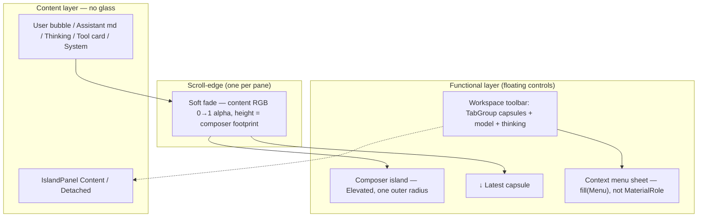
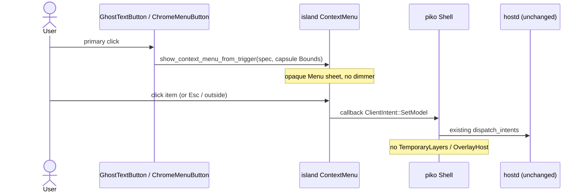

# D-61: Conversation canvas — Tahoe / Liquid Glass presentation

> Status: accepted
> Author: piko design loop
> Date: 2026-08-22
> Implements: [F-44](../features/F-44-conversation-canvas-presentation.md)
> Supersedes: F-43 Composer nested-well anatomy; F-43/D-60 “model/thinking open the existing overlay”
> Amends: F-43, D-60, F-42, D-59 (`/Users/biu/Projects/piko/docs/{features,design}/`)
> Decisions: ADR-022
> Island: `docs/design/material.md`, `context-menu.md`, `window-toolbar-presentation.md` (`/Users/biu/Projects/island-rs`)

Scratch source of truth for this loop. When it lands in the repo, copy as `docs/design/D-61-conversation-canvas-presentation.md` and add Feature PRD `docs/features/F-44-conversation-canvas-presentation.md`. F-44 **closes F-43 visual acceptance for the conversation canvas and pickers** (Composer shape, Timeline rows/fade, model/thinking chrome). It does **not** reopen tab clustering, sidebar inventory, or follow-tail rules. Unlisted F-42 / F-43 rules stand: two columns, Composer-in-Timeline, no third column, host authority. Needs attention stays a Dialog.

---

## Overview

The desktop conversation canvas still paints like a flat tool window: Timeline rows are an ungrouped markdown column with a bordered tool card; the Composer is a nested two-radius well; model and thinking pickers open a 460 px centered `OverlayPanelStyle::Dialog` with a dimmed backdrop. That fights macOS Tahoe HIG. Liquid Glass belongs on **controls that float above content**. Message bodies, tool summaries, and the Timeline plate stay in the **content layer**. Scroll-edge effects separate floating chrome from scrolling content without a modal scrim. Toolbar pickers are **menus anchored to their capsules**, not dialogs.

This design (1) puts a **soft scroll-edge fade** at the bottom of the Timeline, height-tied to the Composer footprint, plus Timeline padding so the last message rests fully above the Composer; (2) restyles User / Assistant / Thinking / Tool / System rows as content-layer conversation, with a Messages-like trailing user bubble on standard Elevated material — never glass cards; (3) replaces model/thinking dialog overlays with Island menus from `ChromeMenuButton` (same capsules, anchored to the control bounds). Island gains a reusable scroll-edge primitive, a primary-click chrome menu trigger that anchors to trigger `Bounds`, and a tiny `context_menu_is_open` helper. Piko only binds product IDs and intents. No hostd / orchd / protocol change.

---

## Background & Motivation

### Current state (post D-60 composition)

| Surface | File | What it does today | Pain |
|---|---|---|---|
| Composer | `packages/desktop/src/shell/composer.rs` | Absolute bottom of the Timeline region; `max_w(px(820.))`; outer `rounded_md` + `fill(Elevated)` **and** inner `rounded_sm` + `fill(Content)` well; `VERTICAL_CHROME = 64`, `OUTER_GAP = 24`; context meter + Send/Cancel | Nested radii / nested fills is the same concentric-radius bug as a fused Main tab. Two visual islands stacked. |
| Timeline region | `packages/desktop/src/shell/view.rs` `render_timeline_region` | `IslandPanel` `Detached` + `PanelSurfaceRole::Content`; scroll child `gap(space_md)` `px/py(space_lg)` `pb(composer_padding)`; `↓ Latest` small centered capsule; Composer on top | Content already scrolls under the Composer, but there is no scroll-edge effect. Hard cut against the floating card. |
| Rows | `packages/desktop/src/shell/rows.rs` | User/Assistant: raw `render_markdown`; Thinking: left hairline + Meta; Tool: bordered Content card; System: centered Meta | Flat column. No reading width, no user/assistant distinction, tool card competes with chrome. |
| Model / thinking | `packages/desktop/src/shell/workspace.rs` + `layers.rs` | Capsules call `open_layer(LayerKind::Model\|Thinking)`; `render_temporary_layer` paints `OverlayPanelStyle::Dialog`, `width: px(460)`, `hsla(0,0,0,0.45)` dimmer | Wrong control for a two-item catalog picker. Tabs disable while the dialog is open (`tabs_disabled(..., overlay_open)`). |
| Island menus | `island::components::menu` | `ContextMenuSpec` / `ContextMenuItem::{action,separator,submenu,selected}` ; `show_context_menu` used by `ChromeOverflowBar` on **primary** click; menus are opaque `fill(Menu, host)` sheets | Correct Tahoe menu material. Not wired to piko pickers. |
| Scroll-edge | island | **Does not exist.** GPUI **does** export `linear_gradient` / `linear_color_stop` (two stops, angle in degrees) as a `Background` | Fade can be a real primitive. In-window blur cannot. |

### Why now

F-43 / D-60 already moved Composer into the Timeline and model/thinking onto the workspace toolbar. Visual acceptance is still pending. Tahoe HIG plus the current screenshot complaints (nested wells, dialog pickers, content colliding with the float) are the remaining presentation contract. Behavior (intents, drafts, follow-tail, tab grouping) does not change.

### Constraints that do not move

- `hostd` is authoritative. `ClientIntent::SetModel` / `SetThinkingLevel` stay session-scoped.
- Two columns. Composer floats inside the Timeline column. No inspector column.
- ADR-022: reusable chrome lives in island-rs. Piko binds domain IDs.
- Island `MaterialRole` is **Sidebar and Chrome only**, and it is a **behind-window** backdrop (`docs/design/material.md`). Overlay/Menu never become `MaterialRole`. There is **no within-window blur pipeline**.
- File size ~300–400 lines per `.rs`, hard ceiling 500.
- Do not regress: Composer must not collapse into the title bar; agent tabs stay clustered hugging capsules; no UUID tooltips covering content; Hide Sidebar stays a sidebar chrome icon; `↓ Latest` stays a small centered capsule.

---

## Goals & Non-Goals

### Goals

- Timeline content scrolls under the floating Composer with a **soft scroll-edge fade** (not a dark scrim). Last message can rest fully above the Composer.
- Conversation rows read as a Tahoe content layer: numeric reading width, vertical rhythm, and insets from `island::theme::metrics()`.
- User vs assistant distinction without glass message bubbles.
- Model and thinking: anchored menus from the existing capsules; click-outside and Escape dismiss; no dimming backdrop.
- `OverlayPanelStyle::Dialog` remains only for Settings and Needs attention.
- Island owns scroll-edge fade and primary-click toolbar menus so a second GPUI app can reuse them.

### Non-goals

- hostd, orchd, protocol, or `piko-client-core` reducer changes.
- Real in-window Liquid Glass blur on Composer, `↓ Latest`, or message bubbles (blocked on GPUI / Island material; see Key Decision 4).
- Hard scroll-edge plates, modal dimmers, or stacked glass on the Timeline plate.
- Changing tab clustering, sidebar toggle placement, or return-to-latest **rules** (visibility stays D-60).
- Settings information architecture, approval UX beyond keeping the dialog.
- Per-message diffs, tool-output expansion, or selectable markdown upgrades.
- Windows / Linux desktop.
- Exact animation curves as a product contract. Visual acceptance is a user screenshot.

---

## Key Decisions

### 1. Composer vs Timeline: soft scroll-edge fade, not a mask-scrim

**Decision:** Yes, the Timeline must show a **soft scroll-edge fade** at the **bottom** of the pane. Height equals the Composer footprint already used as trailing padding. Content padding keeps the last message fully above the Composer card. This is a scroll-edge effect, not a decorative overlay and not a modal dimmer.

**Tahoe mapping**

- Controls (Composer, `↓ Latest`, toolbar capsules) float above the **content layer**.
- One effect per pane. Bottom edge is the only edge where content currently scrolls under a floating accessory.
- Soft = progressive fade of the **content surface color** to transparent. Not a dark veil. Not a hard opaque plate (that is for pinned accessories / interactive text on macOS; we are not pinning a text field into the Timeline plate).
- Do not put Liquid Glass in the content layer. Do not stack glass on glass.

**Top edge:** `WindowChromeFrame` + `WorkspacePresentation::Detached` keeps grouped toolbar chrome in the **title band**, sibling to the content column (`island` `docs/design/window-toolbar-presentation.md`). Timeline content does **not** scroll under the toolbar today. **Omit the top fade** until chrome overlays the scroll viewport. If that layout changes, add a top fade of `metrics().space_lg` (16 px) under the chrome — still one effect per edge, still not a scrim.

**Not a CSS mask.** GPUI’s `ContentMask` is a rectangular clip (`Window::with_content_mask`). The effect is a **non-occluding gradient overlay** painted in the Timeline region above the scroll view and below Composer / `↓ Latest`. Pointer events pass through: no `.occlude()`, no children, no hover/click handlers (GPUI only inserts a hitbox when those are present).

**Formulae (px, `f32` from `Pixels`):**

```text
composer_footprint = footprint_for_text(draft, measured_input_height, measured_card_height)
                   = input_height + chrome + OUTER_GAP
  input_height     = max(measured_input_height, logical_rows * LINE_HEIGHT)
  chrome           = measured_card_height > 0
                       ? max(measured_card_height − measured_input_height, 0)
                       : VERTICAL_CHROME          // 62 fallback; see §Composer
  OUTER_GAP        = space_md + space_md          // 12 pb + 12 air above the card = 24
                     // vertical only; horizontal inset is not in this addend

timeline.padding.bottom = composer_footprint      // Ready and Empty/Loading/Error/NoSession
timeline.padding.top    = metrics().space_lg      // 16
timeline.padding.x      = metrics().space_lg      // 16
bottom_fade.height      = composer_footprint      // Ready only
bottom_fade.kind        = Soft
top_fade                = none (v1)
```

At tail, the last row’s **bottom** sits on the fade’s inner edge (alpha 0). The Composer card occupies the opaque end of that same band, plus the float wrapper’s `pb(space_md)`. `↓ Latest` stays `bottom(composer_footprint - 10.0)`, a hugging capsule, not a full-width bar.

### 2. Timeline content: content-layer conversation, numeric rhythm

**Decision:** Rows stay in the content layer. No glass cards. User is a trailing Elevated bubble (Messages-like, standard material). Assistant is full-width markdown. Thinking is secondary Meta. Tool is a compact inset Content card. System is a centered caption. Reading column uses `metrics().reading_width`.

| Token | Value (`UiMetrics::compact`) | Use |
|---|---|---|
| `space_xs` | 4 | Tight gap inside a turn (thinking → assistant → tool) |
| `space_sm` | 8 | Bubble / tool card padding; system vertical inset |
| `space_md` | 12 | Loose gap between turns |
| `space_lg` | 16 | Timeline inset; Composer outer horizontal inset |
| `reading_width` | **880** | Timeline column **and** Composer `max_w` (replaces ad-hoc 820) |
| `island_radius` / `radius_md` | 12 | Composer **outer** radius; user bubble radius |
| `radius_sm` | 8 | Tool card (content-layer inset; not concentric to the Composer) |
| `radius_xs` | 6 | Send/Cancel: `concentric_radius(island_radius, space_sm)` → `max(12−8, 6) = 6` |
| `body_size` / `body_line_height` | 14 / 21 | Assistant markdown (already `TextRole::Body` via island markdown) |
| `meta_size` / `meta_line_height` | 12 / 16 | Thinking, system, tool detail, context meter |
| `label_size` / `label_line_height` | 13 / 18 | Tool name, Send/Cancel |
| `island_gutter` | 8 | Window/sidebar canvas gutter (unchanged; **not** Composer `OUTER_GAP`) |
| `hairline` | 1 | Tool card stroke; Composer outer stroke |

**Row styles**

| Kind | Alignment | Width | Surface | Type | Chrome |
|---|---|---|---|---|---|
| User | Trailing (`justify_end`) | `min(content, 0.72 * column)` capped by reading column | `fill(Elevated)` + `hairline(Elevated)` + `rounded(radius_md)` — **opaque chip, not glass** | Body markdown | Pad `space_sm` |
| Assistant | Leading, full reading column | `min(100%, reading_width)` | None (content layer) | Body markdown | No card |
| Thinking | Leading, indented | Full column minus `space_sm` | None | `TextRole::Meta` + `muted_fg`; left `border_l_2` `hairline(Chrome)` | Secondary; never a bubble |
| Tool | Leading | Full column | Inset **Content** card: `fill(Content)`, `hairline(Chrome)`, `rounded(radius_sm)`, **no Elevated, no frost** | Label name + Meta detail | Compact: `px(space_sm)` `py(4)` |
| System | Center | Hug | None | Meta + `muted_fg` | Caption, not a row card |

**Vertical rhythm** (`row_gap_before(prev: Option<RowKind>, next: RowKind) -> Pixels`):

```text
prev is None (first row)                 → 0     // do not stack on timeline py(space_lg)
thinking | assistant | tool, same cluster → space_xs (4)
system adjacent to anything               → space_sm (8)
any other adjacent pair                   → space_md (12)
```

Parent `gap(0)`; each row `mt(row_gap_before(prev, kind))`. Implement as a pure helper over `TimelineRow` discriminants so tests do not need GPUI.

**Reading column:** the scroll child’s inner stack is `.w_full().flex().justify_center()` wrapping a `.w_full().max_w(metrics().reading_width)` column. Composer already centers; both share 880 so the input sits on the same axis as assistant text.

### 3. Model and thinking: anchored menus, not overlays

**3a. Overlay?** **No** for model and thinking. **Yes** (existing Dialog) for Settings and Needs attention only.

**3b. Layout:** Island context menu, primary-click, **anchored to the capsule’s layout bounds** (menu `TopLeft` at the trigger’s `BottomLeft`), opaque semantic sheet (`fill(Menu, host)`). Still `snap_to_window_with_margin(px(8.))`. That is the Tahoe-correct menu material (island `material.md`: Overlay/Menu never become `MaterialRole`). Cursor-anchored `event.position()` + `Anchor::TopLeft` (overflow-bar pattern) is **not** good enough for a labeled picker — the menu would jump along a wide model capsule.

**Why not a dialog:** `packages/desktop/src/shell/layers.rs` opens `LayerKind::Model` / `Thinking` as `OverlayPanelStyle::Dialog` centered 460 px with `hsla(0,0,0,0.45)` dim. That is the control for a multi-field sheet, not a two-control catalog. Island already has checkmarks (`ContextMenuItem::selected`), separators, and one-level submenus. `ChromeOverflowBar` may keep cursor-anchored menus for icon overflow; pickers use the new trigger-bounds path.

**Thinking menu:** one flat list, canonical order from `piko_protocol::ThinkingLevel` (`Off … Max`). Checkmark on the current `ModelState.thinking_level`. Capsule keeps `thinking_chrome_label` (truncated, title-case). Menu label is title-case **plus a short caption** in the same string (Island items have no subtitle field; do not add a second line — item height stays 32 px):

| Level | Menu label |
|---|---|
| Off | `Off — no extra reasoning` |
| Minimal | `Minimal — shortest` |
| Low | `Low` |
| Medium | `Medium — default` |
| High | `High` |
| XHigh | `Extra high` |
| Max | `Max` |

**Model menu:** label is the **full model id** (`model.id`). Capsule stays `model_chrome_label` (last path segment, 16 chars + ellipsis). Group by `ProviderInfo.provider`:

- **1 provider:** flat list, checkmark on current via `model_row_matches` in `pickers.rs` (see below).
- **2+ providers:** one **scrolling** menu with disabled section headers and `separator()` between groups. Never a cascading submenu — a large OpenAI catalog must not paint a full-window flyout (visual review 2026-08-23). Headers are `PickerEntry::Header`, mapped to `ContextMenuItem::action(provider).enabled(false)` only at the GPUI boundary. Island caps menu height at ten rows and scrolls.

**Checkmark identity** is **not** `ModelState::active_context_window`. That method also requires `model.context_window > 0`, so a selected model with a zero catalog window (host `context_window` already filled) would render unchecked. Extract a pure helper in `pickers.rs` with **no** `piko-client-core` change:

```rust
fn model_row_matches(
    current_id: Option<&str>,
    current_provider: Option<&str>,
    provider: &str,
    model: &ModelSummary,
) -> bool {
    let Some(id) = current_id else { return false };
    let full = format!("{provider}/{}", model.id);
    let provider_matches = current_provider.is_none_or(|p| p == provider);
    id == full || (provider_matches && id == model.id) || id == model.name
}
```

Empty catalog: one `PickerEntry::Action { label: "No models listed", enabled: false, selected: false, payload: PickerPayload::None }`. **`ChromeMenuButton` must still open** that spec. Do **not** change global `ContextMenuSpec::is_empty` (a lone disabled action remains “empty” for `ContextMenuHost` / secondary-click). `ChromeMenuButton` opens when `!spec.items.is_empty()` after normalize — it never calls `is_empty()`. Island test: disabled-only spec has `is_empty() == true` and `items.len() == 1` and `menu_spec_opens(&spec) == true`.

Selecting an enabled item maps `PickerPayload` to `ClientIntent::SetModel { provider, model_id }` / `SetThinkingLevel { level }` in `workspace.rs` and dismisses (menu close-then-callback is already Island policy).

**Dismiss:** click-outside and Escape are Island `ContextMenu` behavior. **No backdrop dimmer.** Do not route these through `TemporaryLayers` / `OverlayHost`.

**Tabs while the menu is open:** `tabs_disabled(..., overlay_open)` today freezes the strip for *any* layer, including Model. After this change, model/thinking no longer open a layer, so **TabGroup stays enabled**. Correct: a menu is transient chrome, not a modal session. Sidebar list keys and Composer Enter must **not** fire through the open menu (see Keyboard).

**Attention / Settings:** keep `LayerKind::{Attention, Settings}` and `OverlayPanelStyle::Dialog`. They need more than a flat choice list (approval pairs, placeholder copy).

### 4. Island vs piko split for scroll-edge (and menus)

**Scroll-edge → island.** A second GPUI app with a floating composer or pinned accessory needs the same fade. Island currently has **no** scroll-edge / gradient-mask component. GPUI provides the paint: `gpui::linear_gradient(angle, from, to)` and `linear_color_stop` — **exactly two stops**, angle 0 = top, clockwise. There is no gradient mask API. Implement `island::components::scroll_edge` as a non-occluding overlay `Background`, not a clip mask.

**Soft vs hard (island API, piko uses Soft):**

| Kind | Stops (see paint note) | When |
|---|---|---|
| Soft (default) | Content RGB, alpha 0 at the inner stop → alpha 1 at the pane edge | Default scroll-edge; **piko Timeline uses this** |
| Hard | Elevated RGB, alpha 0 inner → alpha 0.92 at the edge; inner stop at 0.35 so the plate feels shorter/more opaque | Pinned interactive accessories; **not used** by piko Timeline |

Paint note: a **bottom** fade that hides content under the Composer is opaque **at the bottom** and transparent **at the top of the fade**. Angle `0` is top → increasing clockwise, so a top-to-bottom gradient is `180` (or `0` with stops swapped). Use:

```text
angle = 180°  // top → bottom
stop 0.0 = content RGB, alpha 0
stop 1.0 = content RGB, alpha 1
```

Color conversion (must compile): `fill` returns `Rgba`; `linear_color_stop` wants `Into<Hsla>`. Use `Hsla::from(fill(role, host))` (`impl From<Rgba> for Hsla` in GPUI), then opacity on that `Hsla`. **`IslandTokens::hsla` takes a `u32` hex token only** — do not pass `Rgba` to it.

```rust
let color = Hsla::from(fill(role, host));
linear_gradient(
    180.0,
    linear_color_stop(color.opacity(0.), 0.0),
    linear_color_stop(color, 1.0),
)
```

Hard (bottom): `Hsla::from(fill(Elevated, host))`, inner stop at `0.35` with alpha 0, edge stop at `1.0` with alpha `0.92`. Tests `assert_eq!` the returned `Background` against a `linear_gradient(...)` they construct (`Background: PartialEq`). Do **not** read `Background` fields (`tag`, `colors`, angle are `pub(crate)`).

**Blur:** Tahoe “soft” includes progressive blur. Island material is behind-window only. **Do not fake blur** with extra darkening or stacked translucent Elevated plates (glass-on-content). Soft = fade-to-content-color. Document the GPUI gap; do not block the feature.

**Primary-click menus → island.** `show_context_menu` + `ContextMenuLayer` + `window.use_keyed_state` is already how `ChromeOverflowBar` works. `ContextMenuExt::context_menu` is **secondary-click only** (`host.rs` `is_secondary_click`). Do not overload that trait. Add `ChromeMenuButton` (new file; `button.rs` is 339 lines) that wraps `GhostTextButton` visuals, owns a keyed `ContextMenuLayer`, **stores last layout `Bounds`**, and on primary click calls a new `show_context_menu_from_trigger(spec, trigger_bounds, layer, window, cx)` which places the menu `TopLeft` at `trigger.bottom_left()` (capsule bottom edge), still using existing `snap_to_window_with_margin(px(8.))`. Do **not** pass `ClickEvent::position()` (mouse-up point). `ClickEvent` only exposes element bounds for keyboard clicks (`KeyboardClickEvent.bounds`); mouse clicks have no trigger rect on the event — layout state is required.

Also export `island::components::menu::context_menu_is_open(window, cx) -> bool` from the existing `pub(crate)` `ContextMenuRegistry` (do not make the registry public). Piko supplies a live `ContextMenuSpec` (from `PickerEntry`) and `.material(self.material)`.

**Piko owns:** row grouping, reading-column composition, Composer concentric-radius fix, picker **labels and intents**, `LayerKind` reduction. Piko does **not** fork a private gradient or a private menu host.

---

## Proposed Design

### Layering (Tahoe)



### Timeline region z-order

`render_timeline_region` today (bottom of `view.rs`): panel → optional `↓ Latest` → Composer. Insert the fade **above the panel, below Latest and Composer**:

```text
piko-timeline-region (relative, size_full)
  ├─ IslandPanel Content Detached     // scroll + rows
  ├─ ScrollEdgeFade bottom            // pointer-transparent
  ├─ ↓ Latest capsule                 // unchanged rules
  └─ ComposerView                     // absolute bottom, centered
```

Empty / loading / error / no-session: **no fade** (nothing scrolls under the Composer). Composer still mounts. **Do apply `pb(composer_footprint)`** on those panel bodies (same number as Ready) so “No messages yet” / errors sit in the visible column above the card — today those `IslandPanel::empty` / `loading` paths have no trailing padding and the placeholder already sits under the Composer. Implementation: wrap the placeholder in a `size_full` column with `.pb(px(composer_padding))` (keep `IslandPanel::empty` / `loading` if they grow a padding hook; otherwise `IslandPanel::new(..., padded).scroll(false)`). Fade mounts only for `TimelineState::Ready`.

### Sequence: model pick



### Composer: one outer radius

Today (`composer.rs`):

- Outer: `.rounded_md()` (12) + `fill(Elevated)` + `hairline(Elevated)`
- Inner well: `.rounded_sm()` (8) + `fill(Content)` + `hairline(Content)`

That is two competing islands. **Fix:** one floating island.

```text
┌ Composer  island_radius=12, fill(Elevated), hairline(Elevated),
│           overflow_hidden, shadow(elevation_sm().box_shadow()) ───────────┐
│ error Meta (optional)                                                     │
│ Textarea — no inner border, no inner fill, no inner radius                │
│ [meter 72×compact] 12k/128k                          [Cancel] [Send]      │
└───────────────────────────────────────────────────────────────────────────┘
```

- Outer: `rounded(metrics().island_radius)` + **`overflow_hidden()`** + `shadow(elevation_sm().box_shadow())`. Clip is required so the flush textarea does not square-corner into the 12 px radius.
- Inner input: no border, no Content fill, no radius. `px(space_sm)` `py(6)` stays for hit/text, not for a second shape. Screenshot-accept the action row against the 12 px corner.
- Send/Cancel: compact bordered actions, **not** a second island. Radius is **one formula only**: `concentric_radius(metrics().island_radius, metrics().space_sm)` → 6 (`radius_xs`). Do not write `concentric_radius(12, 4)` anywhere in this feature.
- Elevation: `elevation_sm` (`offset_y 1, blur 4`), not `elevation_md` (menu sheet).
- `max_w(metrics().reading_width)` = **880** (was 820).
- Float wrapper: `px(space_lg)` (16, was 18) horizontally; `pb(space_md)` (12) vertically.

**Footprint constants** — comment this formula next to `VERTICAL_CHROME`. Deleting the inner **shape** (radius / Content fill / Content hairline) saves the inner `border_1` (~2 px), **not** the input `py(6)`. Do not keep `py(6)` and drop 16 px of chrome:

```text
LINE_HEIGHT     = metrics().body_line_height     // 21
MIN_ROWS / MAX  = 2 / 8                          // unchanged
VERTICAL_CHROME = outer py(space_sm)×2           // 16
                + input py(6)×2                  // 12  (kept)
                + gap(space_xs)                  // 4
                + compact_bar_height             // 28
                + outer hairline×2               // 2
                = 62                             // was 64; inner border only is gone
OUTER_GAP       = space_md (wrapper pb)          // 12
                + space_md (air above the card)  // 12
                = 24                             // vertical only; do not mix side inset
```

Prefer **measuring** once the card has laid out: `chrome = max(measured_card − measured_input, 0)`; fallback `VERTICAL_CHROME` (62) on the first frame when card height is 0. `footprint_for_text(text, measured_input_height, measured_card_height)`. Two-row identity test: `footprint_for_text("one", 0.0, 0.0) == 2.0 * 21.0 + 62.0 + 24.0` (128). Keep clamp / soft-wrap asserts.

Placeholder: keep targeting the view-target agent (“Message the selected agent…” today; F-43 wants “Message {label}…” — out of scope unless already wired).

### User bubble vs assistant

Assistant stays a document. User is a chat bubble on **Elevated** (token comment: “raised chips. Opaque elevated RGB; not a sheet”). Light/dark follow `fill`. Do not use `SurfaceRole::Chrome` frost. Do not use `glass()` on anything in the Timeline.

Long user messages wrap inside the 72% cap; markdown is the same island `render_markdown` as assistant.

### Tool card

Keep the existing compact card, but it is an **inset content** treatment: `fill(Content)` on a Content plate is a hairline grouping, not elevation. Do not switch it to Elevated (that would compete with the user bubble and Composer). Running / failed accents stay `RoleAccent::Info` / `Danger` on the name. Detail stays Meta, truncated by existing `ARGS_PREVIEW_LIMIT` (160) in `timeline.rs`.

### `↓ Latest`

Unchanged product rules (D-60). Visual: still a hugging `rounded_full` capsule, `fill(Elevated)`, `hairline(Chrome)`, Meta label `"↓ Latest"`. Sits in the functional layer above the fade. Do not make it full-width. Do not glass it (no in-window material; avoid glass-on-composer).

### Keyboard and focus

- Menu focus, arrow wrap, Enter, Escape, outside-click: Island `ContextMenu` (`KEY_CONTEXT` `IslandContextMenu`). Opening a menu already focuses that entity (`context_menu_layer_element`).
- **Gate (required):** `handle_shell_key` returns immediately when `island::components::menu::context_menu_is_open(window, cx)` is true. That skips (1) sidebar Up/Down/Home/End/Enter/Space — today those run off `focus_owner == Sidebar` even if GPUI focus is on the menu, and `layers.active()` will no longer be set for pickers; (2) Tab cycling; (3) Escape closing Settings/Attention or the narrow sidebar. Do **not** `stop_propagation` on that early return so Island’s Escape binding can dismiss the menu. Comment this in `keyboard.rs`.
- **Composer Enter:** `submit_composer` also no-ops when `context_menu_is_open` is true (belt if the textarea still holds focus for one frame). Normal path: menu focus means the textarea does not receive `PressEnter`.
- TabGroup stays enabled while a picker menu is open (Key Decision 3).
- `FocusOwner` cycle unchanged (Timeline → Composer → Sidebar → AgentTabs).
- `LayerKind` shrinks to `Attention | Settings`. Update `packages/desktop/src/focus.rs` tests that currently open `LayerKind::Model`.

### Performance / paint

- Fade is one extra `div` with a two-stop gradient. Height ≈ 128–254 px depending on wrapped Composer (2–8 rows × 21 + 62 + 24). Negligible vs markdown layout.
- Menus: one Entity, max width `min(320, viewport-16)`, max height ten rows (or the window minus 16 px) with overflow scroll. Large catalogs stay one grouped list.
- No extra host round-trips. Catalog is `ClientState.model.providers` from the last `ModelList`.

---

## API / Interface Changes

### Island: scroll-edge (new)

`crates/island/src/components/scroll_edge.rs` — keep well under 400 lines. Export from `components/mod.rs`.

```rust
pub enum ScrollEdgeKind {
    /// Progressive fade of the pane surface color. Default.
    Soft,
    /// More opaque plate; for pinned interactive accessories.
    Hard,
}

pub enum ScrollEdge {
    Top,
    Bottom,
}

pub struct ScrollEdgeFade {
    edge: ScrollEdge,
    kind: ScrollEdgeKind,
    height: Pixels,
    material: WindowMaterialHost,
    surface: SurfaceRole, // piko Timeline: Content
}

impl ScrollEdgeFade {
    pub fn bottom(height: impl Into<Pixels>) -> Self;
    pub fn top(height: impl Into<Pixels>) -> Self;
    pub fn kind(self, kind: ScrollEdgeKind) -> Self;
    pub fn material(self, host: WindowMaterialHost) -> Self;
    pub fn on_surface(self, role: SurfaceRole) -> Self;
}

/// Pure: two-stop Background for tests.
pub fn scroll_edge_background(
    edge: ScrollEdge,
    kind: ScrollEdgeKind,
    role: SurfaceRole,
    host: WindowMaterialHost,
) -> Background;
```

Render: `absolute` `left_0` `right_0` + `top_0` or `bottom_0`, `h(height)`, `.bg(scroll_edge_background(...))`. No `.occlude()`, no children, no hover/click.

Gallery: one scene on a scrolling `IslandPanel` with a fake bottom accessory so the fade is visible. Visual acceptance remains manual.

### Island: primary-click chrome menu (new)

`crates/island/src/components/chrome/menu_button.rs`, re-export from `chrome/mod.rs`.

```rust
pub struct ChromeMenuButton { /* GhostTextButton fields + spec builder */ }

impl ChromeMenuButton {
    pub fn new(id: impl Into<ElementId>, label: impl Into<SharedString>) -> Self;
    // same visual builders as GhostTextButton: emphasis, icons, capsule, tooltip, material
    pub fn menu(
        self,
        build: impl Fn(&mut Window, &mut App) -> ContextMenuSpec + 'static,
    ) -> Self;
}

/// Menu TopLeft attaches to trigger BottomLeft. Reuses snap_to_window_with_margin(8).
pub fn show_context_menu_from_trigger(
    spec: ContextMenuSpec,
    trigger: Bounds<Pixels>,
    layer: Rc<RefCell<ContextMenuLayer>>,
    window: &mut Window,
    cx: &mut App,
);

/// True when this window has an active Island context menu (registry hit).
pub fn context_menu_is_open(window: &Window, cx: &App) -> bool;

/// ChromeMenuButton gate: rows exist after normalize (disabled-only is OK).
pub(crate) fn menu_spec_opens(spec: &ContextMenuSpec) -> bool;
```

Implementation: keyed state holds `ContextMenuLayer` **and last `Bounds`**. Paint/layout writes bounds. Click uses `show_context_menu_from_trigger`, **not** `event.position()`. `menu_spec_opens` is `!spec.items.is_empty()` — **never** `!spec.is_empty()`. Keep `ContextMenuSpec::is_empty` meaning “no selectable action” for `ContextMenuHost`. Existing `show_context_menu(point, Anchor)` stays for `ChromeOverflowBar`.

Do **not** change `ContextMenuExt` (secondary click). Do **not** put Liquid Glass on the menu (`.glass` stays an explicit opt-in; piko does not set it). Do **not** add public getters on `ContextMenuItem`.

### Piko: layers

`LayerKind::Model` and `LayerKind::Thinking` deleted. `workspace.rs` pickers stop calling `open_layer`. `layers.rs` match arms for those kinds go away. `tabs_disabled(connection, overlay_open)` keeps the second argument for Settings/Attention only.

### Piko: picker builders (new, pure)

`packages/desktop/src/shell/pickers.rs` — **no `ContextMenuItem`**. Unit-test a pure `PickerEntry` tree; `workspace.rs` maps it to `ContextMenuItem` + callbacks at the GPUI boundary. `ContextMenuItem.kind` is `pub(crate)` with no public getters — piko tests must not read `selected` / label / submenu from Island items.

```rust
pub enum PickerPayload {
    SetModel { provider: String, model_id: String },
    SetThinking(ThinkingLevel),
    None,
}

pub enum PickerEntry {
    Header { label: String },
    Separator,
    Action {
        label: String,
        selected: bool,
        enabled: bool,
        payload: PickerPayload,
    },
}

pub fn thinking_entries(current: Option<&str>) -> Vec<PickerEntry>;
pub fn model_entries(state: &ModelState) -> Vec<PickerEntry>;
```

---

## Data Model Changes

None. No session journal, no `readmodels`, no protocol DTOs.

Client-local presentation prefs (`DesktopPrefs`) unchanged. Drafts, follow, composer error stay per `session_id:agent_instance_id` (D-60).

`TimelineRow` enum in `timeline.rs` is unchanged; only `rows.rs` presentation changes. Optional: do **not** add a `TurnGroup` type unless grouping tests need it — a function on consecutive discriminants is enough.

---

## Package impact

| Package | Change |
|---|---|
| `island-rs` (`island` crate) | `ScrollEdgeFade`, `ChromeMenuButton`, `show_context_menu_from_trigger`, `context_menu_is_open`. No `MaterialRole` change. |
| `piko-desktop` | Timeline fade/padding/rows, Composer radius/footprint, picker menus, `LayerKind` shrink. |
| `piko-protocol` | None |
| `piko-hostd` | None |
| `piko-orchd` | None |
| `piko-llmd` | None |
| `piko-sandbox` | None |
| `piko-client-core` | None (`model_row_matches` lives in desktop `pickers.rs`) |

---

## Failure and cancellation

Picker and menu failures stay on existing composer error Meta and command-failure toasts. A disabled “No models listed” row is not an error. Dismissing a menu (Escape / outside click) does not submit, cancel a turn, or clear a draft. Overlay Dialog failures (Settings placeholder, Needs attention) are unchanged.

---

## File-level plan

### Island (`/Users/biu/Projects/island-rs`)

| File | Change |
|---|---|
| `crates/island/src/components/scroll_edge.rs` | **New.** `ScrollEdgeFade`, `scroll_edge_background`, unit tests via `Background` `PartialEq` against constructed `linear_gradient`. |
| `crates/island/src/components/mod.rs` | `pub mod scroll_edge;` |
| `crates/island/src/components/chrome/menu_button.rs` | **New.** `ChromeMenuButton`, `menu_spec_opens`. |
| `crates/island/src/components/menu/host.rs` + `mod.rs` | `show_context_menu_from_trigger`; `context_menu_is_open`. |
| `crates/island/src/components/chrome/mod.rs` | Re-export `ChromeMenuButton`. |
| `crates/island/examples/gallery/scenes/` | Scroll-edge fixture (extend `workspace.rs` or a small new scene; stay under 500 lines). |
| `docs/design/scroll-edge.md` + `docs/features/scroll-edge.md` | Island PRD/design for the primitive (product-free). Optional in the same island PR. |

No change to `theme/metrics.rs` numbers. No new `MaterialRole`. `components/scroll.rs` stays the overlay scrollbar.

### Piko (`/Users/biu/Projects/piko`)

| File | Change |
|---|---|
| `packages/desktop/src/shell/view.rs` | Mount Soft fade when Ready; `pb(composer_footprint)` on Ready **and** Empty/Loading/Error/NoSession; z-order unchanged otherwise. Extract `render_timeline_region` to `canvas.rs` if this file crosses ~400. |
| `packages/desktop/src/shell/canvas.rs` | **New if needed** (preferred): `reading_column`, `row_gap_before`, `user_bubble_max_width` + tests. |
| `packages/desktop/src/shell/composer.rs` | Drop inner well; one `island_radius` + `overflow_hidden` + `elevation_sm`; `max_w(reading_width)`; `VERTICAL_CHROME = 62` with layout-measured chrome; `OUTER_GAP` vertical-only; 2-row identity test. |
| `packages/desktop/src/shell/rows.rs` | User bubble, assistant column, thinking/tool/system; `mt(row_gap_before(prev, kind))`. |
| `packages/desktop/src/shell/timeline.rs` | No presentation change. Mapping tests stay. |
| `packages/desktop/src/shell/workspace.rs` | `ChromeMenuButton`; map `PickerEntry` → `ContextMenuItem` + intents; Attention still `open_layer(Attention)`. |
| `packages/desktop/src/shell/pickers.rs` | **New.** Pure `PickerEntry` / `model_row_matches` / provider headers (no cascading submenus) / captions. |
| `packages/desktop/src/shell/layers.rs` | Settings + Attention only. |
| `packages/desktop/src/focus.rs` | `LayerKind` without Model/Thinking; fix tests. |
| `packages/desktop/src/shell/mod.rs` | `mod pickers;` (+ `mod canvas` if extracted). |
| `packages/desktop/src/shell/keyboard.rs` | Early-return when `context_menu_is_open`. Overlay-open still blocks sidebar keys for Settings/Attention. |
| `packages/desktop/src/shell/submit.rs` | `submit_composer` no-ops when `context_menu_is_open`. |
| `packages/desktop/src/shell/tabs.rs` | Unchanged labels (`model_chrome_label` / `thinking_chrome_label`). |

Docs in-repo (PR 5): `docs/features/F-44-…`, `docs/design/D-61-…`, index rows. F-44 **supersedes** the F-43 nested-well Composer diagram and F-43/D-60 “opens the existing model/thinking overlay” bullets (same patch pattern F-43 used on F-42). Keep Needs-attention as Dialog. Header on F-44: closes F-43 visual acceptance for canvas/pickers, not tab clustering. D-44 already exists (session bookkeeping); F-44→D-61 is the correct next desktop pair.

---

## Tests

Visual acceptance is a **user screenshot**, not a GPUI golden. Automate pure helpers.

### Island

- `assert_eq!(scroll_edge_background(Bottom, Soft, Content, opaque), linear_gradient(180., linear_color_stop(Hsla::from(fill(Content, host)).opacity(0.), 0.), linear_color_stop(Hsla::from(fill(Content, host)), 1.)))`.
- Hard: constructed `linear_gradient` with Elevated color, inner stop `0.35` alpha 0, edge `1.0` alpha `0.92`.
- Top vs Bottom are not equal (`PartialEq`).
- `menu_spec_opens`: `ContextMenuSpec::new([disabled action])` → `is_empty() == true`, `items.len() == 1`, `menu_spec_opens == true`; truly no items → `menu_spec_opens == false`. Do not change `is_empty`.
- `show_context_menu_from_trigger` unit-test of the point: `trigger.bottom_left()` (pure helper if extracted). Selected-item builder round-trip stays in `item.rs`.

### Piko unit

- `row_gap_before(None, User) == 0`; `(Thinking, Assistant) == space_xs`; `(User, Assistant) == space_md`; `(System, User) == space_sm`.
- User bubble fraction: `user_bubble_max_width(column)` = `min(column * 0.72, reading_width * 0.72)`.
- `footprint_for_text("one", 0.0, 0.0) == 128.0`; still grows then clamps; wrapped measured height still expands clearance; measured card `chrome = card − input`.
- Fade height equals `footprint_for_text` (identity helper `scroll_edge_height_for_composer`).
- `thinking_entries`: seven actions, current `High` `selected: true`, captions on Off/Minimal/Medium.
- `model_entries`: one provider → no submenu/separator; two providers × 2 models → headers + separators; 4×4 → submenus; empty → one disabled action; `model_row_matches` true when `context_window == 0`.
- `LayerKind` close-restore test uses `Settings` or `Attention`, not `Model`.
- `tabs_disabled` still true when Attention overlay is open.

### Out of scope for CI

- Gradient look vs wallpaper.
- Menu collision with the native traffic-light cluster (Island already clamps with 8 px safe margin).

---

## Alternatives Considered

### (A) Fade vs hard plate vs no treatment

| Option | Pros | Cons | Verdict |
|---|---|---|---|
| **Soft fade (chosen)** | Matches Tahoe default scroll-edge; does not dim; height tracks Composer; one pane effect | No real blur (GPUI gap); must match Content RGB | **Select** |
| Hard plate | Stronger separation for interactive text | Paints a second opaque shelf under the Composer; reads as a third chrome bar; fights “last message fully above” | Reject for Timeline. Keep `ScrollEdgeKind::Hard` in island for other apps |
| No treatment (today) | Zero paint | Content collides with the float; last lines unreadable under the card | Reject |
| Dark scrim / modal dimmer | Familiar overlay language | HIG: scroll-edge is not a dimmer; blocks reading; glass-on-content | Reject |
| True blur + fade | Pixel-perfect Tahoe | Island has no in-window blur; `MaterialRole` is behind-window Sidebar/Chrome only | Deferred until a real within-window material exists |

### (B) User bubble vs full-width both sides

| Option | Pros | Cons | Verdict |
|---|---|---|---|
| **Trailing user bubble, full-width assistant (chosen)** | Messages-like scan; user turns pop without glass; assistant stays a document | Need a max-width fraction and trailing layout | **Select.** Elevated chip, not Liquid Glass |
| Full-width both, role labels | Simpler layout; closer to today’s column | User/assistant indistinguishable at a glance; feels like a log, not a conversation | Reject |
| Glass bubbles both sides | “Premium” | Glass in the content layer; glass-on-glass with Composer; violates HIG and island material split | Reject |
| Leading avatars | Identity | No avatar source in the projection; extra chrome in the content layer | Reject |

### (C) Menu vs popover vs dialog

| Option | Pros | Cons | Verdict |
|---|---|---|---|
| **Anchored menu (chosen)** | HIG: pickers attach to their control; Island already has checkmarks/separators/submenus; overflow bar already primary-clicks `show_context_menu`; no dimmer; Escape/outside exist | Menu max width 320; no official subtitle row (captions inline) | **Select** |
| Anchored popover (custom panel) | Room for captions, search, provider icons | New island component; likely a second sheet style; easy to accidentally glass it | Reject until catalogs need search |
| Centered Dialog (today) | Already coded | Wrong control; 460 px; 45% dimmer; disables tabs; looks like Settings | Reject for model/thinking; **keep** for Settings / Needs attention |

---

## Security & Privacy Considerations

- Menus display **model ids** already present in the host `ModelList` projection. No new identifiers. Capsule tooltips already include the full id (`workspace.rs`); do not add UUID tooltips on Timeline rows (regression guard from prior visual review).
- Thinking level is a session capability, not secret. Captions are static copy.
- Click-outside dismiss must not submit the Composer (menu layer uses `occlude` on the window-sized deferred layer — existing Island behavior). Fade overlay must **not** occlude, or Timeline selection/scroll breaks.
- No additional data at rest. No auth tokens in menu labels (`ProviderInfo.has_auth` is not shown in v1).

Threat: a huge model catalog making a tall menu. Mitigation: one grouped scrolling list; Island `menu_max_height` caps at ten rows.

---

## Observability

No new metrics or host logs. Failures stay on existing command-failure toasts / composer error Meta.

Dev-only: gallery scene for scroll-edge. Empty model catalog still opens a disabled-only menu (`ChromeMenuButton` does not use `ContextMenuSpec::is_empty`). Picker/menu failures stay on composer error Meta / command toasts.

---

## Rollout Plan

No feature flag. Presentation-only, macOS desktop. Incremental PRs below; each is screenshot-reviewable.

Rollback: revert the piko PR (rows/composer/pickers) independently of island. If island shipped first, unused `ScrollEdgeFade` / `ChromeMenuButton` are inert.

Risk register:

| Risk | Severity | Mitigation |
|---|---|---|
| GPUI two-stop gradient cannot mimic blur | Medium (visual) | Soft fade to Content RGB; do not darken |
| Fade steals pointer events | High | No `.occlude()`, no children, no hover/click; z-order under Composer |
| Last message sits in the fade when following | Medium | At tail, last row **bottom** aligns with the fade’s inner edge (alpha 0); Composer occupies the opaque end plus `pb(space_md)` |
| Nested Composer radius regresses | Medium | Delete inner well; outer `overflow_hidden`; screenshot action row vs 12 px corner |
| Menu truncated model ids | Low | Full id in menu; capsule stays truncated; width up to 320 |
| Shell keys fire through the menu | High | `context_menu_is_open` gate in `handle_shell_key` + `submit_composer`; TabGroup stays live |
| `button.rs` / `view.rs` exceed 500 lines | Medium | New `menu_button.rs`, `pickers.rs`, optional `canvas.rs` |
| Glass-on-glass if someone `fill(Chrome)` the bubble | High | Content/Elevated only in rows; code review against `MaterialRole` |

---

## Open Questions

None that block implementation. Product questions 1–3 are decided above.

Deferred (not blocking): within-window blur if GPUI grows a backdrop filter; top fade if Detached chrome starts overlaying the scroll viewport; model-catalog search if providers grow past submenu comfort.

---

## References

- Apple macOS HIG — Liquid Glass, functional layer vs content layer, scroll-edge effects (soft vs hard), menus attach to controls, concentric radii, no glass-on-glass.
- ADR-022 — island vs piko split.
- F-42 / D-59 — two-column shell, Composer-in-Timeline.
- F-43 / D-60 — tabbed workspace, toolbar model/thinking, Composer meter. F-44 **supersedes** the nested input-well diagram and “opens the existing overlay” picker bullets; Needs attention stays Dialog. D-44 is session bookkeeping — do not reuse that number.
- Island `docs/design/material.md` — Overlay/Menu never `MaterialRole`; behind-window frost only.
- Island `docs/design/context-menu.md` — opaque Menu sheet, `selected`, geometry 144–320 × 32 item.
- Island `docs/design/window-toolbar-presentation.md` — Detached title-band grouped chrome, sibling content column.
- GPUI `linear_gradient` / `linear_color_stop` — `crates/gpui/src/color.rs` (zed checkout); two stops only.
- Code: `packages/desktop/src/shell/{composer,rows,view,layers,workspace,tabs,timeline}.rs`; `packages/desktop/src/focus.rs`; `island` `components/{menu,chrome/overflow,chrome/button,panel,scroll}.rs`; `island` `theme/{metrics,surfaces}.rs`.

---

## PR Plan

Ordered, independently reviewable PRs. Island first so piko does not grow a private gradient or menu host.

### PR 1 — island: scroll-edge fade primitive

- **Title:** `island: add ScrollEdgeFade (soft/hard gradient overlay)`
- **Files / components:** `crates/island/src/components/scroll_edge.rs` (new), `crates/island/src/components/mod.rs`, gallery scene under `crates/island/examples/gallery/scenes/`, optional `docs/features/scroll-edge.md` + `docs/design/scroll-edge.md`
- **Dependencies:** none
- **Description:** Product-free overlay: `ScrollEdgeFade::{top,bottom}`, `ScrollEdgeKind::{Soft,Hard}`, `scroll_edge_background` using `Hsla::from(fill(role, host))` and GPUI `linear_gradient` (two stops). Soft is transparent→opaque toward the edge. No occlusion, no `MaterialRole`, no in-window blur. Tests `assert_eq!` against constructed `linear_gradient` values (do not read `Background` fields). Gallery shows a scrolling content plate with a bottom fade.

### PR 2 — island: primary-click chrome menu button

- **Title:** `island: ChromeMenuButton for toolbar-anchored menus`
- **Files / components:** `crates/island/src/components/chrome/menu_button.rs` (new), `crates/island/src/components/chrome/mod.rs`, `crates/island/src/components/menu/host.rs`, `crates/island/src/components/menu/mod.rs`; reuse `ContextMenuLayer` / `context_menu_layer_element` (no API break to `ContextMenuExt` or `ContextMenuSpec::is_empty`)
- **Dependencies:** none (parallel with PR 1)
- **Description:** Wrap `GhostTextButton` visuals. Store trigger `Bounds`; open with `show_context_menu_from_trigger` (menu TopLeft at capsule BottomLeft, `snap_to_window_with_margin(8)`). Do not use `event.position()`. Open disabled-only specs (`menu_spec_opens`); do not call `is_empty()`. Export `context_menu_is_open`. Menus stay opaque `fill(Menu, host)`. Keep `button.rs` under 500 lines.

### PR 3 — piko: Timeline canvas, rows, Composer

- **Title:** `desktop: Tahoe conversation canvas (fade, rows, composer radius)`
- **Files / components:** `packages/desktop/src/shell/view.rs`, `packages/desktop/src/shell/composer.rs`, `packages/desktop/src/shell/rows.rs`, optional `packages/desktop/src/shell/canvas.rs` + `mod.rs`; consumes island PR 1
- **Dependencies:** PR 1
- **Description:** Mount a Soft `ScrollEdgeFade` at the bottom of `piko-timeline-region` when Ready; height = `footprint_for_text`. `pb(composer_footprint)` on Ready **and** Empty/Loading/Error/NoSession (no fade on those). Center a `reading_width` (880) column. Restyle rows: trailing Elevated user bubble (72% cap), full-width assistant markdown, secondary thinking, inset Content tool card, centered system caption; `row_gap_before(None) == 0`. Composer: delete inner well; one `island_radius` + `overflow_hidden` + `elevation_sm`; `VERTICAL_CHROME = 62` with measured-card chrome; `OUTER_GAP` vertical-only. Do not change `↓ Latest` rules or tab clustering. Unit tests for gaps, bubble width, fade height, 2-row footprint identity.

### PR 4 — piko: model and thinking anchored menus

- **Title:** `desktop: model/thinking pickers as anchored menus`
- **Files / components:** `packages/desktop/src/shell/workspace.rs`, `packages/desktop/src/shell/pickers.rs` (new), `packages/desktop/src/shell/layers.rs`, `packages/desktop/src/focus.rs`, `packages/desktop/src/shell/keyboard.rs`, `packages/desktop/src/shell/submit.rs`, `packages/desktop/src/shell/mod.rs`; consumes island PR 2
- **Dependencies:** PR 2 (PR 3 independent; land after or in parallel once PR 2 is in)
- **Description:** Replace `open_layer(Model|Thinking)` + Dialog overlay with `ChromeMenuButton` menus. Pure `PickerEntry` tests in `pickers.rs`; map to `ContextMenuItem` only in `workspace.rs`. Thinking: one list, checkmark, short inline captions. Model: group by provider; `model_row_matches` without `context_window > 0`; full id as item label; capsule stays truncated. Empty catalog: disabled placeholder that still opens. `context_menu_is_open` gates sidebar keys and Composer submit; TabGroup stays live. Keep Dialog for Settings and Needs attention only. Shrink `LayerKind`.

### PR 5 — docs: F-44 / D-61 in the piko tree

- **Title:** `docs: F-44 / D-61 conversation canvas presentation`
- **Files / components:** `docs/features/F-44-conversation-canvas-presentation.md`, `docs/design/D-61-conversation-canvas-presentation.md` (copy this scratch doc, including Package impact and Failure and cancellation), index rows in `docs/features/README.md` and `docs/design/README.md`; patch **F-43** Composer nested-well anatomy and F-43/D-60 “opens the existing model/thinking overlay” bullets (F-43-on-F-42 pattern). Leave Needs-attention Dialog. F-44 header: closes F-43 visual acceptance for canvas/pickers, not tab clustering.
- **Dependencies:** PRs 3–4 (behavior to document)
- **Description:** Promote this scratch design to the PRD-first tree. F-44 is presentation-only. No protocol/hostd rows. D-61 matches F-44; do not reuse D-44.
