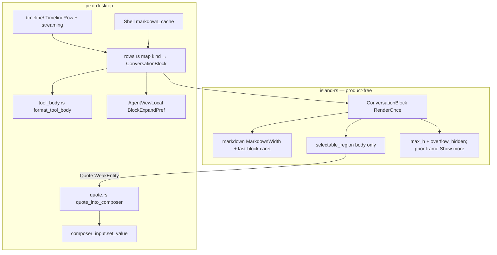

# D-62: Timeline conversation blocks (island primitive + piko mapping)

> Status: accepted
> Author: piko design loop
> Date: 2026-08-23
> Implements: F-45 (conversation block system; PRD lands with this design)
> Amends: [F-44](docs/features/F-44-conversation-canvas-presentation.md), [D-61](docs/design/D-61-conversation-canvas-presentation.md)
> Decisions: [ADR-022](docs/decisions/ADR-022-desktop-client-reintroduction.md)
> Island: `docs/design/material.md`, `context-menu.md`, `markdown-renderer.md` (`/Users/biu/Projects/island-rs`)

Scratch source of truth for this loop. When it lands in the repo, copy as `docs/design/D-62-timeline-conversation-blocks.md` and add Feature PRD `docs/features/F-45-timeline-conversation-blocks.md`. F-45 **amends F-44 Timeline row presentation** (user hug+max, user overflow collapse, thinking/tool independent collapsible cards, selectable bodies, Quote). It does **not** reopen Composer shape, scroll-edge fade, model/thinking menus, tab clustering, or follow-tail rules. Unlisted F-42 / F-43 / F-44 rules stand.

Numbering: next feature after F-44 is **F-45**; next design after D-61 is **D-62**. Do **not** reuse D-45 (local installer, F-33). Desktop already broke F-n↔D-n at F-44→D-61 because D-44 is session bookkeeping; F-45→D-62 continues that pair.

---

## Overview

F-44 / D-61 restyled the desktop Timeline as a Tahoe content layer (reading column 880, trailing user chip, assistant document, secondary thinking, inset tool card). The row *chrome* is still wrong for a conversation:

1. User bubbles use a **fixed** `w(relative(0.72))` in `packages/desktop/src/shell/rows.rs`, so a one-word “hello” paints as a wide empty bar. D-61 already specified `min(content, 0.72 × column)` — the implementation never hugged.
2. Long user messages never collapse. Thinking is a left-border Meta paragraph, not a block; it is always expanded and is raw text, not markdown. Tools dump a 160-char JSON stub into the card. None of thinking/tool have streaming typewriter or a real collapsed shell.
3. Nothing is selectable. Island already has `selectable_region`, `SelectionState`, `render_selectable_markdown`, and `ContextMenuSpec`; piko-desktop does not call them.

This design (1) adds a product-free island primitive `ConversationBlock` that owns alignment, max-width hug, surface, collapse policy, streaming caret, selectable **body**, and app-supplied context-menu items; (2) maps each `TimelineRow` onto that primitive in piko-desktop; (3) wires Copy (selection or whole block) and Quote (assistant + user) into the existing Composer draft. No hostd / orchd / protocol change. Timeline mapping stays in a `timeline/` module with presentation-only fields (`streaming`, full tool args/result).

---

## Background & Motivation

### Current state (post D-61)

| Surface | File | What it does today | Pain |
|---|---|---|---|
| User row | `packages/desktop/src/shell/rows.rs` | `.w(relative(0.72)).max_w(px(user_bubble_max_width(reading)))` + Elevated chip + `render_markdown` | Fixed 72% width. Short messages look like a toolbar. D-61 table said hug; code did not. `render_row` never receives column width, so a px cap of `0.72 × 880` inside a 400 px column is **100% of the column**. |
| Assistant | `rows.rs` | Bare `render_markdown(text)` filling the reading column | No selection, no Quote, no streaming caret. Width is correct (fill column). |
| Thinking | `rows.rs` + `timeline.rs` | Left `border_l_2` + `TextRole::Meta` raw string. `draft_rows` / `assistant_rows` already split thinking vs text | Not an independent card. Always open. Not markdown. Streaming is just “the string got longer” with no caret and no default-collapse. |
| Tool | `rows.rs` + `timeline.rs` | Inset Content card; name + `detail` truncated to `ARGS_PREVIEW_LIMIT = 160`. `running` / `failed` recolor the name; **Cancelled is painted as failed** | JSON wall in the body/header. Result is **dropped** (`ToolItem.result` / `result_content` exist in client-core). No collapse. No live `partial_json` layout. |
| System | `rows.rs` | Centered Meta caption | Fine; keep. Not collapsible. Still needs Copy. |
| Selection | island `components/selection/region.rs` | `selectable_region` copies **selection only**; empty or click-outside-highlight → `ContextMenuSpec::default()`; host no-ops empty specs (`is_empty` = no selectable action) | Desktop never mounts it. No Copy-block fallback. No Quote item. I-beam + left-drag on the whole region. |
| Markdown | island `components/markdown/render/{mod,blocks}.rs` | Root **and** paragraphs, headings, quotes, lists, code fences, tables, thematic breaks all `.w_full()` | Omitting root `w_full` is not enough. Hug shrinks text/list/code; ThematicBreak and table chrome **keep** `w_full`. |
| Collapse / drafts | `agent_view.rs` | Per-tab `AgentViewLocal` (follow, composer error, pending submit) | No per-block expand map. |
| ToolCall mapping | `timeline.rs` `message_rows` | `Message::ToolCall` → `tool_row` | Dead path: `AgentTimeline::apply_committed_checked` turns `Message::ToolCall` into `TimelineItem::Tool` (`packages/client-core/src/timeline/impls.rs`). Live mapping is `map_item` → `TimelineItem::Tool` only. |
| File size | `timeline.rs` 425 lines; `view.rs` 384; `mod.rs` 415 | PR 3 cannot add fields + tests in `timeline.rs` without crossing 500. |

### Why now

F-44 closed canvas chrome (fade, Composer radius, pickers). The remaining screenshot complaint is the **conversation itself**: user chip geometry, thinking/tool as first-class blocks, streaming, and “I cannot copy/quote this.” D-61 explicitly deferred “tool-output expansion, selectable markdown upgrades.” F-45 takes that slice.

### Constraints that do not move

- `hostd` is authoritative. Quote is a **desktop Composer** string insert, not a host intent.
- Two columns. Composer-in-Timeline. Reading column 880. `row_gap_before` and scroll-edge fade stay.
- ADR-022: if a second GPUI app could use it without piko domain IDs, it lives in island-rs.
- Island `MaterialRole` is still Sidebar/Chrome only. User chip stays Elevated opaque, not glass. No in-window blur.
- GPUI has `max_h` + `overflow_hidden` (Composer already uses both). There is **no** CSS `line-clamp`. Collapse clip is `max_h` + `overflow_hidden` on the body; Show more uses **prior-frame clip height**, not a same-frame unconstrained relayout.
- File size ~300–400 lines per `.rs`, hard ceiling 500.
- Collapse expand state is session-local, in-memory, lost on restart (like drafts).
- Typewriter must not lag the host stream.

---

## Goals & Non-Goals

### Goals

- User bubble **hugs** content up to **72% of the current reading-column width** and wraps; long bodies **clip** to a 105 px body cap with a Show-more affordance.
- Assistant stays a left-aligned reading-column document: wrap, **no collapse**, selectable, Quote + Copy.
- Thinking and tool are independent collapsible cards in the same reading column (not a left-border paragraph / JSON stub).
- Thinking body is markdown; default collapsed; streaming shows a live typewriter (growing draft + caret on the **visible** body) and respects a manual collapse (header pulse while collapsed).
- Tool header is name + status only; body is pretty JSON or key rows; running is live; failed is danger.
- Every block: right-click Copy (selection if click is in the highlight, else full plaintext). Assistant and user also Quote into the Composer.
- One island `ConversationBlock` primitive; piko only maps `TimelineRow`.
- Keep F-44 metrics: reading width 880, `row_gap_before`, Composer fade. Piko paint code reads `metrics()`; literals appear only in tests that assert `metrics()` values.

### Non-goals

- hostd, orchd, protocol, or `piko-client-core` reducer changes.
- In-window Liquid Glass blur; glass message bubbles.
- Command palette, submenu-of-tools, or tool *diff* views.
- Interpolated character-delay typewriter.
- Persisting expand/collapse across process restart.
- Changing Composer shape, model/thinking menus, tab clustering, follow-tail.
- Syntax highlighting inside fenced JSON (plain monospace is enough).
- Windows / Linux desktop.
- TUI timeline restyle.
- Same-frame unconstrained-measure-then-relayout custom `Element` (GPUI `request_layout` does not support it; island `SelectableText` only forwards layout).

---

## Key Decisions

### 1. User width: hug content, max 72% of the **current column**

**Decision:** User bubble width is `min(content, 0.72 × current_column)`. The parent is the F-44 reading column (`.w_full().max_w(metrics().reading_width)`). Runtime max is **`max_w(relative(0.72))` on that parent**, not a hardcoded `px(633.6)`.

D-61 already wrote `min(content, 0.72 * column)`. `rows.rs` implemented `.w(relative(0.72))` (definite width) **and** `.max_w(px(user_bubble_max_width(reading_width)))`. A 400 px column with only `max_w(633.6)` is a 100% bar.

**Runtime (piko):**

```text
reading column (already w_full, max_w(reading_width)):
  row:    w_full, flex, justify_end
  bubble: ConversationBlock width Hug { max: relative(0.72) }
          → w_auto, max_w(relative(0.72)), flex_col, items_start
          px(space_sm) py(space_sm) rounded(radius_md)
          fill(Elevated) hairline(Elevated)
  body:   MarkdownWidth::Hug  (text/list/code: no w_full; hr/table chrome: keep w_full)
```

`633.6` and `288` are **test identities** of the pure helper, not paint inputs:

```rust
// canvas.rs — tests / docs only; paint uses relative(0.72)
pub fn user_bubble_max_width(column: f32) -> f32 {
    column * 0.72
}
// user_bubble_max_width(880) == 633.6
// user_bubble_max_width(400) == 288
```

Rename `user_bubble_is_seventy_two_percent` → `user_bubble_max_is_seventy_two_percent_of_column`. Add the 400 px case. Do not pass `metrics().reading_width` into the helper at paint time.

**Hug markdown (honest):** island `render/blocks.rs` sets `.w_full()` on paragraphs, headings, quotes, lists, code, tables, and breaks. Taffy percent-width children of a `w_auto` parent take the parent’s definite containing width (`max_w` of the chip) → short “hello” stays a 72% bar. **PR 1 must thread `MarkdownWidth` through block containers**, not only the document root — with the Hug exceptions below.

Hug recipe — **do not blindly strip every `w_full`**. Zero-min-content chrome (`ThematicBreak` is an empty `h(1)` div; table root/rows are grid chrome) collapses to 0 px under `w_auto` unless another sibling already sized the parent.

| Node | Hug | Why |
|---|---|---|
| Document root, Paragraph, Heading, List, list-item body, BlockQuote body, CodeBlock | `w_auto` + `min_w_0` + `max_w(relative(1.0))` | Shrink to glyphs; wrap at chip max |
| ThematicBreak | keep `w_full` | Empty 1 px hairline; `w_auto` width is 0, so `---` vanishes |
| Table root and each table row | keep `w_full` | Grid chrome must span hug-max; `w_auto` collapses columns |

Fill path stays today’s `w_full` + `min_w_0` on every container.

Gallery: a one-word Hug document inside `max_w(relative(0.72))` is **narrower** than that max. A Hug `---` still spans the chip (not 0 px).

### 2. User max-height: 105 px body cap (~5 line-heights), clip + Show more

**Decision:** `CollapsePolicy::IfOverflow { max_height }` on user only. Assistant never collapses.

This is a **height cap**, not five wrapped source lines. Markdown root `gap(space_md)` is 12 px, so 105 px is often fewer than five text lines. Tests assert `USER_BODY_MAX_HEIGHT == 5.0 * f32::from(metrics().body_line_height)`, not “five lines of source.”

```text
USER_BODY_MAX_HEIGHT    = 5 * body_line_height     // 5 * 21 = 105  (body only)
user_chip_padding_y     = space_sm×2               // 16
show_more_row           = label_line_height + space_xs  // 18+4 = 22, sibling *below* the clip
clip fade               = space_md (12), inside the clip box
```

**One overflow recipe (no two-pass relayout):**

Taffy `MaxSize` caps used height; it does **not** stretch short content when there is no `min_h`. Composer uses `.min_h` + `.max_h`; the user **body** uses **only** `.max_h(USER_BODY_MAX_HEIGHT).overflow_hidden()` when `expanded == false`. Short “hello” stays ~one line + padding.

| Frame | Clip | Show more |
|---|---|---|
| 0, `expanded == false` | always `max_h(105)` + `overflow_hidden` | hidden (no prior measure) |
| N≥1, `clip_h >= max_h` | same clip | visible |
| `expanded == true` | no max_h | “Show less” if we ever recorded overflow for this id |

Overflow flag is **prior-frame element state** on the clip wrapper (`window.with_element_state` / a tiny `Entity<OverflowFlag>` owned by the block’s `notify_owner`). In prepaint:

```text
overflowing = clip_h >= max_h
```

`clip_h` is already capped by `max_h`, so **do not** add a +1 px fudge (`clip_h + 1 >= max_h` would show Show more at 104). Keep no unconstrained child measure. Flip → `cx.notify(owner)`. This does **not** unconstrained-layout then relayout in one `request_layout` (island `SelectableText` only forwards layout; GPUI has no measure-then-relayout pass).

Exact-105 px content may show a useless Show more (expands a hair). Acceptable. `clip_h == 104` → hide.

**Clip fade:** `ScrollEdgeFade::bottom(space_md).on_surface(SurfaceRole::Elevated)` for user chips (chip fill is Elevated; Content RGB would seam). For inset cards if ever clipped: `on_surface(Content)`. No `.occlude()`, no children, no hover — same as D-61 Timeline fade. Fade is **inside** the clip box, not over the Show more sibling.

Prefix = whatever the clip reveals (real layout). Markdown may cut mid-block.

Piko passes `expanded = user_pref_open(pref)` (`true` only when the user chose Expanded). Island clips when IfOverflow && !expanded. Short messages: clip is a no-op (intrinsic height < 105); no button after measure.

### 3. Assistant: fill reading column, no collapse, selectable, Quote

**Decision:** Assistant is a document in the reading column (`w_full` of the 880-capped parent), leading, no card, no max-height clip. Body is selectable markdown. Right-click: Copy + Quote. Quote applies to **user and assistant**; not thinking/tool/system.

“Same max length as user” means both wrap at a max and do not grow the window. Assistant is **not** 72%. Streaming assistant: **caret only**, `CollapsePolicy::Never` (auto-expand is N/A).

### 4. Thinking: independent card, markdown, default collapsed, live-then-collapse

**Decision:** Thinking is a `ConversationBlock` with `CollapsePolicy::StartCollapsed`, `BlockSurface::InsetCard`, leading, fill parent. Not a left-border paragraph.

- **Header** (always mounted): `disclosure` + `"Thinking"` + pulse **only when `streaming && !expanded`**. Height = `compact_bar_height` (28). `px(space_sm)` `py(space_xs)`. `island::theme::disclosure(expanded, muted_fg)`. Header is **not** inside `selectable_region`. Primary click toggles (`on_toggle`). `on_mouse_down` **`stop_propagation`** so the I-beam body and `view.rs` Timeline focus handler do not start a drag.
- **Body:** mounted only when `expanded`. Selectable markdown. Caret only when body is mounted and `streaming`.
- **Default:** `Untouched` → collapsed when not streaming (`card_body_open`).
- **Streaming:** `streaming == true` iff the row came from `TimelineItem::RealtimeDraft`. `Untouched` → auto-expand (body + caret). User collapse is sticky (`Collapsed` wins every later token). On commit (same id `{message_id}-thinking`, `streaming` false): collapse if still `Untouched`; stay open if `Expanded`; stay shut if `Collapsed`. Commit collapse of an Untouched thinking block is a **jump**; that is the UX.
- Header secondary-click: Copy plaintext (body may be omitted). See Decision 10.

### 5. Streaming flag mapping (desktop-only)

**Decision:** Add `streaming: bool` on `TimelineRow::{Thinking, Assistant, Tool}`. Not protocol. Not client-core.

| Source | Mapping |
|---|---|
| `TimelineItem::RealtimeDraft` → thinking/text | `streaming: true` |
| `TimelineItem::Committed` assistant/thinking | `streaming: false` |
| `TimelineItem::Tool` | `streaming: status == ToolStatus::Running` |

**Delete** the `Message::ToolCall` arm in `message_rows`. `apply_committed_checked` never puts `Message::ToolCall` on the timeline as `TimelineItem::Committed`; it becomes `TimelineItem::Tool`. Do not keep a second truncated `tool_row` path.

`draft_rows` already shares ids with `assistant_rows` (`{message_id}-thinking` / `{message_id}-text`) — expand prefs survive commit. Keep that identity test.

Assistant streaming: caret on the visible body; never collapse.

### 6. Typewriter = live draft + caret on the visible body, no delay

**Decision:** Each frame renders the current accumulated source (RealtimeDraft segments / `partial_json`). **Do not** interpolate character delay.

**Caret glyph:** `streaming_caret()` in `conversation/streaming.rs` paints `▍` (`TextRole::Body`, accent). Optional 1.2 s opacity pulse via `with_animation`; static caret is acceptable if animation fights layout. `ConversationBlock.streaming` still only drives the **header pulse**; it does **not** append a second caret after the body (API unchanged).

**When the caret paints:** `streaming && body_mounted`. StartCollapsed + `expanded == false` **omits** the body → **no caret**. Header shows the 6 px pulse/dot instead.

**Markdown caret** (`MarkdownRenderOptions.caret`, used for assistant, thinking, tool `PrettyJson`): do **not** wrap the whole last top-level node in a `flex_row` (that breaks List/Table/BlockQuote). Recurse to a leaf:

| Last node | Caret attach |
|---|---|
| Paragraph, Heading, CodeBlock | Wrap that leaf’s inline/code in `flex_row` + `items_end` + `streaming_caret()` |
| List, BlockQuote | Recurse into the **last nested block** and apply this table |
| Table, ThematicBreak | Do **not** wrap the node. Append `streaming_caret()` as an extra **column sibling after** the last block (document `flex_col`, not a row beside the table) |
| Empty document | Caret only |

**Non-markdown tool bodies** (`Plain`, `KeyRows`): `caret: false` on markdown. Piko wraps the last `SelectableText` in the same `flex_row` + `items_end` + `streaming_caret()`. Empty `Plain("")` (Running + no partial) is caret only. Running invalid `partial_json` is live Plain + caret at the end of that run. No double caret.

**Parse cache owner: `Shell`.** `rows.rs` is a pure-ish mapper and must not hold a HashMap across frames. Island `ConversationBlock` is `RenderOnce` (stateless). Island markdown PRD already requires the **app** to cache parsed snapshots.

```rust
// Shell
markdown_cache: HashMap<String, (String, MarkdownDocument)>, // row id → (source, doc)
```

On paint: if `cache.get(id).source != source`, `parse_markdown(source)` and store. Prune ids not in the current Ready set. Thinking/assistant/tool-pretty-json all go through this cache. Unrelated Timeline repaints (follow-tail, composer footprint) must not re-parse.

### 7. Tool: header = name + status; body = structured; same collapsible shell

**Decision:** Independent `ConversationBlock`, `StartCollapsed`, `InsetCard`. Auto-expand while Running if Untouched (same `card_body_open`). **Failed** auto-expands when `Untouched`. **Cancelled** is Done-like (collapsed, `muted_fg`) — **not** failed. Today `failed: matches!(Failed | Cancelled)` is wrong.

**Header (no JSON):**

```text
[chevron]  {tool_name}                    {status} [pulse if streaming && !expanded]
           Label, fg or accent            Meta
```

| `ToolStatus` | Label | Accent |
|---|---|---|
| Running | `Running` | `RoleAccent::Info` + 6 px pulse when body omitted |
| Completed | `Done` | `muted_fg` |
| Failed | `Failed` | `RoleAccent::Danger` (name + status) |
| Cancelled | `Cancelled` | `muted_fg` |

Card hairline stays Chrome. No danger fill on the card.

**`TimelineRow::Tool` (frozen):**

```rust
Tool {
    id: String,
    name: String,
    args: serde_json::Value,
    result: Option<serde_json::Value>,
    result_text: String, // TUI-style flatten of result_content; empty if none
    partial_json: Option<String>,
    status: ToolStatus,  // not running/failed bools
    streaming: bool,     // status == Running
}
```

Map **only** `TimelineItem::Tool`. Flatten `result_content` like TUI `protocol_blocks_to_text`. Delete `ARGS_PREVIEW_LIMIT` / `truncate_summary` from presentation.

**`format_tool_body` match table** (`packages/desktop/src/shell/tool_body.rs`):

| Condition | Kind |
|---|---|
| `status == Running` && `partial_json` is `Some` and parses as JSON object or array | `PrettyJson(pretty)` |
| `status == Running` && `partial_json` is `Some` but not valid JSON | `Plain(partial)` (live typewriter of the raw chunk) |
| `status == Running` && `partial_json` is `None` | `Plain("")` — empty live body, **not** a flash of completed Arguments | 
| otherwise Arguments | `object_or_pretty(args)` |
| otherwise Result if `result` is `Some` | `object_or_pretty(result)` after Arguments |
| otherwise Result if `result_text` non-empty | `Plain(result_text)` after Arguments |

`object_or_pretty`:

- JSON **object** with `keys ≤ 12` **and** every value’s pretty form `chars ≤ 80` → `KeyRows(Vec<(String, String)>)`.
- JSON **array**, string, number, bool, null, or oversized object → **always** `PrettyJson` (`json` fence). Never “wrapped plain” for arrays.

**KeyRows copy plaintext:** `"{key}: {value}\n"` joined (no trailing requirement beyond a final newline if non-empty). Piko renders KeyRows as a `flex_col` of Label+Body rows **inside** `selectable_region` using `SelectableText` per value (or one concatenated `SelectableText`). Menu plaintext is this joined string (plus Arguments/Result headings if both sections exist: `"Arguments\n{rows}\nResult\n{rows}"`).

PrettyJson goes through island markdown (Fill) + parse cache with `caret: true` while `streaming`. Plain/KeyRows use the non-markdown caret wrap above (`caret: false`).

### 8. Expand state: two helpers; `expanded` always means “body fully visible”

**Decision:** `HashMap<String, BlockExpandPref>` on `AgentViewLocal`. Lost on restart. Survives tab switches.

```rust
#[derive(Clone, Copy, PartialEq, Eq)]
pub enum BlockExpandPref {
    Untouched,
    Expanded,
    Collapsed,
}

/// User chip (IfOverflow). Island still clips when this is false.
pub fn user_pref_open(pref: BlockExpandPref) -> bool {
    pref == BlockExpandPref::Expanded
}

/// Thinking/tool cards (StartCollapsed).
pub fn card_body_open(pref: BlockExpandPref, streaming: bool, failed: bool) -> bool {
    match pref {
        BlockExpandPref::Expanded => true,
        BlockExpandPref::Collapsed => false,
        BlockExpandPref::Untouched => streaming || failed,
    }
}
```

**Island `expanded` is one meaning:** the body is fully visible (no clip, body mounted).

| Policy | `expanded == true` | `expanded == false` | Who sets `expanded` |
|---|---|---|---|
| `Never` | ignored; always full body | n/a | piko passes `true` |
| `IfOverflow` | no `max_h`; Show less if we overflowed | body **shown**, `max_h` + clip; Show more after prior-frame overflow | `user_pref_open` |
| `StartCollapsed` | body mounted | body **omitted** | `card_body_open` |

Header click / Show more / Show less fire `on_toggle`. Piko flips Expanded ↔ Collapsed (from Untouched, toggle to Expanded if currently closed, Collapsed if currently open). Streaming tokens must not reset a Collapsed pref.

Do **not** use a single `is_body_expanded(..., overflowing)` helper.

### 9. Quote format (Composer insert, no host intent)

**Decision:** Quote on **assistant and user**. Insert markdown blockquote into the current Composer draft. Pattern matches picker menus: `WeakEntity<Shell>` + `|window, app|`.

**Line split:** do **not** use `str::lines()` (it drops a trailing empty line). Use `split('\n')`, which keeps a trailing empty field when the source ends with `\n`.

```rust
pub fn quote_markdown(selection: &str) -> String {
    let lines: Vec<&str> = if selection.is_empty() {
        vec![""]
    } else {
        selection.split('\n').collect()
    };
    let mut out = String::new();
    for (i, line) in lines.iter().enumerate() {
        if i > 0 {
            out.push('\n');
        }
        if line.is_empty() {
            out.push('>');
        } else {
            out.push_str("> ");
            out.push_str(line);
        }
    }
    out.push_str("\n\n");
    out
}

pub fn insert_quote(draft: &str, selection: &str) -> String {
    let q = quote_markdown(selection);
    if draft.trim().is_empty() {
        q
    } else if draft.ends_with("\n\n") {
        format!("{draft}{q}")
    } else if draft.ends_with('\n') {
        format!("{draft}\n{q}")
    } else {
        format!("{draft}\n\n{q}")
    }
}
```

`quote_markdown("hello\nworld") == "> hello\n> world\n\n"`.
`quote_markdown("hello\n") == "> hello\n>\n\n"`.

**`Shell::quote_into_composer` lives in `quote.rs`** (same `impl Shell` pattern as `submit.rs`), **not** `mod.rs`:

```rust
impl Shell {
    pub(super) fn quote_into_composer(
        &mut self,
        selection: String,
        window: &mut Window,
        cx: &mut Context<Self>,
    ) {
        let current = self.composer_input.read(cx).value().to_string();
        let next = insert_quote(&current, &selection);
        self.composer_input.update(cx, |input, cx| {
            input.set_value(next.clone(), window, cx);
        });
        self.drafts.insert(self.draft_key.clone(), next);
        self.set_focus_owner(FocusOwner::Composer, window, cx);
        cx.notify();
    }
}
```

`TextareaState::set_value` already used in `reconcile_draft_target`. It emits `InputEvent::Change`, which **clears `composer_error`** in the existing composer subscription. Quote **does** clear the error banner (same as typing). Do not add a bypass.

No `ClientIntent`. No submit. Capture the quote **string at menu-open** (see Decision 10 table); the callback must not re-read selection later (the menu click would clear it).

### 10. Selection on the body; chrome is not I-beam; menu source table

**Decision:** Extend `selectable_region`; do not fork a piko menu. **`selectable_region` wraps the body only** — never the header, chevron, or Show more.

Today `selectable_region` (`region.rs`) sets `CursorStyle::IBeam` and starts a drag on left `mouse_down`. Header disclosure and Show more need primary-click. Nested `context_menu` remains forbidden.

**Click routing:**

| Surface | Primary | Secondary | Cursor |
|---|---|---|---|
| Body (mounted) | selection drag (`selectable_region`) | Copy/Quote menu | I-beam |
| Header / chevron | `stop_propagation` + `on_toggle` | Copy (+ Quote if user/assistant) using **plaintext**; no drag | default |
| Show more / less | `stop_propagation` + `on_toggle` | none (or same Copy plaintext) | default |

Collapsed thinking/tool: body omitted, so Copy is **header secondary-click** with `selected = None`, `plaintext = full block`. ConversationBlock attaches `ContextMenuExt` on the **header** with the same item builder as the body (Copy plaintext, no Quote for thinking/tool). Body `selectable_region` is the only I-beam host.

**Cmd-C:** `CopySelection` is bound on `IslandSelectionRegion` (body). Copies selection, else plaintext, else no-op. Header click does **not** focus the selection region (`stop_propagation`); Cmd-C then follows Timeline/Composer focus — do not steal Composer. After a body click, region `focus_handle` owns Cmd-C.

**`copy()` in island:** `selected_text()` if some, else `plaintext` if some, else no-op. Today it no-ops when selection is empty — that must change when `.plaintext` is set.

**Menu-open source (body secondary-click):**

| Click | `selected_text()` | `selection_contains(position)` | Copy / Quote text |
|---|---|---|---|
| Inside highlight | Some | true | **selection** |
| Outside highlight (range exists elsewhere) | Some | false | **plaintext** (block) |
| No range | None | false | **plaintext** |

Do not keep today’s `if selected.is_none() \|\| !contains { empty spec }`. Always offer Copy when plaintext or selection exists. `click_in_selection` is how the builder picks the string; extra_items (Quote) use that **same** string, captured in the `ContextMenuItem` closure at open time.

**`extra_items` signature** (must include `Window` for `set_value`):

```rust
pub struct SelectableMenuContext {
    pub selected: Option<String>,
    pub click_in_selection: bool,
    pub menu_text: String, // selection if in-highlight, else plaintext
}

extra_items: Rc<dyn Fn(&SelectableMenuContext, &mut Window, &mut App) -> Vec<ContextMenuItem>>
```

Piko Quote item (user/assistant only), same pattern as `workspace.rs` pickers:

```rust
let entity = cx.entity().downgrade();
let text = ctx.menu_text.clone();
ContextMenuItem::action("Quote", move |window, app| {
    if let Some(shell) = entity.upgrade() {
        shell.update(app, |shell, cx| {
            shell.quote_into_composer(text.clone(), window, cx);
        });
    }
})
```

Items: (1) Copy, (2) extra (Quote). Never a menu of only disabled items (`ContextMenuSpec::is_empty` unchanged). Empty spec still no-ops in the host.

Keep the current 6-arg `selectable_region(...) -> AnyElement` as a thin wrapper around `SelectableRegion::new(...).into_any_element()`.

### 11. Island vs piko split (ADR-022)

**Island owns** `ConversationBlock`: alignment, **hug-to-content as the default width** (Fill is `.fill()`), optional leading icon, surface, collapse policy + `max_h` clip, `streaming_caret()` glyph + markdown last-leaf attach, body selectable wrapper, header/footer chrome slots, disclosure. Also `MarkdownWidth` (Hug default; hr/table exceptions) and selectable-region plaintext + extra items. Product rows must not wrap the primitive in a private `flex_1` / `fill_row` to fake hug or fill.

**Piko owns:** `TimelineRow` mapping, labels, Quote insert, `format_tool_body`, `BlockExpandPref` + `user_pref_open` / `card_body_open`, `SelectionState` map, `markdown_cache` on `Shell`, reading-column composition.

---

## Proposed Design

### Timeline composition (unchanged rhythm, new block chrome)

Keep F-44: centered `max_w(reading_width)` column, `px/py(space_lg)`, `pb(composer_footprint)`, `row_gap_before`, Soft bottom fade.

```text
reading column (w_full, max 880)
├─ User          trailing ElevatedChip, default Hug max relative(0.72), IfOverflow 105
├─ Thinking      leading InsetCard, .fill(), StartCollapsed, header 28, leading Brain
├─ Assistant     leading ElevatedChip, default Hug max relative(0.72), Never, Bot icon, caret if streaming
├─ Tool          leading InsetCard, .fill(), StartCollapsed, name+status, leading Wrench
└─ System        centered None, Hug max relative(1.0), Never
```

Same-turn cluster (thinking ↔ assistant ↔ tool) still `space_xs`. User ↔ assistant still `space_md`. System still `space_sm`.



### Sequence: Quote

```mermaid
sequenceDiagram
  actor User
  participant Body as selectable_region (body)
  participant Menu as island ContextMenu
  participant Shell as WeakEntity Shell
  participant Composer as composer_input
  User->>Body: drag-select; secondary click in highlight
  Body->>Menu: Copy + Quote (menu_text = selection)
  User->>Menu: Quote
  Menu->>Shell: quote_into_composer(text, window, cx)
  Shell->>Composer: set_value(insert_quote(draft, text))
  Note over Shell: Change handler may clear composer_error; no ClientIntent
```

### Sequence: thinking stream

```mermaid
sequenceDiagram
  participant Host as hostd stream
  participant Core as client-core RealtimeDraft
  participant Map as draft_rows
  participant Pref as BlockExpandPref
  participant Block as ConversationBlock
  Host->>Core: thinking deltas
  Core->>Map: Thinking streaming=true
  Pref->>Block: Untouched → expanded=true, caret on last markdown block
  User->>Block: header click (stop_propagation)
  Block->>Pref: Collapsed
  Host->>Core: more tokens
  Note over Block: body omitted; header pulse; no caret
  Host->>Core: commit Assistant
  Map->>Block: streaming=false same id
  Note over Pref: still Collapsed; stays shut
```

If the user never toggles: commit with `Untouched` → `card_body_open` false → jump to collapsed header. Intended.

### Island primitive: `ConversationBlock` (frozen API)

New module `crates/island/src/components/conversation/`. **`impl RenderOnce`** — `selectable_region` needs `&mut App` for `begin_frame` / `focus_handle` (`IslandPanel` and `TextField` already use `RenderOnce`).

```rust
pub enum BlockAlign { Leading, Trailing, Center }

pub enum BlockWidth {
    /// `w_full` of the parent. Opt in via `.fill()` (thinking/tool cards).
    Fill,
    /// Default: `flex_shrink_0` + `max_w(max)`. `max` defaults to `relative(0.72)`.
    Hug { max: gpui::Length },
}

pub enum BlockSurface {
    None,
    ElevatedChip, // fill(Elevated), hairline(Elevated), radius_md, pad space_sm
    InsetCard,    // fill(Content), hairline(Chrome), radius_sm, pad space_sm
}

/// Copy + comparable. Header is a separate builder, not an AnyElement in the enum.
pub enum CollapsePolicy {
    Never,
    IfOverflow { max_height: Pixels },
    StartCollapsed,
}

pub struct ConversationBlock { /* private fields */ }

impl ConversationBlock {
    pub fn new(id: impl Into<ElementId>) -> Self;

    pub fn align(self, BlockAlign) -> Self;
    pub fn width(self, BlockWidth) -> Self; // default Hug { max: relative(0.72) }
    pub fn fill(self) -> Self;              // BlockWidth::Fill
    pub fn hug_max(self, impl Into<Length>) -> Self;
    pub fn leading_icon(self, IslandIcon, impl Into<Hsla>) -> Self;
    pub fn surface(self, BlockSurface) -> Self;
    pub fn material(self, WindowMaterialHost) -> Self;
    pub fn collapse(self, CollapsePolicy) -> Self;

    /// Body fully visible. See Key Decision 8 table.
    pub fn expanded(self, bool) -> Self;
    pub fn streaming(self, bool) -> Self;

    pub fn on_toggle(self, impl Fn(&mut Window, &mut App) + 'static) -> Self;

    /// Header chrome for StartCollapsed (ignored for Never / IfOverflow).
    pub fn header(self, impl IntoElement) -> Self;

    pub fn show_more_label(self, impl Into<SharedString>) -> Self; // default "Show more"
    pub fn show_less_label(self, impl Into<SharedString>) -> Self; // default "Show less"

    pub fn selection(self, Entity<SelectionState>) -> Self;
    pub fn plaintext(self, impl Into<SharedString>) -> Self;
    pub fn copy_label(self, impl Into<SharedString>) -> Self; // default "Copy"
    pub fn extra_menu(
        self,
        impl Fn(&SelectableMenuContext, &mut Window, &mut App) -> Vec<ContextMenuItem> + 'static,
    ) -> Self;
    pub fn notify_owner(self, EntityId) -> Self;

    pub fn body(self, impl IntoElement) -> Self;
}

impl RenderOnce for ConversationBlock {
    fn render(self, window: &mut Window, cx: &mut App) -> impl IntoElement;
}
```

**Collapse ownership table**

| Policy | Who computes `expanded` | Who clips | Header | Footer | `on_toggle` |
|---|---|---|---|---|---|
| Never | piko passes `true` | nobody | none | none | unused |
| IfOverflow | piko `user_pref_open` | island: `max_h+overflow_hidden` when `!expanded` | none | island Show more/less from prior-frame clip height | footer |
| StartCollapsed | piko `card_body_open` | n/a (omit vs mount) | app `.header()`, island click + `stop_propagation` | none | header |

**Render tree**

```text
outer: w_full, flex, justify_end|start|center
  shell: width + surface + material
    header?   // StartCollapsed only; NOT in selectable_region
              // secondary-click: Copy plaintext (+ extra_menu)
              // if streaming && !expanded: pulse on header
    body_slot:
      StartCollapsed && !expanded → omit
      else:
        IfOverflow && !expanded →
          relative clip: max_h + overflow_hidden
            selectable_region(body)     // I-beam
            caret is last markdown leaf / Plain wrap if streaming (not a body sibling)
            ScrollEdgeFade bottom 12, on_surface(shell), no occlude
        else → selectable_region(body) [+ last-leaf / Plain caret if streaming]
    footer?   // IfOverflow: Show more if !expanded && overflow_flag
              //             Show less if expanded && overflow_flag
              // stop_propagation; default cursor
```

Island default strings (“Show more”, “Copy”) are kit defaults; piko may override. Pulse uses existing `CircleDashed` + `with_animation` (see `progress.rs`) or a 6×6 `rounded_full` opacity pulse.

### Markdown width and caret

`crates/island/src/components/markdown/render/mod.rs` + **`blocks.rs`** + `table.rs`:

```rust
pub enum MarkdownWidth { Hug /* default */, Fill }

pub struct MarkdownRenderOptions {
    pub width: MarkdownWidth,
    pub caret: bool,
}

pub fn render_markdown(document: &MarkdownDocument) -> AnyElement;
pub fn render_selectable_markdown(
    id: impl Into<SharedString>,
    document: &MarkdownDocument,
    selection: Entity<SelectionState>,
) -> AnyElement;
pub fn render_markdown_with(
    id: impl Into<SharedString>,
    document: &MarkdownDocument,
    selection: Option<Entity<SelectionState>>,
    options: MarkdownRenderOptions,
) -> AnyElement;
```

Existing two entry points stay Fill, `caret: false`. `render_blocks(..., width, caret_on_last)` threads the Hug table (shrink text/lists/code; **keep `w_full` on ThematicBreak and table chrome**). If `caret`, attach via the last-leaf table in Key Decision 6 — recurse List/BlockQuote; wrap only Paragraph/Heading/CodeBlock; Table/ThematicBreak get a following column sibling, never a row around the grid.

### Numeric metrics (from `island::theme::metrics()`, compact)

Piko/island paint uses `metrics()` fields, not literals. Tests may assert the compact values.

| Token | compact px | Use |
|---|---|---|
| `reading_width` | 880 | Column cap |
| user max-width | `relative(0.72)` of **current** column | 0.72×880=633.6 only at full column; 0.72×400=288 when narrow |
| `body_line_height` | 21 | `USER_BODY_MAX_HEIGHT = 5 ×` this (105) |
| `space_sm` | 8 | Chip / card padding |
| `space_xs` | 4 | Header py; cluster gap |
| `radius_md` / `island_radius` | 12 | User chip |
| `radius_sm` | 8 | Thinking/tool card |
| `compact_bar_height` | 28 | Thinking/tool header |
| `label_line_height` | 18 | Tool name, Show more |
| `meta_line_height` | 16 | Status, system |
| `tool_disclosure_width` | 16 | Chevron rail |
| Show more row | 22 | 18+4 |
| Clip fade | 12 | `space_md` Soft ScrollEdgeFade |
| Pulse dot | 6 | Header when streaming && !expanded |
| Overflow predicate | `clip_h >= max_h` | Show more; 104 hide, 105 show |

### Piko mapping table

| `TimelineRow` | Align | Width | Surface | Collapse | `expanded` | Body | Menu |
|---|---|---|---|---|---|---|---|
| User | Trailing | default Hug `relative(0.72)` | ElevatedChip | IfOverflow 105 | `user_pref_open` | selectable md (Hug default) | Copy, Quote |
| Assistant | Leading | default Hug `relative(0.72)` + Bot icon | ElevatedChip | Never | `true` | selectable md (Hug default) + caret if streaming | Copy, Quote |
| Thinking | Leading | `.fill()` + Brain icon | InsetCard | StartCollapsed | `card_body_open(pref, streaming, false)` | selectable md Fill | Copy |
| Tool | Leading | `.fill()` + Wrench icon | InsetCard | StartCollapsed | `card_body_open(pref, streaming, status==Failed)` | KeyRows or md fence | Copy |
| System | Center | Hug `relative(1.0)` | None | Never | `true` | Meta label | Copy |

### Selection entities and parse cache

`Shell` holds:

```rust
selection_group: SelectionGroup,
selections: HashMap<String, Entity<SelectionState>>,
markdown_cache: HashMap<String, (String, MarkdownDocument)>,
```

`selection_entity(id, cx)` creates `SelectionState::new(id, group, cx)` if missing. Prune both maps against the current Ready ids each Ready paint. One `SelectionGroup` so dragging in B clears A.

`render_row` takes `&mut App` / `EntityId` notify owner, expand pref, `WeakEntity<Shell>` for Quote, material, cached `&MarkdownDocument`.

### Composer insert

See Decision 9. Pure helpers + `impl Shell` in `quote.rs`.

---

## API / Interface Changes

### Island: `ConversationBlock` (new)

API in Proposed Design. Export `pub mod conversation`. Gallery: (1) short trailing hug chip narrower than 72%, (2) long clipped chip + Show more, (3) StartCollapsed card with header pulse when collapsed+streaming and caret when expanded+streaming, (4) Fill document. No piko types.

Island PRD `docs/features/conversation-block.md` + design `docs/design/conversation-block.md` **ship in PR 2** (kit is product-free, still PRD-first).

### Island: markdown width + caret

`MarkdownWidth` in `blocks.rs` / `table.rs`: Hug shrinks text/list/code; ThematicBreak and table chrome keep `w_full`. `MarkdownRenderOptions.caret` uses the last-**leaf** table (recurse lists/quotes; column sibling after table/`hr`). Plain/KeyRows use `streaming_caret()` in piko, not this flag.

### Island: selectable region

6-arg function remains `-> AnyElement` wrapper. Builder: `.plaintext`, `.extra_items`. `copy()`: selection else plaintext else no-op. Tests: empty selection + plaintext → Copy; extra_items after Copy; no plaintext and no extra and no selection → empty spec.

### Piko: `TimelineRow`

`streaming` on Thinking / Assistant / Tool. Tool uses `ToolStatus` + full args/result. Drop `Message::ToolCall` mapping. No protocol DTO change.

### Piko: `AgentViewLocal`

```rust
pub block_expand: HashMap<String, BlockExpandPref>,
```

### Piko: no new `ClientIntent`

Quote is local `set_value`. Copy uses `cx.write_to_clipboard`.

---

## Data Model Changes

None in session journal / readmodels / protocol.

Client-local only:

| State | Where | Lifetime |
|---|---|---|
| `BlockExpandPref` | `AgentViewLocal` | process; per session:agent |
| `Entity<SelectionState>` | `Shell.selections` | process |
| `markdown_cache` | `Shell` | process |
| Composer draft after Quote | existing `drafts` + `TextareaState` | existing |

No migration. Restart → thinking collapsed, user long messages clipped again.

---

## Package impact

| Package | Change |
|---|---|
| `island-rs` (`island` crate) | `ConversationBlock`, Hug markdown in `blocks.rs`, last-block caret, selectable-region plaintext + extra items, gallery + island PRD |
| `piko-desktop` | `timeline/` split, row mapping, streaming flags, tool body, quote insert, expand map, selection entities, parse cache |
| `piko-protocol` | None |
| `piko-hostd` | None |
| `piko-orchd` | None |
| `piko-llmd` | None |
| `piko-sandbox` | None |
| `piko-client-core` | None (`ToolItem` / `RealtimeDraft` already expose the fields) |

---

## File-level plan

### Island (`/Users/biu/Projects/island-rs`)

| File | Change |
|---|---|
| `components/conversation/mod.rs` | **New.** Re-exports. |
| `components/conversation/block.rs` | **New.** Builder + `RenderOnce` compose. Budget **≤350**. Surface paint in `surface.rs`; menu attach in `menu.rs`. |
| `components/conversation/surface.rs` | **New.** ElevatedChip / InsetCard chrome. |
| `components/conversation/menu.rs` | **New.** Body `selectable_region` + header secondary-click spec. |
| `components/conversation/collapse.rs` | **New.** `CollapsePolicy`, footer Show more, prior-frame overflow **flag** (element state). **No** unconstrained relayout. |
| `components/conversation/streaming.rs` | **New.** Header pulse + `streaming_caret()` glyph. Markdown last-**leaf** wrap and piko Plain/KeyRows both call this helper. |
| `components/mod.rs` | `pub mod conversation;` |
| `components/markdown/render/mod.rs` | `MarkdownWidth`, `MarkdownRenderOptions`, `render_markdown_with`. |
| `components/markdown/render/blocks.rs` | Hug **text/list/code** (`w_auto`); keep `w_full` on ThematicBreak. Last-**leaf** caret (recurse lists/quotes). |
| `components/markdown/render/table.rs` | Hug: table root and rows **keep `w_full`** (do not `w_auto`). |
| `components/selection/region.rs` | Builder; `copy()` fallback to plaintext. |
| `examples/gallery/scenes/` | Conversation-block fixture. Stay under 500. |
| `docs/features/conversation-block.md` + `docs/design/conversation-block.md` | **Required in PR 2.** |

Do **not** add `overflow.rs` two-pass `Element`.

### Piko (`/Users/biu/Projects/piko`)

| File | Change |
|---|---|
| `packages/desktop/src/shell/timeline/mod.rs` | **Split from `timeline.rs` in PR 3a before adding fields.** Types + `timeline_state` + `map_item`. |
| `packages/desktop/src/shell/timeline/map.rs` | `draft_rows`, `assistant_rows`, `tool_from_item` (`TimelineItem::Tool` only). |
| `packages/desktop/src/shell/timeline/tests.rs` | Existing tests + streaming + tool passthrough. |
| `packages/desktop/src/shell/canvas.rs` | `user_bubble_max_width(column) = column * 0.72`; `USER_BODY_MAX_HEIGHT` from `metrics()`; `hug_width`; retitle tests; **400 px case**. |
| `packages/desktop/src/shell/rows.rs` | Map kinds → `ConversationBlock`. If it exceeds ~400, split `rows/mod.rs` + `rows/map.rs`. |
| `packages/desktop/src/shell/quote.rs` | **New.** `quote_markdown`, `insert_quote`, `Shell::quote_into_composer`. |
| `packages/desktop/src/shell/tool_body.rs` | **New.** `format_tool_body` match table. |
| `packages/desktop/src/shell/agent_view.rs` | `block_expand`; `user_pref_open` / `card_body_open` (or `canvas.rs` if that keeps agent_view small). |
| `packages/desktop/src/shell/mod.rs` | `mod quote; mod tool_body;`; `selections`, `selection_group`, `markdown_cache`. Do **not** put `quote_into_composer` here. |
| `packages/desktop/src/shell/view.rs` | Pass expand/selection/cache/quote `WeakEntity` into `render_row`. Stay under 500; if not, move region helpers into `canvas.rs`. |
| `docs/features/F-45-timeline-conversation-blocks.md` | PRD **acceptance table lands with PR 3**, not only PR 5. |
| `docs/design/D-62-timeline-conversation-blocks.md` | This document (PR 5 can still copy the full scratch). |
| `docs/features/README.md`, `docs/design/README.md` | Index; note F-45→D-62 (do not reuse D-45). Patch F-44 row table. |

---

## Tests

Visual acceptance is a **user screenshot**, not a GPUI golden. Automate pure helpers.

### Island

- Hug gallery/layout: one-word Hug document inside `max_w(relative(0.72))` is narrower than that max. Hug `---` (ThematicBreak) is **not** 0 px wide.
- Hug blocks: paragraphs/headings/code/lists use `w_auto`; ThematicBreak and table chrome stay `w_full`.
- Overflow **button** heuristic: `overflowing = clip_h >= max_h`. `104` vs `105` → hide; `105` vs `105` → show. No `+ 1`. No unconstrained relayout test.
- Caret: last leaf Paragraph/Heading/CodeBlock is a `flex_row`; last Table/ThematicBreak is followed by a column-sibling caret; List/BlockQuote recurse. Empty Plain tool body still paints a caret when streaming.
- Selectable region: selection some → Copy copies selection; none + plaintext → Copy copies plaintext; `copy()` else no-op; extra_items after Copy; no plaintext and no extra and no selection → empty spec, no menu.
- `CollapsePolicy::Never` never paints a footer.

### Piko unit

- `user_bubble_max_width(880) == 633.6`; `user_bubble_max_width(400) == 288`. Paint does not call this with `reading_width` when the column is narrower.
- `hug_width(40, 288) == 40`; `hug_width(800, 288) == 288`.
- `USER_BODY_MAX_HEIGHT == 5.0 * f32::from(metrics().body_line_height)` (105). Not “five lines of markdown source.”
- `user_pref_open`: Expanded true; Untouched/Collapsed false.
- `card_body_open`: Untouched+streaming true; Collapsed+streaming false; Untouched+!streaming false; Untouched+failed true; Expanded always true.
- `draft_rows` thinking/assistant `streaming == true`; committed `false`; same ids.
- Tool: Running → `streaming`; Failed not streaming; Cancelled **not** failed; `args` not truncated; `result` / `result_text` present; `Message::ToolCall` is **not** mapped from `message_rows`.
- `quote_markdown("a\nb") == "> a\n> b\n\n"`; `quote_markdown("a\n") == "> a\n>\n\n"`; empty line → `">"`.
- `insert_quote("", "hi") == "> hi\n\n"`; `insert_quote("draft", "hi") == "draft\n\n> hi\n\n"`; `insert_quote("draft\n\n", "hi") == "draft\n\n> hi\n\n"`.
- `format_tool_body`: small object → KeyRows; 13 keys → PrettyJson; arrays → PrettyJson; running + no partial → empty Plain; running + invalid partial → Plain; completed with result section.

### Out of scope for CI

- Caret blink look.
- First-frame missing Show more (clip still on).
- Screenshot of hug vs 72% bar (manual).

---

## Alternatives Considered

### 1. Fixed 72% width vs max-width hug

**Fixed `w(relative(0.72))`** (today): simple, stable column, Messages-unlike. Short text looks like a form field. **Rejected.**

**Hug + `max_w(relative(0.72))` of the current column** (chosen). Requires Hug **through** `blocks.rs`, not only the document root. Hug is the ConversationBlock default; thinking/tool cards call `.fill()`.

**Assistant also 72% hug:** chosen after F-45 visual review (chip + bot icon, not a full-width document). F-44 “assistant is a document” is amended.

**Hardcoded `px(633.6)` max:** rejected; a 400 px column would become a 100% bar.

### 2. Line-clamp vs `max_h` vs same-frame measure-relayout

**Line-clamp / character prefix:** GPUI has no `-webkit-line-clamp`. **Rejected.**

**Same-frame unconstrained `request_layout` then relayout** (`OverflowClip`): island custom `Element`s only forward layout; GPUI has no measure-then-relayout. **Rejected.**

**`max_h` + `overflow_hidden` when collapsed, prior-frame clip height for Show more** (chosen). Short content does not stretch (no `min_h`). Honest about the first-frame missing button.

### 3. Tool as submenu vs independent block

**Submenu / overlay inspector:** hides running state; Island menus are not inspectors. **Rejected.**

**Independent collapsible block** (chosen).

### 4. Delay typewriter vs live draft

**Per-character delay:** lags the host. **Rejected.**

**Live accumulated source + last-block caret** (chosen). Collapsed+streaming: header pulse, no caret.

### 5. Header + last-N lines while streaming vs auto-expand

**Last lines in the header:** fights markdown. **Rejected.**

**Auto-expand while Untouched** (chosen); sticky Collapsed; commit jump if Untouched.

### 6. Piko-private block vs island primitive

**Private widgets:** ADR-022 violation. **Rejected.**

**Island `ConversationBlock`** (chosen).

---

## Security & Privacy Considerations

- Quote and Copy operate on **already-visible** Timeline text. No extra host fetch.
- Clipboard writes go through GPUI `write_to_clipboard`.
- Tool args/results may contain secrets; we **stop truncating** in the UI. Collapse is not a security boundary. Do not log plaintext in `tracing`.
- Markdown renderer still does not execute HTML or load remote images.
- Quote does not send a turn until the user submits.

---

## Observability

No new metrics. Do not add tracing per token.

Failure UX: Quote insert cannot fail except a missing textarea entity (shell invariant). Copy failure is a silent OS clipboard miss. `set_value` may clear `composer_error` via `InputEvent::Change`.

### Scroll performance contract

Per-paint timeline cost tracks the viewport, not conversation length. The
virtualized list resolves a `FrameTimeline` once per Shell render: one
allocation-light pass over the selected agent's items builds cumulative row
offsets (`timeline/frame.rs`) plus the tail-streaming flag; list item
callbacks map payloads on demand for their own backing item only
(`rows_around`). Tool bodies memoize formatted sections keyed by exact inputs
(`ToolBodyMemo`), so scrolling and streaming unrelated blocks do not
re-pretty-print JSON. Markdown parsing stays cached by `(id, source)` as in
PR 3a.

Rejected: materializing all `TimelineRow`s per frame (O(N) payload clones —
the original scroll jank), and rebuilding rows inside item callbacks
(O(visible × N)). If row counts ever need host-side virtualization windows,
this offsets index is the seam.

---

## Rollout Plan

No feature flag. macOS desktop only. Island first so piko does not grow a private clip/hug/menu fork.

Rollback: revert the piko mapping PR independently; unused `ConversationBlock` is gallery-only. Reverting island after piko lands requires a paired revert.

### Risk register

| Risk | Severity | Mitigation |
|---|---|---|
| Inner `w_full` markdown stretches hug parent | **High** | Thread Hug through `blocks.rs` + `table.rs`; gallery one-word chip |
| Same-frame overflow relayout infeasible | Medium | Do not do it; `max_h` clip + prior-frame Show more |
| Header I-beam fights disclosure | **High** | `selectable_region` on **body only**; header `stop_propagation` |
| Auto-expand fights user collapse | **High** | `Collapsed` wins; auto only when Untouched |
| Typewriter delay lag | High if chosen | Not chosen |
| `timeline.rs` / `block.rs` / `view.rs` exceed 500 | **High** | Split `timeline/` in PR 3a **first**; split conversation/{surface,menu,collapse} |
| Tool result dump is huge | Medium | Collapse by default; pretty JSON in body |
| Selection HashMap / parse cache leak | Low | Prune ids not in current Ready rows |
| First-frame IfOverflow without Show more | Low | Clip on from frame 0 |
| Quote resets textarea undo / clears error | Low | Same as `set_value` elsewhere; accept Change handler |
| Narrow column 100% bar | **High** | `max_w(relative(0.72))` of current column, never `px(633.6)` at paint |

---

## Open Questions

None that block implementation. Product questions are decided in Key Decisions:

| Question | Decision |
|---|---|
| User width | Hug + `max_w(relative(0.72))` of **current** reading column |
| User max-height | 105 px body cap (~5 line-heights), not line-clamp |
| Overflow | `max_h` + `overflow_hidden`; prior-frame Show more; no two-pass Element |
| Assistant width | Fill reading column, no collapse, caret if streaming |
| Thinking default | Collapsed; markdown; InsetCard |
| Streaming thinking | Auto-expand if Untouched; caret only if body mounted; header pulse if collapsed; collapse on commit if Untouched |
| Typewriter | Live draft + last-**leaf** caret (lists recurse; table/`hr` = column sibling); tool Plain/KeyRows wrap last `SelectableText`; no delay |
| Parse cache | `Shell.markdown_cache` keyed by row id |
| Selection | Body only; header/Show more `stop_propagation` |
| Tool body | Frozen match table; arrays PrettyJson; Running+no partial empty; `ToolStatus`; no ToolCall arm |
| Quote | User + assistant; `split('\n')`; `WeakEntity<Shell>` + `set_value`; menu_text from source table |
| Copy | All blocks; in-highlight selection else plaintext |
| Island split | Frozen `ConversationBlock` builder; `impl RenderOnce` |
| Numbering | F-45 / D-62 (do not reuse D-45) |

Deferred (not blocking): persist expand prefs; JSON syntax highlighting; in-window blur; quoting thinking; TUI parity.

---

## Failure and cancellation

- Dismissing the context menu does not quote, copy, or submit.
- Collapsing a running tool does not cancel the tool (host `CancelTurn` stays the Composer Cancel button).
- If `partial_json` is malformed, show it as wrapped plain text, not an error banner.
- Running with no `partial_json` yet: empty body, not a flash of committed args.
- Session switch: `AgentViewLocal` swaps expand maps with the tab; no cross-talk.
- Host disconnect: streaming flags go false when drafts disappear; blocks that remain are committed mapping.

---

## References

- F-44 / D-61 — canvas presentation; user hug was specified and not implemented; selectable/tool expansion deferred.
- ADR-022 — island vs piko; no `[gui]` host settings.
- Island markdown PRD — parse accumulated streaming snapshots; apps cache; no product ids. Nested blocks are full width today (`render/blocks.rs`).
- Island context-menu PRD — secondary-click; not a command palette; empty spec opens nothing (`is_empty` = no selectable action).
- Island selection — `selectable_region`, `SelectionState.selected_text()`, `CopySelection` (cmd-c).
- Code: `packages/desktop/src/shell/{rows,timeline,canvas,view,composer,agent_view,workspace,mod}.rs`; `packages/client-core/src/timeline/{mod,impls}.rs` (`RealtimeDraft`, `ToolItem`, `ToolStatus`, ToolCall → `TimelineItem::Tool`); TUI `timeline_impl.rs` result_content flatten; `island` `components/{markdown/render,selection,menu,scroll_edge,chrome/controls/progress}`; `island` `theme/{metrics,icons}` (`disclosure`, `compact_bar_height`).
- Apple HIG — content layer vs controls; disclosure triangles; context menus on selected text.

---

## PR Plan

Ordered, independently reviewable PRs. Island primitives first so piko does not grow a private hug/clip/menu. Keep five PRs; split the risky piko mapping into 3a/3b. F-45 acceptance table ships with PR 3 (PRD-first), not only PR 5.

### PR 1 — island: markdown Hug width + selectable empty-copy / extra items

- **Title:** `island: markdown Hug width and selectable-region Copy-block`
- **Files / components:** `crates/island/src/components/markdown/render/mod.rs`, **`blocks.rs`**, `table.rs`, `crates/island/src/components/markdown/mod.rs`, `crates/island/src/components/selection/region.rs`, selection + markdown tests, gallery Hug chip
- **Dependencies:** none
- **Description:** Thread `MarkdownWidth::{Fill, Hug}` through block containers. Hug **text/list/code** = `w_auto` + `max_w(relative(1.0))`; Hug **ThematicBreak and table chrome keep `w_full`** (empty `---` must not collapse to 0). Fill stays `w_full`. Root-only Hug is not sufficient. Extend `selectable_region` with a builder (6-arg wrapper kept): `.plaintext`, `.extra_items(&SelectableMenuContext, &mut Window, &mut App)`. `copy()`: selection else plaintext else no-op. Empty spec still no-ops. Gallery asserts a one-word Hug document is narrower than its max and a Hug thematic break spans the chip.

### PR 2 — island: ConversationBlock primitive

- **Title:** `island: ConversationBlock (align, hug/fill, collapse, streaming caret)`
- **Files / components:** `crates/island/src/components/conversation/{mod,block,surface,menu,collapse,streaming}.rs`, `components/mod.rs`, markdown last-block caret in `render/blocks.rs`, gallery scene, **`docs/features/conversation-block.md` + `docs/design/conversation-block.md` (required)**
- **Dependencies:** PR 1
- **Description:** Frozen builder (`ConversationBlock::new` … `impl RenderOnce`). `BlockAlign`, `BlockWidth::{Fill, Hug { max: Length }}`, `BlockSurface`, `CollapsePolicy::{Never, IfOverflow, StartCollapsed}` (header is `.header()`, not an enum field). `expanded` always means body fully visible. IfOverflow: `max_h` + `overflow_hidden` when `!expanded`; Show more iff prior-frame `clip_h >= max_h` (104 hide, 105 show; no `+ 1`). **No** two-pass `OverflowClip`. Selectable **body only**; header/footer `stop_propagation`. `streaming_caret()` on last markdown **leaf** (recurse lists/quotes; column sibling after table/`hr`); header pulse when streaming && !expanded. Fade inside clip, `on_surface` matching the shell. Split files under 500. Gallery: short hug, long clip, collapsed+pulse, expanded+caret.

### PR 3a — piko: split timeline + streaming flags + tool body (no new chrome)

- **Title:** `desktop: split timeline mapping; streaming flags and structured tools`
- **Files / components:** `packages/desktop/src/shell/timeline/{mod,map,tests}.rs` (split **before** adding fields; current `timeline.rs` is 425 lines), `tool_body.rs`, `canvas.rs` helpers, `agent_view.rs` expand map + `user_pref_open` / `card_body_open`
- **Dependencies:** none (island-independent)
- **Description:** Move tests out. Add `streaming`; `Tool { status, args, result, result_text, partial_json }`; map only `TimelineItem::Tool`; delete `Message::ToolCall` arm and `ARGS_PREVIEW_LIMIT`. `format_tool_body` match table including Running+no partial. Unit tests for flags, Cancelled ≠ failed, quote-less helpers. **Land F-45 acceptance table** (behavior contract for 3b/4) in `docs/features/F-45-timeline-conversation-blocks.md`.

### PR 3b — piko: map rows to ConversationBlock

- **Title:** `desktop: hug user bubble and collapsible thinking/tool cards`
- **Files / components:** `rows.rs`, `view.rs`, `canvas.rs`, `mod.rs` (`markdown_cache`); consumes island PR 2
- **Dependencies:** PR 2, PR 3a
- **Description:** Replace `.w(relative(0.72))` with Hug `max_w(relative(0.72))` of the reading column. IfOverflow 105. Thinking/tool `StartCollapsed` InsetCard; `card_body_open` / `user_pref_open`. Parse cache on `Shell`. Keep F-44 column, `row_gap_before`, fade. No Quote yet (Copy-block can wait for PR 4 if selection is not mounted). Tests: 400 px column helper, 105 cap, expand matrix.

### PR 4 — piko: selection, Copy-block, Quote into Composer

- **Title:** `desktop: selectable timeline blocks with Copy and Quote`
- **Files / components:** `packages/desktop/src/shell/quote.rs` (`quote_markdown`, `insert_quote`, `quote_into_composer`), `rows.rs` extra_menu, `mod.rs` SelectionGroup + entity map (not quote logic)
- **Dependencies:** PR 3b
- **Description:** Body `selectable_region`; header secondary-click Copy when collapsed. Menu source table (in-highlight vs plaintext). Quote via `WeakEntity<Shell>` + `set_value` (picker pattern); `split('\n')` quote helper. Cmd-C fallback to plaintext. Tests for quote helpers including trailing newline.

### PR 5 — docs: D-62 + index; F-44 row-table patch

- **Title:** `docs: D-62 timeline conversation blocks`
- **Files / components:** `docs/design/D-62-timeline-conversation-blocks.md` (copy this scratch doc, including Package impact and Failure and cancellation), index rows in `docs/features/README.md` and `docs/design/README.md` (**F-45→D-62; do not reuse D-45**); patch **F-44** Timeline rows table (hug+max of current column, thinking/tool cards, selection) using the F-44-on-F-43 pattern. F-45 PRD already exists from PR 3a; PR 5 only fills remaining design + indexes if needed.
- **Dependencies:** PRs 3–4 (behavior to document)
- **Description:** Promote this scratch design to the PRD-first tree. No protocol/hostd rows. D-62 matches F-45.
