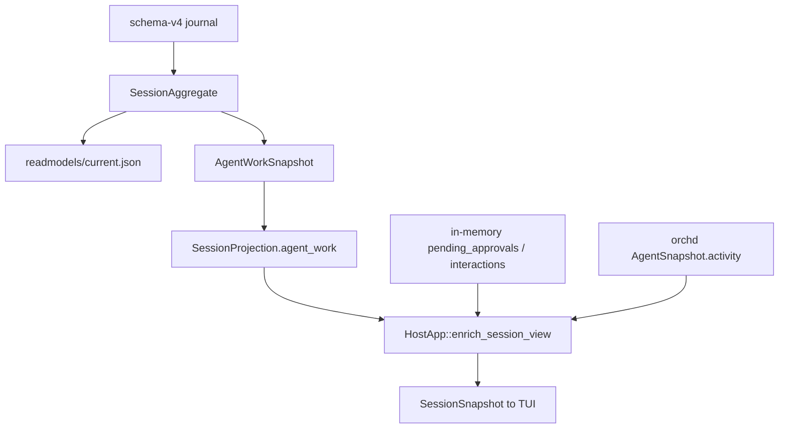

# D-68: AgentInput work model and control plane

> Status: implemented.
> The client command cutover, canonical AgentInput identity, durable
> queue/steer/pending-action/interrupt facts, root-keyed processing,
> published `AgentWorkSnapshot`, connected-client snapshot push, TUI
> snapshot-only foreground, named races R1–R9, crash inventory holes,
> projector properties, and hydrate/restart evidence are in the tree.
> Author: (implementation design; advance against workspace 2026-09-01)
> Date: 2026-09-01
> Implements: [F-51](../features/F-51-agent-control-plane.md)
> Decisions: [ADR-027](../decisions/ADR-027-agent-work-lifecycle.md), [ADR-025](../decisions/ADR-025-authoritative-agent-lifecycle.md), [ADR-015](../decisions/ADR-015-host-owned-session-journal.md)
> Verification: [V-64](../verification/V-64-agent-control-plane.md)

## Overview

Keep Session, AgentInstance, and ModelStep as the invariant grains. Put
AgentInput between Agent and ModelStep as the stimulus. When an input is
applied as root, that `input_id` is the identity of the current work. hostd
persists facts and publishes `AgentWorkSnapshot`; orchd serializes admission
and operates live work without making private actor state durable authority.

Turn, Run, and Execution are not product scopes. Their product types, IDs,
maps, commands, and projections have been removed; the host retains only an
internal observation registry keyed by `(session_id, input_id)`. Schema-v4
stays; this is not a journal-format rewrite. The only client in this design
is the TUI. `piko-desktop` is out of scope.

This revision reconciles D-68 with the 2026-09-01 workspace. Slices 1–6.5
and remaining-work PRs 1–5 are landed. F-51's dequeue display line is
last-admitted `input_id`, matching TUI code.

## Implementation progress

A slice is complete only when its behavior contract **and** the corresponding
verification evidence are both present. A green workspace alone does not
close a slice. Status below is from code, not from F-51 checkboxes.

| Area | State | Evidence / remaining work |
|---|---|---|
| Agent interrupt | Implemented | TUI Esc and `AgentWorkControl::interrupt_current` address Session + AgentInstance. Host commits `agent_interrupt_requested_v1` before orchd cancel. Idle interrupt is `accepted: false` with no snapshot. A successful interrupt commit pushes Cancelling (or RequiresAction if a pending action remains). |
| AgentInput facts and indexes | Implemented | Admission/disposition/processing/applied facts and deterministic root/pending indexes replay from schema-v4 (`READER_VERSION` 3). |
| Canonical admission | Implemented | Host follow-up, start, and steer pass the complete `AgentInput`; `input_id` and caller-idempotency `request_id` remain distinct. Runtime entry is `AgentRuntimeApi::submit_agent_input` / `submit_runtime_agent_input`. |
| Host control plane | Implemented with internal leftovers | Protocol dispatch enters `AgentWorkControl`. Turn-named host modules remain internal (see Internal leftover names); they are not alternate client commands. |
| TUI cutover | Implemented | Queue, composer routing, and last-in dequeue consume `AgentWorkSnapshot`. `ApprovalEvent` does not mutate activity; `agent_foreground` reads only the snapshot. Pre-session optimism is `pending_submit_*`. |
| Work projection | Implemented | Journal projector writes RequiresAction/Cancelling into `SessionAggregate.agent_work` / `current.json`. Hydrate is `StateSnapshot` / `SessionOpen`. Push is `SessionReconciled` on interrupt and pending-action request/resolve. Live overlays are prompt payloads and orchd activity only. |
| Immediate-start semantic commit | Implemented | `SessionStore::start_run` appends one revision: optional `agent_input_admitted_v1` or `agent_input_disposition_changed_v1`, `agent_input_processing_started_v1`, and `agent_input_applied_v1` (which materializes the user message). Retained prompt context is committed first with deterministic IDs. A failed start commit leaves no admitted root; retry reuses the prelude. |
| Execution boundary cleanup | Implemented | Actor-only start/steer/config/receipt DTOs live in `piko-orchd-api`; shared durable DTOs live in `piko-protocol::agent_work` and `piko-protocol::agent_instance::work`. The protocol Execution module, host Execution product map, and `cancel_agent_run` compatibility API are removed. Approval/Interaction ports use `root_input_id`. The root-keyed orchd Execution actor remains an internal implementation detail. |
| Recovery and concurrency evidence | Implemented | Named races R1–R9, crash inventory C4/C5/C6/C8/C10, projector `proptest`s, connected-client push tests, `StateSnapshot` hydrate of RequiresAction/Cancelling, and two-HostServer restart (unfinished root cancelled, queued follow-up cancellable by `input_id`, steer rejected). **Slice 6.5 is closed.** |

### Slice 6.5 versus F-51

F-51 and this design are implemented. V-64 records push vs hydrate, R1–R9,
the crash inventory, projector properties, and restart convergence. Dequeue
cancels last-admitted `input_id`, matching TUI code.

## Design constraints

- The schema-v4 append-only journal remains the sole durable authority.
- `session.json` remains immutable identity; current query paths read
  write-time projections (`readmodels/current.json` stores the
  `SessionAggregate`, not a second work log).
- hostd owns durable user-visible state; orchd owns live Agent execution.
- `piko-protocol` carries DTOs only and remains a shared leaf.
- One AgentInstance admits commands serially and has at most one active root
  AgentInput.
- A successful admission response follows its durable commit.
- Work identity is `root_input_id`. Do not keep `turn_id`, `run_id`, or
  `execution_id` as protocol or product handles. orchd may key an internal
  actor by `root_input_id`.
- Processing start/finish and interruption are facts on the root AgentInput,
  not an Execution aggregate. No multi-attempt product model.
- Old product types and compatibility paths stay deleted. No dual-write
  period and no unpublished shadow `AgentWorkSnapshot`.
- Desktop is out of scope. Protocol and host changes are not constrained by
  `piko-desktop` compiling against deleted commands.
- Realtime streams remain lossy and reconcilable from host read models.

## Key Decisions

| Decision | Rationale |
|---|---|
| Invariant grains are Session, AgentInstance, ModelStep; AgentInput is the stimulus and, when `applied_as_root`, the work identity. | ADR-027. A second Turn/Run/Execution ID recreates competing lifecycles. |
| `AgentWorkSnapshot` is the published per-AgentInstance contract, rebuilt on every aggregate apply into `SessionAggregate.agent_work` and copied into `SessionProjection.agent_work`. | Clients must not merge private lifecycle guesses. The snapshot is a derived query, not a mutable identity. |
| RequiresAction and Cancelling are durable derived states, not live-only overlays. | Facts `agent_pending_action_requested_v1` / `agent_pending_action_resolved_v1` / `agent_interrupt_requested_v1` already reduce into `pending_actions` and `interrupt_requested_roots`. `unfinished_work_state` and `AgentForeground::project_work` already compute them. |
| Live overlays are limited to prompt **payloads** (approval/interaction bodies) and orchd `AgentActivity`. They must not win over `AgentWorkSnapshot.foreground`. | Prompt questions/args are too large and ephemeral to journal; recovery already interrupts unfinished roots instead of re-prompting. |
| Process restart closes unfinished roots (`interrupt_incomplete_agent_work` on attach). RequiresAction/Cancelling are **same-process recoverable**, not interactive after crash. | Matches D-65 recovery: crash after an open model/tool window cannot safely resume the live prompt. Follow-ups survive; pending steers on the interrupted root are cancelled in the recovery commit. |
| Publication of `AgentWorkSnapshot` is part of the control-plane contract for **already-attached** stdio clients. Interrupt, pending-action request, and pending-action resolve push `SessionReconciled`. | Hydrate (`SessionOpen` / `StateSnapshot`) loads `current.json`. Submit, `cancel_input`, `publish_work_reconcile`, observation recovery, navigate, and compaction also send `SessionReconciled`. |
| After a successful `InterruptRequested` commit, durable Cancelling is authority even if orchd `accepted` is false. | `OrchAgentRunRunner::interrupt_agent` commits first, then returns orchd `receipt.accepted`. The client must reconcile from the snapshot, not from `accepted` alone. |
| Steer during RequiresAction or Cancelling is accepted and bound to that still-unfinished root. | `work_is_steerable` already includes those states. Terminal (`processing_finished`) rejects steer. Align TUI Enter with `active_work.is_some()`. |
| TUI optimism is bounded to in-flight command drafts, not queue/lifecycle truth. | Restart and a second TUI must converge from host read models. |
| Dequeue addresses the last-admitted pending follow-up of the viewed agent by `input_id`. There is no selected-row queue UI. | Cancelling by display position is forbidden; last-in is the product rule (`queued_inputs.last()` after admission-order sort). |
| orchd Execution actor and host Turn-named modules stay internal. Renames do not block F-51. | Product surfaces are already AgentInput/`agent_work`. Cosmetics after evidence. |
| Slice 6.5 is closed with V-64; F-51 dequeue is last-admitted `input_id`. | Closing PR records evidence and aligns the PRD with TUI last-in dequeue. |
| TUI only; no dual-write; schema-v4 only. | Unchanged from the original D-68 cutover. |

## Current-state decomposition (2026-09-01)

| Existing concept | Keep as | Required change |
|---|---|---|
| AgentInstance actor and snapshot | Primitive/runtime owner | Active work is the current root AgentInput (`AgentActor::run_state`) |
| Canonical `AgentInput` DTO | Keep | `packages/protocol/src/agent_instance/work.rs`; includes `detached_recipient_agent_instance_id` |
| host `TurnRecord` / `UserTurnView` / `turn_id` | Deleted as product | Internal modules live under `application/agent_work` and `adapters/agent_runner` |
| orchd `run_id` / `active_agent_runs` | Deleted | Live observation map is `active_agent_inputs: (session_id, input_id)` |
| Execution actor / `StoredExecution` / `execution_id` | Internal only | `ExecutionIdentity.root_input_id`; no product ID |
| `ModelStepCommittedV1` | Core primitive fact | Retain atomic relation; steer application precedes it |
| host `steer_queue` | Deleted | Durable `pending_steer` AgentInputs bound to the active root |
| TUI `follow_ups` / local queue overlay | Deleted | TUI reads `queued_inputs` / `pending_steers` from `AgentWorkSnapshot` |
| `ChatSubmit` / `QueueSteer` / `TurnCancel` | Deleted | `AgentInputSubmit`, `AgentInputCancel`, `AgentInterrupt` |
| orchd `send_agent_input` / `steer_agent` shims | Deleted from API | Tests may still wrap `submit_agent_input` |
| Agent activity / foreground | Split | `AgentWorkSnapshot.foreground` is product; `AgentActivity` is orchd live chrome |

Slice 1 added `AgentInterrupt` and already proves that control can address an
AgentInstance even when no host Turn exists. Later slices put admission and
projection on that same boundary.

## Canonical data model

### AgentInput

The protocol and host domain use one immutable admission DTO
(`packages/protocol/src/agent_instance/work.rs`):

```rust
AgentInput {
    input_id: AgentInputId,
    request_id: RequestId,
    session_id: SessionId,
    agent_instance_id: AgentInstanceId,
    origin: AgentInputOrigin,
    delivery: AgentInputDelivery,
    content: MessageContent,
    submitted_at: i64,
    caller_agent_instance_id: Option<AgentInstanceId>,
    detached_recipient_agent_instance_id: Option<AgentInstanceId>,
}
```

`input_id` is the durable control identity. `request_id` provides caller
idempotency. They are not the same concept. There is no `user_turn_id`.
Host user admission (`AgentWorkControl::validate_user_input`) requires
`origin == User` and both caller/detached recipient unset.

The stored input has one effective disposition:

```text
admitted
├── pending_follow_up ──→ applied_as_root
├── pending_steer ──────→ applied_to_step
├── applied_as_root
└── cancelled
```

A rejected admission writes no AgentInput. Duplicate `request_id` plus the
same normalized proposal returns its original receipt; conflicting reuse
returns an idempotency conflict (`AgentApiError::IdempotencyConflict` /
`CommitError::IdempotencyConflict`).

When disposition is `applied_as_root`, this input is the work identity. Every
later fact in that work carries `root_input_id = input_id`.

### Active work (derived, no extra ID)

Active work is the causal closure of one unfinished root AgentInput: steers,
ModelSteps, tools, pending actions, interruption, and outcome that share that
`root_input_id`. At most one root may be non-terminal per AgentInstance
(`SessionAggregate::active_root_by_agent`).

Status is derived. No generic status-changed event is appended solely for
display. Do not add `RunProjection`, `AgentRunRecord`, `UserTurnView`, or an
`executions: root → Vec<attempt>` aggregate.

A steer records the `root_input_id` captured at acceptance and the ModelStep
that later consumed it (`applied_to_step` + reserved `model_step_id`).

### ModelStep

The implemented `ModelStepCommittedV1` remains the durable atomic boundary for
assistant output and ordered tool declarations. Before issuing a model
request, orchd reserves its `ModelStepId` and commits each steer input's
application to that step. The later ModelStep commit uses the same ID.

No separate durable `model_step_started` fact is required. Live step progress
comes from realtime observation; after a crash, an applied root without a
terminal fact is closed by interruption recovery.

## Durable event model

Journal event types (schema-v4, `READER_VERSION` 3) that participate in work:

```text
agent_input_admitted_v1
agent_input_disposition_changed_v1
agent_input_applied_v1
agent_input_processing_started_v1
agent_input_processing_finished_v1
agent_pending_action_requested_v1
agent_pending_action_resolved_v1
agent_interrupt_requested_v1
message_committed
model_step_committed
agent lifecycle / inbox / compaction facts     existing feature authority
```

`execution_started` / `execution_finished` are not decodable. Processing
start/finish attach to the root AgentInput. `request_id` remains caller
idempotency; `root_input_id` is work identity.

Do not add:

- independent `turn_status_changed` / `run_status_changed` facts;
- an independently mutable queue record;
- generic foreground transitions;
- `AgentRunRecord`, `agent_runs`, `StoredExecution` as a product aggregate;
- `model_step_started` solely to persist transient streaming state;
- compatibility aliases for deleted submit/steer/cancel commands;
- `turn_id`, `run_id`, or `execution_id` fields on new or rewritten DTOs;
- a second copy of `AgentWorkSnapshot` outside the aggregate.

### Fact relationships and validation

Implemented in `packages/session-store/src/aggregate_work.rs` and
`aggregate.rs`:

- every input references an existing Session and AgentInstance;
- one request ID maps to one normalized immutable input proposal;
- `applied_as_root` makes the input its own `root_input_id`;
- `pending_steer` captures the exact active `root_input_id` at admission;
- `applied_to_step` references the captured root and a reserved next
  ModelStepId; a later committed step with that ID must agree;
- cancelled inputs have no application fact;
- only one root projects as non-terminal per AgentInstance;
- `agent_pending_action_requested_v1` requires an unfinished processing root
  on the same agent; conflicting payloads for the same `action_id` fail;
- `agent_interrupt_requested_v1` requires the same unfinished root; it is
  idempotent on the root id set;
- processing finish clears `pending_actions` for that root and removes the
  root from `interrupt_requested_roots`;
- terminal/interrupt facts for a root cannot imply conflicting derived
  outcomes;
- queue order is journal admission order (`admission_revision`, then
  `input_id`), not client wall-clock time.

### Semantic commit groups

Immediate start (`start_run` when the input is new) — **one revision**:

```text
agent_input_admitted_v1(initial = applied_as_root)
+ agent_input_processing_started_v1
+ agent_input_applied_v1   // materializes the initiating user message
```

Queue advancement (`start_run` when the input is `pending_follow_up`) —
**one revision**:

```text
agent_input_disposition_changed_v1(applied_as_root)
+ agent_input_processing_started_v1
+ agent_input_applied_v1
```

Follow-up while busy — **one revision**:

```text
agent_input_admitted_v1(initial = pending_follow_up)
```

Steer acceptance — **one revision**:

```text
agent_input_admitted_v1(initial = pending_steer, target_root_input_id)
```

Steer application at a deterministic boundary, before model request dispatch:

```text
steer message commit
+ agent_input_disposition_changed_v1(applied_to_step, target_root_input_id,
                                  reserved_step_id)
... model request and streaming ...
+ model_step_committed (reserved_step_id, assistant/tool declarations)
```

Interrupt intent — **one revision**, then live cancel:

```text
agent_interrupt_requested_v1(root_input_id)
```

Pending action request / resolve — **one revision each**:

```text
agent_pending_action_requested_v1(action_id, kind, summary)
agent_pending_action_resolved_v1(action_id)
```

Cancel pending follow-up — **one revision**:

```text
agent_input_disposition_changed_v1(cancelled)
```

Processing terminal — **one revision** (plus recovery extras when attach
interrupts):

```text
agent_input_processing_finished_v1(report)
```

If the process fails between steer application and the ModelStep commit,
replay sees an applied input and unfinished active work. Interruption
recovery closes that root; it never redelivers that input.

Reliable publication follows append success.

## Durable versus live overlay boundary

This is the remaining design gap that blocked Slice 6.5. It is now closed
as follows.



### Written into `readmodels/current.json`

`CurrentFile.aggregate` is the full `SessionAggregate`
(`packages/session-store/src/readmodels/current.rs`). After every successful
apply, `apply_in_place` sets `aggregate.agent_work = agent_work_snapshots()`.
Therefore the file already contains:

| Field | Source facts | Derived snapshot effect |
|---|---|---|
| `agent_inputs` | admitted / disposition / applied / processing | queue, steers, active root, Starting/Running |
| `pending_actions` | `agent_pending_action_requested_v1` until resolved or root finish | `pending_action`, `state = RequiresAction`, `foreground = RequiresAction` |
| `interrupt_requested_roots` | `agent_interrupt_requested_v1` until root finish | `state = Cancelling`; `foreground = Cancelling` unless a pending action still exists |
| `agent_work` | rebuilt map | the published contract |

`unfinished_work_state` (`aggregate_work_projection.rs`):

```text
interrupt_requested_roots.contains(root) → Cancelling
else any pending_action on that root     → RequiresAction
else work_model_step_count(root) > 0     → Running
else                                     → Starting
```

`AgentForeground::project_work` priority (already implemented):

```text
pending_action.is_some()                         → RequiresAction
else work.state == RequiresAction                → RequiresAction
else work.state == Cancelling                    → Cancelling
else Starting | Running                          → Running
else queued follow-ups                           → Queued
else                                             → Idle
```

Priority when both apply: **RequiresAction wins over Cancelling** while the
action row remains. Test
`pending_action_and_interrupt_replay_into_authoritative_work_snapshot`
already asserts this after reopen.

Do **not** add a parallel `AgentWorkSnapshot` blob beside the aggregate.
The query path (`load_projection` → `project_session`) clones the aggregate,
calls `rebuild_work_projection()` (indexes + snapshots), then copies
`agent_work_snapshots()`. Implementers must not skip rebuild and must not
persist a second work log.

### Allowed live overlays (lossy, same process only)

| Overlay | Owner | May influence | Must not influence |
|---|---|---|---|
| `SessionSnapshot.pending_approvals` / `pending_interactions` | `OrchAgentRunRunner` in-memory maps | Approval / tool-interaction **modal payload** (args, questions, prompt text) | `AgentWorkSnapshot.foreground`, queue, active root |
| `AgentInfo.activity` from orchd `AgentSnapshot` | AgentActor `publish_snapshot` | Optional runtime chrome (spinner glyph if host also has active work) | Composer routing, dequeue, interrupt targeting, queue counts |
| Realtime thought/token deltas | orchd event hub | Streaming presentation | Durable work state |
| Observation registry `active_agent_inputs` | host adapter | `wait_agent_input_started` / completion | Product IDs |

Live prompt maps are populated **after** the corresponding journal fact
succeeds (`approval_gateway.rs`, `interactions.rs`). If the fact fails, the
live prompt is not shown (approval declines; interaction cancels).

### Recoverability

Typical hostd is **one stdio TUI**. The existing
`two_clients_reconcile_the_same_authoritative_work_projection` test is two
`HostServer`s opening one journal (hydrate), not two connections to one live
process.

| Situation | Foreground source | Pending prompts | Queue / steers | Slice 6.5 |
|---|---|---|---|---|
| (a) New attach / `SessionOpen` / `StateSnapshot` | Journal via `enrich_session_view` | Live maps if this process still has them; empty on a new HostServer | Journal | Hydrate already true. PR-5 extends the two-HostServer test to RequiresAction/Cancelling. That does **not** prove push. |
| (b) Already-attached stdio client | Must receive a pushed `SessionReconciled` | Live Approval/Interaction events for modal payload | Journal, once a snapshot arrives | **PR-1 gap.** Originating TUI otherwise stays Running. |
| (c) hostd crash + attach | Recovery commits `processing_finished` (cancelled) for unfinished roots, cancels pending steers on those roots, writes abort markers. After recovery: Idle or Queued. | Lost; not re-prompted | Follow-ups survive; steers on the interrupted root do not | Existing recovery tests; PR-5 cross-process E2E. |
| Torn journal tail | Verified prefix only (`every_torn_commit_byte_boundary_recovers_the_verified_prefix`) | n/a | Prefix | Generic journal test covers all groups; no per-group byte sweep. |

### Publication rule

Wire type is **`ServerMessage::SessionReconciled` only**. Do not invent a
snapshot-bearing substitute. `AgentWorkDiff` is a **file-diff** event and is
not a work-snapshot channel.

Helpers: `HostApp::session_view` +
`sessions::helpers::session_reconciled_message`. Reuse
`AgentWorkControl::publish_work_snapshot` or
`HostApp::publish_work_reconcile` (the latter also reconciles committed
messages; interrupt/pending-action only need `session_view`). If
`observation.rs` would exceed the 500-line ceiling, extract the helper
**before** adding emit sites. Do **not** emit client snapshots from
`approval_gateway.rs` or `interactions.rs` (no `ClientEventSender`; they
only commit facts and `observation_router` `SessionEvent`s).

#### Must push now (connected-client gap — PR-1)

Exactly **one** `SessionReconciled` per successful interrupt or
pending-action fact on the live stdio stream. Duplicate snapshots for the
same fact are forbidden (not “at least one”). `run_jsonl_server` shares
one `event_tx` across in-flight commands; user respond already
`observation_router.publish(ApprovalResolved|InteractionResolved)`
(`turn_runner.rs`), so the submit observation loop sees the same event as
timeout expiry.

| Initiator | Layer | After successful fact | Messages the already-attached client must see |
|---|---|---|---|
| `Command::AgentInterrupt` | `AgentWorkControl::interrupt_current` | `InterruptRequested` | Existing `CommandResponse::AgentInterrupted` **plus** `SessionReconciled` whose `agent_work` is Cancelling (or RequiresAction if a pending action row remains). Pattern: same as `cancel_input`. |
| orchd-initiated approval/interaction **request** | `HostApp::project_operation_output` (`observation.rs`) after forwarding `ApprovalRequested` / `InteractionRequested` | `PendingActionRequested` already committed in the adapter | Existing Approval/Interaction event **plus** `SessionReconciled` with RequiresAction and `pending_action.action_id`. |
| Pending-action **resolve** (user `ApprovalRespond` / `UserInteractionRespond` **and** adapter timeout/expiry) | **Only** `project_operation_output` `ApprovalResolved` / `InteractionResolved` arms | `PendingActionResolved` (committed in `respond_*` or the timeout path before the `SessionEvent`) | Existing Resolved event **plus exactly one** `SessionReconciled` with `pending_action` cleared. Do **not** emit `SessionReconciled` from `apply_command.rs`. Isolated `handle_command` ApprovalRespond tests are not push proof; test resolve on the in-flight submit observation stream. |

`accepted` on `AgentInterrupted` is orchd live-cancel, not “did the fact
land.” If the interrupt fact committed, still push Cancelling even when
`accepted: false`. If the fact failed, no snapshot, `accepted: false`.

#### Already pushed (do not reimplement in PR-1)

- `cancel_input` → `SessionReconciled`
- user `submit` receipt (`publish_work_snapshot` / `submit.rs`) and
  post-observation `publish_work_reconcile` (covers user-origin
  `processing_finished` for roots on the host observation loop)
- `recover_operation_observation`
- `SessionOpen` / `SessionCreate`, navigate, compaction, `StateSnapshot`

#### Deferred (not required to mark F-51 implemented)

- Immediate push on steer `applied_to_step` (connected TUI may keep stale
  `pending_steers` until the next already-pushed reconcile).
- `processing_finished` for detached roots **not** on the host observation
  loop (next hydrate/`StateSnapshot` is enough).

`enrich_session_view` may continue to replace `agents` with the live orchd
list and to fill `pending_approvals` / `pending_interactions`. It must keep
assigning `snapshot.agent_work` from `projection.agent_work` and must not
recompute foreground from activity.

## Aggregate and projections

### Session aggregate and indexes

```text
agent_inputs: input_id → StoredAgentInput
model_steps: step_id → StoredModelStep
pending_actions: action_id → AgentPendingActionRequestedV1
interrupt_requested_roots: Set<root_input_id>

active_root_by_agent: agent_id → root_input_id     derived index
pending_inputs_by_agent: agent_id → ordered input_id[]  derived index
input_by_request: request_id → input_id             derived index
agent_work: agent_id → AgentWorkSnapshot            derived, persisted in current.json
```

Do not add `agent_runs`, `executions`, or `turns` maps. Trajectory and prompt
assembly rekey to `root_input_id`.

Indexes are rebuilt deterministically from event order
(`rebuild_agent_input_indexes`). They accelerate validation and projection;
maps and indexes are not separate authorities.

### Current read model

```rust
AgentWorkSnapshot {
    agent_instance_id: AgentInstanceId,
    lifecycle: AgentLifecycle,
    foreground: AgentForeground,
    active_work: Option<ActiveWorkSnapshot>,
    pending_steers: Vec<AgentInputSummary>,
    queued_inputs: Vec<AgentInputSummary>,
    pending_action: Option<PendingActionSummary>,
}

ActiveWorkSnapshot {
    root_input_id: AgentInputId,
    state: AgentWorkViewState, // Starting | Running | RequiresAction | Cancelling | …
    active_model_step_id: Option<ModelStepId>,
    started_at: i64,
}
```

`AgentInputSummary` exposes input ID, origin, preview, admission
revision/time, delivery, and disposition.

`pending_action` stores `{ action_id, kind, summary }` only — the latest
row on the active root if several exist. Full approval args and interaction
questions stay in the live overlay.

The TUI does not keep `active_turns`, `QueueEvent`, or `UserTurnView` as
control surfaces.

## Runtime admission boundary

`AgentRuntimeApi` (`packages/orchd-api/src/agent.rs`) accepts the canonical
proposal and returns a receipt:

```rust
submit_agent_input(input) -> AgentInputReceipt {
    input_id,
    disposition,
    queued_position: Option<u32>,
}

interrupt_agent(session_id, agent_instance_id) -> AgentInterruptReceipt
cancel_agent_input(session_id, agent_instance_id, input_id)
    -> AgentInputCancelReceipt
```

`send_agent_input`, `steer_agent`, `run_agent`, and request-id
`cancel_agent_input` stay removed. Receipts do not carry `run_id` or
`execution_id`.

The AgentActor is the serialization point
(`packages/orchd/src/runtime/agent/actor/`):

1. capture lifecycle and active root input;
2. evaluate delivery and capacity (follow-up cap 64 → `Overload`);
3. construct the complete durable transition proposal;
4. commit through the host-owned admission port;
5. mutate private actor state after acknowledgement;
6. return the receipt and publish a refreshed orchd snapshot.

For steer, the actor captures `target_root_input_id` and admits
`PendingSteer` before spawning `execution.steer_execution`. Delivery rejects
if that root is no longer active; it never substitutes the next root.
Follow-up advancement commits `applied_as_root` inside `start_run` before
model work launches.

This ordering makes host persistence part of admission. If the commit fails,
the runtime has not accepted the input (`failed_run_start_commit_rolls_back_execution_reservation`).

Internal execution remains `ExecutionActor` keyed by
`ExecutionIdentity { session_id, root_input_id, agent_instance_id, … }`.

## Host application control plane

One application use case behind protocol dispatch
(`packages/hostd/src/application/agent_work_control.rs`):

```rust
AgentWorkControl {
    submit(input),
    interrupt_current(session_id, agent_instance_id),
    cancel_input(session_id, agent_instance_id, input_id),
}
```

Wire replacement (already landed):

| Deleted surface | Canonical operation |
|---|---|
| `ChatSubmit` / `ChatSubmitMessage` | `AgentInputSubmit` with `FollowUp` delivery |
| `QueueSteer` / `QueueSteerMessage` | `AgentInputSubmit` with `Steer` delivery |
| queued `TurnCancel` | `cancel_input` on the pending AgentInput |
| running `TurnCancel` | `interrupt_current` on the AgentInstance |
| `AgentInterrupt` | keep; `interrupt_current` |
| `message_agent when=queue` | agent AgentInput with `FollowUp` |
| `message_agent when=steer` | agent AgentInput with `Steer` |
| `interrupt_agent` tool | runtime-local policy then the same interrupt operation |

Dispatch (`apply_command.rs`) already routes `AgentInputSubmit` /
`AgentInputCancel` / `AgentInterrupt` into `AgentWorkControl`. Follow-up and
start still run prompt/compaction through `application/turns/submit.rs` then
`AgentRunRunner::submit_agent_input`. That is internal layering, not a
second command family.

Steer gating (`agent_is_steerable` / `work_is_steerable`) may consult live
orchd activity, live prompts, **or** durable `AgentWorkSnapshot`. After
PR-1, the durable snapshot is sufficient. **Steer is allowed** while the
root is Starting, Running, RequiresAction, or Cancelling — bind to that
unfinished root. **Steer is rejected** only when there is no unfinished
root (`InvalidCommand` / runtime `InvalidState`). Keep `work_is_steerable`
aligned with that sentence (it already includes Cancelling/RequiresAction).

Interrupt (`OrchAgentRunRunner::interrupt_agent`): if orchd has no
`active_root_input_id` **before** commit, return `accepted: false` and write
no fact. If `InterruptRequested` commits, durable Cancelling is authority;
then call orchd cancel and surface `accepted` as live-cancel. Duplicate
interrupt while Cancelling: fact is idempotent; still push snapshot; `accepted`
is orchd's current cancel result (true while the actor is cancelling or
`Finalizing`, false once the root is gone).

## Client cutover (TUI only) and remaining authority

`piko-tui` consumes `AgentWorkSnapshot` from hostd. `piko-desktop` is not
updated by this design.

Landed:

- composer routing checks `active_work` / `foreground` instead of
  `active_turns` (`AppState::viewed_agent_is_busy` /
  `viewed_agent_is_running`);
- Enter steers any active root, including detached work, **only when**
  `active_work.is_some()` — orchd `AgentActivity::Running` alone does not
  steer (`detached_runtime_activity_does_not_masquerade_as_a_host_turn_for_steer`);
- Alt+Enter submits a follow-up and reconciles by input ID;
- Esc interrupts the viewed AgentInstance (`app/turn.rs::interrupt`);
- dequeue cancels the last-admitted queued `input_id` (`dequeue_follow_up`,
  `queue_tests.rs::dequeue_restores_preview_and_cancels_authoritative_input`);
- queue counts and previews come from `AgentWorkSnapshot`;
- `client-core` `agent_foreground` reads `work.foreground` only
  (`activity_does_not_replace_missing_work_snapshot`);
- `AgentForeground::from_activity` is unused by product clients.

### Delete (remaining TUI/client authority)

| Fallback | File | Replacement |
|---|---|---|
| Mutate `AgentEntry.activity` from `ApprovalEvent` | `packages/tui/src/app/event/lifecycle.rs` | Leave activity untouched; chrome uses `agent_foreground` from snapshot |
| `agent_foreground(..., _activity)` unused parameter | `packages/tui/src/app/impls.rs`, `render/mod.rs` | Drop the parameter; call sites pass only `agent_instance_id` |
| Treat missing snapshot as Idle while advertising activity | already Idle | Keep; add a test that activity never substitutes |
| `refresh_prompt_blocking` rewriting `AgentInfo.activity` as if it were foreground | `packages/client-core/src/foreground.rs` | May keep activity consistent for orchd chrome; must not be read by `agent_foreground` |

### Bounded optimistic contract (keep)

| Optimistic state | Lifetime | Reconcile |
|---|---|---|
| Composer emptied + `pending_submissions[command_id].draft` | From `AgentInputSubmit` send until `AgentInputSubmitted` or error | Success: drop draft. Error/reject: restore draft (`responses.rs` / `runtime.rs`). Never invent queue rows. |
| `pending_submit_content` / `pending_submit_draft` | From submit-before-session until `SessionCreate`/`SessionOpen` hydrates | Flush as `AgentInputSubmit` or restore on failure. Not a durable queue. Rename later; behavior stays. |
| Dequeue: restore last follow-up preview into composer, then `AgentInputCancel` | Until cancel receipt | `accepted: true`: snapshot removes the input. `accepted: false` / error: keep restored draft; next `AgentWorkSnapshot` is queue truth. Do not locally re-insert the input. |
| Approval/interaction `response_in_flight` | Until host Resolved event | Modal payload only |

Restart, agent switching, and a second TUI never depend on local queue
history. `apply_snapshot` replaces `session.agent_work` entirely.

### Dequeue semantics (implemented; F-51 still says “selected”)

There is no per-item queue selection in the TUI. Code already matches
last-in. The contract (pin in PR-2; correct F-51 in PR-5) is:

1. Target the viewed `agent_instance_id`.
2. Take `queued_inputs.last()` after host admission-order sort (highest
   `admission_revision`, then `input_id`).
3. Cancel that `input_id`. Never cancel by list index inferred locally.

If the snapshot is stale and the input already advanced, the receipt is
`accepted: false` (“no longer pending”). That is success of the race, not a
client retry loop.

## Races and recovery

AgentActor mailbox linearization is the race authority for admission/cancel/
interrupt **commands**. Host journal validation is durable authority.
Pending-action facts are committed on the host adapter path, not the actor
mailbox — R9 is a host/projector test.

Drive order with sequential `AgentRuntimeApi` calls. Do not require true
parallel mailbox injection unless a test cannot pin the winner sequentially.
R1 uses the blocking-tool fixture (`behavior/steer.rs`
`steered_message_is_answered_before_further_tool_work`). R2 / interrupt
tests may use `CannedResponse::waiting_for_cancel`.

Steer that is admitted then fails live delivery remains a `pending_steer` on
R. Live `steer_execution` acknowledgement is **not** part of the acceptance
contract (`actor/input.rs`).

### Race matrix (one named test per row)

API for R1–R8: `AgentRuntimeApi` (`submit_agent_input`, `cancel_agent_input`,
`interrupt_agent`) in `packages/orchd/tests/agent_runtime_cases/races.rs`.
Host `InvalidCommand` mapping is out of these tests. API for R9: host
journal commands + `agent_work_snapshot` (extend
`pending_action_and_interrupt_replay_into_authoritative_work_snapshot` if
needed).

| ID | Test function | Winner | How to pin | Durable facts | Receipt | Successor isolation |
|---|---|---|---|---|---|---|
| R1 | `steer_then_root_still_running_applies_to_next_step` | Steer | Copy the blocking-tool pin from `steered_message_is_answered_before_further_tool_work`: first model step declares a tool that stays in `execute` until released; admit steer while that tool is blocked; release the tool; **do not** interrupt. Do **not** use `waiting_for_cancel` here — it never returns, so the next model-request boundary (where `AppliedToStep` is committed) never runs. | `AgentInputAdmitted { PendingSteer, root=R }` then later `DispositionChanged { AppliedToStep, model_step_id }` | `AgentInputReceipt.disposition == PendingSteer` | Bound to R; never S |
| R2 | `steer_then_root_recovers_cancels_pending_steer` | Steer admit, then cancel unused | Admit steer during `waiting_for_cancel` (or equivalent), then interrupt/recovery **before** the next model boundary | PendingSteer on R; recovery `DispositionChanged { Cancelled }` for that steer | PendingSteer on admit | Unused steers cancelled with R; successor S has none of them |
| R3 | `steer_after_root_terminal_writes_no_input` | Terminal | Finish R, then `submit_agent_input` SteerActive | No AgentInput | `Err(InvalidState)` — not an `accepted: false` receipt | n/a |
| R4 | `follow_up_while_busy_is_pending` | Follow-up queued | FollowUp while R running | `Admitted { PendingFollowUp }` | `PendingFollowUp` | After R finishes, same `input_id` becomes a **new** root |
| R5 | `follow_up_while_idle_starts` | Immediate start | FollowUp on idle agent | start_run semantic commit | `AppliedAsRoot` | One input, one root |
| R6 | `cancel_before_advance` | Cancel | `cancel_agent_input` while still in `follow_ups` | `DispositionChanged { Cancelled }` | `accepted: true` | Never a root |
| R7 | `cancel_after_advance` | Advance | Start/advance the follow-up, then cancel that `input_id` | start_run commit | `accepted: false` | Cancel cannot interrupt the new root |
| R8 | `interrupt_idle_is_unaccepted` | Terminal/idle | `interrupt_agent` with no active root | No `InterruptRequested` at runtime (host also skips commit when no `active_root_input_id`) | `AgentInterruptReceipt.accepted == false` | Cannot name a later root |
| R9 | `interrupt_during_pending_action_keeps_requires_action_until_resolve` | Both recorded | Commit `PendingActionRequested` then `InterruptRequested` on the same root | both facts | host interrupt `accepted` is live-cancel; snapshot is authority | Foreground RequiresAction until resolve; `state` Cancelling |

Interrupt-first while running (accepted true, fact on R, successor isolated)
is already covered by `cancelled_run_commits_a_durable_abort_marker` /
`v2_interrupt_agent_cancels_running_and_keeps_agent_usable`. Do not duplicate
it as a tenth PR-3 test; V-64 should cite those names.

R1 vs R2 discriminator: **R still running** (blocking tool, next model
step runs) → `AppliedToStep`; **R dying or recovery** (`waiting_for_cancel`
then interrupt) → cancel unused pending steers; **never** bind to S.

### Crash-point matrix (inventory)

Torn-tail strategy: keep the **one** generic
`every_torn_commit_byte_boundary_recovers_the_verified_prefix` test. All
semantic groups share `SessionStore` append. Do **not** add ten byte-boundary
sweeps.

Prefix/idempotency/projection live in session-store and
`hostd/tests/session_store_cases/`. After-append-before-actor-mutate cells
that need attach/runtime go to orchd (`atomicity.rs`) or host recovery tests,
not PR-4 session-store-only files.

| # | Commit group | Before append | After append / retry | Existing test | PR-4 new work |
|---|---|---|---|---|---|
| C1 | Immediate start | No input | Failed persist rolls back reservation; retry; unfinished → interrupt recovery | `failed_run_start_commit_rolls_back_execution_reservation`; `duplicate_run_start_and_terminal_are_idempotent`; `recovery_marks_accepted_execution_interrupted`; `first_reconciled_snapshot_contains_atomic_interruption_recovery` | None unless a hole is found |
| C2 | Follow-up admit | No queue row | Replay pending_follow_up | `follow_up_queue_is_durable_and_advances_atomically_into_a_run`; two-HostServer queued hydrate | None |
| C3 | Queue advancement | Still pending | Atomic start_run; cancel after advance is runtime R7 | same follow-up test | None in session-store |
| C4 | Steer admit | No steer | Bound to captured root; cannot retarget | reducer validation in session-store | New session-store test: admit pending_steer, replay, `root_input_id` frozen |
| C5 | Steer apply + reserved step | Still pending_steer | `applied_to_step` then crash before model-step → recovery closes R | model-step idempotency in `durable_agent.rs` | New: applied_to_step without `model_step_committed`, then `interrupt_incomplete_agent_work` does not redeliver |
| C6 | Interrupt requested | No Cancelling | Cancelling in current.json; recovery terminals even if live cancel did not run | `pending_action_and_interrupt_replay_into_authoritative_work_snapshot` (fact replay) | New host/orchd: fact landed, skip orchd cancel, attach recovery still finishes R (not session-store-only) — put in `packages/hostd/tests/session_store_cases/` using `interrupt_incomplete_agent_work` after InterruptRequested |
| C7 | Pending action request | No RequiresAction | RequiresAction in snapshot; crash drops live prompt | same replay test | None |
| C8 | Pending action resolve | Action still open | Row gone | same replay test after resolve | New: unknown `action_id` resolve is `InvalidEvent` |
| C9 | Processing finished | Active work remains | Duplicate finish idempotent | `duplicate_run_start_and_terminal_are_idempotent` | None |
| C10 | Cancel pending | Still queued | Removed from queue | follow-up test cancel path | New: duplicate cancel of already-cancelled input is idempotent / no second fact |

### Property tests

Required in `piko-session-store` (**add `proptest` as a dev-dependency**;
none exists today). Target `SessionAggregate` fields and
`agent_work_snapshot` / `rebuild_work_projection` (pure).
`AgentInputSummary` has **no** `root_input_id` — do not assert that field
on the snapshot.

Multiple `pending_actions` rows are allowed (map keyed by `action_id`).
Snapshot `pending_action` is `max_by_key(requested_at)` among rows whose
`root_input_id` equals the unfinished active root (see
`aggregate_work_projection.rs`).

Invariants:

1. At most one unfinished processing root per agent (`active_root_by_agent`
   size ≤ 1; snapshot `active_work` agrees).
2. Snapshot `queued_inputs` IDs == `agent_inputs` with
   `PendingFollowUp` for that agent, sorted by `(admission_revision, input_id)`.
3. Every `StoredAgentInput` with `PendingSteer` has
   `root_input_id == active_root_by_agent[agent]` when an active root
   exists, and there are no pending steers when there is no active root.
   Snapshot `pending_steers` IDs match those stored inputs (admission order).
4. Snapshot `foreground == AgentForeground::project_work(active, pending_action, !queued.is_empty())`.
5. Snapshot `pending_action` is the latest `pending_actions` row on the
   active root, or `None`. Foreground is RequiresAction iff that is `Some`.
6. Snapshot `active_work.state == Cancelling` iff
   `interrupt_requested_roots` contains that root and processing is unfinished.
7. Replay of any valid commit prefix equals fold of the prefix (after
   `rebuild_work_projection`).
8. `input_by_request` is 1:1 with admitted inputs.

Do not property-test orchd actor interleaving here; that is PR-3.

## Internal leftover names

Keep as **internal** (not product scopes). Host Turn-named modules were
renamed in PR-6. orchd's Execution actor stays an internal runtime grain.

### Keep-as-internal (execution actor / observation)

| Path | Why keep |
|---|---|
| `packages/orchd/src/runtime/execution/` including `ExecutionActor`, `ExecutionIdentity`, `ExecutionCommand` | Short-lived actor keyed by `root_input_id` |
| `packages/orchd-api` start/steer/cancel execution DTOs | Actor mailbox, not client commands |
| `OrchAgentRunRunner.active_agent_inputs` | In-process observation only |
| `AgentCommand::CancelRun` | Actor message; maps to interrupt of the current root |

### Renamed (PR-6)

| Old | New |
|---|---|
| `application/turns/` | `application/agent_work/` |
| `adapters/turns/` | `adapters/agent_runner/` |
| `ports/turn_runner.rs` | `ports/agent_runner.rs` |
| `HostApp.turn_runner` / `ensure_turn_session_dir` / `build_orch_turn_runner` | `agent_runner` / `ensure_agent_session_dir` / `build_orch_agent_runner` |
| `tui/src/app/turn.rs` | `tui/src/app/agent_control.rs` |
| `pending_turn_content` / `pending_turn_draft` | `pending_submit_content` / `pending_submit_draft` |
| `QueueStatus.next_turn_count` | removed; use `follow_up_count` |
| `tests/turn_run_boundary.rs`, `support/mock_turn_runner.rs` | `tests/agent_work_boundary.rs`, `support/mock_agent_runner.rs` |

Still out of this cutover: trajectory HTTP `/api/trajectory/runs/{run_id}`
(`run_id` **is** `root_input_id`); `piko-desktop` `turn_id` packing.

Do not reintroduce product `TurnRecord`, `UserTurnView`, `RunId`, or
`ExecutionId`.

## Historical slices (landed)

Each slice compiled. Later slices replaced the old surface rather than
wrapping it. There was no dual-write.

### Slice 1 — Agent interrupt (implemented)

Keep `AgentInterrupt` end to end. Esc targets the viewed AgentInstance.

### Slice 2 — Primitive facts and published work projection (implemented)

AgentInput facts, `root_input_id` correlation, reducers, and
`AgentWorkSnapshot` in the aggregate / `SessionProjection`.

### Slice 3 — Canonical runtime admission only (implemented)

Start, steer, and follow-up admit through `submit_agent_input` only.

### Slice 4 — Host control plane (implemented)

`AgentWorkControl` is the only application use case behind dispatch.

### Slice 5 — TUI cutover (implemented)

TUI and client-core consume `AgentWorkSnapshot`. Local follow-up stacks and
client `active_turns` maps are gone. Last-in dequeue is landed. Activity is
not foreground authority.

### Slice 6.1–6.4 — Leftover cleanup (implemented)

Host observation port rekeyed; Turn wire types gone; Execution product maps
gone; remaining grains carry `root_input_id`.

### Slice 6.5 — Recovery and evidence (implemented)

Crash-point, race, restart, push vs hydrate, and multi-client reconciliation
evidence is recorded in V-64. F-51 is implemented.

## Package impact

Agents.md file-size: prefer ~300–400 lines per `.rs`, hard ceiling **500**.
`approval_gateway.rs` is already 540; PR-1 must **not** add snapshot emit
there. Split it only if a later PR must touch it. If `observation.rs` (350)
or `helpers.rs` (331) would cross 500, extract
`publish_session_reconciled` / `project_operation_output` event arms first.

| Package | Change remaining |
|---|---|
| `piko-protocol` | No new product IDs. Optionally drop unused `from_activity` product docs; keep enum for orchd activity. |
| `piko-session-store` | Required `proptest` (new dev-dep) for the eight invariants; C4/C5/C8/C10 fixtures. No new event types. |
| `piko-orchd-api` | Unchanged admission API. |
| `piko-orchd` | R1–R8 in `tests/agent_runtime_cases/races.rs`; no product API change. |
| `piko-hostd` | PR-1: `interrupt_current`; `observation.rs` request **and** resolve arms (the sole pending-action snapshot emit). Do **not** emit `SessionReconciled` from `apply_command.rs` respond arms. Do not edit `approval_gateway.rs` / `interactions.rs` for client emit. PR-5 hydrate tests. |
| `piko-client-core` | Keep snapshot-only foreground; stop treating activity as authority. |
| `piko-tui` | Delete activity mutation; drop `_activity`; pin last-in dequeue. |
| `piko-desktop` | Out of scope |

No `island-rs` lifecycle changes are required.

## Security and privacy

- Client `AgentInputSubmit` must remain user-origin with no caller/detached
  recipient (`validate_user_input`). Agent-origin detached work stays on the
  runtime path.
- Approval args and interaction answers are live overlays: they are not
  written into `AgentWorkSnapshot.pending_action`. Do not start journaling
  raw tool arguments as foreground state.
- Interrupt and cancel require an open session the client already attached;
  no new authz surface.
- Idempotency keys (`request_id`) must not be logged with full user content
  in default tracing; existing `root_input_id` correlation is enough.

Threat: a second client cancelling another client's queued input is
**in-scope product behavior** (shared session journal), not a bug.

## Observability

- Existing OTel: `piko.turn.duration_ms` (name leftover), model-step
  metrics, LogRecord `root_input_id` (V-64). Keep `root_input_id` as the
  correlation id; do not add `execution_id`.
- Tracing span `agent.run` already records `root_input_id`
  (`run_protocol.rs`).
- Extra info-level logs of input_id/disposition/agent/session and optional
  `accepted: false` metrics are **non-blocking** and **not required** to
  mark F-51 implemented. Out of Slice 6.5.

## Failure and cancellation

- Journal validation failure leaves the aggregate and runtime transcript
  unchanged.
- Failed start commit rolls back execution reservation; retry is a new
  attempt with a new or same request id per caller.
- Crash after atomic step append leaves tool results unresolved; recovery
  marks the owning root interrupted.
- Idle interrupt: no `InterruptRequested` fact, `accepted: false`, no
  snapshot, never names a later root.
- Interrupt commit failure: no fact, `accepted: false`, no snapshot.
- Interrupt commit success: journal Cancelling is authority; push
  `SessionReconciled`; `accepted` reports live orchd cancel only. A client
  that sees `accepted: false` **and** Cancelling must follow the snapshot.
- Duplicate interrupt while Cancelling: idempotent fact, push snapshot,
  `accepted` from orchd.
- Capacity rejection (`Overload` at 64 follow-ups) writes no input.

## Verification

- Event/reducer transition tables for AgentInput and causal-root relations,
  including invalid references, idempotency conflict, and replay.
- Compile-time absence of deleted commands, Turn/Run/Execution product types
  and IDs, host `steer_queue`, orchd send/steer shims, and TUI local
  follow-up authority.
- Required `proptest`s for the eight `SessionAggregate` invariants.
- Crash-point inventory holes (C4/C5/C6/C8/C10) only; keep generic torn-tail.
- Named races R1–R9.
- Host **push** tests (no subsequent `StateSnapshot`/`SessionOpen`): interrupt
  command vec includes Cancelling `SessionReconciled`; request events on the
  observation stream include one RequiresAction `SessionReconciled`; resolve
  is proven on the in-flight submit stream (exactly one cleared
  `pending_action` snapshot — not `handle_command(ApprovalRespond)` alone).
- Hydrate evidence (PR-5): two-HostServer RequiresAction/Cancelling on
  `SessionOpen` — not a substitute for push tests.
- Cross-process E2E: after restart, unfinished work is interrupted; queued
  follow-ups remain cancellable; steers do not jump to a successor.
- `cargo fmt --all`, workspace tests, and workspace clippy with warnings
  denied.

## Alternatives considered

- **Add durable Turn and Execution state machines first:** rejected because
  product state is derivable from AgentInput and ModelStep.
- **Keep Run as a derived identity with its own `run_id`:** rejected. The
  work identity is the root `input_id`; a second ID recreates the old
  hierarchy.
- **Keep Execution for actor/recovery correlation:** rejected as a product
  scope. An internal actor keyed by `root_input_id` is enough.
- **Keep UserTurnView for user-origin rows:** rejected. Those rows are
  AgentInputs; the TUI can group them without a host Turn type.
- **Use Agent activity alone:** rejected because it lacks stable input,
  queue, idempotency, and race identity.
- **Keep steer ephemeral:** rejected because acknowledged input can disappear
  before the next ModelStep.
- **Keep queues client-local:** rejected because restart and multiple clients
  cannot converge.
- **Dual-write with compatibility adapters:** rejected.
- **Update desktop in the same cutover:** rejected as out of scope.
- **Journal full approval payloads so RequiresAction survives process restart
  as a live prompt:** rejected. Recovery already fail-closes unfinished
  tool/model work; re-prompting a stale shell command is unsafe. Same-process
  publication is enough.
- **Recompute foreground on the client from pending_approvals ∪ activity:**
  rejected. That is the overlay bug this revision removes.
- **Rename every Turn-named host file in the evidence PR:** rejected as
  blocking cosmetics. Optional follow-up.

## Open questions

None that block the remaining PRs. F-51 dequeue “selected” is a known PRD
mismatch, not a product fork — PR-5 rewrites that line to last-in by
`input_id`. Process-restart re-prompting of approvals would be a new PRD.

## Risks

| Risk | Severity | Mitigation |
|---|---|---|
| Originating attached TUI shows Running during Cancelling/RequiresAction until the next submit | High | PR-1 **push** tests on the command/event stream |
| PR-1 tests use StateSnapshot and close 6.5 without fixing the connected client | High | Forbidden as sole evidence; hydrate is PR-5 |
| Named races untested; a steer could bind to a successor | High | PR-3 R1–R3 |
| F-51 header says implemented; dequeue AC still says “selected” | Medium | PR-5 header + dequeue line |
| Internal Turn names confuse later contributors into adding product Turns | Low | Leftover list; optional rename |

## References

- [F-51](../features/F-51-agent-control-plane.md)
- [ADR-027](../decisions/ADR-027-agent-work-lifecycle.md)
- [ADR-025](../decisions/ADR-025-authoritative-agent-lifecycle.md)
- [D-65](D-65-authoritative-agent-lifecycle.md)
- [D-34](D-34-client-agent-projection.md) (historical foreground mapping; product clients now use `project_work`)
- [V-64](../verification/V-64-agent-control-plane.md)
- Code: `packages/protocol/src/agent_work.rs`, `packages/protocol/src/agent_instance/work.rs`, `packages/session-store/src/aggregate_work_projection.rs`, `packages/hostd/src/application/agent_work_control.rs`, `packages/orchd/src/runtime/agent/actor/`, `packages/client-core/src/foreground.rs`

## Rollout

Remaining work is the PR plan. Historical slices 1–6.4 are already on the
branch. Feature flags are unnecessary: there is no dual-write. Rollback is
git revert of the remaining PRs; journal facts for pending-action/interrupt
are already in `READER_VERSION` 3 and must keep decoding.

## PR Plan

Already-landed slices 1–6.4 are not re-proposed. The following PRs are the
leftover implementation. Each is independently reviewable.

### PR-1 — Push SessionReconciled after interrupt and pending-action (connected client)

- **Title:** Push Cancelling/RequiresAction snapshots to the attached TUI
- **Files/components:** `packages/hostd/src/application/agent_work_control.rs` (`interrupt_current`); `packages/hostd/src/application/observation.rs` (`project_operation_output` request **and** resolve arms — sole pending-action snapshot emit). Optionally extract `publish_session_reconciled` next to `session_view` / `session_reconciled_message` in `sessions/helpers.rs` if observation would exceed 500 lines. **Do not** emit snapshots from `apply_command.rs`, `approval_gateway.rs`, or `interactions.rs`. Tests under `packages/hostd/tests/`.
- **Dependencies:** none
- **Description:** Implement the “must push now” table. Wire type is `SessionReconciled` from `session_view` + `session_reconciled_message`. Keep `accepted` as live-cancel. **Exactly one** snapshot per fact on the shared stdio `event_tx`. Tests inspect the **command/event stream with no subsequent StateSnapshot/SessionOpen**: (1) `AgentInterrupt` response vec includes `SessionReconciled` with Cancelling (and RequiresAction if a pending action remains); (2) `ApprovalRequested`/`InteractionRequested` are followed by one `SessionReconciled` with RequiresAction + `pending_action.action_id`; (3) resolve is tested on the **in-flight submit observation stream** (user respond and timeout both publish `SessionEvent::*Resolved` into that loop) — exactly one `SessionReconciled` with `pending_action` cleared. Isolated `handle_command(ApprovalRespond)` is not push proof. Optional extra: `StateSnapshot` still hydrates — label that as hydrate-already-works, not as proof of push. Duplicate interrupt while Cancelling still pushes once per new command (idempotent fact).

### PR-2 — Drop remaining TUI activity authority

- **Title:** Stop mutating AgentActivity as TUI foreground
- **Files/components:** `packages/tui/src/app/impls.rs`, `event/lifecycle.rs`, `render/mod.rs`, `tests/foreground_tests.rs`, `tests/queue_tests.rs`; `packages/client-core/src/foreground.rs`
- **Dependencies:** PR-1 (so RequiresAction/Cancelling actually arrive on the wire)
- **Description:** Remove `ApprovalEvent` activity mutation and the unused `_activity` parameter. `refresh_prompt_blocking` must not be read by `agent_foreground`. Keep pending-submit draft restore and `pending_turn_*` pre-session buffer. Pin last-in dequeue (`queued_inputs.last().input_id`) — already implemented, not new behavior. Tests: local approvals do not change foreground without a snapshot; activity-only Running does not steer; dequeue still cancels last-in.

### PR-3 — Named race tests R1–R9

- **Title:** Pin AgentInput race winners, facts, and receipts
- **Files/components:** `packages/orchd/tests/agent_runtime_cases/races.rs` (R1–R8); R9 in `packages/hostd/tests/session_store_cases/` (or extend `durable_agent.rs`). Actor sources only if a race is wrong.
- **Dependencies:** none (parallel to PR-1)
- **Description:** One test per matrix row, named as in the table. Assert `AgentDurableCommand` sequence **and** receipts at `AgentRuntimeApi` (R1–R8) or journal snapshot (R9). R1 uses the `steer.rs` blocking-tool fixture (not `waiting_for_cancel`). R2 uses interrupt before the next model boundary. Never bind a steer to S.

### PR-4 — Crash-point holes and required projector properties

- **Title:** Close remaining AgentInput crash-points and projector properties
- **Files/components:** `packages/session-store/tests/` (C4, C8, C10, `proptest`); `packages/session-store/Cargo.toml` (`proptest` **required** dev-dep); `packages/hostd/tests/session_store_cases/` (C5, C6 attach-recovery after InterruptRequested)
- **Dependencies:** none (parallel to PR-3)
- **Description:** Only the inventory rows marked new. Do not re-sweep torn tails per group. `proptest` the eight `SessionAggregate` invariants (Issue-5 restatement). Keep existing C1–C3/C7/C9 tests.

### PR-5 — Hydrate E2E, V-64, F-51 status and dequeue AC

- **Title:** Complete V-64 evidence and mark F-51/D-68 implemented
- **Files/components:** `packages/hostd/tests/session_storage/persistence_tests.rs`; `packages/tui/tests/terminal_e2e.rs`; `docs/verification/V-64-agent-control-plane.md`; `docs/features/F-51-agent-control-plane.md` (status header **and** “dequeue cancels a selected AgentInput” → last-admitted `input_id`); this D-68 status header
- **Dependencies:** PR-1, PR-2, PR-3, PR-4
- **Description:** Two-HostServer **hydrate** of RequiresAction/Cancelling on `SessionOpen` (not a push test). Cross-process restart: unfinished root cancelled; queued follow-up still cancellable by `input_id`; steer does not attach to the successor. Rebuild `piko-e2e-hostd` for PTY. Rewrite V-64 with R1–R9, crash inventory, property tests, and push vs hydrate. Only then set F-51 and D-68 to implemented.

### PR-6 (optional, non-blocking) — Rename internal Turn/Run leftovers

- **Title:** Rename host Turn-named modules to agent-work
- **Status:** landed
- **Files/components:** `application/agent_work/`, `adapters/agent_runner/`, `ports/agent_runner.rs`, TUI `pending_submit_*`, `app/agent_control.rs`
- **Dependencies:** PR-5
- **Description:** Mechanical rename only. Did not change behavior except dropping the duplicate `next_turn_count` alias (chrome now uses `follow_up_count` once). Did not touch `piko-desktop` or trajectory URL cosmetics.
