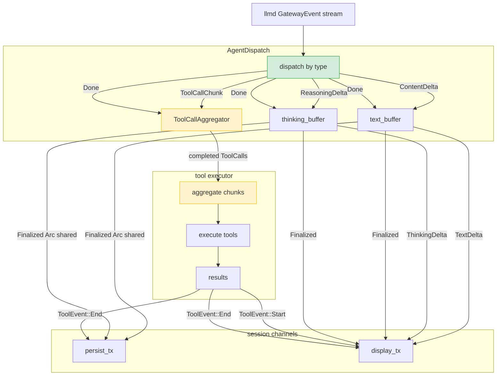

# Dispatch Framework

dispatch framework 是 orchd 的通用异步 pub/sub 分流框架。文档分两部分：第一部分描述框架提供的原语和接口，第二部分描述基于框架实现的业务 dispatch instance（AgentDispatch 及其 3 channel 架构、多 agent 交互）。

---

## 第一部分：框架设计

### 1. 核心原语

框架提供三个基本原语：

| 原语 | 说明 |
|---|---|
| **typed output channel** | `PersistEvent` / `DisplayEvent` 两类窄化 channel，consumer 不收无关事件 |
| **Arc fanout** | 同一 `Arc` 实例投递多个 channel，O(1) refcount bump |
| **SessionChannels** | session 级 channel pair 管理器，所有 dispatch instance 共享 |

### 2. Output Channel 类型

```rust
/// persist channel — 最终态事件，hostd 消费
pub enum PersistEvent {
    Finalized { /* ... */ },
    ToolResultCommitted { /* ... */ },
    TaskLifecycle { /* ... */ },
}

/// display channel — TUI 渲染事件
pub enum DisplayEvent {
    TextDelta { /* ... */ },
    ThinkingDelta { /* ... */ },
    Finalized { /* ... */ },
    ToolCallDelta { /* ... */ },
    ToolEvent(ToolEvent),
    InteractionEvent(InteractionEvent),
    TaskLifecycle { /* ... */ },
    TurnLifecycle { /* ... */ },
}
```

两类 channel 覆盖全部事件的持久化和渲染需求。新增事件类型只需在对应 enum 中加 variant。

### 3. Dispatch Trait

```rust
#[async_trait]
pub trait Dispatch: Send {
    fn name(&self) -> &str;

    async fn run(
        &mut self,
        persist_tx: mpsc::Sender<Arc<PersistEvent>>,
        display_tx: mpsc::Sender<Arc<DisplayEvent>>,
    );
}
```

任何 dispatch instance 实现此 trait 即可接入框架。

### 4. SessionChannels

```rust
pub struct SessionChannels {
    persist_tx: mpsc::Sender<Arc<PersistEvent>>,
    persist_rx: mpsc::Receiver<Arc<PersistEvent>>,
    display_tx: mpsc::Sender<Arc<DisplayEvent>>,
    display_rx: mpsc::Receiver<Arc<DisplayEvent>>,
}

impl SessionChannels {
    pub fn new(config: ChannelConfig) -> Self { /* ... */ }

    /// 启动一个 dispatch instance
    pub fn spawn_dispatch<D: Dispatch + 'static>(
        &self,
        dispatch: D,
        session_id: SessionId,
    ) -> JoinHandle<()> { /* ... */ }

    /// hostd 消费 persist channel
    pub fn persist_stream(&mut self) -> impl Stream<Item = Arc<PersistEvent>> { /* ... */ }

    /// TUI 消费 display channel
    pub fn display_stream(&mut self) -> impl Stream<Item = Arc<DisplayEvent>> { /* ... */ }

    /// 获取 sender clone（供 tool executor 等直接投递）
    pub fn persist_sender(&self) -> mpsc::Sender<Arc<PersistEvent>> { /* ... */ }
    pub fn display_sender(&self) -> mpsc::Sender<Arc<DisplayEvent>> { /* ... */ }
}
```

### 5. 扩展点

新增 dispatch instance：实现 `Dispatch` trait，`spawn_dispatch()` 接入。

新增事件类型：在 `PersistEvent` / `DisplayEvent` 加 variant，所有 dispatch instance 自动可用。

---

## 第二部分：业务 Dispatch Instance

### 6. AgentDispatch — 单 Agent 3 Channel 架构

AgentDispatch 是 per-agent 的 dispatch instance，消费 llmd GatewayEvent stream。内部维护 3 个 channel 的完整路由逻辑：



#### 6.1 路由表

| GatewayEvent | 路由目标 | 行为 |
|---|---|---|
| `ContentDelta` | display channel | buffer text + 发送 `DisplayEvent::TextDelta` |
| `ReasoningDelta` | display channel | buffer thinking + 发送 `DisplayEvent::ThinkingDelta` |
| `ToolCallChunk` | ToolCallAggregator | 不投递 channel，buffer 在聚合器中 |
| `Usage` | 内部存储 | 等 Done 时随 Finalized 带出 |
| `Done` | 触发 finalize | 构建 Finalized → persist + display（Arc 共享）；flush 聚合器 → tool executor |
| `Error` | display channel | 直接发送带 error 的 Finalized |

#### 6.2 Done 时的 finalize 流程

```rust
fn on_done(&mut self, stop_reason: String) {
    // 1. 构建 Assistant content（只有 Text + Thinking）
    let content = self.build_assistant_content();

    // 2. Finalized → persist + display（Arc 共享，一份内存两份投递）
    let finalized = Arc::new(PersistEvent::Finalized {
        message_id, task_id, agent_id,
        content: content.clone(),
        model, provider, usage, stop_reason,
    });
    let _ = self.persist_tx.send(Arc::clone(&finalized));
    let _ = self.display_tx.send(Arc::new(DisplayEvent::Finalized {
        message_id, content, stop_reason: Some(stop_reason),
    }));

    // 3. 聚合完成的 tool calls → tool executor
    let tool_calls = self.tool_call_buffer.flush();
    if !tool_calls.is_empty() {
        self.spawn_tool_execution(tool_calls);
    }
}
```

#### 6.3 Tool Executor 回投

tool executor 持有 `persist_tx` 和 `display_tx` 的 clone。执行完成后不经过 AgentDispatch 路由，直接投递：

```
tool executor（独立 tokio task）
  │
  ├── ToolEvent::Start ──→ display_tx
  ├── execute tool
  └── ToolEvent::End   ──→ display_tx + persist_tx（Arc 共享）
```

```rust
fn spawn_tool_execution(&self, tool_calls: Vec<ToolCallItem>) {
    let persist_tx = self.persist_tx.clone();
    let display_tx = self.display_tx.clone();

    tokio::spawn(async move {
        for tc in tool_calls {
            // 1. Start → display
            display_tx.send(Arc::new(DisplayEvent::ToolEvent(ToolEvent::Start {
                tool_call_id: tc.id.clone(),
                tool_name: tc.name.clone(),
                args: tc.arguments.clone(),
                parent_message_id: Some(message_id.clone()),
                task_id: task_id.clone(),
                agent_id: agent_id.clone(),
            }))).ok();

            // 2. 执行工具
            let (result, is_error) = execute_tool(&tc).await;

            // 3. End → display + persist（Arc 共享）
            let end = Arc::new(DisplayEvent::ToolEvent(ToolEvent::End {
                tool_call_id: tc.id.clone(),
                tool_name: tc.name.clone(),
                result: result.clone(),
                is_error,
                task_id: task_id.clone(),
                agent_id: agent_id.clone(),
            }));
            display_tx.send(Arc::clone(&end)).ok();
            persist_tx.send(Arc::new(PersistEvent::ToolResultCommitted {
                session_id: session_id.clone(),
                message_id: format!("{}:tool_result:{}", task_id, tc.id),
                task_id: task_id.clone(),
                agent_id: agent_id.clone(),
                tool_call_id: tc.id.clone(),
                tool_name: tc.name.clone(),
                content: serde_json::to_string(&result).unwrap_or_default(),
                is_error,
            })).ok();
        }
    });
}
```

#### 6.4 ToolCallAggregator

将 LLM 的多个 `ToolCallChunk` 按 id 聚合为完整 ToolCall：

```rust
pub struct ToolCallAggregator {
    current: Option<(String, String, String)>,  // (id, name, accumulated_args)
    completed: Vec<ToolCallItem>,
}

impl ToolCallAggregator {
    pub fn on_chunk(&mut self, id: String, name: String, args_delta: String) {
        if !name.is_empty() {
            if let Some(prev) = self.current.take() {
                self.completed.push(self.finalize(prev));
            }
            self.current = Some((id, name, args_delta));
        } else if let Some(ref mut curr) = self.current {
            curr.2.push_str(&args_delta);
        }
    }

    pub fn flush(&mut self) -> Vec<ToolCallItem> {
        if let Some(prev) = self.current.take() {
            self.completed.push(self.finalize(prev));
        }
        std::mem::take(&mut self.completed)
    }
}
```

---

### 7. 多 Agent 交互

#### 7.1 架构

```
session channels（共享）
 ┌─────────────────────────────┐
 │ persist_tx ──→ persist_rx  │
 │ display_tx ──→ display_rx  │
 └─────────────────────────────┘
       ▲          ▲           ▲
       │          │           │
  AgentDispatch  AgentDispatch  LifecycleDispatch
  (root agent)   (child agent)  (supervisor)
       │              │              │
       │ spawn        │              │
       └──────→ AgentSpawner ←───────┘
```

#### 7.2 AgentSpawner 集成

`spawn` / `spawn_detached` tool call 通过 AgentSpawner 创建新的 AgentDispatch 实例：

```rust
async fn execute_tool(tc: &ToolCallItem) -> (Value, bool) {
    match tc.name.as_str() {
        "spawn" | "spawn_detached" => {
            let child_task_id = channels.spawn_dispatch(
                AgentDispatch::new(child_agent_id, child_prompt, /* ... */),
                session_id.clone(),
            ).await;

            if tc.name == "spawn" {
                // 订阅 child 的 Done，等待完成后返回结果
                let result = await_child_done(&child_task_id).await;
                (serde_json::to_value(result).unwrap(), false)
            } else {
                // spawn_detached：立即返回 task_id
                (serde_json::json!({"task_id": child_task_id, "status": "detached"}), false)
            }
        }
        _ => { /* 普通工具执行 */ }
    }
}
```

child agent 有自己的 AgentDispatch 实例，消费自己的 llmd GatewayEvent stream。事件通过**同一个** session channel pair 投递到 hostd 和 TUI。

#### 7.3 父 Agent 的 Tool Result 获取

`spawn`（非 detached）时，父 agent 的 tool executor 订阅 child 的 Done event：

- child 的 AgentDispatch 在 Done 且无更多 tool call 时完成
- 完成后通知订阅者
- 父 agent 的 tool executor 从 subscription 拿到结果，作为 tool result 返回
- 父 agent 的 agent_loop 收到 tool result，继续下一轮 LLM 推理

---

### 8. LifecycleDispatch

per-session dispatch instance，消费 orchd supervisor 的编排事件，不与 LLM stream 交互：

```rust
pub struct LifecycleDispatch {
    session_id: SessionId,
    lifecycle_rx: mpsc::UnboundedReceiver<LifecycleEvent>,
}

pub enum LifecycleEvent {
    TaskCreated   { task_id, agent_id, parent_task_id, prompt },
    TaskStarted   { task_id, agent_id },
    TaskCompleted { task_id, agent_id, total_steps, summary },
    TaskFailed    { task_id, agent_id, error },
    TaskCancelled { task_id, agent_id },
    TurnStarted   { turn_id, root_task_id },
    TurnCompleted { turn_id, total_tasks },
    TurnFailed    { turn_id, error },
    TurnCancelled { turn_id },
}
```

```rust
#[async_trait]
impl Dispatch for LifecycleDispatch {
    async fn run(
        &mut self,
        persist_tx: mpsc::Sender<Arc<PersistEvent>>,
        display_tx: mpsc::Sender<Arc<DisplayEvent>>,
    ) {
        while let Some(event) = self.lifecycle_rx.recv().await {
            match event {
                LifecycleEvent::TaskCreated { task_id, agent_id, parent_task_id, .. } => {
                    let e = Arc::new(DisplayEvent::TaskLifecycle {
                        task_id: task_id.clone(),
                        agent_id: agent_id.clone(),
                        parent_task_id,
                        event: TaskLifecycleEvent::Created,
                    });
                    let _ = display_tx.send(e);
                    let _ = persist_tx.send(Arc::new(PersistEvent::TaskLifecycle {
                        task_id, agent_id, parent_task_id,
                        event: TaskLifecycleEvent::Created,
                    }));
                }
                // ... 其他事件同理
            }
        }
    }
}
```

---

### 9. orchd 启动流程

```rust
// orchd supervisor 中
let channels = SessionChannels::new(ChannelConfig::default());

// 1. 获取 output stream（hostd / TUI 消费）
let persist_stream = channels.persist_stream();
let display_stream = channels.display_stream();

// 2. 启动 root agent dispatch
let root_dispatch = AgentDispatch::new(root_agent_id, prompt, /* ... */);
channels.spawn_dispatch(root_dispatch, session_id.clone());

// 3. 启动 lifecycle dispatch
let lifecycle_dispatch = LifecycleDispatch::new(session_id.clone(), lifecycle_rx);
channels.spawn_dispatch(lifecycle_dispatch, session_id.clone());

// 4. hostd 和 TUI 各自消费 persist_stream / display_stream
```

---

### 10. Channel 配置

```rust
pub struct ChannelConfig {
    /// persist channel 容量（低频事件）
    pub persist_buffer: usize,     // 默认 64
    /// display channel 容量（高频 TextDelta）
    pub display_buffer: usize,     // 默认 256
}
```

- **persist channel**：每轮 turn 数个 Finalized + ToolResultCommitted，低频。
- **display channel**：每秒数十个 TextDelta，高频，需要较大 buffer 避免 TUI 阻塞 llmd streaming。
- **背压**：`mpsc::Sender::send()` 返回 `Result`，根据策略选择 `try_send` 或 `send().await`。
