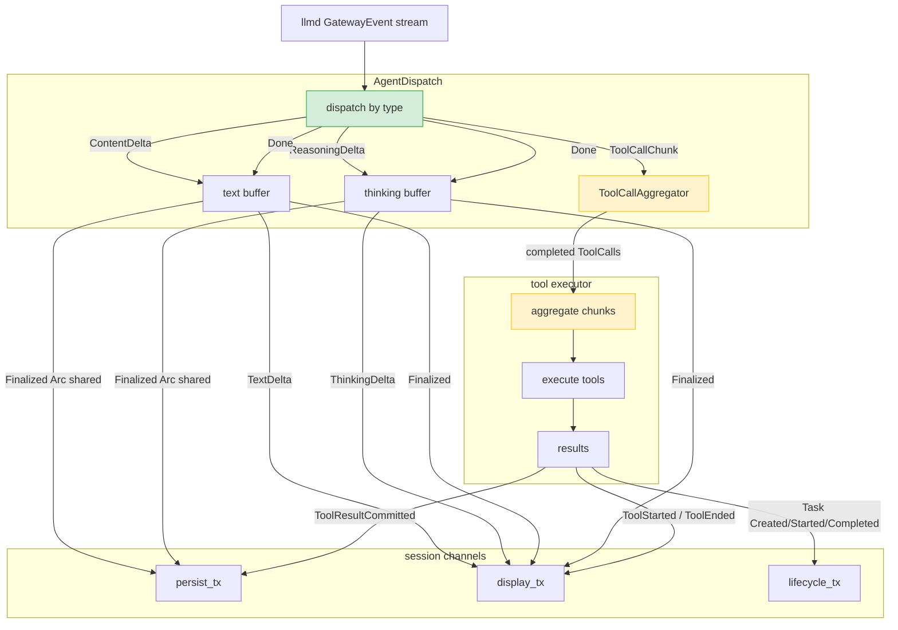

# Dispatch Framework

dispatch framework 是 orchd 的通用异步 pub/sub 分流框架。文档分两部分：第一部分描述框架提供的原语和接口，第二部分描述基于框架实现的业务 dispatch instance（AgentDispatch 及其 channel 架构、多 agent 交互）。

---

## 第一部分：框架设计

### 1. 核心原语

框架提供三个基本原语：

| 原语 | 说明 |
|---|---|
| **typed output channel** | `PersistEvent` / `DisplayEvent` / `LifecycleEvent` 三类窄化 channel，consumer 不收无关事件 |
| **Arc fanout** | 同一 `Arc` 实例投递多个 channel，O(1) refcount bump |
| **SessionChannels** | session 级 channel pair 管理器，所有 dispatch instance 共享 |

### 2. Output Channel 类型

```rust
/// persist channel — 最终态事件，hostd 消费并转换为 SessionTreeEntry
pub enum PersistEvent {
    Finalized { /* ... */ },
    ToolCallCommitted { /* ... */ },
    ToolResultCommitted { /* ... */ },
    TaskLifecycle(TaskEvent),
}

/// display channel — orchd → TUI 渲染事件，不含持久化语义
pub enum DisplayEvent {
    TextDelta { /* ... */ },
    ThinkingDelta { /* ... */ },
    ToolCallDelta { /* ... */ },
    MessageStart { /* ... */ },
    MessageEnd { /* ... */ },
    Finalized { /* ... */ },
    ToolStarted { /* ... */ },
    ToolEnded { /* ... */ },
    InteractionRequested { /* ... */ },
    InteractionResolved { /* ... */ },
}

/// lifecycle channel — 编排事件（Task / Turn 生命周期）
pub enum LifecycleEvent {
    Task(TaskEvent),
    Turn(TurnEvent),
}
```

三类 channel 覆盖全部事件的持久化、渲染和编排需求。lifecycle channel 独立于 display，TUI 可单独消费 lifecycle stream 更新 agent 状态而不接触渲染事件。

### 3. Dispatch Trait

```rust
#[async_trait]
pub trait Dispatch: Send {
    fn name(&self) -> &str;

    async fn run(
        &mut self,
        persist_tx: mpsc::Sender<Arc<PersistEvent>>,
        display_tx: mpsc::Sender<Arc<DisplayEvent>>,
        lifecycle_tx: Option<mpsc::Sender<Arc<LifecycleEvent>>>,
    );
}
```

任何 dispatch instance 实现此 trait 即可接入框架。`lifecycle_tx` 为 `Option` 以兼容不需要 lifecycle channel 的 dispatch instance。

### 4. SessionChannels

```rust
pub struct SessionChannels {
    persist_tx: mpsc::Sender<Arc<PersistEvent>>,
    persist_rx: mpsc::Receiver<Arc<PersistEvent>>,
    display_tx: mpsc::Sender<Arc<DisplayEvent>>,
    display_rx: mpsc::Receiver<Arc<DisplayEvent>>,
    lifecycle_tx: mpsc::Sender<Arc<LifecycleEvent>>,
    lifecycle_rx: mpsc::Receiver<Arc<LifecycleEvent>>,
}

impl SessionChannels {
    pub fn new(config: ChannelConfig) -> Self { /* ... */ }

    /// 启动一个 dispatch instance
    pub fn spawn_dispatch<D: Dispatch + 'static>(
        &self,
        dispatch: D,
        session_id: SessionId,
    ) -> JoinHandle<()> { /* ... */ }

    /// hostd 消费 persist channel → JSONL
    pub fn persist_stream(&mut self) -> Option<ReceiverStream<Arc<PersistEvent>>> { /* ... */ }

    /// hostd 消费 display channel → TUI
    pub fn display_stream(&mut self) -> Option<ReceiverStream<Arc<DisplayEvent>>> { /* ... */ }

    /// hostd 消费 lifecycle channel → TUI 状态
    pub fn lifecycle_stream(&mut self) -> Option<ReceiverStream<Arc<LifecycleEvent>>> { /* ... */ }

    /// 获取 sender clone（供 tool executor 等直接投递）
    pub fn persist_sender(&self) -> mpsc::Sender<Arc<PersistEvent>> { /* ... */ }
    pub fn display_sender(&self) -> mpsc::Sender<Arc<DisplayEvent>> { /* ... */ }
    pub fn lifecycle_sender(&self) -> mpsc::Sender<Arc<LifecycleEvent>> { /* ... */ }
}
```

### 5. ChannelBus（跨 dispatch 共享）

`ChannelBus` 是 channel sender 的共享容器，供 child agent spawner 等跨 dispatch instance 投递事件：

```rust
pub struct ChannelBus {
    persist:  Arc<Mutex<Option<mpsc::Sender<Arc<PersistEvent>>>>>,
    display:  Arc<Mutex<Option<mpsc::Sender<Arc<DisplayEvent>>>>>,
    lifecycle: Arc<Mutex<Option<mpsc::Sender<Arc<LifecycleEvent>>>>>,
}

impl ChannelBus {
    pub fn set(&self, persist, display, lifecycle) { /* ... */ }
    pub async fn send_event(&self, event: &ServerMessage) { /* 按 variant 分流到对应 channel */ }
    pub fn clear(&self) { /* ... */ }
}
```

### 6. 扩展点

新增 dispatch instance：实现 `Dispatch` trait，`spawn_dispatch()` 接入。

新增事件类型：在 `PersistEvent` / `DisplayEvent` / `LifecycleEvent` 加 variant，所有 dispatch instance 自动可用。

---

## 第二部分：业务 Dispatch Instance

### 7. AgentDispatch — 单 Agent Pipeline

AgentDispatch 是 per-agent 的 dispatch instance，消费 llmd GatewayEvent stream。



#### 7.1 路由表

| GatewayEvent | 路由目标 | 行为 |
|---|---|---|
| `ContentDelta` | display channel | buffer text + 发送 `DisplayEvent::TextDelta` |
| `ReasoningDelta` | display channel | buffer thinking + 发送 `DisplayEvent::ThinkingDelta` |
| `ToolCallChunk` | ToolCallAggregator | 不投递 channel，buffer 在聚合器中 |
| `Usage` | 内部存储 | 等 Done 时随 Finalized 带出 |
| `Done` | 触发 finalize | 构建 Finalized → persist + display（Arc 共享）；flush 聚合器 → tool executor |
| `Error` | display channel | 直接发送带 error 的 Finalized |

#### 7.2 Done 时的 finalize 流程

```rust
fn on_done(&mut self, stop_reason: String) {
    // 1. 构建 Assistant content
    let content = self.build_assistant_content();

    // 2. Finalized → persist + display（Arc 共享，一份内存两份投递）
    let finalized = Arc::new(PersistEvent::Finalized {
        message_id, task_id, agent_id,
        message: Message::Assistant { content: content.clone(), /* ... */ },
    });
    let _ = self.persist_tx.send(Arc::clone(&finalized));
    let _ = self.display_tx.send(Arc::new(DisplayEvent::Finalized {
        message_id, content, stop_reason: Some(stop_reason), /* ... */
    }));

    // 3. ToolCallCommitted → persist（不再发 display，ToolStarted 已覆盖）
    for tc in tool_calls {
        let _ = self.persist_tx.send(Arc::new(PersistEvent::ToolCallCommitted { /* ... */ }));
    }

    // 4. 聚合完成的 tool calls → tool executor
    if !tool_calls.is_empty() {
        self.spawn_tool_execution(tool_calls);
    }
}
```

#### 7.3 Tool Executor 回投

tool executor 持有三个 channel sender 的 clone。执行完成后不经过 AgentDispatch 路由，直接投递：

```
tool executor（独立 tokio task）
  │
  ├── ToolStarted ──→ display_tx
  ├── execute tool
  ├── ToolEnded    ──→ display_tx
  └── ToolResultCommitted ──→ persist_tx
```

```rust
fn spawn_tool_execution(&self, tool_calls: Vec<ToolCallItem>) {
    let persist_tx = self.persist_tx.clone();
    let display_tx = self.display_tx.clone();

    tokio::spawn(async move {
        for tc in tool_calls {
            // 1. Start → display
            display_tx.send(Arc::new(DisplayEvent::ToolStarted {
                tool_call_id: tc.id.clone(),
                tool_name: tc.name.clone(),
                args: tc.arguments.clone(),
                parent_message_id: Some(message_id.clone()),
                task_id: task_id.clone(),
                agent_id: agent_id.clone(),
            })).ok();

            // 2. 执行工具
            let (result, is_error) = execute_tool(&tc).await;

            // 3. End → display
            display_tx.send(Arc::new(DisplayEvent::ToolEnded {
                tool_call_id: tc.id.clone(),
                tool_name: tc.name.clone(),
                result: result.clone(),
                is_error,
                task_id: task_id.clone(),
                agent_id: agent_id.clone(),
            })).ok();

            // 4. Result → persist（携带完整 Message）
            persist_tx.send(Arc::new(PersistEvent::ToolResultCommitted {
                session_id, message_id, task_id, agent_id,
                message: Message::ToolResult { /* ... */ },
            })).ok();
        }
    });
}
```

---

### 8. 多 Agent 交互

#### 8.1 架构

```
session channels（共享）
 ┌──────────────────────────────────────┐
 │ persist_tx  ──→ persist_rx           │
 │ display_tx  ──→ display_rx           │
 │ lifecycle_tx ──→ lifecycle_rx        │
 └──────────────────────────────────────┘
       ▲          ▲
       │          │
  AgentDispatch  AgentDispatch
  (root agent)   (child agent)
       │              │
       │ spawn        │
       └──────→ AgentSpawner
```

#### 8.2 AgentSpawner 集成

`spawn` / `spawn_detached` tool call 通过 AgentSpawner 创建新的 AgentDispatch 实例：

```rust
async fn execute_tool(tc: &ToolCallItem) -> (Value, bool) {
    match tc.name.as_str() {
        "spawn" | "spawn_detached" => {
            let child_task_id = channels.spawn_dispatch(
                AgentDispatch::new(child_agent_id, child_prompt, /* ... */),
                session_id.clone(),
            ).await;

            if tc.name == "spawn" {
                let result = await_child_done(&child_task_id).await;
                (serde_json::to_value(result).unwrap(), false)
            } else {
                (serde_json::json!({"task_id": child_task_id, "status": "detached"}), false)
            }
        }
        _ => { /* 普通工具执行 */ }
    }
}
```

child agent 有自己的 AgentDispatch 实例，消费自己的 llmd GatewayEvent stream。事件通过**同一个** session channel pair 投递到 hostd 和 TUI。

---

### 9. orchd 启动流程

```rust
let channels = SessionChannels::new(ChannelConfig::default());

// 1. 获取 output streams（hostd 消费）
let persist_stream = channels.persist_stream();
let display_stream = channels.display_stream();
let lifecycle_stream = channels.lifecycle_stream();

// 2. 启动 root agent dispatch
let root_dispatch = AgentDispatch::new(root_agent_id, prompt, /* ... */);
channels.spawn_dispatch(root_dispatch, session_id.clone());

// 3. hostd 合并三个 stream → ServerMessage → TUI / JSONL
```

### 10. Channel 配置

```rust
pub struct ChannelConfig {
    pub persist_buffer: usize,     // 默认 64（低频事件）
    pub display_buffer: usize,     // 默认 256（高频 TextDelta）
    pub lifecycle_buffer: usize,   // 默认 64（编排事件，低频）
}
```

- **persist channel**：每轮 turn 数个 Finalized + ToolCallCommitted + ToolResultCommitted，低频。
- **display channel**：每秒数十个 TextDelta，高频，需要较大 buffer 避免 TUI 阻塞 llmd streaming。
- **lifecycle channel**：每轮 turn 数个 TaskEvent + TurnEvent，低频。
