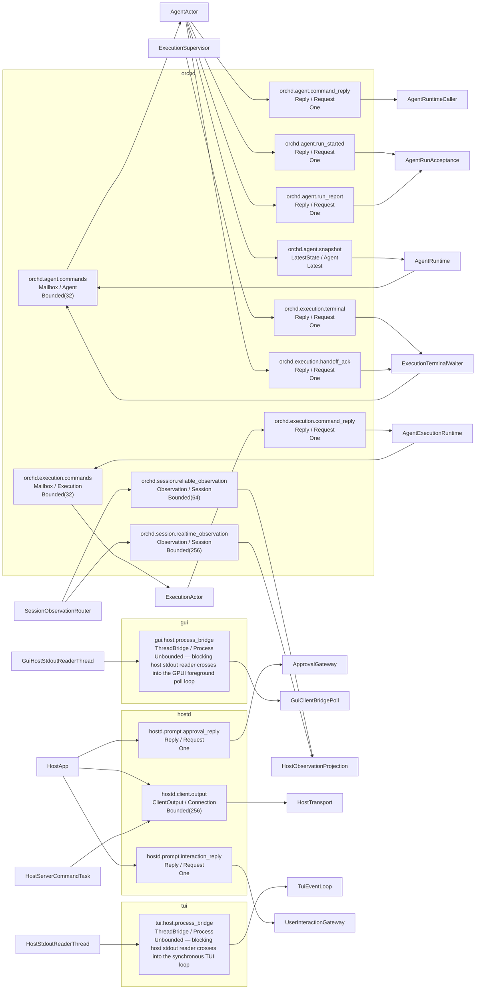

# Generated Communication Topology

> Generated by `piko-comms-topology`; do not edit manually.

```mermaid
flowchart LR
    subgraph gui["gui"]
        ngui_host_process_bridge["gui.host.process_bridge<br/>ThreadBridge / Process<br/>Unbounded — blocking host stdout reader crosses into the GPUI foreground poll loop"]
    end
    subgraph hostd["hostd"]
        nhostd_prompt_approval_reply["hostd.prompt.approval_reply<br/>Reply / Request<br/>One"]
        nhostd_prompt_interaction_reply["hostd.prompt.interaction_reply<br/>Reply / Request<br/>One"]
        nhostd_client_output["hostd.client.output<br/>ClientOutput / Connection<br/>Bounded(256)"]
    end
    subgraph orchd["orchd"]
        norchd_agent_commands["orchd.agent.commands<br/>Mailbox / Agent<br/>Bounded(32)"]
        norchd_agent_command_reply["orchd.agent.command_reply<br/>Reply / Request<br/>One"]
        norchd_agent_run_started["orchd.agent.run_started<br/>Reply / Request<br/>One"]
        norchd_agent_run_report["orchd.agent.run_report<br/>Reply / Request<br/>One"]
        norchd_agent_snapshot["orchd.agent.snapshot<br/>LatestState / Agent<br/>Latest"]
        norchd_execution_commands["orchd.execution.commands<br/>Mailbox / Execution<br/>Bounded(32)"]
        norchd_execution_command_reply["orchd.execution.command_reply<br/>Reply / Request<br/>One"]
        norchd_execution_terminal["orchd.execution.terminal<br/>Reply / Request<br/>One"]
        norchd_execution_handoff_ack["orchd.execution.handoff_ack<br/>Reply / Request<br/>One"]
        norchd_session_reliable_observation["orchd.session.reliable_observation<br/>Observation / Session<br/>Bounded(64)"]
        norchd_session_realtime_observation["orchd.session.realtime_observation<br/>Observation / Session<br/>Bounded(256)"]
    end
    subgraph tui["tui"]
        ntui_host_process_bridge["tui.host.process_bridge<br/>ThreadBridge / Process<br/>Unbounded — blocking host stdout reader crosses into the synchronous TUI loop"]
    end
    ncomponent_AgentActor["AgentActor"]
    ncomponent_AgentExecutionRuntime["AgentExecutionRuntime"]
    ncomponent_AgentRunAcceptance["AgentRunAcceptance"]
    ncomponent_AgentRuntime["AgentRuntime"]
    ncomponent_AgentRuntimeCaller["AgentRuntimeCaller"]
    ncomponent_ApprovalGateway["ApprovalGateway"]
    ncomponent_ExecutionActor["ExecutionActor"]
    ncomponent_ExecutionSupervisor["ExecutionSupervisor"]
    ncomponent_ExecutionTerminalWaiter["ExecutionTerminalWaiter"]
    ncomponent_GuiClientBridgePoll["GuiClientBridgePoll"]
    ncomponent_GuiHostStdoutReaderThread["GuiHostStdoutReaderThread"]
    ncomponent_HostApp["HostApp"]
    ncomponent_HostObservationProjection["HostObservationProjection"]
    ncomponent_HostServerCommandTask["HostServerCommandTask"]
    ncomponent_HostStdoutReaderThread["HostStdoutReaderThread"]
    ncomponent_HostTransport["HostTransport"]
    ncomponent_SessionObservationRouter["SessionObservationRouter"]
    ncomponent_TuiEventLoop["TuiEventLoop"]
    ncomponent_UserInteractionGateway["UserInteractionGateway"]
    ncomponent_AgentRuntime --> norchd_agent_commands
    ncomponent_ExecutionTerminalWaiter --> norchd_agent_commands
    norchd_agent_commands --> ncomponent_AgentActor
    ncomponent_AgentActor --> norchd_agent_command_reply
    norchd_agent_command_reply --> ncomponent_AgentRuntimeCaller
    ncomponent_AgentActor --> norchd_agent_run_started
    norchd_agent_run_started --> ncomponent_AgentRunAcceptance
    ncomponent_AgentActor --> norchd_agent_run_report
    norchd_agent_run_report --> ncomponent_AgentRunAcceptance
    ncomponent_AgentActor --> norchd_agent_snapshot
    norchd_agent_snapshot --> ncomponent_AgentRuntime
    ncomponent_AgentExecutionRuntime --> norchd_execution_commands
    norchd_execution_commands --> ncomponent_ExecutionActor
    ncomponent_ExecutionActor --> norchd_execution_command_reply
    norchd_execution_command_reply --> ncomponent_AgentExecutionRuntime
    ncomponent_ExecutionSupervisor --> norchd_execution_terminal
    norchd_execution_terminal --> ncomponent_ExecutionTerminalWaiter
    ncomponent_AgentActor --> norchd_execution_handoff_ack
    norchd_execution_handoff_ack --> ncomponent_ExecutionTerminalWaiter
    ncomponent_SessionObservationRouter --> norchd_session_reliable_observation
    norchd_session_reliable_observation --> ncomponent_HostObservationProjection
    ncomponent_SessionObservationRouter --> norchd_session_realtime_observation
    norchd_session_realtime_observation --> ncomponent_HostObservationProjection
    ncomponent_HostApp --> nhostd_prompt_approval_reply
    nhostd_prompt_approval_reply --> ncomponent_ApprovalGateway
    ncomponent_HostApp --> nhostd_prompt_interaction_reply
    nhostd_prompt_interaction_reply --> ncomponent_UserInteractionGateway
    ncomponent_HostStdoutReaderThread --> ntui_host_process_bridge
    ntui_host_process_bridge --> ncomponent_TuiEventLoop
    ncomponent_GuiHostStdoutReaderThread --> ngui_host_process_bridge
    ngui_host_process_bridge --> ncomponent_GuiClientBridgePoll
    ncomponent_HostApp --> nhostd_client_output
    ncomponent_HostServerCommandTask --> nhostd_client_output
    nhostd_client_output --> ncomponent_HostTransport
```
