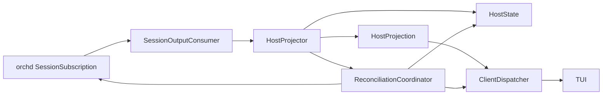

# Hostd Observation 类型与投影管线设计

> 状态：过渡期设计草案  
> 范围：hostd 消费 orchd observation 后的领域建模、状态所有权与客户端分发  
> 关联设计：[session-output-projection.md](session-output-projection.md)

## 1. 背景

orchd 已将 observation 明确分为 reliable Event、best-effort Delta 和 snapshot/cursor recovery。hostd 当前仍围绕旧的 `DisplayEvent`、active-task forwarding、agent-view event history 和 command response snapshot 组织逻辑。

这导致以下职责混合：

- 消费 orchd observation；
- 读取 durable records；
- 更新 HostState；
- 把 orchd event 压平为旧 DisplayEvent；
- 根据 active task 决定是否发送；
- 为 TUI 维护恢复与展示状态。

继续向旧 `DisplayEvent` 增加 variant 只能缓解局部问题，无法建立可靠事实、临时草稿和恢复边界之间的类型约束。

本文档提出重新设计 hostd observation types 与 projection pipeline。目标是在语义上贴近 orchd 的新模型，同时不让 TUI 或 `piko-protocol` 依赖 orchd 内部类型。

## 2. 核心原则

### 2.1 语义对齐，不做类型透传

hostd 保留 orchd 的核心语义：

```text
Event              = reliable、commit 后
Delta              = realtime、best-effort
SnapshotRequired   = recovery instruction
task_seq           = task 内 durable order
delta_seq          = message 内 realtime order
```

但 hostd 不把 `SessionOutput`、`SessionEventEnvelope` 或 `RealtimeDeltaEnvelope` 直接暴露给 TUI。

原因包括：

- `MessageCommitted` 只有 identity，客户端拿不到 durable record；
- hostd 需要 enrich session、agent、compaction、approval 和 interaction 状态；
- orchd API 演进不应直接破坏 hostd→TUI 线协议；
- hostd 必须保留 reconcile 和 authority 边界。

### 2.2 三层类型

```text
orchd observation types
        ↓ adapter
hostd domain projection types
        ↓ protocol mapper
piko-protocol client DTOs
```

三层可以字段相似，但职责不同：

- orchd types：runtime observation API；
- hostd projection：已被 hostd 理解和 reconcile 的领域变化；
- protocol DTO：稳定、可序列化的客户端契约。

### 2.3 摄取与展示分离

hostd 必须先完整摄取可靠事实，再决定如何展示。selected/active task 只能影响 realtime delivery 或当前 view，不能影响 committed ingestion。

## 3. 目标组件



### 3.1 SessionOutputConsumer

职责：

- drain session-scoped subscription；
- 将 Event、Delta 和 stream error 分流；
- 保留 envelope identity、cursor 和 sequence；
- 不直接修改 TUI state；
- 不执行 active-task filtering；
- 不把可靠错误静默 `continue`。

建议接口：

```rust
enum ObservationInput {
    Reliable(SessionEventEnvelope),
    Realtime(RealtimeDeltaEnvelope),
    StreamError(SessionStreamError),
    Closed,
}
```

这是 hostd adapter 层，可以直接使用 orchd API 类型。

### 3.2 HostProjector

职责：

- 校验 session/task/agent/message identity；
- 将 durable record 投影到 HostState；
- 实现 message/task/agent 的幂等 upsert；
- 维护 task 内 `task_seq` 与 head；
- 把输入转换成 hostd domain `HostProjection`；
- 发现可靠缺口时请求 reconciliation。

它不应知道：

- 当前 TUI 选择的行；
- Timeline component 或 panel 类型；
- markdown rendering；
- 客户端是否暂时断开；
- `"unknown"` message identity fallback。

### 3.3 ClientDispatcher

职责：

- 把 `HostProjection` 映射为 protocol `ServerMessage`；
- 对可靠 projection 与 realtime projection 使用不同分发策略；
- reliable projection 不因 task 未选中而丢失；
- 允许丢弃未选中 task 的 realtime projection；
- 在 task view 切换时发送该 task 的权威 hydration；
- 管理连接级 backpressure 和 disconnect。

### 3.4 ReconciliationCoordinator

职责：

- 处理 `SnapshotRequired`；
- 处理 reliable projection gap；
- 取得 snapshot 与可靠 cursor/revision；
- 原子替换或重建 HostState projection；
- 从 cursor 后重新订阅；
- 向客户端发送有边界的 reconciliation。

## 4. Hostd domain types

### 4.1 HostProjection

```rust
pub enum HostProjection {
    TranscriptCommitted(CommittedTranscriptProjection),
    RealtimeMessage(RealtimeMessageProjection),
    TaskChanged(TaskProjection),
    WorkChanged(WorkProjection),
    AgentChanged(AgentProjection),
    InteractionChanged(InteractionProjection),
    Reconciled(SessionReconciliation),
}
```

这个 enum 表示“hostd 已理解的用户可见变化”，不是 orchd event 的无脑镜像。

### 4.2 CommittedTranscriptProjection

```rust
pub struct CommittedTranscriptProjection {
    pub session_id: SessionId,
    pub task_id: TaskId,
    pub agent_id: AgentId,
    pub work_id: WorkId,
    pub message_id: MessageId,
    pub task_seq: u64,
    pub message: Message,
}
```

不变量：

- durable commit 已成功；
- `message_id` 与 record 一致；
- `task_seq` 已通过 task-level validation；
- `message` 是完整最终内容；
- 对同一 `message_id` 重放必须幂等。

### 4.3 RealtimeMessageProjection

```rust
pub struct RealtimeMessageProjection {
    pub session_id: SessionId,
    pub task_id: TaskId,
    pub agent_id: AgentId,
    pub message_id: MessageId,
    pub delta_seq: u64,
    pub delta: RealtimeDelta,
}
```

它不进入 authoritative transcript，不推进 durable task head，也不参与磁盘恢复。

### 4.4 SessionReconciliation

```rust
pub struct SessionReconciliation {
    pub session_id: SessionId,
    pub reason: ReconcileReason,
    pub cursor: ObservationCursor,
    pub snapshot: SessionProjectionSnapshot,
}
```

`ObservationCursor` 可以在第一版包装 orchd cursor，也可以是 hostd-owned projection revision；对客户端必须表现为不透明、单调且可用于定义 snapshot 边界。

### 4.5 AgentProjection

```rust
pub struct AgentProjection {
    pub session_id: SessionId,
    pub task_id: TaskId,
    pub agent_id: AgentId,
    pub parent_task_id: Option<TaskId>,
    pub name: String,
    pub role: String,
    pub status: AgentStatus,
}
```

Agent projection 始终使用完整 identity。status-only 输入可以内部局部更新，但不得生成会覆盖 name/role/parent 的降级 DTO。

## 5. HostState 重构方向

HostState 应明确保存 committed projection，而不是保存“恰好到达过的 Display events”。建议 session state 至少按以下概念划分：

```rust
pub struct SessionProjectionState {
    pub session_id: SessionId,
    pub transcript_by_task: HashMap<TaskId, TaskTranscriptProjection>,
    pub tasks: HashMap<TaskId, TaskProjection>,
    pub agents: HashMap<TaskId, AgentProjection>,
    pub active_turn: Option<TurnProjection>,
    pub selected_task_id: Option<TaskId>,
    pub pending_interactions: HashMap<InteractionId, InteractionProjection>,
    pub pending_approvals: HashMap<ApprovalId, ApprovalProjection>,
    pub observation_cursor: Option<ObservationCursor>,
}
```

`selected_task_id` 是客户端/展示选择；如果 hostd 支持多客户端，它不应放在共享 session authority 中，而应放到 connection/view state。

### 5.1 TaskTranscriptProjection

```rust
pub struct TaskTranscriptProjection {
    pub task_id: TaskId,
    pub entries: Vec<CommittedTranscriptProjection>,
    pub index_by_message_id: HashMap<MessageId, usize>,
    pub last_task_seq: u64,
    pub head_message_id: Option<MessageId>,
}
```

具体实现可以选择 BTreeMap、Vec+index 或其他结构；关键要求是：

- identity lookup 不依赖线性 append 假设；
- order 来自 `task_seq`，不是 notification 到达顺序；
- duplicate commit 是 no-op；
- sequence conflict/gap 可被检测；
- task view hydration 可以从 HostState 生成。

### 5.2 Session tree 与 transcript

Session tree、navigation/branch 和 task transcript 可能共享 committed entries，但不能让旧的 `current_leaf_id` append 逻辑隐式代替 task-level `task_seq` ordering。

设计实现时需要明确：

- task shard head 是 durable task order；
- session navigation leaf 是用户选择的 branch/view；
- compaction entry 是 session metadata；
- 三者不能用同一个“最后到达 entry”概念混合更新。

## 6. Durable commit 所有权

### 6.1 目标模型

文档契约要求 hostd durable state 在 PersistSink commit 边界更新。建议引入 projection-aware sink：

```text
ProjectionPersistSink
  ├── inner: TaskRepository
  └── projector: HostProjector
```

处理顺序：

```text
validate commit
→ TaskRepository durable write
→ durable ack 已确定
→ HostProjector apply committed record
→ 返回 PersistAck
→ orchd 发布 MessageCommitted notification
```

HostState 只在 durable write 成功后更新；projection 更新失败需要作为 hostd consistency failure 处理，不能把未落盘内容展示为 committed。

### 6.2 MessageCommitted notification

在目标模型中，`MessageCommitted` 不再触发正常路径的 full-shard reread。它用于：

- 确认对应 committed projection 可以对客户端发布；
- 推进 reliable cursor；
- 检测 HostState 与 notification identity 是否一致；
- 在重放时保持幂等。

如果 notification 到达而 HostState 找不到对应 record，表示 projection gap，应进入 reconciliation。

### 6.3 迁移期 reread

短期仍可：

```text
MessageCommitted
→ find_committed_message
→ apply HostState
→ emit HostProjection
```

但必须：

- 只投影目标 record，避免不必要地把全 shard 重新解释为 live event；
- 保留底层 storage error cause；
- 失败时触发 stale/reconcile；
- 不把错误包装为 SessionOpen/invalid command；
- 通过测试验证 append/read concurrency 与 task_seq continuity。

## 7. Observation pipeline

### 7.1 Reliable Event

```text
SessionEventEnvelope
→ validate envelope identity/cursor
→ enrich from committed HostState/record
→ apply idempotent domain projection
→ emit HostProjection
→ ClientDispatcher 发 reliable client DTO
```

不同 event 的处理：

- `MessageCommitted`：输出完整 committed transcript；
- `ToolCommitted`：输出对应 committed message/tool projection；
- `TaskChanged`：更新 task 与完整 agent projection；
- `WorkChanged`：更新 work/turn state；
- interaction events：更新 pending state 并输出领域事件。

### 7.2 Realtime Delta

```text
RealtimeDeltaEnvelope
→ validate required identity
→ normalize delta
→ emit RealtimeMessageProjection
→ ClientDispatcher 按 view/backpressure best-effort 分发
```

Delta 不读 TaskRepository，不修改 transcript，不推进 task head。

### 7.3 Stream error

```text
SnapshotRequired
→ pause reliable client projection
→ obtain snapshot/cursor
→ rebuild HostState
→ resubscribe after cursor
→ emit Reconciled
```

其他 stream close/error 不取消 runtime task，优先尝试 recovery。

## 8. Client dispatch model

### 8.1 Reliable 与 realtime policy

| Projection | HostState | Client delivery |
|---|---|---|
| committed transcript | 必须保存 | 可靠发送或通过后续 reconcile 补齐 |
| task/agent lifecycle | 必须保存 | 可靠发送或通过 hydration 补齐 |
| interaction/approval | 必须保存 | 可靠发送 |
| realtime message | 不进入 authority | best-effort，可按 view 丢弃 |
| reconciliation | 替换 authority 边界 | 必须发送 |

### 8.2 Active/selected task

当前实现按 `active_task_id` 过滤 Display forwarding，需要拆分：

- reliable ingestion：永不按 selected task 过滤；
- committed delivery：可以只即时推当前 view，但未推内容必须存在 HostState，并在切换时 hydrate；
- realtime delivery：允许只推当前 selected task；
- agent/task lifecycle：覆盖整个 session。

为了降低客户端复杂度，第一版建议所有 committed projections 都发送给 TUI，由 TUI 维护 per-task projection；仅 realtime 按 selected task 优化。

### 8.3 多客户端考虑

如果将来一个 hostd session 支持多个客户端，不得把 selected task、viewport 或 realtime presentation preference 存进共享 HostState。应建立：

```text
authoritative SessionProjectionState
+ per-connection ClientViewState
```

## 9. Protocol mapping

`HostProjection` 到 `piko-protocol` 的目标映射：

| HostProjection | ServerMessage |
|---|---|
| `TranscriptCommitted` | `TranscriptCommitted` |
| `RealtimeMessage` | `RealtimeMessage` |
| `Reconciled` | `SessionReconciled` |
| `TaskChanged` | `TaskLifecycle` 或新版 `TaskChanged` |
| `AgentChanged` | 完整 `AgentChanged` |
| `InteractionChanged` | 独立 `Interaction` |

不建议：

```rust
ServerMessage::SessionOutput(SessionOutput)
```

也不建议长期把 committed 与 realtime 继续混在旧 `DisplayEvent` 中。

## 10. Command 与 observation 分离

Command response 表示命令接受/拒绝或直接查询结果；异步 session observation 表示状态变化。两者不能互相借用。

例如：

```text
TurnSubmit response = accepted/failed
user transcript     = TranscriptCommitted(User)
assistant stream    = RealtimeMessage*
assistant final     = TranscriptCommitted(Assistant)
```

内部 compaction 不应复用旧 TurnSubmit command ID 发送一个会触发 timeline replacement 的 `StateSnapshot`。

Session open 可以返回 hydration snapshot，但 live recovery 应使用明确的 `SessionReconciled`，而不是伪装成普通 command response。

## 11. Compaction 与 snapshot

Compaction 是 durable session maintenance，不是客户端 view reset：

- 更新 storage；
- reconcile HostState metadata；
- 不清空 live transcript；
- 如需立即改变客户端 authority，必须产生带 cursor/revision 和 reason 的 reconciliation；
- 否则等到下一次显式 session hydration 使用 compacted representation。

Snapshot 必须说明用途：

```rust
enum SnapshotPurpose {
    Hydration,
    ExplicitRefresh,
    Reconnect,
    RetentionRecovery,
}
```

没有 purpose/boundary 的 snapshot 不能破坏性替换 live projection。

## 12. Agent projection

AgentPanel 重复和 name 降级本质上也属于 projection type 不完整：disconnect 只携带部分字段，而 TUI 被迫构造 AgentEntry。

目标规则：

- hostd 以 `task_id` 保存完整 AgentProjection；
- lifecycle input 更新该 projection；
- 客户端收到完整 `AgentChanged`，或严格的 status-only patch；
- status-only patch 找不到 task 时触发 agent hydration，而不是创造 fallback entry；
- closed task 从 active-agent query 中移除，但历史 task metadata 可保留；
- SessionOpened hydration 包含 agent projection 或随后自动发送 AgentList。

## 13. 错误模型

建议区分：

```rust
enum ProjectionError {
    IdentityMismatch { ... },
    MissingCommittedRecord { ... },
    TaskSequenceGap { expected, actual, ... },
    ConflictingCommit { ... },
    Storage { source, ... },
    SnapshotRequired { ... },
}
```

错误处理原则：

- realtime validation error：记录并丢弃；
- reliable projection error：停止继续假装一致，触发 reconcile；
- storage corruption：保留 path 与具体校验原因，报告 session-scoped recovery failure；
- command error 与 background observation error 使用不同的外部消息，不得错误归因。

## 14. 并发与锁边界

重构时应避免在持有全局 HostState lock 时执行磁盘读取或向客户端发送：

```text
读取/commit durable record
→ 构造 projection input
→ 短锁 apply HostState
→ 释放锁
→ dispatch client message
```

需要确保同一 task 的 committed projection 按 `task_seq` 串行应用。不同 task 可以并行，但不能因此建立伪全局顺序。

Dispatcher backpressure 不得阻塞 orchd durable commit 或 reliable hub publisher；连接落后时应断开/标记 stale，并通过 reconcile 恢复。

## 15. 不变量

1. HostState 只保存 durable 或 hostd-owned authoritative state。
2. Delta 不修改 transcript、task head 或 durable sequence。
3. committed projection 与 durable record 使用相同 identity 和 `task_seq`。
4. HostProjector 不依赖客户端 selected task。
5. ClientDispatcher 不决定某个 fact 是否存在。
6. reliable gap 不得静默跳过。
7. command response 不承载无关的异步 observation reset。
8. compaction 不等于 client snapshot replacement。
9. protocol 不暴露 orchd 内部类型。
10. partial lifecycle event 不得制造不完整的 agent entity。

## 16. 迁移阶段

### Phase A：建立类型边界

- 引入 hostd domain `HostProjection`；
- 将 SessionOutput 消费拆为 reliable/realtime/error handlers；
- 先用 adapter 映射到现有 ServerMessage，保持行为可测。

### Phase B：新 client protocol

- 增加 `TranscriptCommitted`、`RealtimeMessage`、`SessionReconciled`；
- committed DTO 携带完整 Message 与 `task_seq`；
- realtime DTO 携带 `delta_seq`；
- TUI 改用新协议收敛 timeline。

### Phase C：HostState projection

- 建立 per-task committed transcript projection；
- reliable ingestion 不再按 active task 过滤；
- agent state 使用完整 projection；
- task view 从 HostState hydrate。

### Phase D：recovery

- 实现 snapshot+cursor subscribe；
- 处理 `SnapshotRequired`；
- 区分 hydration/reconciliation/compaction；
- 移除 destructive unsolicited snapshot。

### Phase E：PersistSink ownership

- 在 durable commit 成功边界更新 HostState；
- `MessageCommitted` 正常路径不再 reread shard；
- 保留 recovery/diagnostic reread；
- 删除旧 Display-centric projection 路径。

## 17. 验证策略

### Domain unit tests

- committed idempotency；
- task_seq gap/conflict；
- delta 不修改 HostState；
- partial agent update 不降低 metadata；
- selected task 不影响 reliable projection。

### Pipeline tests

- Event-first/Delta-first；
- missing/duplicate delta；
- duplicate committed notification；
- child task event 与 root task 并发；
- reliable projection error→reconcile；
- subscription close 不取消 task。

### Storage integration tests

- PersistSink commit 与 HostState projection 一致；
- shard append/read concurrency；
- invalid task_seq 保留 expected/actual；
- projection callback 失败不会产生伪 committed client event。

### Client integration tests

- 所有 committed records 可由 HostState hydration 重建；
- live stream 与 reconnect 后 snapshot 收敛一致；
- compaction 不清空 timeline；
- AgentPanel 不重复、不降级 name。

## 18. 开放决策

1. HostProjection 是否使用 hostd 私有 structs，再显式映射 protocol DTO，还是直接复用无行为的 protocol DTO？
2. HostState 在第一阶段使用 `Vec + message index`，还是以 `task_seq` 为 key 的 ordered map？
3. committed client delivery 是全 task 广播，还是当前 view 即时发送、其他 task 切换时 hydrate？
4. cursor 是直接包装 orchd cursor，还是引入 hostd projection revision？
5. projection-aware PersistSink 更新 HostState 失败时，是否让 PersistSink command 返回失败，还是把 durable success 与 projection recovery 分开报告？

这些决策需要在实施设计评审中确定。无论选择哪种实现，hostd 都必须是 orchd observation 与 TUI presentation 之间的 reconcile 边界，而不是旧 Display 流的被动转发器。
