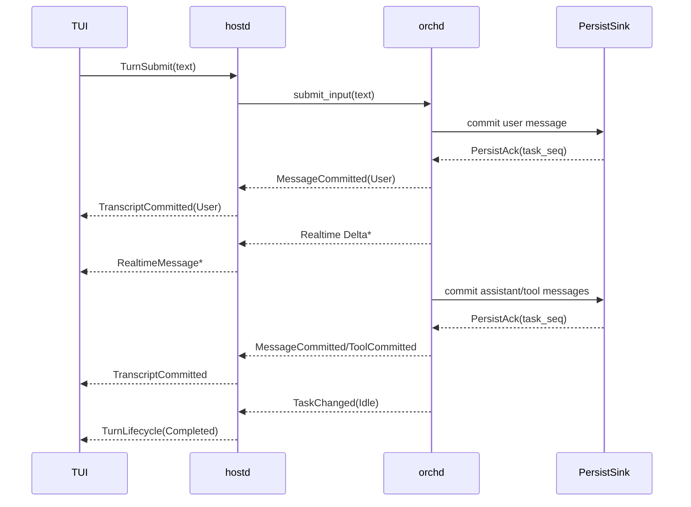

# Hostd ↔ TUI Interaction

> 状态：current
> 详细一致性设计：[session-output-projection.md](session-output-projection.md)

## 1. Ownership

hostd 是所有用户可见 session state 的权威来源，负责：

- session lifecycle、storage 与恢复；
- committed transcript projection；
- task、agent、turn、approval、interaction 与 queue state；
- snapshot/cursor reconciliation；
- 将 orchd `SessionOutput` 转换为稳定的客户端协议。

TUI 只负责 presentation：

- 展示 committed transcript；
- 展示可丢的 realtime draft；
- 按 server identity upsert；
- 按 `task_seq` 排列单个 task 的 committed records；
- 在 commit 到达后修正或替换 draft。

TUI 不依赖 orchd 类型，不推断 persistence，也不创建本地 user transcript message。

## 2. Transport

TUI 通过 JSON-lines stdio 与 hostd 通信：

```text
stdin:  Command JSON per line
stdout: ServerMessage JSON per line
```

command response 与异步 observation 是两类消息：

- `CommandResponse` 只表示命令结果；
- transcript、realtime、lifecycle 和 reconciliation 使用独立 `ServerMessage` variants。

## 3. Transcript protocol

### TranscriptCommitted

`TranscriptCommitted` 表示已经 durable 的权威 transcript record，包含：

- `session_id`
- `task_id`
- `agent_id`
- `work_id`
- `message_id`
- `task_seq`
- 完整 `Message`

user、assistant、tool call 和 tool result 都通过这个事件进入 TUI transcript。

### RealtimeMessage

`RealtimeMessage` 是 best-effort draft，包含：

- session/task/agent/message identity；
- `delta_seq`；
- `MessageStarted`、`Text`、`Thinking`、`ToolCall` 或 `MessageEnded` delta。

`MessageEnded` 不是 commit。已经 committed 的 message 不再接受 realtime mutation。

### SessionReconciled

`SessionReconciled` 包含：

- session snapshot；
- authoritative agent list；
- reconciliation reason；
- snapshot 对应的 observation cursor/revision。

它用于 initial hydration、explicit refresh、reconnect 和 retention recovery。

## 4. Turn submit



规则：

- `submit_input` 是唯一 user message 入口；
- hostd 不直接向 JSONL append user message；
- TUI 提交后可以清空 editor、显示状态或 spinner；
- TUI 等待服务端 `TranscriptCommitted(User)` 后才显示 user transcript；
- Event 和 Delta 可以任意先后到达。

## 5. Host projection

hostd 使用 projection-aware PersistSink：

```text
durable commit 成功
→ 同步更新 HostState
→ orchd 发布 committed notification
→ hostd 发布 TranscriptCommitted
```

正常 committed notification 路径不重新读取整个 task shard。Repository reread 只用于 hydration、reconciliation 和诊断。

hostd 消费 session subscription 中所有 task 的 reliable facts。`active_task_id` 只能影响 realtime presentation，不能过滤 committed ingestion。

## 6. TUI reducer

TUI 为每个 task 保存独立 timeline projection。

应用 realtime：

1. 校验 session identity；
2. 按 `message_id` 查找 draft；
3. 忽略不大于已应用值的 `delta_seq`；
4. 如果 message 已 committed，则忽略整个 realtime event；
5. 只修改 draft presentation。

应用 committed：

1. 按 `message_id` 幂等 upsert；
2. 用完整 committed content 替换 draft；
3. 标记 message committed；
4. 按 `task_seq` 重新排列 task transcript；
5. 拒绝同 identity 的迟到 delta。

## 7. Session open and recovery

Session open 返回 command acknowledgement，并紧接着发送 `SessionReconciled(InitialHydration)`。TUI 只使用 reconciliation message 执行破坏性 hydration。

可靠 subscription cursor 失效时：

```text
SnapshotRequired
→ hostd 获取 snapshot/cursor
→ subscribe_session(after cursor)
→ hostd 发送 SessionReconciled(RetentionExhausted)
→ TUI 替换 projection
→ 继续应用 cursor 后的 reliable events
```

其他 observation stream error 不会被静默吞掉，也不会伪装为 SessionOpen error。

## 8. Compaction

Compaction 是 durable maintenance，不是 TUI timeline reset。

- turn 完成后 hostd 可以执行 compaction；
- compaction 更新 storage 与 HostState；
- compaction 不发送普通 `StateSnapshot`；
- live timeline 不执行 `clear()`；
- 下一次 hydration/reconciliation 可以使用 compacted state。

## 9. Agents

hostd 发送完整 `AgentChanged(AgentInfo)`。TUI 以 `task_id` 为实体键：

- connect、running、idle、completed、failed 等状态使用完整 projection upsert；
- status change 不得把 name 降级为 `agent_id`；
- parent identity 保持稳定；
- closed task 从 active agent projection 移除；
- `SessionReconciled` 携带 authoritative agent list。

## 10. Tool execution and interactions

Tool transcript 与 execution presentation 分离：

- committed ToolCall/ToolResult 使用 `TranscriptCommitted`；
- execution progress 使用 `ToolExecution`；
- user interaction 使用独立 `Interaction`；
- approval 使用独立 `Approval`。

它们不属于 realtime transcript delta。

## 11. Ordering and failure rules

- `task_seq`：单 task durable order；
- `delta_seq`：单 message realtime order；
- 不同 task 之间没有 global order；
- Event 与 Delta 之间没有 global order；
- delta gap 可以等待 commit 修正；
- reliable gap 必须 reconciliation；
- subscription disconnect 不取消 runtime task；
- malformed delta 不得合成 `"unknown"` identity。

## 12. Persistence

schema-v2 session storage：

```text
session.json              session manifest/metadata
tasks/{task_id}.jsonl     task-local committed records
```

每条 task shard record 使用连续 `task_seq`。hostd 从 committed records 构建 `SessionTreeEntry::Message`，保留 message identity、work identity 和 task sequence。

Session resume 从 durable task shards 恢复 transcript，并通过 `SessionReconciled` hydrate TUI；realtime delta 不参与恢复。
