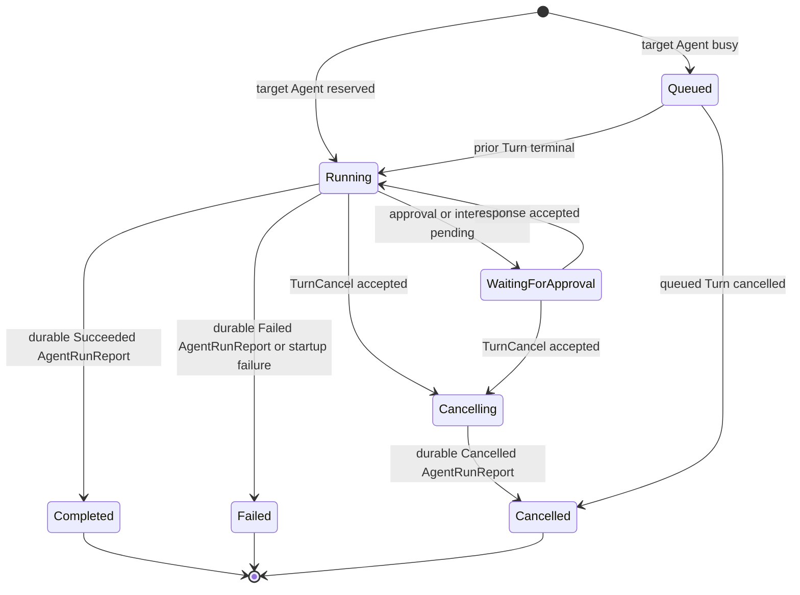
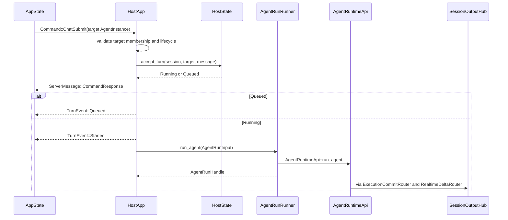
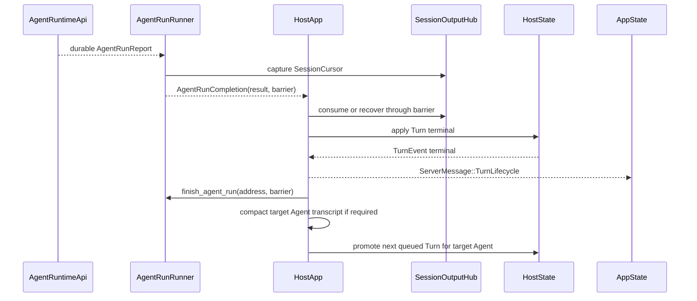

# hostd Turn Model and Agent Run API

> Status: normative design; unified chat scheduling, protocol lifecycle, and
> `AgentRunRunner` API implemented
>
> Feature brief: every accepted `Command::ChatSubmit` creates a hostd `Turn`
> addressed to the submitted `AgentInstance`; root identity does not select a
> different chat or Agent run API.
>
> Related current documents:
> [Multi-Agent Runtime Model](multi-agent-execution-model.md),
> [Turn–Agent Run Boundary](turn-agent-run-boundary-design.md),
> [Agent-Directed Chat Architecture](../packages/tui/docs/design/agent-directed-chat.md),
> and
> [Agent-Directed Chat](../packages/tui/docs/features/agent-directed-chat.md).

## 1. Purpose

Define `Turn` as a hostd-owned, user-originated operation that targets any
concrete `AgentInstance` in a `Session`.

The previous implementation treated a root-targeted `Command::ChatSubmit` as
a `Turn` and a child-targeted submission as a separate direct Agent run. The
implemented model removes that API and lifecycle split.

This design removes that root-dependent API split. It preserves the separation
between a hostd `Turn`, an Agent run, and an internal `Execution`.

## 2. Product contract

The user-visible behavior is:

1. The Agent selected in `AgentPanelState` is the target captured by
   `Command::ChatSubmit`.
2. Every accepted `Command::ChatSubmit` creates one `Turn`, regardless of
   whether the target is the root or a child `AgentInstance`.
3. One `AgentInstance` has at most one running `Turn`; additional submissions
   to that Agent are queued in submission order.
4. Different `AgentInstance`s in one `Session` may run their Turns
   concurrently.
5. `TurnEvent` and `TurnSnapshot` identify the target `agent_instance_id`.
6. Cancellation, queue state, automatic compaction, approvals, and user
   interactions are resolved against the target `AgentInstance`.
7. Agent runs started by `spawn_agent`, `spawn_agent_detached`,
   `send_agent_message`, or another `AgentRuntimeApi` caller do not create a
   hostd `Turn` unless their source is an accepted `Command::ChatSubmit`.
8. No TUI layout, slot, focus, or Editor keybinding changes are required.

## 3. Definitions

### 3.1 Turn

A `Turn` is the durable hostd lifecycle record for one accepted
`Command::ChatSubmit`:

```text
Turn = user submission + target AgentInstance + hostd lifecycle
```

A `Turn` owns:

- `turn_id`;
- `session_id`;
- target `agent_instance_id`;
- submitted message content;
- queue and lifecycle status;
- timestamps and terminal error projection;
- the binding to at most one Agent run.

A `Turn` does not own:

- the `AgentInstance` transcript;
- `AgentInstanceLifecycle` or `AgentActivity`;
- `AgentRunReport` production;
- internal `Execution` identity;
- model-step or tool-execution state.

### 3.2 Agent run

An Agent run is the `AgentRuntimeApi::run_agent` operation that accepts input
for one `AgentInstance` and terminates with one durable `AgentRunReport`.

An Agent run may be started by a hostd `Turn` or by another Agent through a
multi-agent tool. Root and child `AgentInstance`s use the same
`AgentRuntimeApi` methods.

### 3.3 Root AgentInstance

The root `AgentInstance` is the `AgentInstance` referenced by
`root_agent_instance_id` in the `Session` manifest. Root identity defines:

- the root of the `parent_agent_instance_id` tree;
- the Agent created when a `Session` is created;
- the default Agent selected by the TUI when no persisted selection exists;
- the initial authority point for multi-agent policy;
- the default `AgentSpec` used for the main Agent.

Root identity does not define a different chat, queue, cancellation,
compaction, observation, completion, or Agent run API.

### 3.4 Execution

`Execution` remains an internal `AgentExecutionRuntime` implementation detail.
No `Command`, `TurnEvent`, `TurnSnapshot`, hostd control API, or multi-agent
tool exposes or accepts an `execution_id`.

## 4. Cardinality and addressing

```text
Session       1 ── N Turn
AgentInstance 1 ── N Turn
Turn          1 ── 0..1 Agent run
Agent run     1 ── 1 AgentRunReport
Agent run     1 ── 1 AgentRunPrompt
```

A queued `Turn` has no Agent run yet. A `Turn` binds exactly one Agent run when
it transitions to `Running`, and it never binds a second run.

Every `Turn` is addressed by:

```text
session_id + turn_id
```

Every scheduling decision for a `Turn` is scoped by:

```text
session_id + agent_instance_id
```

Every Agent operation remains addressed by:

```text
session_id + agent_instance_id
```

The following identities remain distinct:

| Identity | Owner | Meaning |
|---|---|---|
| `command_id` | protocol client | Correlates `CommandResponse` |
| `turn_id` | hostd | Identifies one user-originated `Turn` |
| `request_id` | `AgentRuntimeApi` caller | Makes one Agent input request idempotent |
| `report_id` | `AgentActor` | Identifies a durable `AgentRunReport` |
| `execution_id` | `AgentExecutionRuntime` | Internal execution correlation only |

No identity is substituted for another. In particular, `turn_id` is never an
`execution_id`.

## 5. Ownership

| State or decision | Owner | Authority |
|---|---|---|
| Highlighted Agent | `AppState` / `AgentPanelState` | TUI-local presentation state |
| Persisted selected Agent | hostd Session state | Session repository |
| Accepted `ChatSubmit` target | hostd | Immutable `Turn` record |
| `Turn` lifecycle and queue | hostd | Durable Turn state |
| Agent input acceptance | `AgentRuntime` / `AgentActor` | `AgentRuntimeApi` result |
| Agent lifecycle and activity | `AgentRuntime` / `AgentActor` | Durable Agent commands |
| Agent run terminal result | `AgentActor` | Durable `AgentRunReport` |
| Agent transcript | target `AgentInstance` shard | Append-only JSONL |
| Reliable and realtime output | `SessionOutputHub` | Observation only |
| TUI session projection | hostd | `ServerMessage` and `SessionReconciled` |

## 6. Turn lifecycle

### 6.1 Target status model

`TurnStatus` has the following values:

```rust
pub enum TurnStatus {
    Queued,
    Running,
    WaitingForApproval,
    Cancelling,
    Completed,
    Failed,
    Cancelled,
}
```

`Idle` is not a `Turn` status. Idle is represented by the absence of an active
or queued `Turn` for an `AgentInstance` and by `AgentActivity::Idle`.

### 6.2 State transitions



A successful `CommandResponse` means the `Turn` is durably accepted as either
`Queued` or `Running`. It does not mean the Agent run completed.

### 6.3 Terminal mapping

| Agent run result | Turn terminal |
|---|---|
| `ExecutionOutcome::Succeeded` | `TurnStatus::Completed` |
| `ExecutionOutcome::Failed` | `TurnStatus::Failed` |
| `ExecutionOutcome::Cancelled` | `TurnStatus::Cancelled` |
| `AgentRunFailure` before a durable report | `TurnStatus::Failed` |

hostd applies the mapping once, after the completion observation barrier.

## 7. Submission and scheduling

### 7.1 Unified `Command::ChatSubmit`

The wire command remains target-oriented:

```rust
Command::ChatSubmit {
    command_id: CommandId,
    session_id: SessionId,
    target_agent_instance_id: AgentInstanceId,
    text: String,
}
```

hostd performs these steps:

1. Load the authoritative Session manifest.
2. Validate that the target belongs to the Session and has
   `AgentInstanceLifecycle::Open`.
3. Reject empty input before creating a `Turn`.
4. Create a durable `Turn` containing the target `agent_instance_id` and
   submitted input.
5. Atomically inspect and update the active Turn slot for
   `session_id + agent_instance_id`.
6. Set the new `Turn` to `Running` when the slot is free, otherwise `Queued`.
7. Emit `CommandResponse` only after the Turn and scheduling decision are
   durable.
8. Emit the matching `TurnEvent`.
9. Start the Agent run only for a `Running` Turn.

No step branches on `root_agent_instance_id`.

### 7.2 Per-Agent concurrency

The host scheduling invariant is:

```text
at most one running Turn per (session_id, agent_instance_id)
```

Required behavior:

| Existing state | New `ChatSubmit` target | Result |
|---|---|---|
| no running Turn | Agent A | start Agent A Turn |
| Agent A running | Agent A | queue behind Agent A |
| Agent A running | Agent B | start Agent B Turn concurrently |
| Root running | child Agent | start child Turn concurrently |
| child running | root Agent | start root Turn concurrently |
| target closed or unavailable | target | reject before Turn creation |

`AgentRuntime` remains the final enforcement point for one active run per
`AgentInstance`.

### 7.3 Queue ownership

Queued Turns are hostd-owned durable records, not unaddressed strings. The
queue key is:

```text
session_id + agent_instance_id
```

When a running Turn becomes terminal, hostd atomically removes it from the
active slot, promotes the oldest queued Turn for the same `AgentInstance`, and
starts that Turn through the same Agent run API.

`Command::ChatSubmit` is sufficient to create a queued next Turn.
The former `Command::QueueNextTurn` and `Command::QueueFollowUp` variants are
removed. `Command::ChatSubmit` is the one API for accepting and queueing a
user-originated Turn.

`Command::QueueSteer` already carries `agent_instance_id` and must resolve the
active Turn for that target rather than an ambient Session Turn.

## 8. Prompt assembly

Prompt assembly is target-Agent-aware, not root-aware.

When a `Turn` transitions to `Running`, hostd resolves the current trusted
prompt resources and supplies them with the target `AgentInstance` input. The
`AgentActor` combines those resources with the target's durable `AgentSpec`
and resolved tool catalog to freeze one `AgentRunPrompt`.

Rules:

1. A queued Turn stores the original submitted message.
2. `PromptResourceSnapshot` is captured when the Turn starts running, not when
   it first enters the queue.
3. Root and child Turns use the same prompt assembly API.
4. Different `AgentSpec` values may produce different `AgentRunPrompt` values;
   that is configuration, not a different run API.
5. Agent runs not created by a hostd Turn receive prompt resources according
   to their `AgentRuntimeApi` caller and existing `SendAgentInputRequest`
   contract.

## 9. Target protocol

The protocol shapes in this section are implemented.

### 9.1 `TurnEvent`

Every lifecycle event identifies its target `AgentInstance`:

```rust
pub enum TurnEvent {
    Queued {
        session_id: SessionId,
        turn_id: TurnId,
        agent_instance_id: AgentInstanceId,
        timestamp: i64,
    },
    Started {
        session_id: SessionId,
        turn_id: TurnId,
        agent_instance_id: AgentInstanceId,
        timestamp: i64,
    },
    Completed {
        session_id: SessionId,
        turn_id: TurnId,
        agent_instance_id: AgentInstanceId,
        timestamp: i64,
    },
    Failed {
        session_id: SessionId,
        turn_id: TurnId,
        agent_instance_id: AgentInstanceId,
        error: String,
        timestamp: i64,
    },
    Cancelled {
        session_id: SessionId,
        turn_id: TurnId,
        agent_instance_id: AgentInstanceId,
        timestamp: i64,
    },
}
```

`root_agent_instance_id` is removed from `TurnEvent::Started`. The field is
replaced by `agent_instance_id` on every variant.

### 9.2 `TurnSnapshot` and `SessionSnapshot`

`TurnSnapshot` becomes target-aware:

```rust
pub struct TurnSnapshot {
    pub turn_id: TurnId,
    pub agent_instance_id: AgentInstanceId,
    pub status: TurnStatus,
    pub assistant_text: String,
    pub tool_calls: Vec<ToolCallSnapshot>,
}
```

A `Session` may have concurrent active Turns, so `SessionSnapshot` changes
from:

```rust
pub active_turn: Option<TurnSnapshot>
```

to:

```rust
pub active_turns: Vec<TurnSnapshot>
```

The vector contains running, waiting, and cancelling Turns. Queued Turn counts
are projected through target-aware queue state; full queued input content is
not exposed in `SessionSnapshot` unless a later product requirement needs it.

### 9.3 `AgentRunEvent`

`ServerMessage::AgentRunLifecycle` is not used for
`Command::ChatSubmit`-originated runs. Their host-visible lifecycle is
`ServerMessage::TurnLifecycle` for every target Agent.

Agent activity remains projected through `ServerMessage::AgentChanged`.
`AgentRunEvent` may be removed from the product protocol if no non-Turn UI use
remains. Internal Agent run completion continues to use `AgentRunReport`, not
`AgentRunEvent`.

### 9.4 Committed-event correlation

`MessageCommit::source_turn_id` is already optional. Reliable Session events
should preserve the same semantics rather than encode absence as an empty
string:

```rust
SessionEvent::MessageCommitted {
    message_id: MessageId,
    source_turn_id: Option<TurnId>,
    role: MessageRole,
}
```

The same rule applies to `SessionEvent::ToolCommitted`.

- A message produced by a `Turn` has `Some(turn_id)`.
- A message produced by an Agent-to-Agent run has `None`.

Reliable observation also carries durable Agent projection:

```rust
SessionEvent::AgentChanged {
    agent: AgentInfo,
}
```

hostd maps this event to `ServerMessage::AgentChanged` and advances the same
Session cursor used by `AgentRunCompletion::observation_barrier`.

### 9.5 Cancellation

The existing command shape remains sufficient:

```rust
Command::TurnCancel {
    command_id: CommandId,
    session_id: SessionId,
    turn_id: TurnId,
}
```

hostd resolves `agent_instance_id` from the authoritative Turn record. The
client does not submit a second target that could conflict with the Turn.

## 10. Target hostd state

`SessionState` replaces one Session-wide active Turn with
target-aware Turn state:

```rust
pub struct SessionState {
    // Existing Session projection fields remain.
    pub turns: HashMap<TurnId, TurnRecord>,
    pub active_turns: HashMap<AgentInstanceId, TurnId>,
    pub turn_queues: HashMap<AgentInstanceId, VecDeque<TurnId>>,
}
```

The implemented in-memory record is:

```rust
pub struct TurnRecord {
    pub turn_id: TurnId,
    pub agent_instance_id: String,
    pub message: String,
    pub status: TurnStatus,
}
```

Durable `AgentRunReport` recovery is target-neutral through
`SessionStorePort::agent_report_for_turn`. Persisting `TurnRecord` and queued
Turn order in `session.json` remains follow-up work; until then, hostd process
recovery cannot restore an accepted queued Turn that never started.

### 10.1 `HostState` operations

The implemented control surface is:

```rust
impl HostState {
    fn start_turn(
        &mut self,
        session_id: &str,
        agent_instance_id: &str,
        message: &str,
    ) -> Result<(TurnId, TurnStatus), ProtocolError>;

    fn promote_next_turn(
        &mut self,
        session_id: &str,
        agent_instance_id: &str,
    ) -> Result<Option<TurnRecord>, ProtocolError>;

    fn complete_turn(
        &mut self,
        session_id: &str,
        turn_id: &str,
    ) -> Result<ServerMessage, ProtocolError>;

    fn fail_turn(
        &mut self,
        session_id: &str,
        turn_id: &str,
        error: String,
    ) -> Result<ServerMessage, ProtocolError>;

    fn cancel_turn(
        &mut self,
        session_id: &str,
        turn_id: &str,
    ) -> Result<ServerMessage, ProtocolError>;
}
```

`TurnStatus` reports whether the accepted Turn is `Queued` or `Running`.

## 11. Unified host runner API

The removed `AgentRunRunner::run_turn` and `AgentRunRunner::run_agent_input` paths both
delegated to `AgentRuntimeApi::run_agent`. The implemented host adapter exposes
one `AgentRunRunner::run_agent` API.

The implemented interface is:

```rust
#[async_trait]
pub trait AgentRunRunner: Send + Sync {
    async fn run_agent(
        &self,
        input: AgentRunInput,
    ) -> Result<AgentRunHandle, ProtocolError>;

    async fn cancel_agent_run(
        &self,
        operation: &AgentOperationAddress,
    ) -> bool;

    async fn steer_agent(
        &self,
        session_id: &str,
        agent_instance_id: &str,
        message: &str,
    ) -> bool;

    async fn recover_observation(
        &self,
        operation: &AgentOperationAddress,
    ) -> Result<(SessionRuntimeSnapshot, SessionSubscription), ProtocolError>;

    async fn finish_agent_run(
        &self,
        operation: &AgentOperationAddress,
        barrier: &SessionCursor,
    );
}
```

`AgentRunInput` carries the complete target-neutral request:

```rust
pub struct AgentRunInput {
    pub session_id: String,
    pub operation_id: String,
    pub agent_instance_id: String,
    pub prompt: String,
    pub source_turn_id: Option<String>,
    pub prompt_resources: Option<PromptResourceSnapshot>,
    pub cwd: String,
    pub active_tool_names: Option<Vec<String>>,
    pub session_dir: PathBuf,
    pub ui_event_tx: UnboundedSender<ServerMessage>,
    pub resume_agent: Option<ResumeAgent>,
}
```

The Agent run handle and completion are target-neutral:

```rust
pub struct AgentRunHandle {
    pub address: AgentOperationAddress,
    pub observation: SessionSubscription,
    pub completion: AgentRunCompletionReceiver,
}

pub struct AgentRunCompletion {
    pub address: AgentOperationAddress,
    pub result: Result<AgentRunReport, AgentRunFailure>,
    pub observation_barrier: SessionCursor,
}
```

The former `TurnRunInput`, `AgentInputRunInput`, `TurnRunHandle`,
`AgentInputRunHandle`, `TurnRunCompletion`, and `AgentInputRunCompletion` types
are removed.

`AgentRunCompletion::observation_barrier` orders terminal lifecycle projection
after committed output. Consolidating the current per-operation
`SessionSubscription` values into one Session-scoped consumer is a separate
observation refactor; it does not change the unified Agent run API.

`OrchAgentRunRunner` implements `AgentRunRunner` and does not branch on root
identity when it starts an Agent run.

## 12. hostd application flow

The removed `HostApp::submit_root_chat` and
`HostApp::submit_direct_agent_chat` methods are replaced by the target-neutral
`HostApp::submit_chat` method:

```rust
async fn submit_chat(
    &self,
    command_id: CommandId,
    session_id: SessionId,
    agent_instance_id: AgentInstanceId,
    text: String,
    tx: &UnboundedSender<ServerMessage>,
) -> Result<(), ProtocolError>;
```

`HostApp::apply_chat_submit` remains the protocol entry point and delegates to
`HostApp::submit_chat` after target validation. It does not compare the target
with `root_agent_instance_id`.

### 12.1 Start sequence



### 12.2 Completion sequence



Root and child targets use the same sequences.

## 13. Observation and completion

`SessionOutputHub` separates:

- reliable `SessionOutput::Event` values;
- best-effort `SessionOutput::Delta` values.

Every `AgentRunHandle` currently carries a `SessionSubscription` and an
independent completion receiver. `HostApp::drive_operation_observation`
projects reliable events and realtime deltas, recovers a subscription through
`AgentRunRunner::recover_observation`, and waits through the completion
barrier.

The required terminal ordering is:

```text
AgentRunReport durable
→ AgentRunCompletion delivered
→ Session observation consumer applies observation_barrier
→ final TranscriptCommitted and AgentChanged projected
→ Turn terminal durable
→ ServerMessage::TurnLifecycle emitted
```

Observation orders projection. It never determines the Agent run or Turn
outcome.

Reliable and realtime routing is keyed by `session_id + agent_instance_id`,
while completion is keyed by `AgentOperationAddress`. A single long-lived
Session observation consumer remains a possible later simplification, not a
separate Agent API.

## 14. Cancellation, steering, and follow-up

### 14.1 Cancellation

For a running Turn, `Command::TurnCancel`:

1. loads the Turn by `session_id + turn_id`;
2. resolves its `agent_instance_id`;
3. transitions the Turn to `Cancelling`;
4. calls `AgentRunRunner::cancel_agent_run`;
5. waits for the durable Cancelled `AgentRunReport`;
6. applies the completion barrier before emitting `TurnEvent::Cancelled`.

For a queued Turn, cancellation removes the Turn from the target queue and
commits `TurnStatus::Cancelled` without starting an Agent run.

### 14.2 Steering

`Command::QueueSteer` already includes `agent_instance_id`. hostd validates
that the target has a running Turn and invokes `AgentRunRunner::steer_agent`.
Steering does not create another Turn.

### 14.3 Follow-up

An explicit follow-up command, if retained, includes `agent_instance_id` and
uses `AgentRunRunner::send_agent_input` with the target `AgentActor` follow-up
behavior. It does not use a Session-global queue.

A normal Editor submission always uses `Command::ChatSubmit` and therefore
creates a new `Turn`, queued when the target is busy.

## 15. Compaction

Automatic compaction is scoped to the transcript of the `AgentInstance` whose
Turn completed. It is not root-only.

```text
Turn terminal
→ inspect target AgentInstance transcript usage
→ compact target transcript when required
→ start next queued Turn for that AgentInstance
```

Compaction must complete before the next queued Turn for the same
`AgentInstance` starts when the next run depends on the compacted context.
Compaction for Agent A does not block a running Turn for Agent B.

`Command::SessionCompact` includes `agent_instance_id`; hostd never infers it
from TUI selection. Current `SessionTreeEntry` compaction represents the root
transcript, so a child target is not redirected to root compaction. Durable
child-transcript compaction remains follow-up work.

## 16. TUI projection

`AppState` applies all `TurnEvent` variants by `agent_instance_id`.

Required behavior:

- `AgentPanelState` derives Agent activity only from `AgentChanged` and
  reconciliation snapshots;
- `TurnEvent` drives user-operation state for the matching Agent Timeline;
- switching the selected Agent never redirects an accepted Turn;
- `SessionReconciledEvent.snapshot.active_turns` restores concurrent Turns
  after hydration;
- the active selected Agent's Turn controls the primary Editor/BottomBar Turn
  status;
- non-selected running Agents remain visible through `AgentPanelState`;
- `AgentRunLifecycle` is not required for user-directed child chat.

No layout slot, panel placement, focus, or keybinding changes are introduced.

## 17. Recovery

### 17.1 Same-process observation recovery

`AgentRunCompletionReceiver` remains independent from the Session-owned
`SessionSubscription`. When observation disconnects or retention expires,
`AgentRunRunner::recover_observation` returns a replacement subscription and
hostd rebuilds projection from durable Agent shards before completing the
Turn.

### 17.2 hostd process recovery

On Session recovery, hostd loads every non-terminal `TurnRecord`:

- queued Turn: restore it to the queue for its `agent_instance_id`;
- running Turn with a matching durable terminal report: rebuild projection and
  apply the report idempotently;
- running Turn with a provably live Agent run: restore observation and
  completion tracking;
- running Turn without a live run or terminal report: fail or cancel it under
  the existing interrupted-run policy;
- cancelling Turn: recover the durable run result or converge to the
  interrupted cancellation policy.

Correlation uses `source_turn_id`. Recovery never reconstructs or exposes an
internal `execution_id` for product control.

### 17.3 Queue recovery

Queued Turn order is durable per `agent_instance_id`. Recovery must not infer
the queue from transcript order, TUI selection, Agent tree order, or raw
unaddressed messages.

## 18. Atomicity and failure behavior

No transaction spans hostd Turn storage and `AgentActor` storage. The required
ordered commit points are:

```text
Turn accepted and scheduled durable
→ Agent input accepted
→ Agent transcript/report commits
→ AgentRunCompletion
→ observation barrier satisfied
→ Turn terminal durable
```

| Failure window | Required result |
|---|---|
| Before Turn acceptance commit | reject `Command::ChatSubmit`; no Turn exists |
| After queued Turn commit | recover queued Turn in target queue |
| After running Turn commit, before Agent input acceptance | fail Turn or retry the same `request_id`; never start a second run |
| During Agent run | recover or interrupt using existing Agent run policy |
| After report commit, before completion delivery | recover by `source_turn_id`; do not rerun Agent |
| After completion, before barrier | replay or rebuild committed projection |
| After barrier, before Turn terminal commit | idempotently reapply report outcome |
| After terminal commit, before UI delivery | reconciliation restores terminal state |

## 19. Invariants

1. Every accepted `Command::ChatSubmit` creates exactly one `Turn`.
2. Every `Turn` contains exactly one target `agent_instance_id`.
3. Root identity never selects a different chat or Agent run API.
4. A queued Turn binds no Agent run; a started Turn binds exactly one Agent
   run.
5. One `AgentInstance` has at most one running Turn and one active Agent run.
6. Different `AgentInstance`s may run Turns concurrently.
7. Agent runs not originating from `Command::ChatSubmit` do not create hostd
   Turns.
8. `AgentRunReport` is the Agent run terminal authority; hostd is the Turn
   terminal authority.
9. Observation barriers order projection but never determine business success.
10. Final committed transcript and terminal `AgentChanged` projection precede
    the matching terminal `TurnEvent`.
11. `turn_id`, `request_id`, `report_id`, and `execution_id` are never
    substituted for one another.
12. Transcript commits always target the owning `AgentInstance` shard.
13. Queue, cancellation, steering, prompt assembly, and compaction are resolved
    by `session_id + agent_instance_id`.
14. TUI selection is never consulted after a `Turn` is accepted.
15. Product control paths never expose internal `Execution` identity.

## 20. Non-goals

- This design does not change the `AgentInstance` hierarchy or authorization
  rules.
- It does not create a hostd `Turn` for every multi-agent tool call.
- It does not make Agent transcripts shared.
- It does not allow one `Command::ChatSubmit` to target multiple Agents.
- It does not define a new TUI panel, slot, focus target, or keybinding.
- It does not make `SessionOutputHub` the terminal authority.
- It does not define cross-Session Agent messaging.
- It does not preserve protocol compatibility with the root-only Turn model;
  the project has no migration requirement for obsolete Session layouts.

## 21. Required verification

1. Root and child `Command::ChatSubmit` both create target-aware Turns and use
   `AgentRunRunner::run_agent`.
2. No host runner implementation branches on `root_agent_instance_id` to
   select a run API.
3. Two submissions to the same Agent produce one running and one queued Turn.
4. Submissions to different Agents run concurrently.
5. `TurnEvent`, `TurnSnapshot`, and `SessionSnapshot` preserve target identity.
6. Cancellation resolves the Agent from the Turn record, including queued
   Turn cancellation.
7. Final committed output and terminal `AgentChanged` are projected before the
   Turn terminal event.
8. Automatic compaction affects only the target Agent transcript.
9. Recovery restores per-Agent active and queued Turns without using TUI
   selection.
10. Agent-to-Agent runs complete without creating hostd Turns.
11. Product commands and events contain no internal `execution_id`.
12. TUI derives `AgentActivity` from `AgentChanged`, not from `TurnEvent`.

## 22. Supersession and migration

This document supersedes these root-only statements:

- `Turn` binds only a root Agent run;
- child `Command::ChatSubmit` is not an Interaction Turn;
- `SessionSnapshot` has only one Session-wide active Turn;
- root and child user submissions use different lifecycle events;
- root-only queue, prompt-resource, cancellation, and compaction policy is part
  of the Turn definition.

The related Agent-Directed Chat feature and design documents use this Turn
definition. Older documents that still mention `SessionSnapshot.active_turn`
or a root-only Turn are historical design inputs and are not authoritative for
the implemented chat path.
