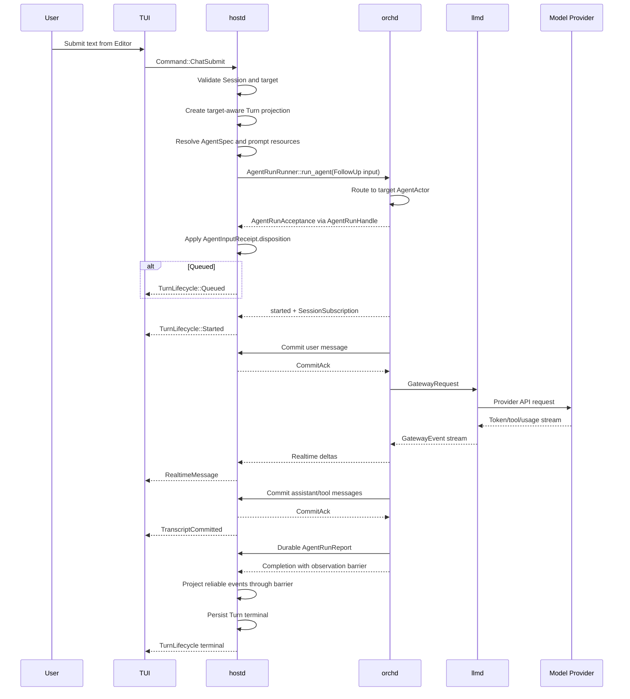
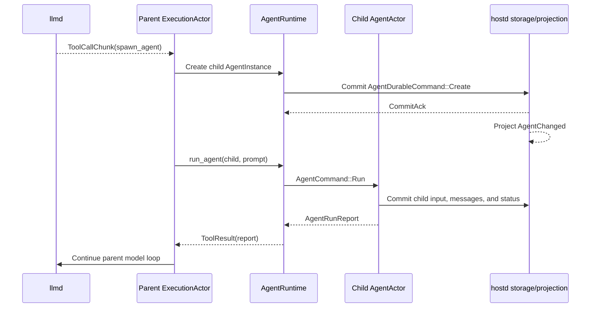
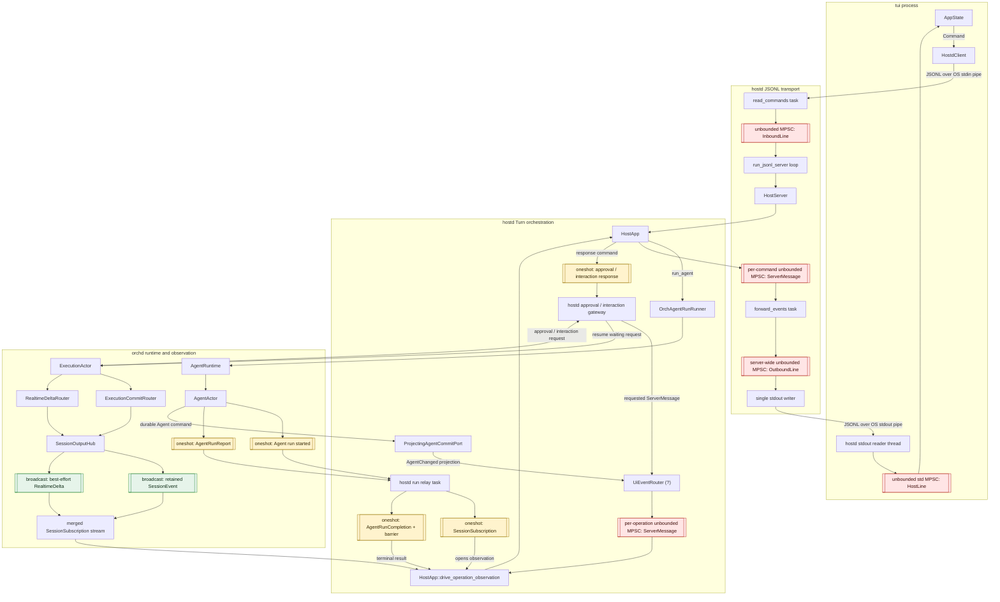
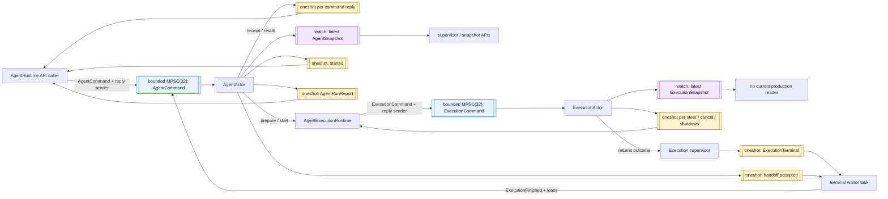

# Multi-Agent End-to-End Data Flow

> Status: explanatory architecture guide
>
> Normative references:
> [Multi-Agent Runtime Model](multi-agent-execution-model.md),
> [hostd Turn Model and Agent Run API](hostd-turn-model.md),
> [Turn–Agent Run Boundary](turn-agent-run-boundary-design.md),
> [Client Core Design](client-core-design.md), and
> [Single-Agent Runtime Model](single-agent-runtime-model.md).

## 1. Overview

From a multi-agent perspective, piko's main data path is:

```text
TUI: selects the target Agent and projects user-visible state
  ↕ JSONL Command / ServerMessage
hostd: owns Sessions, Turns, persistence, and user-visible authority
  ↕ AgentRunRunner / persistence ports / observation
orchd: owns the Agent tree, AgentActors, executions, and tool routing
  ↕ LlmGateway / GatewayEvent stream
llmd: adapts unified model requests to concrete providers
```

This is not one symmetric request-response pipeline. It contains three
independent paths:

1. **Control:** user input, run, cancel, approval, and interaction commands.
2. **Observation:** realtime deltas, durable transcript projection, and Agent
   state changes.
3. **Completion:** the durable `AgentRunReport` that determines the terminal
   result of an Agent run.

## 2. Layer ownership

| Layer | Primary responsibility | Explicit non-responsibility |
|---|---|---|
| TUI | Agent selection, `Editor`, `Timeline`, `AgentPanelState`, `ApprovalPanel`, and local interaction state | Does not decide transcript ownership or infer authoritative Agent state |
| hostd | Sessions, Turns, settings, auth, model resolution, persistence, TUI protocol, and user-visible projection | Does not execute the model/tool loop |
| orchd | AgentInstance tree, AgentActor, ExecutionActor, tool routing, and multi-agent scheduling | Does not update TUI directly or own the user-visible Session projection |
| llmd | Provider adaptation, model capability handling, streaming calls, and usage events | Does not know Session, Turn, or Agent-tree business semantics |

There are two complementary authority boundaries:

- **orchd is authoritative for the live Agent runtime:** which Agent is
  running, how it is scheduled, and how tools execute.
- **hostd is authoritative for durable and user-visible state:** Session,
  transcript, Turn, `AgentPanelState` input data, approvals, and interactions.

The current TUI-to-hostd boundary uses JSON-lines over stdio. The hostd-to-orchd
and orchd-to-llmd boundaries are Rust ports and adapters in the current process
topology, even though they remain distinct architectural layers.

## 3. Runtime object model

The durable multi-agent structure is an AgentInstance tree inside a Session:

```text
Session
└── AgentInstance tree
    ├── root AgentInstance
    │   ├── run 1
    │   ├── run 2
    │   └── ...
    ├── coder AgentInstance
    │   ├── run 1
    │   └── run 2
    └── researcher AgentInstance
        └── run 1
```

One Agent run contains a short-lived internal execution:

```text
Agent run
└── internal Execution
    ├── Model Step
    │   ├── llmd request
    │   └── optional tool calls
    ├── Model Step
    └── terminal AgentRunReport
```

The important identities are:

| Identity | Meaning |
|---|---|
| `session_id` | Durable conversation Session |
| `agent_instance_id` | Long-lived Agent address |
| `turn_id` | hostd-owned user submission Turn |
| `execution_id` | Short-lived orchd-internal execution identity |
| `report_id` | Durable Agent report identity used for delivery and idempotency |

Multi-agent operations are always addressed with:

```text
session_id + agent_instance_id
```

They are never routed by display name, AgentSpec ID, creation order, or
Execution ID.

## 4. Agent-directed submission

When the user submits to any open AgentInstance, hostd creates a Turn for that
target. A running Turn binds to exactly one Agent run.



### 4.1 TUI to hostd

The TUI captures the currently selected concrete AgentInstance when Enter is
handled and sends one target-oriented command:

```rust
ChatSubmit {
    command_id,
    session_id,
    target_agent_instance_id,
    text,
}
```

The TUI does not select a different API for root and child targets.

### 4.2 hostd Turn policy

hostd validates the authoritative Session and target AgentInstance. It:

1. creates the target-aware Turn;
2. sends `AgentInputDelivery::FollowUp` to the target `AgentActor`;
3. snapshots current prompt resources;
4. resolves AgentSpec, model, and active tool configuration;
5. invokes `AgentRunRunner::run_agent` once and projects
   `AgentInputReceipt.disposition` as `Running` or `Queued`;
6. owns Turn lifecycle state while `AgentActor` owns the durable follow-up
   queue.

### 4.3 orchd Agent run

`AgentRuntime` routes the request to the target `AgentActor`. The actor enforces
that one AgentInstance has at most one active run and delegates the short-lived
model/tool loop to an internal `ExecutionActor`.

The user message must be durably committed through the host-backed commit port
before it becomes reusable model context or starts a provider request.

### 4.4 orchd to llmd

The ExecutionActor builds a unified `GatewayRequest` containing:

- provider and model;
- frozen system prompt;
- the Agent's private transcript;
- available tool definitions;
- run and step correlation;
- resolved model settings.

llmd adapts that request to the selected provider and returns a unified stream:

```text
GatewayEvent::ContentDelta
GatewayEvent::ReasoningDelta
GatewayEvent::ToolCallChunk
GatewayEvent::Usage
GatewayEvent::Done
GatewayEvent::Error
```

llmd does not need to know whether the caller is a root or child Agent.

## 5. Root and child scheduling

The initial client flow is identical:

```text
TUI
  → Command::ChatSubmit
  → hostd
```

Root and child targets use the same path:

```text
hostd
  → create target-aware Turn
  → AgentRunRunner::run_agent(target)
  → target AgentActor
  → ExecutionActor
  → llmd
```

For both root and child submissions, hostd emits `TurnLifecycle`, sets
`source_turn_id = Some(turn_id)`, lets the target `AgentActor` queue a second
input for the same target, and permits Turns for different targets to run
concurrently.

The underlying Agent loop remains the same:

```text
commit user input
→ model step
→ execute optional tools
→ commit output
→ durable AgentRunReport
```

Every Agent owns a separate transcript shard:

```text
agents/<agent_instance_id>.jsonl
```

A child submission never appends to the root transcript.

## 6. Agent-created child runs

Multi-agent delegation may originate inside a model step rather than in the
TUI. For example, the root model can emit a `spawn_agent` tool call.



### 6.1 Attached spawn

`spawn_agent` waits for the child report:

```text
Parent Execution
    ↓ waits
Child Agent run
    ↓
AgentRunReport
    ↓
Tool result returned to Parent
    ↓
Parent performs another model step
```

The parent receives the child report rather than a mutable reference to the
child transcript.

### 6.2 Detached spawn

`spawn_agent_detached` returns after durable acceptance:

```text
create child
→ accept child input
→ return accepted to parent
→ child continues independently
→ commit child report to parent inbox
→ parent later calls collect_agent_reports
```

Detached delivery is ordered as:

```text
commit child report
→ commit parent inbox item
→ update parent unread report count
→ publish AgentChanged
```

The system has an AgentInstance tree, not an Execution tree. The hierarchy is
defined solely by `parent_agent_instance_id`.

## 7. Agent-to-Agent messages

An Agent may call `send_agent_message` to address an existing AgentInstance.
AgentRuntime resolves the requested delivery against the target's activity:

```text
Idle
  → start a new Agent run

Running + steer
  → inject at a model-step boundary

Running + follow_up
  → append to the target Agent's follow-up queue
```

The runtime authorization boundary permits supported self and direct
parent/child operations while rejecting unauthorized sibling and cross-Session
messaging.

hostd does not decide the Agent-to-Agent scheduling policy, but it still owns
durable commits and the resulting user-visible projection.

## 8. The three reverse paths

Model and Agent output does not return through one channel. Realtime display,
durable observation, and business completion have different guarantees.

### 8.1 Realtime lane

```text
GatewayEvent::ContentDelta
→ RealtimeDeltaRouter
→ hostd
→ ServerMessage::RealtimeMessage
→ TUI Timeline draft
```

Realtime data is best-effort:

- it enables low-latency streaming display;
- it may be lost;
- it is not recovered after reconnect;
- it never determines run completion;
- committed transcript messages replace the disposable TUI draft.

### 8.2 Reliable observation lane

```text
orchd commits message/tool/Agent command
→ hostd durable store
→ CommitAck
→ SessionOutput::Event
→ HostApp::project_operation_output
→ TranscriptCommitted / AgentChanged
→ TUI
```

Reliable product observation includes facts such as:

- committed messages and tools;
- Agent creation, activity, lifecycle, and inbox changes;
- approval and interaction lifecycle;
- a replayable Session cursor.

If observation disconnects or retained events are exhausted, hostd rebuilds
the projection from durable Agent shards and emits `SessionReconciled`.

### 8.3 Completion lane

```text
AgentActor
→ durable AgentRunReport
→ orchd completion channel
→ hostd
```

Agent run completion is not an observation event. This prevents observation
loss, replay, or TUI disconnect from changing the business outcome of a run.

Before hostd emits a terminal Turn event, it waits until:

```text
observed_cursor >= completion.observation_barrier
```

This orders the UI-visible result as:

```text
final TranscriptCommitted
→ terminal Agent projection
→ TurnLifecycle terminal
```

The barrier orders projection; the durable `AgentRunReport` remains the
terminal authority.

## 9. Agent state projection

AgentActor state transitions are committed as durable commands:

```text
Create
RunStarted
RunTerminal
SetLifecycle
CommitReport
ConsumeInboxItem
```

After a durable commit succeeds, hostd projects the change into an
`AgentChanged` event:

```text
AgentChanged {
    agent_instance_id,
    parent_agent_instance_id,
    lifecycle,
    activity,
    unread_report_count,
    ...
}
```

`AppState` applies `AgentChanged` to `AgentPanelState`. It does not synthesize
Agent activity from `TurnLifecycle` or `AgentRunLifecycle`.

Agent state has two independent dimensions:

```text
Lifecycle: Open | Closed | Unavailable | Terminated
Activity:  Idle | Running | WaitingForApproval | Cancelling
```

Completing a run returns activity to `Idle`; it does not close the
AgentInstance.

## 10. Multi-Agent Timeline projection

The TUI maintains a Timeline per `agent_instance_id`:

```text
root timeline
coder timeline
researcher timeline
...
```

Agent-specific events are routed by their concrete Agent identity:

```text
TranscriptCommitted(agent=A) → A timeline
RealtimeMessage(agent=B)     → B timeline
ToolExecution(agent=C)       → C timeline
```

Selecting another row through `AgentPanelState` changes only the visible
`Timeline`. It does not change the destination of an already accepted message
or the transcript to which a future commit belongs.

On Session hydration or observation recovery, hostd emits:

```text
SessionReconciled {
    snapshot,
    agents,
    cursor,
    reason,
}
```

The TUI uses this single authoritative replace path to rebuild Session
identity, the Agent tree, selected Agent, Timeline, active Turn, approvals,
interactions, and usage projection.

## 11. Approval and user-interaction path

When a tool or Agent run requires user approval, the control path travels in
both directions:

```text
ExecutionActor
→ OrchAgentRunRunner implementing ApprovalGateway
→ SessionEvent::ApprovalRequested
→ SessionOutputHub reliable observation
→ HostApp projection
→ ServerMessage::Approval(ApprovalEvent::Requested)
→ ApprovalPanel
→ Command::ApprovalRespond
→ HostApp
→ resolve orchd waiter
→ tool execution resumes
```

llmd may produce the tool call that leads to approval, but it does not make or
own the approval decision.

## 12. Combined architecture

The diagram below uses the concrete type and method names from the current
implementation. All user-visible runtime observation shares one
`SessionObservationRouter` registry and the reliable or realtime lanes of
`SessionOutputHub`.

```mermaid
flowchart LR
    subgraph UI["tui"]
        AppState
        Editor
        AgentPanelState
        Timeline
        ApprovalPanel
    end

    subgraph Host["hostd"]
        HostServer
        HostApp
        apply_chat_submit["HostApp::apply_chat_submit"]
        submit_chat["HostApp::submit_chat"]
        OrchAgentRunRunner
        SessionStore
        ProjectingAgentCommitPort
        SessionObservationRouter
        project_operation_output["HostApp::project_operation_output"]
        ExecutionCommitRouter
        RealtimeDeltaRouter
    end

    subgraph Orch["orchd"]
        AgentRuntime
        AgentActor
        AgentExecutionRuntime
        ExecutionActor
        ToolRegistryImpl
        MultiAgentToolProvider
        SessionOutputHub
    end

    subgraph LLM["llmd"]
        LlmGateway
        LlmdExecutor
        Client["genai::Client"]
    end

    Editor --> AppState
    AppState -->|Command::ChatSubmit| HostServer
    HostServer --> HostApp
    HostApp --> apply_chat_submit
    apply_chat_submit --> submit_chat
    submit_chat --> OrchAgentRunRunner
    OrchAgentRunRunner --> AgentRuntime

    AgentRuntime -->|root or child AgentInstance| AgentActor
    AgentActor --> AgentExecutionRuntime
    AgentExecutionRuntime --> ExecutionActor

    ExecutionActor -->|GatewayRequest| LlmGateway
    LlmGateway --> LlmdExecutor
    LlmdExecutor --> Client
    Client -->|GatewayEvent stream| LlmdExecutor
    LlmdExecutor -->|GatewayEvent stream| ExecutionActor

    ExecutionActor --> ToolRegistryImpl
    ToolRegistryImpl --> MultiAgentToolProvider
    MultiAgentToolProvider --> AgentRuntime

    AgentRuntime -->|AgentCommitPort| ProjectingAgentCommitPort
    ProjectingAgentCommitPort --> SessionStore
    SessionStore -->|AgentCommitAck| ProjectingAgentCommitPort
    ProjectingAgentCommitPort -->|AgentCommitAck| AgentRuntime
    ProjectingAgentCommitPort -->|SessionEvent::AgentChanged| SessionObservationRouter
    OrchAgentRunRunner -->|typed approval / interaction SessionEvent| SessionObservationRouter
    ExecutionActor -->|ExecutionCommitPort| ExecutionCommitRouter
    ExecutionCommitRouter --> SessionStore
    SessionStore -->|CommitAck| ExecutionCommitRouter

    ExecutionCommitRouter -->|SessionEventEnvelope| SessionObservationRouter
    ExecutionActor -->|RealtimeDeltaEnvelope| RealtimeDeltaRouter
    RealtimeDeltaRouter --> SessionObservationRouter
    SessionObservationRouter --> SessionOutputHub
    SessionOutputHub -->|SessionOutputEnvelope| project_operation_output
    project_operation_output -->|ServerMessage| AppState
    AppState --> Timeline
    AppState --> AgentPanelState
    AppState --> ApprovalPanel
```



## 13. Historical pre-consolidation channel inventory

> Status: superseded by the implemented communication-contract architecture.
>
> Normative design:
> [Communication Contract and Async Flow Consolidation Design](async-flow-channel-consolidation-design.md)
>
> Current generated topology:
> [Generated Communication Topology](generated/communication-topology.md)

The diagrams in this section intentionally preserve the pre-consolidation
baseline that motivated the design. They are not a description of the current
runtime. In particular, the current runtime has no `UiEventRouter`, host run
relay oneshots, Execution snapshot watch, JSONL inbound queue, or unbounded
command/output queues. Raw channel construction is confined to reviewed
adapters by `piko-comms` architecture tests and workspace Clippy policy.

Before removing the independent UI event channel, the broader use of channels
must be reviewed as one system. The diagrams below cover explicit in-process
Rust channels on production paths. They exclude test-only fixtures, provider
streams implemented inside dependencies, and the JSONL operating-system pipes
themselves.

### 13.1 End-to-end channel topology

This diagram makes each transport or channel a node. Red nodes are unbounded
queues; yellow nodes are oneshot rendezvous; green nodes are the two broadcast
observation lanes. Solid component-to-component arrows without a channel node
are direct calls or returned streams/futures.



The complete user-visible `UiEventRouter` output path can therefore contain
four unbounded queues. Three occur before the single stdout writer and one
bridges the hostd stdout reader thread back into the TUI loop:

```text
per-operation UiEventQueue
→ per-command CommandOutput
→ server-wide OutboundQueue
→ stdout
→ TuiHostQueue
→ AppState
```

Session observation avoids the first queue but still passes through the latter
two, followed by the TUI process's unbounded thread-bridge queue after stdout.
The diagram also exposes the two-stage start/completion handoff:
orchd creates one pair of oneshots and the host adapter relays them into a
second pair with host-specific subscription and barrier values.

### 13.2 orchd actor channel topology

The actor diagram separates long-lived serialization mailboxes from the many
short-lived reply channels attached to commands.



Here the channel count is high mainly because each actor command embeds a
reply sender. Those oneshots do not form additional event buses: they close a
single RPC obligation. The bounded MPSC mailboxes are the actual serialization
boundaries. The Execution snapshot `watch` is different: it continuously
publishes state but currently has no production reader.

## 14. Summary

The end-to-end responsibilities can be reduced to four statements:

1. **TUI** decides which Agent the user is viewing and addressing.
2. **hostd** turns that intent into an authoritative Session, Turn, persistence,
   and projection operation.
3. **orchd** runs the addressed Agent and coordinates any child Agents and
   tools it invokes.
4. **llmd** executes each model step against the selected provider without
   owning Session or Agent semantics.

Durable facts are committed before they are projected. Realtime deltas improve
latency but never become business authority. `AgentRunReport` determines the
run outcome, while the observation barrier ensures that the TUI sees final
committed output before it sees the terminal lifecycle event.
