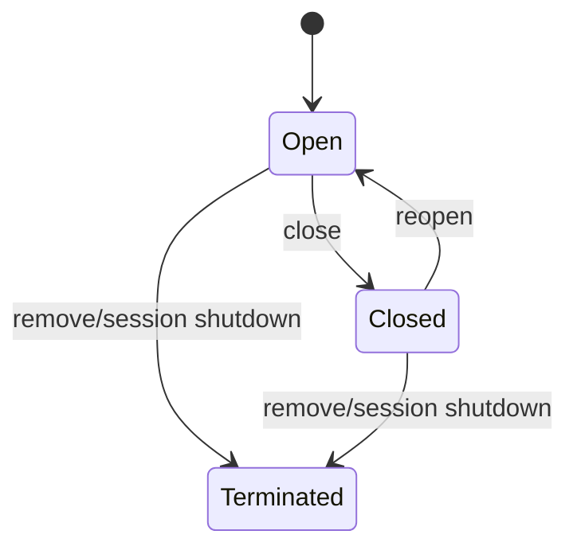

# Multi-Agent Runtime Model

> Status: proposed
> Extends: [Single-Agent Runtime Model](single-agent-runtime-model.md)
> Technical base: [Single-Agent Actor Runtime Design](single-agent-actor-runtime-design.md)
> Migration plan: [Multi-Agent Runtime Migration](multi-agent-runtime-migration.md)

## 1. Purpose

This document defines piko's multi-agent business and Actor model.

The stable multi-agent structure is an `AgentInstance` tree. Each instance owns
a private transcript and may run many short-lived Agent Executions. Executions
do not form the durable Agent hierarchy and do not know that a tool call may
create or address another Agent.

The highest-level invariant is:

> Every multi-agent operation is authorized, routed, supervised, and observed
> through `AgentRuntime`. LLMs can request multi-agent behavior only through
> typed tools backed by `AgentRuntime`.

## 2. Mental Model

```text
Conversation Session
  └─ AgentInstance Tree
      ├─ root AgentInstance
      │   └─ 1..N Agent Executions
      ├─ coder AgentInstance
      │   └─ 1..N Agent Executions
      └─ reviewer AgentInstance
          └─ 1..N Agent Executions
```

Every Execution retains the single-agent inner model:

```text
Agent Execution
  └─ 1..N Model Steps
      └─ 0..N Tool Executions
```

An Interaction Turn still directly binds one root Execution:

```text
Interaction Turn 1 ── 1 root Agent Execution
```

A spawn or agent-message tool may cause another AgentInstance to run an
Execution, but that causality remains encapsulated inside the Tool Execution.
There is no Execution Tree or Execution Dependency Graph in the domain model.

## 3. Core Concepts

### 3.1 Agent Specification

An Agent Specification is immutable capability configuration.

```rust
struct AgentSpec {
    id: AgentSpecId,
    name: String,
    role: String,
    system_prompt: String,
    model: Option<ModelConfig>,
    tools: ToolCapabilitySet,
    thinking: Option<ThinkingConfig>,
}
```

hostd owns specification discovery, precedence, validation, and user
configuration. AgentRuntime receives a resolved immutable snapshot.

`agent_spec_id` is never a runtime address. Multiple AgentInstances may use the
same specification.

### 3.2 AgentInstance

An AgentInstance is a long-lived, addressable Agent member within one Session.

```rust
struct AgentInstanceIdentity {
    session_id: SessionId,
    agent_instance_id: AgentInstanceId,
    agent_spec_id: AgentSpecId,
    parent_agent_instance_id: Option<AgentInstanceId>,
}
```

An AgentInstance owns:

- a stable runtime identity;
- a private durable transcript;
- an inbox and follow-up queue;
- at most one active Execution;
- historical Execution outcomes;
- child AgentInstance identities;
- open/closed lifecycle;
- unread detached reports and notifications.

The AgentInstance remains addressable after one Execution finishes. It may
accept later input and start another Execution with its existing private
context.

### 3.3 AgentInstance Tree

The stable multi-agent hierarchy is defined only by:

```text
parent_agent_instance_id
```

```text
root AgentInstance
├─ scout AgentInstance
├─ coder AgentInstance
│  └─ reviewer AgentInstance
└─ another scout AgentInstance
```

The tree answers:

- who created this AgentInstance;
- how Agent capabilities and quotas are inherited;
- how the TUI displays Agent hierarchy;
- how Session recovery rebuilds Agent relationships;
- which parent may address or manage a child.

It is never inferred from Agent Specification, display name, Execution order,
tool-call order, or transcript storage path.

### 3.4 Agent Execution

An Agent Execution is one input-driven run belonging to one AgentInstance.

```rust
struct ExecutionIdentity {
    session_id: SessionId,
    execution_id: ExecutionId,
    agent_instance_id: AgentInstanceId,
    source_turn_id: Option<TurnId>,
    origin_execution_id: Option<ExecutionId>,
    origin_tool_call_id: Option<ToolCallId>,
}
```

`origin_execution_id` and `origin_tool_call_id` are audit and idempotency
metadata. They do not create an Execution Graph and do not drive completion.

Relations:

```text
AgentInstance 1 ── N Execution
Execution     1 ── 1 AgentInstance
Execution     1 ── 1 terminal outcome
```

### 3.5 Agent Report

Every terminal Agent Execution produces a bounded report:

```rust
struct AgentExecutionReport {
    agent_instance_id: AgentInstanceId,
    execution_id: ExecutionId,
    outcome: ExecutionOutcomeSummary,
    summary: String,
    usage: Usage,
    artifacts: Vec<ArtifactRef>,
}
```

The report is suitable for a tool result or inbox entry. It is not the full
private transcript.

## 4. Identity and Cardinality

```text
Session        1 ── N AgentInstance
AgentSpec      1 ── N AgentInstance
AgentInstance  1 ── 0..N child AgentInstance
AgentInstance  1 ── N Execution
Turn           1 ── 1 root Execution
Execution      1 ── 1 terminal outcome
```

Runtime operations address:

```text
session_id + agent_instance_id
```

Execution control additionally addresses:

```text
session_id + execution_id
```

Never address a running Agent by `agent_spec_id`, display name, parent ID,
creation order, or tool name.

## 5. AgentInstance Lifecycle

AgentInstance business lifecycle is deliberately small:



Execution activity is a projection:

```text
Idle
Running(execution_id)
WaitingForApproval(execution_id)
Cancelling(execution_id)
```

Execution success or failure does not close the AgentInstance.

## 6. Actor Topology

```text
AgentRuntime
  └─ SessionAgentScope[session_id]
      └─ AgentInstance Tree
          ├─ root AgentActor
          │   └─ active ExecutionActor?
          ├─ coder AgentActor
          │   └─ active ExecutionActor?
          └─ reviewer AgentActor
              └─ active ExecutionActor?
```

### 6.1 AgentRuntime

AgentRuntime owns:

- SessionAgentScope registration;
- AgentInstance identity allocation;
- AgentSpec resolution and immutable snapshots;
- AgentActor registry and parent/child tree projection;
- AgentActor and ExecutionActor spawn, supervision, and reaping;
- all Agent and Execution command routing;
- spawn/send idempotency;
- capability and Session-boundary validation;
- depth, concurrency, count, and detached quotas;
- recovery attachment and shutdown.

AgentRuntime does not directly mutate Agent private transcript or Execution
state.

### 6.2 SessionAgentScope

```rust
struct SessionAgentScope {
    session_id: SessionId,
    ports: Arc<SessionAgentPorts>,
    agents: Mutex<HashMap<AgentInstanceId, AgentHandle>>,
    executions: Mutex<HashMap<ExecutionId, ExecutionHandle>>,
    root_agent_instance_id: AgentInstanceId,
}
```

Ports are immutable and Session-scoped. The scope is not the durable business
Session and is not an Actor.

### 6.3 AgentActor

```rust
struct AgentActor {
    identity: AgentInstanceIdentity,
    spec: AgentSpec,
    transcript: AgentTranscript,
    inbox: VecDeque<AgentInboxItem>,
    follow_ups: VecDeque<PendingAgentInput>,
    active_execution: Option<ExecutionHandle>,
    latest_outcome: Option<ExecutionOutcomeSummary>,
    lifecycle: AgentInstanceLifecycle,
    mailbox: mpsc::Receiver<AgentCommand>,
    snapshot_tx: watch::Sender<AgentSnapshot>,
}
```

AgentActor exclusively owns AgentInstance mutable runtime state and private
transcript. It serializes input for that AgentInstance.

### 6.4 ExecutionActor

ExecutionActor remains exactly the Actor defined by the single-agent technical
model. It understands:

- input Messages;
- Model Steps;
- Tool Executions;
- steering;
- cancellation;
- terminal Execution outcome.

It does not understand:

- AgentInstance Tree;
- child Agent identities;
- spawn attached/detached semantics;
- Agent registry;
- cross-Agent authorization;
- detached report delivery.

For ExecutionActor, `spawn_agent` is an ordinary Tool Execution returning a
ToolResult.

## 7. AgentRuntime Is the Mandatory Boundary

All multi-agent operations pass through AgentRuntime:

```text
LLM tool call ──────────────┐
hostd command ──────────────┼─→ AgentRuntime ─→ AgentActor/ExecutionActor
AgentActor internal request ┘
```

No caller may:

- create AgentActor or ExecutionActor directly;
- retain a target Actor mailbox sender;
- inspect target mutable state;
- modify the Agent registry;
- bypass capability, Session, or quota checks;
- infer an address from Agent Specification or display name.

### 7.1 AgentRuntime API

```rust
#[async_trait]
trait AgentRuntimeApi {
    async fn create_agent(
        &self,
        request: CreateAgentRequest,
    ) -> Result<CreateAgentReceipt, AgentRuntimeError>;

    async fn send_agent_input(
        &self,
        request: SendAgentInputRequest,
    ) -> Result<ExecutionReceipt, AgentRuntimeError>;

    async fn steer_agent(
        &self,
        request: SteerAgentRequest,
    ) -> Result<InputReceipt, AgentRuntimeError>;

    async fn request_cancel_execution(
        &self,
        request: CancelExecutionRequest,
    ) -> Result<CancelReceipt, AgentRuntimeError>;

    async fn close_agent(
        &self,
        request: CloseAgentRequest,
    ) -> Result<AgentSnapshot, AgentRuntimeError>;

    async fn reopen_agent(
        &self,
        request: ReopenAgentRequest,
    ) -> Result<AgentSnapshot, AgentRuntimeError>;

    async fn agent_snapshot(
        &self,
        session_id: SessionId,
        agent_instance_id: AgentInstanceId,
    ) -> Result<AgentSnapshot, AgentRuntimeError>;

    async fn list_agents(
        &self,
        session_id: SessionId,
    ) -> Result<Vec<AgentSnapshot>, AgentRuntimeError>;
}
```

Public and internal callers use the same validation and routing path.

## 8. Agent Commands

AgentActor mailbox is private to AgentRuntime.

```rust
enum AgentCommand {
    SendInput {
        request: SendAgentInputRequest,
        reply: oneshot::Sender<Result<ExecutionReceipt, AgentRuntimeError>>,
    },
    Steer {
        request: SteerAgentRequest,
        reply: oneshot::Sender<Result<InputReceipt, AgentRuntimeError>>,
    },
    ExecutionFinished {
        execution_id: ExecutionId,
        outcome: ExecutionOutcome,
    },
    CollectReport {
        execution_id: ExecutionId,
        reply: oneshot::Sender<Result<AgentExecutionReport, AgentRuntimeError>>,
    },
    Close {
        reply: oneshot::Sender<Result<AgentSnapshot, AgentRuntimeError>>,
    },
    Reopen {
        reply: oneshot::Sender<Result<AgentSnapshot, AgentRuntimeError>>,
    },
    Snapshot {
        reply: oneshot::Sender<AgentSnapshot>,
    },
    Shutdown {
        reply: oneshot::Sender<()>,
    },
}
```

Mailboxes are bounded. Mailbox delivery is not business acknowledgement.

## 9. Input Delivery

`send_agent_input` targets an AgentInstance and declares delivery policy:

```rust
enum AgentInputDelivery {
    StartWhenIdle,
    SteerActive,
    FollowUp,
}
```

Behavior:

| Agent state | Delivery | Result |
|---|---|---|
| Idle | StartWhenIdle | create a new Execution |
| Idle | SteerActive | reject: no active Execution |
| Running | StartWhenIdle | reject busy |
| Running | SteerActive | forward to active Execution boundary |
| Running | FollowUp | queue; start a later Execution |
| Closed | any input | reject until reopened |

AgentActor starts at most one active Execution at a time.

## 10. Multi-Agent Tool Boundary

LLMs cannot call AgentRuntime directly. They call typed tools implemented by a
thin `MultiAgentToolProvider`.

```rust
struct MultiAgentToolProvider {
    runtime: Arc<dyn AgentRuntimeApi>,
}
```

The provider only:

- validates tool arguments;
- receives trusted caller context from ExecutionActor;
- constructs typed AgentRuntime requests;
- awaits receipts or outcomes;
- converts results to ToolResult.

It does not create Actors, mutate registries, own transcripts, maintain result
caches, or decide authorization.

### 10.1 Trusted caller context

```rust
struct ToolExecutionContext {
    session_id: SessionId,
    caller_agent_instance_id: AgentInstanceId,
    caller_execution_id: ExecutionId,
    tool_call_id: ToolCallId,
}
```

This context is injected by the runtime. The LLM cannot provide or override it.

Tool arguments contain business input only, for example:

```json
{
  "agentSpecId": "coder",
  "prompt": "Review the storage implementation"
}
```

The LLM cannot forge `session_id`, caller identity, parent identity, or origin
Execution identity.

## 11. Multi-Agent Tools

### 11.1 spawn_agent

Creates a child AgentInstance and waits for its first Execution result.

```text
spawn_agent tool
  → AgentRuntime.create_agent(parent = caller AgentInstance)
  → AgentRuntime.send_agent_input(child, prompt)
  → await first Execution terminal outcome
  → return AgentExecutionReport as ToolResult
```

The tool future remains pending while the child runs. Therefore the parent Tool
Execution, Model Step, and Execution naturally wait. No attached-child barrier
or Execution dependency model is required.

### 11.2 spawn_agent_detached

Creates a child AgentInstance and starts its first Execution, then returns
immediately after registration and acceptance.

```rust
struct DetachedAgentReceipt {
    agent_instance_id: AgentInstanceId,
    execution_id: ExecutionId,
    status: ExecutionStatus,
}
```

The parent tool finishes immediately. The child continues independently.

### 11.3 send_agent_message

Sends input to an existing AgentInstance through AgentRuntime.

It can:

- start a new Execution when the target is Idle;
- steer an active Execution;
- queue a follow-up Execution.

The target is addressed only by `agent_instance_id`.

### 11.4 get_agent_status

Returns `AgentSnapshot` from the AgentActor/Session projection through
AgentRuntime. It does not read a temporary result cache or subscribe to the
public observation stream.

### 11.5 close_agent and reopen_agent

Lifecycle control always passes through AgentRuntime. Closing rejects new input
but preserves durable Agent identity and transcript. Reopen returns the instance
to an input-accepting state.

## 12. Spawn Await and Cancellation

Attached behavior is implemented inside the `spawn_agent` Tool Execution:

```rust
tokio::select! {
    outcome = spawned.execution.wait_terminal() => outcome,
    _ = tool_cancel.cancelled() => {
        runtime.request_cancel_execution(spawned.execution_id).await?;
        return cancelled_tool_result();
    }
}
```

Detached behavior returns before waiting, so parent cancellation does not
automatically cancel the child.

AgentRuntime may keep a short-lived `SpawnLease` for idempotency, cancellation,
and cleanup:

```rust
struct SpawnLease {
    child_agent_instance_id: AgentInstanceId,
    first_execution_id: ExecutionId,
    origin_tool_call_id: ToolCallId,
    mode: SpawnMode,
}
```

This is runtime supervision metadata, not an Execution dependency graph.

## 13. Private Transcript

Each AgentInstance owns a private transcript.

```text
root AgentInstance transcript
coder AgentInstance transcript
reviewer AgentInstance transcript
```

No two AgentActors share a mutable transcript.

### 13.1 Child initialization

On creation, AgentRuntime builds a bounded initial context according to policy:

```rust
enum AgentContextPolicy {
    DelegatedPromptOnly,
    CallerVisibleContext,
    CallerSummary,
}
```

The default may inherit the caller's visible model context after pruning and
security filtering. Thereafter the child transcript evolves independently.

### 13.2 Cross-Agent exchange

Information crosses Agent boundaries only through explicit Messages and
reports:

```text
delegated prompt
AgentExecutionReport
send_agent_message
collect report
```

Child internal Messages do not automatically enter the parent transcript.

## 14. Detached Reports and Inbox

A detached child result must remain discoverable without automatically
polluting the parent transcript.

```rust
enum DetachedReportDelivery {
    Inbox,
    NotifyAndInbox,
    AutoFollowUp,
}
```

Default behavior:

```text
child Execution terminal
  → durable AgentExecutionReport
  → parent AgentInstance inbox
  → reliable AgentReportAvailable event
```

The parent or user can later collect the report or send another message to the
child. `AutoFollowUp` is an explicit policy, not the default.

## 15. Status and Query Model

```rust
struct AgentSnapshot {
    session_id: SessionId,
    agent_instance_id: AgentInstanceId,
    agent_spec_id: AgentSpecId,
    parent_agent_instance_id: Option<AgentInstanceId>,
    lifecycle: AgentInstanceLifecycle,
    activity: AgentActivity,
    active_execution: Option<ExecutionSnapshot>,
    latest_outcome: Option<ExecutionOutcomeSummary>,
    unread_reports: usize,
}
```

Queries read an Actor-owned projection. There is no independent mutable result
cache that can disagree with AgentActor state or durable records.

## 16. Persistence

hostd SessionActor remains the sole durable writer for:

- AgentInstance creation and lifecycle;
- parent/child AgentInstance links;
- per-Agent private transcript Messages;
- Execution start and terminal outcome;
- AgentExecutionReport and inbox delivery;
- Session observation cursor.

AgentRuntime must commit AgentInstance creation before making the AgentActor
publicly routable:

```text
reserve identity
→ SessionActor commit AgentInstanceCreated
→ register/spawn AgentActor
→ return CreateAgentReceipt
```

If Actor spawn fails after commit, AgentRuntime commits an unavailable or
interrupted Agent state. It does not leave a silently live or silently missing
instance.

### 16.1 Ordering

Ordering remains separated:

```text
agent transcript sequence     one AgentInstance transcript
execution sequence            one Execution
session committed cursor      observation across the Session
```

These sequences are not aliases.

## 17. Observation

Committed Agent events carry:

```text
session_id
agent_instance_id
agent_spec_id
parent_agent_instance_id
session_cursor
```

Execution events additionally carry:

```text
execution_id
execution_seq
```

Realtime deltas remain scoped by `execution_id + message_id` and remain lossy.

A multi-agent UI builds its stable tree from AgentInstance identity and
`parent_agent_instance_id`, never from Execution origin metadata.

## 18. Capability and Security

Every AgentRuntime request validates:

- caller identity from trusted ToolExecutionContext;
- caller and target belong to the same Session;
- caller may create or address the target;
- requested AgentSpec is allowed;
- derived tools are within Session policy;
- cwd and sandbox scope are permitted;
- transcript inheritance policy is allowed;
- depth, count, concurrency, and detached quotas permit the operation;
- request ID/tool-call ID is idempotent.

AgentActor mailboxes and raw handles are private to AgentRuntime.

## 19. Limits and Fairness

```rust
struct MultiAgentLimits {
    max_agent_instances_per_session: usize,
    max_agent_depth: usize,
    max_active_executions_per_session: usize,
    max_detached_executions_per_session: usize,
    max_spawns_per_execution: usize,
    max_concurrent_tools_per_execution: usize,
}
```

AgentRuntime enforces limits before durable creation and Actor spawn. Rejection
becomes a normal tool error without a partial AgentInstance.

Detached work cannot starve root/user work. Session limits compose with
process-wide provider, tool, filesystem, and sandbox limits.

## 20. Failure and Cancellation

### 20.1 Attached spawn

- child success returns a successful tool result;
- child business failure returns an error report the parent model may handle;
- child panic becomes an infrastructure-error report;
- parent/tool cancellation requests cancellation of the awaited child
  Execution;
- failure to commit the report fails the parent tool result path.

### 20.2 Detached spawn

- child terminal outcome is independently durable and observable;
- parent success, failure, or cancellation does not automatically cancel it;
- Session or AgentRuntime shutdown cancels and drains it;
- failed delivery to parent inbox becomes a durable delivery error, not a lost
  report.

### 20.3 Agent lifecycle

- cancelling an Execution does not close its AgentInstance;
- closing an AgentInstance cancels or drains its active Execution according to
  explicit policy;
- parent Agent close does not silently delete child AgentInstances;
- Session shutdown terminates every AgentActor after Execution convergence.

## 21. No Arbitrary Actor Communication

Agents can communicate, but every operation is typed and routed by AgentRuntime.

Allowed:

```text
AgentActor → AgentRuntime.send_agent_input → target AgentActor
ToolProvider → AgentRuntime.create_agent → child AgentActor
hostd → AgentRuntime.agent_snapshot → AgentActor projection
```

Forbidden:

```text
AgentActor → raw target mpsc::Sender
ExecutionActor → child AgentActor object
ToolProvider → registry mutation
LLM arguments → forged Session/caller identity
```

This prevents authorization bypass, await cycles, unbounded messaging, and
registry/state divergence.

## 22. Recovery and Shutdown

### 22.1 Recovery

hostd rebuilds:

- AgentInstance identities and tree;
- private transcripts;
- lifecycle and latest Execution outcomes;
- inbox and unread reports.

AgentRuntime reattaches AgentActors for open instances. Historical Executions
are not restarted without an explicit checkpoint/resume contract. Incomplete
Executions become interrupted outcomes.

### 22.2 Session shutdown

```text
stop new AgentRuntime operations for Session
→ cancel/drain all active Executions
→ persist interrupted outcomes where necessary
→ stop AgentActors child-first
→ flush SessionActor storage
→ detach SessionAgentScope
```

### 22.3 AgentRuntime shutdown

AgentRuntime rejects new operations, cancels all active Executions, drains
ExecutionActors and AgentActors, commits terminal/interrupted state, and clears
scopes.

## 23. Explicit Non-Goals

The design does not support:

- parent/child shared mutable transcript;
- addressing a running Agent by AgentSpec or display name;
- arbitrary Actor-to-Actor mailbox access;
- Execution Tree or Execution Dependency Graph state;
- ExecutionActor awareness of Agent hierarchy;
- MultiAgentToolProvider-owned registry or result cache;
- automatic detached report insertion into parent transcript by default;
- more than one simultaneous Execution per AgentInstance;
- moving an AgentInstance between Sessions.

## 24. Invariants

1. AgentInstance Tree is the only stable multi-agent hierarchy.
2. Every AgentInstance is addressed by `agent_instance_id`.
3. Every Execution belongs to exactly one AgentInstance.
4. AgentSpec is configuration identity, not runtime identity.
5. AgentRuntime arbitrates every multi-agent operation.
6. LLMs access multi-agent behavior only through typed tools.
7. MultiAgentToolProvider is a thin AgentRuntime adapter.
8. AgentActor mailboxes and handles are private to AgentRuntime.
9. AgentActor exclusively owns private transcript and Agent runtime state.
10. ExecutionActor exclusively owns one Execution and does not know Agent
    topology.
11. No AgentActors share mutable transcript state.
12. spawn attached waiting is expressed by the tool future.
13. spawn detached returns after registration and Execution acceptance.
14. Detached outcomes enter durable inbox/notification flow.
15. Status queries use Actor/durable projection, not a separate result cache.
16. SessionActor remains the sole durable Session writer.
17. All mailboxes and concurrency dimensions are bounded.
18. Actor communication is typed, authorized, and routed by AgentRuntime.

## 25. Verification Matrix

### AgentInstance identity and tree

| Scenario | Required result |
|---|---|
| create child | durable child identity and parent link before routing |
| same AgentSpec twice | two independent AgentInstance IDs |
| nested child | stable tree and depth enforcement |
| cross-Session parent | rejected |
| duplicate create request | same receipt or explicit idempotency conflict |
| reopen Session | identical AgentInstance tree and transcripts |

### Agent input and reuse

| Scenario | Required result |
|---|---|
| input to Idle child | new Execution with existing private transcript |
| steer Running child | input reaches active Execution boundary |
| follow-up Running child | later Execution starts after terminal |
| input to Closed child | rejected until reopen |
| Execution failure | AgentInstance remains reusable |

### spawn tools

| Scenario | Required result |
|---|---|
| attached success | child report becomes committed parent tool result |
| attached failure | error report returned; parent may continue |
| attached cancellation | awaited child Execution cancelled |
| detached spawn | immediate durable receipt |
| detached parent terminal | child continues |
| detached completion | durable inbox item and notification |

### Runtime boundary

| Scenario | Required result |
|---|---|
| forged caller fields | ignored/rejected; trusted context wins |
| direct target handle request | no public capability exists |
| full target mailbox | deterministic overload |
| quota exceeded | no partial durable/live AgentInstance |
| old generation exit | cannot remove newer Actor |
| Actor panic | durable failed/interrupted state and cleanup |

### Observation and persistence

| Scenario | Required result |
|---|---|
| concurrent Agent commits | serialized Session cursor |
| independent transcripts | no cross-Agent parent-message corruption |
| child delta lag | no parent or sibling blocking |
| detached report retry | idempotent inbox delivery |
| interrupted Execution | explicit recovery outcome |
| Agent tree UI | keyed by AgentInstance ID and parent link |
