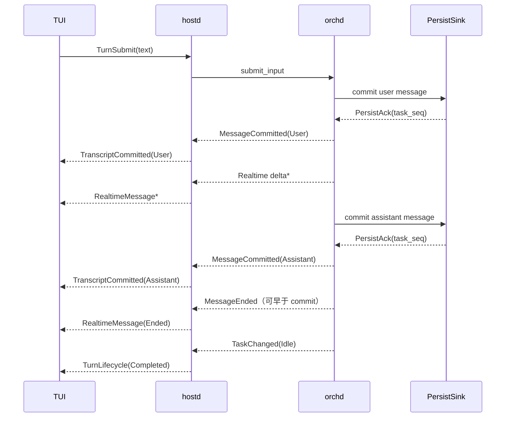

# SessionOutput 到 TUI 的投影设计

> 状态：已落地
> 范围：orchd observation 消费、hostd reconcile、hostd→TUI 线协议与 TUI 实时投影  
> 关联设计：[Task / Turn / Work 生命周期与实时投影架构](turn-lifecycle-and-live-projection.md)、[orchd Events and Observation](../packages/orchd/docs/events-and-observation.md)

## 1. 背景

orchd 已采用新的观察模型：

- `submit_input` 是唯一 user 消息入口；
- `SessionOutput` 包含可靠的 `Event` lane 和可丢的 `Delta` lane；
- `Event` 只在 durable commit 成功后发布；
- `task_seq` 是 task 内的权威持久化顺序；
- `MessageCommitted` 是消息定稿信号；
- `delta_seq` 只提供单条消息内的 realtime 顺序；
- Event 与 Delta 之间没有全局先后保证。

修复前的 hostd→TUI 投影建立在“纯 `DisplayEvent` 流”模型上：hostd 只把 Delta 投影给 TUI，committed 消息主要用于更新 HostState；TUI 则把 Display 当作 transcript 的唯一来源，并在本地乐观插入 user 消息。这使可靠事实、临时草稿和恢复 snapshot 的语义混在同一条客户端路径中。

本文档记录从 `SessionOutput` 到 TUI 的完整生命周期和已经完成的一次性替换契约。`SessionOutput`、`SessionEvent` 与 `RealtimeDelta` 的公开语义保持不变；旧 `DisplayEvent` 中间类型和 Display-centric 兼容路径均已移除。

## 2. 用户可见契约

实时会话应满足：

- 每条 committed user/assistant 消息只显示一次；
- user transcript 只来自服务端 committed 消息；
- assistant delta 可以即时流式展示；
- committed 内容能够修正残缺、重复或乱序到达的 delta 草稿；
- committed 消息按照服务端提供的 task 内顺序展示；
- turn 完成、compaction、agent 切换和 reconnect 不得清空、重复或倒退 committed timeline；
- session open/reconnect 后恢复出的 transcript 与 durable state 一致；
- AgentPanel 中一个 task 只有一个稳定条目。

TUI 可以在提交后立即清空编辑器、更新状态栏或显示 spinner，但不得创建没有服务端 `message_id` 的 transcript 消息。

## 3. 目标与非目标

### 3.1 目标

- 保留 reliable Event 与 best-effort Delta 的语义差异；
- 让 hostd 成为所有用户可见 session 状态的权威投影者；
- 让 TUI 在不依赖 orchd 类型的前提下完成 draft→committed 收敛；
- 定义 live turn、task view、snapshot、reconnect、compaction 和错误恢复；
- 定义一次完成旧 `DisplayEvent` 投影替换所需的实现与验证范围。

### 3.2 非目标

- 修改 orchd 的 task runtime 或持久化语义；
- 为不同 task 创造一个不存在的全局顺序；
- 持久化或回放 realtime delta；
- 让 TUI 推断消息是否已经落盘；
- 重做 Timeline panel 的视觉样式、markdown 或布局。

## 4. 上游权威契约

以下文档是 orchd observation 的上游权威：

- `packages/orchd/docs/events-and-observation.md`
- `packages/orchd/docs/host-integration.md`

本文档不重新定义 `SessionOutput`，只定义 hostd 如何消费它，以及如何向客户端输出稳定投影。

权威层级为：

1. durable task records 及其 `task_seq`；
2. hostd reconcile 后的内存 session projection；
3. hostd 发给 TUI 的 committed transcript projection；
4. TUI 中可丢的 realtime draft。

`MessageCommitted` 表示消息定稿。`MessageEnded` 只表示 realtime generation 结束，不具有持久化含义。

## 5. 状态平面

### 5.1 Durable state

Durable state 通过 orchd `PersistSink` 形成，包括 message、tool、task/work lifecycle 等 committed records。`task_seq` 在单个 task 内定义权威顺序。

hostd 负责把这些 records 投影为用户可见状态。磁盘恢复与实时 reliable notification 必须收敛到相同的 HostState。

### 5.2 Reliable observation

`SessionOutput::Event` 是 commit 后通知。它在 task 内按 `task_seq` 有序，并受 session hub retention/cursor 契约保护。

它通知 hostd durable state 已变化，但不是第二种持久化机制；不同 task 之间没有全局顺序。

### 5.3 Realtime observation

`SessionOutput::Delta` 只用于即时展示：

- 可丢；
- 可能与对应 Event 任意先后到达；
- 不能用于恢复；
- 不得修改 authoritative transcript；
- `delta_seq` 只在一条 message 内排序。

### 5.4 Client projection

hostd→TUI 协议必须在类型上区分：

- committed transcript facts；
- realtime message drafts；
- session hydration/reconciliation；
- task/agent/turn lifecycle；
- interaction 与 approval 等独立领域事件。

TUI 保存这些投影的 presentation cache，但不拥有 session truth。

## 6. Identity 与顺序

### 6.1 Session 和 task

每个 transcript/realtime projection 都必须带 `session_id` 和 `task_id`。TUI 切换 agent/task 只改变当前显示哪个 task projection，不改变 hostd 消费哪些 reliable events。

hostd 必须处理 session subscription 中所有 task 的可靠事件，不能用 `active_task_id` 丢弃 committed facts。

### 6.2 Message identity

`message_id` 同时标识 realtime draft 与最终 committed message，是 TUI upsert 的主键。

hostd 不得合成 `"unknown"` message ID；无法识别 identity 的 delta 应记录诊断并丢弃。TUI 不得创建 local-only transcript identity。

### 6.3 Committed order

`task_seq` 决定单个 task 内 committed records 的顺序。TUI 不能假设事件到达顺序就是 timeline 顺序。

本设计不定义不同 task 之间的 total order。每个 task 有独立 transcript projection，selected task 决定显示内容。

### 6.4 Delta order

TUI 为每个 draft 保存最大已应用 `delta_seq`，忽略重复或倒退的 delta。序号缺口不是 durable consistency error；保留部分草稿并等待 commit 修正即可。

## 7. 目标 hostd→TUI 线协议

目标协议不再把所有用户可见事件塞入一个含义模糊的 `DisplayEvent`，而是在 `ServerMessage` 层区分语义。

### 7.1 TranscriptCommitted

```rust
ServerMessage::TranscriptCommitted {
    session_id,
    task_id,
    agent_id,
    work_id,
    message_id,
    task_seq,
    message,
}
```

它表示已经 durable 的完整 transcript record。`message` 使用 protocol 层的 `Message`，覆盖 user、assistant、tool call 和 tool result。

重复的相同 committed event 必须幂等；相同 `message_id` 出现不同内容或不同 `task_seq` 属于协议不一致，应触发 reconcile，而不是由 TUI 猜测。

### 7.2 RealtimeMessage

```rust
ServerMessage::RealtimeMessage {
    session_id,
    task_id,
    agent_id,
    message_id,
    delta_seq,
    delta,
}
```

`delta` 包含：

- `MessageStarted`；
- `Text`；
- `Thinking`；
- `ToolCall` fragment；
- `MessageEnded`。

这些 variant 只描述草稿展示，不含 commit 语义。

### 7.3 SessionReconciled

```rust
ServerMessage::SessionReconciled {
    session_id,
    reason,
    cursor,
    snapshot,
}
```

`reason` 至少区分：

- initial hydration；
- explicit refresh；
- reconnect；
- reliable retention exhausted。

snapshot 必须带可靠事件边界：TUI 应用 cursor `N` 的 snapshot 后，只继续应用 `N` 之后的 reliable events。

compaction 本身不是无条件 reconcile 的理由，不应发送无版本的破坏性 snapshot。

### 7.4 Lifecycle

Task、turn、agent lifecycle 与 transcript 分开。Agent status update 必须保留稳定 `task_id`，且不得用 `agent_id` 等 fallback 覆盖已知 name、role 或 parent identity。

## 8. SessionOutput 映射

| orchd 输入 | HostState 行为 | TUI projection |
|---|---|---|
| `Delta::MessageStarted` | 不改 transcript | realtime start |
| `Delta::Text` | 不改 transcript | realtime text delta |
| `Delta::Thinking` | 不改 transcript | realtime thinking delta |
| `Delta::ToolCall` | 不改 transcript | realtime tool-call delta |
| `Delta::MessageEnded` | 不改 transcript | realtime end |
| `Event::MessageCommitted` | 确认/更新 committed projection | `TranscriptCommitted` |
| `Event::ToolCommitted` | 确认/更新 committed projection | committed tool/message projection |
| `Event::TaskChanged` | reconcile task/agent state | task/agent lifecycle |
| `Event::WorkChanged` | reconcile work state | 必要的 work/turn projection |
| `Event::InteractionRequested` | 更新 pending state | interaction request |
| `Event::InteractionResolved` | 更新 pending state | interaction resolution |
| `SnapshotRequired` | 获取 snapshot 并重订阅 | `SessionReconciled` |

## 9. Hostd 职责

### 9.1 Subscription ownership

hostd 持有 session-scoped subscription，覆盖 root 与动态 child tasks。task idle/closed 不应关闭 subscription；TUI selected task 改变也不应重建 reliable subscription。

未选中 task 的 realtime projection 可以丢弃，但 hostd 仍需持续消费其输出，且所有 reliable facts 都必须进入对应 task 的 HostState projection。

### 9.2 Durable projection

目标所有权顺序是：

```text
orchd 调用 hostd PersistSink
  → TaskRepository commit 成功
  → hostd 用相同 record 更新 HostState
  → orchd 发布 MessageCommitted
  → hostd 向客户端发布 TranscriptCommitted
```

实现必须使用 projection-aware PersistSink wrapper，或在 durable write 成功后执行 HostState projection callback。正常 `MessageCommitted` 路径不得通过重新读取整个 task shard 来建立 HostState；repository reread 只用于 hydration、reconciliation 与诊断。

如果 notification 到达但 HostState 中不存在对应 committed record，说明可靠投影出现缺口，必须进入 reconciliation。该错误属于 projection/recovery error，不能伪装成 SessionOpen 失败。

### 9.3 Reliable error

hostd 不得对 reliable stream error 直接 `continue`：

- `SnapshotRequired`：获取 snapshot/cursor，reconcile，并从 cursor 后重订阅；
- subscription 意外关闭：不取消 task，进入 reconnect；
- committed projection 失败：标记 projection stale，并触发 reconcile；
- identity mismatch：拒绝错误 projection，保留完整错误上下文。

### 9.4 Active task

`active_task_id` 只属于 presentation policy：

- 不影响 reliable ingestion；
- 不影响 committed HostState；
- 可以影响 realtime 是否向客户端转发；
- task view 切换时，从 HostState hydrate 该 task，再继续 realtime。

### 9.5 Turn completion

turn completed 不负责 finalize message，也不授权 TUI 清空草稿或 timeline。任何 committed 显示都必须来自独立的 committed projection。

### 9.6 Compaction

compaction 改变 durable recovery representation，不改变已经显示的 committed message 含义：

- compaction 更新 storage 和 HostState；
- 不发送导致 TUI 无条件 `timeline.clear()` 的普通 `StateSnapshot`；
- 如需显示 compaction，可发送增量 marker；
- 下次显式 hydration/reconcile 可以使用 compacted snapshot；
- 必须立即 reconcile 时，使用带 cursor 和 reason 的 `SessionReconciled`。

## 10. TUI 职责

### 10.1 Per-task projection

TUI 为每个 task 维护 presentation state，即使当前只渲染一个 task。每条 message 至少保存：

- `message_id`；
- committed `task_seq`（draft 时可空）；
- draft/committed 状态；
- 最大已应用 `delta_seq`；
- 渲染内容。

### 10.2 应用 committed message

收到 `TranscriptCommitted` 后：

1. 校验 session identity；
2. 定位 task projection；
3. 按 `message_id` upsert；
4. 用完整 committed content 替换对应 draft；
5. 标记 committed；
6. 按 `task_seq` 排序；
7. 忽略同 message 后续 realtime mutation；
8. 仅在该 task 被选中时渲染。

### 10.3 应用 realtime message

收到 realtime 后：

1. 校验 identity；
2. 若 message 已 committed，忽略；
3. 创建或查找 `message_id` 对应 draft；
4. 忽略不大于最大值的 `delta_seq`；
5. 只修改 draft presentation。

`MessageEnded` 只结束 streaming 状态，不能标记 committed。

### 10.4 User submit

Enter 后 TUI 发送 `TurnSubmit`，清空 editor，并可显示状态反馈；不得本地执行 `push_user(None, text)`。user message 在服务端 `TranscriptCommitted` 到达后出现。

### 10.5 Snapshot

snapshot application 必须区分：

- hydration：显式打开或初始化 session；
- reconciliation：在确定 cursor 边界上修复 stale projection。

任意普通 command response 不得无条件调用 `timeline.clear()`。是否替换由 response 类型与 reconcile reason 决定。

### 10.6 AgentPanel

AgentPanel 以 `task_id` 为实体键：

- connect/list/hydration upsert 完整 AgentInfo；
- status/disconnect 只更新现有 task 状态；
- disconnect 不得把 name 改为 `agent_id`；
- closed task 按 hostd policy 从 active list prune；
- SessionOpened hydration 必须含 agent state，或随后请求权威 AgentList。

## 11. Event 与 Delta 的合法顺序

### 11.1 Delta 后 commit

```text
Started → Delta* → Ended → Committed
```

正常展示 draft，commit 到达后完整替换。

### 11.2 Commit 早于 Ended

```text
Started → Delta* → Committed → Ended/late Delta*
```

commit 替换 draft，后续 realtime 全部忽略。

### 11.3 Commit 早于所有 Delta

```text
Committed → Started/Delta*/Ended
```

按 `task_seq` 插入 committed message，后续 realtime 全部忽略。

### 11.4 Delta 缺失

```text
Started → 部分 Delta → Committed
```

或只有：

```text
Committed
```

两者都必须收敛到相同最终消息。

### 11.5 只有 Delta，没有 commit

结果始终是非权威 draft。turn failure、cancel、reconnect 或 reconcile 可以移除它，它不得进入 recovered transcript。

### 11.6 重复投递

- committed：按 `message_id` 幂等；
- realtime：按 `message_id + delta_seq` 幂等；
- task/agent：按 task identity 与 lifecycle order upsert。

## 12. 生命周期

### 12.1 Live turn



### 12.2 Open/reconnect

```text
获取 snapshot 与 cursor N
→ subscribe_session(after N)
→ TUI 应用 SessionReconciled(snapshot, N)
→ 应用 N 之后的 reliable projections
→ opportunistically 应用 realtime projections
```

snapshot 可以来自 hostd storage，不要求直接来自 orchd；关键是不丢失 snapshot 与订阅之间的可靠事件边界。

### 12.3 SnapshotRequired

```text
SnapshotRequired
→ hostd 重建权威 snapshot
→ 从 snapshot cursor 后重新订阅
→ 向 TUI 发送 SessionReconciled
→ TUI 在 cursor 边界替换 projection
```

### 12.4 Compaction

```text
TurnCompleted
→ hostd compact durable state
→ 更新 storage/HostState
→ 不发送破坏性 live StateSnapshot
```

## 13. 错误处理

### 13.1 Committed record 无法投影

hostd 必须记录 session/task/agent/message identity 及完整 storage cause，标记 projection stale，并触发 reconcile。不能继续吞掉可靠缺口，也不能将错误包装成 SessionOpen 失败。

### 13.2 Invalid shard

错误必须保留具体原因：

- header 缺失或重复；
- session/task/agent identity mismatch；
- `task_seq` expected/actual；
- record 损坏或读取到不完整数据。

只有 path 的错误信息不足以诊断。

### 13.3 Delta lag/gap

Delta 丢失是正常情况，不触发 durable reconcile；保留已有 draft，等待 committed content 修正。

### 13.4 Subscription close

subscription 关闭不取消 task。hostd 进入 snapshot+cursor resubscribe；TUI 可以显示 streaming degraded，但保留 committed timeline。

## 14. 不变量

1. TUI 不创建没有服务端 `message_id` 的 transcript message。
2. realtime event 永不修改 committed message。
3. committed projection 必须包含 `task_seq`。
4. 同 task committed records 按 `task_seq` 展示。
5. delta 缺失不影响 commit 后的最终内容。
6. `MessageEnded` 永不替代 `MessageCommitted`。
7. reliable event 不因 task 未选中而被丢弃。
8. task view 只影响展示，不影响 ingestion。
9. compaction 不触发无版本的破坏性 timeline replacement。
10. status-only agent event 不降低已知 display metadata。
11. reliable gap 触发 reconcile，不能静默继续。
12. TUI 不依赖 orchd 内部类型。

## 15. 已实施范围

本设计没有兼容期或双协议运行模式。以下改动作为同一个原子交付完成：

### 15.1 Protocol

- 删除 hostd→TUI 对旧 `ServerMessage::Display(DisplayEvent)` 的依赖；
- 增加顶层 `TranscriptCommitted`、`RealtimeMessage` 和 `SessionReconciled`；
- committed event 携带完整 `Message`、`message_id` 和 `task_seq`；
- realtime event 携带可靠 identity 和 `delta_seq`；
- interaction、agent、task 和 turn lifecycle 使用各自明确的领域消息；
- 删除 `ServerMessage::Display` 与 `DisplayEvent`；orchd 使用本地 realtime step event 生成语义不变的 `SessionOutput::Delta`，原有 tool execution、interaction 等客户端事件迁移到各自明确的顶层领域消息。

### 15.2 Hostd

- 分离 reliable Event、realtime Delta 和 stream error handlers；
- 在 PersistSink durable success 边界更新 HostState；
- 将 `MessageCommitted` 投影为完整 `TranscriptCommitted`；
- 正常 commit notification 路径不再 reread 整个 shard；
- reliable ingestion 不再按 `active_task_id` 过滤；
- 透传 `delta_seq`，移除 `"unknown"` message identity；
- 实现 snapshot+cursor reconciliation 和 `SnapshotRequired` recovery；
- 停止 compaction 后的破坏性 live `StateSnapshot`；
- agent projection 保留完整 identity，closed task 从 active projection prune。

### 15.3 TUI

- 移除乐观 `push_user(None, text)`；
- 按 task 保存 draft/committed message projection；
- committed message 按 `message_id` upsert、按 `task_seq` 排序；
- realtime message 按 `message_id + delta_seq` 应用；
- committed 后忽略同 message 的迟到 delta；
- 区分 hydration 与 reconciliation，不再对普通 snapshot response 无条件 `timeline.clear()`；
- AgentPanel 以 `task_id` 为实体键，status update 不得降低 name/role/parent metadata。

### 15.4 删除旧行为

同一次变更必须删除：

- assistant 最终态只依赖 Delta/`Finalized` 的路径；
- user transcript 的本地乐观 identity；
- commit 后 reread whole shard 的正常投影路径；
- active-task reliable event filtering；
- compaction 触发的无版本 timeline replacement；
- `AgentDisconnected` 导致的 fallback AgentEntry；
- reliable stream error 的静默 `continue`。

合并前不得保留 feature flag、双写或新旧协议 fallback。协议、hostd 与 TUI 必须在同一提交序列中保持可编译，并在最终提交上只运行新模型。

## 16. 验证

### Protocol

- committed/realtime/reconcile DTO 序列化 round-trip；
- identity 和 sequence 字段完整；
- 确认全 workspace 不再存在 `ServerMessage::Display` 与 `DisplayEvent`。

### Hostd

- user/assistant commit 各产生一次完整 projection；
- 未选中 task 的可靠事实不会丢失；
- Event-first 与 Delta-first 收敛一致；
- `SnapshotRequired` 触发 reconcile；
- compaction 不发送破坏性 live snapshot；
- projection failure 保留具体 storage cause；
- closed task 从 active agent projection 移除。

### TUI

- submit 不创建本地 transcript；
- user commit 只插入一次；
- assistant commit 替换部分 draft；
- late delta 不修改 committed content；
- duplicate commit 为 no-op；
- 到达乱序时仍按 `task_seq` 展示；
- hydration 可替换 session，普通 live response 不清空 timeline；
- disconnect 不覆盖 agent name。

## 17. 已确定的实现选择

1. ToolCall/ToolResult 使用统一 `TranscriptCommitted` 进入 transcript；独立 `ToolExecution` 只表达非 transcript 的执行进度。
2. Initial hydration 使用 hostd-owned session revision 作为 cursor；orchd retention recovery 使用 `SessionRuntimeSnapshot.cursor`。
3. hostd 丢弃未选中 task 的 realtime delta，但可靠 committed facts 会进入 HostState 并发送给 TUI 的 per-task projection。

这些选择不改变核心不变量：committed state 权威、realtime state 可丢、TUI 按服务端 identity 和 task sequence 收敛。
