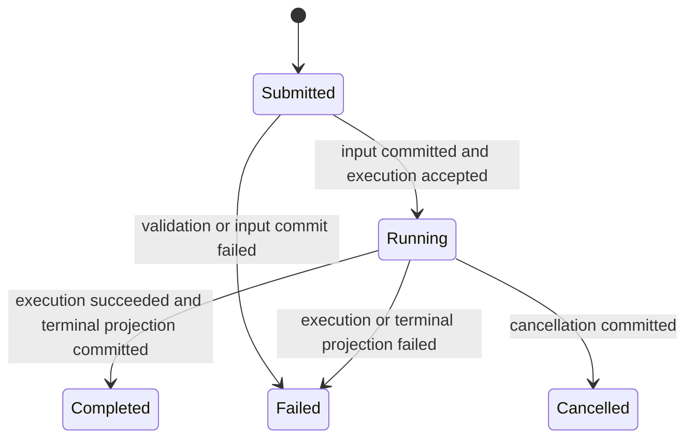
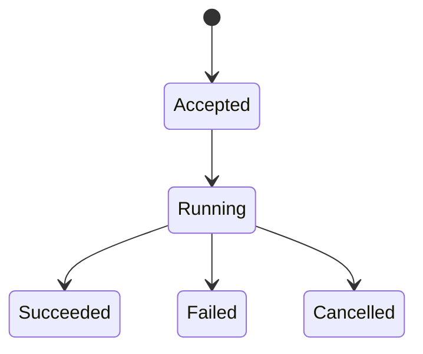

# Single-Agent Runtime Model

> Status: normative
> Scope: single-agent hostd/orchd architecture

## 1. Purpose

This document defines the stable concepts, identities, lifecycles, ownership
boundaries, and invariants of piko's single-agent runtime.

It describes what the system means. It does not describe the current
implementation, migration phases, compatibility shims, or file-level changes.
Those belong in [Single-Agent Runtime Migration](single-agent-runtime-migration.md).
The Tokio realization is defined in
[Single-Agent Actor Runtime Design](single-agent-actor-runtime-design.md).

## 2. Mental Model

```text
Conversation Session
  └─ Interaction Turn
      └─ Agent Execution
          └─ 1..N Model Steps
              └─ 0..N Tool Executions
```

Messages form the durable conversation history shared across Interaction Turns.

The layers answer different questions:

| Concept | Question |
|---|---|
| Conversation Session | Which durable conversation is this? |
| Interaction Turn | Has this user request reached a visible outcome? |
| Agent Execution | Has the agent finished processing this request? |
| Model Step | What happened in this provider request and its tool batch? |
| Tool Execution | What happened in this tool invocation? |
| Message | Which conversation fact was durably committed? |

## 3. Core Concepts

### 3.1 Conversation Session

A Conversation Session is the long-lived user conversation and durable history.

It owns:

- `session_id`;
- cwd and session metadata;
- the append-only message and metadata tree;
- the selected branch or leaf;
- model, tool, prompt, and compaction configuration;
- historical Interaction Turns;
- the current live projection.

The Conversation Session is owned by hostd. orchd never creates, forks,
renames, selects, or persists a Session independently.

### 3.2 Interaction Turn

An Interaction Turn is one accepted user request, from submission until a
user-visible terminal outcome.

It is owned by hostd and identified by `turn_id`.

```text
Submitted → Running → Completed | Failed | Cancelled
```

An Interaction Turn is the lifecycle used by the TUI for active-state and
spinner convergence. It is not one model request and it is not one tool call.

### 3.3 Agent Execution

An Agent Execution is orchd processing one accepted Interaction Turn.

It is identified by `execution_id`.

```text
Accepted → Running → Succeeded | Failed | Cancelled
```

In the single-agent model:

```text
Interaction Turn 1 ── 1 root Agent Execution
```

The identities remain distinct because they have different owners and commit
points:

- orchd decides the Execution outcome;
- hostd commits the Turn outcome after the matching Execution outcome is
  durably visible.

An Agent Execution owns live execution state:

- cancellation;
- the current model stream;
- the current Model Step;
- pending Tool Executions;
- usage accumulated during the Execution;
- steering input accepted into the Execution;
- the terminal Execution outcome.

Execution state is temporary. It is not the durable conversation authority.

### 3.4 Model Step

A Model Step is one provider request and the immediate tool batch requested by
its assistant response.

```text
context snapshot
  → provider request and response stream
  → finalized assistant message
  → zero or more tool calls
  → tool results
  → Model Step result
```

If tools were called, the same Agent Execution normally starts another Model
Step using the committed tool results. A Model Step is internal to orchd and has
no user-visible lifecycle.

llmd understands Model Steps. It does not understand Conversation Sessions,
Interaction Turns, or Agent Execution lifecycle.

### 3.5 Tool Execution

A Tool Execution is one invocation of one tool call within a Model Step. It is
identified by `tool_call_id` and owns:

- validated arguments;
- approval or user-interaction wait state;
- partial output;
- final result or error.

A normal tool error becomes a tool-result Message and allows the Agent
Execution to continue. Infrastructure failure, cancellation, or an explicit
terminal tool result may end the Execution.

### 3.6 Message

A Message is a durable conversation fact:

- user message;
- assistant message;
- tool-result message;
- explicitly supported contextual or custom message.

hostd owns Message durability. orchd decides which runtime artifacts are valid
transcript Messages and requests their commit through a host-provided port.

Realtime deltas are not Messages and are never recovery sources.

## 4. Identity and Cardinality

The single-agent model uses these identities:

| Identity | Owner | Lifetime |
|---|---|---|
| `session_id` | hostd | Conversation Session |
| `turn_id` | hostd | one Interaction Turn |
| `execution_id` | orchd contract, allocated before start | one Agent Execution |
| `message_id` | message submitter/runtime | permanent Message identity |
| `tool_call_id` | model response | one Tool Execution |
| `request_id` | API caller | idempotency window |

Cardinality:

```text
Conversation Session 1 ── N Interaction Turn
Interaction Turn    1 ── 1 root Agent Execution
Agent Execution     1 ── 1..N Model Step
Model Step          1 ── 1 Assistant Message
Model Step          1 ── 0..N Tool Execution
```

`turn_id` and `execution_id` are never aliases in the type system, even when
their values are allocated together.

## 5. State Machines

### 5.1 Interaction Turn



Every accepted `turn_id` has exactly one terminal outcome. Replaying the same
outcome is idempotent. Conflicting outcomes are protocol errors.

### 5.2 Agent Execution



Every Execution uses one finalizer. Success, provider error, tool
infrastructure error, cancellation, panic, persistence failure, and stream
termination all pass through it.

### 5.3 Session Activity

Session activity is a live projection, not an independent lifecycle:

```text
Idle                         no active Execution
Running(execution_id)        active Execution
WaitingForApproval(...)      active Execution blocked on a host decision
Cancelling(execution_id)     cancellation requested, terminal not committed
```

## 6. Execution Loop

One Agent Execution follows this loop:

```text
commit initial user input
  → build context
  → run Model Step
  → commit assistant message
  → if tool calls:
       execute tools
       commit tool results
       run next Model Step
  → else if steering is pending:
       commit steering input
       run next Model Step
  → else:
       finalize Execution
```

The initial user Message must be durably committed before the first provider
request. Every later Message must be durably committed before it enters reusable
model context.

## 7. Input Semantics

### 7.1 New-Turn Input

When no Execution is active, a user message creates a new Interaction Turn and
Agent Execution.

### 7.2 Steering Input

Steering is input submitted while an Execution is active. It is delivered after
the current Model Step finishes, including its tool calls, and before the next
provider request.

Steering remains part of the same Interaction Turn and Agent Execution. It does
not create another Turn or Execution.

### 7.3 Follow-Up Input

Follow-up is input submitted while an Execution is active but intended to run
after the active Execution settles.

Follow-up is owned by hostd queueing:

1. the current Execution and Turn reach a terminal outcome;
2. hostd creates a new Interaction Turn;
3. hostd starts a new Agent Execution with the queued input.

Every user-visible submission therefore has one explicit Turn identity and one
terminal outcome.

## 8. Runtime Shape

```text
hostd SessionAggregate
  ├─ durable entry store
  ├─ Turn state machine
  ├─ configuration
  ├─ approval and interaction state
  └─ live projection
          │
          │ StartExecution + scoped capabilities
          ▼
orchd AgentExecutor
  └─ ActiveExecution?             at most one in single-agent mode
      ├─ ExecutionState
      ├─ Model Step loop
      ├─ Tool Executor
      ├─ control channel
      └─ ExecutionFinalizer
```

orchd may cache reconstructed transcript and static execution resources for an
attached Session. The cache is not an independent business aggregate and can be
discarded and rebuilt from hostd state.

## 9. Stream and Process Semantics

An Execution continues independently of observer subscriptions.

```text
control input ──→ Execution process ──→ reliable committed events
                         │
                         └────────────→ best-effort realtime deltas
```

One short-lived supervised process may drive an active Execution. Its control
channel exists only for the Execution lifetime. There is no permanent
per-conversation actor waiting for future Turns.

Dropping or reconnecting a subscription does not cancel the Execution.
Cancellation is explicit through the Execution control API.

## 10. Ownership and Responsibilities

### 10.1 hostd

hostd owns:

- Session identity, metadata, tree, and selected branch;
- durable Message and Turn records;
- Turn allocation and lifecycle;
- prompt expansion and user input command routing;
- model, auth, settings, and resource resolution;
- approval and user-interaction authority;
- queued follow-up input;
- compaction policy and durable compaction records;
- live user-visible projection;
- recovery and interruption handling;
- the TUI-facing protocol.

hostd provides immutable session- or execution-scoped capabilities to orchd:

- Message commit;
- Execution lifecycle commit;
- approval request;
- user-interaction request;
- reliable event publication when publication is separate from commit;
- resolved model and tool configuration.

### 10.2 orchd

orchd owns:

- validating and accepting one Agent Execution;
- model context assembly from supplied durable context;
- provider stream consumption;
- assistant message assembly;
- tool-call validation and execution;
- deciding what becomes a transcript Message;
- steering delivery at Model Step boundaries;
- active Execution cancellation;
- Execution usage aggregation;
- the deterministic Execution outcome;
- finalization of every execution path.

orchd does not own:

- Session creation or persistence layout;
- Turn allocation or client-visible terminal state;
- globally rebindable session capabilities;
- an independent durable transcript;
- user-facing approval state;
- configuration files or auth credentials;
- TUI projections.

### 10.3 llmd

llmd owns:

- provider request execution;
- provider response streaming;
- provider-specific protocol adaptation;
- model usage and provider error reporting for one Model Step.

llmd does not own agent looping, tool execution, Turn state, or Session state.

### 10.4 TUI

The TUI owns presentation only:

- editor state;
- realtime rendering;
- spinner and status rendering from hostd projection;
- user responses to approval and interaction prompts.

The TUI never infers completion from stopped deltas or an assistant message
ending.

## 11. Persistence and Observation

The commit order is:

```text
orchd proposes durable fact
  → hostd validates identity and ordering
  → hostd appends durable record
  → hostd updates live projection
  → hostd returns CommitAck
  → orchd updates execution-local context
  → committed notification becomes observable
```

Rules:

1. No provider request starts before initial user-message CommitAck.
2. No Message enters reusable model context before CommitAck.
3. Reliable committed events publish only after projection is visible.
4. Realtime deltas are best-effort and never used for recovery.
5. Observation never drives the Execution state machine.
6. Command acknowledgement does not depend on observing the public event stream.
7. Live observation reads hostd projection, not an actively appended JSONL file.

## 12. Command and Event Contract

A minimal orchd-facing capability provides:

```text
start_execution
steer_execution
cancel_execution
execution_snapshot
subscribe_session
```

Every execution command is addressed by `session_id + execution_id`. Commands
use `request_id` for idempotency.

Reliable execution events include:

```text
ExecutionAccepted
ExecutionStarted
MessageCommitted
ToolExecutionStarted
ToolExecutionCompleted
ExecutionSucceeded
ExecutionFailed
ExecutionCancelled
```

Realtime events include only partial assistant or tool output.

## 13. Recovery

On Session open, hostd:

1. reads durable entries;
2. rebuilds the active branch and conversation context;
3. rebuilds Turn history and live projection;
4. marks a non-terminal historical Turn without a provably live Execution as
   interrupted or failed;
5. supplies clean context when the next Execution starts.

Transcript recovery does not imply recovery of an old background process.
Resumable execution requires an explicit durable checkpoint contract.

## 14. Single-Agent Invariants

1. A Session has at most one active Agent Execution.
2. An accepted Interaction Turn binds exactly one root `execution_id`.
3. Every accepted Turn and Execution has exactly one terminal outcome.
4. One Execution may contain multiple Model Steps.
5. Tool continuation stays in the same Execution.
6. Steering stays in the current Execution and is delivered only at a Model Step
   boundary.
7. Follow-up creates a later Turn.
8. Cancellation targets the active Execution and converges to a durable terminal
   outcome.
9. Durable Messages are committed before entering reusable model context.
10. Public observation is not an acknowledgement mechanism.
11. Subscriber disconnect does not cancel execution.
12. Session-scoped capabilities cannot be rebound globally.
13. hostd is the only durable Session and Turn authority.
14. orchd is the only active Execution state-machine owner.
15. TUI state is a projection and never a recovery source.

## 15. Multi-Agent Extension Boundary

Multi-agent support extends Agent Execution. It does not replace the
single-agent model.

The first extension is an execution tree:

```text
Conversation Session
  └─ Interaction Turn
      └─ root Agent Execution
          ├─ attached child Execution
          └─ detached child Execution
```

Permanent cardinality:

```text
Interaction Turn 1 ── 1 root Agent Execution
Agent Execution  1 ── 0..N child Execution
```

The Turn directly binds only the root Execution. Child causality is expressed
through `parent_execution_id`.

### 15.1 Reserved Execution Identity

The Execution identity model permits:

```text
session_id
execution_id
source_turn_id
parent_execution_id
agent_spec_id
```

In single-agent mode:

```text
source_turn_id       = Some(turn_id)
parent_execution_id  = None
agent_spec_id         = main
```

The fields need not all be exposed in the first public API, but implementations
must not make them impossible to add without changing Execution semantics.

### 15.2 Agent Specification

An Agent Specification is immutable configuration selected for an Execution:

- system prompt;
- model and thinking configuration;
- tool capabilities;
- display metadata.

An Agent Specification is not a running identity. Multiple Executions may use
the same specification.

### 15.3 Child Completion Policy

Child relation uses an explicit completion policy:

```text
Attached   parent terminal barrier waits for child outcome
Detached   parent does not wait; child remains independently observable
```

Attached and detached are relation policies, not separate Agent or Execution
types.

### 15.4 Child Transcript

The first multi-agent extension uses a private transcript per child Execution:

```text
parent context snapshot
  → child private Execution context
  → child terminal report
  → parent tool-result Message
```

Child internal Messages do not automatically enter the parent transcript.

### 15.5 Ordering and Observation

Observation distinguishes:

```text
session cursor       replay order across observed events
execution sequence   causal order inside one Execution
```

The single-agent implementation must not assume those sequences are identical.

### 15.6 Cancellation

Cancellation is always addressed by `execution_id`. A future API may add:

```text
ThisExecution
ExecutionTree
```

Single-agent mode implements only cancellation of the active root Execution.

### 15.7 Long-Lived Agent Instances

A long-lived addressable Agent instance is not part of the initial multi-agent
extension. It is introduced only if a product requirement needs a child to keep
private memory and accept multiple later Executions.

Only then does the additional relationship exist:

```text
Agent Instance 1 ── N Agent Execution
```

The Agent Execution, Model Step, Tool Execution, Message, and Turn definitions
remain unchanged.

## 16. Multi-Agent Compatibility Invariants

The single-agent implementation must preserve these extension points:

1. Execution commands are addressed by `execution_id`, not only `session_id`.
2. `execution_id` and `turn_id` remain distinct types.
3. A Turn binds one root Execution rather than an arbitrary set of Executions.
4. Execution identity can gain `parent_execution_id` and `agent_spec_id`.
5. The active Execution registry can evolve from one optional root to multiple
   concurrent Executions per Session.
6. Execution finalization can gain an attached-child barrier.
7. Transcript access is abstracted so child-private contexts can be introduced.
8. Cancellation can target one Execution without cancelling its Session.
9. Event ordering distinguishes per-Execution sequence from session replay
   cursor.
10. Tool execution can create a child Execution without changing Model Step
    semantics.
