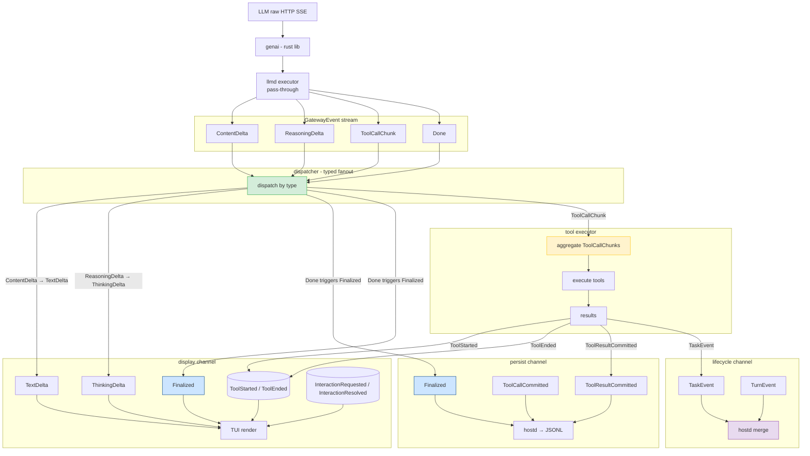
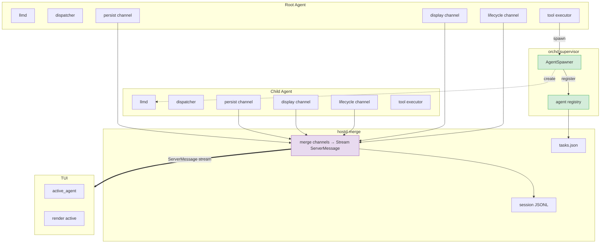

# Stream Architecture

piko 的 stream 架构定义 LLM 原始输出如何流经各处理层，从 HTTP SSE 到 TUI 渲染和持久化落盘。

---

## 1. 概述

piko 以 agent 为执行单元。每个 agent 拥有独立的完整 stream pipeline，不跨 agent 共享或合并。

四层处理模型：

```
Layer 1: llmd         忠实转发 LLM 原始输出，不做业务逻辑
Layer 2: dispatcher   按 GatewayEvent 类型分流到 4 个 consumer channel
Layer 3: consumers    persist（落盘）、display（TUI 渲染）、lifecycle（编排事件）、tool executor（工具执行）
Layer 4: hostd merge  合并 display + lifecycle + persist → ServerMessage → TUI / JSONL
```

---

## 2. 单 Agent 数据流



### 各层职责

| 层 | 组件 | 职责 | 输入 | 输出 |
|---|---|---|---|---|
| 1 | llmd executor | 调用 genai，映射 LLM 响应为 GatewayEvent stream | genai ChatStreamEvent | GatewayEvent stream |
| 2 | dispatcher | 按事件类型分流到对应 consumer channel | GatewayEvent | persist + display + lifecycle + tool executor |
| 3a | persist channel | 接收最终态事件，转换为 SessionTreeEntry，写入 JSONL | PersistEvent | 文件 I/O |
| 3b | display channel | 接收渲染事件，驱动 TUI timeline | DisplayEvent | TUI frame |
| 3c | lifecycle channel | 接收编排事件（Task / Turn 生命周期） | LifecycleEvent | TUI 状态更新 |
| 3d | tool executor | 聚合 ToolCallChunk → 完整 ToolCall → 执行 → 回投结果 | ToolCallChunk stream | ToolStarted/Ended、ToolResultCommitted、TaskEvent |

### DisplayEvent 类型（纯渲染，不含持久化语义）

```rust
pub enum DisplayEvent {
    // message streaming
    TextDelta { task_id, agent_id, message_id, content_index, delta },
    ThinkingDelta { task_id, agent_id, message_id, content_index, delta },
    ToolCallDelta { task_id, agent_id, message_id, content_index, tool_call_id, delta },
    MessageStart { message_id, task_id, agent_id, role },
    MessageEnd { message_id, task_id, agent_id, stop_reason? },
    Finalized { message_id, task_id, agent_id, content, usage?, stop_reason? },

    // tool lifecycle（已展平，ToolEvent 子枚举已删除）
    ToolStarted { task_id, agent_id, tool_call_id, tool_name, args, parent_message_id? },
    ToolEnded { task_id, agent_id, tool_call_id, tool_name, result, is_error },

    // interaction（已展平，InteractionEvent 子枚举已删除）
    InteractionRequested { task_id, agent_id, interaction_id, tool_call_id, title?, questions, require_confirm, auto_resolution_ms? },
    InteractionResolved { task_id, agent_id, interaction_id, status },
}
```

### PersistEvent 类型

```rust
pub enum PersistEvent {
    Finalized { session_id, message_id, task_id, agent_id, message },
    ToolCallCommitted { session_id, message_id, task_id, agent_id, parent_message_id, message },
    ToolResultCommitted { session_id, message_id, task_id, agent_id, message },
    TaskLifecycle(TaskEvent),
}
```

### LifecycleEvent 类型

```rust
pub enum LifecycleEvent {
    Task(TaskEvent),
    Turn(TurnEvent),
}
```

### 关键约束

- **llmd 不做聚合**：ToolCallChunk 为 LLM 原始输出，聚合由 tool executor 负责。
- **类型决定路由**：ContentDelta 只走 display channel。persist channel 不受理中间态事件。
- **持久化与渲染分离**：`PersistEvent` 走 persist channel → JSONL；`DisplayEvent` 走 display channel → TUI。两者不互混。
- **编排事件独立**：`LifecycleEvent` 走 lifecycle channel，不混入 display 或 persist。
- **tool executor 直接回投**：执行完成后不经过 dispatcher，直接向三个 channel 发送结果。

---

## 3. 多 Agent 架构

> **Current implementation note:** Child agents share the same `SessionChannels` as the
> root agent via `DispatchSenders` (fan-in). TUI filtering is handled by `hostd` using
> `active_agent_id`. Per-agent independent channels (as shown in the target diagram below)
> is a planned future enhancement.

### 3.1 原则

- 每个 agent 拥有独立的完整 pipeline
- 不同 agent 的 stream 不合并
- orchd supervisor 统一管理 agent 生命周期
- spawn 语义通过 orchd AgentSpawner 实现

### 3.2 架构图



### 3.3 Orchd Supervisor

supervisor 管理 dispatch instance：

- **AgentDispatch**（per-agent）：每个 agent 一个，消费 LLM GatewayEvent stream，产出到 session channels
- **agent registry**：维护 `HashMap<TaskId, AgentHandle>`，追踪活跃 agent
- **AgentSpawner**：接收 root agent 的 spawn tool call，创建新的 AgentDispatch 实例
- **生命周期管理**：child agent 完成时清理资源，通知订阅了 Done 的父 agent

### 3.4 Spawn 语义

| 语义 | 父 agent 行为 | 子 agent 行为 | 父 agent 获取结果 |
|---|---|---|---|
| `spawn_detached` | tool executor 调用 AgentSpawner，立即返回 task_id | 独立运行完整 pipeline | 后续轮次调用 `poll_task(task_id)` |
| `spawn` | 同 `spawn_detached`，并订阅 child 的 Done event | 同 `spawn_detached` | 通过订阅 Done 作为 tool result 返回 |

---

## 4. TUI Agent 切换

TUI 在内存中维护所有 agent 的 display stream：

```rust
struct TuiState {
    active_agent: AgentId,
    display_streams: HashMap<AgentId, Stream>,
}

fn render(&mut self) {
    let stream = &mut self.display_streams[&self.active_agent];
    // 消费 stream → 更新 timeline → 渲染
}

fn switch_agent(&mut self, agent_id: AgentId) {
    self.active_agent = agent_id;
}
```

- 所有 stream 持续消费，切换时不暂停
- 切换不 reload JSONL，不 reconcile timeline
- 默认显示 root agent

---

## 5. Task Tree Sidecar

Agent 父子关系由 sidecar 文件维护，不写入 JSONL：

**路径**：`<session-dir>/tasks.json`

```json
{
  "task_root_001": {
    "parent_task_id": null,
    "agent_id": "main",
    "status": "running"
  },
  "task_child_a_001": {
    "parent_task_id": "task_root_001",
    "agent_id": "child_a",
    "status": "completed"
  }
}
```

**hostd 管理**：
- `turn_submit` → 创建 root task entry
- spawn tool call → 创建 child task entry
- agent 完成 → 更新 status
- resume → 通过 sidecar 重建 agent 结构
