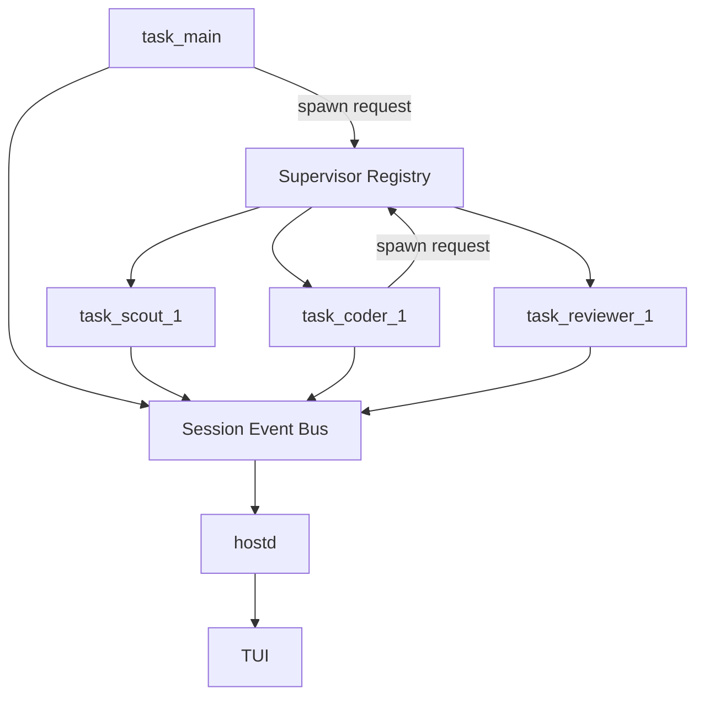

# Stream Architecture

本文档定义 piko 的 stream/runtime 架构边界，重点回答 5 个问题：

1. orchd runtime 实际消费哪些输入流。
2. 这些输入在 runtime 内如何分层与分发。
3. 哪些下游 consumer 负责 display、persist、lifecycle、tool execution。
4. 多 agent 场景下父子 task 的事件如何共存。
5. 哪些事件是恢复事实来源，哪些只是渲染副产物。

Agent template、task instance、resume 总体规范见 `docs/agent-architecture.md`；多 agent 心智模型见 `docs/multi-agent-mental-model.md`。

---

## 1. 核心原则

- **llmd 忠实转发**：llmd 只把 provider 原始响应映射成 `GatewayEvent`，不做业务聚合、不执行工具、不写 session。
- **orchd 负责 runtime 编排**：orchd 负责 task/step 状态机、tool call 聚合、工具执行、task lifecycle 和多 agent 调度。
- **hostd 负责权威用户态**：hostd 是 session storage、task DAG 投影、approval、queue、live view、snapshot 的权威层。
- **display 是渲染流**：只驱动 TUI timeline，不承担恢复语义。
- **persist 是恢复流**：所有会影响 transcript/resume 的事实都必须进入 persist。
- **lifecycle 是状态流**：表达 task/turn 状态迁移，不与 display 混写。
- **task_id 是 runtime 主键**：多 agent DAG、恢复、切换视图、事件路由都以 `task_id` 为主键。

---

## 2. Runtime 分层

稳定的 runtime 需要把 3 个层次分开：

### 2.0 Supervisor / Runtime Registry

- 运行在 orchd 全局作用域，不属于某个单独 task。
- 负责 spawn 请求落地、task handle 注册、task driver 启动、结果缓存、跨 task steer 和关闭回收。
- root task lookup 以 `(session_id, agent_id)` 为作用域，禁止跨 session steer。
- 是 task runtime 的全局注册平面，不是 transcript 或持久化权威层。

### 2.1 Task / Turn Orchestrator

- 处理 task 级输入：start、steer、cancel、close、reopen。
- 维护 task 长生存状态机。
- 决定何时启动下一次 model step。

### 2.2 Step Dispatch

- 处理单次 LLM step 的 `GatewayEvent` 流。
- 聚合 assistant message、tool call chunk、usage、error。
- 产出结构化 `StepDispatchResult`。

### 2.3 Downstream Consumers / Sinks

- 消费按职责分流后的结果。
- 负责 display、persist、lifecycle、tool execution、transcript merge。
- 本地测试和生产环境共享同一批分流结果，只是 sink 不同。

结论：

- supervisor 是全局 task registry。
- `agent_loop` 应是状态机，不应是全能路由器。
- `dispatch` 应是输入分流器，不应只包装 gateway stream。
- dispatch 和 tool runtime 应返回 `StepDispatchResult`、`ToolExecutionResult`
  等专用结果对象，不定义统一 effect union。

---

## 3. 全量 Stream Inputs

从一个 task runtime 的视角，系统稳定存在以下输入流。

### 3.1 Task Start Input

来源：

- hostd 初始化 root task
- supervisor 落地 root/spawn task 创建

典型字段：

- `task_id`
- `agent_id`
- `prompt`
- `host_context { session_id, turn_id }`
- `parent_task_id`
- `source_agent_id`
- `senders`

作用：

- 由 supervisor 注册并创建 task runtime
- 产出 `TaskEvent::Created`
- 进入首轮 `Started/Running`

### 3.2 Steer Input

来源：

- 用户对 root task 的后续输入
- 父 task 对 child task 的 `steer_task`
- hostd/系统对某 task 的补充指令，经 supervisor 路由

典型字段：

- `source_task_id`
- `source_agent_id`
- `message`
- `senders`

作用：

- 唤醒一个 idle task
- 追加新的 user/steering message 到 transcript
- 产出 `TaskEvent::Steered`

### 3.3 Gateway Event Stream

来源：

- llmd provider stream

类型：

- `ContentDelta`
- `ReasoningDelta`
- `ToolCallChunk`
- `Usage`
- `Done`
- `Error`

作用：

- 驱动单次 model step
- 聚合 assistant message
- 聚合完整 tool call 集

### 3.4 Tool Execution Result Stream

来源：

- regular tool runtime
- spawn tool runtime
- interaction/approval resolution

典型字段：

- `tool_call_id`
- `tool_name`
- `result`
- `is_error`
- 对 spawn 类工具还可能包含 `task_id`、child report

作用：

- 生成 `ToolEnded`
- 生成 `ToolResultCommitted`
- 回写 transcript
- 决定是否继续下一 model step

### 3.5 Cancellation Stream

来源：

- hostd turn cancel
- supervisor shutdown
- supervisor cancel
- task driver teardown / handle cleanup

典型字段：

- cancellation token
- shutdown signal

作用：

- 中断当前 model step 或工具执行
- 产出 `TaskEvent::Cancelled` 或 close-related transition

### 3.6 Lifecycle Control Stream

来源：

- hostd close/reopen 指令
- supervisor 对 task handle 的生命周期管理

典型动作：

- `CloseTask`
- `ReopenTask`
- driver channel closed

作用：

- 控制 task 是否继续接受 steer
- 控制 task runtime 是否退出与回收

---

## 4. Runtime Input Matrix

| 输入类型 | 谁消费第一手输入 | 主要产出 |
|---|---|---|
| Task Start | supervisor -> task orchestrator | created/started lifecycle, initial transcript delta, first step launch |
| Steer Input | supervisor -> task orchestrator | steered lifecycle, transcript delta, next step launch |
| Gateway Event | step dispatch | assistant message delta/final, tool call delta, complete tool calls |
| Tool Execution Result | tool consumer + transcript consumer | tool ended, tool result committed, transcript delta |
| Cancellation | supervisor + orchestrator + tool runtime | cancelled lifecycle, aborted execution |
| Lifecycle Control | supervisor + orchestrator | closed/reopened transition, task teardown |

这个矩阵的意义是：

- 不同输入应该先进入哪个 dispatch 层必须清楚。
- 不是所有输入都先进入同一个 `agent_loop` 大分支。

---

## 5. Downstream Consumers

runtime 编排完成后，输入不会直接写 channel，而是流向一组标准 downstream consumer。

### 5.1 Transcript Consumer

职责：

- 维护 task 的内存 transcript。
- 应用来自 start、steer、assistant finalize、tool call commit、tool result commit 的 transcript delta。

特点：

- 只维护运行时上下文。
- 不应直接承担持久化职责。

### 5.2 Display Consumer

职责：

- 产生 `DisplayEvent`。
- 支持 TUI 的流式文字、thinking、tool call、tool execution、interaction 渲染。

事件族：

- `MessageStart`
- `TextDelta`
- `ThinkingDelta`
- `ToolCallDelta`
- `MessageEnd`
- `Finalized`
- `ToolStarted`
- `ToolEnded`
- `InteractionRequested`
- `InteractionResolved`

### 5.3 Persist Consumer

职责：

- 产生 `PersistEvent`。
- 负责 transcript/resume 的事实提交。

事件族：

- `Finalized`
- `ToolCallCommitted`
- `ToolResultCommitted`
- `TaskEventCommitted(TaskEvent)`

要求：

- persist 事件必须可靠投递。
- 本地模式不能静默丢弃 persist 事实。

### 5.4 Lifecycle Consumer

职责：

- 产生 `LifecycleEvent`。
- 描述 task 和 turn 的状态流转。

事件族：

- `LifecycleEvent::Task(TaskEvent)`
- `LifecycleEvent::Turn(TurnEvent)`

要求：

- lifecycle 自己不写 transcript。
- lifecycle 到 persist 的镜像规则应集中在 lifecycle sink，不应在多处重复写。

### 5.5 Tool Runtime Consumer

职责：

- 接收完整 `ToolCallItem` 集合。
- 执行 regular tools。
- 调度 spawn tools。
- 产生 tool 生命周期相关结果。

产物：

- `ToolStarted`
- `ToolEnded`
- `ToolResultCommitted`
- tool result transcript delta

### 5.6 Host Projection Consumer

位置：

- 运行在 hostd，不在 orchd。

职责：

- 消费 display/persist/lifecycle
- 更新 session JSONL
- 更新 task DAG/live view
- 向 TUI 推送 `ServerMessage`

### 5.7 Supervisor Registry Consumer

位置：

- 运行在 orchd，不在 hostd，也不在单独 task loop 内。

职责：

- 接收 spawn/steer/poll/close 之类的跨 task 控制请求。
- 维护 `task_id -> handle` 全局注册表。
- 启动 task driver，把 task stream 接到 session senders。
- 维护 task result cache，供 `spawn`/`poll_task` 读取。
- 在 task 终止或显式关闭后回收注册项。

---

## 6. 标准 Event Categories

### 6.1 PersistEvent

`PersistEvent` 是恢复事实来源。

```rust
pub enum PersistEvent {
    Finalized {
        session_id,
        message_id,
        task_id,
        agent_id,
        message: Message::Assistant,
    },
    ToolCallCommitted {
        session_id,
        message_id,
        task_id,
        agent_id,
        parent_message_id,
        message: Message::ToolCall,
    },
    ToolResultCommitted {
        session_id,
        message_id,
        task_id,
        agent_id,
        message: Message::ToolResult,
    },
    TaskEventCommitted(TaskEvent),
}
```

约束：

- `Finalized`、`ToolCallCommitted`、`ToolResultCommitted` 必须进入 persist。
- `TaskEventCommitted` 是 task DAG/resume 的持久化事实之一。
- `TextDelta`、`ThinkingDelta` 之类中间态不能冒充 persist 事实。

### 6.2 DisplayEvent

`DisplayEvent` 是渲染事件。

```rust
pub enum DisplayEvent {
    MessageStart { message_id, task_id, agent_id, role },
    TextDelta { task_id, agent_id, message_id, content_index, delta },
    ThinkingDelta { task_id, agent_id, message_id, content_index, delta },
    ToolCallDelta { task_id, agent_id, message_id, content_index, tool_call_id, delta },
    MessageEnd { message_id, task_id, agent_id, stop_reason?, error_message? },
    Finalized { message_id, task_id, agent_id, content, usage?, stop_reason?, error_message? },
    ToolStarted { task_id, agent_id, tool_call_id, tool_name, args, parent_message_id? },
    ToolEnded { task_id, agent_id, tool_call_id, tool_name, result, is_error },
    InteractionRequested { task_id, agent_id, interaction_id, tool_call_id, title?, questions, require_confirm, auto_resolution_ms? },
    InteractionResolved { task_id, agent_id, interaction_id, status },
}
```

约束：

- display 不承担恢复语义。
- 但 display 必须保留 `task_id`/`agent_id`，以支持多 agent timeline 路由。

### 6.3 LifecycleEvent

`LifecycleEvent` 是 task/turn 编排状态流。

```rust
pub enum LifecycleEvent {
    Task(TaskEvent),
    Turn(TurnEvent),
}
```

约束：

- orchd 产出 task lifecycle。
- hostd 产出或确认 turn lifecycle。
- lifecycle 与 persist 的双写策略必须集中实现，不能分散在多个 helper 里重复发送。

---

## 7. 单 Task Step Contract

一次标准 model step 应满足以下顺序：

1. task orchestrator 决定启动一次 step。
2. step dispatch 发送 `MessageStart`。
3. 消费 `GatewayEvent` 流。
4. 对 `ContentDelta` / `ReasoningDelta` 发送 display delta。
5. 对 `ToolCallChunk` 聚合成完整 tool calls，并发送 `ToolCallDelta`。
6. 收到 `Done`/`Error`/stream end 后构建 assistant message。
7. 发送 `MessageEnd`。
8. 提交 `PersistEvent::Finalized`。
9. 发送 `DisplayEvent::Finalized`。
10. 提交 `PersistEvent::ToolCallCommitted`。
11. tool runtime consumer 执行 tool calls。
12. 发送 `ToolStarted` / `ToolEnded`。
13. 提交 `ToolResultCommitted`。
14. transcript consumer 合并 tool results。
15. 若还有工具结果要继续喂回模型，则进入下一 step；否则 task 进入 idle/completed/failed/cancelled 的相应状态迁移。

关键点：

- assistant finalize 与 tool execution 是两个 phase。
- 取消边界必须在两者之间依然可见。

---

## 8. 多 Agent Event Topology

多 agent 时，一个 session 内会并行存在多个 task runtime。



约束：

- spawn 请求先到 supervisor，再由 supervisor 创建 child runtime。
- 每个 task runtime 独立产出自己的 display/persist/lifecycle。
- session event bus 只合流，不抹平 `task_id`。
- 父 task 等待 child report 与否，不影响 child 自己的事件流。

---

## 9. Spawn / Steer / Poll 的 Stream 语义

### `spawn`

- 父 task 发起一个 tool call。
- supervisor 分配 `task_id`、注册 handle，并创建 child task runtime。
- child task 的事件立刻进入 session event bus。
- 父 task 等待 child 的首个工作报告，然后把它作为当前 tool result。

### `spawn_detached`

- child task 创建后，父 task 立即拿到 `{ task_id, status: "detached" }`。
- detached task 仍然由 supervisor 保存在全局注册表中。
- child task 后续事件仍进入同一 session bus。

### `poll_task`

- 读取 supervisor 保存的 task result cache。
- 不产生新的 child runtime event。

### `steer_task`

- 向 supervisor 注册表中的现存 task 注入新的 `SteerInput`。
- 目标 task 若处于 `Idle`，应恢复为 `Running` 并进入下一次 step。
- steer 后的事件仍沿该 task 自己的 channels 输出。

---

## 10. Hostd 侧 Consumers

hostd 消费 orchd typed channels 之后，至少会形成以下下游投影：

| hostd consumer | 输入 | 产物 |
|---|---|---|
| session persistence | persist | JSONL / task metadata |
| task DAG projection | lifecycle + persist task lifecycle | runtime task tree |
| live timeline projection | display | per-task materialized timeline |
| approval state | display interactions + host approval events | pending approval store |
| TUI transport | all server messages | stdout push to tui |

这解释了为什么：

- display 不能丢 `task_id`
- persist 不能静默丢
- lifecycle 不能重复写

---

## 11. 关键不变量

### 输入不变量

- runtime 必须显式承认 start、steer、gateway、tool result、cancel、close 这些不同输入流。
- gateway stream 不是唯一输入面。

### consumer 不变量

- transcript、display、persist、lifecycle、tool runtime 是不同 consumer 面。
- 它们可以共享上下文，但不应共享“偷偷改状态”的副作用模型。

### 多 agent 不变量

- 每个 task 有独立 transcript 和独立生命周期。
- 父 task 不得吞并 child task 的 identity。
- hostd/TUI 的视图切换以 `task_id` 为主键。
- supervisor 是 task registry，不是用户可见 DAG 节点。

### 本地测试不变量

- `senders=None` 表示 collecting sink，不表示丢弃事件。
- 本地与生产的行为差别只应在 sink，不能在 runtime 语义。

---

## 12. 对实现设计的直接要求

基于以上边界，runtime 设计至少应满足：

1. 有 task 级 dispatch/orchestrator，处理 start、steer、cancel、close。
2. 有 supervisor 级 runtime registry，负责 spawn 落地、task registration、handle 管理、结果缓存和关闭回收。
3. 有 step 级 dispatch，处理 gateway stream。
4. 工具执行是标准 downstream consumer，不是 loop 里的特殊私货。
5. lifecycle 路由是标准 sink，不应在 helper 和 dispatch 两边重复发送。
6. 所有 runtime 事实先按 transcript/display/persist/lifecycle/tool execution 分层分流，再由不同 sink 落地。
