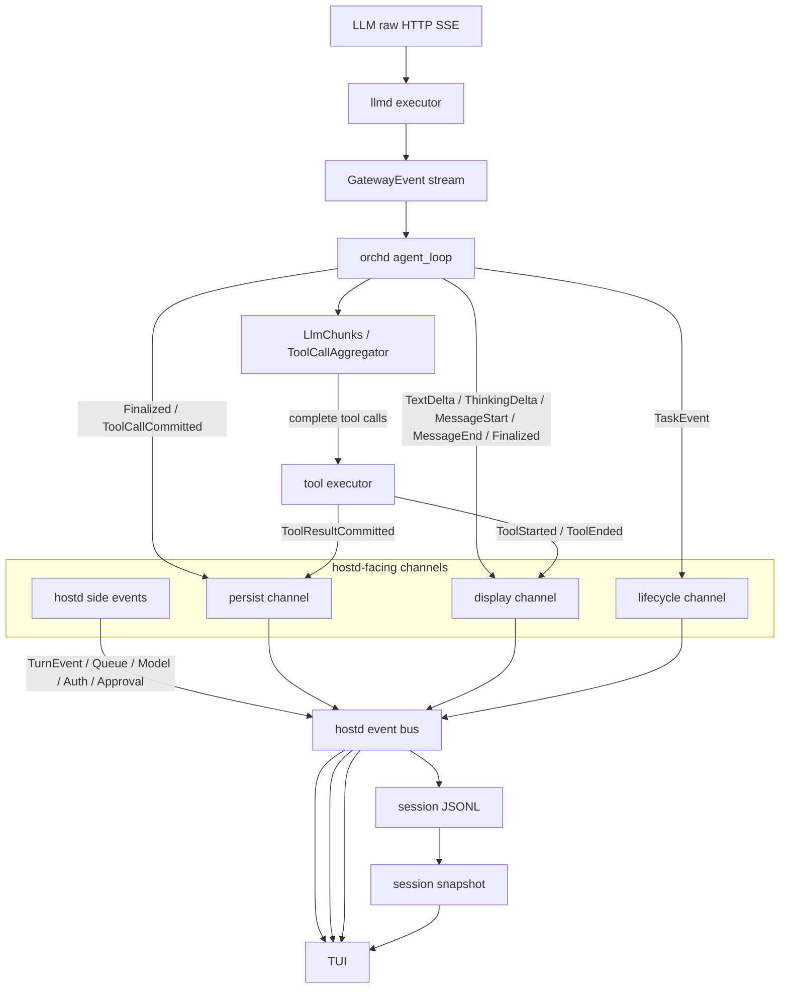
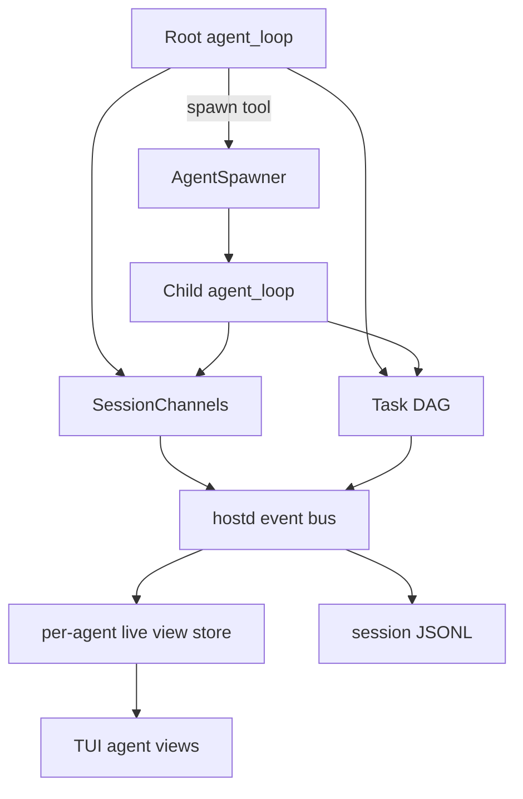

# Stream Architecture

piko 的 stream 架构定义 LLM 原始输出如何流经 orchd、hostd、TUI 和 session storage。本文档是架构规范，只描述系统应遵守的边界与数据流。

---

## 1. 核心原则

- **llmd 忠实转发**：llmd 只把 provider 原始响应映射为 `GatewayEvent`，不做业务聚合、不执行工具、不写 session。
- **orchd 负责 agent runtime**：orchd 以 `agent_loop` 为唯一 agent 执行路径，消费 `GatewayEvent`，维护本轮 transcript，聚合 tool call chunks，执行工具，并向 hostd-facing channels 投递 typed events。
- **hostd 负责用户可见状态**：hostd 是 session JSONL、task/agent 状态、approval、queue、config、auth、snapshot 的权威来源。
- **persist 是强可靠路径**：会影响 resume/transcript 的事件必须可靠投递并由 hostd 落盘。persist 事件不得静默丢弃。
- **display 是渲染路径**：display 事件只驱动 TUI timeline，不作为恢复或上下文构建的事实来源。
- **task DAG 是多 agent 事实来源**：agent tree 从 `TaskEvent::Created { task_id, parent_task_id, agent_id, source_agent_id }` 派生，不维护另一套互相竞争的父子关系。

---

## 2. 单 Agent 数据流



### Layer 职责

| 层 | 组件 | 职责 |
|---|---|---|
| LLM gateway | `llmd` | provider stream → `GatewayEvent`，不做业务判断 |
| Agent runtime | `orchd::agent_loop` | transcript、chunk 聚合、step loop、tool dispatch、task lifecycle |
| Tool runtime | `tool_executor` | 执行工具，产生 tool display 和 tool result persist events |
| Host event bus | `hostd` | 合并 channels 和 host-managed side events，更新权威状态并推送 TUI |
| Storage | `hostd` | `PersistEvent` → `SessionTreeEntry` → JSONL |
| UI | `tui` | 消费 `ServerMessage`，渲染 timeline、状态、审批、队列 |

---

## 3. Event Categories

### 3.1 PersistEvent

`PersistEvent` 是 transcript/session 恢复的事实来源。它必须可靠投递到 hostd，并且 hostd 必须在确认 turn 完成前消费完毕。

```rust
pub enum PersistEvent {
    Finalized {
        session_id,
        message_id,
        task_id,
        agent_id,
        message: Message::Assistant,
    },
    ToolCallCommitted {
        session_id,
        message_id,
        task_id,
        agent_id,
        parent_message_id,
        message: Message::ToolCall,
    },
    ToolResultCommitted {
        session_id,
        message_id,
        task_id,
        agent_id,
        message: Message::ToolResult,
    },
    TaskLifecycle(TaskEvent),
}
```

约束：

- `Finalized`、`ToolCallCommitted`、`ToolResultCommitted` 必须可靠投递。
- `PersistEvent` 不包含 `TextDelta`、`ThinkingDelta` 等中间态。
- hostd 将 message persist events 写为 `SessionTreeEntry::Message`，并保持 parent/leaf 关系。
- `TaskLifecycle` 用于 task DAG 和 session metadata，可与 transcript message 分开存储。

### 3.2 DisplayEvent

`DisplayEvent` 是 TUI 渲染事件，不承担恢复语义。

```rust
pub enum DisplayEvent {
    MessageStart { message_id, task_id, agent_id, role },
    TextDelta { task_id, agent_id, message_id, content_index, delta },
    ThinkingDelta { task_id, agent_id, message_id, content_index, delta },
    ToolCallDelta { task_id, agent_id, message_id, content_index, tool_call_id, delta },
    MessageEnd { message_id, task_id, agent_id, stop_reason?, error_message? },
    Finalized { message_id, task_id, agent_id, content, usage?, stop_reason?, error_message? },
    ToolStarted { task_id, agent_id, tool_call_id, tool_name, args, parent_message_id? },
    ToolEnded { task_id, agent_id, tool_call_id, tool_name, result, is_error },
    InteractionRequested { task_id, agent_id, interaction_id, tool_call_id, title?, questions, require_confirm, auto_resolution_ms? },
    InteractionResolved { task_id, agent_id, interaction_id, status },
}
```

约束：

- `Finalized` 同时出现在 display 和 persist，但语义不同：display 用于最终 re-render，persist 用于落盘。
- TUI 可用 display delta 做流式渲染，但 resume 必须从 snapshot/JSONL 重建。
- display event 必须携带 `agent_id`，hostd/TUI 用它路由到对应 agent timeline。

### 3.3 LifecycleEvent

`LifecycleEvent` 描述 turn/task 编排，不混入 display。

```rust
pub enum LifecycleEvent {
    Task(TaskEvent),
    Turn(TurnEvent),
}
```

约束：

- orchd 产生 `TaskEvent`。
- hostd 产生或确认 `TurnEvent`。
- root task id 只由 orchd 创建，并通过 `TaskEvent::Created` 进入 hostd；hostd 不应独立生成另一个 root task id。

### 3.4 Host-managed side events

approval、queue、model、auth、command response 属于 hostd 管理事件。它们和 orchd typed channels 一起进入 hostd event bus，再以 `ServerMessage` 推送给 TUI。

```rust
pub enum ServerMessage {
    CommandResponse { command_id, result },
    Auth(AuthEvent),
    Display(DisplayEvent),
    TaskLifecycle(TaskEvent),
    TurnLifecycle(TurnEvent),
    Approval(ApprovalEvent),
    Queue(QueueEvent),
    Model(ModelEvent),
    AgentConnected { agent_id, parent_task_id?, name, role },
    AgentDisconnected { agent_id, task_id, reason },
}
```

---

## 4. Agent Loop Contract

`agent_loop` 是 agent runtime 的唯一规范执行路径。

每个 model step 的顺序：

1. 发送 `DisplayEvent::MessageStart`。
2. 消费 `GatewayEvent`。
3. 对 `ContentDelta` / `ReasoningDelta` 发送 display delta。
4. 对 `ToolCallChunk` 聚合为完整 `ToolCall`。
5. 收到 `Done` 或 stream 结束后构建 `Message::Assistant`。
6. 发送 `DisplayEvent::MessageEnd`。
7. 可靠发送 `PersistEvent::Finalized`。
8. 发送 `DisplayEvent::Finalized`。
9. 对每个完整 tool call 可靠发送 `PersistEvent::ToolCallCommitted`。
10. 执行工具，发送 `ToolStarted` / `ToolEnded`，并可靠发送 `ToolResultCommitted`。
11. 如果还有 tool result，进入下一 model step；否则发送 terminal `TaskEvent`。

错误规则：

- LLM error 必须产生带 `error_message` 的 assistant final state 或 terminal task failure。
- persist 投递失败是 turn 失败条件。
- display 投递失败不能破坏 persist，但必须可观测。

---

## 5. 多 Agent 架构

多 agent 通过 task DAG 建模。每个 spawned task 运行自己的 `agent_loop`，但同一个 session 内的 agent events 汇入同一 hostd event bus。



### Task / Agent identity

- `task_id` 是一次 agent task execution 的主键。
- `agent_id` 是执行该 task 的 agent spec id。
- `parent_task_id` 表示 task DAG 父节点。
- `source_agent_id` 表示触发该 task 的 agent。
- TUI 中的 agent tree 从 task DAG 派生，节点 identity 使用 `task_id`，展示标签使用 `agent_id`。

### Spawn 语义

| Tool | 父 task 行为 | 子 task 行为 | 返回值 |
|---|---|---|---|
| `spawn_detached` | 创建 child task 后立即继续 | 独立运行 agent loop | `{ task_id, status: "detached" }` |
| `spawn` | 创建 child task 并等待 terminal report | 独立运行 agent loop | child report as tool result |
| `poll_task` | 查询已注册 task terminal report | 不影响 child | report 或 not-ready |
| `steer_task` | 向指定 task 注入 steering message | child 下一 step 消费 | delivery status |

---

## 6. TUI Agent Switching

hostd 为每个 session 维护 per-agent live view store。TUI 的 agent 切换只改变 foreground subscription，不改变事件保留策略。

### Per-agent live view store

hostd 对每个 `(session_id, task_id)` 维护：

- materialized timeline state：assistant text/thinking、tool entries、interaction state、message completion state。
- sequenced replay log：按 hostd session seq 记录该 task/agent 的 display、lifecycle、approval/interaction projection events。
- terminal summary：task terminal status、final report、completed tools。

TUI 按 `agent_id` 聚合展示时，hostd 从 task DAG 找到该 agent 对应的 task views，并生成 foreground view。

### Subscribe contract

`AgentSubscribe { session_id, agent_id, after_seq? }` 的响应包含：

- agent view snapshot：materialized timeline、task status、pending interactions。
- task view snapshots：该 agent 对应的每个 task 的 task_id、parent_task_id、status、events。
- replay events：`seq > after_seq` 的 sequenced events。
- next cursor：TUI 后续增量订阅使用的 seq。

### Switching constraints

- agent 切换不影响 orchd execution。
- hostd 不丢弃 inactive agent 的 live view state。
- agent 切换不要求重新读取 JSONL 才能看到运行中 timeline。
- completed agent 的 timeline 保留可回看。
- display deltas 由 hostd 物化为 timeline state；TUI 不依赖完整 delta replay 才能切换视图。

---

## 7. Resume

resume 从 hostd session snapshot 重建：

- transcript：来自 JSONL 中的 `Message::User`、`Message::Assistant`、`Message::ToolCall`、`Message::ToolResult`。
- task/agent tree：来自 task lifecycle metadata。
- pending approvals/interactions：来自 hostd authoritative state。
- TUI timeline：从 snapshot entries 和 agent/task metadata 派生。

display deltas 不参与 resume。它们只优化 live rendering。
