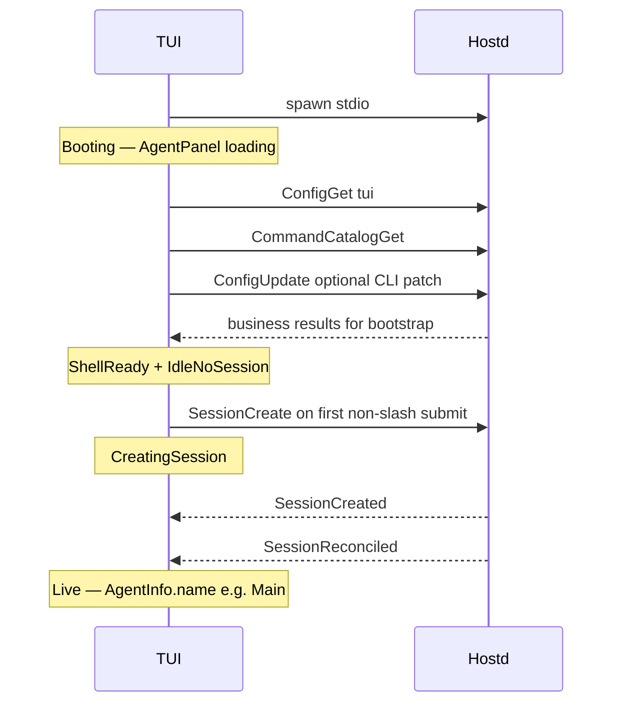
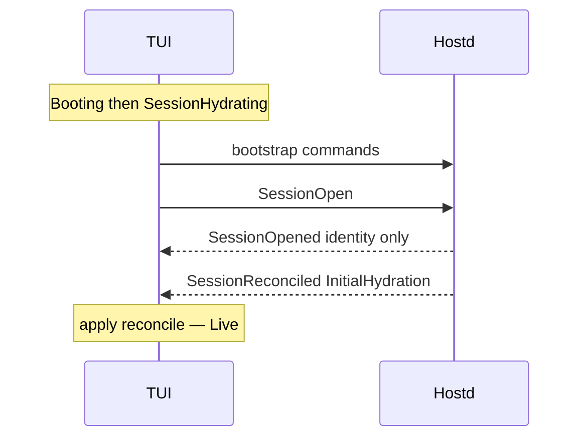

# TUI ↔ hostd Interaction Design

> Status: draft design (normative contract / design facts)
> Related: [Single-Agent Runtime Model](single-agent-runtime-model.md),
> [Turn–Agent Run Boundary](turn-agent-run-boundary-design.md),
> [Elm-ish Runtime](../packages/tui/docs/design/elmish-runtime.md),
> [Session View Lifecycle](../packages/tui/docs/features/session-view-lifecycle.md)

## 1. Purpose

This document states **design facts** for the process-local contract between the
TUI and hostd:

1. ownership and projection boundaries;
2. hydration and recoverable session projection;
3. command / event / snapshot meaning;
4. transport ack vs business result;
5. boot and session phase machines, including loading UI;
6. display-identity rules (e.g. agent `id` vs `name`).

It does not redesign orchd internals, durable session schema v3 layout, or the
Elm-ish `Msg` / `Effect` shape.

## 2. Ownership Boundaries

```text
┌─────────────┐  Command (JSONL)   ┌─────────────┐  TurnRunner   ┌─────────┐
│     TUI     │ ─────────────────► │    hostd    │ ────────────► │  orchd  │
│  projection │ ◄───────────────── │ authority   │ ◄──────────── │ runtime │
│  + local UI │  ServerMessage     │ + storage   │  observation  └─────────┘
└─────────────┘                    └─────────────┘
```

| Concern | Owner | TUI role |
|---|---|---|
| Process spawn / stdio transport | TUI spawns hostd; hostd owns server loop | Own connection lifecycle only |
| Settings / auth / model resolution | hostd | Request + mirror for display |
| Session identity, tree, leaf | hostd | Mirror only via hydration / live events |
| Durable transcript | hostd (Agent JSONL) | Project `TranscriptCommitted` only |
| Realtime draft streaming | orchd → hostd → TUI | Ephemeral; never recover from it |
| Interaction Turn lifecycle | hostd | Drive spinner from `TurnLifecycle` |
| Agent instance list / display names | hostd (`AgentInfo.name` from `AgentSpec`) | Render host-provided strings |
| Approvals / user interactions | hostd | Modal UI; respond via commands |
| Layout, focus, keymap, editor draft | TUI | Local only |
| Scroll / expand / notifications chrome | TUI | Local only |
| Loading / empty / error chrome | TUI | Local UI state driven by phase semantics (§9 / §10) |

**Fact O1.** hostd is the only writer of user-visible Session, Turn, agent list,
approval/interaction, and committed transcript projection. orchd never talks to
the TUI directly.

**Fact O2.** TUI never invents session facts, agent display names, turn status,
transcript rows, approvals, or interactions. Placeholders are loading or
explicit empty — never fake authoritative data.

## 3. Hydration Contract

**Fact H1 — Authoritative view entries.**
The only messages that replace the TUI's current visible session view are
`ServerMessage::SessionReconciled` for a live session and
`ServerMessage::SessionCleared` for the authoritative no-session state.

“Visible session view” means at least: session identity binding for chat,
transcript tree projection used by Timeline, current leaf, agent panel rows,
active turn projection, pending approvals, and pending interactions.

**Fact H2 — What must emit reconcile.**
Any hostd operation that changes the visible session view ends by emitting
`SessionReconciled` with an appropriate `ReconcileReason`:

| Reason | When |
|---|---|
| `InitialHydration` | Open / create-then-bind installs the visible view |
| `ExplicitRefresh` | User or command rebuilds the view (snapshot refresh, navigate, rename, set_label, fork-into-view, compact that rewrites history, …) |
| `Reconnect` | Observation stream reconnect rebuilds the live view |
| `RetentionExhausted` | Host forces a full rebuild after observation retention limits |

TUI applies every reason the same way under H1; the reason is diagnostic /
logging metadata, not a second apply path. Structural mutators do **not** need a
dedicated `SessionMutation` reason.

**Fact H3 — `SessionOpened` is target identity only.**
`CommandResult::SessionOpened` communicates session identity and open metadata
only (`session_id`, timestamps, and similar). It may update the pending open
target, but does not bind the editor or visible session view. It does **not**
carry a snapshot used for UI apply, and it is **not** a hydrate signal. Open
success alone does not move the TUI into `Live`.

**Fact H4 — Snapshot command is a refresh request, not a second apply path.**
`Command::StateSnapshot` asks hostd to refresh the visible view. The TUI applies
the resulting view only through the ensuing `SessionReconciled`, not by treating
`CommandResult::StateSnapshot` as a parallel hydrate entry.

**Fact H5 — Ready-for-Live gate.**
A session view is `Live` only after `SessionReconciled` for that `session_id`
has been applied. Until then the session is hydrating (or creating), and
session-dependent panels show loading rather than invented content.

**Fact H6 — Delete-to-empty.**
Deleting the visible session ends with `SessionCleared`. The TUI applies that
message by clearing all session-owned projections and entering `IdleNoSession`;
it does not infer the clear from a session-list query or an empty result.

## 4. Recoverable Projection Contract

Hydration payload is the `SessionReconciled` body: cursor + `SessionSnapshot` +
`agents` (and any fields added under the same event without creating a second
apply path).

### 4.1 Must be recoverable in reconcile / snapshot

**Fact R1.** After apply, the TUI can reconstruct user-visible session UI for
the current process without replaying live history, for:

| Projection | Source in reconcile |
|---|---|
| Session id, cwd, name | `snapshot` |
| Transcript tree + leaf | `snapshot.entries`, `snapshot.current_leaf_id` |
| Agent list (runtime instances) | `agents` (`AgentInfo`, including `name`) |
| Active turn (if any) | `snapshot.active_turn` with real status |
| Pending approvals | `snapshot.pending_approvals` |
| Pending interactions | `snapshot.pending_interactions` |
| Usage summary (if shown) | `snapshot.cumulative_usage` |

`TurnSnapshot` is **session-scoped** (turn id + status + best-effort chrome). It
does not carry `agent_instance_id`; root/agent affiliation for spinner and panel
routing comes from `TurnLifecycle` (e.g. `root_agent_instance_id`) and the
`agents` list. Per-agent turn chrome, if needed later, is a separate extension.

**Fact R2.** If a process-local value is required for correct UI after hydrate
(including mid-turn reopen in the same hostd process), it is either included in
the reconcile payload or listed under §4.2 as explicitly unrecoverable. There is
no third category of “field exists on the DTO but is always empty / stubbed
while UI still depends on it.”

**Fact R3 — Active turn completeness.**
When a turn is running (or waiting for approval/interaction), `active_turn`
carries enough status for the TUI spinner and modal restoration. Stub turns that
only contain `turn_id` + `Running` with empty tool/approval state are not a
valid recoverable projection when approvals/interactions are outstanding.

### 4.2 Explicitly unrecoverable

**Fact R4.** The following are never hydration authority:

| Data | Rule |
|---|---|
| `RealtimeMessage` drafts | Best-effort; discarded on reconcile |
| In-flight `ToolExecution` progress chrome | Live-only unless later added to snapshot under R1 |
| Editor draft, scroll, expand, focus, overlays | TUI-local |
| orchd internal Execution identity | Not part of the TUI contract |

**Fact R5 — Process-local prompt recovery.**
Pending tool approvals and user interactions are owned by the live hostd
process (`TurnRunner` pending maps). Same-process refresh / reconcile
(`ExplicitRefresh`, mid-session open while the turn is still live) MUST include
them in `SessionSnapshot.pending_*` and set `active_turn.status` to
`WaitingForApproval` when any are outstanding.

After hostd process exit, those pending oneshots are gone. Reopening a session
in a new process must not invent empty pending prompts as if they were
authoritative recovered state; interrupted turns follow the existing interrupt /
finalize path instead. Cross-process recovery of mid-turn approval/interaction
modals is explicitly **unrecoverable**.

TurnSnapshot `assistant_text` / in-flight `tool_calls` remain best-effort stubs
until a later slice projects live tool chrome; they are not required to restore
approval/interaction modals.

## 5. Transport and Command Semantics

**Fact T1.** Framing: one JSON object per line on stdio. TUI → hostd =
`Command`; hostd → TUI = `ServerMessage`.

**Fact T2 — Ack ≠ business result.**
Transport acceptance and business outcome are distinct:

- **Transport ack** is not a `CommandResponse` on the JSON-lines stream. The
  host accepts a line by scheduling handling; clients do not wait for an early
  Empty ack before business outcomes.
- **Business result** is the command’s typed outcome (`SessionCreated`,
  `SessionOpened`, `SessionListed`, `ConfigEntry`, `Err`, …) and/or the
  subsequent authoritative push events required by that command (especially
  `SessionReconciled`).

A business result is never encoded as a bare “empty success” when the command
has a typed outcome or a required follow-on projection. `Empty` is only valid
when the command’s defined business outcome is empty **and** any required push
events are defined separately (for example `ApprovalRespond` → Empty + resolved
event; `TurnSubmit` → lifecycle/commits without a success Empty).

**Fact T3 — Correlation.**
Every `Command` carries `command_id`. The TUI correlates pending UI operations
to the matching business `CommandResponse` (and treats hydrate readiness via
H5, not via transport ack).

**Fact T4.** No reconnect in v1 of this contract: hostd dies with the TUI
process. A new process performs boot + open/create hydration again.

## 6. TUI Projection Rules

**Fact P1 — Pure projection for session facts.**
The TUI does not optimistically mutate authoritative session projection:
`session_id`, transcript/timeline contents, agent list, tree/leaf, active turn,
approvals, or interactions. Those change only by applying host messages
(reconcile or live events).

**Fact P2 — Allowed local optimism.**
The TUI may optimistically update local UI chrome only: spinners, status text,
overlay open/close, focus, editor buffer, notification toasts, loading flags.

**Fact P3 — Loading vs authority.**
Loading chrome must not present invented agents (including hardcoded `"main"` /
`"Main"`), invented transcript rows, or invented prompts.

**Fact P4 — Display identity.**

| Field | Meaning | Supplier |
|---|---|---|
| `agent_id` / `AgentSpec.id` | Stable template id (e.g. `"main"`) | hostd |
| `AgentInfo.name` / `AgentSpec.name` | User-visible label (e.g. `"Main"`) | hostd |
| `agent_instance_id` | Runtime instance identity | hostd |

AgentPanel labels use **`name`**. `agent_id` is secondary metadata only.

**Fact P5 — Live event scoping.**
Live projections that are agent-specific (`TranscriptCommitted`,
`RealtimeMessage`, `ToolExecution`, agent-targeted approvals/interactions) are
applied to the correct agent timeline/view keyed by `agent_instance_id`, not to
an ambient “active panel only” assumption unless the event is explicitly
session-global.

Every session-scoped push DTO carries `session_id`, including agent, tool,
approval, and interaction events. The TUI rejects events whose `session_id`
does not match the live session. Agent identity alone is not a substitute for
session scoping.

## 7. Incremental Resume Contract

**Fact E1.** After a view is `Live`, incremental updates are the push stream in
§8.3 (`TranscriptCommitted`, `RealtimeMessage`, `TurnLifecycle`, …).

**Fact E2 — No session-level `EventsResume`.**
The supported surface does **not** include `Command::EventsResume`. Full rebuild
is only via `SessionReconciled` (H1). Clients that need a full replace request
refresh (`StateSnapshot` / reopen) and apply reconcile.

**Fact E3.** Per-agent incremental replay uses `AgentSubscribe { after_seq }`
(agent view cursor), which is not a session-wide hydrate alias.

**Fact E4.** A command that silently behaves like full snapshot while named
`EventsResume` is outside this contract’s allowed semantics and must not be
reintroduced.

## 8. API Surface (classified by contract role)

Commands and results live in `piko-protocol`. Classification below is normative
usage under this design.

### 8.1 Process / shell bootstrap (no session required)

| Command | Business result | Purpose | Bootstrap? |
|---|---|---|---|
| `ConfigGet { namespace }` | `ConfigEntry` | Load TUI settings blob (`tui`) | Required |
| `ConfigUpdate { patch }` | Defined empty or config result | Apply settings patches | Optional (CLI patch) |
| `CommandCatalogGet` | `CommandCatalogListed` | Slash / palette catalog | Required |
| `ModelList` | `ModelListed` | Model selector catalog | **On demand** (open model selector) |
| `AgentSpecList` | `AgentSpecListed` | Named agent templates (not runtime instances) | On demand |
| Auth commands | Auth business result and/or `Auth(*)` events | Credential flows | On demand |

Bootstrap required commands move the shell from **Booting** → **ShellReady**
(§9). Catalog commands that are not required may load lazily after ShellReady.

### 8.2 Session lifecycle

| Command | Business result | Authoritative view update |
|---|---|---|
| `SessionCreate` | `SessionCreated` | `SessionReconciled` when the new session becomes the visible view |
| `SessionOpen` | `SessionOpened` (identity only) | `SessionReconciled(InitialHydration)` |
| `SessionList` | `SessionListed` | None (overlay catalog only) |
| `SessionImport` | Typed import result as defined | `SessionReconciled` when the imported session becomes the visible view |
| `SessionNavigate` / `SessionFork` / `SessionRename` / `SessionSetLabel` / `SessionCompact` | Typed business result as defined | `SessionReconciled` when the visible view changes (compact included when it rewrites history into the view) |
| `SessionDelete` (current view) | `Empty` | `SessionCleared` |

### 8.3 Live session streaming (push)

| `ServerMessage` | Authority | TUI use |
|---|---|---|
| `SessionReconciled` | Full replace of visible session view | Session hydrate / rebuild entry (H1) |
| `SessionCleared` | Authoritative no-session view | Clear session-owned panels (H6) |
| `TranscriptCommitted` | Durable append | Timeline upsert for that agent |
| `RealtimeMessage` | Best-effort draft | Streaming only; dropped on reconcile |
| `TurnLifecycle` | Turn running / terminal | Spinner / active turn id |
| `Approval` / `Interaction` | Live prompts | Modal panels |
| `AgentChanged` | Runtime agent projection | Upsert AgentPanel row |
| `Queue` | Queue counts | Chrome |
| `Model` | Active model/thinking | Chrome / selectors |
| `ToolExecution` | Live tool progress | Agent-scoped progress chrome |
| `Auth` | Auth progress | Login UI |

### 8.4 Queries / turn / prompts

| Command | Business result | Notes |
|---|---|---|
| `StateSnapshot` | Ack/empty business result as defined | Refresh request → `SessionReconciled` (H4) |
| `AgentList` | `AgentListed` | May refresh panel; full view rebuild still via reconcile when tree/turn/prompts change |
| `AgentSubscribe` / `AgentUnsubscribe` | Subscribe result / empty | View switch + replay; does not replace H1 for session-wide hydrate |
| `TurnSubmit` / `TurnCancel` | Empty (if so defined) + lifecycle/commits | Not a hydrate path |
| `ApprovalRespond` / `UserInteractionRespond` | Empty + resolved events | Not a hydrate path |
| `QueueSteer` / `QueueFollowUp` / `QueueNextTurn` | Empty + `Queue` | Queue projection |

Each command with a defined `CommandResponse` business result emits exactly one
such response. Stream-only commands such as `TurnSubmit` complete through their
defined lifecycle events. Follow-on push events do not reuse the command id as
additional typed command results.

## 9. Phase Machines

### 9.1 Shell and session phase semantics

Phases below are **behavioral contracts** for loading / authority (O2, H5, §10).
They need not exist as a single Rust enum; implementations may approximate with
flags (e.g. `session.initializing`, `agents_hydrated`), pending-command kinds,
and error chrome as long as the visible outcomes match.

```text
Booting ──► ShellReady ──► (optional overlays) ──► Quit
               │
               ├── no session → IdleNoSession
               ├── SessionOpen / continue → SessionHydrating
               └── first submit → CreatingSession → SessionHydrating → Live
```

| Phase | Meaning | Session-dependent UI |
|---|---|---|
| `Booting` | hostd up; shell bootstrap in flight | AgentPanel **loading**; no fake agent |
| `ShellReady` | Config/catalog usable | Editor may accept local typing |
| `IdleNoSession` | No `session_id` | Explicit no-session empty — never fake `main`, never perpetual loading |
| `CreatingSession` | `SessionCreate` in flight | Loading |
| `SessionHydrating` | Session id known or opening; waiting for H5 | Loading; timeline not authoritative yet |
| `Live` | H5 satisfied | Project host agents / transcript / prompts |
| `SessionError` | Open/list/create failed | Error chrome; loading cleared |

### 9.2 Cold start (no `--session` / `--continue`)



### 9.3 Open / resume



### 9.4 Continue

`SessionList` fills the selector only. Opening a row follows §9.3. List loading
is overlay-local and does not imply AgentPanel `Live`.

## 10. Loading UI Contract

### 10.1 AgentPanel

| Condition | Render |
|---|---|
| `Booting`, `CreatingSession`, `SessionHydrating` | `loading…` (+ spinner) |
| `IdleNoSession` | explicit no-session empty (`no agents`) — not loading |
| `Live` with agents | Rows from reconcile / `AgentChanged`; label = `name` |
| `Live` with authoritative empty agents | Explicit empty — not `"main"` |
| `SessionError` | No loading; error via status / notification |

### 10.2 Timeline

| Condition | Render |
|---|---|
| Before H5 | Empty viewport |
| On `SessionReconciled` | Full rebuild from snapshot tree |
| `Live` | Commits + realtime drafts |

### 10.3 Loading is not

- A source of agent identity
- Permission to invent transcript or prompts
- A full-screen boot splash (unless a separate product fact says so)
- Coupled to orchd Execution identity

## 11. Non-Goals

- Replacing the Elm-ish `Msg` / `Effect` runtime
- hostd ↔ orchd observation redesign
- Renaming hostd root agent id (`main`) or display name (`Main`)
- Making TUI authoritative for any session fact
- Requiring a single `SessionPhase` / `ShellPhase` Rust enum (boolean /
  pending-command approximations that preserve §9–§10 are allowed)
- Specifying migration / repair sequencing for older trees
