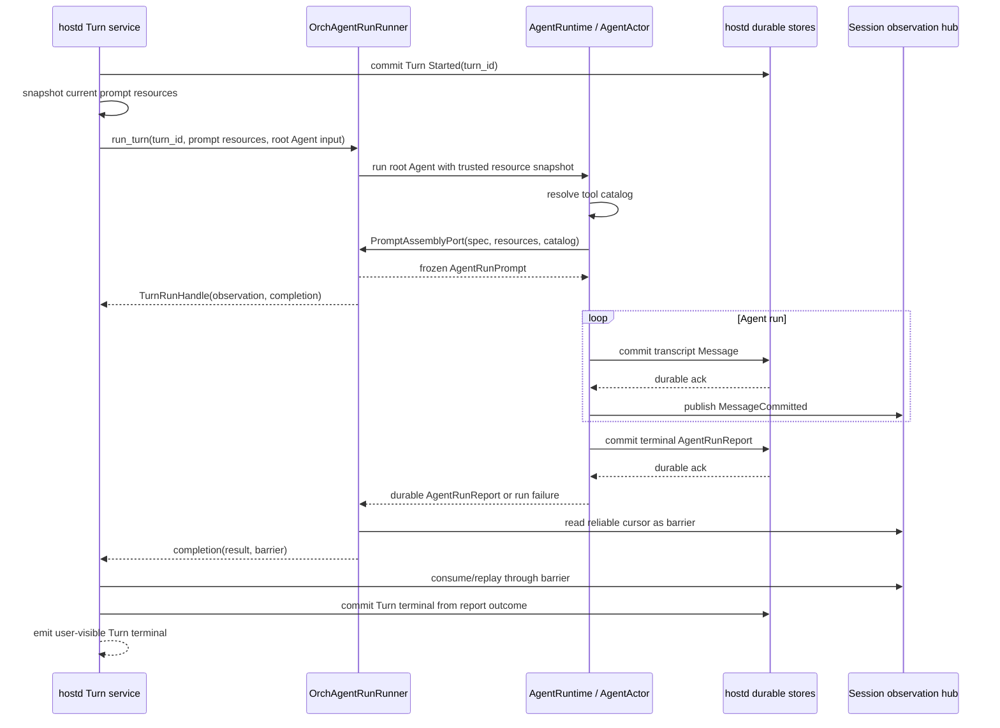

# Turn–Agent Run Boundary Design

> Status: superseded for ChatSubmit Turn cardinality and runner API by
> [hostd Turn Model and Agent Run API](hostd-turn-model.md). The completion
> channel and observation-barrier rules in this document remain design history.
> Business model: [Single-Agent Runtime Model](single-agent-runtime-model.md)
> Runtime model: [Agent Runtime Actor Design](single-agent-actor-runtime-design.md)
> Run durability: [Agent Run Atomicity Design](agent-run-atomicity-design.md)
> Pending amendment: prompt lifecycle separation is specified in
> [Agent Prompt Assembly Design](agent-prompt-assembly-design.md) and awaits
> confirmation before implementation.

## 1. Purpose

Define how a hostd Interaction Turn starts, observes, and completes one root
Agent run without treating an internal Execution as the Turn's public runtime
identity.

The replaced implementation awaited `AgentRuntime::run_agent`, then synthesized
an `ExecutionChanged` event whose `execution_id` is the `turn_id`. hostd consumes
that observation event to terminate the Turn. This creates three incorrect
couplings:

1. `turn_id` is used as a substitute Execution identity;
2. a command result is converted into an observation and then back into an
   acknowledgement;
3. loss or exhaustion of the observation stream can delay a completion result
   that is already durably committed.

The target model removes that loop.

## 2. Concept and Ownership

| Concept | Owner | Addressed by | Terminal authority |
|---|---|---|---|
| Interaction Turn | hostd | `session_id + turn_id` | hostd Turn store |
| AgentRunPrompt | AgentRuntime / AgentActor | owning Agent run | immutable run input |
| Agent run | AgentRuntime / AgentActor | `session_id + agent_instance_id + request_id` | durable Agent run report |
| Execution | ExecutionActor | internal Execution identity | internal terminal handoff |
| Session observation | hostd adapter | Session cursor | no business authority |

An accepted root Turn binds one root Agent run. The root Agent run may use one
internal Execution, but hostd never needs that Execution identity to complete,
cancel, steer, or recover the Turn.

```text
Interaction Turn 1 ── 1 root Agent run
Agent run        1 ── 1 AgentRunPrompt
Agent run        1 ── 1 internal Execution today
```

The second cardinality is an implementation fact, not a hostd contract.

## 3. Boundary Decisions

### 3.1 Completion is a command result

`AgentRuntime::run_agent` resolves only after the AgentActor has durably
committed its terminal report. OrchAgentRunRunner forwards that result to hostd on
a dedicated completion channel.

The completion path is not a `SessionEvent`, broadcast, or stream item.

### 3.2 Observation is not acknowledgement

The Session output stream carries:

- reliable committed-message projections;
- approval and interaction observation;
- best-effort realtime deltas.

It does not decide whether the root Agent run or Turn completed. Subscriber
disconnect, replay, or retention exhaustion cannot change the Agent run result.

### 3.3 Turn completion waits for an observation barrier

The Agent report may become durable immediately after its final message commits,
while hostd has not yet consumed the corresponding `MessageCommitted` event.
Completing the Turn first would allow `TurnCompleted` to reach the TUI before
the final transcript projection.

OrchAgentRunRunner therefore captures the Session event cursor after `run_agent`
returns and sends it with the completion result. hostd drains or replays the
reliable event lane through that cursor before committing the Turn terminal.

The barrier orders user-visible projection. It does not make observation the
source of truth.

### 3.4 Product events contain no Execution identity

`SessionEventEnvelope` and its product events do not carry `execution_id`.
Committed messages are addressed by Agent, message, and transcript sequence.

`RealtimeDeltaEnvelope` may retain internal Execution correlation because
realtime multiplexing and stale-delta rejection need it. hostd strips that
identity when projecting user-visible messages. Realtime remains best-effort
and cannot satisfy the completion barrier.

Internal Execution diagnostics belong in tracing or a separate diagnostic
surface, not in the product Session event contract.

### 3.5 Agent run prompt is not AgentSpec mutation

hostd supplies current trusted prompt resources when it accepts a root Turn.
The bound root Agent run assembles and freezes one AgentRunPrompt according to
[Agent Prompt Assembly Design](agent-prompt-assembly-design.md).

AgentSpec remains the captured, durable configuration of the AgentInstance.
Session attach/recovery restores that snapshot and must not submit a second
semantic `Create` carrying the newly rendered Turn prompt. `Create` remains
strictly idempotent: the same identity with different immutable spec content is
a real conflict. A newly rendered AgentRunPrompt is not such a conflict because
it is run input, not Create input.

## 4. Target Host Port

AgentRunRunner returns one handle containing independent observation and completion
capabilities:

```rust
struct TurnRunHandle {
    session_id: SessionId,
    turn_id: TurnId,
    observation: SessionSubscription,
    completion: TurnRunCompletionReceiver,
}

struct TurnRunInput {
    session_id: SessionId,
    turn_id: TurnId,
    root_agent_instance_id: AgentInstanceId,
    prompt_resources: PromptResourceSnapshot,
    input: MessageContent,
}

struct TurnRunCompletion {
    session_id: SessionId,
    turn_id: TurnId,
    root_agent_instance_id: AgentInstanceId,
    result: Result<AgentRunReport, AgentRunFailure>,
    observation_barrier: SessionCursor,
}
```

`AgentRunReport` is the Agent-level terminal value currently represented by
`AgentRunReport`. The report contains `report_id`, outcome, summary, usage, and
artifacts, but no Execution identity.

`AgentRunFailure` represents failure to obtain a durable report, such as
startup rejection, permanent persistence conflict, or runtime unavailability.
It is not synthesized when a durable Failed or Cancelled report already exists.

`TurnRunCompletionReceiver` is single-consumer and resolves exactly once. A
dropped host receiver does not cancel the Agent run. Cancellation remains an
explicit AgentRuntime command.

The AgentRunRunner control surface becomes Agent/Turn-oriented:

```rust
trait AgentRunRunner {
    async fn run_turn(input: TurnRunInput) -> TurnRunHandle;
    async fn recover_observation(session_id: SessionId) -> SessionSubscription;
    async fn acknowledge_turn_run(
        session_id: SessionId,
        turn_id: TurnId,
        barrier: SessionCursor,
    );
    async fn steer_active_agent(session_id: SessionId, message: MessageContent) -> bool;
    async fn cancel_turn_run(session_id: SessionId, turn_id: TurnId) -> bool;
}
```

The host port uses Turn/Agent language rather than Task/Execution control names.

## 5. Startup and Completion Sequence



No step constructs an Execution observation from `turn_id`.

## 6. Host Observation Loop

hostd selects over three independent inputs:

1. Session observation output;
2. Turn run completion receiver;
3. approval/interaction UI events.

The loop maintains:

```rust
struct TurnObservationState {
    completion: Option<TurnRunCompletion>,
    observed_cursor: SessionCursor,
}
```

Behavior:

- Before completion arrives, consume observation normally.
- On stream exhaustion, reconnect and replay without affecting completion.
- When completion arrives, retain it and continue observation until
  `observed_cursor >= observation_barrier` in the same epoch.
- Once the barrier is satisfied, project the report outcome into the hostd
  Turn terminal transaction.
- Ignore duplicate terminal application by `turn_id` idempotency.

If the barrier epoch cannot be replayed because retention is exhausted, hostd
rebuilds committed transcript projection from the durable Agent shard, obtains
the hub's current cursor, and then finalizes the Turn. It never guesses success
from missing events.

## 7. Turn Terminal Mapping

The report outcome maps directly to hostd Turn state:

| Agent run outcome | Turn terminal |
|---|---|
| `Succeeded` | `Completed` |
| `Failed` | `Failed` |
| `Cancelled` | `Cancelled` |
| `AgentRunFailure` before durable report | `Failed` |

The mapping is performed once, after the observation barrier. hostd remains
the only writer of Turn state and user-visible Turn lifecycle events.

The report summary is not implicitly appended as a transcript message. Only
durably committed transcript messages enter Session history.

## 8. Cancellation and Steering

User commands address the active Turn in hostd. hostd verifies that the
requested `turn_id` is still active, resolves the root AgentInstance, and calls:

```text
cancel_agent_run(session_id, root_agent_instance_id)
steer_agent(session_id, root_agent_instance_id, message)
```

AgentRuntime resolves the active internal Execution. Neither command reads an
Execution ID from a snapshot or Session event.

Cancellation acceptance does not complete the Turn. The ordinary completion
receiver eventually yields a durable Cancelled report, and hostd applies the
same barrier protocol before committing `TurnCancelled`.

## 9. Recovery

### 9.1 Observation reconnect in the same process

The completion receiver remains alive while only the Session subscription is
replaced. `recover_observation` returns a new subscription after the requested
cursor. It does not create, restart, or inspect an Agent run.

The observation hub remains registered until hostd acknowledges that it has
processed the completion barrier. Publishing the completion result must not
immediately remove the hub. `acknowledge_turn_run` generation-checks
`session_id + turn_id`, then releases the active observation/completion scope;
a stale acknowledgement cannot remove a newer Turn's scope.

### 9.2 hostd process recovery

On Session recovery, hostd correlates the active `turn_id` with the durable root
Agent run record through `source_turn_id`:

- terminal run report present: rebuild transcript projection and idempotently
  apply the matching Turn terminal;
- start record present without terminal report and no live AgentRuntime:
  interrupt the run and fail/cancel the Turn according to recovery policy;
- no matching accepted run: fail the Turn as interrupted startup.

Recovery never reconstructs an Execution address for product control.

## 10. Atomicity and Failure Windows

No transaction spans AgentActor and hostd Turn storage. The protocol instead
uses two ordered durable commit points:

```text
Agent terminal report durable
    → completion delivered
    → committed observation barrier satisfied
    → hostd Turn terminal durable
    → user-visible Turn terminal emitted
```

Required behavior by failure window:

| Failure window | Required recovery |
|---|---|
| Before Agent terminal report | Agent run remains active or is interrupted by existing run recovery |
| After report, before completion send | recover terminal report by `source_turn_id`; do not rerun Agent |
| After completion, before barrier | replay/rebuild committed projection |
| After barrier, before Turn terminal commit | reapply outcome idempotently from durable report |
| After Turn terminal commit, before UI event | hostd state replay re-emits authoritative terminal projection |

## 11. Protocol Shape

The implemented product protocol:

1. has no Execution terminal event in Session observation;
2. has no host-facing Execution observation snapshot;
3. carries no `execution_id` in `SessionEventEnvelope`;
4. retains `execution_id` only on realtime/internal Execution contracts;
5. exposes the terminal report as `AgentRunReport`;
6. names host ports `run_turn`, `recover_observation`,
   `steer_active_agent`, and `cancel_turn_run`;
7. projects Agent list/status exclusively from Agent durable commands and
   snapshots.

Task/Work snapshot removal is a separate cleanup. This design must not add new
Task/Work dependencies while that legacy surface still exists.

## 12. Runtime Realization

### 12.1 Completion control path

- `TurnRunHandle` carries independent observation and completion capabilities;
- `TurnCompletionScope` guarantees a result during normal return and unwind;
- the observation hub remains alive until barrier acknowledgement;
- `acknowledge_turn_run` releases only the matching Turn generation;
- the host loop selects completion independently from observation.

### 12.2 Projection barrier and recovery

- hostd tracks the last applied reliable cursor;
- it drains or replays through the completion barrier;
- it rebuilds projection from Agent shards when replay is unavailable;
- Session open recovers a terminal root report by `source_turn_id` without
  rerunning it.

### 12.3 Product observation

- reliable Session events contain committed product facts only;
- realtime retains internal correlation but has no terminal authority;
- Agent list/status projection flows through Agent state;
- Agent reports and AgentRunRunner methods use Agent/Turn terminology.

### 12.4 Active Turn scope

- host Turn completion is separate from the observation projector;
- one `ActiveTurnRuntime` owns Turn identity and its observation hub;
- generation-checked acknowledgement releases the active scope exactly once.

## 13. Verification

Required tests:

1. `turn_id` is never serialized or assigned as an Execution ID.
2. A terminal Agent report completes the Turn without an Execution terminal
   observation event.
3. Final committed messages are projected before `TurnCompleted`.
4. Observation disconnect does not lose or duplicate completion.
5. Retention exhaustion rebuilds projection and still completes the Turn.
6. Cancellation waits for the durable Cancelled report.
7. Crash after Agent report commit but before Turn terminal does not rerun the
   Agent and converges on one Turn terminal.
8. A child Agent report never completes the root Turn.
9. Product Session events and multi-agent tools contain no Execution identity.
10. Duplicate completion and recovery application are idempotent.

## 14. Invariants

1. hostd owns every Interaction Turn lifecycle.
2. AgentActor owns every Agent run terminal report.
3. ExecutionActor remains an AgentRuntime implementation detail.
4. Turn completion is driven by a durable Agent report, not observation.
5. Observation barriers order projection but never establish business truth.
6. Product reliable events contain no Execution identity.
7. Realtime correlation cannot complete, fail, cancel, or recover a Turn.
8. `turn_id`, `report_id`, and internal `execution_id` are distinct semantic
   identities and are never substituted for one another at any boundary.
9. Stream reconnect never starts or cancels an Agent run.
10. A root Agent run produces at most one hostd Turn terminal.
