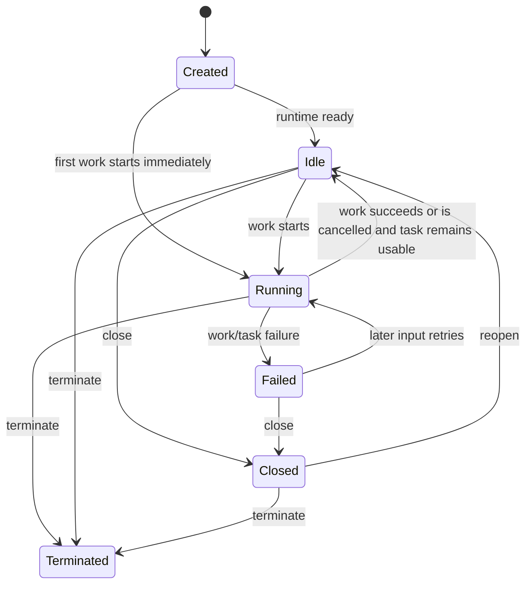
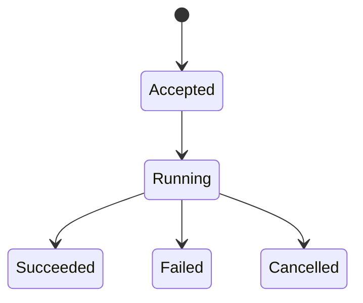
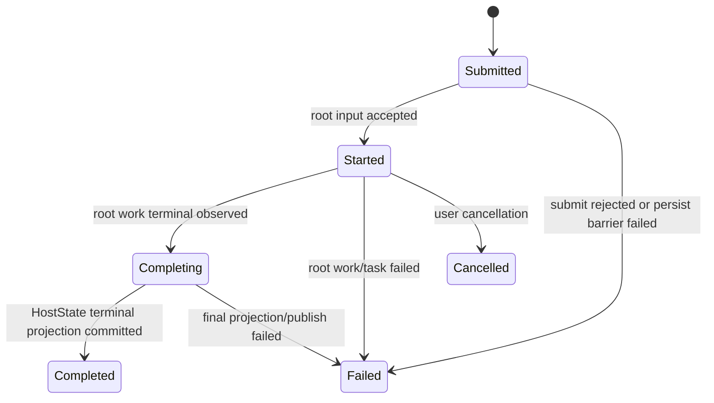
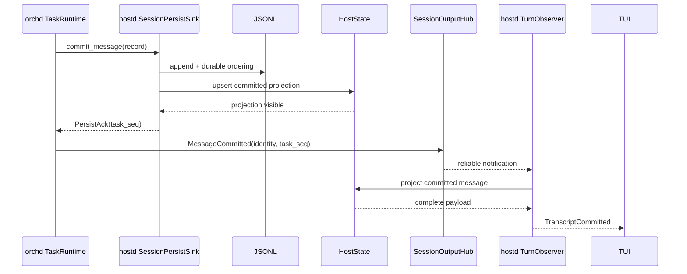
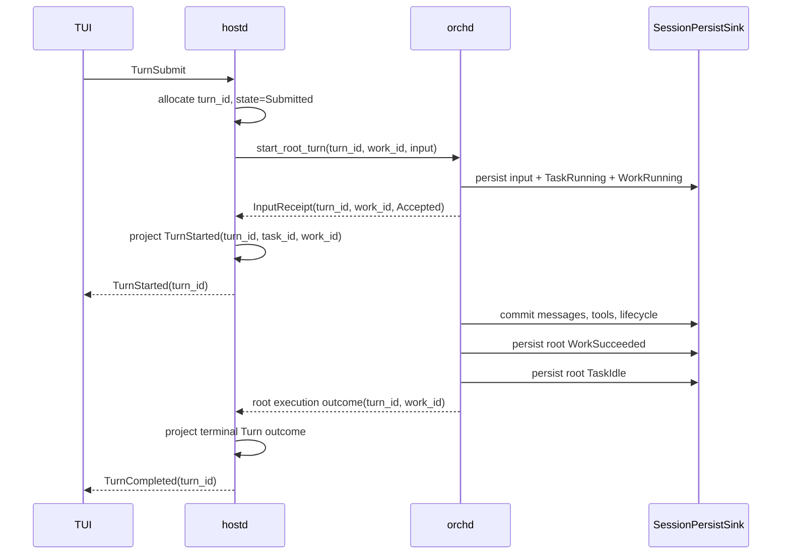

# Task / Turn / Work 生命周期与实时投影架构

> 状态：已落地
> 范围：hostd、orchd、piko-protocol、TUI
> 用户契约：每次 TUI 提交都必须形成一个可追踪、最终收敛的 hostd Turn；无布局或交互方式变更
> 关联设计：[Hostd Observation 类型与投影管线](hostd-observation-projection.md)、[SessionOutput 到 TUI 的投影设计](session-output-projection.md)、[Persist / Observation 重设计](../packages/hostd/docs/design/persist-observation.md)

## 1. 背景

piko 的一次用户请求跨越四个职责不同的层次：

```text
TUI → hostd → orchd → PersistSink(hostd)
```

- TUI 展示会话、turn 与 agent 状态；
- hostd 接受 turn，拥有 session 和用户可见状态；
- orchd 执行 agent loop，管理 task 与 work；
- hostd 的 PersistSink 写入 JSONL，并维护进程内 HostState。

近期暴露出两个表面独立、但都与边界协议不闭合有关的问题：

1. assistant 消息已经持久化，但 root task 没有持久化或发布 `Idle`，hostd 因而不结束 turn，TUI spinner 一直运行；
2. `MessageCommitted` 已经在 barrier 内写入 JSONL 和 HostState，观察路径却再次严格读取正在追加的 JSONL，短暂解析失败被误报为 committed message 缺失。

本文统一定义 Task、Turn、Work 三个生命周期，以及它们与持久化、实时投影和可靠通知的关系。它不以某个竞态的局部 fallback 为终态，而是明确每层的权威、关联基数、联合状态转换、顺序和失败语义。

## 2. 用户可见契约

每个被 hostd 接受的 turn 必须满足：

- 每条 committed user、assistant 和 tool 消息最多显示一次；
- 第二条及后续消息复用 root task 时，行为与首轮一致；
- assistant 回复完成后，turn 最终进入完成、失败或取消之一，不得无限保持运行；
- 命令提交失败或后端执行失败后，TUI 停止 spinner，并显示明确错误；
- session reopen 后，timeline 和 lifecycle 状态从 durable records 恢复；
- live turn 不依赖重读正在追加的 JSONL 才能观察刚刚 committed 的消息。

本设计不改变 TUI 布局、panel placement、焦点或键位。

## 3. 核心结论

### 3.1 两种权威，不是两个竞争状态源

```text
JSONL     = durable authority：跨进程恢复与审计
HostState = live authority：进程存活期间的用户可见投影
```

二者由同一个 persist barrier 按确定顺序更新。JSONL 是 HostState 的恢复来源，但不是 turn 进行中的热查询模型。

### 3.2 通知表示“投影已经可见”

可靠的 `MessageCommitted`、`ToolCommitted` 和 lifecycle notification 必须在 durable write 与 HostState projection 成功后发布。

因此，hostd 收到 committed notification 后必须能从 HostState 查询对应 projection。正常热路径不得重新读取 task shard 来获得 payload。

### 3.3 Task、Turn、Work 是三个关联但独立的领域对象

```text
Turn: Submitted → Started → Completed | Failed | Cancelled
Task: Created → Running → Idle | Failed | Terminated
Work: Started → Succeeded | Failed | Cancelled
```

定义如下：

- **Task**：orchd 中长期存在、可接收多次输入的 agent runtime handle；
- **Turn**：hostd 接受的一次用户交互，从 `TurnSubmit` 到用户可见的 terminal outcome；
- **Work**：orchd 中一次 `SubmitTaskInput` 驱动的执行周期。

现有协议已经让每次 `SubmitTaskInput` 携带独立 `work_id` 和可选 `source_turn_id`。因此 root 用户路径的目标基数是：

```text
Session 1 ── N Task
Task    1 ── N Work（跨多次输入）
Turn    1 ── 1 root Work
root Work 1 ── N attached child execution（因等待关系纳入完成边界）
```

这不是说 Turn 和 Work 是同一个对象。Turn 属于 hostd 用户交互协议；root Work 属于 orchd 执行协议。二者通过 `source_turn_id` 关联。

- attached child task/work 由父 work 等待，因而间接阻塞 root work 和 Turn；
- detached child task/work 不属于 Turn 的阻塞完成集合；
- task-to-task steer 同样创建独立 Work，但 `source_turn_id = None` 时不创建 hostd Turn；
- hostd 排队的用户输入只有真正开始提交时才成为 active Turn，并使用自己的 root `work_id`。

### 3.4 三者必须联合设计，但不能互相推断

Task status 描述 handle 是否可继续接收/执行工作；Work status 描述某次输入的执行结果；Turn status 描述用户请求是否结束。任何一个状态都不能无条件代替另外两个：

- `Task::Idle` 说明 task 已稳定可用，但必须关联到正确的 active root Work/Turn；
- `Work::Succeeded` 说明该 work 执行成功，但 hostd 仍需投影 terminal Turn；
- `Turn::Completed` 不终止 Task，root Task 可以服务下一轮；
- child `Work::Succeeded` 不能完成 root Turn；
- detached work 继续运行不阻塞原 Turn 完成。

## 4. 联合领域模型

### 4.1 Task 状态机

Task 是 orchd 拥有的长期 runtime handle：



`Idle` 是稳定非终态。`Closed` 可以 reopen；`Terminated` 是 handle 终态。现有 protocol 将内部 completed/cancelled task 状态折叠为对外 `Terminated`，实现阶段需保持两层语义一致或显式区分。

### 4.2 Work 状态机

Work 是单次输入驱动的执行周期：



每个 `submit_input` 使用独立 `work_id`。busy task 上的 `AfterCurrentStep` 输入可以先处于 Accepted/Queued，但不得覆盖当前 Running Work 的 identity；task 按 mailbox 顺序逐个激活 work。

### 4.3 Turn 状态机

Turn 是 hostd 拥有的用户可见生命周期：



`Completing` 是协议语义，不要求第一版立即增加公开 enum variant。它表示 orchd root Work 已有结果，但 hostd 尚未完成 durable/live projection 与客户端通知。

### 4.4 Identity 与关联

联合生命周期事件必须保留：

| Identity | 生成方 | 用途 |
|---|---|---|
| `session_id` | hostd | 所有状态的会话边界 |
| `turn_id` | hostd | 一次用户交互及 TUI spinner identity |
| `task_id` | orchd/hostd bootstrap | 长期 agent runtime handle |
| `work_id` | 输入提交方 | 一次输入驱动执行周期 |
| `source_turn_id` | hostd root input | root Work 到 Turn 的关联 |

对 root 用户输入，`source_turn_id` 必须为 `Some(turn_id)`。内部 steer 和 detached child 可以为 `None`；attached child 的因果关系由 parent task/work 等待链表达，不应伪装成另一个 hostd Turn。

### 4.5 联合转换表

| 触发 | Task | Root Work | Turn | 责任方 |
|---|---|---|---|---|
| hostd 接受 `TurnSubmit` | 不变 | 尚未创建 | `Submitted` | hostd |
| root `submit_input` barrier 成功 | Created/Idle/Failed → Running | `Accepted → Running` | `Submitted → Started` | orchd 报告，hostd 投影 |
| attached child 执行 | root 保持 Running | root 保持 Running | 保持 Started | orchd |
| detached child 执行 | root 不由它决定 | root 不由它决定 | 不阻塞 | orchd |
| root work 成功 | Running，等待稳定化 | `Running → Succeeded` | `Started → Completing` | orchd |
| root task 稳定可用 | `Running → Idle` | 已 terminal | 保持 Completing | orchd |
| terminal projection 完成 | Idle | Succeeded | `Completing → Completed` | hostd |
| root work 失败 | `Running → Failed` 或可恢复 Idle | `Running → Failed` | `Started → Failed` | orchd 结果，hostd 投影 |
| root work 取消 | `Running → Idle`（若 handle 可用） | `Running → Cancelled` | `Started → Cancelled` | orchd 结果，hostd 投影 |
| root task Terminated | Terminated | active work terminal | active Turn → Failed/Cancelled | orchd 结果，hostd 投影 |

这张表是实现与测试的共同契约。Task 与 Work 的具体 durable event 可以分开发出，但对外必须表现为一个最终收敛的联合转换。

## 5. 必须保持的不变式

### I1. Session 级 PersistSink

一个 live session 使用一个逻辑 PersistSink。root task 复用、child task、queue steer 和后续 turn 都动态解析该 session sink，不持有可能过期的 per-turn 快照。

### I2. Persist barrier 顺序

每个 durable record 的 barrier 顺序是：

```text
分配 task_seq
→ append JSONL record
→ 更新 HostState projection / manifest
→ 返回 PersistAck
→ 发布 reliable notification
```

任何一步失败都不得发布声称 commit 已可见的 notification。

### I3. Live observation 只读 HostState

`MessageCommitted` 和 `ToolCommitted` 的正常观察路径只从 HostState 投影客户端消息。JSONL 读取仅允许用于：

- SessionOpen；
- hostd 重启恢复；
- 明确的 reconciliation；
- 离线诊断和修复工具。

### I4. Notification 与 projection 一致

收到 committed notification 后 HostState 缺少相同 identity，属于 invariant violation，不是普通 cache miss。

处理方式是记录完整 identity 和 sequence，并使当前 turn 确定性失败或进入明确 reconciliation。不得静默 `.ok()??`，也不得用热读 JSONL 掩盖 barrier 顺序错误。

### I5. 每个 Turn 恰好关联一个 root Work

root `SubmitTaskInput` 必须满足：

```text
input.source_turn_id == Some(turn_id)
input.work_id == turn.root_work_id
```

同一 `turn_id` 不得绑定不同 root `work_id`；同一 root `work_id` 不得完成多个 Turn。重试必须复用相同 request/message/work identity。

### I6. 每个 turn 恰有一个 terminal outcome

每个已接受的 `turn_id` 最终必须且只能产生一个：

```text
Completed | Failed | Cancelled
```

terminal outcome 必须可幂等重放。重复的相同 outcome 是 no-op；相互冲突的 outcome 是协议错误。

### I7. Terminal outcome 驱动 TUI 收敛

TUI spinner 由 active turn 的非 terminal 状态驱动。收到 terminal outcome，或提交命令返回错误时，TUI 必须清除对应 `active_turn_id`。TUI 的防御性清理不替代 hostd/orchd 的生命周期保证。

### I8. 联合终态顺序不可静默中断

root work 的成功收敛至少包含 Work terminal、Task stable state 和 Turn terminal projection。任一步 persist/publish 失败都必须转为明确错误；不得留下 Work/assistant 已成功而 Task、Turn 永久 Running 的状态。

## 6. 目标数据流

### 6.1 消息 commit 与观察



`TurnObserver → JSONL` 不存在于正常流程。

### 6.2 Task / Turn / Work 联合生命周期



首轮创建 root Task 与后续复用 root Task 都必须执行 `start_root_turn(turn_id, work_id, ...)`。hostd 在 root input barrier 成功并取得匹配的 `InputReceipt` 后投影 `TurnStarted`；`TaskCreated` 不能代替 `TurnStarted`。

现有 `TaskLifecycleConsumer::on_task_idle` 的发出顺序是 `Task::Idle` 后 `Work::Succeeded`；目标顺序建议改为先持久化 root Work terminal，再持久化 Task stable state，最后由 hostd 投影 Turn terminal。理由是 Work 回答“刚才执行的结果”，Task Idle 回答“handle 现在可再次使用”。若实现保留相反的物理顺序，也必须通过一个联合 finalization barrier 防止 hostd 在只看到一半状态时提前完成 Turn。

## 7. 状态所有权

| 状态 | 权威层 | Durable | Live projection |
|---|---|---:|---:|
| session metadata / transcript | hostd | JSONL / manifest | HostState |
| Turn identity、active state、terminal projection | hostd | turn lifecycle record | HostState |
| Work outcome | orchd | 通过 PersistSink work lifecycle record | HostState projection |
| Task lifecycle | orchd | 通过 PersistSink task lifecycle record | HostState projection |
| reliable observation cursor | hostd + orchd observation contract | snapshot/cursor metadata | subscription state |
| spinner / selected view | TUI presentation | 否 | TUI cache |

hostd 不根据 realtime delta 推断 durable state。TUI 不根据 assistant `MessageEnded` 或文本停止增长推断 turn 完成。

## 8. Turn terminal protocol

### 8.1 推荐终态

目标协议应包含显式的 turn identity 和 outcome：

```rust
enum TurnOutcome {
    Completed,
    Failed { error: TurnError },
    Cancelled { reason: CancelReason },
}
```

terminal record 至少关联：

- `session_id`；
- `turn_id`；
- `root_task_id`；
- `root_work_id`；
- terminal outcome；
- 与 task lifecycle 对齐所需的 sequence/revision。

### 8.2 过渡期映射

在显式 terminal record 完成前，hostd 可以暂时联合观察带相同 `source_turn_id` 的 root Work terminal 与 root Task stable/terminal state，再映射 Turn outcome。不能只观察任意 Task Idle 或任意 Work terminal。

过渡映射必须：

- 映射到当前明确的 `turn_id`；
- 保证每次 root input 被接受后都投影 `TurnStarted`；
- 对 persist/publish lifecycle 错误进行传播，不能静默返回；
- 校验 notification 的 `task_id`、`work_id`、`source_turn_id` 与 active Turn 一致；
- 对 observation stream 关闭、sink 失败和 task failure 产生确定性 `TurnFailed`。

单独的 `WorkSucceeded` 不作为 `TurnCompleted` fallback；正确方向是让它成为联合终态协议的一部分。若已看到匹配 root Work succeeded，却未看到 Task stable state，应报告 finalization invariant violation，而不是无限等待或直接宣告成功。

### 8.3 Finalizer

orchd 的 root Work 执行路径应有统一 finalizer。所有成功、模型错误、工具错误、取消和 stream 中止路径都通过 finalizer 收敛 Work 与 Task，而不是要求每个分支各自记得发送 Idle。

成功路径的最低保证是：

```text
assistant/tool commit 完成
→ root Work lifecycle 持久化为 Succeeded
→ root Task lifecycle 持久化为 Idle
→ hostd terminal Turn outcome 持久化/发布
```

若 Idle persist 失败，则 turn 进入 Failed，不得保持 Running；错误需要包含 session、turn、task、work 和失败的 lifecycle kind。

### 8.4 Steer、Queue 与 child execution

- **hostd queued user turn**：前一 Turn terminal 后才调用 `start_root_turn`；新 Turn 使用新的 `turn_id + work_id`；
- **task steer**：每个 steer 使用新 `work_id`，但 `source_turn_id = None` 时不创建 hostd Turn；
- **AfterCurrentStep**：Work 可以先 Accepted/Queued，激活前不得替换当前 active Work projection；
- **attached child**：父 root Work 等待 child result，child failure 如何映射为父 Work 结果由 orchd 决定；
- **detached child**：不阻塞 root Work/Turn terminal，继续通过 session observation 独立投影。

## 9. HostState 投影规则

HostState 至少需要支持以下按 identity 查询和幂等更新：

- committed message by `(task_id, message_id)`；
- committed tool record by stable identity；
- task lifecycle by `task_id`；
- work lifecycle by `work_id`；
- active/terminal turn by `turn_id`。

此外需要显式保存 `turn_id → (root_task_id, root_work_id)` 关联，不能只保存一个无关联的 `active_turn_id`。

投影规则：

1. persist barrier 更新 HostState；
2. observation handler 查询并映射 HostState，不二次 append；
3. 相同 identity 与内容的重复通知是幂等 no-op 或重复投影；
4. identity 相同但内容、sequence 或 ownership 冲突时标记 projection stale；
5. reconciliation 从 JSONL/snapshot 重建完整投影，并在明确 cursor 边界后恢复 live observation。

`find_committed_message_lenient` 可作为 recovery 或诊断能力保留，但不能作为 live notification 的 fallback。

## 10. 失败语义

| 失败点 | 必须行为 | 禁止行为 |
|---|---|---|
| JSONL append 失败 | commit 失败；不更新 HostState；不发布 notification | 继续 agent step |
| HostState projection 失败 | commit 失败；不发布 notification；turn 失败 | 只写日志后返回成功 |
| notification publish 失败 | turn/observation 明确失败或进入可恢复重订阅 | 无限等待 Idle |
| notification 后 projection 缺失 | invariant error；带 identity 诊断；必要时 reconcile | 热读 JSONL 后假装正常 |
| Idle persist 失败 | `TurnFailed`，清理 live Running 状态 | 保持 manifest running |
| Work terminal 与 Task stable 只成功一半 | finalization invariant error；Turn Failed 或 recovery-required | 用单个事件宣告 Completed |
| Work/Turn identity 不匹配 | 拒绝 terminal projection 并记录三种 identity | 完成当前 active Turn |
| `TurnSubmit` command error | hostd 返回错误；TUI 清对应 active turn | spinner 继续运行 |
| subscription 断流 | cursor recovery 或确定性失败 | 静默退出 observation loop |

## 11. Recovery 与旧坏 session

SessionOpen 是 JSONL 重建 HostState 的入口。恢复器应：

1. 逐 task shard 严格解析完整 records；
2. 对最后一个不完整尾行使用有边界的 crash-recovery 规则；
3. 按 task sequence 重建 transcript、Task、Work 和 Turn projection 及其关联；
4. 识别没有 terminal outcome 的历史 running turn；
5. 将无法证明仍在执行的遗留 running turn 标记为 interrupted/failed recovery 状态，而不是恢复为永久 spinner。

旧 session 中“assistant 已 commit，但缺 Idle”的记录不能由 live observation 猜测修复。恢复策略需要显式标记 interruption，并保留原始记录用于诊断。

## 12. 分阶段落地

### Phase 0：固化契约

- 更新现有 persist/observation 文档，不再把“observation 只读 repository”描述为目标架构；
- 明确 JSONL durable authority、HostState live authority 和 notification 可见性语义；
- 为 turn、task、work 补充领域状态机说明。
- 固化 root `Turn 1:1 Work`、Task `1:N Work` 和 child execution 阻塞规则。

### Phase 1：收敛 live observation

- `MessageCommitted` / `ToolCommitted` 只投影 HostState；
- 删除 live path 的 strict/lenient repository fallback；
- projection 缺失变为带完整上下文的 invariant error；
- repository lenient lookup 限定到 recovery/diagnostic API。

### Phase 2：保证 turn 终态

- 查清 assistant commit 后绕过或丢失 Idle 的所有路径；
- 统一 lifecycle persist/publish 错误传播；
- 引入 Work terminal + Task stable 的联合 finalizer；
- 每次 root input 被接受后都产生 `TurnStarted`；
- 先维持 root Work + root Task 到 Turn terminal 的过渡映射。

### Phase 3：显式 turn outcome

- 在 orchd/hostd 契约中加入带 `turn_id + root_work_id` 的 execution outcome；
- hostd 持久化并投影 active/terminal turn；
- TUI 只依据 turn lifecycle 控制 spinner；
- root task lifecycle 退回 task/agent 展示用途，不再隐式充当 turn protocol。

### Phase 4：Recovery 与 legacy 清理

- 补 reopen、crash tail、历史 running turn 集成测试；
- 清理 legacy alias 与 live repository lookup；
- 明确 retention/cursor exhausted 时的 reconciliation。

## 13. 验证矩阵

| 场景 | 断言 |
|---|---|
| 首轮 turn | user → started → assistant → idle → terminal；spinner 停止 |
| 第二轮复用 root task | 独立 `TurnStarted`；消息可观察；terminal 恰好一次 |
| Task 跨两个 Turn | 相同 `task_id`，不同 `turn_id/work_id`；各自唯一 terminal |
| root Work identity | `source_turn_id` 与 active Turn 严格匹配 |
| 连续追加 lifecycle records | live observation 不读取 JSONL，projection 不受热写影响 |
| JSONL 尾部半行 | live turn 不受影响；reopen 按 recovery 规则处理 |
| assistant commit 后 | 成功路径必须随后持久化 Idle 和 terminal outcome |
| Idle persist 失败 | turn 确定性 Failed；manifest/HostState/TUI 不保持 Running |
| committed notification 后 HostState 缺失 | invariant error，不回退 repository |
| queue steer | 每个被接受 turn 有稳定 `turn_id` 和唯一 terminal outcome |
| child task | 父子动态解析同一 session sink；child terminal 不提前完成 root turn |
| attached child | root Work 等待 child；父结果确定后 Turn 才完成 |
| detached child | root Turn 可完成；child 后续事件仍被 session projection 消费 |
| task steer | 新 Work 无 hostd Turn；不得清理当前 TUI active Turn |
| AfterCurrentStep | queued Work 不覆盖当前 Running Work identity |
| command response error | TUI 清除对应 `active_turn_id` |
| session reopen | committed transcript 恢复；遗留 running turn 标记 interrupted |
| 重复 notification | HostState/TUI 幂等，不重复 timeline entry |

## 14. 可观测性要求

每条关键日志应包含 `session_id`、`turn_id`、`task_id`、可用时的 `work_id`、record kind 和 `task_seq`。最低链路是：

```text
turn accepted
→ turn started
→ record persisted
→ HostState projected
→ reliable notification published
→ notification observed
→ root task idle persisted
→ terminal turn outcome observed
```

错误日志必须区分 persist、projection、publish、subscription 和 client dispatch，不使用统一的 “observation failed” 隐藏故障阶段。

## 15. 非目标

- 不把 JSONL 替换为数据库；
- 不要求 JSONL append 与内存更新具备数据库级原子事务；
- 不为不同 task 建立全局 total order；
- 不使用 realtime delta 驱动 durable lifecycle；
- 不通过 TUI watchdog 宣称后端 turn 成功；
- 不在本设计中改变 TUI 布局或视觉样式。

## 16. 设计决策摘要

1. 保留 hostd + orchd 分层；问题在跨层协议没有闭合，而不是分层本身错误。
2. JSONL 负责 durability/recovery，HostState 负责 live projection。
3. committed notification 是 projection-visible notification，不是让 observer 再次加载存储的指令。
4. Task、Turn、Work 分别建模、联合转换：Task `1:N` Work，root Turn `1:1` root Work。
5. 单独的 `WorkSucceeded` 不能完成 Turn；匹配的 Work terminal 与 Task stable state 共同形成执行终态。
6. attached child 通过父 work 等待关系阻塞 Turn，detached child 不阻塞。
7. 所有 root Work 必须通过统一 finalizer 收敛 Work、Task，再由 hostd 收敛唯一 Turn terminal outcome。

## 17. 落地结果

本设计已按以下边界实现：

- hostd 在 session create/open 时注册唯一 `SessionPersistSink`；orchd runtime 通过共享 sink slot 在每次 commit 时动态解析，root reuse 与 child task 不持有 per-turn sink 快照；
- persist barrier 按 JSONL append、HostState projection、PersistAck、reliable notification 的顺序执行；消息和 tool 的 live observation 只查询 HostState，缺失或 `work_id` 冲突会确定性失败当前 Turn；
- 每次 root submit 预先分配独立 `turn_id + work_id`，`TurnStarted`、terminal Turn event 和 snapshot 都携带 root identity；HostState 保存 active association，并拒绝冲突绑定；
- orchd finalization 先提交 Work terminal，再提交 Task stable/terminal。hostd 仅在匹配 root Work succeeded 与 root Task stable 都可见时提交 Completed；失败、取消、断流和半完成 finalization 都收敛为明确 terminal outcome；
- hostd 使用 session 级 `turns.jsonl` 记录 Submitted、Started 和唯一 terminal outcome，避免占用 orchd task shard 的 `task_seq`。重复相同 terminal outcome 幂等，冲突 outcome 或 identity 被拒绝；
- SessionOpen 严格恢复完整 records，对最后一个不完整 crash tail 做有边界截断；没有 terminal outcome 的旧 Turn 被追加为 interrupted Failed，不恢复为 active spinner；
- TUI 只用匹配的 Turn lifecycle 控制 `active_turn_id`，并跟踪 TurnSubmit command identity；提交被拒绝时清理 spinner 并展示错误；
- `TurnCancel` 调用 orchd `CancelWork`，并将 Cancelled durable/live projection 后再通知 TUI；
- TUI 布局、panel placement、focus 和 keybinding 未改变。

对应的用户契约与 TUI 设计索引：

- [Turn Lifecycle feature](../packages/tui/docs/features/turn-lifecycle.md)
- [Turn Lifecycle and Live Projection design](../packages/tui/docs/design/turn-lifecycle-live-projection.md)

验证覆盖首轮/后续 root reuse、唯一 terminal replay、projection missing、Work/Task 半完成、command rejection、session reopen、crash tail、interrupted recovery、session sink rebind、child/detached execution、task steer/cancel、重复 committed projection 和完整 workspace tests/lint。
