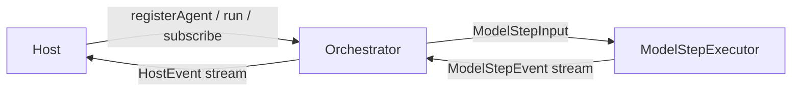

# piko-host-runtime

Host layer that drives the orchestrator and owns sessions, settings, auth, models, skills, prompts, and compaction.

## Boundary

The Host owns everything around agent computation:



Host responsibilities:

- Build system prompts from context files, skills, and templates
- Manage sessions, transcripts, tree navigation, fork/clone/resume
- Handle settings (layered: defaults → global → project → CLI)
- Resolve models and providers through the model registry
- Manage API keys and OAuth credentials
- Run LLM-based compaction and branch summarization
- Subscribe to orchestrator events for lifecycle/TUI integration
- Route approval requests through the ApprovalGateway

The Host does not own agent transcripts during a run — that belongs to AgentActor inside the orchestrator.
The Host also does not own the `ModelStepExecutor`; factories may use one to build the default orchestrator, but model execution remains an orchestrator concern.

## Components

- **PikoHost** — Main entry point: `run()`, `streamPrompt()`, `steer()`, `followUp()`, `nextTurn()`, skills, templates, compaction, session ops
- **SessionManager** / **PikoSessionRuntime** — Full session lifecycle, JSONL persistence, tree navigation
- **SettingsManager** — Layered configuration with CLI override support
- **ModelRegistry** — Model discovery, auth integration, scoped models
- **AuthStorage** — File-backed API key and OAuth credential storage
- **Compaction** — Token-aware cut point detection, LLM summarization, branch summary
- **Skills/Prompts** — YAML frontmatter skill loading, prompt template expansion

## Documentation

- [Tool Providers](docs/tools.md) — Detailed description of `WorkspaceToolProvider`, `HostToolProvider`, and `McpToolProvider`.

## Usage

```typescript
import { PikoHost, createHostConfig, ModelRegistry, SettingsManager } from "piko-host-runtime";

const settingsManager = SettingsManager.create(cwd);
const modelRegistry = new ModelRegistry(authStorage);
const resolvedModel = modelRegistry.resolve("gpt-5");

const host = await PikoHost.create({
  config: createHostConfig(resolvedModel.model, resolvedModel.providerConfig),
  settingsManager,
  modelRegistry,
});

const result = await host.run("Hello, world!");
console.log(result.messages);
```
