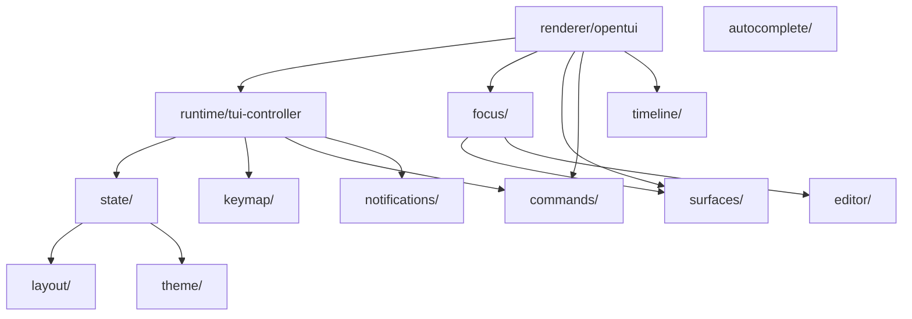

# piko-host-tui

OpenTUI + SolidJS terminal UI for piko.

## Architecture

The TUI is modeled as a UX runtime with explicit subsystem ownership:

## Subsystems

| Subsystem | Docs | Purpose |
|---|---|---|
| `state/` | [state](src/state/) | Serializable domain/view/ui/layout state, reducers, selectors |
| `focus/` | [focus.md](docs/focus.md) | Focus tree, key routing, interaction stack, bubbling |
| `surfaces/` | [surfaces.md](docs/surfaces.md) | Mount strategy, occlusion, z-order, surface manager |
| `commands/` | [commands.md](docs/commands.md) | Command registry, slash commands, built-in commands |
| `keymap/` | [keymap.md](docs/keymap.md) | Keybinding definitions, defaults, matching, display |
| `timeline/` | [timeline.md](docs/timeline.md) | Streaming items, scroll anchor, message rendering |
| `notifications/` | [notifications.md](docs/notifications.md) | Session-local notices, severity, history |
| `autocomplete/` | [autocomplete.md](docs/autocomplete.md) | Slash/file/argument autocomplete providers |
| `editor/` | — | Editor actions, autocomplete controller |
| `layout/` | — | Viewport policy, row budgets, truncation |
| `theme/` | — | Palette, semantic tokens, pi theme loader |

## Docs

See [docs/](docs/) for subsystem-level design documentation.
