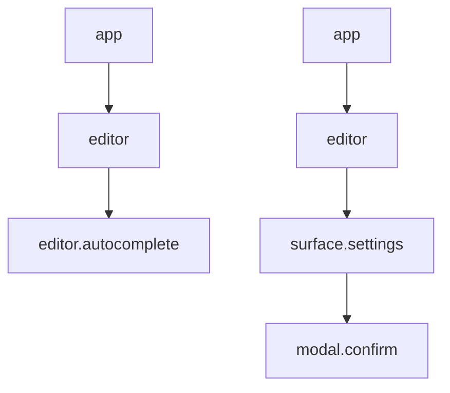

# Focus / Interaction Enhancement

This document upgrades the `focus` subsystem from visual focus tracking into a
runtime interaction model for keyboard ownership, routing, bubbling, and default
surface behavior.

It complements:

- [focus.md](focus.md)
- [surface-ux-contract.md](surface-ux-contract.md)
- [autocomplete.md](autocomplete.md)

## Problem

Terminal UI focus is not the same as business focus.

OpenTUI may deliver keys through a focused input, through `useKeyboard`, or
through renderer-specific behavior. If business logic depends on which component
currently has renderer focus, global actions such as `Esc`, `Enter`, and `Tab`
become unreliable.

Recent surface issues show this failure mode:

- A blocking command panel can be visible while editor input still handles keys.
- Removing the real editor input fixes one bug but can expose another if no
  stable keyboard capture host remains.
- Components can each implement `Esc` differently.
- Autocomplete can compete with managed surfaces for the same key.

The focus subsystem should own business input routing instead of delegating that
responsibility to renderer component focus.

## Target Model

Use one physical keyboard gateway and one business interaction stack.

```text
OpenTUI KeyboardGateway
-> normalize key
-> InputRouter.dispatch(key)
-> InteractionStack top-down
-> owner behavior returns KeyResult
-> controller applies semantic result
```

Renderer focus is only a capture detail. Business focus lives in the runtime.

## Responsibilities

### Keyboard Gateway

The keyboard gateway is always mounted and is the only physical key ingress.

Responsibilities:

- receive raw OpenTUI key events
- normalize key names and modifiers
- map `esc`, `escape`, and `\x1b` to `escape`
- derive printable `char`
- call `InputRouter.dispatch`
- call `preventDefault` / `stopPropagation` only when dispatch handled the key

It must not inspect command ids, surface types, or editor state beyond passing
normalized events into the router.

### Input Router

The input router owns dispatch order.

Responsibilities:

- route keys to interaction owners from top to bottom
- stop on handled semantic results
- bubble on `unhandled`
- pass results to the controller for side effects
- avoid direct renderer component side effects

### Interaction Stack

The interaction stack is the business focus stack.

Example:

```text
[app, editor]
[app, editor, editor.autocomplete]
[app, editor, surface.settings]
[app, editor, surface.settings, modal.confirm]
```

The top owner gets the first chance to handle non-global keys. If it returns
`unhandled`, the event bubbles to its parent.

### Controller

The controller interprets semantic results:

```ts
type KeyResult =
  | { type: "handled" }
  | { type: "unhandled" }
  | { type: "closeCurrent" }
  | { type: "confirm"; value?: unknown }
  | { type: "submit"; value?: unknown }
  | { type: "abort" };
```

Only the controller should execute side effects such as:

- close surface
- submit form
- confirm selected row
- abort stream
- switch model
- open follow-up surface

## Owner Types

```ts
type InteractionKind =
  | "app"
  | "editor"
  | "editor-child"
  | "surface"
  | "modal";

interface InteractionOwner {
  id: string;
  kind: InteractionKind;
  parentId?: string;
  blocking: boolean;
  priority?: number;
  handleKey(event: NormalizedKeyEvent): KeyResult;
}
```

Recommended owner hierarchy:



`parentId` controls bubbling and focus restore. It does not imply renderer
nesting.

## Dispatch Rules

### General

1. Normalize the physical key once.
2. Dispatch to the top interaction owner.
3. If result is `unhandled`, bubble to parent.
4. If result is semantic, controller applies it.
5. If no owner handles it, run app fallback keymap.

### Esc

`Esc` should be deterministic:

```text
top modal/blocking surface
-> editor child interaction
-> editor
-> stream abort
-> no-op
```

Concrete examples:

- settings open: Esc closes settings
- settings edit mode: first Esc exits edit mode, second Esc closes settings
- autocomplete visible with no surface: Esc closes autocomplete
- stream running with no surface/autocomplete: Esc aborts

### Enter

```text
top surface/modal submit or confirm
-> editor child autocomplete accept/execute
-> editor prompt submit
```

### Printable Input

```text
top form/menu/selector filter if surface active
-> editor draft if editor active
-> ignored if no text owner
```

Blocking and modal surfaces prevent printable input from reaching editor.

## Surface Integration

Managed surfaces register interaction owners.

```ts
openSurface(request) {
  const surface = surfaceManager.open(request);
  interactionManager.push({
    id: surface.id,
    kind: surface.modality === "modal" ? "modal" : "surface",
    parentId: surface.parentId ?? "editor",
    blocking: surface.blocking,
    handleKey: roleBehavior(surface.role, surface.data),
  });
}
```

`SurfaceRole` decides default key behavior:

| Role | Behavior |
|---|---|
| `selector` | navigate, filter, confirm, close |
| `menu` | navigate, optional filter, activate, close |
| `form` | text input, field navigation, submit, cancel |
| `confirm` | option navigation, confirm, cancel |
| `status` | no key owner |

Surface components provide data and callbacks. They should not implement default
global `Esc` behavior directly.

## Editor Integration

Editor is an interaction owner.

Editor owns:

- draft text
- cursor and selection
- submit behavior
- editor-local child interactions

Editor does not own:

- managed command panels
- blocking/modal lifecycle
- global surface close behavior

When a blocking or modal surface is active, editor remains in the logical stack
for restore purposes but does not receive keys.

## Keyboard Capture Host

The runtime should not rely on the real editor input for global key capture.

Keep a stable keyboard capture host mounted for the app lifetime:

```text
KeyboardCaptureHost
  -> useKeyboard
  -> InputRouter
```

This host is separate from the editor input. The editor input may exist only
when editor is active, but the capture host must always exist.

## Implementation Plan

1. Introduce `NormalizedKeyEvent`, `KeyResult`, and `InteractionOwner`.
2. Add `InputRouter` under `focus/`.
3. Convert `FocusManager` into an interaction stack owner or wrap it with
   `InteractionManager`.
4. Move global `Esc` policy out of renderer components.
5. Make managed surfaces register owners through the interaction manager.
6. Keep editor autocomplete as an editor child owner, not a managed surface.
7. Ensure blocking/modal surfaces prevent editor from receiving printable input.
8. Keep `KeyboardCaptureHost` mounted independent of editor input.
9. Remove duplicated `onKeyDown` logic from command surface components.
10. Add integration tests for surface close, autocomplete close, and stream abort
    priority.

## Tests

Required tests:

- opening `/settings` pushes a blocking surface owner
- `Esc` closes top blocking surface and restores editor owner
- `Esc` exits settings edit mode before closing settings
- printable input goes to settings filter/form while settings is active
- printable input does not change editor draft while a blocking surface is active
- editor autocomplete receives Up/Down/Tab/Esc only when no blocking surface is active
- app fallback keymap does not run while a blocking surface handles the key

## Acceptance Criteria

This enhancement is complete when:

- physical key capture has one stable gateway
- business key routing does not depend on renderer component focus
- blocking/modal surfaces reliably receive Esc, Enter, and printable input
- editor autocomplete is a child owner of editor
- managed surfaces use role behavior, not component-specific global key logic
- tests cover routing order and restore behavior

