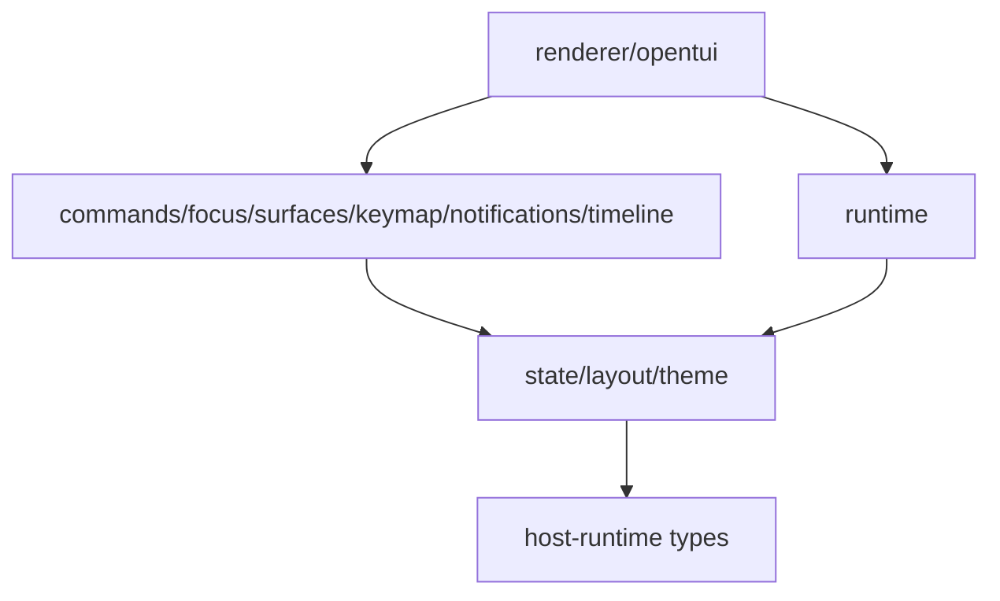

# TUI UX Runtime Overview

piko's TUI is a UX runtime with explicit subsystem ownership. Each subsystem has clear boundaries and responsibilities.

## Subsystems

- `keymap`: key definitions, matching, display, conflicts.
- `commands`: command metadata, availability, slash command dispatch.
- `notifications`: session-local notices, latest notice, history command.
- `timeline`: streaming items, scroll anchor, manual scroll behavior, message rendering policy.
- `focus`: active owner, nested path, event bubbling, restore behavior.
- `surfaces`: mount strategy, derived occlusion, z-order, parent-child close semantics.
- `layout`: viewport policy, row budgets, truncation helpers.
- `theme`: palette and semantic tokens.
- `state`: serializable domain/view/ui/layout facts.
- `runtime`: manager wiring and host/runtime actions.
- `renderer`: OpenTUI/Solid rendering only.


## Dependency direction



Rules:

- `state/` must not import renderer components.
- `layout/` should stay pure calculation where possible.
- `keymap/` must not know about SolidJS.
- `commands/` can call runtime actions but should not render components directly.
- `notifications/` records session-local notices and exposes latest/history selectors.
- `timeline/` converts transcript/runtime events into stable timeline items and scroll state.
- `surfaces/` decides occlusion, mount strategy, z-order, and parent-child state, not component internals.
- `focus/` decides key routing, not visual rendering.
- `renderer/opentui/` renders state and delegates events to runtime managers.
- `App.tsx` should become composition only: providers, layout shell, `SurfaceHost`, and top-level keyboard bridge.

## Runtime controller

```ts
interface TuiController {
  readonly state: Accessor<TuiState>;
  readonly actions: ActionService;
  readonly keymap: KeymapManager;
  readonly commands: CommandRegistry;
  readonly notifications: NotificationCenter;
  readonly timeline: TimelineController;
  readonly focus: FocusManager;
  readonly surfaces: SurfaceManager;

  handleKey(event: KeyEvent): void;
  openCommand(commandId: string, args?: string): void;
  openSurface(request: SurfaceRequest): string;
  closeSurface(id?: string): void;
}
```

`App.tsx` should call only:

```ts
useKeyboard((event) => controller.handleKey(event));
```

No command matching, overlay branching, or focus inference should live in `App.tsx`.

## State layering

```ts
interface TuiState {
  domain: TuiDomainState;
  view: TuiViewState;
  ui: TuiUiState;
  layout: TuiLayoutState;
}

interface TuiUiState {
  input: TuiInputState;
  focus: TuiFocusState;
  surfaces: TuiSurfaceState[];
  notifications: TuiNotificationState;
  timeline: TuiTimelineState;
  autocomplete?: TuiAutocompleteState;
  selectors: Record<string, TuiSelectorState>;
}
```

Component-local state is acceptable only for purely visual/transient details that do not affect key routing, layout, command execution, notification history, or focus restore.
