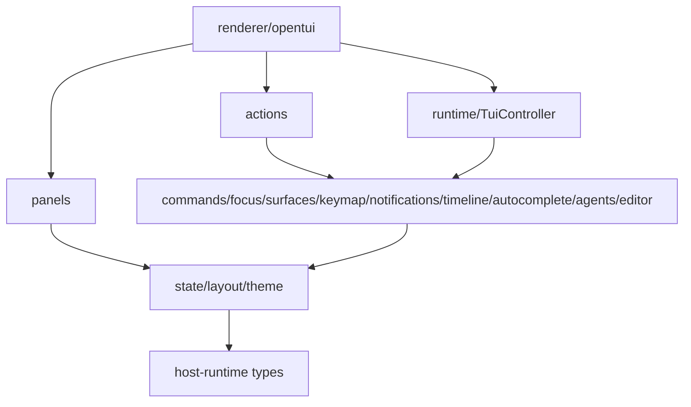

# TUI UX Runtime Overview

piko's TUI is a UX runtime with explicit subsystem ownership. Each subsystem has clear boundaries and responsibilities.

## Subsystems

| Subsystem | Directory | Responsibility |
|---|---|---|
| `keymap` | `src/keymap/` | Key definitions, matching, display, conflicts, config loading. |
| `commands` | `src/commands/` | Command metadata, availability, slash command dispatch, built-in commands. |
| `notifications` | `src/notifications/` | Session-local notices, latest notice, history, severity, expiration. |
| `timeline` | `src/timeline/` | Deterministic projection, scroll anchor, streaming items, message ordering, tool positioning. |
| `focus` | `src/focus/` | Focus tree, nested menus, event bubbling, restore behavior, key normalization. |
| `surfaces` | `src/surfaces/` | Panel surface lifecycle, z-order, render plan computation, parent-child relationships. |
| `panels` | `src/panels/` | Panel session model, route stack, capability declaration, runtime state machine. |
| `agents` | `src/agents/` | Agent activity view model, row building, column layout, plan summary selection. |
| `status` | `src/renderer/opentui/status/` | StatusPanel composition: AgentPanel(s) + notification line, StatusContract, spinner. |
| `actions` | `src/actions/` | Domain action modules (session navigation, fork, import, rename, switch). |
| `autocomplete` | `src/autocomplete/` | Slash command, file, and combined autocomplete providers. |
| `editor` | `src/editor/` | Editor autocomplete controller, state management, draft tracking. |
| `layout` | `src/layout/` | Viewport policy, row budgets, truncation helpers, bottom bar packing. |
| `theme` | `src/theme/` | Palette and semantic tokens, pi theme loader, resolution. |
| `state` | `src/state/` | Serializable domain/view/layout state, events, reducers, selectors. |
| `runtime` | `src/runtime/` | TuiController wiring all subsystems together. |
| `renderer` | `src/renderer/opentui/` | OpenTUI/Solid rendering: App, surfaces, selectors, timeline, editor, status. |

## Dependency direction



Rules:

- `state/` must not import renderer components.
- `layout/` should stay pure calculation where possible.
- `keymap/` must not know about SolidJS.
- `commands/` can call runtime actions but should not render components directly.
- `notifications/` records session-local notices and exposes latest/history selectors.
- `timeline/` converts transcript/runtime events into stable, deterministically-ordered timeline items via `TimelineProjection`, plus scroll state.
- `surfaces/` manages panel surface lifecycle, z-order, and render plan; not component internals.
- `focus/` decides key routing, not visual rendering.
- `panels/` models the panel route stack, capabilities, and runtime state machine.
- `agents/` builds view model rows from agent state; agnostic to rendering.
- `actions/` owns domain workflows (tree navigation, fork, import/rename/switch session).
- `autocomplete/` provides unified suggestions from slash commands + file paths.
- `renderer/opentui/` renders state and delegates events to runtime managers.
- `App.tsx` should become composition only: providers, layout shell, surface host, and top-level keyboard bridge.

## Runtime controller

`TuiController` (in `src/runtime/tui-controller.ts`) wires all subsystems together:

```ts
class TuiController {
  readonly keymap: KeymapManager;
  readonly commands: CommandRegistry;
  readonly notifications: NotificationCenter;
  readonly focus: FocusManager;
  readonly input: InputRouter;
  readonly surfaces: SurfaceManager;
  readonly scroll: ScrollController;
  readonly slashProvider: SlashCommandAutocompleteProvider;
  readonly autocomplete: CombinedAutocompleteProvider;
  readonly store: TuiStore;

  handleKey(event: KeyEvent): boolean;
  openPanel(request: PanelSurfaceRequest): string;
  closeSurface(id?: string): void;
  executeSlash(text: string): Promise<boolean>;
  submitPrompt(text: string): void;
  setAutocompleteController(ctrl: EditorAutocompleteController | null): void;
  setAutocompleteKeyHandler(handler: ((event: KeyEvent) => boolean) | null): void;
  setSurfaceController(surfaceId: string, ctrl: ...): void;
  setActionService(svc: ActionService): void;
  shutdown(): void;
  abort(): void;
}
```

`TuiController` does not own business logic. It delegates to subsystems,
passes key events through `InputRouter`, and wires surface lifecycle to
`FocusManager` and `SurfaceManager`. Domain actions are owned by `ActionService`
(in `src/renderer/opentui/action-service.ts`) and `SessionActions` (in
`src/actions/session-actions.ts`).

## State model

`TuiState` (in `src/state/state.ts`) is the single source of truth for all UI state:

```ts
interface TuiState {
  // Domain: facts from Host/Orchestrator
  session: TuiSessionState;       // session id, name, cwd, navigation state
  model: TuiModelState;           // current model, provider, thinking level, available models
  transcript: TuiMessageViewModel[]; // message view models
  usage: TuiUsageState;           // tokens, cost, context window
  stream: TuiStreamState;         // streaming status, accumulated text, tool state
  approval: TuiApprovalState;     // pending approval, if any

  // View
  input: TuiInputState;           // editor draft, revision, source tracking

  // Layout (derived from domain + viewport)
  layout: TuiLayoutState;

  // UX Runtime subsystems
  notifications: TuiNotification[];
  surfaces: SurfaceState[];
  focus: TuiFocusState;
  timeline: TuiTimelineState;
  projection: TimelineProjection;  // deterministic ID-keyed ordering

  // Extension slots
  extensions: TuiExtensionSlots;

  // Agent
  currentAgentId: string;
  viewedAgentId: string;

  // Lifecycle
  running: boolean;
  scrollCommand?: { dir: "pageUp" | "pageDown" | "jumpLatest"; seq: number } | null;
  _scrollSeq: number;
}
```

Key principles:

- **Domain state** comes from Host/Orchestrator and is authoritative.
- **View state** is what the user sees (drafts, expansion, selection).
- **Layout state** is derived from domain + view + viewport.
- **Projection** is a separate, deterministically-ordered view of timeline items (IDs + by-ID lookup) that decouples ordering from event arrival time.
- `TimelineProjection` is the authoritative item ordering (message-first, tool-after-parent, toolCallIndex-sorted).
- `TuiTimelineState` holds scroll anchor, expansion, and streaming metadata.

## Event flow

All state changes go through typed events and a synchronous reducer:

```text
User action / Host event / Orchestrator event
  → dispatch(TuiEvent)
    → tuiReducer(state, event) → new TuiState
      → SolidJS signal update
        → components re-render
```

Reducers are pure, synchronous functions with no side effects. Side effects
(notifications, surface lifecycle, abort, shutdown) are handled by
`TuiController`, `ActionService`, or individual subsystem managers before
dispatching events.

## Component-local state

Component-local state is acceptable only for purely visual/transient details
that do not affect key routing, layout, command execution, notification history,
or focus restore. Examples: hover state, animation frames, local scroll offsets,
filter text that is mirrored to panel state.

## Key routing

All physical key events enter through one route:

```text
OpenTUI useKeyboard
  → normalize key (FocusManager)
  → InputRouter.dispatch
    → editor child handler (autocomplete, if editor focused)
    → FocusManager.handleKey (global handler → interceptors → owner → bubble)
    → app fallback keymap (if no blocking surface)
```

See [focus.md](focus.md) and [focus-interaction-enhancement.md](focus-interaction-enhancement.md)
for details.
