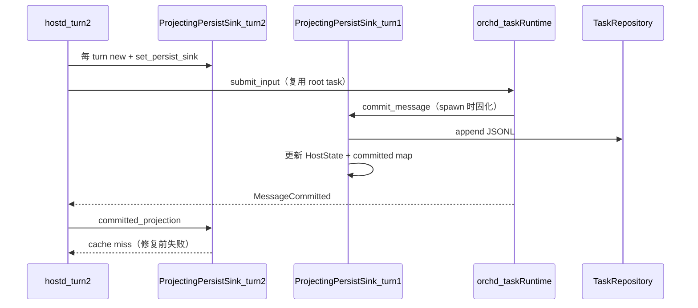
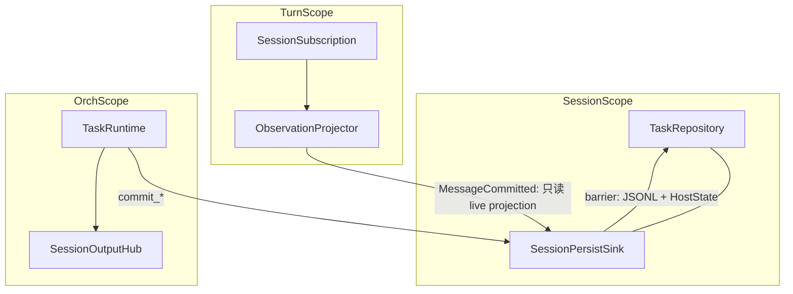

# Persist / Observation 重设计

> Status: Implemented (session sink + HostState live projection)  
> Audience: hostd + orchd contributors  
> Trigger: second `TurnSubmit` fails with `committed projection … missing for task …`

## 背景

第二条用户消息报错：

```text
Error: session observation failed: committed projection msg_… missing for task task_…
```

**这不是 task 未复用。** `start_root_turn` 在 root task 仍活跃时走 `submit_input` 复用路径，行为符合 [host-integration.md](../../../orchd/docs/host-integration.md)。

**根因是职责与生命周期错位：** 持久化写入、HostState 投影、观察层查 payload 被塞进同一个 per-turn 对象 `ProjectingPersistSink`，而 orchd task runtime 在 spawn 时固化了另一份 sink 快照。复用 task 时 commit 走旧实例，观察走新实例，per-turn 内存 cache miss。

旧 `TaskRepository` live fallback 只是止血，现已删除。本文记录最终模型与落地结果。

## 边界（不变）

| 层 | 权威 |
|---|---|
| orchd | 何时 commit、barrier 顺序、transcript 变更 |
| hostd | JSONL、HostState、manifest（durable state） |
| SessionOutput | 通知 TUI；不驱动 hostd/orchd 状态机（invariant #18） |

## 现状问题



修复前的 `ProjectingPersistSink` 混合三项职责：

| 职责 | 方法 | 应在哪一层 |
|------|------|------------|
| 持久化写入（barrier） | `PersistSink::commit_*` | Session 级，全 turn 共享 |
| HostState 投影（barrier 内） | `commit_message` → `append_committed_message` | Session 级，与写入同事务 |
| 观察 payload 查找 | `committed_projection` + 内存 map | Turn 级只读，权威来源是 barrier-visible HostState |

## 业务场景矩阵

每个场景标明：**JSONL 写入者**、**HostState 更新时机**、**TUI 事件来源**、**task 动作**。

### 1. 新会话首轮 TurnSubmit

| 项 | 行为 |
|---|---|
| task | `create_task` + `submit_input` |
| JSONL | 当前 turn 的 `PersistSink`（碰巧与 spawn 快照一致） |
| HostState | `commit_message` barrier 内更新 |
| TUI | Delta 流 + `MessageCommitted` → `TranscriptCommitted` |
| 风险 | 低（单 turn 内 sink 身份一致） |

### 2. 同会话后续 TurnSubmit（root task 复用）— bug 场景

| 项 | 行为 |
|---|---|
| task | `submit_input` only |
| JSONL | **旧** sink（task spawn 快照） |
| HostState | **旧** sink 在 barrier 内更新 |
| TUI | **新** sink 的 `committed_projection` 查 cache → miss |
| 期望 | 与首轮一致；观察层不依赖 per-turn cache |

### 3. 会话重开（SessionOpen / 进程重启）

| 项 | 行为 |
|---|---|
| task | `load_session_dir` 恢复 HostState；`resume_root_task` 构造 `TaskResumeState`；orchd `create_task(resume)` 或 reuse |
| JSONL | 已存在 shard，不 replay input |
| HostState | 启动时从 shard 全量投影 |
| TUI | 重连后新 turn 走正常观察路径 |
| 期望 | `task_seq` 连续；不重放历史 user input |

### 4. Task 失败后重试

| 项 | 行为 |
|---|---|
| task | registry cleanup 后可能 `create_task(resume)` 而非纯 reuse |
| JSONL | 同一 `task_id` shard 延续 |
| 期望 | `task_seq` 单调；见 `test_reused_root_task_recovers_after_gateway_failure` |

### 5. Queue steer（task busy 时排队输入）

| 项 | 行为 |
|---|---|
| task | `submit_input`，`InputDelivery::Queued` |
| 风险 | 与场景 2 相同的 sink 分裂 |

### 6. 子 task spawn（agent 工具）

| 项 | 行为 |
|---|---|
| task | `create_task(child)` + `submit_input` |
| JSONL | 子 task 在 spawn 时取 **当前** `supervisor.persist_sink()` |
| 风险 | 父 task 可能仍持旧 sink → **父子可能用不同 sink 实例**（目标架构需统一 session sink + 动态解析） |

### 7. Turn 中 SessionOutput 断流重连

| 项 | 行为 |
|---|---|
| 路径 | `turns.rs` → `recover_session_subscription` |
| 期望 | cursor 续订；`MessageCommitted` 处理与正常路径相同（只读 HostState） |

### 8. 无持久化内存会话

| 项 | 行为 |
|---|---|
| 路径 | `persist_sink: None`；mock / 测试专用 |
| 期望 | 非生产路径；不纳入 session sink 单例设计 |

### 9. 非 Turn 路径状态变更

| 项 | 行为 |
|---|---|
| 路径 | Compaction、branch navigate、legacy `jsonl_repository::append_entry` |
| 期望 | 与 TurnSubmit 主路径分文档描述；legacy 不混入新 invariant |

## 目标架构

### 三层作用域



### 四条硬规则

1. **一个 session 一个 PersistSink**  
   在 `SessionCreate` / `SessionOpen` 时创建，存入 `HostServer`（与 `session_paths` 并列的 `session_sinks` 或等价结构）。`TurnSubmit` **不再** `ProjectingPersistSink::new`。

2. **Barrier 路径唯一写入口**  
   `PersistSink::commit_*`：append shard → 更新 HostState / manifest → 返回 `PersistAck`。满足 write-before-LLM（invariant #6）。

3. **观察路径只读 HostState**  
   `MessageCommitted` / `ToolCommitted`：从 barrier 已更新的 HostState 加载 payload，发 `TranscriptCommitted` 给 TUI。**不**依赖 per-turn cache，**不**热读 JSONL，**不**二次 append HostState。projection 缺失是 invariant violation。

4. **orchd task runtime 不固化 sink 快照**  
   每次 `commit_input` 从 `supervisor.persist_sink()` 解析当前 session sink（Phase 2）。消除 reuse 时 commit / observation 实例分裂。

### Barrier vs Observation 两阶段

| 阶段 | 触发 | hostd 动作 | 目的 |
|------|------|------------|------|
| **Barrier** | orchd `commit_message` | 写 JSONL + 更新 HostState/manifest → `PersistAck` | 磁盘与内存在 LLM step 前一致 |
| **Observation** | `SessionEvent::MessageCommitted` | 读 HostState → 发 `TranscriptCommitted` | 通知 TUI；不驱动 durable 状态机 |

invariant #18 仍成立：观察流不驱动 hostd 状态机；状态在 barrier 已完成。`append_committed_message` 的 `is_new` 守卫保留作幂等保险。

## 与现有 Invariant 映射

| 新规则 | 对应 invariant |
|--------|----------------|
| Session 级单例 sink | #14 |
| Barrier 唯一写入口 | #5, #6, #11, #12 |
| 观察只读 HostState | #15, #19, #20 |
| 动态 sink 解析 | #5, #24（task handle 与 transcript 分离） |

## 现状 vs 目标

| 项目 | 现状 | 目标 |
|------|------|------|
| Sink 生命周期 | per-turn `new` in `turns.rs` | session-scoped 单例 |
| Task sink 绑定 | spawn 快照 in `launcher.rs` | 每次 commit 动态解析 |
| Observation lookup | `committed` map + repo fallback | 只读 `HostState` |
| 类型命名 | `ProjectingPersistSink`（混合职责） | `SessionPersistSink`（写）+ `project_committed_message()`（读，无状态） |
| 父子 task sink | 可能不一致 | 统一 session sink |
| 测试 | 单测 fallback | 场景矩阵集成测 |

## API / 模块变更草案（实现时）

### hostd

```text
HostServer
  session_paths: HashMap<session_id, PathBuf>     # 已有
  session_sinks: HashMap<session_id, Arc<dyn PersistSink>>  # 新增

SessionCreate / SessionOpen
  → 创建 SessionPersistSink::new(path, state)
  → 插入 session_sinks

TurnSubmit
  → session_sinks.get(session_id).clone()
  → runtime.set_persist_sink(same_arc)   # 幂等，同一 Arc
  → 不再 per-turn new

turns.rs MessageCommitted handler
  → project_committed_message(state, task_id, message_id)
  → send TranscriptCommitted（不查 sink cache）
```

### orchd（Phase 2）

```text
TaskRunState
  - persist_sink: Arc<dyn PersistSink>   # 删除 spawn 快照字段

commit_input / commit_mailbox_input
  → deps.resolve_persist_sink().await    # supervisor.persist_sink()
```

### 重命名

| 现名 | 目标名 | 职责 |
|------|--------|------|
| `ProjectingPersistSink` | `SessionPersistSink` | 仅 `PersistSink` 实现 + barrier 内 HostState |
| `committed_projection` | `project_committed_message(state, …)` | 无状态 HostState 只读函数，放 `session_output.rs` |

## 分阶段实现路线图

### Phase 1 — hostd only

- [x] `HostServer.session_sinks` 注册表
- [x] `SessionCreate` / `SessionOpen` 创建并缓存 sink
- [x] `TurnSubmit` 复用 session sink，删除 per-turn `new`
- [x] `MessageCommitted` 处理器改为只读 `HostState`
- [x] 删除 `committed` 内存 map 与 `committed_projection` cache 逻辑
- [x] 单元测试：barrier 更新后可直接读取 HostState projection
- [x] 集成测试：连续两次 `TurnSubmit`（`turn_submit_reuses_session_sink_across_turns`）

Phase 1 先关闭用户可见的 per-turn cache 分裂；Phase 2 已进一步让 orchd runtime 每次 commit 动态解析共享 sink，root reuse 与 child task 不再保留过期快照。

### Phase 2 — orchd dynamic sink

- [x] `SupervisorState.persist_sink` is `Arc<RwLock<...>>` shared via `SharedPersistSink`
- [x] `TaskRunState` / `TaskEventEmitter` resolve sink on each commit
- [x] `commit_input` / `emit_persist` / `emit_work_changed` / `emit_task_lifecycle` use dynamic resolve
- [x] Unit test: `resolve_follows_supervisor_rebind`

### Phase 3 — 清理与文档

- [x] 重命名 `ProjectingPersistSink` → `SessionPersistSink`（旧 alias 已删除）
- [x] 移除 `committed_projection` 与 per-turn cache
- [ ] 补齐场景矩阵集成测试（reopen、child spawn、queue steer）
- [ ] 同步 [runtime-architecture.md](../runtime-architecture.md) 目录说明

## 测试矩阵（实现时）

| 测试 | 场景 | 断言 |
|------|------|------|
| HostState projection unit test | 观察只读 live projection | 无 per-turn cache 与 JSONL 热读仍可投影 |
| `turn_submit_reuses_session_sink_across_turns` | #2 root reuse | 无 `ObservationFailed`；第二条 user message 可观察 |
| `session_storage` persistent reopen | #3 | HostState 与 shard 一致 |
| `test_reused_root_task_recovers_after_gateway_failure` | #4 | 保持绿；`task_seq` 连续 |
| 新增：child spawn 两轮 turn | #6 | 父子 commit 同一 session sink（Phase 2） |

## 不在本设计实现范围

- `TurnCancel` → `control_task(CancelWork)` 接线
- Session reconnect cursor 完整实现
- legacy `jsonl_repository::append_entry` 清理

## Related reading

- [host-integration.md](../../../orchd/docs/host-integration.md)
- [persistence.md](../../../orchd/docs/persistence.md)
- [invariants.md](../../../orchd/docs/invariants.md)
- [runtime-architecture.md](../runtime-architecture.md)
