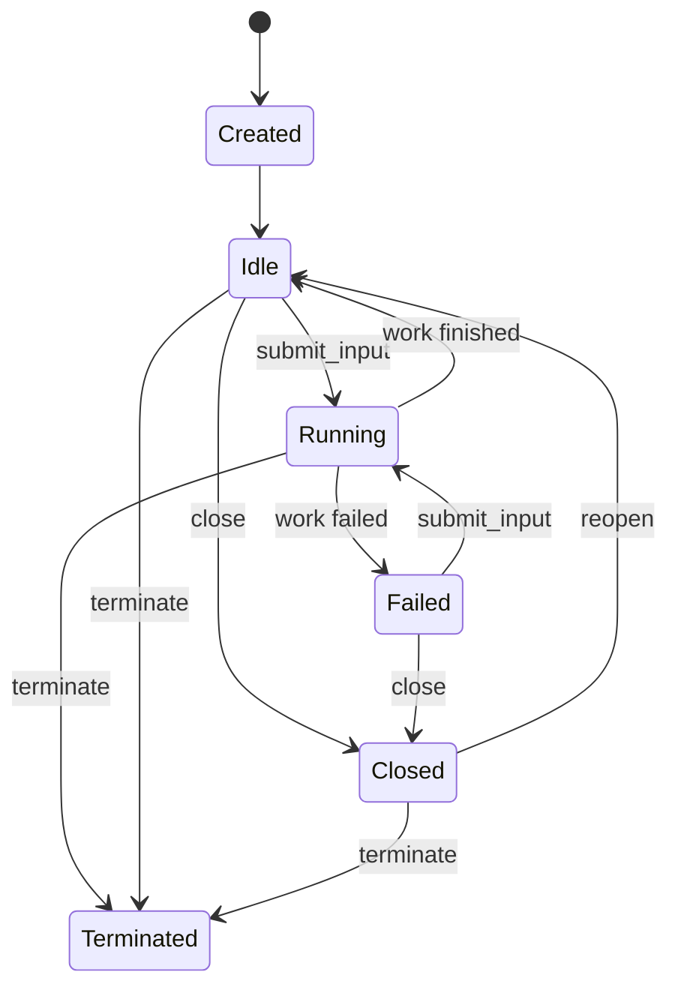
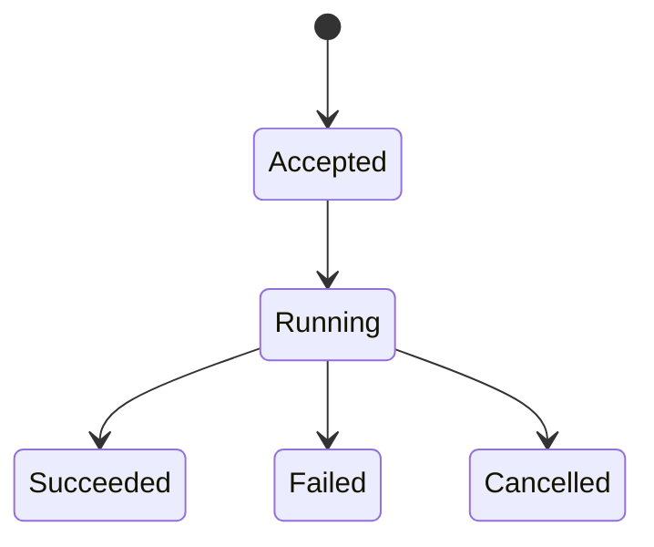

## 4. Unified Agent API

完整 Agent API 由四个平面组成：

```text
Command API       create_task / submit_input / control_task
Snapshot API      session_snapshot / task_snapshot
Observation API   subscribe_session
Integration Port  PersistSink request/ack
```

前三者是调用方使用的 public Agent API；`PersistSink` 是 hostd 实现、orchd 调用的 integration contract。Observation 不是外围 UI plumbing，而是 Agent API 的正式 output contract。

建议公开 trait：

```rust
#[async_trait]
pub trait AgentRuntime: Send + Sync {
    async fn create_task(
        &self,
        request: CreateTaskRequest,
    ) -> Result<TaskHandle, AgentApiError>;

    async fn submit_input(
        &self,
        request: SubmitTaskInput,
    ) -> Result<InputReceipt, AgentApiError>;

    async fn control_task(
        &self,
        request: TaskControlRequest,
    ) -> Result<TaskSnapshot, AgentApiError>;

    async fn task_snapshot(
        &self,
        task_id: TaskId,
    ) -> Result<TaskSnapshot, AgentApiError>;

    async fn session_snapshot(
        &self,
        session_id: SessionId,
    ) -> Result<SessionRuntimeSnapshot, AgentApiError>;

    async fn subscribe_session(
        &self,
        request: SubscribeRequest,
    ) -> Result<SessionSubscription, AgentApiError>;
}
```

跨 crate 的 serializable DTO 定义在 `piko-protocol`；trait、runtime context 和 side-effect ports 定义在 orchd。

### 4.1 Create Task

```rust
pub struct CreateTaskRequest {
    pub request_id: RequestId,
    pub session_id: SessionId,
    pub task_id: Option<TaskId>,
    pub agent_id: AgentId,
    pub parent_task_id: Option<TaskId>,
    pub source: InputSource,
    pub mode: TaskMode,
    pub host_context: HostTaskContext,
    pub resume: Option<TaskResumeState>,
}
```

`resume` 仅用于 hostd 从 authoritative task shard 重建 runtime handle。它携带已提交 transcript、per-task head、最后 `task_seq` 与 committed message IDs；普通 task 创建必须为 `None`。恢复创建不重复提交 `TaskCreated`，也不自动重跑历史 user input。

`CreateTaskRequest` 不携带 prompt。task 创建与第一条 input 是两个独立操作：

```text
create_task(child)
submit_input(child, initial prompt)
```

可以提供 `create_task_with_input` 便利方法，但它只能组合上述两个 API，不能形成第二条 transcript 路径。

```rust
pub struct TaskHandle {
    pub session_id: SessionId,
    pub task_id: TaskId,
    pub agent_id: AgentId,
    pub status: TaskStatus,
}
```

### 4.2 Submit Input

`submit_input` 是所有 user-role transcript input 的唯一入口：

```rust
pub struct SubmitTaskInput {
    pub request_id: RequestId,
    pub session_id: SessionId,
    pub task_id: TaskId,
    pub message_id: MessageId,
    pub work_id: WorkId,
    pub source_turn_id: Option<TurnId>,
    pub source: InputSource,
    pub content: MessageContent,
    pub delivery: InputDelivery,
    pub submitted_at: i64,
}
```

```rust
pub enum InputSource {
    User,
    Task {
        task_id: TaskId,
        agent_id: AgentId,
    },
    System {
        component: String,
    },
}
```

来源是 provenance，不改变目标 task 中的 message role。父 task 给 child 的 initial prompt 和 steer 对 child transcript 来说都是 `Message::User`。

```rust
pub enum InputDelivery {
    Immediate,
    AfterCurrentStep,
}
```

如果第一阶段只实现安全点注入，可以只接受 `AfterCurrentStep`，但不能让运行中 steer 的插入时机保持隐式。

```rust
pub struct InputReceipt {
    pub request_id: RequestId,
    pub task_id: TaskId,
    pub work_id: WorkId,
    pub message_id: MessageId,
    pub disposition: InputDisposition,
}

pub enum InputDisposition {
    Accepted,
    Queued,
    Duplicate,
}
```

### 4.3 Control Task

```rust
pub enum TaskControlRequest {
    Close {
        request_id: RequestId,
        task_id: TaskId,
    },
    Reopen {
        request_id: RequestId,
        task_id: TaskId,
    },
    CancelWork {
        request_id: RequestId,
        task_id: TaskId,
        work_id: WorkId,
    },
    Terminate {
        request_id: RequestId,
        task_id: TaskId,
    },
}
```

- `CancelWork` 中止当前 work，task 仍可继续接收 input。
- `Close` 拒绝新 input，但允许 reopen。
- `Terminate` 结束 runtime handle，不再作为活动 task 使用。

### 4.4 Snapshot

stream 不能替代 snapshot：subscription 可能断开，realtime delta 允许丢失，可靠事件也只有有限 retention。

```rust
pub struct SessionRuntimeSnapshot {
    pub session_id: SessionId,
    pub root_task_id: Option<TaskId>,
    pub active_task_id: Option<TaskId>,
    pub tasks: Vec<TaskSnapshot>,
    pub cursor: SessionCursor,
}
```

`TaskSnapshot` 按 `task_id` 查询；`SessionRuntimeSnapshot` 提供整个 session 的 task DAG/live status 投影。durable transcript 内容仍由 hostd repository/task shards 提供，orchd snapshot 不取代 durable recovery。

### 4.5 Observation Subscription

observation 以 session 为订阅作用域，因为 child task 会动态创建；事件本身始终携带 `task_id`。调用方可以可选过滤单个 task，但不能通过 `agent_id` 唯一定位 runtime。

```rust
use futures_core::Stream;
use std::pin::Pin;

pub type SessionOutputStream = Pin<
    Box<
        dyn Stream<
                Item = Result<SessionOutputEnvelope, SessionStreamError>,
            > + Send
            + 'static,
    >,
>;

pub struct SubscribeRequest {
    pub session_id: SessionId,
    pub task_id: Option<TaskId>,
    pub after: Option<SessionCursor>,
}

pub struct SessionCursor {
    pub epoch: String,
    pub seq: u64,
}

pub struct SessionSubscription {
    pub session_id: SessionId,
    pub cursor: SessionCursor,
    pub output: SessionOutputStream,
}
```

推荐同步流程：

```text
session_snapshot
  → record snapshot.cursor
  → subscribe_session(after = snapshot.cursor)
  → apply reliable SessionEvent
  → render RealtimeDelta opportunistically
```

如果 cursor epoch 不匹配或 retention 已不足，返回 `SnapshotRequired`，调用方重新获取 snapshot。subscription 断开不得终止 task；task idle/closed 不得关闭整个 session subscription；新 spawn task 自动出现在已有 session subscription 中。

`create_task` 和 `submit_input` 不返回 task/work 专属 stream：

```text
create_task      → TaskHandle
submit_input     → InputReceipt
subscribe_session → long-lived SessionOutputStream
```

否则 hostd 必须为每个动态 child 管理 receiver，并重新定义 idle、steer、reconnect 时 stream 的生命周期。只观察单个 task 时使用 `SubscribeRequest.task_id` 过滤，不创建第二套输出拓扑。

### 4.6 Observation Envelopes and Guarantees

```rust
pub struct SessionOutputEnvelope {
    pub session_id: SessionId,
    pub emitted_at: i64,
    pub output: SessionOutput,
}

pub enum SessionOutput {
    Event(SessionEventEnvelope),
    Delta(RealtimeDeltaEnvelope),
}

pub struct SessionEventEnvelope {
    pub task_id: TaskId,
    pub agent_id: AgentId,
    pub task_seq: u64,
    pub cursor: SessionCursor,
    pub event: SessionEvent,
}

pub struct RealtimeDeltaEnvelope {
    pub task_id: TaskId,
    pub agent_id: AgentId,
    pub work_id: WorkId,
    pub message_id: Option<MessageId>,
    pub delta_seq: u64,
    pub delta: RealtimeDelta,
}
```

可靠事件保证：

- committed notification 只在 durable commit 成功后发布；
- 每个 task 的可靠事件遵循 `task_seq`；
- session hub 为 notification 分配 runtime-scoped cursor；
- retention 内支持 cursor 续订；超出 retention 返回 `SnapshotRequired`；
- 慢订阅者不能阻塞 durable commit 或 LLM execution。

实时增量保证：

- 不持久化、不用于恢复、不保证重放；
- subscriber lag 时允许丢弃；
- 必须携带 task/work/message identity；
- `delta_seq` 只保证同一个 message 内的增量顺序；
- 最终由 committed message 或 snapshot 校正。

public API 暴露统一 `SessionOutputStream`，内部使用 reliable event lane 和 realtime delta lane，并在 subscription 边界合并。

不保证两个 lane 之间的全局顺序。`MessageEnded` 与 `MessageCommitted` 可能因调度以任一顺序被观察；client 必须把 committed event 当作最终状态，用它覆盖或修正临时 delta。`task_seq` 只排序 durable/recoverable events，`delta_seq` 只排序同一 message 的 deltas。

### 4.7 Stream Errors

```rust
pub enum SessionStreamError {
    SnapshotRequired {
        reason: SnapshotRequiredReason,
    },
    SessionClosed,
    RuntimeUnavailable,
    Internal {
        message: String,
    },
}

pub enum SnapshotRequiredReason {
    EpochChanged,
    CursorExpired,
    CursorUnknown,
}
```

当 cursor 无法续订时，stream yield `SnapshotRequired` 后结束。client 获取新 snapshot，并使用 snapshot cursor 重新订阅。`SessionStreamError` 表示持续观察失败；command failure 仍使用 `AgentApiError`，二者不能混用。

---

## 5. API Mapping

### 5.1 Root TurnSubmit

```text
TUI TurnSubmit
  → hostd expands templates/prompts
  → resolve root task by session_id
  → create_task(main), if absent
  → allocate request_id/work_id/message_id
  → submit_input(root task)
```

hostd 不再直接向 `main.jsonl` append user message。

### 5.2 Spawn

```text
parent spawn tool call
  → create_task(child spec, parent_task_id)
  → submit_input(child, initial prompt)
  → optionally await child work report
```

`spawn` 和 `spawn_detached` 的区别只在父 task 是否等待 work result，不在 child 初始化方式。

### 5.3 Steer

```text
steer_task(task_id, text)
  → allocate request_id/work_id/message_id
  → submit_input(task_id, text)
```

steer 不再直接发送只包含字符串的特殊控制消息。

### 5.4 Queue and Follow-up

hostd queue 只决定何时调用 `submit_input`，不决定如何修改 transcript 或落盘。

---

## 6. Task Mailbox and Input Commit

现有 `TaskSteerMessage` 应收敛为通用 mailbox：

```rust
pub(crate) enum TaskMailboxMessage {
    Input(SubmitTaskInput),
    Control(TaskControlRequest),
}
```

mailbox 负责接收、排队、delivery policy 和 receipt response，不直接修改 transcript。

Task runtime 内只有一个 user commit 方法：

```rust
async fn commit_input(
    &mut self,
    input: SubmitTaskInput,
) -> Result<InputReceipt, TaskRunError>;
```

逻辑顺序：

```text
validate identity and state
  → deduplicate request_id/message_id
  → build Message::User
  → allocate next task_seq
  → request durable commit
  → await persist acknowledgement
  → append to in-memory transcript
  → create/start work
  → return InputReceipt
  → run LLM step
```

持久化失败时：

- 不得 append transcript；
- 不得启动 LLM step；
- 返回 `PersistenceFailed`；
- 重试必须使用相同 request/message identity。

initial prompt、root follow-up 和 child steer 都走该方法。

---

## 11. Task and Work State Machines

### 11.1 Task State



### 11.2 Work State



Task lifecycle 描述长生存 runtime；Work lifecycle 描述一次 input 到结果。长期应将当前混合在 `TaskEvent`/`TurnEvent` 中的 work 状态逐步收敛为 `WorkEvent`。

---

## 12. Error Model

```rust
pub enum AgentApiError {
    TaskNotFound,
    SessionMismatch,
    TaskClosed,
    TaskTerminated,
    InvalidState,
    DuplicateRequest,
    IdempotencyConflict,
    InputRejected,
    PersistenceUnavailable,
    PersistenceFailed,
    RuntimeUnavailable,
    SnapshotRequired,
    Cancelled,
}
```

关键行为：

- task busy 时 input 的排队或拒绝由 `InputDelivery` 决定。
- durable commit 成功但 API response 丢失时，重试返回原 receipt。
- persistence 失败不会产生 transcript mutation 或 LLM call。
- session/task 不匹配必须 fail closed。

---

