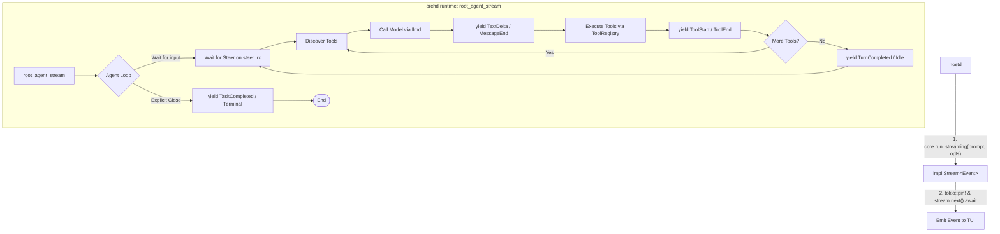

# orchd architecture

> **Status (2026-07-05):** orchd now operates in two modes:
> - **Production path:** `agent_loop` sends events directly through `DispatchSenders`
>   into `SessionChannels` (typed mpsc channels). No `Stream<Item = Event>` intermediary.
> - **Legacy/Test path:** `agent_loop` yields `Event` through a `Stream<Item = Event>`
>   (when `senders` is `None`). Used by integration tests.
>
> The channel dispatch framework (`SessionChannels`, `DispatchSenders`) is the primary
> mechanism. See `docs/dispatcher-framework.md` for details.

## What orchd is

```
┌──────────────────────────────────┐
│             piko                 │
│  ┌──────────┐  ┌──────────────┐  │
│  │   Host   │  │    orchd     │  │
│  │ (hostd)  │◀─│  (Rust lib)  │  │
│  │          │─▶│              │  │
│  │ session  │  │ Stream<Event>│  │
│  │ auth     │  │ agent loop   │  │
│  │ TUI      │  │ tool exec    │  │
│  │ skills   │  │ model call   │  │
│  └──────────┘  └──────┬───────┘  │
│                       │          │
│                 LLM Providers    │
│              (OpenAI, Anthropic) │
└──────────────────────────────────┘
```

orchd is piko's **AI agent runtime** — a Rust library called directly by hostd.
It handles:

- **Agent loop** — receive prompt, iterate LLM calls + tool execution until done
- **Tool execution** — discovery, approval, parallel/sequential execution
- **Model calling** — OpenAI / Anthropic API via the `llmd` adapter
- **Sub-agent coordination** — multi-agent task delegation (spawn / join)
- **Event stream** — a single `Stream<Item = Event>` from LLM to TUI, no pub/sub

orchd does **not** handle:

- User auth / API key management (Host provides)
- Session management / conversation persistence (Host manages)
- TUI rendering / user interaction (notifies Host via event stream)
- Project config / skills / system prompt assembly (Host assembles and passes in)

## Module structure

| Layer | Path | Purpose |
|---|---|---|
| **Protocol** | `protocol/` | Pure data types — config, events, messages, tool definitions, state. Re-exports from `piko_protocol`. |
| **Domain** | `domain/` | Pure domain rules — agents, tasks, tools, events, model, steering. No I/O. |
| **Application** | `application/` | Use case layer — `Supervisor` facade, agent/task/tool management, snapshots. |
| **Runtime** | `runtime/agent_stream/` | Agent execution — `root_agent_stream()` using `async-stream` crate, step runner, tool executor. |
| **Ports** | `ports/` | Abstract interfaces — `LlmGateway`, `ToolProvider`, `ApprovalGateway`. |
| **Adapters** | `adapters/` | Concrete implementations — `ToolRegistryImpl`, tool providers, model gateway adapter. |

## Core data flow

### Task execution (single Stream chain)



Key: orchd returns a **Stream**. hostd reads it. No actors, no spawn, no pub/sub, no channel bridging. Tasks are long-lived agent instances that wait on `steer_rx` for subsequent turns instead of terminating.

### Runtime events

Events are produced directly via `yield` in the `stream!` macro — no `EventSink` trait, no listener registry, no `AgentEventBuffer`. The `Stream<Item = Event>` is the single output channel.

Typical event sequence for a multi-turn session:
1. **First Turn (Task Creation)**:
   `TurnStarted` → `TaskCreated` → `TaskStarted` → `[MessageStart → TextDelta* → MessageEnd → (ToolStart → ToolEnd)*]*` → `TurnCompleted` (Task goes to Idle)
2. **Subsequent Turn (Steering)**:
   `TurnStarted` → `TaskSteered` → `[MessageStart → TextDelta* → MessageEnd → (ToolStart → ToolEnd)*]*` → `TurnCompleted` (Task goes to Idle)
3. **Session Closure (Terminal)**:
   `TaskCompleted` / `TaskFailed` / `TaskCancelled` (Task explicitly finalized)

## Configuration

### OrchdConfig (provided once by Host)

```json
{
  "providers": {
    "openai": { "kind": "openai", "apiKey": "sk-...", "baseUrl": null }
  },
  "agents": {
    "main": {
      "id": "main", "name": "Main", "role": "root",
      "systemPrompt": "You are a helpful coding assistant...",
      "model": "gpt-4o", "toolSetIds": ["builtin", "workspace"]
    }
  },
  "defaultModel": { "provider": "openai", "modelId": "gpt-4o" },
  "defaultSettings": { "allowToolCalls": true },
  "runtime": { "maxConcurrentAgents": 4 }
}
```

## Dependencies

| Crate | Purpose |
|---|---|
| `tokio` | Async runtime |
| `async-stream` | `stream!` macro for agent loop → Stream |
| `futures-core` / `futures-util` | Stream trait, SelectAll for child tasks |
| `llmd` | OpenAI / Anthropic API adapter |
| `serde` / `serde_json` | Serialization |
| `tracing` | Structured logging + distributed tracing |
| `uuid` | Task ID generation |
| `chrono` | Timestamps |
| `piko-sandbox` | Filesystem security policy (workspace provider) |

## Related docs

- [Host ↔ orchd interface](host-interface.md) — OrchdConfig, run_streaming, event stream
- [Runtime events & observability](event-sourcing-observability.md) — Event types, task projection, tracing
