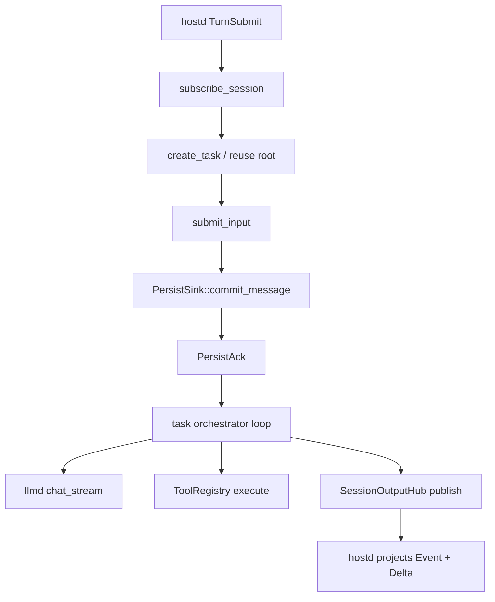

# orchd architecture

> **Status (2026-07):** Production I/O uses `AgentRuntime` + `SessionOutputHub` + `PersistSink`.
> See [`docs/agent-runtime-api-design.md`](../../../docs/agent-runtime-api-design.md) and
> [`host-interface.md`](host-interface.md).

## What orchd is

```
┌──────────────────────────────────┐
│             piko                 │
│  ┌──────────┐  ┌──────────────┐  │
│  │   Host   │  │    orchd     │  │
│  │ (hostd)  │◀─│  (Rust lib)  │  │
│  │          │─▶│              │  │
│  │ session  │  │ AgentRuntime │  │
│  │ auth     │  │ task runtime │  │
│  │ TUI      │  │ tool exec    │  │
│  │ skills   │  │ model call   │  │
│  └──────────┘  └──────┬───────┘  │
│                       │          │
│                 LLM Providers    │
│              (OpenAI, Anthropic) │
└──────────────────────────────────┘
```

orchd is piko's **AI agent runtime** — a Rust library called directly by hostd.
It handles:

- **Task runtime** — long-lived task instances, mailbox input/control, agent loop
- **Tool execution** — discovery, approval, parallel/sequential execution
- **Model calling** — provider routing via `llmd`
- **Multi-agent coordination** — spawn / steer / poll through `TaskControlPort`
- **Session observation** — reliable events + realtime deltas via `SessionOutputHub`

orchd does **not** handle:

- User auth / API key management (hostd)
- Durable session storage (hostd `TaskRepository`)
- TUI rendering (hostd projects hub output)
- Project config / skills / system prompt assembly (hostd)

## Layered layout

| Layer | Path | Purpose |
|---|---|---|
| **api** | `src/api/` | `AgentRuntime` trait, `AgentRuntimeService`, stream types |
| **application** | `src/application/` | Commands (`create_task`, `submit_input`, `control_task`), queries, supervision |
| **domain** | `src/domain/` | Pure rules — agents, tasks, work, transcript, tools, model |
| **runtime** | `src/runtime/` | Per-task execution — orchestrator, step dispatch, tools, events hub |
| **ports** | `src/ports/` | `PersistSink`, `LlmGateway`, `ToolProvider`, `TaskControlPort` |
| **adapters** | `src/adapters/` | Tool registry, model gateway, persist collectors |
| **host** | `src/host/` | Narrow bootstrap surface exported to hostd |
| **protocol** | `piko-protocol` | Serializable DTOs shared across crates |

Dependency rule: `api → application → {domain, runtime, ports}`; adapters implement ports.

## Core data flow

### Turn execution



Each task runs an async driver (`runtime/task/orchestrator.rs`) that:

1. Accepts mailbox messages (`SubmitTaskInput`, `TaskControlRequest`)
2. Commits user input through `PersistSink` before stepping
3. Runs model/tool steps via `runtime/step/`
4. Publishes reliable events and realtime deltas to the session hub

### Observation lanes

| Lane | Delivery | Used for |
|---|---|---|
| `SessionOutput::Event` | Reliable, cursor-ordered | Recovery notifications, lifecycle, committed messages |
| `SessionOutput::Delta` | Best-effort | Streaming text/thinking/tool-call UI |

## Configuration

hostd passes `OrchdConfig` once at startup (`Supervisor::from_config`). See
[`host-interface.md`](host-interface.md) for the bootstrap contract.

## Dependencies

| Crate | Purpose |
|---|---|
| `tokio` | Async runtime |
| `tokio-stream` / `async-stream` | Stream adapters |
| `futures-core` / `futures-util` | Stream trait utilities |
| `llmd` | Provider gateway |
| `piko-protocol` | Wire/runtime DTOs |
| `piko-sandbox` | Filesystem policy for workspace tools |
| `tracing` | Structured logging |

## Related docs

- [`host-interface.md`](host-interface.md) — hostd bootstrap, Agent Runtime API usage, persistence
- [`event-sourcing-observability.md`](event-sourcing-observability.md) — historical event notes (partially superseded)
- [`docs/agent-runtime-api-design.md`](../../../docs/agent-runtime-api-design.md) — canonical target design
