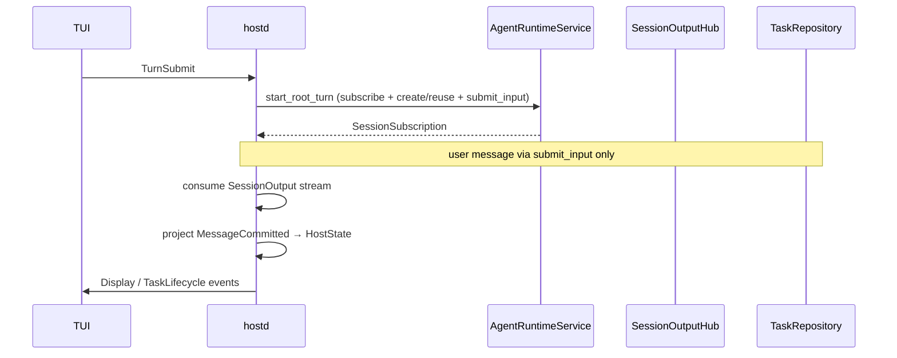

# Host Integration

> Status: current  
> Audience: hostd integrators

orchd is linked into hostd as an **in-process Rust library**. There is no RPC. Production turns use `AgentRuntime`; bootstrap uses `orchd::Runtime`.

Identity conventions: [`docs/agent-identity.md`](../../../docs/agent-identity.md)

## Crate surface for hostd

| Crate / module | When to use |
|---|---|
| `orchd-api` | Port traits and errors (`PersistSink`, `ToolProvider`, `AgentRuntime`, …) |
| `orchd::api` | Runtime commands via `AgentRuntimeService` |
| `orchd::Runtime` | Bootstrap, tool registration, approval wiring |
| `orchd::tools` | Host-bridge tool providers (`UserInteractionProvider`, …) |

Wire types (`OrchdConfig`, `AgentSpec`, `SubmitTaskInput`, …) come from `piko-protocol`.

## Bootstrap

Once per process (or per hostd instance):

```rust
let runtime = Runtime::bootstrap(model_executor, OrchdConfig {
    providers,
    agents,
    default_model,
    default_settings,
    runtime: Default::default(),
    thinking_level_map,
    sandbox,
}).await;

// MCP tools, approval gateway, user-interaction provider …
runtime.set_persist_sink(
    Arc::new(task_repository) as Arc<dyn PersistSink>
).await;

let agent_runtime = runtime.agent_runtime();
```

`Runtime::bootstrap` registers built-in tool providers (workspace, task_control, todo) and wires the internal `TaskControlPort` (for agent spawn/steer tools). **hostd does not call `TaskControlPort`.**

## Per-turn wiring

Each turn rebinds session-scoped ports before calling `start_root_turn`. Production pattern (`OrchTurnRunner`):

```rust
// Approval bridge (hostd ↔ TUI)
runtime.set_approval_gateway(Box::new(approval_gateway)).await;

// User-interaction tools (orchd::tools)
let user_provider = UserInteractionProvider::new();
user_provider.set_callbacks(UserInteractionCallbacks { … }).await;
runtime.register_tool_provider(Box::new(user_provider)).await;
runtime.register_tool_set(user_interaction_tool_set).await;

// System prompt + tool list for this turn
runtime.register_agent(root_agent_spec).await;

// Session-scoped durable storage
runtime.set_persist_sink(persist_sink).await;

let subscription = runtime
    .agent_runtime()
    .start_root_turn(…)
    .await?;
```

`set_persist_sink` and `register_agent` are idempotent per session/turn; hostd supplies the turn-specific `TaskRepository` shard and expanded system prompt.

## End-to-end turn flow



hostd **never** appends user messages directly to JSONL on the TurnSubmit path. Every user message goes through `submit_input` → `PersistSink::commit_message`.

## API mapping

### Root TurnSubmit

```text
TUI TurnSubmit
  → hostd expands templates / system prompt
  → start_root_turn(session, turn_id, work_id, "main", prompt, resume?)
      ├─ subscribe_session
      ├─ create_task(main) or reuse idle root
      └─ submit_input(root, prompt)
  → drain SessionSubscription until root is idle/terminal
  → project Event/Delta to TUI
```

```rust
let subscription = runtime.start_root_turn(
    &session_id,
    &turn_id,        // source_turn_id
    &work_id,
    "main",
    &prompt,
    resume_state,    // TaskResumeState from task shard, or None
    resume_task_id,
).await?;
```

hostd still calls `runtime.register_agent(root_spec)` each turn to inject the system prompt; this may move to session initialization later.

### Subsequent input

```rust
runtime.submit_input(build_user_input(
    &session_id,
    &task_id,
    &work_id,
    content,
    InputSource::User,
    Some(turn_id),
)).await?;
```

### Queue steer

Steer is not a separate control channel — it is `submit_input`:

```rust
runtime.submit_input(build_user_input(
    &session_id,
    &task_id,
    &work_id,
    MessageContent::String(message),
    InputSource::Task {
        task_id: source_task_id.into(),
        agent_id: source_agent_id.into(),
    },
    None,
)).await?;
```

The hostd queue only decides **when** to call `submit_input`, not how transcript mutation or persistence works.

### Spawn (agent tools, not hostd)

```text
parent spawn tool
  → create_task(child, parent_task_id)
  → submit_input(child, initial prompt)
  → optionally await work report
```

`spawn` vs `spawn_detached` differs only in whether the parent waits for the result; child initialization is identical. Handled internally by `TaskControlPort`; hostd observes child events on the same `SessionSubscription`.

### Task control

```rust
runtime.control_task(TaskControlRequest::CancelWork { request_id, task_id, work_id }).await?;
runtime.control_task(TaskControlRequest::Close { request_id, task_id }).await?;
runtime.control_task(TaskControlRequest::Terminate { request_id, task_id }).await?;
```

## Consuming SessionOutput

| Output | hostd action |
|---|---|
| `SessionOutput::Delta` | Project to `DisplayEvent` for TUI streaming |
| `SessionOutput::Event::TaskChanged` | Project to `TaskLifecycle`; update agent panel |
| `SessionOutput::Event::MessageCommitted` | Read committed message from `TaskRepository`; project to `HostState` (no JSONL write) |
| `SessionOutput::Event::ToolCommitted` | Same as above |

When `MessageCommitted` arrives, the durable write is already complete; hostd only projects into memory and updates manifest metadata.

Recommended reconnect flow (not yet fully implemented in hostd):

```text
session_snapshot → record cursor → subscribe_session(after = cursor)
```

## PersistSink implementation

hostd `TaskRepository` implements `orchd_api::PersistSink`:

- Per-task shard: `tasks/{task_id}.jsonl`
- Session manifest: `session.json`
- Per-task head and `task_seq` ordering

orchd awaits `PersistAck` at user input commit before entering an LLM step. Details: [persistence.md](persistence.md).

## Child tasks

Child tasks share the parent's session-scoped hub. hostd does not need a separate subscription per child; route by `task_id` / `agent_id` on the envelope.

## Known gaps

| Area | Status |
|---|---|
| `TurnCancel` | hostd updates in-memory Turn state only; not wired to `control_task(CancelWork)` |
| Session reconnect | snapshot + cursor resubscribe not implemented in hostd |
| `jsonl_repository::append_entry(Message)` | legacy direct-write path; TurnSubmit does not use it |

## Related reading

- [public-api.md](public-api.md) — full API contract
- [overview.md](overview.md) — architecture boundaries and design decisions
