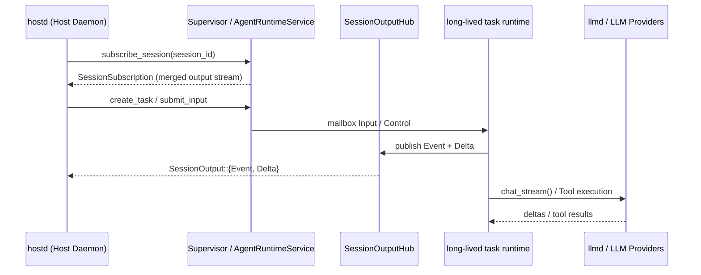

# orchd — Host ↔ Orchestrator interface

## Overview

orchd is a **Rust library** linked directly into hostd (same process). The interface is
a set of Rust function calls on `Supervisor` and `AgentRuntimeService`, not an RPC protocol.

Agent identity is defined in `docs/agent-identity.md`. orchd receives `AgentSpec` templates keyed by `agent_id` and creates runtime task instances keyed by `task_id`.



orchd doesn't know about sessions, users, auth, or the TUI. Production output flows through a **session-scoped `SessionOutputHub`**. hostd subscribes once per session and projects hub envelopes into TUI state.

## Configuration

### One-time: `Supervisor::from_config()`

```rust
let core = Supervisor::from_config(model_executor, OrchdConfig {
    providers: HashMap<String, ProviderConfig>,
    agents: HashMap<String, AgentSpec>,
    default_model: ModelRef,
    default_settings: ModelRunSettings,
    runtime: RuntimeConfig,
    sandbox: SandboxConfig,
    thinking_level_map: ThinkingLevelMap,
}).await;
```

### Session / Task Execution & Steering

For the first turn in a session, hostd calls `AgentRuntimeService::subscribe_session()` and then `create_task` + `submit_input` (or the convenience wrapper `run_streaming_subscription()`):

```rust
let subscription = core
    .run_streaming_subscription(&prompt, Some(OrchRunOptions {
        command: OrchRunCommandOptions {
            target_agent_id: Some("main".into()),
        },
        history: None,
        host_context: Some(HostTaskContext {
            session_id: "session_1".into(),
            turn_id: "turn_1".into(),
        }),
    }))
    .await;

// subscription.output: Stream<Item = Result<SessionOutputEnvelope, _>>
```

For subsequent turns, hostd reuses the long-lived root task by submitting more input:

```rust
let runtime = AgentRuntimeService::runtime_for(&core);
runtime.submit_input(build_user_input(
    session_id,
    task_id,
    work_id,
    content,
    InputSource::User,
)).await?;
```

This triggers `TaskEvent::Steered` and resumes the agent loop in the context of the same long-lived task instance.

## API surface

```rust
impl Supervisor {
    // ── Lifecycle ──
    pub async fn from_config(executor, config) -> Arc<Self>;
    pub async fn register_agent(&self, spec: AgentSpec);
    pub async fn unregister_agent(&self, agent_id: &str);

    // ── Task execution ──
    pub async fn run_streaming_subscription(&self, prompt, opts) -> SessionSubscription;
    pub async fn run(&self, prompt, opts) -> OrchRunResult;
    pub async fn spawn(&self, agent_id, prompt, ...) -> Option<AgentReport>;
    pub async fn spawn_detached(&self, agent_id, prompt, ...) -> String;
    pub async fn poll_task(&self, task_id) -> Option<AgentReport>;

    // ── Steering / control ──
    pub async fn steer_task(&self, task_id, message) -> bool;
    pub async fn cancel_task(&self, task_id, reason);
    pub async fn close_task(&self, task_id) -> bool;
    pub async fn reopen_task(&self, task_id) -> bool;

    // ── Tools ──
    pub async fn register_tool_set(&self, tool_set);
    pub async fn register_provider(&self, provider);

    // ── State ──
    pub async fn snapshot(&self) -> OrchState;
}

#[async_trait]
impl AgentRuntime for AgentRuntimeService {
    async fn create_task(&self, request: CreateTaskRequest) -> Result<TaskHandle, AgentApiError>;
    async fn submit_input(&self, request: SubmitTaskInput) -> Result<InputReceipt, AgentApiError>;
    async fn control_task(&self, request: TaskControlRequest) -> Result<TaskSnapshot, AgentApiError>;
    async fn subscribe_session(&self, request: SubscribeRequest) -> Result<SessionSubscription, AgentApiError>;
}
```

## Output contract

Production output uses `SessionOutput`:

| Lane | Type | Purpose |
|---|---|---|
| Reliable | `SessionOutput::Event` | Durable observations after `PersistSink` ack (`TaskChanged`, `MessageCommitted`, `ToolCommitted`) |
| Realtime | `SessionOutput::Delta` | Streaming UI deltas (`Text`, `Thinking`, `ToolCall`, `MessageStarted/Ended`) |

Legacy typed mpsc channels (`SessionChannels`, `DispatchSenders`) are removed. Tests may adapt hub subscriptions into `piko_protocol::ServerMessage` for assertions.

## Persistence

`TaskEventEmitter` commits through `PersistSink` before publishing reliable hub events. hostd implements `PersistSink` and remains the durable state authority.

## Child tasks

Child tasks share the same session-scoped hub (keyed by `session_id`). spawn/steer no longer pass sender bundles; events demux by `task_id` and `agent_id` on the subscription stream.

## Design principles

1. **Long-lived root tasks** — runtime handles stay registered until the agent stream ends.
2. **Session-scoped hub** — one fan-out point per session, not per turn.
3. **Command vs observation** — `submit_input` / `control_task` target `task_id`; `subscribe_session` scopes to `session_id`.
4. **orchd never touches env / keychain / filesystem config** — all from Host.
5. **Agent system prompts from Host** — orchd uses them as-is.
