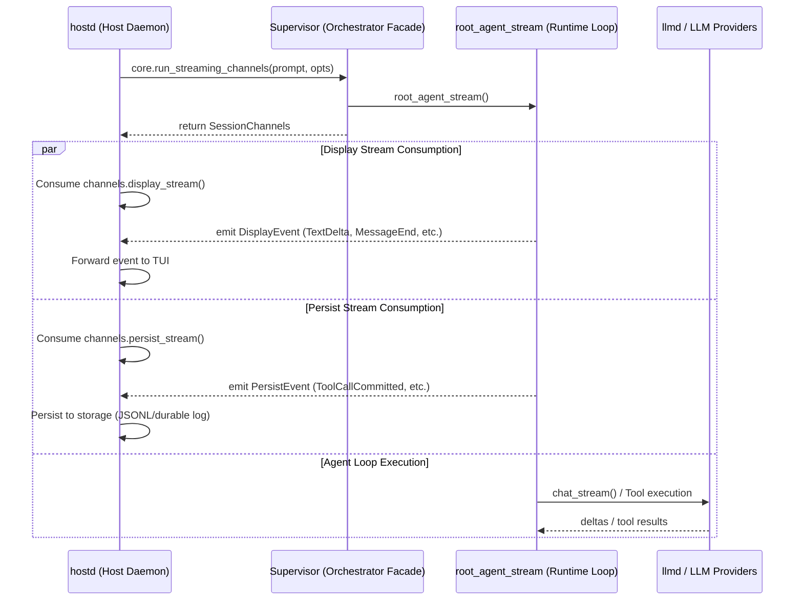

# orchd — Host ↔ Orchestrator interface

## Overview

orchd is a **Rust library** linked directly into hostd (same process). The interface is
a set of Rust function calls on `Supervisor` (also referenced as `OrchCore` in legacy designs), not an RPC protocol.

Agent identity is defined in `docs/agent-identity.md`. orchd receives `AgentSpec` templates keyed by `agent_id` and creates runtime task instances keyed by `task_id`.



orchd doesn't know about sessions, users, auth, or the TUI. It produces typed session channels (`SessionChannels`) containing display and persist event streams that hostd consumes.

## Configuration

### One-time: `Supervisor::from_config()`

```rust
let core = Supervisor::from_config(model_executor, OrchdConfig {
    providers: HashMap<String, ProviderConfig>,
    agents: HashMap<String, AgentSpec>,
    default_model: ModelRef,
    default_settings: ModelRunSettings,
    runtime: RuntimeConfig,
    sandbox: SandboxConfig,
    thinking_level_map: ThinkingLevelMap,
}).await;
```

### Session / Task Execution & Steering

For the first turn in a session, `core.run_streaming_channels()` is called to instantiate and run the root task (the `"main"` agent). This returns the initial `SessionChannels`:

```rust
let mut channels = core
    .run_streaming_channels(&prompt, Some(OrchRunOptions {
        command: OrchRunCommandOptions {
            target_agent_id: Some("main".into()),
        },
        history: None,
        host_context: Some(HostTaskContext {
            session_id: "session_1".into(),
            turn_id: "turn_1".into(),
        }),
    }))
    .await;

let mut display_stream = channels.display_stream().unwrap();
let mut persist_stream = channels.persist_stream().unwrap();

// Host spawns tasks to read streams concurrently
```

For subsequent turns, instead of calling `core.run_streaming_channels()` to create a new task, hostd reuses the long-lived root task by steering it:

```rust
// Inject subsequent user input to the existing running task
let steered = core.steer_task(
    &task_id,
    &source_task_id,
    &source_agent_id,
    &message
).await;
```

This triggers a `TaskEvent::Steered` and resumes the agent loop in the context of the same long-lived task instance.

No `subscribe()`, no `begin_run()` / `end_run()`, no channel setup needed.

## API surface

```rust
impl Supervisor {
    // ── Lifecycle ──
    pub async fn from_config(executor, config) -> Arc<Self>;
    pub async fn register_agent(&self, spec: AgentSpec);
    pub async fn unregister_agent(&self, agent_id: &str);

    // ── Task execution ──
    pub async fn run_streaming_channels(&self, prompt, opts) -> SessionChannels;
    pub async fn run_streaming(&self, prompt, opts) -> impl Stream<Item = Event>; // Legacy/Test wrapper
    pub async fn run(&self, prompt, opts) -> OrchRunResult;  // convenience: collects stream
    pub async fn spawn(&self, task) -> (TaskId, Option<Value>);
    pub async fn spawn_detached(&self, task) -> TaskId;
    pub async fn await_task(&self, task_id) -> Option<Value>;

    // ── Steering ──
    pub async fn steer_task(&self, task_id, source_task_id, source_agent_id, message) -> bool;
    pub async fn cancel_task(&self, task_id, reason);

    // ── Tools ──
    pub async fn register_tool_set(&self, tool_set);
    pub async fn register_provider(&self, provider);

    // ── State ──
    pub async fn snapshot(&self) -> OrchState;
    pub async fn get_graph(&self) -> GraphSnapshot;
}
```

## Event stream

orchd emits `piko_protocol::Event` variants. The full event vocabulary is defined in
`packages/protocol/src/event.rs`. Key event categories:

| Category | Events |
|---|---|
| Task lifecycle | `TaskCreated`, `TaskStarted`, `TaskCompleted`, `TaskFailed`, `TaskCancelled`, `TaskJoined` |
| Model output | `MessageStart`, `TextDelta`, `ThinkingDelta`, `MessageEnd`, `AssistantMessageCompleted` |
| Tool execution | `ToolStart`, `ToolEnd`, `ApprovalRequested`, `ApprovalResolved` |
| Steering | `TaskSteered` |
| Turn lifecycle | `TurnStarted`, `TurnCompleted`, `TurnFailed` |
| Transcript | `TaskTranscriptCommitted`, `ToolResultCommitted` |

Events are produced directly by the agent loop via `yield` in the `stream!` macro —
no event sink, no listener registry, no channel bridge.

## Steering

Steer messages (follow-up instructions from user or parent agent) are sent
through an `mpsc::UnboundedSender<SteerMessage>` stored on `Supervisor` per-run.
The agent loop drains this channel at the start of each step:

```rust
// Inside stream! macro:
while let Ok(msg) = steer_rx.try_recv() {
    transcript.push(Message::User { ... });
    yield Event::TaskSteered { ... };
}
```

## Child tasks

When a tool spawns a sub-task (`spawn_detached`), the child runs as a `tokio::spawn`-ed
task. Child events are forwarded to the parent's `child_tx` channel, and the parent
drains `child_rx` in its main loop. (Full event forwarding for child tasks is pending.)

## Design principles

1. **No actors, no spawn inside orchd** — agent execution is poll-driven via Stream.
2. **Single Stream chain** — events flow LLM → agent → hostd → TUI without channel bridges.
3. **orchd never touches env / keychain / filesystem config** — all from Host.
4. **orchd doesn't know about sessions / users / projects** — only processes Tasks.
5. **Agent system prompts from Host** — orchd uses them as-is.
