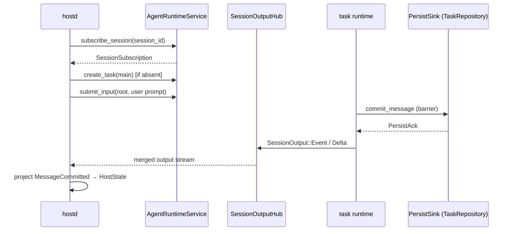

# orchd — Host ↔ Orchestrator interface

> Canonical design: [`docs/agent-runtime-api-design.md`](../../../docs/agent-runtime-api-design.md)

orchd is a **Rust library** linked directly into hostd (same process). Production turn
execution and observation go through the **Agent Runtime API** (`orchd::api::AgentRuntime`).
Bootstrap wiring (model gateway, tool registry, persist sink) uses `orchd::host`.

Agent identity is defined in `docs/agent-identity.md`. orchd receives `AgentSpec`
templates keyed by `agent_id` and creates runtime task instances keyed by `task_id`.

## Crate surface

| Module | Audience | Purpose |
|---|---|---|
| `orchd::api` | hostd turn path | `AgentRuntime`, `AgentRuntimeService`, `SessionSubscription`, command/receipt types |
| `orchd::host` | hostd bootstrap | `Supervisor::from_config`, tool registry, approval/user-interaction ports, `build_user_input` |
| `orchd::integration` | hostd storage | `PersistSink` contract implemented by `TaskRepository` |
| `orchd::testing` | tests | `CollectingPersistSink`, test helpers |

Wire/config DTOs (`OrchdConfig`, `AgentSpec`, `SubmitTaskInput`, …) live in
`piko-protocol`. orchd does not re-export runtime internals to hostd.

## End-to-end flow



hostd **never** appends user messages to JSONL directly. Every user-role transcript
mutation flows through `submit_input` → `PersistSink::commit_message`.

## Bootstrap (once per process)

hostd constructs a long-lived `Supervisor` for model/tool wiring, then drives turns
through `AgentRuntimeService`:

```rust
let supervisor = Supervisor::from_config(model_executor, OrchdConfig {
    providers,
    agents,
    default_model,
    default_settings,
    runtime: Default::default(),
    thinking_level_map,
    sandbox,
}).await;

// MCP, approval gateway, user-interaction provider registration …
supervisor.set_persist_sink(Arc::new(task_repository) as Arc<dyn PersistSink>).await;

let runtime = AgentRuntimeService::new(Arc::clone(&supervisor));
```

`Supervisor::from_config` registers built-in tool providers (workspace, task_control,
todo) and wires `TaskControlPort` for **in-process agent tools** (`spawn`, `steer_task`,
`poll_task`). hostd itself should not call `TaskControlPort`; it uses `AgentRuntime`.

## Turn execution

### First / resumed root turn

hostd uses the inherent helper `AgentRuntimeService::start_root_turn`, which composes
the public API:

```text
subscribe_session(session_id)
  → reuse idle root task OR create_task(main, resume?)
  → submit_input(root, prompt, source_turn_id, work_id)
```

```rust
let subscription = runtime.start_root_turn(
    &session_id,
    &turn_id,       // source_turn_id
    &work_id,
    "main",
    &prompt,
    resume_state,   // TaskResumeState from task shard, or None
    resume_task_id, // existing root task_id when resuming
).await?;
```

Consume `subscription.output` until the root task reaches a terminal idle state for
this turn. Project `SessionOutput::Event` (`TaskChanged`, `MessageCommitted`,
`ToolCommitted`) and `SessionOutput::Delta` into TUI display state.

### Subsequent input on an existing task

```rust
runtime.submit_input(build_user_input(
    &session_id,
    &task_id,
    &work_id,
    MessageContent::String(text),
    InputSource::User,
    Some(turn_id),
)).await?;
```

### Queue steer (hostd → running task)

Steer is **not** a separate control channel. It is another `submit_input`:

```rust
runtime.submit_input(build_user_input(
    &session_id,
    &task_id,
    &work_id,
    MessageContent::String(message),
    InputSource::Task { task_id: source_task_id, agent_id: source_agent_id },
    None,
)).await?;
```

Use `orchd::host::build_user_input` to allocate `request_id`, `message_id`, and
`InputDelivery::AfterCurrentStep`.

### Task control

Lifecycle commands use `control_task`, not ad-hoc supervisor methods:

```rust
runtime.control_task(TaskControlRequest::CancelWork { request_id, task_id, work_id }).await?;
runtime.control_task(TaskControlRequest::Close { request_id, task_id }).await?;
runtime.control_task(TaskControlRequest::Terminate { request_id, task_id }).await?;
```

## AgentRuntime trait

```rust
#[async_trait]
pub trait AgentRuntime: Send + Sync {
    async fn create_task(&self, request: CreateTaskRequest) -> Result<TaskHandle, AgentApiError>;
    async fn submit_input(&self, request: SubmitTaskInput) -> Result<InputReceipt, AgentApiError>;
    async fn control_task(&self, request: TaskControlRequest) -> Result<TaskSnapshot, AgentApiError>;
    async fn task_snapshot(&self, task_id: String) -> Result<TaskSnapshot, AgentApiError>;
    async fn session_snapshot(&self, session_id: String) -> Result<SessionRuntimeSnapshot, AgentApiError>;
    async fn subscribe_session(&self, request: SubscribeRequest) -> Result<SessionSubscription, AgentApiError>;
}
```

`AgentRuntimeService` also exposes:

- `start_root_turn(...)` — hostd turn bootstrap (subscribe + create/reuse + first input)
- `runtime_for(&Supervisor)` — obtain a service handle from an existing supervisor

## Observation contract

Production output uses `SessionOutput`:

| Lane | Variant | Purpose |
|---|---|---|
| Reliable | `SessionOutput::Event` | Post-`PersistSink` facts: `TaskChanged`, `MessageCommitted`, `ToolCommitted` |
| Realtime | `SessionOutput::Delta` | Streaming UI deltas; may be dropped under lag |

Legacy typed mpsc fan-in (`SessionChannels`, `DispatchSenders`, `Stream<Item = Event>` per
run) is removed. Tests may adapt hub subscriptions into wire events for assertions.

Recommended reconnect flow (not yet fully implemented in hostd):

```text
session_snapshot → record cursor → subscribe_session(after = cursor)
```

## Persistence

`TaskEventEmitter` commits through `PersistSink` before publishing reliable hub events.
hostd implements `PersistSink` via `TaskRepository` and remains the durable state authority.
orchd owns transcript mutation decisions; hostd owns durability.

## Child tasks

Child tasks share the parent session hub. Agent tools create children through
`TaskControlPort` internally (`create_task` + `submit_input`). hostd observes all tasks
on the same `SessionSubscription` filtered by `task_id` when needed.

## Supervisor helpers (tests and tooling only)

`Supervisor` still exposes convenience wrappers used by integration tests and sync
tooling. **hostd production code should not call these** — use `AgentRuntime` instead.

| Method | Underlying API |
|---|---|
| `Supervisor::run` | `start_root_turn` + drain stream |
| `Supervisor::spawn` / `spawn_detached` | `TaskControlPort` → `create_task` + `submit_input` |
| `Supervisor::steer_task` | `TaskControlPort` → `submit_input` |
| `Supervisor::poll_task` | registry result cache |
| `Supervisor::snapshot` | in-memory supervisor state (not durable recovery) |

Multi-agent tool implementations (`TaskControlProvider`) continue to use
`TaskControlPort`; that port is an internal adapter, not the host-facing contract.

## Design principles

1. **One input path** — all user-role transcript writes go through `submit_input`.
2. **Session-scoped observation** — one hub per session; events carry `task_id`.
3. **Command vs observation** — mutations target `task_id`; streams scope to `session_id`.
4. **Persist barrier** — no LLM step until `PersistSink` acks the user message.
5. **hostd owns config/auth/filesystem** — orchd receives assembled `AgentSpec` and context.
