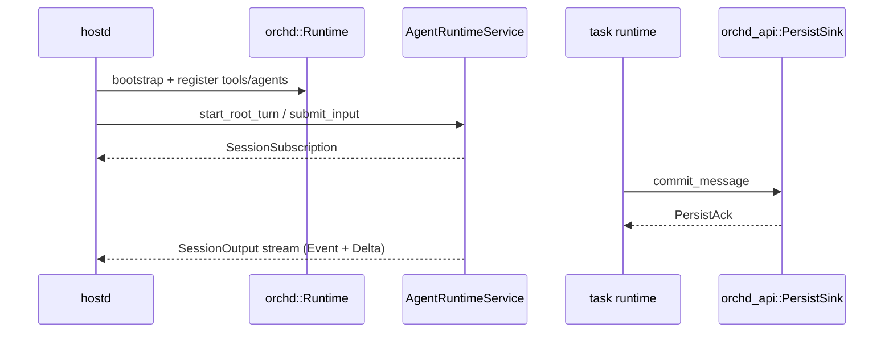

# Overview

> Status: current  
> Audience: both

## What orchd is

orchd is piko's **agent runtime**: a Rust library linked into hostd in the same process. It owns:

- Long-lived task instance execution and supervision
- Transcript mutation (what enters message history)
- LLM steps and tool execution
- Multi-agent delegation (spawn / steer / poll)
- Session-scoped observation output (reliable events + realtime deltas)

orchd does **not** own:

- User auth, API keys, or filesystem configuration
- Durable session / JSONL storage (hostd implements `PersistSink`)
- TUI rendering or session tree projection
- Turn-level user interaction state (hostd / TUI)

## Architecture split

```text
hostd   session storage, user-visible state, recovery projection, Turn lifecycle
orchd   task runtime, transcript mutation, LLM/tools, multi-agent execution
```

- `agent_id` — static AgentSpec template
- `task_id` — long-lived runtime instance (main and child tasks share the same execution chain)

Main and all child tasks use the **same Agent API**. Initial prompts and subsequent steers both go through `submit_input`.

## Goals

1. Every user-role transcript mutation produces exactly one durable committed message.
2. Lifecycle, display, persist, and command acknowledgement semantics stay strictly separated.
3. Production hub and test sinks share the same business logic — no `senders=None` branch.
4. The API supports idempotency, ordering checks, persistence failure, and runtime recovery.
5. orchd is the transcript mutation authority; hostd is the durable state authority.

## Non-goals

- Changing the basic TUI interaction model or spawn / steer / poll user semantics.
- Making orchd the durable state authority.
- Maintaining session tree or agent panel projection inside orchd.

## Layering (conceptual)

```text
orchd-api    →  public contract (traits, ports, errors) — integrator dependency
orchd::api   →  re-exports orchd-api + AgentRuntimeService
bootstrap    →  Runtime::bootstrap (in-process wiring)
tools        →  host-bridge tool providers (e.g. user interaction)
application  →  create / submit / control / observe use-case orchestration
domain       →  pure objects and state rules (no I/O)
runtime      →  per-task execution chain (mailbox, step, tools, events)
ports        →  external capability interfaces (implemented in orchd)
adapters     →  port implementations
```

Serializable DTOs live in `piko-protocol`. Runtime traits and side-effect ports live in **`orchd-api`**. The **`orchd`** crate provides the default implementation.

## End-to-end flow



Commands target `task_id`. Observation subscribes at `session_id` scope.

## Design decisions

These constraints apply to all implementation and code review:

**Steer is not a special API** — it is `submit_input` to an existing task.

**Initial prompt is not in create_task** — it is the task's first committed user message:

```text
create_task(child) → submit_input(child, prompt)
```

**Persist sent ≠ durable** — a user message must receive `PersistAck` before an LLM step runs.

**Transcript is keyed by task_id** — there is no agent-level shard; runtime, recovery, and ordering all use `task_id`.

**Command path**

```text
Agent API → command → task mailbox → commit_input
  → PersistSink → transcript → step runtime
```

**Observation path**

```text
TaskRuntime → SessionOutputHub → SessionOutputStream → hostd → client
  (Event reliable, Delta best-effort)
```

## Related reading

- [core-model.md](core-model.md) — objects and ownership
- [public-api.md](public-api.md) — API contract
- [host-integration.md](host-integration.md) — how hostd calls orchd
