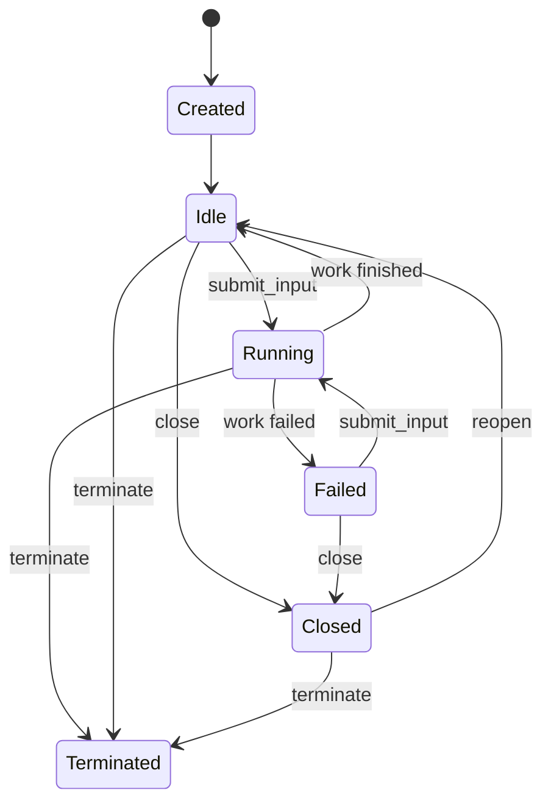
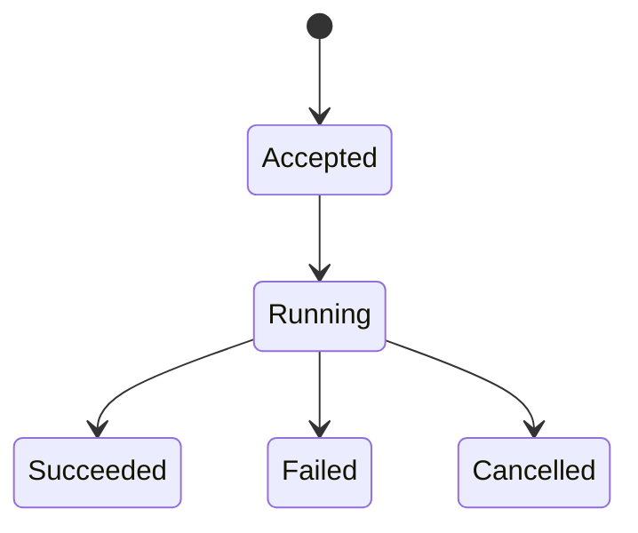

# Task Runtime

> Status: current  
> Audience: orchd contributors

How a single task accepts input, commits transcript mutations, runs model/tool steps, and applies control commands.

## Mailbox

Each task runtime receives messages through a unified mailbox:

```rust
pub(crate) enum TaskMailboxMessage {
    Input(TaskInputEnvelope),
    Control(TaskControlEnvelope),
}
```

The mailbox handles receive, queueing, delivery policy, and acknowledgement — it does **not** mutate the transcript directly.

Application-layer `submit_input` and `control_task` commands locate the task handle and enqueue mailbox messages; they do not call the LLM or write JSONL.

## Input commit (single path)

Initial prompt, root follow-up, child steer, and queue steer all use the same commit pipeline inside the task runtime:

```text
validate identity and task state
  → deduplicate request_id / message_id
  → build Message::User
  → allocate next task_seq
  → request durable commit (PersistSink)
  → await PersistAck
  → append to in-memory transcript
  → create or start work
  → return InputReceipt to caller
  → run LLM step(s)
```

On persistence failure:

- Do not append to the in-memory transcript.
- Do not start an LLM step.
- Return `AgentApiError::PersistenceFailed`.
- Retries must reuse the same `request_id` and `message_id`.

## Command vs runtime responsibilities

| Layer | Responsibility |
|---|---|
| `application/commands/submit_input` | Validate API request, locate handle, send mailbox message, await receipt |
| `runtime/task/input` | Commit user message, persist barrier, transcript append |
| `runtime/task/orchestrator` | Main loop: mailbox → step → tools → idle |
| `application/supervision` | Task handle registry, launcher, driver — **no transcript ownership** |

The supervisor manages runtime handles and live status projection. It does not own transcript content or interpret input payloads.

## Task state machine

Long-lived runtime handle:



- `Close` rejects new input; `Reopen` restores acceptance.
- `Terminate` ends the runtime handle permanently.
- Task failure from one work does not destroy the task; new input can start a new work.

## Work state machine

Single input-driven execution cycle:



- `CancelWork` aborts the current work only — not the task, not the Turn, not sibling tasks.
- Work status is distinct from Turn completion (hostd) and Task termination.

## Main loop (conceptual)

```text
loop {
    wait for mailbox message or step completion
    Input  → commit_input → run step cycle(s) → idle or continue tools
    Control → apply close / reopen / cancel_work / terminate
}
```

One model step:

```text
transcript snapshot → model gateway → consume stream
  → assemble assistant message + tool calls
  → persist assistant/tool facts
  → publish Event + Delta
  → execute tools if needed → next step or idle
```

## Multi-agent input (internal)

Agent spawn/steer tools use `TaskControlPort`, which internally calls the same `create_task` + `submit_input` APIs. hostd does not call this port directly.

```text
spawn tool → create_task(child) → submit_input(child, prompt)
steer tool → submit_input(task, message)
```

## Lifecycle vs transcript

`TaskEvent::Created.prompt` and steer audit fields may exist for compatibility, but **must not** be used for transcript recovery.

Correct relationship:

```text
submit_input
  ├─ MessageCommitted (Message::User)   ← recovery source
  └─ TaskChanged / lifecycle metadata   ← notification only
```

## Related reading

- [persistence.md](persistence.md) — PersistSink barrier and ordering
- [events-and-observation.md](events-and-observation.md) — output after commit
- [public-api.md](public-api.md) — command surface
