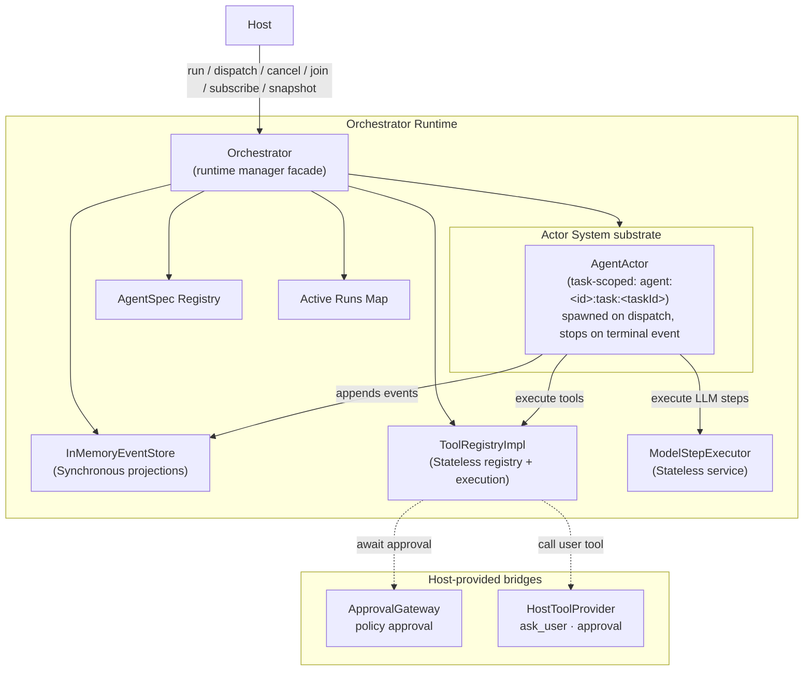

# Orchestrator

Orchestrator is piko's actor-first agent runtime.

It is the layer between Host and the LLM. Host owns UI, sessions,
settings, auth, and persistence. The ModelStepExecutor (internal subsystem)
handles one LLM step. Orchestrator owns agents, tasks, actor coordination,
tool routing, event state, and graph projection. Tool execution is
handled by the stateless `ToolRegistryImpl`, while runtime user approval is requested through
the Host-provided ApprovalGateway.

The current design features a task-scoped model where AgentActor is spawned per task.

## Two-layer structure

```text
Business actors  (AgentActor)
        │  built on
        ▼
Actor kernel     (Mailbox, Envelope, spawn/send/ask/stop)
```

- **Kernel** (`kernel/`) — generic, zero piko-specific imports. Provides the execution substrate: per-actor mailboxes, message envelopes with correlation IDs for `ask()` request-response, spawn/stop lifecycle.
- **Business actors** (`actors/`) — piko-specific runtime behavior built on the kernel.
  - **`AgentActor`** — Stateful, task-scoped agent actor spawned per run/task. Runs the step engine loop and model calls sequentially, while handling control messages (like cancellation) via its mailbox.
- **Services & Helpers**:
  - **`EventStore`** — Synchronous event-sourced registry and store for tracking orchestrator-wide states (agents, tasks, plans, tools).
  - **`ToolRegistry` (`ToolRegistryImpl`)** — Stateless registry and execution bridge for tools, handling schema generation, permission mapping, approval gateway, and lifecycle events. Both discovery (`discoverTools()`) and execution (`executeTool()`) live on the same class.
  - **`ModelStepExecutor`** — Stateless wrapper for standard chat model calls.

## Core Direction

- Use a generic actor kernel as the execution substrate.
- Support concurrent work across actors while keeping each actor internally
  sequential.
- Keep the public Orchestrator facade thin.
- Put runtime behavior in actors (specifically task-scoped AgentActors).
- Use `async/await` as the pause/resume mechanism for waiting on tools,
  Host/user input, subagents, and state ingestion.
- Model public state with a synchronous `EventStore`, driven by events emitted by AgentActor.
- Keep Host out of actor internals.
- Keep ModelStepExecutor (internal) stateless and step-oriented.

## Architecture



The `kernel/` layer must not import engine, host, or piko-specific agent types.
Business actors live above the kernel.

## Design Docs

- [Architecture](docs/architecture.md) - boundaries and facade shape.
- [Actor Kernel](docs/actor-kernel.md) - actor IDs, envelopes, mailbox semantics,
  communication, failure, cancellation.
- [Actors](docs/actors/) - AgentActor, subagents, and control loop. (Legacy docs cover MainActor, StateActor; ToolActor has been replaced by stateless `ToolRegistryImpl` — see [tools/](docs/tools/)).
- [Tools](docs/tools/) - ToolProvider, ToolSet, and execution flow.
- [Events And State](docs/events-and-state.md) - OrchestratorEvent,
  InMemoryEventStore, event ingestion, reducer, snapshot, graph.
- [Host Integration](docs/host-integration.md) - Host responsibilities and
  forbidden coupling.

## ModelStepExecutor

The orchestrator's model interaction is through the `ModelStepExecutor`
interface (internal subsystem). See [docs/model-step-executor.md](docs/model-step-executor.md).

The `ModelStepExecutor` may have local/native/remote implementations, but
that is **not** the runtime protocol boundary. The orchestrator's remote
boundary is its public API (registerAgent, run, subscribe, snapshot).

## Public API

```ts
export interface Orchestrator {
  // Agent management
  registerAgent(spec: AgentSpec): void;
  unregisterAgent(agentId: string): void;

  // ToolSet & provider registration
  registerToolSet(toolSet: ToolSet): void;
  unregisterToolSet(toolSetId: string): void;
  registerProvider(provider: ToolProvider): void;

  // Configuration
  setModelConfig(config: OrchModelConfig): void;
  setApprovalGateway(gateway: ApprovalGateway | undefined): void;

  // Task execution
  run(prompt: string, opts?: OrchRunOptions): Promise<OrchRunResult>;
  dispatch(task: AgentTask): Promise<AgentTaskId>;       // fire-and-forget
  dispatchDetached(task: AgentTask): Promise<AgentTaskId>; // fire-and-forget, retain for join
  cancelTask(taskId: string, reason?: string): Promise<void>;

  // Subagent delegation (used by OrchToolProvider)
  delegateToAgent(task: AgentTask): Promise<{ taskId: string; result: unknown }>;
  delegateDetached(task: AgentTask): Promise<string>;
  joinTask(taskId: string): Promise<unknown>;

  // Plan updates
  updatePlan(agentId: string, taskId: string, plan: unknown[]): void;

  // State & events
  subscribe(listener: HostEventListener): () => void;
  snapshot(): OrchState;
  getGraph(): Promise<{
    nodes: Array<{ id: string; label: string; kind: string; status?: string }>;
    edges: Array<{ from: string; to: string; label?: string }>;
  }>;
}
```

The Orchestrator facade serves as the dependency injection root, assembling
services (ToolRegistryImpl, InMemoryEventStore, ModelStepExecutor) and launching
task-scoped `AgentActor`s into the actor kernel substrate for each incoming task.

The facade is a plain class — there is no `orchestrator:main` actor. Public API
calls are **direct method calls**, not actor messages.
